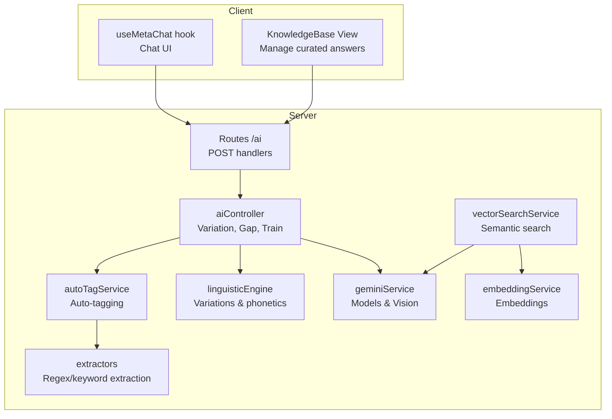
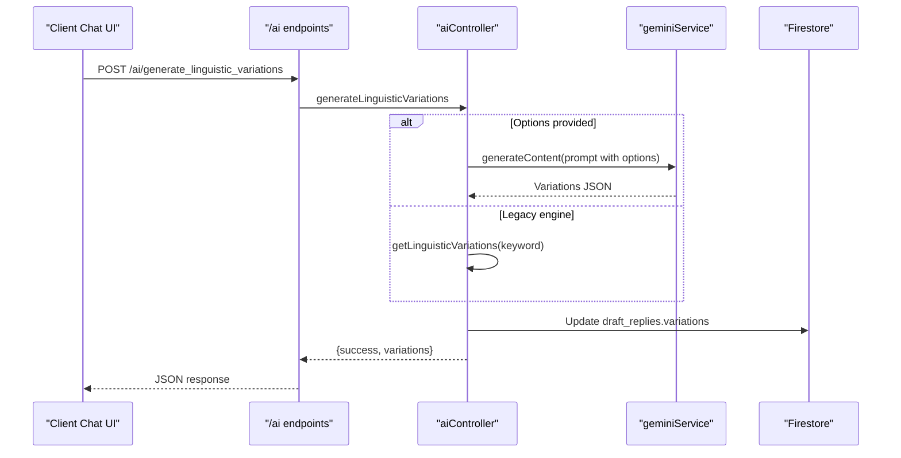
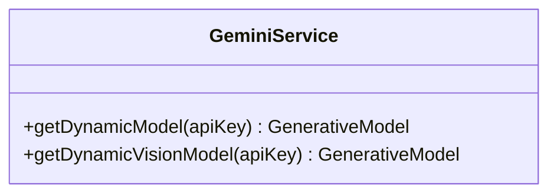
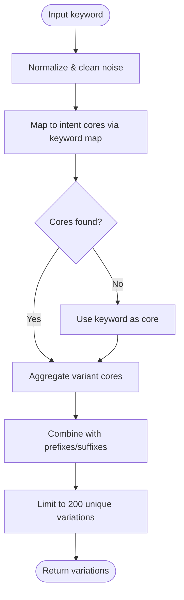
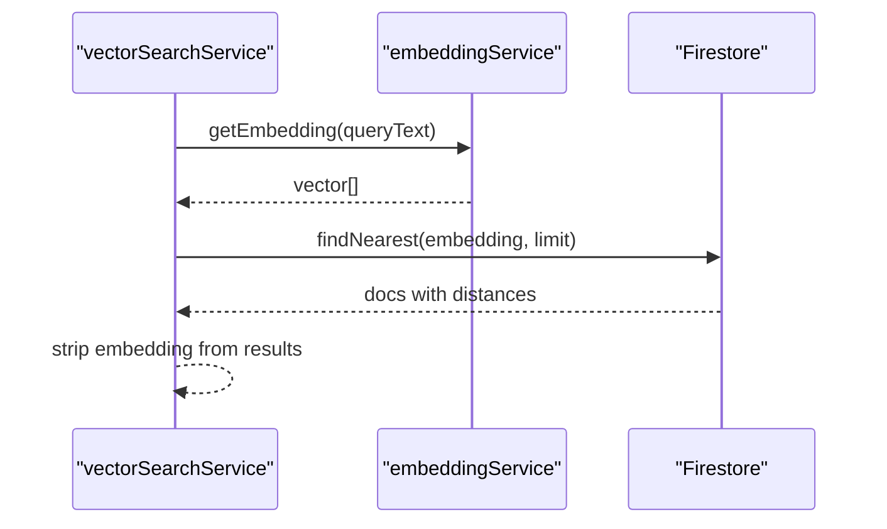
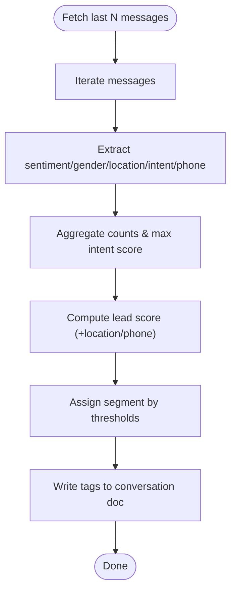
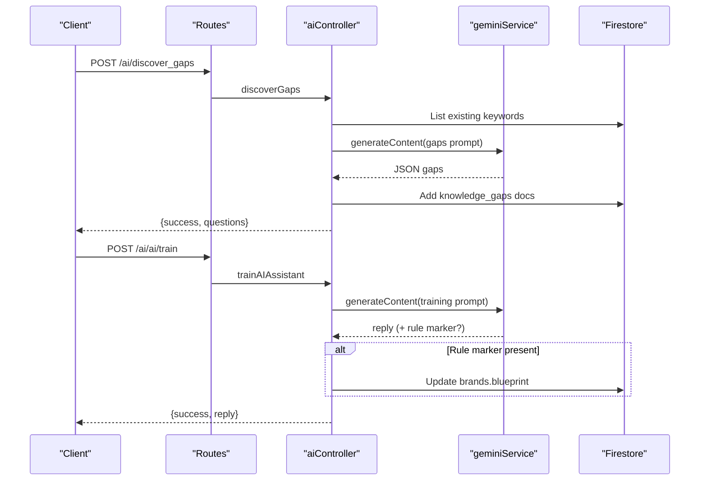
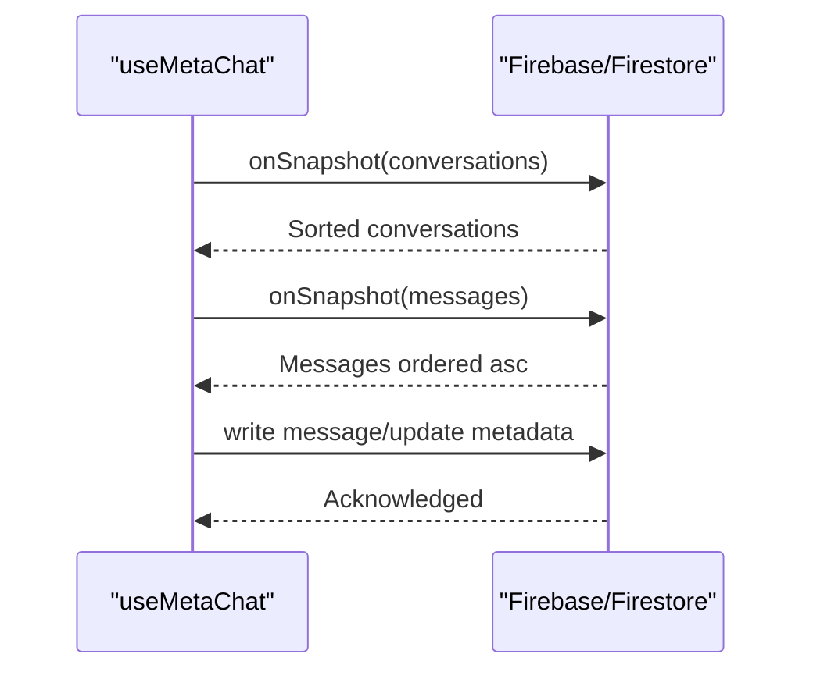
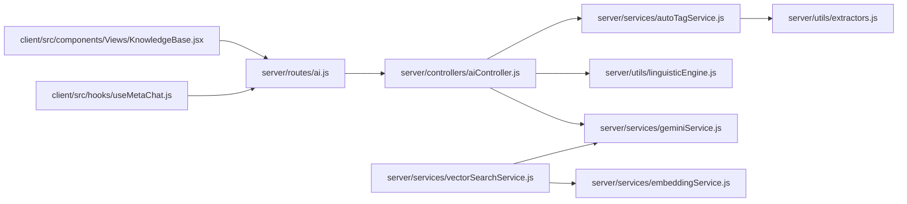

# AI and Machine Learning

<cite>
**Referenced Files in This Document**
- [geminiService.js](file://server/services/geminiService.js)
- [linguisticEngine.js](file://server/utils/linguisticEngine.js)
- [embeddingService.js](file://server/services/embeddingService.js)
- [vectorSearchService.js](file://server/services/vectorSearchService.js)
- [autoTagService.js](file://server/services/autoTagService.js)
- [extractors.js](file://server/utils/extractors.js)
- [aiController.js](file://server/controllers/aiController.js)
- [ai.js](file://server/routes/ai.js)
- [useMetaChat.js](file://client/src/hooks/useMetaChat.js)
- [KnowledgeBase.jsx](file://client/src/components/Views/KnowledgeBase.jsx)
</cite>

## Table of Contents
1. [Introduction](#introduction)
2. [Project Structure](#project-structure)
3. [Core Components](#core-components)
4. [Architecture Overview](#architecture-overview)
5. [Detailed Component Analysis](#detailed-component-analysis)
6. [Dependency Analysis](#dependency-analysis)
7. [Performance Considerations](#performance-considerations)
8. [Troubleshooting Guide](#troubleshooting-guide)
9. [Conclusion](#conclusion)
10. [Appendices](#appendices)

## Introduction
This document explains the AI and machine learning capabilities integrated into the platform, focusing on Google Gemini, natural language processing (NLP), knowledge base management, vector search, and conversational intelligence. It covers:
- Knowledge base management and curated responses
- Automated response generation and linguistic variation generation
- Learning mode via rule capture from brand owners
- Linguistic engine for intent detection and phonetic normalization
- Sentiment analysis and auto-tagging for customer profiles
- Vector search and embeddings for semantic search
- Frontend integration for chat and knowledge base curation
- Guidance on training, customization, performance, ethics, and quality assurance

## Project Structure
The AI stack spans the server (Node.js) and client (React) layers:
- Server exposes AI endpoints, manages Gemini models, generates embeddings, performs vector search, and auto-tags conversations.
- Client integrates chat UX, listens to Firestore conversations, and surfaces knowledge base content.

**Diagram sources**
- [ai.js:1-37](file://server/routes/ai.js#L1-L37)
- [aiController.js:1-167](file://server/controllers/aiController.js#L1-L167)
- [geminiService.js:1-35](file://server/services/geminiService.js#L1-L35)
- [embeddingService.js:1-24](file://server/services/embeddingService.js#L1-L24)
- [vectorSearchService.js:1-62](file://server/services/vectorSearchService.js#L1-L62)
- [autoTagService.js:1-118](file://server/services/autoTagService.js#L1-L118)
- [extractors.js:1-154](file://server/utils/extractors.js#L1-L154)
- [linguisticEngine.js:1-144](file://server/utils/linguisticEngine.js#L1-L144)
- [useMetaChat.js:1-245](file://client/src/hooks/useMetaChat.js#L1-L245)
- [KnowledgeBase.jsx:1-163](file://client/src/components/Views/KnowledgeBase.jsx#L1-L163)

**Section sources**
- [ai.js:1-37](file://server/routes/ai.js#L1-L37)
- [aiController.js:1-167](file://server/controllers/aiController.js#L1-L167)
- [geminiService.js:1-35](file://server/services/geminiService.js#L1-L35)
- [embeddingService.js:1-24](file://server/services/embeddingService.js#L1-L24)
- [vectorSearchService.js:1-62](file://server/services/vectorSearchService.js#L1-L62)
- [autoTagService.js:1-118](file://server/services/autoTagService.js#L1-L118)
- [extractors.js:1-154](file://server/utils/extractors.js#L1-L154)
- [linguisticEngine.js:1-144](file://server/utils/linguisticEngine.js#L1-L144)
- [useMetaChat.js:1-245](file://client/src/hooks/useMetaChat.js#L1-L245)
- [KnowledgeBase.jsx:1-163](file://client/src/components/Views/KnowledgeBase.jsx#L1-L163)

## Core Components
- Google Gemini integration: dynamic model selection for text and vision, with API key validation and error handling.
- Linguistic engine: phonetic normalization, noise filtering, and combinatorial variation generation for intent coverage.
- Embedding and vector search: semantic similarity retrieval using Firestore vector fields.
- Auto-tagging: deterministic extraction of sentiment, gender, location, campaign, phone presence, and intent scores.
- AI controller: endpoints for generating variations, discovering knowledge gaps, and training the AI assistant with rule capture.
- Client chat and knowledge base: real-time chat UX and curated knowledge management UI.

**Section sources**
- [geminiService.js:1-35](file://server/services/geminiService.js#L1-L35)
- [linguisticEngine.js:1-144](file://server/utils/linguisticEngine.js#L1-L144)
- [embeddingService.js:1-24](file://server/services/embeddingService.js#L1-L24)
- [vectorSearchService.js:1-62](file://server/services/vectorSearchService.js#L1-L62)
- [autoTagService.js:1-118](file://server/services/autoTagService.js#L1-L118)
- [extractors.js:1-154](file://server/utils/extractors.js#L1-L154)
- [aiController.js:1-167](file://server/controllers/aiController.js#L1-L167)
- [useMetaChat.js:1-245](file://client/src/hooks/useMetaChat.js#L1-L245)
- [KnowledgeBase.jsx:1-163](file://client/src/components/Views/KnowledgeBase.jsx#L1-L163)

## Architecture Overview
The AI pipeline connects frontend interactions to backend services and Gemini APIs, enabling:
- Curated knowledge base storage and retrieval
- Dynamic linguistic variations for training
- Semantic search over embedded knowledge
- Auto-tagging for customer profiling
- Learning mode for brand-specific instructions

**Diagram sources**
- [ai.js:1-37](file://server/routes/ai.js#L1-L37)
- [aiController.js:28-63](file://server/controllers/aiController.js#L28-L63)
- [geminiService.js:1-35](file://server/services/geminiService.js#L1-L35)

## Detailed Component Analysis

### Google Gemini Integration
- Dynamic model selection supports text and vision models with API key validation.
- Throws explicit errors for missing or invalid keys.
- Provides a stable model for general use and a vision-capable model for multimodal tasks.

**Diagram sources**
- [geminiService.js:1-35](file://server/services/geminiService.js#L1-L35)

**Section sources**
- [geminiService.js:1-35](file://server/services/geminiService.js#L1-L35)

### Linguistic Engine and Intent Detection
- Phonetic normalization converts native scripts to a phonetically aligned ASCII space for robust fuzzy matching.
- Noise removal and keyword mapping build a core keyword map for intent categories.
- Generates permutations with conversational wrappers and phonetic variants, capped for SEO and typo coverage.

**Diagram sources**
- [linguisticEngine.js:1-144](file://server/utils/linguisticEngine.js#L1-L144)

**Section sources**
- [linguisticEngine.js:1-144](file://server/utils/linguisticEngine.js#L1-L144)

### Embedding Services and Semantic Search
- Embedding generation uses a dedicated embedding model and falls back to a zero-vector on failure.
- Vector search queries Firestore using a vector index on the embedding field with cosine distance.

**Diagram sources**
- [embeddingService.js:1-24](file://server/services/embeddingService.js#L1-L24)
- [vectorSearchService.js:1-62](file://server/services/vectorSearchService.js#L1-L62)

**Section sources**
- [embeddingService.js:1-24](file://server/services/embeddingService.js#L1-L24)
- [vectorSearchService.js:1-62](file://server/services/vectorSearchService.js#L1-L62)

### Auto-Tagging System and Deterministic Extractors
- Aggregates signals from recent messages to tag sentiment, gender, location, campaign, phone presence, and intent.
- Computes a lead score and assigns a segment heuristic.
- Writes tags to the conversation document.

**Diagram sources**
- [autoTagService.js:1-118](file://server/services/autoTagService.js#L1-L118)
- [extractors.js:1-154](file://server/utils/extractors.js#L1-L154)

**Section sources**
- [autoTagService.js:1-118](file://server/services/autoTagService.js#L1-L118)
- [extractors.js:1-154](file://server/utils/extractors.js#L1-L154)

### AI Controller: Variations, Gaps, and Training
- Generates linguistic variations either via Gemini or the legacy engine.
- Discovers knowledge gaps and persists suggested questions.
- Trains the AI assistant with brand-specific instructions, capturing rules appended to brand blueprints.

**Diagram sources**
- [ai.js:1-37](file://server/routes/ai.js#L1-L37)
- [aiController.js:65-159](file://server/controllers/aiController.js#L65-L159)
- [geminiService.js:1-35](file://server/services/geminiService.js#L1-L35)

**Section sources**
- [aiController.js:1-167](file://server/controllers/aiController.js#L1-L167)
- [ai.js:1-37](file://server/routes/ai.js#L1-L37)

### Frontend Integration: Chat and Knowledge Base
- Real-time chat listener with optimistic updates and fallback ordering when Firestore indexes are unavailable.
- Knowledge base view for editing and deleting curated answers.

**Diagram sources**
- [useMetaChat.js:1-245](file://client/src/hooks/useMetaChat.js#L1-L245)

**Section sources**
- [useMetaChat.js:1-245](file://client/src/hooks/useMetaChat.js#L1-L245)
- [KnowledgeBase.jsx:1-163](file://client/src/components/Views/KnowledgeBase.jsx#L1-L163)

## Dependency Analysis
- Controllers depend on Gemini service for model generation and on local utilities for linguistic generation.
- Vector search depends on embedding service and Firestore vector index.
- Auto-tagging depends on extractors and Firestore conversation collections.
- Routes bind UI actions to controllers.

**Diagram sources**
- [ai.js:1-37](file://server/routes/ai.js#L1-L37)
- [aiController.js:1-167](file://server/controllers/aiController.js#L1-L167)
- [geminiService.js:1-35](file://server/services/geminiService.js#L1-L35)
- [linguisticEngine.js:1-144](file://server/utils/linguisticEngine.js#L1-L144)
- [autoTagService.js:1-118](file://server/services/autoTagService.js#L1-L118)
- [extractors.js:1-154](file://server/utils/extractors.js#L1-L154)
- [vectorSearchService.js:1-62](file://server/services/vectorSearchService.js#L1-L62)
- [embeddingService.js:1-24](file://server/services/embeddingService.js#L1-L24)
- [useMetaChat.js:1-245](file://client/src/hooks/useMetaChat.js#L1-L245)
- [KnowledgeBase.jsx:1-163](file://client/src/components/Views/KnowledgeBase.jsx#L1-L163)

**Section sources**
- [ai.js:1-37](file://server/routes/ai.js#L1-L37)
- [aiController.js:1-167](file://server/controllers/aiController.js#L1-L167)
- [geminiService.js:1-35](file://server/services/geminiService.js#L1-L35)
- [linguisticEngine.js:1-144](file://server/utils/linguisticEngine.js#L1-L144)
- [autoTagService.js:1-118](file://server/services/autoTagService.js#L1-L118)
- [extractors.js:1-154](file://server/utils/extractors.js#L1-L154)
- [vectorSearchService.js:1-62](file://server/services/vectorSearchService.js#L1-L62)
- [embeddingService.js:1-24](file://server/services/embeddingService.js#L1-L24)
- [useMetaChat.js:1-245](file://client/src/hooks/useMetaChat.js#L1-L245)
- [KnowledgeBase.jsx:1-163](file://client/src/components/Views/KnowledgeBase.jsx#L1-L163)

## Performance Considerations
- Prefer deterministic extractors for low-latency tagging and intent detection.
- Cache and reuse embeddings when possible to reduce API calls.
- Use Firestore vector indexes to accelerate nearest-neighbor queries.
- Cap generated variation counts to balance training quality and bandwidth.
- Apply optimistic UI updates in the client to improve perceived responsiveness.

## Troubleshooting Guide
- Gemini API key errors: ensure a valid key is configured; the service throws explicit errors for missing or invalid keys.
- Embedding failures: the embedding service falls back to a zero-vector; verify model availability and network connectivity.
- Vector search index missing: the service logs and returns empty results; create a vector index on the embedding field.
- Client sorting issues: Firestore ordering requires proper indexes; the chat hook includes a fallback to client-side sorting when index conditions fail.

**Section sources**
- [geminiService.js:1-35](file://server/services/geminiService.js#L1-L35)
- [embeddingService.js:1-24](file://server/services/embeddingService.js#L1-L24)
- [vectorSearchService.js:1-62](file://server/services/vectorSearchService.js#L1-L62)
- [useMetaChat.js:1-245](file://client/src/hooks/useMetaChat.js#L1-L245)

## Conclusion
The platform integrates Gemini for scalable text and vision tasks, a robust linguistic engine for variation generation, and deterministic extractors for fast, reliable customer insights. Vector search and embeddings power semantic retrieval, while curated knowledge and auto-tagging streamline conversational intelligence. The AI controller enables continuous learning through brand-specific instructions, and the frontend provides responsive chat and knowledge management experiences.

## Appendices

### Training the AI Models and Customizing Responses
- Use the training endpoint to capture brand-specific rules; the assistant appends learnings to the brand blueprint.
- Generate linguistic variations for training datasets using either Gemini or the legacy engine.
- Discover knowledge gaps to expand the knowledge base with suggested questions and answers.

**Section sources**
- [aiController.js:106-159](file://server/controllers/aiController.js#L106-L159)
- [aiController.js:5-63](file://server/controllers/aiController.js#L5-L63)
- [aiController.js:65-104](file://server/controllers/aiController.js#L65-L104)

### Ethical Considerations, Bias Mitigation, and Quality Assurance
- Deterministic extractors reduce variability and potential bias from LLM prompts for sensitive signals.
- Curated knowledge base ensures branded, reviewed responses.
- Logging and error handling support auditing and quality monitoring.
- Encourage iterative gap discovery and rule refinement to maintain fairness and accuracy.

**Section sources**
- [autoTagService.js:1-118](file://server/services/autoTagService.js#L1-L118)
- [extractors.js:1-154](file://server/utils/extractors.js#L1-L154)
- [aiController.js:1-167](file://server/controllers/aiController.js#L1-L167)