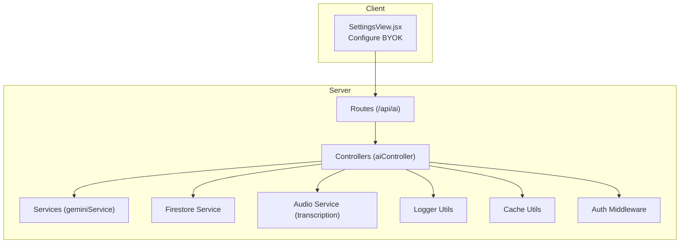
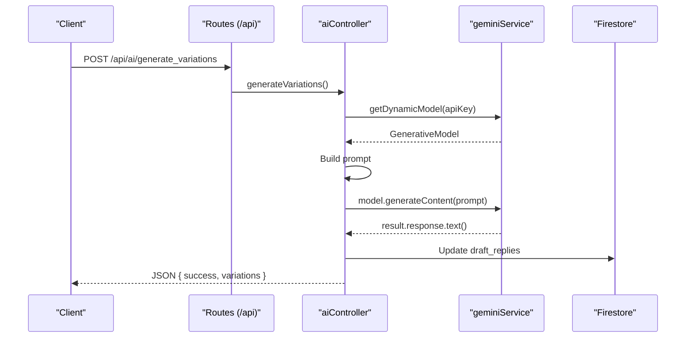
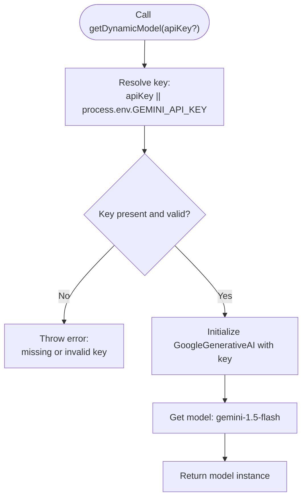
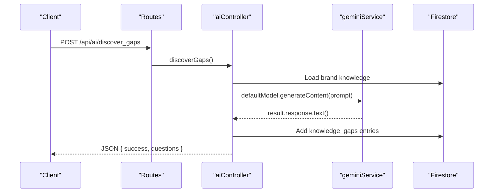
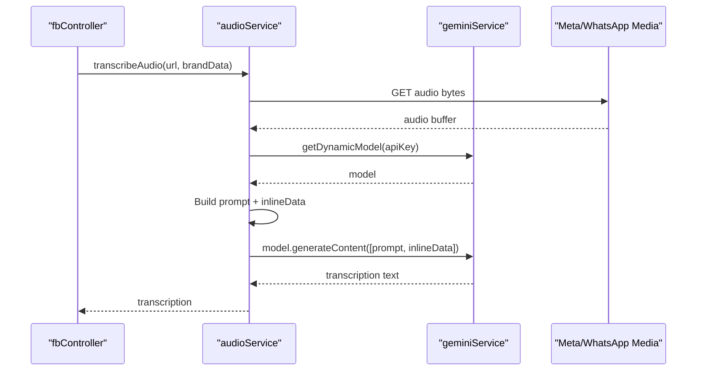
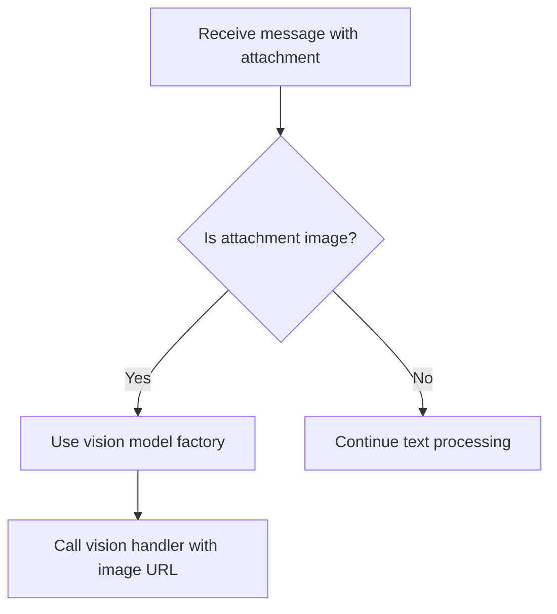
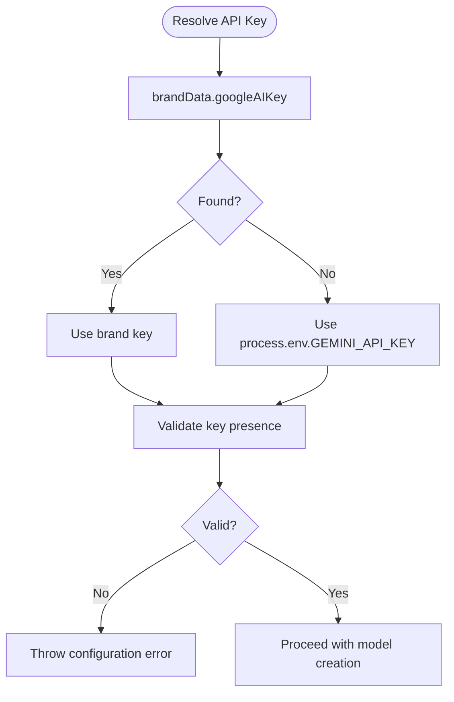
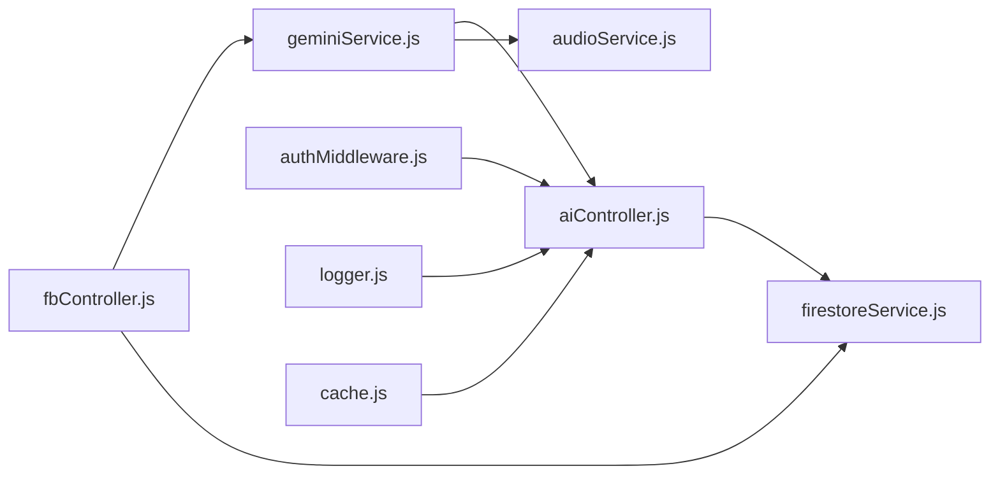

# Google Gemini Integration

<cite>
**Referenced Files in This Document**
- [geminiService.js](file://server/services/geminiService.js)
- [aiController.js](file://server/controllers/aiController.js)
- [ai.js](file://server/routes/ai.js)
- [index.js](file://server/index.js)
- [fbController.js](file://server/controllers/fbController.js)
- [audioService.js](file://server/services/audioService.js)
- [firestoreService.js](file://server/services/firestoreService.js)
- [logger.js](file://server/utils/logger.js)
- [cache.js](file://server/utils/cache.js)
- [authMiddleware.js](file://server/middleware/authMiddleware.js)
- [test_gemini.js](file://server/test_gemini.js)
- [deploy_vercel_env.sh](file://deploy_vercel_env.sh)
- [package.json](file://package.json)
- [SettingsView.jsx](file://client/src/components/Views/SettingsView.jsx)
</cite>

## Table of Contents
1. [Introduction](#introduction)
2. [Project Structure](#project-structure)
3. [Core Components](#core-components)
4. [Architecture Overview](#architecture-overview)
5. [Detailed Component Analysis](#detailed-component-analysis)
6. [Dependency Analysis](#dependency-analysis)
7. [Performance Considerations](#performance-considerations)
8. [Troubleshooting Guide](#troubleshooting-guide)
9. [Conclusion](#conclusion)
10. [Appendices](#appendices)

## Introduction
This document explains the Google Gemini AI integration used across the backend services. It covers API key management, dynamic model instantiation, and multimodal capabilities (vision and audio). It also documents integration patterns for text generation, vision processing, and multimodal responses, along with configuration, rate limiting considerations, cost optimization strategies, security best practices, troubleshooting, and performance optimization techniques.

## Project Structure
The Gemini integration spans several server-side modules:
- Service layer initializes and exposes dynamic model factories.
- Controllers orchestrate AI tasks and integrate with Firestore.
- Routes expose endpoints for AI features.
- Utilities provide logging, caching, and middleware for access control.
- Client UI allows per-brand API key configuration.

**Diagram sources**
- [ai.js:1-37](file://server/routes/ai.js#L1-L37)
- [aiController.js:1-167](file://server/controllers/aiController.js#L1-L167)
- [geminiService.js:1-35](file://server/services/geminiService.js#L1-L35)
- [audioService.js:1-53](file://server/services/audioService.js#L1-L53)
- [firestoreService.js:80-126](file://server/services/firestoreService.js#L80-L126)
- [logger.js:1-10](file://server/utils/logger.js#L1-L10)
- [cache.js:1-45](file://server/utils/cache.js#L1-L45)
- [authMiddleware.js:1-26](file://server/middleware/authMiddleware.js#L1-L26)
- [SettingsView.jsx:296-316](file://client/src/components/Views/SettingsView.jsx#L296-L316)

**Section sources**
- [ai.js:1-37](file://server/routes/ai.js#L1-L37)
- [aiController.js:1-167](file://server/controllers/aiController.js#L1-L167)
- [geminiService.js:1-35](file://server/services/geminiService.js#L1-L35)
- [audioService.js:1-53](file://server/services/audioService.js#L1-L53)
- [firestoreService.js:80-126](file://server/services/firestoreService.js#L80-L126)
- [logger.js:1-10](file://server/utils/logger.js#L1-L10)
- [cache.js:1-45](file://server/utils/cache.js#L1-L45)
- [authMiddleware.js:1-26](file://server/middleware/authMiddleware.js#L1-L26)
- [SettingsView.jsx:296-316](file://client/src/components/Views/SettingsView.jsx#L296-L316)

## Core Components
- Gemini Service: Provides default and dynamic model factories with robust validation for API keys and model selection.
- AI Controller: Implements text generation workflows for variations, gaps discovery, and training assistant.
- Audio Service: Uses multimodal Gemini to transcribe audio into Bangla text.
- Firestore Service: Centralizes brand configuration including per-brand API keys.
- Logger and Cache: Support operational logging and in-memory caching.
- Auth Middleware: Enforces role-based access control for sensitive endpoints.
- Client Settings: Allows enabling BYOK (Bring Your Own Key) per brand.

**Section sources**
- [geminiService.js:1-35](file://server/services/geminiService.js#L1-L35)
- [aiController.js:1-167](file://server/controllers/aiController.js#L1-L167)
- [audioService.js:1-53](file://server/services/audioService.js#L1-L53)
- [firestoreService.js:80-126](file://server/services/firestoreService.js#L80-L126)
- [logger.js:1-10](file://server/utils/logger.js#L1-L10)
- [cache.js:1-45](file://server/utils/cache.js#L1-L45)
- [authMiddleware.js:1-26](file://server/middleware/authMiddleware.js#L1-L26)
- [SettingsView.jsx:296-316](file://client/src/components/Views/SettingsView.jsx#L296-L316)

## Architecture Overview
The integration follows a layered pattern:
- Route handlers delegate to controllers.
- Controllers fetch brand-specific API keys from Firestore and instantiate Gemini models dynamically.
- Models are used for text generation and multimodal tasks (audio transcription).
- Responses are persisted to Firestore and returned to clients.

**Diagram sources**
- [ai.js:7-10](file://server/routes/ai.js#L7-L10)
- [aiController.js:5-26](file://server/controllers/aiController.js#L5-L26)
- [geminiService.js:8-18](file://server/services/geminiService.js#L8-L18)

## Detailed Component Analysis

### Gemini Service: Dynamic Model Instantiation
- Validates API key presence and rejects missing or placeholder keys.
- Creates a model instance for text generation (gemini-1.5-flash).
- Provides a dedicated vision-capable model factory (gemini-2.0-flash).
- Supports passing a custom key override for per-brand usage.

**Diagram sources**
- [geminiService.js:8-18](file://server/services/geminiService.js#L8-L18)

**Section sources**
- [geminiService.js:1-35](file://server/services/geminiService.js#L1-L35)

### AI Controller: Text Generation Workflows
- generateVariations: Generates keyword variations and persists them to Firestore.
- generateLinguisticVariations: Applies advanced prompts with optional linguistic styles; falls back to a local engine if no styles are provided.
- discoverGaps: Identifies knowledge gaps and writes structured results to Firestore.
- trainAIAssistant: Learns brand-specific rules from conversations and updates brand blueprint.

**Diagram sources**
- [ai.js:9-10](file://server/routes/ai.js#L9-L10)
- [aiController.js:65-104](file://server/controllers/aiController.js#L65-L104)
- [geminiService.js:4-6](file://server/services/geminiService.js#L4-L6)

**Section sources**
- [aiController.js:1-167](file://server/controllers/aiController.js#L1-L167)
- [ai.js:1-37](file://server/routes/ai.js#L1-L37)

### Audio Transcription: Multimodal Gemini
- Downloads audio via URL, encodes to base64, and sends to Gemini multimodal model.
- Returns precise Bangla transcription suitable for downstream processing.

**Diagram sources**
- [fbController.js:910-915](file://server/controllers/fbController.js#L910-L915)
- [audioService.js:11-50](file://server/services/audioService.js#L11-L50)
- [geminiService.js:8-18](file://server/services/geminiService.js#L8-L18)

**Section sources**
- [audioService.js:1-53](file://server/services/audioService.js#L1-L53)
- [fbController.js:896-915](file://server/controllers/fbController.js#L896-L915)

### Vision Model Capabilities
- The vision-capable model factory targets a 2.x model variant optimized for vision tasks.
- Vision flows are integrated in messaging flows where images are attached; the system delegates to vision handling when enabled.

**Diagram sources**
- [geminiService.js:20-29](file://server/services/geminiService.js#L20-L29)
- [fbController.js:910-915](file://server/controllers/fbController.js#L910-L915)

**Section sources**
- [geminiService.js:20-29](file://server/services/geminiService.js#L20-L29)
- [fbController.js:910-915](file://server/controllers/fbController.js#L910-L915)

### API Key Management and Validation
- Default key resolution prefers brand-specific keys stored in Firestore; otherwise falls back to environment variables.
- Validation rejects empty or placeholder keys and throws explicit errors.
- Deployment script demonstrates secure environment variable injection for production.

**Diagram sources**
- [firestoreService.js:84-85](file://server/services/firestoreService.js#L84-L85)
- [geminiService.js:8-12](file://server/services/geminiService.js#L8-L12)
- [deploy_vercel_env.sh:11-13](file://deploy_vercel_env.sh#L11-L13)

**Section sources**
- [firestoreService.js:84-85](file://server/services/firestoreService.js#L84-L85)
- [geminiService.js:8-12](file://server/services/geminiService.js#L8-L12)
- [deploy_vercel_env.sh:11-13](file://deploy_vercel_env.sh#L11-L13)

### Integration Patterns
- Text generation: Prompt engineering with JSON expectations, parsing, and persistence.
- Multimodal: Audio transcription pipeline using inlineData payloads.
- Vision: Delegation to vision-enabled flows when images are present.

**Section sources**
- [aiController.js:5-26](file://server/controllers/aiController.js#L5-L26)
- [audioService.js:30-41](file://server/services/audioService.js#L30-L41)
- [fbController.js:910-915](file://server/controllers/fbController.js#L910-L915)

## Dependency Analysis
- geminiService depends on the official SDK and environment configuration.
- aiController depends on geminiService and Firestore for persistence.
- fbController integrates Gemini for comments and vision flows, resolving keys from brand data.
- audioService encapsulates transcription using multimodal model.
- authMiddleware protects sensitive routes.
- cache and logger provide operational support.

**Diagram sources**
- [geminiService.js:1-35](file://server/services/geminiService.js#L1-L35)
- [aiController.js:1-167](file://server/controllers/aiController.js#L1-L167)
- [audioService.js:1-53](file://server/services/audioService.js#L1-L53)
- [firestoreService.js:80-126](file://server/services/firestoreService.js#L80-L126)
- [fbController.js:805-856](file://server/controllers/fbController.js#L805-L856)
- [authMiddleware.js:1-26](file://server/middleware/authMiddleware.js#L1-L26)
- [logger.js:1-10](file://server/utils/logger.js#L1-L10)
- [cache.js:1-45](file://server/utils/cache.js#L1-L45)

**Section sources**
- [geminiService.js:1-35](file://server/services/geminiService.js#L1-L35)
- [aiController.js:1-167](file://server/controllers/aiController.js#L1-L167)
- [audioService.js:1-53](file://server/services/audioService.js#L1-L53)
- [firestoreService.js:80-126](file://server/services/firestoreService.js#L80-L126)
- [fbController.js:805-856](file://server/controllers/fbController.js#L805-L856)
- [authMiddleware.js:1-26](file://server/middleware/authMiddleware.js#L1-L26)
- [logger.js:1-10](file://server/utils/logger.js#L1-L10)
- [cache.js:1-45](file://server/utils/cache.js#L1-L45)

## Performance Considerations
- In-memory cache: Use the provided cache utility to avoid repeated computations or lookups for frequently accessed data.
- Logging overhead: Prefer minimal logging in hot paths; leverage serverLog sparingly.
- Model reuse: Reuse model instances where feasible; the service creates models per invocation, so consider pooling if scaling.
- Request batching: Group related operations to reduce round-trips to Firestore and Gemini.

[No sources needed since this section provides general guidance]

## Troubleshooting Guide
Common issues and resolutions:
- Missing or invalid API key
  - Symptom: Explicit configuration errors during model creation.
  - Resolution: Ensure brand-specific key is set in Firestore or environment variable is configured. Verify deployment environment variables.
- JSON parsing failures
  - Symptom: Errors when parsing model responses.
  - Resolution: Validate prompt formatting and guard parsing with safe extraction patterns.
- Multimodal payload issues
  - Symptom: Errors when sending audio or images.
  - Resolution: Confirm inlineData encoding and MIME type; ensure URLs are accessible and media is downloadable.
- Rate limits and quotas
  - Symptom: Throttling or quota exceeded errors.
  - Resolution: Implement exponential backoff, circuit breaker patterns, and monitor usage; consider key rotation and regional endpoints if supported.
- Security and key exposure
  - Symptom: Keys found in logs or misconfiguration.
  - Resolution: Avoid printing keys; use environment variables and secure deployment practices; rotate keys periodically.

**Section sources**
- [geminiService.js:8-12](file://server/services/geminiService.js#L8-L12)
- [aiController.js:17-25](file://server/controllers/aiController.js#L17-L25)
- [audioService.js:30-41](file://server/services/audioService.js#L30-L41)
- [deploy_vercel_env.sh:11-13](file://deploy_vercel_env.sh#L11-L13)

## Conclusion
The Gemini integration leverages dynamic model instantiation, robust key validation, and multimodal capabilities to power text generation, audio transcription, and vision workflows. By centralizing key management in Firestore, using modular controllers, and applying caching and logging utilities, the system supports scalable and maintainable AI features. Adopt the recommended security and performance practices to ensure reliability and cost-effectiveness.

[No sources needed since this section summarizes without analyzing specific files]

## Appendices

### Configuration Examples
- Environment variables (production)
  - GEMINI_API_KEY: Set via deployment script for secure injection.
- Client UI
  - Enable BYOK per brand in SettingsView to override system key.

**Section sources**
- [deploy_vercel_env.sh:11-13](file://deploy_vercel_env.sh#L11-L13)
- [SettingsView.jsx:296-316](file://client/src/components/Views/SettingsView.jsx#L296-L316)

### Testing the Gemini Key
- Use the provided test script to validate connectivity and basic response.

**Section sources**
- [test_gemini.js:1-19](file://server/test_gemini.js#L1-L19)

### Security Best Practices
- Store keys in environment variables managed by your platform.
- Avoid logging API keys; mask or truncate logs containing keys.
- Rotate keys regularly and monitor usage.
- Restrict access to admin-only endpoints using auth middleware.

**Section sources**
- [authMiddleware.js:6-20](file://server/middleware/authMiddleware.js#L6-L20)
- [deploy_vercel_env.sh:11-13](file://deploy_vercel_env.sh#L11-L13)

### Cost Optimization Strategies
- Prefer smaller, efficient prompts to reduce token usage.
- Cache frequent results where appropriate.
- Use multimodal features judiciously; transcribe audio only when necessary.
- Monitor and cap concurrent requests to Gemini.

[No sources needed since this section provides general guidance]