# Knowledge Base Management

<cite>
**Referenced Files in This Document**
- [KnowledgeBase.jsx](file://client/src/components/Views/KnowledgeBase.jsx)
- [KnowledgeGaps.jsx](file://client/src/components/Views/KnowledgeGaps.jsx)
- [StrategyTable.jsx](file://client/src/components/Views/Comment/StrategyTable.jsx)
- [DraftCenter.jsx](file://client/src/components/Views/DraftCenter.jsx)
- [AILearner.jsx](file://client/src/components/Views/AILearner.jsx)
- [useMetaData.js](file://client/src/hooks/useMetaData.js)
- [Dashboard.jsx](file://client/src/Dashboard.jsx)
- [aiController.js](file://server/controllers/aiController.js)
- [geminiService.js](file://server/services/geminiService.js)
- [linguisticEngine.js](file://server/utils/linguisticEngine.js)
- [cache.js](file://server/utils/cache.js)
- [firestoreService.js](file://server/services/firestoreService.js)
- [ai.js](file://server/routes/ai.js)
- [fbController.js](file://server/controllers/fbController.js)
- [injectVariations.js](file://server/scripts/injectVariations.js)
- [migrateKnowledgeToDraft.js](file://server/scripts/migrateKnowledgeToDraft.js)
- [firestore.rules](file://firestore.rules)
</cite>

## Table of Contents
1. [Introduction](#introduction)
2. [Project Structure](#project-structure)
3. [Core Components](#core-components)
4. [Architecture Overview](#architecture-overview)
5. [Detailed Component Analysis](#detailed-component-analysis)
6. [Dependency Analysis](#dependency-analysis)
7. [Performance Considerations](#performance-considerations)
8. [Troubleshooting Guide](#troubleshooting-guide)
9. [Conclusion](#conclusion)
10. [Appendices](#appendices)

## Introduction
This document describes the knowledge base management system that powers AI-driven customer responses. It explains the architecture, template creation workflows, gap analysis, approval processes, variation generation, and strategy table management. It also documents the user interface components for editing knowledge, discovering gaps, and customizing responses, along with content organization guidelines, template best practices, quality assurance processes, and the integration between knowledge management and AI response generation, including how gaps trigger automated learning modes.

## Project Structure
The knowledge base system spans the client-side UI and server-side orchestration:
- Client views manage templates, knowledge base editing, gap discovery, strategy tables, and AI training.
- Server routes and controllers coordinate AI generation, linguistic expansion, gap discovery, and training.
- Utilities provide linguistic normalization, caching, and Firebase initialization.
- Scripts support migration and SEO-style injection of variations.
- Firestore rules define brand-scoped access controls.

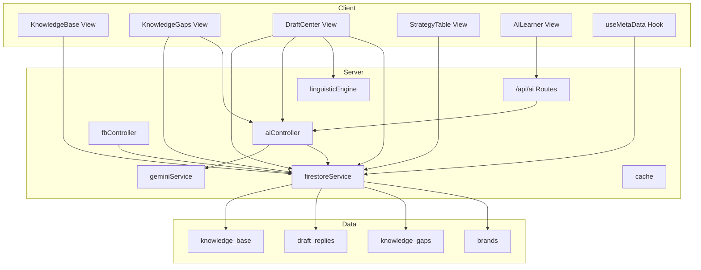

**Diagram sources**
- [KnowledgeBase.jsx:1-163](file://client/src/components/Views/KnowledgeBase.jsx#L1-L163)
- [KnowledgeGaps.jsx:1-299](file://client/src/components/Views/KnowledgeGaps.jsx#L1-L299)
- [DraftCenter.jsx:1-921](file://client/src/components/Views/DraftCenter.jsx#L1-L921)
- [StrategyTable.jsx:1-218](file://client/src/components/Views/Comment/StrategyTable.jsx#L1-L218)
- [AILearner.jsx:1-168](file://client/src/components/Views/AILearner.jsx#L1-L168)
- [useMetaData.js:1-36](file://client/src/hooks/useMetaData.js#L1-L36)
- [aiController.js:1-167](file://server/controllers/aiController.js#L1-L167)
- [geminiService.js:1-35](file://server/services/geminiService.js#L1-L35)
- [linguisticEngine.js:1-144](file://server/utils/linguisticEngine.js#L1-L144)
- [firestoreService.js:1-126](file://server/services/firestoreService.js#L1-L126)
- [ai.js:1-37](file://server/routes/ai.js#L1-L37)
- [fbController.js:661-682](file://server/controllers/fbController.js#L661-L682)
- [firestore.rules:1-51](file://firestore.rules#L1-L51)

**Section sources**
- [KnowledgeBase.jsx:1-163](file://client/src/components/Views/KnowledgeBase.jsx#L1-L163)
- [KnowledgeGaps.jsx:1-299](file://client/src/components/Views/KnowledgeGaps.jsx#L1-L299)
- [DraftCenter.jsx:1-921](file://client/src/components/Views/DraftCenter.jsx#L1-L921)
- [StrategyTable.jsx:1-218](file://client/src/components/Views/Comment/StrategyTable.jsx#L1-L218)
- [AILearner.jsx:1-168](file://client/src/components/Views/AILearner.jsx#L1-L168)
- [useMetaData.js:1-36](file://client/src/hooks/useMetaData.js#L1-L36)
- [aiController.js:1-167](file://server/controllers/aiController.js#L1-L167)
- [geminiService.js:1-35](file://server/services/geminiService.js#L1-L35)
- [linguisticEngine.js:1-144](file://server/utils/linguisticEngine.js#L1-L144)
- [firestoreService.js:1-126](file://server/services/firestoreService.js#L1-L126)
- [ai.js:1-37](file://server/routes/ai.js#L1-L37)
- [fbController.js:661-682](file://server/controllers/fbController.js#L661-L682)
- [firestore.rules:1-51](file://firestore.rules#L1-L51)

## Core Components
- Knowledge Base View: Displays approved knowledge entries, supports inline editing and deletion.
- Knowledge Gaps View: Presents untrained scenarios, allows quick replies, and dismissal.
- Draft Center: Manages active and pending rules, generates and expands variations, and approves to knowledge base.
- Strategy Table: Visualizes per-draft variations and performance metrics for comment strategies.
- AI Learner: Teaches brand-specific personality to the AI, updating brand blueprints automatically.
- Backend AI Controller: Generates variations, discovers gaps, and trains the AI assistant.
- Linguistic Engine: Provides robust phonetic normalization and variation expansion for Bengali/English.
- Firebase Services: Initialize Firestore, provide timestamps, and cache brand lookups.
- Firestore Rules: Enforce brand-scoped access to knowledge_base, draft_replies, and knowledge_gaps.

**Section sources**
- [KnowledgeBase.jsx:8-163](file://client/src/components/Views/KnowledgeBase.jsx#L8-L163)
- [KnowledgeGaps.jsx:148-299](file://client/src/components/Views/KnowledgeGaps.jsx#L148-L299)
- [DraftCenter.jsx:9-921](file://client/src/components/Views/DraftCenter.jsx#L9-L921)
- [StrategyTable.jsx:4-218](file://client/src/components/Views/Comment/StrategyTable.jsx#L4-L218)
- [AILearner.jsx:5-168](file://client/src/components/Views/AILearner.jsx#L5-L168)
- [aiController.js:5-167](file://server/controllers/aiController.js#L5-L167)
- [linguisticEngine.js:86-144](file://server/utils/linguisticEngine.js#L86-L144)
- [firestoreService.js:55-126](file://server/services/firestoreService.js#L55-L126)
- [firestore.rules:28-39](file://firestore.rules#L28-L39)

## Architecture Overview
The system integrates UI-driven workflows with server-side AI orchestration:
- UI components fetch and mutate brand-scoped collections (knowledge_base, draft_replies, knowledge_gaps).
- AI generation endpoints produce variations and discovery questions powered by Gemini.
- Linguistic normalization ensures robust matching across Bengali and English.
- Approval flow moves curated drafts into the knowledge base for deterministic matching.

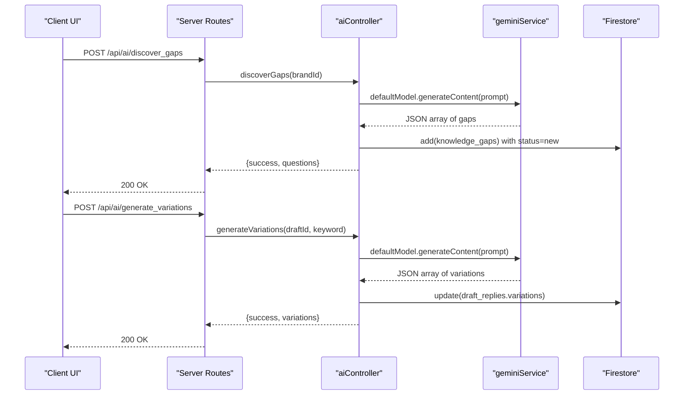

**Diagram sources**
- [ai.js:7-10](file://server/routes/ai.js#L7-L10)
- [aiController.js:65-104](file://server/controllers/aiController.js#L65-L104)
- [geminiService.js:1-35](file://server/services/geminiService.js#L1-L35)
- [firestoreService.js:1-126](file://server/services/firestoreService.js#L1-L126)

## Detailed Component Analysis

### Knowledge Base Management (Client)
- Purpose: Display approved knowledge, allow editing keywords and answers, and deletion.
- Data binding: Reads from knowledge_base via realtime listener; writes via Firestore updates/deletes.
- UX: Tag-like keyword chips, bordered answer blocks, action menu for edit/delete.

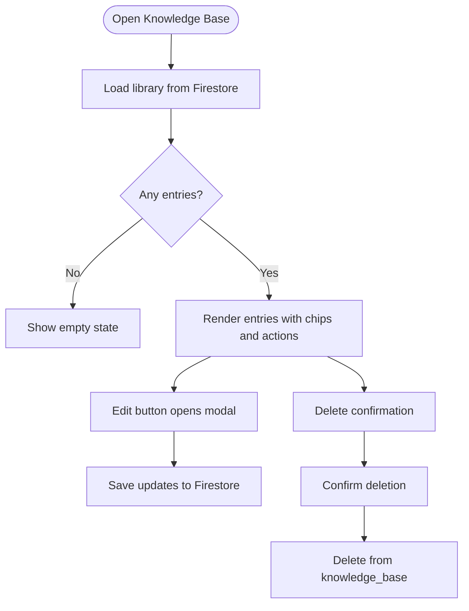

**Diagram sources**
- [KnowledgeBase.jsx:8-163](file://client/src/components/Views/KnowledgeBase.jsx#L8-L163)

**Section sources**
- [KnowledgeBase.jsx:8-163](file://client/src/components/Views/KnowledgeBase.jsx#L8-L163)
- [firestore.rules:28-31](file://firestore.rules#L28-L31)

### Gap Discovery and Learning (Client)
- Purpose: Surface missing scenarios, suggest replies, and convert to drafts for refinement.
- Workflow: Discover button triggers backend gap discovery; active gaps sorted by recency; send-to-draft action moves gap to Draft Center; dismiss removes the gap.

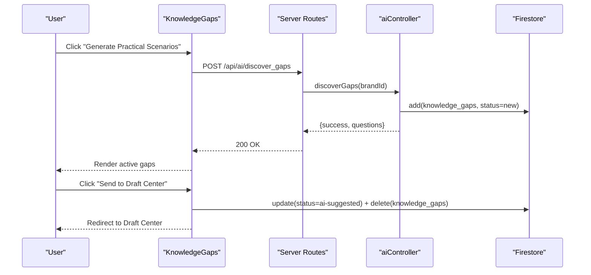

**Diagram sources**
- [KnowledgeGaps.jsx:148-299](file://client/src/components/Views/KnowledgeGaps.jsx#L148-L299)
- [ai.js](file://server/routes/ai.js#L9)
- [aiController.js:65-104](file://server/controllers/aiController.js#L65-L104)

**Section sources**
- [KnowledgeGaps.jsx:148-299](file://client/src/components/Views/KnowledgeGaps.jsx#L148-L299)
- [aiController.js:65-104](file://server/controllers/aiController.js#L65-L104)

### Template Creation and Approval (Client)
- Purpose: Create, refine, and approve templates; expand variations; move to knowledge base.
- Key flows:
  - Manual entry: Add new draft with keyword/result; default approved status.
  - Bulk actions: Approve, delete, linguistic expansion.
  - Single draft approval: Move to knowledge_base and remove from draft_replies.
  - Variation management: Generate, edit, remove, and persist variations.

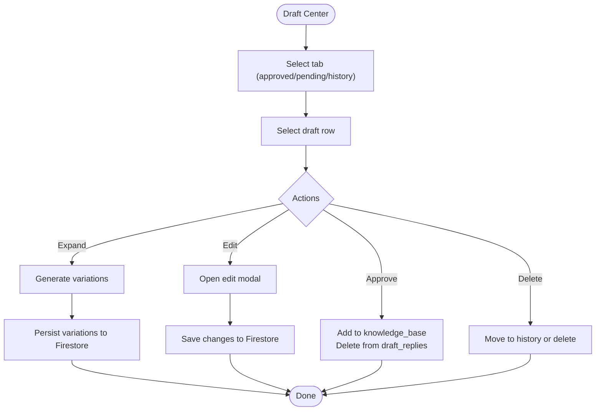

**Diagram sources**
- [DraftCenter.jsx:9-921](file://client/src/components/Views/DraftCenter.jsx#L9-L921)
- [Dashboard.jsx:325-338](file://client/src/Dashboard.jsx#L325-L338)

**Section sources**
- [DraftCenter.jsx:9-921](file://client/src/components/Views/DraftCenter.jsx#L9-L921)
- [Dashboard.jsx:325-338](file://client/src/Dashboard.jsx#L325-L338)

### Strategy Table Management (Client)
- Purpose: Visualize per-draft variations and engagement metrics; quickly generate AI variations.
- Features: Keyword chips, variation preview cards, hit count bars, action buttons for AI growth, edit, and delete.

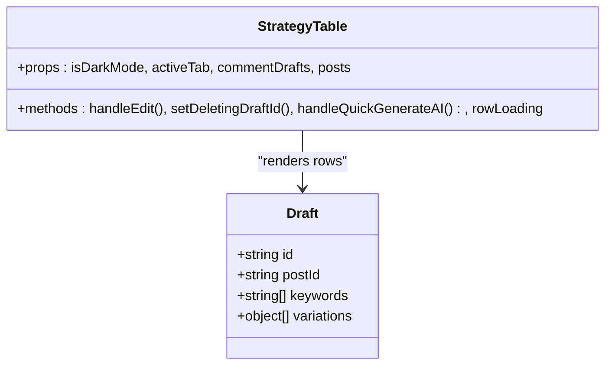

**Diagram sources**
- [StrategyTable.jsx:4-218](file://client/src/components/Views/Comment/StrategyTable.jsx#L4-L218)

**Section sources**
- [StrategyTable.jsx:4-218](file://client/src/components/Views/Comment/StrategyTable.jsx#L4-L218)

### AI Learner (Client)
- Purpose: Teach brand personality to the AI; updates brand blueprint automatically.
- Flow: Chat UI sends messages with history; server responds with trained reply and appends rule to blueprint.

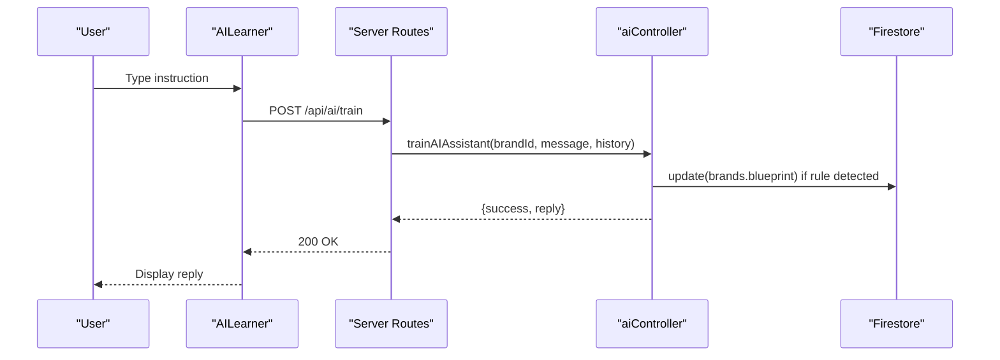

**Diagram sources**
- [AILearner.jsx:24-63](file://client/src/components/Views/AILearner.jsx#L24-L63)
- [ai.js](file://server/routes/ai.js#L10)
- [aiController.js:106-159](file://server/controllers/aiController.js#L106-L159)

**Section sources**
- [AILearner.jsx:5-168](file://client/src/components/Views/AILearner.jsx#L5-L168)
- [aiController.js:106-159](file://server/controllers/aiController.js#L106-L159)

### Backend AI Orchestration (Server)
- generateVariations: Creates 30 short, conversational variations for a keyword and stores them on the draft.
- generateLinguisticVariations: Supports smart linguistic options or falls back to static engine.
- discoverGaps: Identifies 5 missing knowledge areas and seeds knowledge_gaps.
- trainAIAssistant: Conversational training that appends rules to brand blueprint.

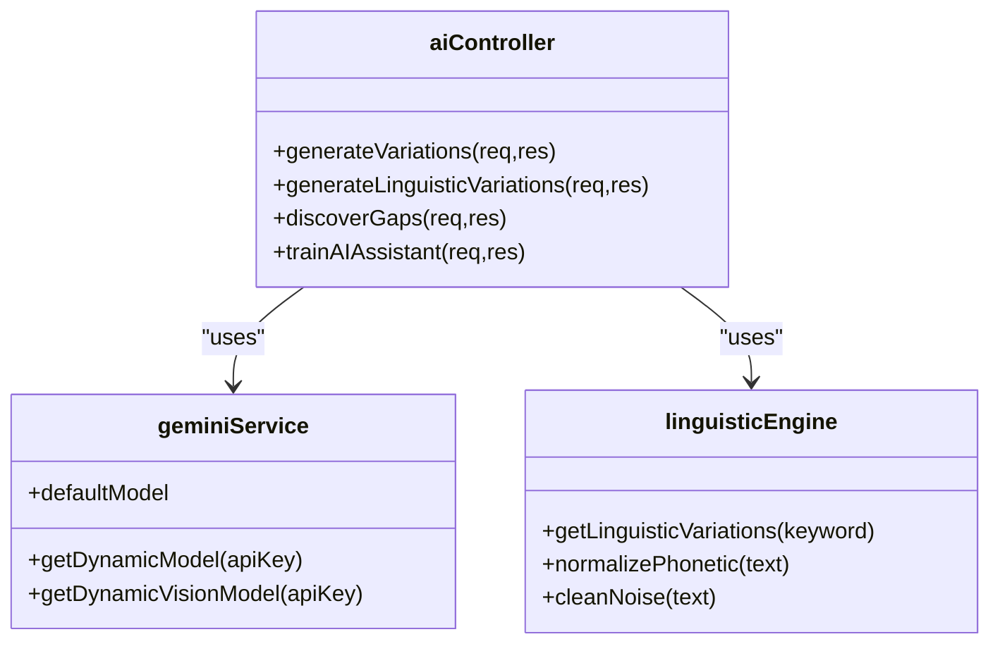

**Diagram sources**
- [aiController.js:5-167](file://server/controllers/aiController.js#L5-L167)
- [geminiService.js:1-35](file://server/services/geminiService.js#L1-L35)
- [linguisticEngine.js:86-144](file://server/utils/linguisticEngine.js#L86-L144)

**Section sources**
- [aiController.js:5-167](file://server/controllers/aiController.js#L5-L167)
- [geminiService.js:1-35](file://server/services/geminiService.js#L1-L35)
- [linguisticEngine.js:86-144](file://server/utils/linguisticEngine.js#L86-L144)

### Real-Time Data Hooks and Matching
- useMetaData: Subscribes to knowledge_gaps, draft_replies, knowledge_base, and conversations for the active brand.
- getApprovedInboxDraft: Unified matcher that considers both draft_replies and knowledge_base, including non-approved drafts for discovery.

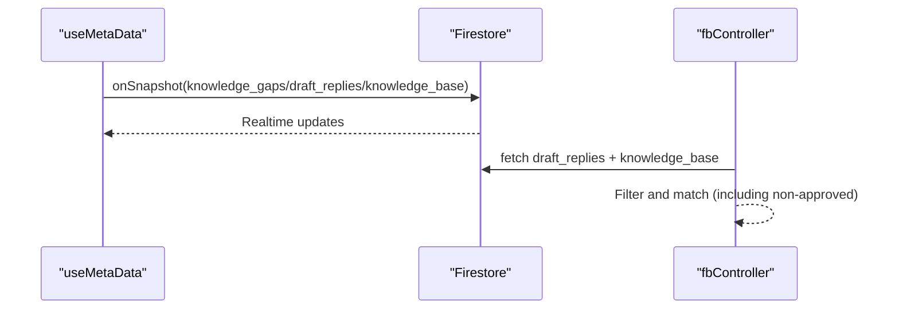

**Diagram sources**
- [useMetaData.js:14-36](file://client/src/hooks/useMetaData.js#L14-L36)
- [fbController.js:661-682](file://server/controllers/fbController.js#L661-L682)

**Section sources**
- [useMetaData.js:14-36](file://client/src/hooks/useMetaData.js#L14-L36)
- [fbController.js:661-682](file://server/controllers/fbController.js#L661-L682)

### Scripts and Migration
- injectVariations: Injects SEO-style variations into draft_replies for a brand.
- migrateKnowledgeToDraft: Migrates knowledge_base entries into draft_replies for unified management.

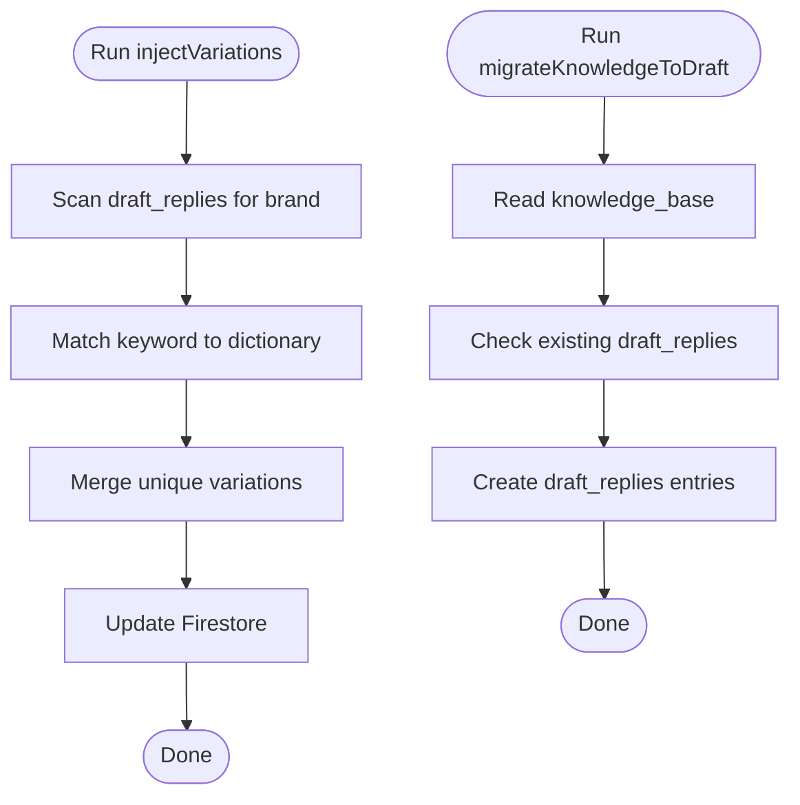

**Diagram sources**
- [injectVariations.js:34-72](file://server/scripts/injectVariations.js#L34-L72)
- [migrateKnowledgeToDraft.js:19-72](file://server/scripts/migrateKnowledgeToDraft.js#L19-L72)

**Section sources**
- [injectVariations.js:1-72](file://server/scripts/injectVariations.js#L1-L72)
- [migrateKnowledgeToDraft.js:1-72](file://server/scripts/migrateKnowledgeToDraft.js#L1-L72)

## Dependency Analysis
- UI depends on Firestore for reads/writes scoped to brandId.
- Backend controllers depend on Gemini for generation and Firestore for persistence.
- LinguisticEngine provides normalization and expansion for robust matching.
- Cache improves brand lookup performance.

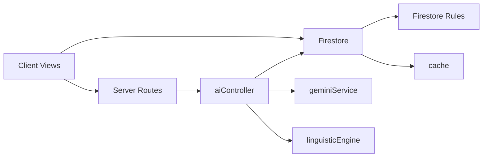

**Diagram sources**
- [firestore.rules:28-39](file://firestore.rules#L28-L39)
- [firestoreService.js:55-126](file://server/services/firestoreService.js#L55-L126)
- [aiController.js:1-167](file://server/controllers/aiController.js#L1-L167)
- [geminiService.js:1-35](file://server/services/geminiService.js#L1-L35)
- [linguisticEngine.js:1-144](file://server/utils/linguisticEngine.js#L1-L144)
- [cache.js:1-45](file://server/utils/cache.js#L1-L45)

**Section sources**
- [firestore.rules:1-51](file://firestore.rules#L1-L51)
- [firestoreService.js:55-126](file://server/services/firestoreService.js#L55-L126)
- [aiController.js:1-167](file://server/controllers/aiController.js#L1-L167)
- [cache.js:1-45](file://server/utils/cache.js#L1-L45)

## Performance Considerations
- Real-time listeners: Use targeted queries by brandId to minimize payload.
- Caching: Brand lookups are cached to reduce repeated server calls.
- Batch operations: Bulk approve/delete in Draft Center reduces round trips.
- AI generation: Limit batch sizes and leverage server-side caching for prompts where applicable.
- Matching: Phonetic normalization and noise filtering improve recall without heavy computation.

[No sources needed since this section provides general guidance]

## Troubleshooting Guide
- API errors: Check server logs for VARIATION ERROR, LINGUISTIC VARIATION ERROR, DISCOVERY ERROR, TRAINING ERROR.
- Missing API key: Ensure Gemini API key is configured; dynamic model checks for missing keys.
- Access denied: Verify brandId in requests and Firestore rules enforce brand scoping.
- Real-time sync issues: Confirm onSnapshot subscriptions and brand context availability.

**Section sources**
- [aiController.js:22-25](file://server/controllers/aiController.js#L22-L25)
- [aiController.js:59-62](file://server/controllers/aiController.js#L59-L62)
- [aiController.js:100-103](file://server/controllers/aiController.js#L100-L103)
- [aiController.js:155-158](file://server/controllers/aiController.js#L155-L158)
- [geminiService.js:8-18](file://server/services/geminiService.js#L8-L18)
- [firestore.rules:4-9](file://firestore.rules#L4-L9)

## Conclusion
The knowledge base management system combines a robust client UI with server-side AI orchestration to continuously improve AI responses. Templates are created, refined, and approved into a centralized knowledge base, while gaps are discovered and transformed into actionable training scenarios. Linguistic normalization and variation generation ensure high-quality, contextually relevant replies. Brand-scoped Firestore rules and caching provide secure, scalable operations.

[No sources needed since this section summarizes without analyzing specific files]

## Appendices

### Content Organization Guidelines
- Use concise, keyword-rich statements as primary triggers.
- Group related keywords as chips for discoverability.
- Keep answers actionable, brand-aligned, and localized where appropriate.
- Prefer short, conversational phrasing for better matching.

### Template Best Practices
- Start with a single primary keyword; add variations later.
- Include both public and private reply variants when relevant.
- Track engagement metrics to refine top-performing templates.
- Regularly migrate approved drafts to knowledge_base for deterministic matching.

### Quality Assurance Processes
- Review draft variations for relevance and tone.
- Validate keyword coverage against linguistic normalization.
- Monitor engagement bars to identify underperforming templates.
- Periodically re-run gap discovery to surface new scenarios.

### Integration with AI Response Generation
- Approved knowledge_base and draft_replies feed the unified matcher.
- Gaps trigger automated learning mode; suggested answers can be refined and moved to Draft Center.
- AI Learner updates brand blueprint automatically when rules are detected.

**Section sources**
- [fbController.js:661-682](file://server/controllers/fbController.js#L661-L682)
- [KnowledgeGaps.jsx:173-177](file://client/src/components/Views/KnowledgeGaps.jsx#L173-L177)
- [DraftCenter.jsx:158-170](file://client/src/components/Views/DraftCenter.jsx#L158-L170)
- [AILearner.jsx:24-63](file://client/src/components/Views/AILearner.jsx#L24-L63)