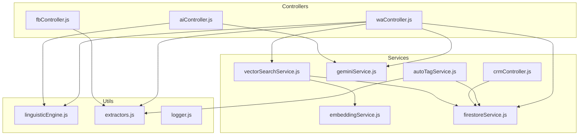
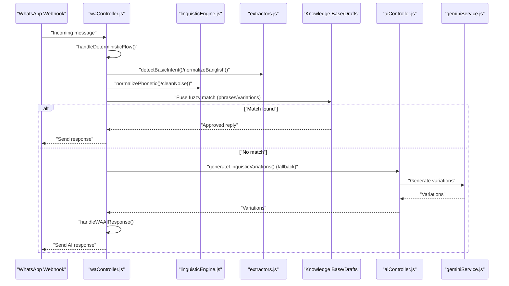
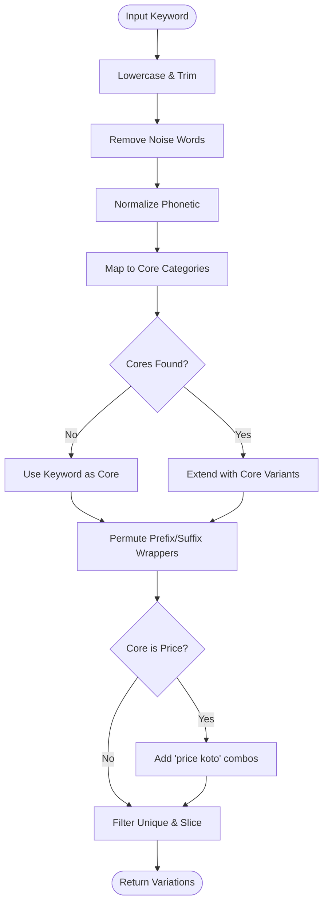
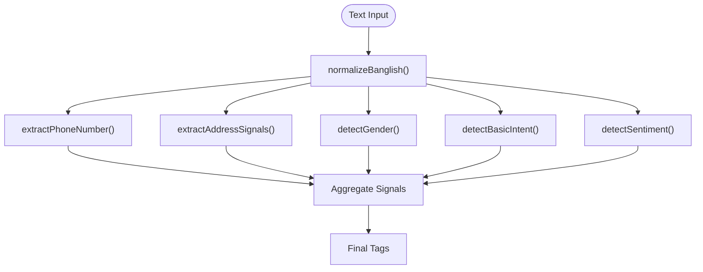
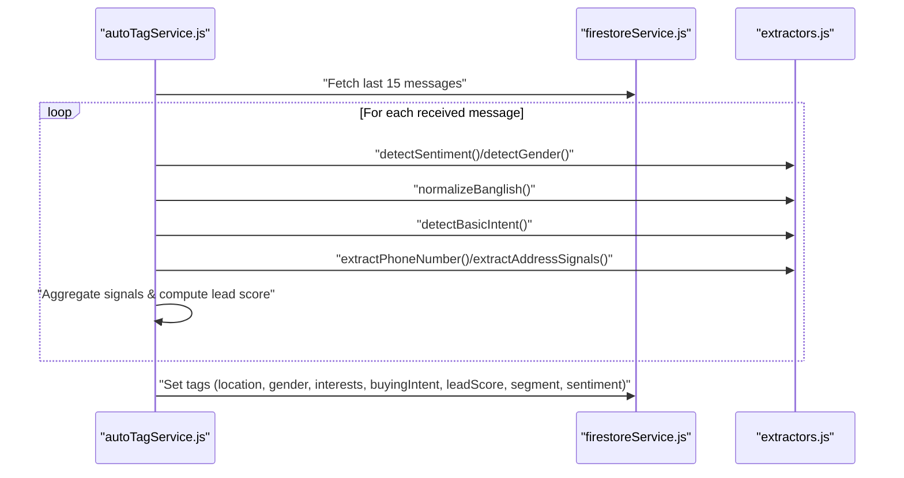
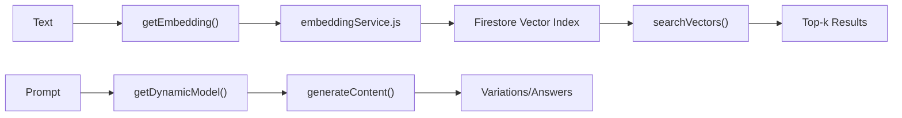
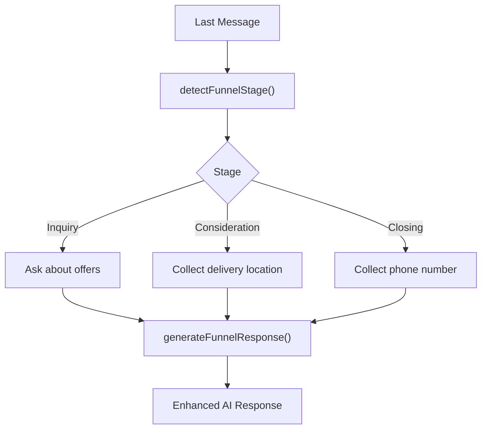
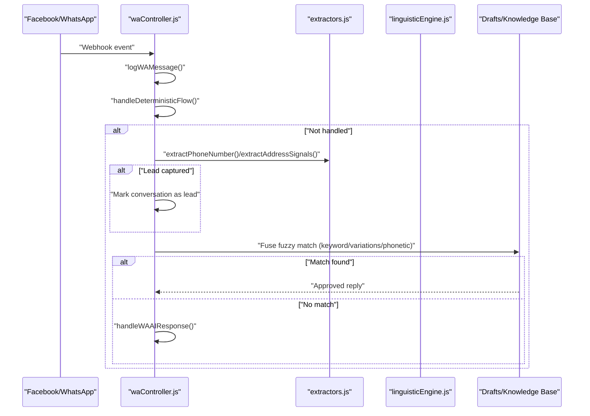
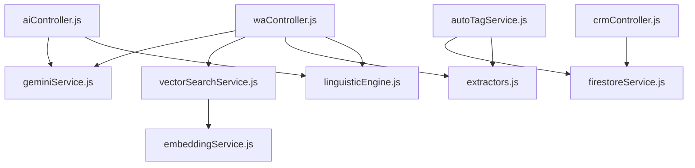

# Linguistic Processing Engine

<cite>
**Referenced Files in This Document**
- [linguisticEngine.js](file://server/utils/linguisticEngine.js)
- [extractors.js](file://server/utils/extractors.js)
- [autoTagService.js](file://server/services/autoTagService.js)
- [vectorSearchService.js](file://server/services/vectorSearchService.js)
- [embeddingService.js](file://server/services/embeddingService.js)
- [geminiService.js](file://server/services/geminiService.js)
- [aiController.js](file://server/controllers/aiController.js)
- [waController.js](file://server/controllers/waController.js)
- [fbController.js](file://server/controllers/fbController.js)
- [salesFunnelService.js](file://server/services/salesFunnelService.js)
- [crmController.js](file://server/controllers/crmController.js)
- [logger.js](file://server/utils/logger.js)
- [firestoreService.js](file://server/services/firestoreService.js)
</cite>

## Table of Contents
1. [Introduction](#introduction)
2. [Project Structure](#project-structure)
3. [Core Components](#core-components)
4. [Architecture Overview](#architecture-overview)
5. [Detailed Component Analysis](#detailed-component-analysis)
6. [Dependency Analysis](#dependency-analysis)
7. [Performance Considerations](#performance-considerations)
8. [Troubleshooting Guide](#troubleshooting-guide)
9. [Conclusion](#conclusion)
10. [Appendices](#appendices)

## Introduction
This document describes the linguistic processing engine and auto-tagging system powering conversational automation and customer intelligence. It covers:
- Natural language processing algorithms for intent detection and sentiment analysis
- Linguistic variations generation and phonetic normalization for multilingual/Bangla-English convergence
- Deterministic extraction of leads (phone, address, gender, campaign signals)
- Auto-tagging for categorizing conversations, assigning personas, and deriving business insights
- Hybrid rule-based and machine learning components
- Customization for domain-specific language and multilingual support

## Project Structure
The linguistic stack spans utilities, services, controllers, and data stores:
- Utilities: phonetic mapping, keyword-based extractors, linguistic variation generator
- Services: vector search, embeddings, Gemini integration, CRM segmentation
- Controllers: WhatsApp/Facebook webhooks and AI orchestration
- Data: Firestore collections for conversations, knowledge base, drafts, brands

**Diagram sources**
- [waController.js:1-680](file://server/controllers/waController.js#L1-L680)
- [fbController.js:1582-1607](file://server/controllers/fbController.js#L1582-L1607)
- [aiController.js:1-167](file://server/controllers/aiController.js#L1-L167)
- [linguisticEngine.js:1-144](file://server/utils/linguisticEngine.js#L1-L144)
- [extractors.js:1-154](file://server/utils/extractors.js#L1-L154)
- [vectorSearchService.js:1-61](file://server/services/vectorSearchService.js#L1-L61)
- [embeddingService.js:1-24](file://server/services/embeddingService.js#L1-L24)
- [geminiService.js:1-35](file://server/services/geminiService.js#L1-L35)
- [autoTagService.js:1-118](file://server/services/autoTagService.js#L1-L118)
- [crmController.js:1-77](file://server/controllers/crmController.js#L1-L77)
- [firestoreService.js:1-126](file://server/services/firestoreService.js#L1-L126)
- [logger.js:1-10](file://server/utils/logger.js#L1-L10)

**Section sources**
- [linguisticEngine.js:1-144](file://server/utils/linguisticEngine.js#L1-L144)
- [extractors.js:1-154](file://server/utils/extractors.js#L1-L154)
- [autoTagService.js:1-118](file://server/services/autoTagService.js#L1-L118)
- [vectorSearchService.js:1-61](file://server/services/vectorSearchService.js#L1-L61)
- [embeddingService.js:1-24](file://server/services/embeddingService.js#L1-L24)
- [geminiService.js:1-35](file://server/services/geminiService.js#L1-L35)
- [aiController.js:1-167](file://server/controllers/aiController.js#L1-L167)
- [waController.js:1-680](file://server/controllers/waController.js#L1-L680)
- [fbController.js:1582-1607](file://server/controllers/fbController.js#L1582-L1607)
- [salesFunnelService.js:1-61](file://server/services/salesFunnelService.js#L1-L61)
- [crmController.js:1-77](file://server/controllers/crmController.js#L1-L77)
- [firestoreService.js:1-126](file://server/services/firestoreService.js#L1-L126)
- [logger.js:1-10](file://server/utils/logger.js#L1-L10)

## Core Components
- Linguistic Engine: phonetic normalization, noise filtering, keyword-to-intent mapping, and combinatorial linguistic variations generation
- Deterministic Extractors: phone number, address/district detection, gender inference, intent classification, sentiment classification, and Banglish normalization
- Auto-Tagging Service: aggregates signals from recent messages to tag conversations with location, gender, interests, buying intent, lead score, segment, and sentiment
- Machine Learning Integration: Gemini-based generation and vector embeddings for semantic search
- Sales Funnel and CRM: stage detection, funnel prompts, and batch segmentation

**Section sources**
- [linguisticEngine.js:1-144](file://server/utils/linguisticEngine.js#L1-L144)
- [extractors.js:1-154](file://server/utils/extractors.js#L1-L154)
- [autoTagService.js:1-118](file://server/services/autoTagService.js#L1-L118)
- [geminiService.js:1-35](file://server/services/geminiService.js#L1-L35)
- [embeddingService.js:1-24](file://server/services/embeddingService.js#L1-L24)
- [vectorSearchService.js:1-61](file://server/services/vectorSearchService.js#L1-L61)
- [salesFunnelService.js:1-61](file://server/services/salesFunnelService.js#L1-L61)
- [crmController.js:1-77](file://server/controllers/crmController.js#L1-L77)

## Architecture Overview
The system blends deterministic NLP with ML-powered augmentation:
- Controllers receive inbound messages and trigger deterministic matching or AI fallback
- Deterministic pipeline: normalize text, detect signals, fuzzy match against approved drafts
- Phonetic and linguistic variations expand coverage for noisy, multilingual inputs
- Auto-tagging enriches conversation documents for downstream CRM and funnel logic
- Vector embeddings enable semantic search for knowledge and drafts

**Diagram sources**
- [waController.js:106-167](file://server/controllers/waController.js#L106-L167)
- [linguisticEngine.js:22-141](file://server/utils/linguisticEngine.js#L22-L141)
- [extractors.js:82-107](file://server/utils/extractors.js#L82-L107)
- [aiController.js:28-63](file://server/controllers/aiController.js#L28-L63)
- [geminiService.js:1-35](file://server/services/geminiService.js#L1-L35)

## Detailed Component Analysis

### Linguistic Engine
Implements phonetic normalization and combinatorial linguistic variations:
- Bangla-to-Roman mapping for convergence
- Aggressive noise removal and duplication handling
- Prefix/suffix wrapper permutations
- Phonetic and cleaned-keyword expansion
- Limits output to manageable cardinality

**Diagram sources**
- [linguisticEngine.js:86-141](file://server/utils/linguisticEngine.js#L86-L141)

**Section sources**
- [linguisticEngine.js:1-144](file://server/utils/linguisticEngine.js#L1-L144)

### Deterministic Extractors
Provides lightweight, deterministic signal extraction:
- Phone number extraction with country code handling
- Address detection via district list and keyword heuristics
- Gender inference from addressing patterns
- Intent classification by keyword thresholds
- Sentiment classification via keyword sets
- Banglish normalization for robust matching

**Diagram sources**
- [extractors.js:26-143](file://server/utils/extractors.js#L26-L143)

**Section sources**
- [extractors.js:1-154](file://server/utils/extractors.js#L1-L154)

### Auto-Tagging System
Aggregates signals from the last N received messages to tag a conversation:
- Computes sentiment distribution and final sentiment
- Infers gender and location
- Detects campaigns and interests
- Builds a lead score and assigns a segment
- Writes tags back to the conversation document

**Diagram sources**
- [autoTagService.js:16-115](file://server/services/autoTagService.js#L16-L115)
- [extractors.js:132-143](file://server/utils/extractors.js#L132-L143)
- [firestoreService.js:1-126](file://server/services/firestoreService.js#L1-L126)

**Section sources**
- [autoTagService.js:1-118](file://server/services/autoTagService.js#L1-L118)
- [extractors.js:1-154](file://server/utils/extractors.js#L1-L154)
- [firestoreService.js:1-126](file://server/services/firestoreService.js#L1-L126)

### Machine Learning Components
- Embeddings: vector embeddings for semantic search
- Vector Search: nearest neighbor lookup by cosine distance
- Gemini Integration: dynamic model selection and content generation
- AI Variation Generation: hybrid deterministic and LLM-driven linguistic generation

**Diagram sources**
- [embeddingService.js:1-24](file://server/services/embeddingService.js#L1-L24)
- [vectorSearchService.js:12-40](file://server/services/vectorSearchService.js#L12-L40)
- [geminiService.js:8-29](file://server/services/geminiService.js#L8-L29)
- [aiController.js:5-26](file://server/controllers/aiController.js#L5-L26)

**Section sources**
- [embeddingService.js:1-24](file://server/services/embeddingService.js#L1-L24)
- [vectorSearchService.js:1-61](file://server/services/vectorSearchService.js#L1-L61)
- [geminiService.js:1-35](file://server/services/geminiService.js#L1-L35)
- [aiController.js:1-167](file://server/controllers/aiController.js#L1-L167)

### Sales Funnel and CRM
- Funnel stage detection based on keyword heuristics
- Prompt injection to guide the AI toward conversion
- Batch segmentation job to assign customer segments

**Diagram sources**
- [salesFunnelService.js:13-54](file://server/services/salesFunnelService.js#L13-L54)

**Section sources**
- [salesFunnelService.js:1-61](file://server/services/salesFunnelService.js#L1-L61)
- [crmController.js:9-43](file://server/controllers/crmController.js#L9-L43)

### WhatsApp Pipeline and Lead Capture
- Security validation, message parsing, and conversation logging
- Deterministic state machine for greeting-to-order flow
- Passive lead capture via regex extraction
- Fuzzy matching against approved drafts with phonetic normalization
- AI fallback with autonomous learning queue

**Diagram sources**
- [waController.js:77-167](file://server/controllers/waController.js#L77-L167)
- [extractors.js:26-62](file://server/utils/extractors.js#L26-L62)
- [linguisticEngine.js:22-42](file://server/utils/linguisticEngine.js#L22-L42)

**Section sources**
- [waController.js:1-680](file://server/controllers/waController.js#L1-L680)
- [extractors.js:1-154](file://server/utils/extractors.js#L1-L154)
- [linguisticEngine.js:1-144](file://server/utils/linguisticEngine.js#L1-L144)

## Dependency Analysis
- Controllers depend on utilities for linguistic normalization and extraction, and on services for embeddings and AI
- Auto-tagging depends on extractors and Firestore
- Vector search depends on embeddings and Firestore vector index
- Sales funnel integrates with CRM segmentation and conversation state

**Diagram sources**
- [waController.js:1-680](file://server/controllers/waController.js#L1-L680)
- [aiController.js:1-167](file://server/controllers/aiController.js#L1-L167)
- [autoTagService.js:1-118](file://server/services/autoTagService.js#L1-L118)
- [linguisticEngine.js:1-144](file://server/utils/linguisticEngine.js#L1-L144)
- [extractors.js:1-154](file://server/utils/extractors.js#L1-L154)
- [vectorSearchService.js:1-61](file://server/services/vectorSearchService.js#L1-L61)
- [embeddingService.js:1-24](file://server/services/embeddingService.js#L1-L24)
- [geminiService.js:1-35](file://server/services/geminiService.js#L1-L35)
- [crmController.js:1-77](file://server/controllers/crmController.js#L1-L77)
- [firestoreService.js:1-126](file://server/services/firestoreService.js#L1-L126)

**Section sources**
- [waController.js:1-680](file://server/controllers/waController.js#L1-L680)
- [aiController.js:1-167](file://server/controllers/aiController.js#L1-L167)
- [autoTagService.js:1-118](file://server/services/autoTagService.js#L1-L118)
- [linguisticEngine.js:1-144](file://server/utils/linguisticEngine.js#L1-L144)
- [extractors.js:1-154](file://server/utils/extractors.js#L1-L154)
- [vectorSearchService.js:1-61](file://server/services/vectorSearchService.js#L1-L61)
- [embeddingService.js:1-24](file://server/services/embeddingService.js#L1-L24)
- [geminiService.js:1-35](file://server/services/geminiService.js#L1-L35)
- [crmController.js:1-77](file://server/controllers/crmController.js#L1-L77)
- [firestoreService.js:1-126](file://server/services/firestoreService.js#L1-L126)

## Performance Considerations
- Deterministic extractors are O(n) per message and highly cacheable
- Linguistic variations generation caps results to reduce search space
- Fuse.js fuzzy search with tuned thresholds balances recall vs. latency
- Vector search leverages Firestore vector index for scalable nearest neighbor retrieval
- Logging and error handling are centralized to minimize overhead

[No sources needed since this section provides general guidance]

## Troubleshooting Guide
Common issues and remedies:
- Missing or invalid Gemini API key: ensure environment variable is set and models are accessible
- Vector index missing: Firestore vector index must be created for semantic search
- Low fuzzy match quality: adjust Fuse.js threshold or expand keyword/variations
- Incorrect lead capture: verify phone/address regex and district lists
- Auto-tagging errors: confirm message fetch and write permissions

**Section sources**
- [geminiService.js:8-18](file://server/services/geminiService.js#L8-L18)
- [vectorSearchService.js:12-40](file://server/services/vectorSearchService.js#L12-L40)
- [extractors.js:26-62](file://server/utils/extractors.js#L26-L62)
- [autoTagService.js:112-114](file://server/services/autoTagService.js#L112-L114)
- [logger.js:4-7](file://server/utils/logger.js#L4-L7)

## Conclusion
The system combines robust deterministic NLP with pragmatic ML augmentation to deliver accurate intent detection, sentiment analysis, and lead capture. The linguistic engine’s phonetic normalization and combinatorial variations improve matching in noisy, multilingual contexts. Auto-tagging and CRM segmentation provide actionable customer insights, while the sales funnel and AI orchestration streamline conversions.

[No sources needed since this section summarizes without analyzing specific files]

## Appendices

### Implementation Notes
- Domain customization: extend keyword maps, district lists, and sentiment lexicons
- Multilingual support: expand phonetic mapping and normalization rules
- Latency optimization: precompute embeddings for drafts, cache brand-specific configurations

[No sources needed since this section provides general guidance]