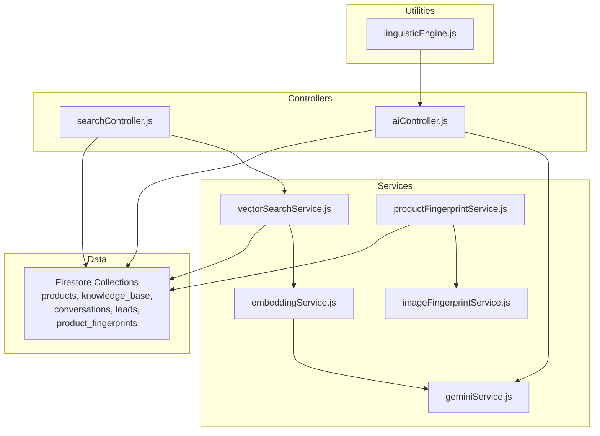
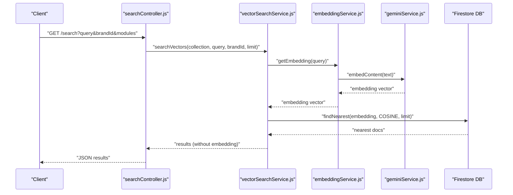
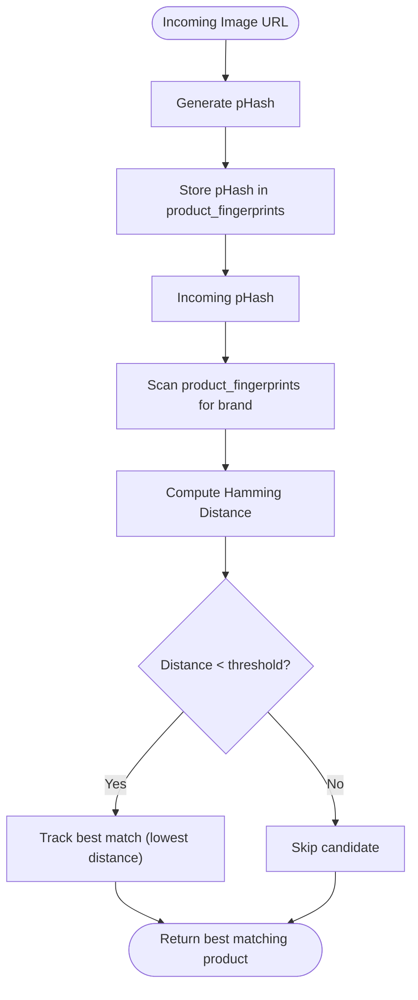
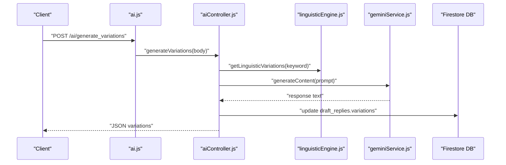
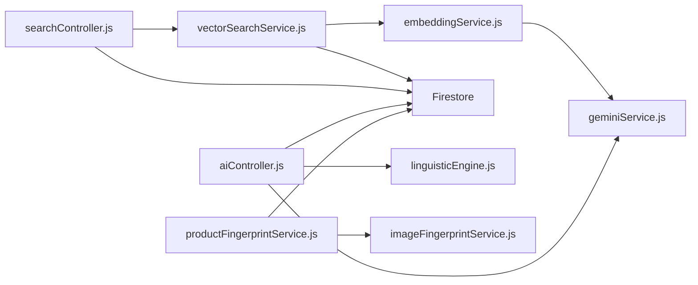

# Vector Search and Embeddings

<cite>
**Referenced Files in This Document**
- [embeddingService.js](file://server/services/embeddingService.js)
- [vectorSearchService.js](file://server/services/vectorSearchService.js)
- [searchController.js](file://server/controllers/searchController.js)
- [migrate_vectors.js](file://server/migrate_vectors.js)
- [aiController.js](file://server/controllers/aiController.js)
- [ai.js](file://server/routes/ai.js)
- [geminiService.js](file://server/services/geminiService.js)
- [imageFingerprintService.js](file://server/services/imageFingerprintService.js)
- [productFingerprintService.js](file://server/services/productFingerprintService.js)
- [linguisticEngine.js](file://server/utils/linguisticEngine.js)
</cite>

## Table of Contents
1. [Introduction](#introduction)
2. [Project Structure](#project-structure)
3. [Core Components](#core-components)
4. [Architecture Overview](#architecture-overview)
5. [Detailed Component Analysis](#detailed-component-analysis)
6. [Dependency Analysis](#dependency-analysis)
7. [Performance Considerations](#performance-considerations)
8. [Troubleshooting Guide](#troubleshooting-guide)
9. [Conclusion](#conclusion)
10. [Appendices](#appendices)

## Introduction
This document explains the vector search and embedding system powering semantic search, knowledge base embeddings, product fingerprinting, and conversation vectorization. It covers embedding generation, vector indexing strategies, similarity computation, and how vector search integrates with AI-driven content generation to improve retrieval and recommendation accuracy. It also provides implementation guides for adding new embedding models, optimizing search performance, and managing vector databases.

## Project Structure
The vector search and embedding system spans several backend services and controllers:
- Embedding generation via Gemini embeddings
- Vector search using Firestore’s native vector capabilities
- Unified search controller orchestrating multiple search modules
- Migration script to populate existing documents with embeddings
- AI controllers leveraging embeddings for training and discovery
- Image fingerprinting for product matching alongside vector search
- Linguistic engine for keyword-based variations and pre-processing

**Diagram sources**
- [searchController.js:1-55](file://server/controllers/searchController.js#L1-L55)
- [aiController.js:1-167](file://server/controllers/aiController.js#L1-L167)
- [embeddingService.js:1-24](file://server/services/embeddingService.js#L1-L24)
- [vectorSearchService.js:1-62](file://server/services/vectorSearchService.js#L1-L62)
- [geminiService.js:1-35](file://server/services/geminiService.js#L1-L35)
- [imageFingerprintService.js:1-41](file://server/services/imageFingerprintService.js#L1-L41)
- [productFingerprintService.js:1-88](file://server/services/productFingerprintService.js#L1-L88)
- [linguisticEngine.js:1-144](file://server/utils/linguisticEngine.js#L1-L144)

**Section sources**
- [searchController.js:1-55](file://server/controllers/searchController.js#L1-L55)
- [embeddingService.js:1-24](file://server/services/embeddingService.js#L1-L24)
- [vectorSearchService.js:1-62](file://server/services/vectorSearchService.js#L1-L62)
- [migrate_vectors.js:1-49](file://server/migrate_vectors.js#L1-L49)
- [aiController.js:1-167](file://server/controllers/aiController.js#L1-L167)
- [geminiService.js:1-35](file://server/services/geminiService.js#L1-L35)
- [imageFingerprintService.js:1-41](file://server/services/imageFingerprintService.js#L1-L41)
- [productFingerprintService.js:1-88](file://server/services/productFingerprintService.js#L1-L88)
- [linguisticEngine.js:1-144](file://server/utils/linguisticEngine.js#L1-L144)

## Core Components
- Embedding service: Generates dense vector embeddings for text using a Gemini embedding model.
- Vector search service: Performs semantic nearest-neighbor search against Firestore collections using cosine distance.
- Unified search controller: Orchestrates vector search for products and prefix-based search for conversations and leads.
- Migration script: Populates existing documents with embeddings for products and knowledge base entries.
- AI controllers: Use embeddings for training and discovery tasks; leverage linguistic engine for keyword variations.
- Image fingerprint service and product fingerprint service: Provide perceptual hashing and similarity matching for product images.
- Linguistic engine: Provides keyword normalization and variation generation for training and discovery.

**Section sources**
- [embeddingService.js:1-24](file://server/services/embeddingService.js#L1-L24)
- [vectorSearchService.js:1-62](file://server/services/vectorSearchService.js#L1-L62)
- [searchController.js:1-55](file://server/controllers/searchController.js#L1-L55)
- [migrate_vectors.js:1-49](file://server/migrate_vectors.js#L1-L49)
- [aiController.js:1-167](file://server/controllers/aiController.js#L1-L167)
- [imageFingerprintService.js:1-41](file://server/services/imageFingerprintService.js#L1-L41)
- [productFingerprintService.js:1-88](file://server/services/productFingerprintService.js#L1-L88)
- [linguisticEngine.js:1-144](file://server/utils/linguisticEngine.js#L1-L144)

## Architecture Overview
The system integrates embedding generation, vector indexing, and search orchestration with AI-driven content creation.

**Diagram sources**
- [searchController.js:9-52](file://server/controllers/searchController.js#L9-L52)
- [vectorSearchService.js:12-40](file://server/services/vectorSearchService.js#L12-L40)
- [embeddingService.js:10-21](file://server/services/embeddingService.js#L10-L21)
- [geminiService.js:8-18](file://server/services/geminiService.js#L8-L18)

## Detailed Component Analysis

### Embedding Generation
- Model: Gemini embedding-001 produces 768-dimensional vectors.
- Fallback: On failure, returns a zero-vector of length 768 to prevent downstream errors.
- API key: Uses environment variable or optional override.

Implementation highlights:
- Embedding generation function accepts text and optional API key.
- Error handling logs warnings and returns a zero-vector.

**Section sources**
- [embeddingService.js:10-21](file://server/services/embeddingService.js#L10-L21)

### Vector Indexing Strategies
- Collection fields: Documents must include an embedding array and a brand identifier.
- Index requirement: Firestore requires a vector index on the embedding field for efficient nearest-neighbor search.
- Distance measure: Cosine distance is used for semantic similarity.

Key behaviors:
- Brand scoping: Queries filter by brandId to ensure per-brand isolation.
- Limiting: Results are limited to reduce payload size and latency.
- Bandwidth optimization: Embedding field is stripped from returned documents.

**Section sources**
- [vectorSearchService.js:12-40](file://server/services/vectorSearchService.js#L12-L40)

### Semantic Similarity and Relevance
- Similarity metric: Cosine distance between query vector and stored vectors.
- Relevance scoring: Firestore’s findNearest returns nearest neighbors; relevance is implicit in ranking order.
- Thresholds: No explicit similarity threshold is applied in code; results are constrained by limit and brand filtering.

Optimization opportunities:
- Introduce configurable similarity thresholds for downstream filtering.
- Normalize vectors to unit length to stabilize cosine similarity.

**Section sources**
- [vectorSearchService.js:19-26](file://server/services/vectorSearchService.js#L19-L26)

### Unified Search Orchestration
- Modules: Supports products (vector), conversations (prefix), and leads (prefix).
- Parallel execution: Uses Promise.all to concurrently query multiple modules.
- Results aggregation: Returns a single JSON object keyed by module.

**Section sources**
- [searchController.js:9-52](file://server/controllers/searchController.js#L9-L52)

### Migration and Maintenance
- Purpose: Populate existing documents with embeddings after initial deployment or schema change.
- Scope: Products and knowledge_base collections.
- Strategy: Iterates documents, constructs composite text, generates embeddings, and updates documents.

**Section sources**
- [migrate_vectors.js:4-48](file://server/migrate_vectors.js#L4-L48)

### Knowledge Base Embeddings
- Text composition: Combines question, answer, and keywords into a single embedding string.
- Use case: Enables semantic retrieval of knowledge base entries during unified search.

**Section sources**
- [migrate_vectors.js:24-38](file://server/migrate_vectors.js#L24-L38)

### Conversation Vectorization
- Current behavior: Conversations use prefix-based queries (startAt/endAt) rather than vector search.
- Enhancement path: To enable semantic conversation search, generate embeddings for conversation content and add a vector index.

**Section sources**
- [searchController.js:23-43](file://server/controllers/searchController.js#L23-L43)

### Product Fingerprinting (Image Matching)
- pHash generation: Computes perceptual hash for product images.
- Distance metric: Hamming distance between hashes; lower indicates higher similarity.
- Threshold tuning: Default threshold is 12; adjust based on acceptance rate and false positives.

**Diagram sources**
- [imageFingerprintService.js:8-35](file://server/services/imageFingerprintService.js#L8-L35)
- [productFingerprintService.js:57-82](file://server/services/productFingerprintService.js#L57-L82)

**Section sources**
- [imageFingerprintService.js:8-35](file://server/services/imageFingerprintService.js#L8-L35)
- [productFingerprintService.js:57-82](file://server/services/productFingerprintService.js#L57-L82)

### AI Integration and Training
- Variations generation: Uses Gemini to produce keyword variations for training chatbots.
- Linguistic variations: Leverages linguistic engine for phonetic normalization and keyword mapping.
- Discovery gaps: Asks Gemini to propose missing knowledge base questions and categories.
- Assistant training: Captures explicit rules from brand owner instructions and appends to brand blueprint.

**Diagram sources**
- [ai.js:7-10](file://server/routes/ai.js#L7-L10)
- [aiController.js:5-26](file://server/controllers/aiController.js#L5-L26)
- [linguisticEngine.js:86-141](file://server/utils/linguisticEngine.js#L86-L141)
- [geminiService.js:8-18](file://server/services/geminiService.js#L8-L18)

**Section sources**
- [aiController.js:5-26](file://server/controllers/aiController.js#L5-L26)
- [ai.js:7-10](file://server/routes/ai.js#L7-L10)
- [linguisticEngine.js:86-141](file://server/utils/linguisticEngine.js#L86-L141)
- [geminiService.js:8-18](file://server/services/geminiService.js#L8-L18)

## Dependency Analysis
- embeddingService depends on geminiService for model instantiation.
- vectorSearchService depends on embeddingService and Firestore.
- searchController depends on vectorSearchService and Firestore for prefix searches.
- aiController depends on geminiService and Firestore; uses linguisticEngine for preprocessing.
- productFingerprintService depends on imageFingerprintService and Firestore.

**Diagram sources**
- [embeddingService.js:10-21](file://server/services/embeddingService.js#L10-L21)
- [vectorSearchService.js:12-40](file://server/services/vectorSearchService.js#L12-L40)
- [searchController.js:9-52](file://server/controllers/searchController.js#L9-L52)
- [aiController.js:1-167](file://server/controllers/aiController.js#L1-L167)
- [geminiService.js:1-35](file://server/services/geminiService.js#L1-L35)
- [imageFingerprintService.js:1-41](file://server/services/imageFingerprintService.js#L1-L41)
- [productFingerprintService.js:1-88](file://server/services/productFingerprintService.js#L1-L88)
- [linguisticEngine.js:1-144](file://server/utils/linguisticEngine.js#L1-L144)

**Section sources**
- [embeddingService.js:10-21](file://server/services/embeddingService.js#L10-L21)
- [vectorSearchService.js:12-40](file://server/services/vectorSearchService.js#L12-L40)
- [searchController.js:9-52](file://server/controllers/searchController.js#L9-L52)
- [aiController.js:1-167](file://server/controllers/aiController.js#L1-L167)
- [geminiService.js:1-35](file://server/services/geminiService.js#L1-L35)
- [imageFingerprintService.js:1-41](file://server/services/imageFingerprintService.js#L1-L41)
- [productFingerprintService.js:1-88](file://server/services/productFingerprintService.js#L1-L88)
- [linguisticEngine.js:1-144](file://server/utils/linguisticEngine.js#L1-L144)

## Performance Considerations
- Vector index: Ensure Firestore vector index exists on the embedding field for O(n) nearest neighbor search.
- Brand scoping: Always filter by brandId to avoid cross-brand scans.
- Limit tuning: Adjust limit to balance recall and latency; consider pagination for large result sets.
- Embedding caching: Cache embeddings for frequently queried texts to reduce API calls.
- Batch migration: Use the migration script to pre-compute embeddings for historical data.
- Distance normalization: Consider normalizing vectors to unit length to stabilize cosine similarity.
- Prefix vs vector trade-offs: Conversations currently use prefix search; consider vectorization for semantic recall.

[No sources needed since this section provides general guidance]

## Troubleshooting Guide
Common issues and resolutions:
- Missing vector index: Vector search falls back to empty results; ensure a vector index is created on the embedding field.
- API key misconfiguration: Embedding generation throws errors; verify GEMINI_API_KEY is set and valid.
- Zero-vector fallback: Indicates embedding generation failure; investigate upstream errors and retry logic.
- Empty results: Verify brandId filtering and that documents contain embedding arrays.
- Migration failures: Check Firestore permissions and document text composition for missing fields.

**Section sources**
- [vectorSearchService.js:35-39](file://server/services/vectorSearchService.js#L35-L39)
- [embeddingService.js:16-21](file://server/services/embeddingService.js#L16-L21)
- [migrate_vectors.js:42-45](file://server/migrate_vectors.js#L42-L45)

## Conclusion
The vector search and embedding system leverages Gemini embeddings and Firestore’s vector capabilities to deliver semantic search across products and knowledge base content. It integrates with AI controllers to enhance training and discovery workflows. Image fingerprinting complements vector search for product matching. By ensuring proper indexing, tuning limits, and maintaining embeddings, the system achieves robust retrieval and recommendation accuracy.

[No sources needed since this section summarizes without analyzing specific files]

## Appendices

### Implementation Guide: Adding a New Embedding Model
Steps:
- Define a new model function in embeddingService.js returning a vector array.
- Update vectorSearchService.js to route to the new model when needed.
- Ensure Firestore vector index matches the new vector dimensionality.
- Add fallback logic and error handling consistent with existing patterns.

**Section sources**
- [embeddingService.js:10-21](file://server/services/embeddingService.js#L10-L21)
- [vectorSearchService.js:12-40](file://server/services/vectorSearchService.js#L12-L40)

### Implementation Guide: Optimizing Search Performance
Recommendations:
- Create vector indexes on embedding fields for target collections.
- Use brandId filters to shard search scope.
- Tune limit and consider pagination for large result sets.
- Pre-compute embeddings via migration script for historical data.
- Cache embeddings for repeated queries.

**Section sources**
- [vectorSearchService.js:19-26](file://server/services/vectorSearchService.js#L19-L26)
- [migrate_vectors.js:4-48](file://server/migrate_vectors.js#L4-L48)

### Implementation Guide: Managing Vector Databases
Best practices:
- Maintain embedding fields on documents and keep them updated on content changes.
- Monitor vector index health and rebuild if stale.
- Use batch operations for large-scale migrations.
- Log and alert on embedding generation failures.

**Section sources**
- [vectorSearchService.js:48-59](file://server/services/vectorSearchService.js#L48-L59)
- [migrate_vectors.js:4-48](file://server/migrate_vectors.js#L4-L48)

### Enhancing Conversation Search with Embeddings
Proposed steps:
- Generate embeddings for conversation content (messages, metadata).
- Store embeddings in Firestore with brandId.
- Add vector index on embedding field.
- Extend searchController to include a conversations module using vector search.

**Section sources**
- [searchController.js:19-43](file://server/controllers/searchController.js#L19-L43)
- [vectorSearchService.js:12-40](file://server/services/vectorSearchService.js#L12-L40)