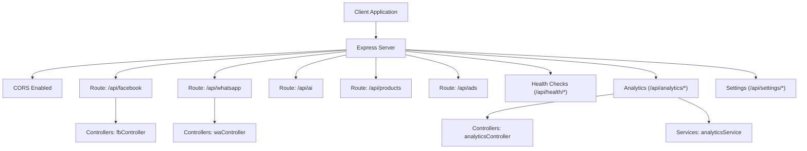
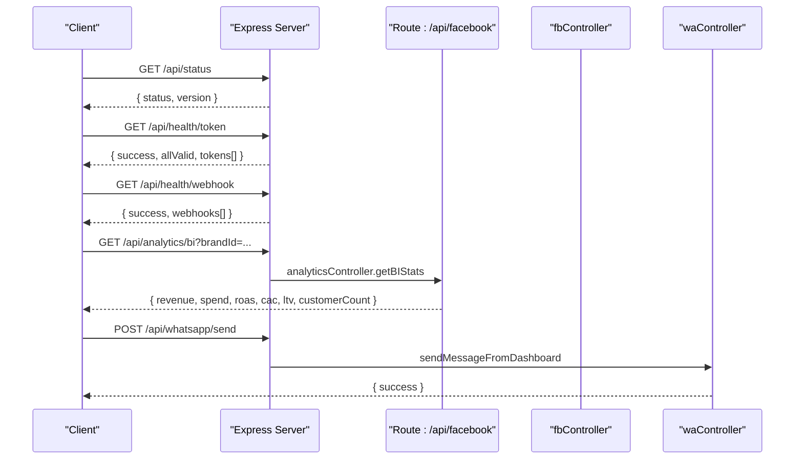
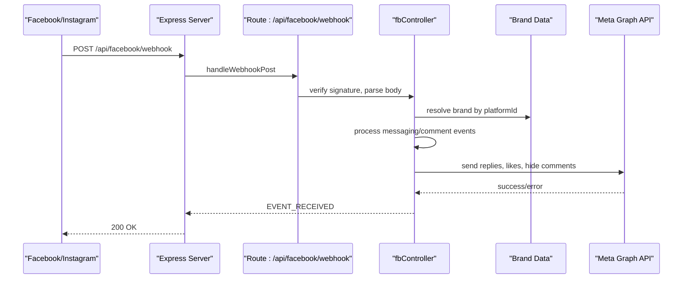
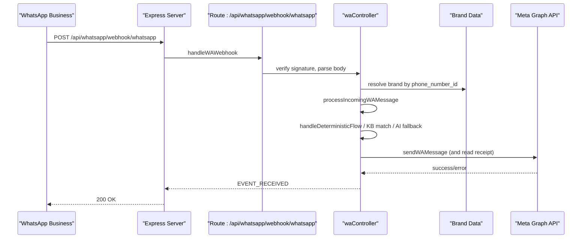
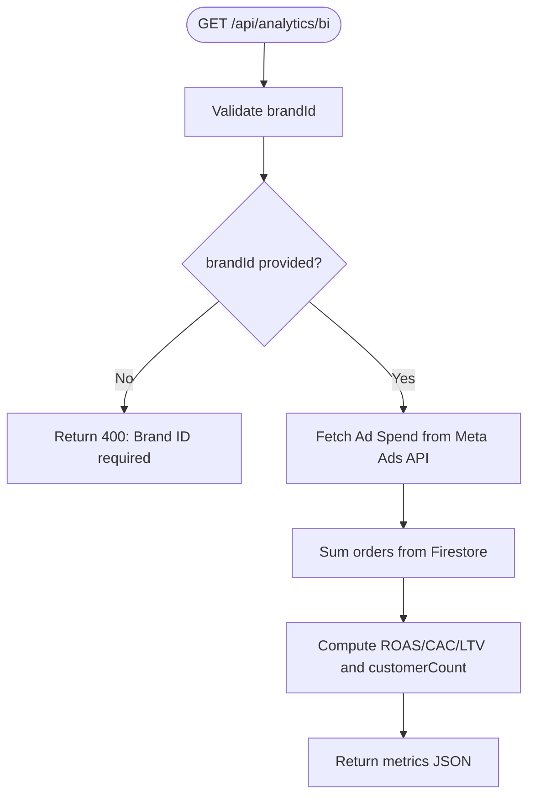
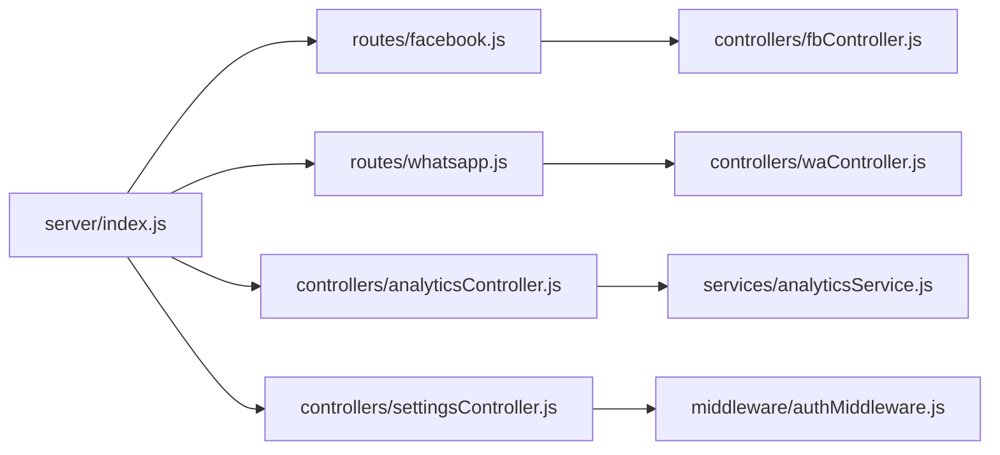

# API Reference

<cite>
**Referenced Files in This Document**
- [index.js](file://server/index.js)
- [facebook.js](file://server/routes/facebook.js)
- [whatsapp.js](file://server/routes/whatsapp.js)
- [analyticsController.js](file://server/controllers/analyticsController.js)
- [analyticsService.js](file://server/services/analyticsService.js)
- [fbController.js](file://server/controllers/fbController.js)
- [waController.js](file://server/controllers/waController.js)
- [authMiddleware.js](file://server/middleware/authMiddleware.js)
- [set_cors.js](file://server/set_cors.js)
</cite>

## Table of Contents
1. [Introduction](#introduction)
2. [Project Structure](#project-structure)
3. [Core Components](#core-components)
4. [Architecture Overview](#architecture-overview)
5. [Detailed Component Analysis](#detailed-component-analysis)
6. [Dependency Analysis](#dependency-analysis)
7. [Performance Considerations](#performance-considerations)
8. [Troubleshooting Guide](#troubleshooting-guide)
9. [Conclusion](#conclusion)
10. [Appendices](#appendices)

## Introduction
This document provides a comprehensive API reference for the Facebook webhooks, WhatsApp messaging, analytics retrieval, and system management endpoints. It covers HTTP methods, URL patterns, request/response schemas, authentication, webhook handling, real-time event processing, batch operations, error handling, rate limiting, and security considerations. Practical integration examples and debugging techniques are included to help clients implement reliable integrations.

## Project Structure
The API is implemented as an Express server with modular routes and controllers. Public endpoints are mounted under /api, while webhook verification and processing endpoints are also exposed at the root level for compatibility. CORS is enabled globally, and authentication is enforced via a role-checking middleware for protected endpoints.

**Diagram sources**
- [index.js:37-192](file://server/index.js#L37-L192)
- [facebook.js:1-42](file://server/routes/facebook.js#L1-L42)
- [whatsapp.js:1-15](file://server/routes/whatsapp.js#L1-L15)

**Section sources**
- [index.js:25-35](file://server/index.js#L25-L35)
- [index.js:175-192](file://server/index.js#L175-L192)

## Core Components
- Facebook Webhooks: Verification and event handling for Facebook Pages and Instagram.
- WhatsApp Messaging: Webhook verification, inbound message processing, outbound sending, and vision-based product matching.
- Analytics Retrieval: BI metrics aggregation for revenue, spend, ROAS, CAC, LTV, and customer count.
- System Management: Health checks, settings management, and administrative controls.

**Section sources**
- [facebook.js:7-12](file://server/routes/facebook.js#L7-L12)
- [whatsapp.js:6-12](file://server/routes/whatsapp.js#L6-L12)
- [analyticsController.js:3-17](file://server/controllers/analyticsController.js#L3-L17)
- [index.js:184-191](file://server/index.js#L184-L191)

## Architecture Overview
The API exposes:
- Public endpoints under /api prefixed routes.
- Root-level webhook endpoints for legacy compatibility.
- Health endpoints for token and subscription status.
- Role-based protected endpoints for administrative actions.

**Diagram sources**
- [index.js:38-46](file://server/index.js#L38-L46)
- [index.js:51-124](file://server/index.js#L51-L124)
- [index.js:184-188](file://server/index.js#L184-L188)
- [waController.js:543-603](file://server/controllers/waController.js#L543-L603)

## Detailed Component Analysis

### Facebook Webhooks
- Purpose: Verify webhook subscriptions and process inbound messages/comments from Facebook and Instagram.
- Security: Validates HMAC signatures and enforces idempotency to avoid duplicate processing.
- Real-time processing: Parses events, identifies brands, and triggers automated replies or AI fallbacks.
- Batch operations: Supports bulk indexing of products and uploading media via proxy.

Endpoints
- GET /api/facebook/webhook
  - Description: Verify webhook subscription.
  - Query parameters: hub.mode, hub.verify_token.
  - Response: Challenge string on success; 403 on failure.
  - Authentication: None.
  - Notes: Also available at root-level /webhook for backward compatibility.

- POST /api/facebook/webhook
  - Description: Handle inbound webhook events.
  - Headers: x-hub-signature-256 or x-hub-signature (HMAC SHA256).
  - Body: Webhook payload from Facebook/Instagram.
  - Response: EVENT_RECEIVED on success; logs and processes events asynchronously.
  - Authentication: None.
  - Security: Signature verification; logs raw webhook for debugging.

- POST /api/facebook/messages/send
  - Description: Send a message from the dashboard.
  - Body: recipientId, text, brandId.
  - Response: { success }.
  - Authentication: None.

- POST /api/facebook/upload
  - Description: Upload a file to storage via proxy.
  - Form-data: file (single).
  - Response: { success, url } or error.
  - Authentication: None.

- POST /api/facebook/ai/generate-comment-variations
  - Description: Generate AI variations for comment replies.
  - Body: keywords[], brandId, count.
  - Response: { success, variations[] }.
  - Authentication: None.

- POST /api/facebook/ai/hide-comment
  - Description: Hide a comment via Facebook API.
  - Body: commentId, brandId.
  - Response: { success } or error.
  - Authentication: None.

- GET /api/facebook/brands/:brandId/posts
  - Description: Retrieve latest posts for a brand’s page.
  - Path params: brandId.
  - Response: { posts[] }.
  - Authentication: None.

- GET /api/facebook/brands/:brandId/posts/:postId
  - Description: Retrieve a specific post by ID.
  - Path params: brandId, postId.
  - Response: { post }.
  - Authentication: None.

- POST /api/facebook/brands/:brandId/index-products
  - Description: Index brand products for fingerprint matching.
  - Path params: brandId.
  - Response: { success, indexed }.
  - Authentication: None.

Processing Logic
- Idempotency: Prevents reprocessing of the same event using Firestore.
- Retry: Retries Facebook API calls on transient/rate-limit errors.
- Timeout safeguards: Wraps long-running tasks to prevent cold-start timeouts.
- Duplicate prevention: Tracks processed comments in memory and Firestore.

**Diagram sources**
- [facebook.js:7-12](file://server/routes/facebook.js#L7-L12)
- [fbController.js:176-323](file://server/controllers/fbController.js#L176-L323)

**Section sources**
- [facebook.js:7-39](file://server/routes/facebook.js#L7-L39)
- [fbController.js:155-323](file://server/controllers/fbController.js#L155-L323)
- [fbController.js:101-115](file://server/controllers/fbController.js#L101-L115)
- [fbController.js:54-71](file://server/controllers/fbController.js#L54-L71)

### WhatsApp Messaging
- Purpose: Verify webhook subscriptions and process inbound messages, images, and voice notes.
- Capabilities: Deterministic flow for orders, lead capture, knowledge base matching, AI fallback, and vision-based product discovery.
- Outbound messaging: Sends replies and marks messages as read.

Endpoints
- GET /api/whatsapp/webhook/whatsapp
  - Description: Verify WhatsApp Business webhook subscription.
  - Query parameters: hub.mode, hub.verify_token.
  - Response: Challenge string on success; 403 on failure.
  - Authentication: None.

- POST /api/whatsapp/webhook/whatsapp
  - Description: Handle inbound WhatsApp messages.
  - Headers: x-hub-signature-256 or x-hub-signature (HMAC SHA256).
  - Body: Webhook payload from WhatsApp Business API.
  - Response: EVENT_RECEIVED on success.
  - Authentication: None.
  - Security: Signature verification; logs raw webhook for debugging.

- POST /api/whatsapp/send
  - Description: Send a message from the dashboard.
  - Body: recipientId, text, brandId.
  - Response: { success }.
  - Authentication: None.

Processing Logic
- Deterministic flow: Handles greeting -> collect phone -> collect address -> confirmation steps.
- Lead capture: Extracts phone numbers and addresses from messages.
- Knowledge base and drafts: Fuzzy matching with phonetic normalization.
- AI fallback: Uses Gemini to generate contextual responses.
- Vision: Hash-based product matching and OCR fallback.
- Read receipts: Marks messages as read upon reply.

**Diagram sources**
- [whatsapp.js:6-12](file://server/routes/whatsapp.js#L6-L12)
- [waController.js:28-75](file://server/controllers/waController.js#L28-L75)
- [waController.js:77-167](file://server/controllers/waController.js#L77-L167)
- [waController.js:310-396](file://server/controllers/waController.js#L310-L396)

**Section sources**
- [whatsapp.js:6-12](file://server/routes/whatsapp.js#L6-L12)
- [waController.js:11-25](file://server/controllers/waController.js#L11-L25)
- [waController.js:28-75](file://server/controllers/waController.js#L28-L75)
- [waController.js:77-167](file://server/controllers/waController.js#L77-L167)
- [waController.js:310-396](file://server/controllers/waController.js#L310-L396)

### Analytics Retrieval
- Endpoint: GET /api/analytics/bi
  - Description: Retrieve BI metrics for a brand.
  - Query parameters: brandId (required).
  - Response: { revenue, spend, roas, cac, ltv, customerCount }.
  - Authentication: Requires role admin or ads.

Implementation highlights
- Ad spend: Aggregates spend from Meta Ads API using configured account credentials.
- Sales revenue: Sum of orders from Firestore filtered by brandId.
- Metrics: Calculates ROAS, CAC, and LTV; counts customers.

**Diagram sources**
- [analyticsController.js:3-17](file://server/controllers/analyticsController.js#L3-L17)
- [analyticsService.js:7-76](file://server/services/analyticsService.js#L7-L76)

**Section sources**
- [analyticsController.js:3-17](file://server/controllers/analyticsController.js#L3-L17)
- [analyticsService.js:7-76](file://server/services/analyticsService.js#L7-L76)

### System Management
- Health checks
  - GET /api/health/token: Validates page tokens and environment tokens.
  - GET /api/health/webhook: Checks webhook subscriptions for feed and messages.
  - GET /api/health/automation: Reports automation readiness and rule presence.
- Settings
  - GET /api/settings/automation: Retrieves automation settings.
  - POST /api/settings/automation: Updates a setting by key.
  - POST /api/settings/automation/disable-all: Disables all automations.

Authentication
- Protected endpoints enforce roles via a custom header x-user-role.
- Allowed roles include admin and ads.

**Section sources**
- [index.js:51-171](file://server/index.js#L51-L171)
- [index.js:184-191](file://server/index.js#L184-L191)
- [authMiddleware.js:6-21](file://server/middleware/authMiddleware.js#L6-L21)

## Dependency Analysis
- Route-to-controller mapping defines clear boundaries between HTTP entry points and business logic.
- Controllers depend on services for external API calls and Firestore operations.
- Middleware enforces role-based access for sensitive endpoints.
- CORS is configured globally; storage bucket CORS is managed separately.

**Diagram sources**
- [index.js:175-192](file://server/index.js#L175-L192)
- [facebook.js:1-6](file://server/routes/facebook.js#L1-L6)
- [whatsapp.js:1-4](file://server/routes/whatsapp.js#L1-L4)
- [analyticsController.js:1](file://server/controllers/analyticsController.js#L1)
- [analyticsService.js:1](file://server/services/analyticsService.js#L1)
- [authMiddleware.js:1](file://server/middleware/authMiddleware.js#L1)

**Section sources**
- [index.js:175-192](file://server/index.js#L175-L192)

## Performance Considerations
- Webhook throughput: Facebook/Instagram events are processed concurrently with idempotency and retry logic to handle rate limits and transient failures.
- Timeout safeguards: Long-running tasks are wrapped to prevent cold-start timeouts; fallback persistence ensures resilience.
- Storage uploads: Parallel upload attempts to Firebase and Imgur with fast failover reduce latency.
- Deterministic matching: Fuse.js fuzzy matching with phonetic normalization balances accuracy and performance.

[No sources needed since this section provides general guidance]

## Troubleshooting Guide
Common issues and resolutions
- Webhook signature mismatch: Ensure APP_SECRET is configured and matches Meta’s signing secret. Signature verification is performed during webhook processing.
- Token invalid/expired: Use /api/health/token to validate tokens; expired tokens are flagged in Firestore for visibility.
- Webhook subscription missing: Use /api/health/webhook to check subscribed fields (feed, messages).
- Rate limiting: The system retries on known transient errors and rate limit codes; monitor logs for retry activity.
- CORS errors: For storage uploads, configure bucket CORS appropriately; a helper script sets bucket CORS policies.

Debugging techniques
- Inspect raw webhook payloads logged to Firestore collections for Facebook and WhatsApp.
- Enable logging around retry and timeout wrappers to trace execution paths.
- Use health endpoints to confirm token validity and webhook subscription status.

**Section sources**
- [fbController.js:183-199](file://server/controllers/fbController.js#L183-L199)
- [fbController.js:122-152](file://server/controllers/fbController.js#L122-L152)
- [index.js:51-124](file://server/index.js#L51-L124)
- [set_cors.js:19-34](file://server/set_cors.js#L19-L34)

## Conclusion
This API provides robust, production-grade integrations for Facebook and WhatsApp, along with analytics and system management capabilities. By leveraging HMAC verification, idempotency, retries, and timeout safeguards, the system ensures reliable real-time event processing. Administrators can monitor token and webhook health, while clients can consume analytics and manage automations securely.

[No sources needed since this section summarizes without analyzing specific files]

## Appendices

### Authentication and Authorization
- Role-based access: Enforced via x-user-role header for protected endpoints.
- Allowed roles: admin, ads.
- Example: Call protected endpoints with the appropriate role header.

**Section sources**
- [authMiddleware.js:6-21](file://server/middleware/authMiddleware.js#L6-L21)
- [index.js:184-191](file://server/index.js#L184-L191)

### CORS Configuration
- Server-side CORS: Enabled globally with origin set to *. For production, restrict origins to trusted domains.
- Storage bucket CORS: Managed via a dedicated script to allow necessary HTTP methods and headers.

**Section sources**
- [index.js:26](file://server/index.js#L26)
- [set_cors.js:23-30](file://server/set_cors.js#L23-L30)

### API Versioning
- Versioning: Exposed in the status endpoint; current version is indicated for monitoring and client awareness.

**Section sources**
- [index.js:38](file://server/index.js#L38)

### Practical Integration Scenarios
- Facebook webhook setup
  - Configure verify_token and APP_SECRET in environment variables.
  - Subscribe to feed and messages for Pages/Instagram.
  - Verify subscription via GET /api/facebook/webhook and confirm challenge response.

- WhatsApp webhook setup
  - Configure WA_VERIFY_TOKEN and WA_APP_SECRET.
  - Subscribe to messages for the WhatsApp Business phone number.
  - Verify subscription via GET /api/whatsapp/webhook/whatsapp.

- Sending a dashboard message
  - Call POST /api/whatsapp/send with recipientId, text, and brandId.

- Retrieving BI metrics
  - Call GET /api/analytics/bi with brandId and required role.

**Section sources**
- [facebook.js:7-12](file://server/routes/facebook.js#L7-L12)
- [whatsapp.js:6-12](file://server/routes/whatsapp.js#L6-L12)
- [waController.js:543-603](file://server/controllers/waController.js#L543-L603)
- [analyticsController.js:3-17](file://server/controllers/analyticsController.js#L3-L17)