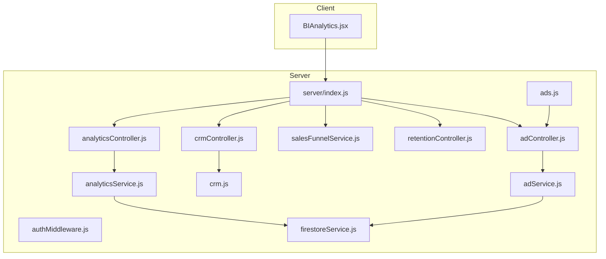
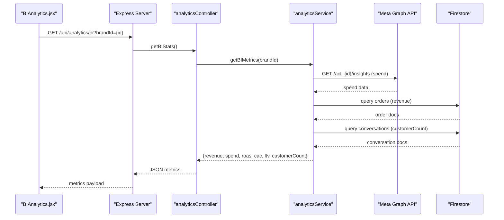
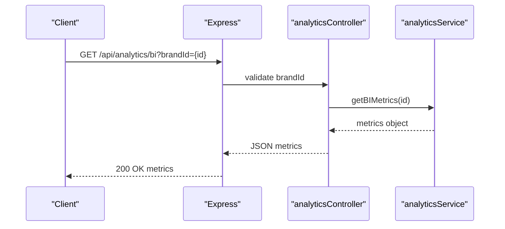
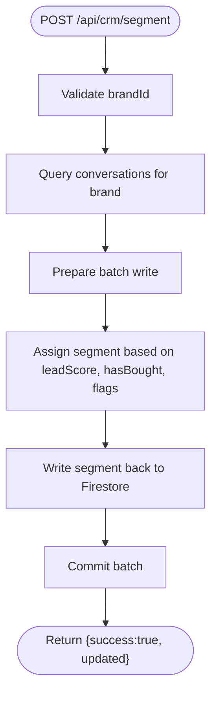
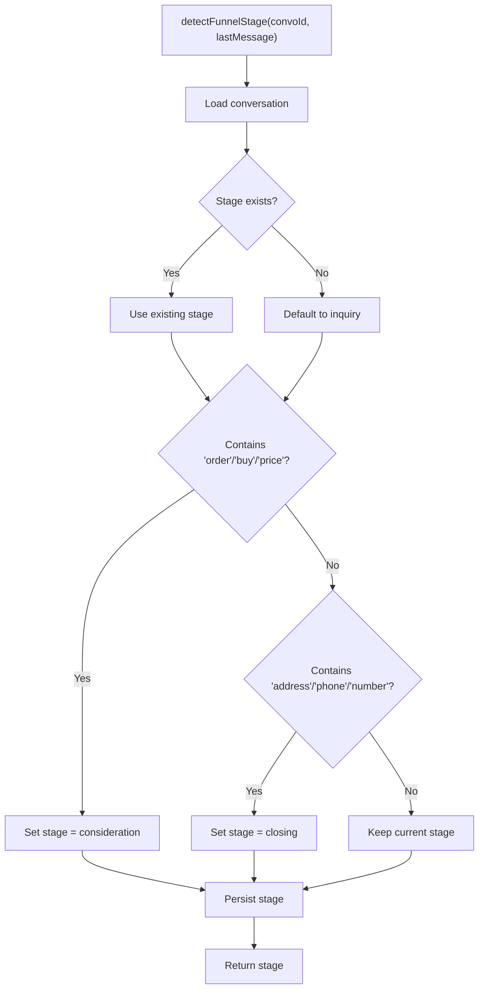
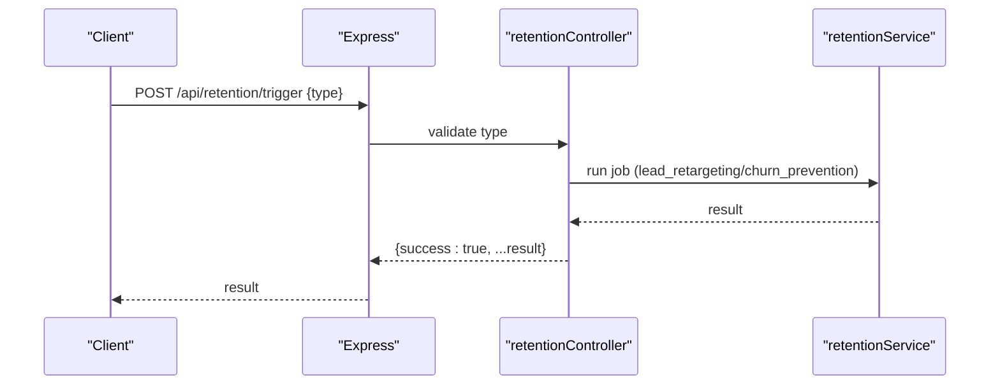
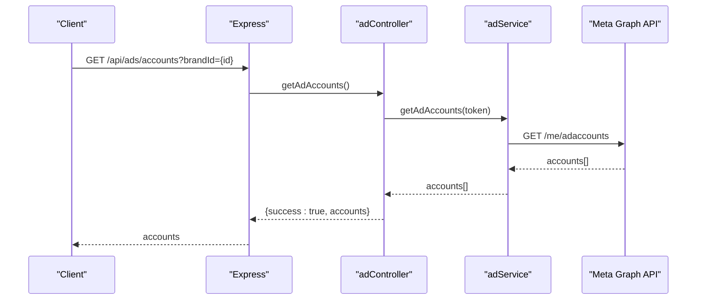
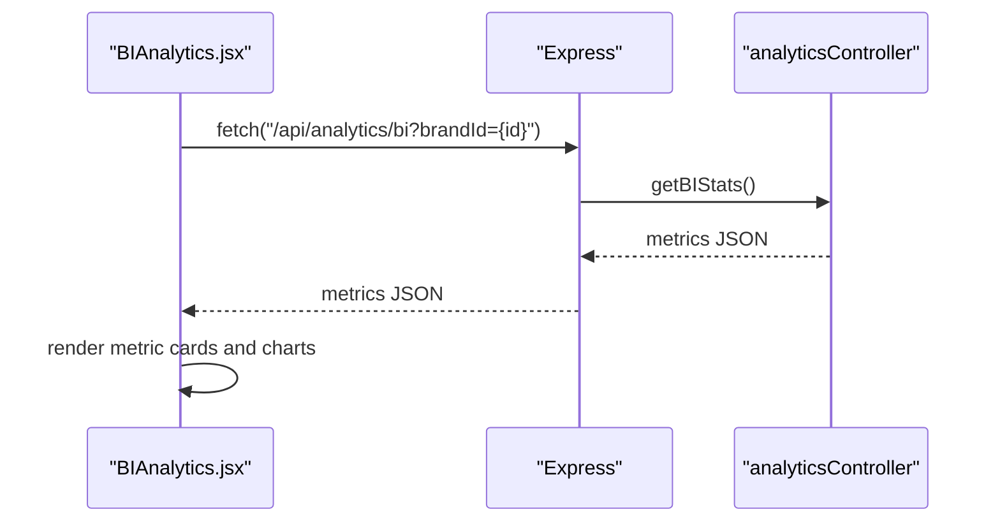
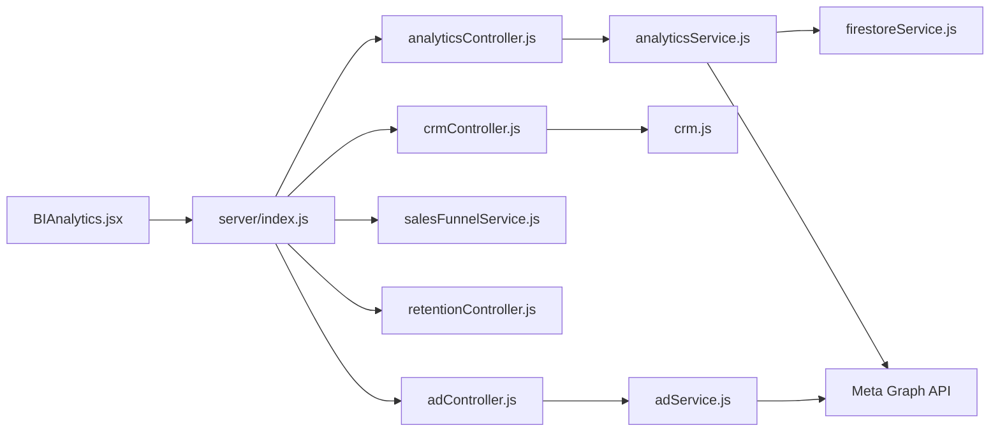

# Analytics and Data API

<cite>
**Referenced Files in This Document**
- [server/index.js](file://server/index.js)
- [server/middleware/authMiddleware.js](file://server/middleware/authMiddleware.js)
- [server/controllers/analyticsController.js](file://server/controllers/analyticsController.js)
- [server/services/analyticsService.js](file://server/services/analyticsService.js)
- [server/controllers/crmController.js](file://server/controllers/crmController.js)
- [server/routes/crm.js](file://server/routes/crm.js)
- [server/services/salesFunnelService.js](file://server/services/salesFunnelService.js)
- [server/controllers/retentionController.js](file://server/controllers/retentionController.js)
- [server/services/adService.js](file://server/services/adService.js)
- [server/controllers/adController.js](file://server/controllers/adController.js)
- [server/routes/ads.js](file://server/routes/ads.js)
- [client/src/components/BIAnalytics.jsx](file://client/src/components/BIAnalytics.jsx)
- [server/services/firestoreService.js](file://server/services/firestoreService.js)
</cite>

## Table of Contents
1. [Introduction](#introduction)
2. [Project Structure](#project-structure)
3. [Core Components](#core-components)
4. [Architecture Overview](#architecture-overview)
5. [Detailed Component Analysis](#detailed-component-analysis)
6. [Dependency Analysis](#dependency-analysis)
7. [Performance Considerations](#performance-considerations)
8. [Troubleshooting Guide](#troubleshooting-guide)
9. [Conclusion](#conclusion)
10. [Appendices](#appendices)

## Introduction
This document provides comprehensive API documentation for business intelligence and analytics endpoints. It covers performance metrics retrieval, conversion tracking data, customer insights aggregation, and business KPI calculations. It also documents endpoint specifications for real-time analytics, historical data queries, and report generation, along with data filtering options, time range parameters, and aggregation methods. Authentication requirements, data access permissions, and export capabilities are explained, alongside practical examples for common analytics scenarios, data visualization integration, and automated reporting workflows. Privacy considerations and compliance requirements for customer analytics are addressed.

## Project Structure
The analytics and BI stack is implemented as a modular Express server with controllers, services, and routes. The frontend integrates with the backend via a dedicated BI dashboard component. Key modules include:
- Analytics endpoints for real-time BI metrics
- CRM segmentation and stats
- Sales funnel stage detection and prompts
- Retention automation triggers and stats
- Meta Ads integration for ad spend and conversion events
- Authentication middleware enforcing role-based access

**Diagram sources**
- [server/index.js:175-192](file://server/index.js#L175-L192)
- [server/controllers/analyticsController.js:1-21](file://server/controllers/analyticsController.js#L1-L21)
- [server/services/analyticsService.js:1-81](file://server/services/analyticsService.js#L1-L81)
- [server/controllers/crmController.js:1-78](file://server/controllers/crmController.js#L1-L78)
- [server/routes/crm.js:1-9](file://server/routes/crm.js#L1-L9)
- [server/services/salesFunnelService.js:1-61](file://server/services/salesFunnelService.js#L1-L61)
- [server/controllers/retentionController.js:1-52](file://server/controllers/retentionController.js#L1-L52)
- [server/controllers/adController.js:1-67](file://server/controllers/adController.js#L1-L67)
- [server/services/adService.js:1-104](file://server/services/adService.js#L1-L104)
- [server/routes/ads.js:1-12](file://server/routes/ads.js#L1-L12)
- [client/src/components/BIAnalytics.jsx:1-170](file://client/src/components/BIAnalytics.jsx#L1-L170)
- [server/services/firestoreService.js:1-126](file://server/services/firestoreService.js#L1-L126)

**Section sources**
- [server/index.js:175-192](file://server/index.js#L175-L192)
- [client/src/components/BIAnalytics.jsx:1-170](file://client/src/components/BIAnalytics.jsx#L1-L170)

## Core Components
- Analytics controller and service: Provide real-time BI metrics (revenue, spend, ROAS, CAC, LTV, customer count) aggregated from Firestore orders and Meta Ads insights.
- CRM segmentation controller: Runs batch segmentation of conversations into categories and returns distribution statistics.
- Sales funnel service: Detects funnel stage from conversation context and augments AI responses to guide progression.
- Retention controller: Triggers automation jobs (lead retargeting, churn prevention) and exposes summary stats.
- Meta Ads integration: Retrieves ad spend from Meta Graph API and supports conversion events and audience sync.
- Authentication middleware: Enforces role-based access control for analytics endpoints.

**Section sources**
- [server/controllers/analyticsController.js:1-21](file://server/controllers/analyticsController.js#L1-L21)
- [server/services/analyticsService.js:1-81](file://server/services/analyticsService.js#L1-L81)
- [server/controllers/crmController.js:1-78](file://server/controllers/crmController.js#L1-L78)
- [server/services/salesFunnelService.js:1-61](file://server/services/salesFunnelService.js#L1-L61)
- [server/controllers/retentionController.js:1-52](file://server/controllers/retentionController.js#L1-L52)
- [server/services/adService.js:1-104](file://server/services/adService.js#L1-L104)
- [server/middleware/authMiddleware.js:1-26](file://server/middleware/authMiddleware.js#L1-L26)

## Architecture Overview
The system follows a layered architecture:
- Presentation layer: BI dashboard component fetches metrics from the backend.
- API layer: Express routes expose endpoints under /api.
- Controller layer: Route handlers orchestrate requests and delegate to services.
- Service layer: Implement business logic, integrate with Firestore and external APIs.
- Data layer: Firestore collections store orders, conversations, brands, and leads.

**Diagram sources**
- [server/index.js:184-184](file://server/index.js#L184-L184)
- [server/controllers/analyticsController.js:3-17](file://server/controllers/analyticsController.js#L3-L17)
- [server/services/analyticsService.js:54-76](file://server/services/analyticsService.js#L54-L76)
- [server/services/analyticsService.js:7-28](file://server/services/analyticsService.js#L7-L28)
- [server/services/analyticsService.js:33-49](file://server/services/analyticsService.js#L33-L49)
- [server/services/analyticsService.js:58-62](file://server/services/analyticsService.js#L58-L62)

## Detailed Component Analysis

### Analytics Endpoints
- Endpoint: GET /api/analytics/bi
  - Purpose: Retrieve real-time business intelligence metrics for a brand.
  - Authentication: Requires role in ["admin", "ads"] enforced by middleware.
  - Query parameters:
    - brandId (required): Identifier of the brand to compute metrics for.
  - Response fields:
    - revenue: Total sales revenue for the brand.
    - spend: Ad spend retrieved from Meta Ads API.
    - roas: Return on ad spend (revenue / spend).
    - cac: Cost per acquisition (spend / customerCount).
    - ltv: Lifetime value (revenue / customerCount).
    - customerCount: Number of identified customers from conversations.
  - Error handling:
    - 400 Bad Request if brandId is missing.
    - 500 Internal Server Error on service failures.

**Diagram sources**
- [server/index.js:184-184](file://server/index.js#L184-L184)
- [server/controllers/analyticsController.js:3-17](file://server/controllers/analyticsController.js#L3-L17)
- [server/services/analyticsService.js:54-76](file://server/services/analyticsService.js#L54-L76)

**Section sources**
- [server/index.js:184-184](file://server/index.js#L184-L184)
- [server/middleware/authMiddleware.js:6-21](file://server/middleware/authMiddleware.js#L6-L21)
- [server/controllers/analyticsController.js:3-17](file://server/controllers/analyticsController.js#L3-L17)
- [server/services/analyticsService.js:54-76](file://server/services/analyticsService.js#L54-L76)

### CRM Segmentation Endpoints
- Endpoint: POST /api/crm/segment
  - Purpose: Run batch segmentation for all conversations of a brand.
  - Body parameters:
    - brandId (required): Brand identifier.
  - Behavior: Computes a segment label for each conversation and writes it back.
  - Response: success flag and number of updated documents.

- Endpoint: GET /api/crm/stats
  - Purpose: Retrieve distribution statistics for segments.
  - Query parameters:
    - brandId (required): Brand identifier.
  - Response: stats object with counts per segment and total.

**Diagram sources**
- [server/controllers/crmController.js:9-43](file://server/controllers/crmController.js#L9-L43)
- [server/routes/crm.js:5-6](file://server/routes/crm.js#L5-L6)

**Section sources**
- [server/controllers/crmController.js:9-75](file://server/controllers/crmController.js#L9-L75)
- [server/routes/crm.js:1-9](file://server/routes/crm.js#L1-L9)

### Sales Funnel Service
- Stage detection:
  - Detects funnel stage from the latest message in a conversation.
  - Stages: inquiry, consideration, closing, completed.
- Prompt enhancement:
  - Augments AI-generated responses with stage-specific prompts to drive conversions.

**Diagram sources**
- [server/services/salesFunnelService.js:13-32](file://server/services/salesFunnelService.js#L13-L32)

**Section sources**
- [server/services/salesFunnelService.js:1-61](file://server/services/salesFunnelService.js#L1-L61)

### Retention Automation Endpoints
- Endpoint: POST /api/retention/trigger
  - Purpose: Trigger retention automation jobs.
  - Body parameters:
    - type (required): One of lead_retargeting or churn_prevention.
  - Response: success flag and job-specific result.

- Endpoint: GET /api/retention/stats
  - Purpose: Retrieve summary stats for retention.
  - Response: pendingFollowups, churnRisk, recovered.

**Diagram sources**
- [server/index.js:182-183](file://server/index.js#L182-L183)
- [server/controllers/retentionController.js:4-21](file://server/controllers/retentionController.js#L4-L21)

**Section sources**
- [server/index.js:182-183](file://server/index.js#L182-L183)
- [server/controllers/retentionController.js:1-52](file://server/controllers/retentionController.js#L1-L52)

### Meta Ads Integration
- Ad account retrieval:
  - Endpoint: GET /api/ads/accounts
  - Query parameters:
    - brandId (required): Brand identifier used to resolve access token.
  - Response: success flag and accounts array.

- Custom audience sync:
  - Endpoint: POST /api/ads/sync-audience
  - Body parameters:
    - brandId (required)
    - adAccountId (required)
    - audienceName (required)
    - segment (optional): Filters leads by segment.
  - Behavior: Hashes lead emails and creates/updates a custom audience.

- Conversion events (CAPI):
  - Service method: sendConversionEvent(pixelId, eventName, userData, accessToken)
  - Purpose: Sends server-side conversion events to Meta Pixel.

**Diagram sources**
- [server/index.js:179-180](file://server/index.js#L179-L180)
- [server/controllers/adController.js:9-26](file://server/controllers/adController.js#L9-L26)
- [server/services/adService.js:12-25](file://server/services/adService.js#L12-L25)

**Section sources**
- [server/routes/ads.js:1-12](file://server/routes/ads.js#L1-L12)
- [server/controllers/adController.js:1-67](file://server/controllers/adController.js#L1-L67)
- [server/services/adService.js:1-104](file://server/services/adService.js#L1-L104)

### Frontend Integration (BI Dashboard)
- Component: BIAnalytics.jsx
  - Fetches metrics from GET /api/analytics/bi using activeBrandId.
  - Renders cards for revenue, spend, ROAS, and CAC.
  - Displays LTV distribution and growth efficiency gauge.
  - Uses environment variable VITE_API_URL for base API URL.

**Diagram sources**
- [client/src/components/BIAnalytics.jsx:16-29](file://client/src/components/BIAnalytics.jsx#L16-L29)
- [server/index.js:184-184](file://server/index.js#L184-L184)
- [server/controllers/analyticsController.js:3-17](file://server/controllers/analyticsController.js#L3-L17)

**Section sources**
- [client/src/components/BIAnalytics.jsx:1-170](file://client/src/components/BIAnalytics.jsx#L1-L170)

## Dependency Analysis
- Controllers depend on services for business logic.
- Services depend on Firestore for data access and external APIs for analytics and advertising.
- Routes register endpoints and apply authentication middleware.
- Frontend depends on backend endpoints for data rendering.

**Diagram sources**
- [server/index.js:175-192](file://server/index.js#L175-L192)
- [server/controllers/analyticsController.js:1-21](file://server/controllers/analyticsController.js#L1-L21)
- [server/services/analyticsService.js:1-81](file://server/services/analyticsService.js#L1-L81)
- [server/controllers/crmController.js:1-78](file://server/controllers/crmController.js#L1-L78)
- [server/routes/crm.js:1-9](file://server/routes/crm.js#L1-L9)
- [server/services/salesFunnelService.js:1-61](file://server/services/salesFunnelService.js#L1-L61)
- [server/controllers/retentionController.js:1-52](file://server/controllers/retentionController.js#L1-L52)
- [server/controllers/adController.js:1-67](file://server/controllers/adController.js#L1-L67)
- [server/services/adService.js:1-104](file://server/services/adService.js#L1-L104)
- [client/src/components/BIAnalytics.jsx:1-170](file://client/src/components/BIAnalytics.jsx#L1-L170)
- [server/services/firestoreService.js:1-126](file://server/services/firestoreService.js#L1-L126)

**Section sources**
- [server/index.js:175-192](file://server/index.js#L175-L192)

## Performance Considerations
- Real-time metrics:
  - The BI endpoint aggregates data from Firestore and the Meta Ads API. For high traffic, consider caching frequently accessed metrics and implementing pagination or time-range filters where applicable.
- CRM segmentation:
  - Batch writes reduce transaction costs. Ensure segment updates are triggered during off-peak hours to minimize impact on live conversations.
- Sales funnel:
  - Keyword-based stage detection is lightweight; consider adding thresholds or ML models for accuracy without heavy computation.
- Retention automation:
  - Batch processing and rate-limiting to external APIs are essential. Monitor API quotas and implement retry/backoff strategies.
- Meta Ads integration:
  - Cache ad account lists and audience IDs. Minimize repeated hashing of lead emails by deduplicating and batching requests.

[No sources needed since this section provides general guidance]

## Troubleshooting Guide
- Missing brandId:
  - Analytics and CRM endpoints require brandId. Ensure the query/body includes a valid brand identifier.
- Authentication errors:
  - Endpoints under /api/analytics/bi and /api/retention/* require roles ["admin", "ads"] or ["admin"] respectively. Verify x-user-role header or token claims.
- Meta Ads API errors:
  - Ad spend retrieval depends on configured environment variables and valid tokens. Check access token validity and permissions.
- Conversion events:
  - CAPI requires a valid pixelId and hashed user data. Validate email/phone hashing and access token.
- Firestore connectivity:
  - Ensure Firebase credentials are loaded and collections (orders, conversations, brands, leads) exist with proper indexing.

**Section sources**
- [server/controllers/analyticsController.js:6-8](file://server/controllers/analyticsController.js#L6-L8)
- [server/controllers/crmController.js:10-11](file://server/controllers/crmController.js#L10-L11)
- [server/middleware/authMiddleware.js:12-19](file://server/middleware/authMiddleware.js#L12-L19)
- [server/services/analyticsService.js:8-11](file://server/services/analyticsService.js#L8-L11)
- [server/services/adService.js:72-96](file://server/services/adService.js#L72-L96)
- [server/services/firestoreService.js:36-51](file://server/services/firestoreService.js#L36-L51)

## Conclusion
The analytics and data API provides a solid foundation for real-time BI metrics, CRM segmentation, sales funnel guidance, retention automation, and Meta Ads integration. By adhering to the documented endpoints, authentication requirements, and performance recommendations, teams can build robust dashboards, automate reporting, and maintain compliance with privacy standards.

[No sources needed since this section summarizes without analyzing specific files]

## Appendices

### Endpoint Reference

- GET /api/analytics/bi
  - Description: Retrieve business intelligence metrics for a brand.
  - Auth: x-user-role in ["admin", "ads"]
  - Query: brandId (required)
  - Response: { revenue, spend, roas, cac, ltv, customerCount }

- POST /api/crm/segment
  - Description: Run batch segmentation for brand conversations.
  - Auth: x-user-role in ["admin"]
  - Body: { brandId (required) }
  - Response: { success: true, updated: number }

- GET /api/crm/stats
  - Description: Get segment distribution stats for a brand.
  - Auth: x-user-role in ["admin"]
  - Query: brandId (required)
  - Response: { success: true, stats: object, total: number }

- POST /api/retention/trigger
  - Description: Trigger retention automation job.
  - Auth: x-user-role in ["admin"]
  - Body: { type: "lead_retargeting" | "churn_prevention" }
  - Response: { success: true, ...result }

- GET /api/retention/stats
  - Description: Get retention summary stats.
  - Auth: x-user-role in ["admin"]
  - Response: { pendingFollowups: number, churnRisk: number, recovered: number }

- GET /api/ads/accounts
  - Description: List ad accounts for a brand.
  - Auth: x-user-role in ["admin", "ads"]
  - Query: brandId (required)
  - Response: { success: true, accounts: array }

- POST /api/ads/sync-audience
  - Description: Sync leads to a custom audience.
  - Auth: x-user-role in ["admin", "ads"]
  - Body: { brandId (required), adAccountId (required), audienceName (required), segment (optional) }
  - Response: { success: true, audienceId: string, syncedCount: number }

**Section sources**
- [server/index.js:182-188](file://server/index.js#L182-L188)
- [server/routes/crm.js:5-6](file://server/routes/crm.js#L5-L6)
- [server/routes/ads.js:8-9](file://server/routes/ads.js#L8-L9)

### Request/Response Schemas

- GET /api/analytics/bi
  - Query: brandId (string)
  - Response:
    - revenue (number)
    - spend (number)
    - roas (string)
    - cac (string)
    - ltv (string)
    - customerCount (number)

- POST /api/crm/segment
  - Body: { brandId: string }
  - Response: { success: boolean, updated: number }

- GET /api/crm/stats
  - Query: brandId (string)
  - Response: { success: boolean, stats: { "Hot Lead": number, "Regular Customer": number, "Window Shopper": number, "Returning Buyer": number, "Untagged": number }, total: number }

- POST /api/ads/sync-audience
  - Body: { brandId: string, adAccountId: string, audienceName: string, segment?: string }
  - Response: { success: boolean, audienceId: string, syncedCount: number }

**Section sources**
- [server/controllers/analyticsController.js:3-17](file://server/controllers/analyticsController.js#L3-L17)
- [server/controllers/crmController.js:48-75](file://server/controllers/crmController.js#L48-L75)
- [server/controllers/adController.js:31-61](file://server/controllers/adController.js#L31-L61)

### Authentication and Permissions
- Role enforcement:
  - GET /api/analytics/bi: ["admin", "ads"]
  - GET /api/retention/stats: ["admin"]
  - POST /api/retention/trigger: ["admin"]
  - POST /api/crm/segment: ["admin"]
  - GET /api/crm/stats: ["admin"]
  - GET /api/ads/accounts: ["admin", "ads"]
  - POST /api/ads/sync-audience: ["admin", "ads"]
- Header requirement:
  - x-user-role: string indicating user role.

**Section sources**
- [server/index.js:182-188](file://server/index.js#L182-L188)
- [server/middleware/authMiddleware.js:6-21](file://server/middleware/authMiddleware.js#L6-L21)

### Data Filtering and Aggregation Methods
- Filtering:
  - brandId: Used across analytics, CRM, and ads endpoints to scope data.
  - segment: Optional filter for lead audiences in ad sync.
- Aggregation:
  - BI metrics: Sum of order totals for revenue; Meta Ads spend; derived KPIs (ROAS, CAC, LTV).
  - CRM stats: Count per segment across conversations.
  - Retention stats: Counts of pending follow-ups and recovered customers.

**Section sources**
- [server/services/analyticsService.js:33-66](file://server/services/analyticsService.js#L33-L66)
- [server/controllers/crmController.js:48-75](file://server/controllers/crmController.js#L48-L75)
- [server/controllers/retentionController.js:23-46](file://server/controllers/retentionController.js#L23-L46)

### Practical Examples
- Real-time BI dashboard:
  - Fetch metrics via GET /api/analytics/bi and render cards in BIAnalytics.jsx.
- Funnel health monitoring:
  - Use detectFunnelStage to update conversation stages and generateFunnelResponse to guide AI replies.
- Automated reporting:
  - Schedule POST /api/retention/trigger for lead_retargeting or churn_prevention and poll GET /api/retention/stats for summaries.
- Conversion tracking:
  - On purchase, call sendConversionEvent with hashed user identifiers and event name.

**Section sources**
- [client/src/components/BIAnalytics.jsx:16-29](file://client/src/components/BIAnalytics.jsx#L16-L29)
- [server/services/salesFunnelService.js:13-54](file://server/services/salesFunnelService.js#L13-L54)
- [server/controllers/retentionController.js:4-21](file://server/controllers/retentionController.js#L4-L21)
- [server/services/adService.js:72-96](file://server/services/adService.js#L72-L96)

### Data Privacy and Compliance
- Data minimization:
  - Only collect and process necessary identifiers (e.g., hashed emails for audiences).
- Consent and transparency:
  - Ensure users are informed about analytics and advertising use.
- Secure storage:
  - Protect access tokens and API keys in environment variables.
- Export controls:
  - Implement access logs and audit trails for sensitive endpoints.

[No sources needed since this section provides general guidance]