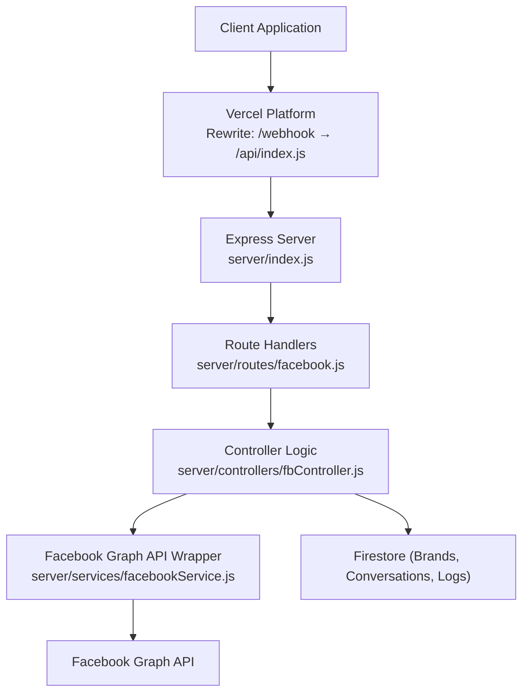
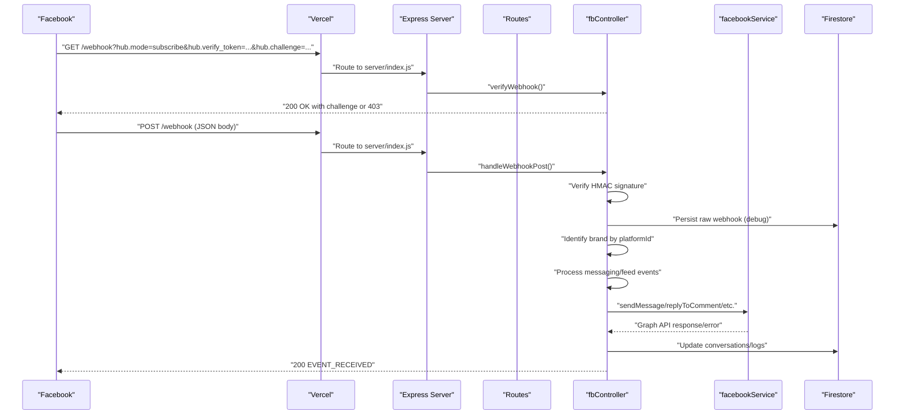
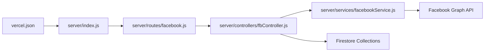

# Facebook Messaging API

<cite>
**Referenced Files in This Document**
- [server/index.js](file://server/index.js)
- [server/routes/facebook.js](file://server/routes/facebook.js)
- [server/controllers/fbController.js](file://server/controllers/fbController.js)
- [server/services/facebookService.js](file://server/services/facebookService.js)
- [vercel.json](file://vercel.json)
- [deploy_vercel_env.sh](file://deploy_vercel_env.sh)
</cite>

## Table of Contents
1. [Introduction](#introduction)
2. [Project Structure](#project-structure)
3. [Core Components](#core-components)
4. [Architecture Overview](#architecture-overview)
5. [Detailed Component Analysis](#detailed-component-analysis)
6. [Dependency Analysis](#dependency-analysis)
7. [Performance Considerations](#performance-considerations)
8. [Troubleshooting Guide](#troubleshooting-guide)
9. [Conclusion](#conclusion)

## Introduction
This document provides comprehensive API documentation for Facebook Messenger integration endpoints. It covers webhook verification and event handling, conversation history synchronization, direct message sending, file uploads, and AI-powered comment variations. It also explains authentication using Facebook Page Access Tokens, webhook verification, real-time event payload structures, error handling strategies, rate limiting considerations, and best practices for webhook reliability.

## Project Structure
The Facebook integration is implemented as part of a modular Express server with route registration and controller/service orchestration. The Vercel deployment rewrites `/webhook` and `/api/*` to the server entry point.

**Diagram sources**
- [server/index.js:37-46](file://server/index.js#L37-L46)
- [server/routes/facebook.js:1-42](file://server/routes/facebook.js#L1-L42)
- [server/controllers/fbController.js:154-323](file://server/controllers/fbController.js#L154-L323)
- [server/services/facebookService.js:1-287](file://server/services/facebookService.js#L1-L287)
- [vercel.json:3-7](file://vercel.json#L3-L7)

**Section sources**
- [server/index.js:25-46](file://server/index.js#L25-L46)
- [server/routes/facebook.js:1-42](file://server/routes/facebook.js#L1-L42)
- [vercel.json:1-16](file://vercel.json#L1-L16)

## Core Components
- Webhook verification endpoint validates Meta’s challenge using a shared verify token.
- Webhook POST endpoint parses inbound events, authenticates via HMAC signature, deduplicates, and triggers processing.
- Conversation history sync endpoint fetches recent conversations and messages for a brand.
- Direct message sending endpoint enables admin-triggered outbound messages and media sequences.
- File upload proxy endpoint uploads media to Firebase Storage or Imgur with fast failover.
- AI-powered comment variations endpoint generates public/private reply pairs for comments.

**Section sources**
- [server/controllers/fbController.js:154-323](file://server/controllers/fbController.js#L154-L323)
- [server/controllers/fbController.js:1724-1831](file://server/controllers/fbController.js#L1724-L1831)
- [server/controllers/fbController.js:1833-1997](file://server/controllers/fbController.js#L1833-L1997)
- [server/controllers/fbController.js:2118-2180](file://server/controllers/fbController.js#L2118-L2180)
- [server/controllers/fbController.js:1999-2047](file://server/controllers/fbController.js#L1999-L2047)

## Architecture Overview
The system integrates with Facebook via the Graph API and stores conversation data in Firestore. Controllers coordinate event parsing, deduplication, and AI-driven replies. Services encapsulate Graph API calls and error classification.

**Diagram sources**
- [server/index.js:39-42](file://server/index.js#L39-L42)
- [server/controllers/fbController.js:154-323](file://server/controllers/fbController.js#L154-L323)
- [server/services/facebookService.js:17-52](file://server/services/facebookService.js#L17-L52)

## Detailed Component Analysis

### Webhook Verification (/webhook GET)
- Purpose: Validates webhook subscription with Meta using a shared verify token.
- Authentication: Uses hub.verify_token and compares against environment variable VERIFY_TOKEN.
- Response: Returns 200 with challenge on success; 403 otherwise.
- Security: Logs verification attempts for monitoring.

Request
- Method: GET
- Path: /webhook
- Query parameters:
  - hub.mode: subscribe
  - hub.verify_token: Shared token
  - hub.challenge: Challenge string to echo back

Response
- 200 OK: Body contains challenge
- 403 Forbidden: Invalid token

Operational Notes
- Verify token is loaded from environment (default fallback value used if not set).
- Endpoint is exposed at both root and /api paths for compatibility.

**Section sources**
- [server/controllers/fbController.js:154-173](file://server/controllers/fbController.js#L154-L173)
- [server/index.js:39-42](file://server/index.js#L39-L42)

### Webhook Event Handling (/webhook POST)
- Purpose: Processes inbound Facebook events (messages, postbacks, feed comments).
- Security:
  - Verifies HMAC signature using x-hub-signature-256 or x-hub-signature and APP_SECRET.
  - Logs signature verification outcome.
- Deduplication:
  - Uses idempotency checks for message and comment IDs to avoid duplicate processing.
- Brand Resolution:
  - Matches platformId to brand records; falls back to a default brand if not found.
- Event Types:
  - messaging: message, postback
  - changes: feed comments
- Processing:
  - Messages: trigger conversation logging and reply engines.
  - Comments: spam filtering, auto-like, lead capture, AI reply, private reply, and persistence.

Request
- Method: POST
- Path: /webhook
- Headers:
  - x-hub-signature-256 or x-hub-signature: HMAC signature
  - Content-Type: application/json
- Body: Facebook webhook payload (object field indicates page or instagram)

Response
- 200 EVENT_RECEIVED on success
- 404 if body.object is neither page nor instagram
- 200 even on internal errors to avoid retries

Real-time Event Payload Structures
- Messaging event:
  - entry[].messaging[].sender.id
  - entry[].messaging[].message.text or attachments
  - entry[].messaging[].postback.payload
- Feed comment event:
  - entry[].changes[].field == "feed" and verb == "add"
  - entry[].changes[].value.comment_id, post_id, message, from

Processing Logic Highlights
- Signature verification with fallback behavior when APP_SECRET is missing.
- Raw webhook logging to Firestore for debugging.
- Idempotency guard using Firestore document creation and in-memory sets.
- Timeout and retry wrappers for Graph API calls.
- Token expiration detection updates brand tokenStatus.

**Section sources**
- [server/controllers/fbController.js:175-323](file://server/controllers/fbController.js#L175-L323)
- [server/controllers/fbController.js:101-152](file://server/controllers/fbController.js#L101-L152)

### Conversation History Sync (/sync-history)
- Purpose: Sync recent conversations and messages for a brand.
- Authentication: Requires brand context; uses brand’s fbPageToken.
- Behavior:
  - Fetches conversations via Graph API.
  - Persists conversation summaries and recent messages to Firestore.
  - Uses numeric timestamps for consistent ordering.

Request
- Method: POST
- Path: /api/sync-history
- Body:
  - brandId: Brand identifier

Response
- 200: { success: true, count, message }
- 400: Missing brandId or token
- 500: Error details

**Section sources**
- [server/controllers/fbController.js:1724-1831](file://server/controllers/fbController.js#L1724-L1831)
- [server/routes/facebook.js:9](file://server/routes/facebook.js#L9)

### Direct Message Sending (/messages/send)
- Purpose: Send outbound messages and media sequences from the dashboard.
- Authentication: Requires brand context and fbPageToken.
- Features:
  - Text replies with optional reply-to-id.
  - Sequenced media sending with delays to respect rate limits.
  - Automatic learning capture for bulk replies.
  - Conversation history persistence and summary updates.

Request
- Method: POST
- Path: /api/messages/send
- Body:
  - recipientId or psid: Recipient identifier
  - text: Message text
  - attachments: Array of media payloads
  - brandId: Brand identifier
  - replyToId: Optional message id to reply to

Response
- 200: { success: true }
- 400: Missing required fields or token issues
- 500: Error details

**Section sources**
- [server/controllers/fbController.js:1833-1997](file://server/controllers/fbController.js#L1833-L1997)
- [server/routes/facebook.js:10](file://server/routes/facebook.js#L10)

### File Uploads (/upload)
- Purpose: Proxy media uploads to Firebase Storage or Imgur with fast failover.
- Behavior:
  - Attempts to upload to configured Firebase buckets in parallel.
  - Races against Imgur upload with timeouts.
  - Returns fastest successful URL.

Request
- Method: POST
- Path: /api/upload
- Body: multipart/form-data with file field
- Form field:
  - file: Binary file buffer

Response
- 200: { success: true, url }
- 400: No file uploaded
- 500: All upload attempts failed

**Section sources**
- [server/controllers/fbController.js:2118-2180](file://server/controllers/fbController.js#L2118-L2180)
- [server/routes/facebook.js:11](file://server/routes/facebook.js#L11)

### AI-Powered Comment Variations (/ai/generate-comment-variations)
- Purpose: Generate public/private reply variations for comment moderation workflows.
- Authentication: Uses brand’s Google AI key or environment key.
- Behavior:
  - Generates multiple reply pairs tailored for Facebook comment sections.
  - Returns structured JSON array of variations.

Request
- Method: POST
- Path: /api/ai/generate-comment-variations
- Body:
  - keywords: Array of keywords
  - brandId: Brand identifier
  - count: Number of variations (optional)

Response
- 200: { success: true, variations }
- 400: Missing keywords or brandId
- 500: Error details

**Section sources**
- [server/controllers/fbController.js:1999-2047](file://server/controllers/fbController.js#L1999-L2047)
- [server/routes/facebook.js:12](file://server/routes/facebook.js#L12)

### Additional Facebook Endpoints
- Hide Comment (/api/ai/hide-comment):
  - Body: { commentId, brandId }
  - Response: { success: true } or 500 error
- Get Latest Posts (/api/brands/:brandId/posts):
  - Response: { posts: [...] }
- Get Post by ID (/api/brands/:brandId/posts/:postId):
  - Response: { post }

**Section sources**
- [server/routes/facebook.js:13-29](file://server/routes/facebook.js#L13-L29)

## Dependency Analysis
The Facebook integration relies on:
- Express routes for endpoint exposure.
- fbController orchestrating business logic and Graph API interactions.
- facebookService encapsulating Graph API calls and error classification.
- Firestore for persistence of brands, conversations, logs, and moderation queues.
- Vercel rewrites mapping /webhook and /api/* to the server entry point.

**Diagram sources**
- [server/routes/facebook.js:1-42](file://server/routes/facebook.js#L1-L42)
- [server/controllers/fbController.js:154-323](file://server/controllers/fbController.js#L154-L323)
- [server/services/facebookService.js:1-287](file://server/services/facebookService.js#L1-L287)
- [vercel.json:3-7](file://vercel.json#L3-L7)

**Section sources**
- [server/index.js:10-25](file://server/index.js#L10-L25)
- [server/routes/facebook.js:1-42](file://server/routes/facebook.js#L1-L42)

## Performance Considerations
- Webhook processing:
  - Signature verification is performed early; missing APP_SECRET is tolerated to avoid losing messages.
  - Idempotency guards prevent duplicate processing.
  - Timeout wrapper ensures long-running tasks do not exceed container limits.
- Graph API resilience:
  - Retry wrapper handles transient errors and rate limits.
  - Error classification distinguishes permission, rate limit, and network errors.
- Media delivery:
  - Sequenced media sending enforces delays to respect rate limits.
- Upload proxy:
  - Parallel upload attempts to Firebase buckets with fast failover to Imgur.

[No sources needed since this section provides general guidance]

## Troubleshooting Guide
Common Issues and Remedies
- Webhook verification fails:
  - Ensure VERIFY_TOKEN matches the one configured in Meta.
  - Confirm environment variable is deployed to Vercel.
- Signature mismatch warnings:
  - APP_SECRET must be set; otherwise, verification is skipped but messages are still processed.
- Rate limit errors:
  - The system retries on transient and rate-limit codes; monitor logs for classification.
- Token expiration:
  - Token expiration updates brand tokenStatus and logs errors; refresh tokens via Meta.
- Missing brand context:
  - Ensure brand record contains fbPageToken and facebookPageId; fallback logic applies only for specific cases.

Operational Health Checks
- Token health: GET /api/health/token validates all brands’ tokens.
- Webhook subscription: GET /api/health/webhook checks subscribed fields.
- Automation status: GET /api/health/automation reports enabled features and training data presence.

Environment Variables
- PAGE_ACCESS_TOKEN: Global fallback page token.
- APP_SECRET: Used to verify webhook signatures.
- VERIFY_TOKEN: Used during webhook verification.
- FIREBASE_SERVICE_ACCOUNT: Required for Firebase Admin SDK.

Deployment
- Vercel rewrites map /webhook and /api/* to server entry.
- Environment variables are set via deployment script.

**Section sources**
- [server/controllers/fbController.js:101-152](file://server/controllers/fbController.js#L101-L152)
- [server/index.js:51-124](file://server/index.js#L51-L124)
- [deploy_vercel_env.sh:1-25](file://deploy_vercel_env.sh#L1-25)
- [vercel.json:1-16](file://vercel.json#L1-L16)

## Conclusion
The Facebook Messaging API integration provides robust webhook handling, conversation management, outbound messaging, media uploads, and AI-assisted comment moderation. By leveraging HMAC verification, idempotency, retries, and structured logging, the system maintains reliability and scalability. Proper environment configuration and health checks ensure smooth operation in production.