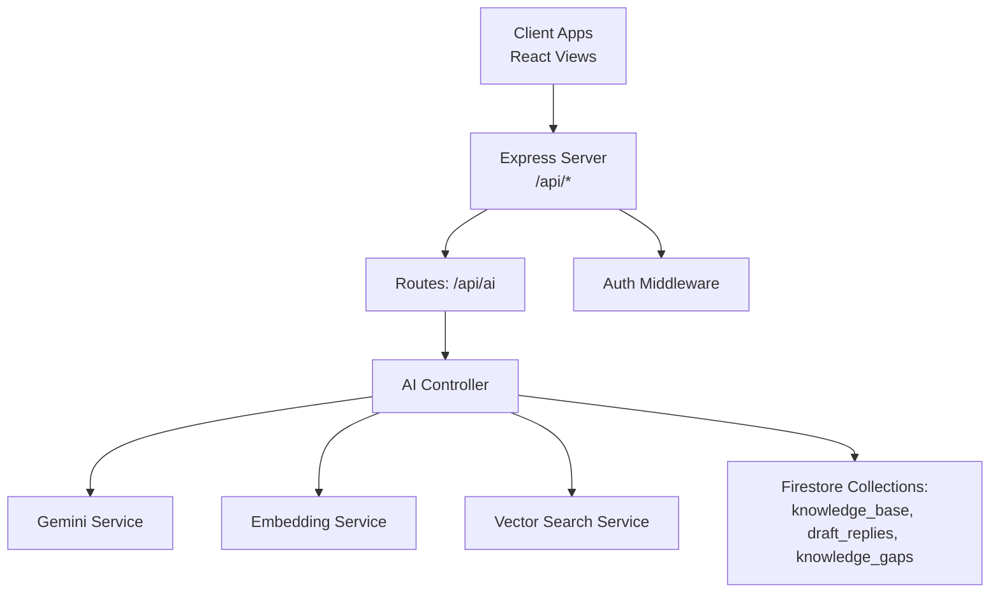
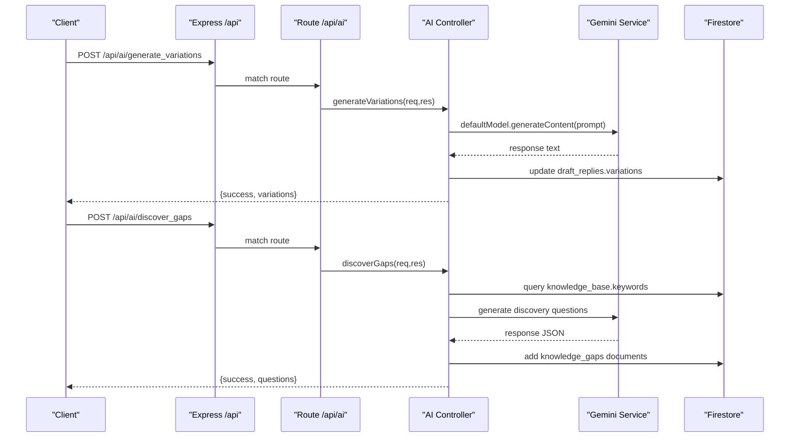
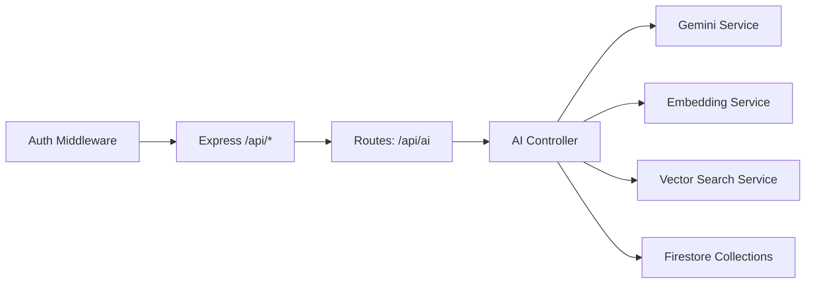
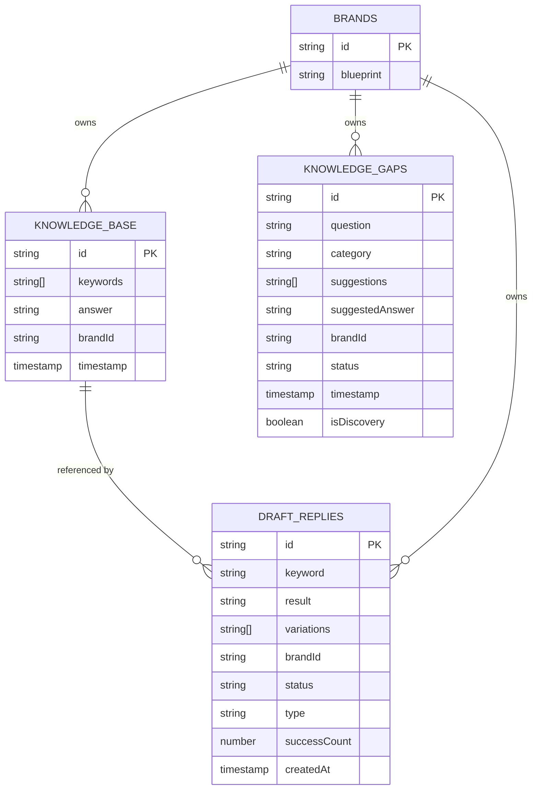

# Knowledge Base API

<cite>
**Referenced Files in This Document**
- [server/index.js](file://server/index.js)
- [server/routes/ai.js](file://server/routes/ai.js)
- [server/controllers/aiController.js](file://server/controllers/aiController.js)
- [server/services/geminiService.js](file://server/services/geminiService.js)
- [server/services/embeddingService.js](file://server/services/embeddingService.js)
- [server/services/vectorSearchService.js](file://server/services/vectorSearchService.js)
- [server/middleware/authMiddleware.js](file://server/middleware/authMiddleware.js)
- [client/src/components/Views/KnowledgeBase.jsx](file://client/src/components/Views/KnowledgeBase.jsx)
- [client/src/components/Views/DraftCenter.jsx](file://client/src/components/Views/DraftCenter.jsx)
- [client/src/Dashboard.jsx](file://client/src/Dashboard.jsx)
</cite>

## Table of Contents
1. [Introduction](#introduction)
2. [Project Structure](#project-structure)
3. [Core Components](#core-components)
4. [Architecture Overview](#architecture-overview)
5. [Detailed Component Analysis](#detailed-component-analysis)
6. [Dependency Analysis](#dependency-analysis)
7. [Performance Considerations](#performance-considerations)
8. [Troubleshooting Guide](#troubleshooting-guide)
9. [Conclusion](#conclusion)
10. [Appendices](#appendices)

## Introduction
This document provides comprehensive API documentation for knowledge base management and AI response generation endpoints. It covers:
- Template creation and management for knowledge base items
- AI-powered variation generation for canned replies
- Approval workflows from draft replies to knowledge base
- Content moderation endpoints and quality assurance
- Content categorization and semantic search integration via vector embeddings
- Authentication and permissions for content editors
- Practical examples for common knowledge management scenarios

## Project Structure
The API surface relevant to knowledge base and AI is primarily exposed under /api with route registration in the main server index and controller implementations in dedicated modules. Frontend views demonstrate approval flows and knowledge base editing.

**Diagram sources**
- [server/index.js:37-195](file://server/index.js#L37-L195)
- [server/routes/ai.js:1-37](file://server/routes/ai.js#L1-L37)
- [server/controllers/aiController.js:1-167](file://server/controllers/aiController.js#L1-L167)
- [server/services/geminiService.js:1-35](file://server/services/geminiService.js#L1-L35)
- [server/services/embeddingService.js:1-24](file://server/services/embeddingService.js#L1-L24)
- [server/services/vectorSearchService.js:1-62](file://server/services/vectorSearchService.js#L1-L62)

**Section sources**
- [server/index.js:37-195](file://server/index.js#L37-L195)
- [server/routes/ai.js:1-37](file://server/routes/ai.js#L1-L37)

## Core Components
- Knowledge Base Management
  - Edit and delete knowledge base entries
  - Batch operations via frontend
- AI Variation Generation
  - Generate semantic variations for a keyword
  - Generate linguistic variations with optional styles
  - Discover gaps in knowledge base and propose questions
- Approval Workflows
  - Move approved drafts to knowledge base
  - Bulk approve/delete drafts
- Semantic Search and Embeddings
  - Vector embedding generation
  - Vector similarity search by brand
- Authentication and Permissions
  - Role-based access control via middleware

**Section sources**
- [client/src/components/Views/KnowledgeBase.jsx:1-162](file://client/src/components/Views/KnowledgeBase.jsx#L1-L162)
- [client/src/components/Views/DraftCenter.jsx:42-579](file://client/src/components/Views/DraftCenter.jsx#L42-L579)
- [client/src/Dashboard.jsx:325-338](file://client/src/Dashboard.jsx#L325-L338)
- [server/controllers/aiController.js:5-167](file://server/controllers/aiController.js#L5-L167)
- [server/services/vectorSearchService.js:12-61](file://server/services/vectorSearchService.js#L12-L61)
- [server/middleware/authMiddleware.js:6-21](file://server/middleware/authMiddleware.js#L6-L21)

## Architecture Overview
The system integrates Express routes, AI controllers, and Firestore collections. AI generation leverages Gemini models, while vector search relies on embedding generation and Firestore vector capabilities.

**Diagram sources**
- [server/routes/ai.js:7-10](file://server/routes/ai.js#L7-L10)
- [server/controllers/aiController.js:5-104](file://server/controllers/aiController.js#L5-L104)
- [server/services/geminiService.js:4-6](file://server/services/geminiService.js#L4-L6)

## Detailed Component Analysis

### Knowledge Base Management Endpoints
- GET /api/health/automation
  - Purpose: Health check for automation features including presence of knowledge base and draft replies.
  - Authentication: Admin roles enforced by middleware.
  - Response: Includes flags for knowledge base presence and draft availability per brand.

- Knowledge Base Editing (Client-side)
  - Edit and delete knowledge base items via client view.
  - Updates Firestore collection "knowledge_base".

**Section sources**
- [server/index.js:126-171](file://server/index.js#L126-L171)
- [client/src/components/Views/KnowledgeBase.jsx:13-43](file://client/src/components/Views/KnowledgeBase.jsx#L13-L43)

### AI Variation Generation Endpoints
- POST /api/ai/generate_variations
  - Purpose: Generate semantic variations for a draft reply.
  - Request body:
    - draftId: string, required
    - keyword: string, required
    - brandId: string, optional
  - Response:
    - success: boolean
    - variations: string[] (JSON array)

- POST /api/ai/generate_linguistic_variations
  - Purpose: Generate conversational variations with optional linguistic styles.
  - Request body:
    - draftId: string, required
    - keyword: string, required
    - options: string[], optional
  - Response:
    - success: boolean
    - variations: string[] (JSON array)

- POST /api/ai/save_draft
  - Purpose: Quick save a canned reply draft directly from Chat UI.
  - Request body:
    - keyword: string, required
    - result: string, required
    - brandId: string, required
  - Response:
    - success: boolean
    - id: string (draft document ID)

**Section sources**
- [server/routes/ai.js:7-34](file://server/routes/ai.js#L7-L34)
- [server/controllers/aiController.js:5-63](file://server/controllers/aiController.js#L5-L63)

### Gap Discovery and AI Training Endpoints
- POST /api/ai/discover_gaps
  - Purpose: Identify missing knowledge base questions and suggest answers.
  - Request body:
    - brandId: string, required
  - Response:
    - success: boolean
    - questions: array of objects with fields:
      - question: string
      - category: string
      - suggestions: string[]
      - suggestedAnswer: string

- POST /api/ai/train
  - Purpose: Train AI assistant behavior/rules for a brand.
  - Request body:
    - brandId: string, required
    - message: string, required
    - history: array of {role: string, content: string}, optional
  - Response:
    - success: boolean
    - reply: string (AI reply; may include a hidden rule marker appended to blueprint)

**Section sources**
- [server/routes/ai.js:9-10](file://server/routes/ai.js#L9-L10)
- [server/controllers/aiController.js:65-159](file://server/controllers/aiController.js#L65-L159)

### Approval Workflows and Moderation
- Approve Draft to Knowledge Base (Client-side)
  - Moves a draft reply to knowledge_base and deletes the draft.
  - Request body: draft object with id, keyword, approvedVariations, result, brandId.
  - Response: none (operation side-effects handled internally).

- Bulk Operations (Client-side)
  - Approve multiple drafts in bulk.
  - Delete multiple drafts in bulk (move to history or delete depending on tab).

**Section sources**
- [client/src/Dashboard.jsx:325-338](file://client/src/Dashboard.jsx#L325-L338)
- [client/src/components/Views/DraftCenter.jsx:67-86](file://client/src/components/Views/DraftCenter.jsx#L67-L86)

### Semantic Search and Vector Embeddings
- Vector Search
  - Function: searchVectors(collectionName, queryText, brandId, limit)
  - Behavior: Generates embedding for query, performs vector similarity search on Firestore with a vector index on the embedding field, filters by brandId, and returns top matches excluding raw embeddings.

- Update Document Embedding
  - Function: updateDocumentEmbedding(collectionName, docId, textToEmbed)
  - Behavior: Generates embedding and writes it to the document’s embedding field.

- Embedding Generation
  - Function: getEmbedding(text, apiKey?)
  - Behavior: Uses Gemini embedding model; falls back to zero-vector on failure.

**Section sources**
- [server/services/vectorSearchService.js:12-61](file://server/services/vectorSearchService.js#L12-L61)
- [server/services/embeddingService.js:10-21](file://server/services/embeddingService.js#L10-L21)

### Authentication and Permissions
- Role-based Access Control
  - Middleware: checkRole(allowedRoles)
  - Behavior: Validates user role from request header x-user-role or defaults to admin; denies access otherwise.
  - Applied to sensitive endpoints like retention and analytics.

**Section sources**
- [server/middleware/authMiddleware.js:6-21](file://server/middleware/authMiddleware.js#L6-L21)
- [server/index.js:182-191](file://server/index.js#L182-L191)

## Dependency Analysis

**Diagram sources**
- [server/routes/ai.js:1-37](file://server/routes/ai.js#L1-L37)
- [server/controllers/aiController.js:1-167](file://server/controllers/aiController.js#L1-L167)
- [server/services/geminiService.js:1-35](file://server/services/geminiService.js#L1-L35)
- [server/services/embeddingService.js:1-24](file://server/services/embeddingService.js#L1-L24)
- [server/services/vectorSearchService.js:1-62](file://server/services/vectorSearchService.js#L1-L62)
- [server/middleware/authMiddleware.js:6-21](file://server/middleware/authMiddleware.js#L6-L21)
- [server/index.js:37-195](file://server/index.js#L37-L195)

**Section sources**
- [server/index.js:37-195](file://server/index.js#L37-L195)
- [server/routes/ai.js:1-37](file://server/routes/ai.js#L1-L37)

## Performance Considerations
- Vector search requires a Firestore vector index on the embedding field; missing indices will cause fallback to empty results.
- Embedding generation is asynchronous and may fall back to zero-vectors on failure to avoid blocking.
- Gemini API calls are synchronous in controller handlers; consider rate limits and timeouts when scaling.
- Filtering by brandId reduces query scope and improves performance for large datasets.

[No sources needed since this section provides general guidance]

## Troubleshooting Guide
- Access Denied
  - Cause: Missing or invalid role header.
  - Resolution: Ensure x-user-role header matches allowed roles.

- Gemini API Key Issues
  - Cause: Missing or invalid API key.
  - Resolution: Configure GEMINI_API_KEY; dynamic model functions validate keys.

- Vector Search Failures
  - Cause: Missing vector index or query errors.
  - Resolution: Verify Firestore vector index exists; check logs for error messages.

- Variation Generation Errors
  - Cause: Malformed JSON response from Gemini or invalid request payload.
  - Resolution: Validate request body and review server logs for detailed error messages.

**Section sources**
- [server/middleware/authMiddleware.js:14-19](file://server/middleware/authMiddleware.js#L14-L19)
- [server/services/geminiService.js:8-18](file://server/services/geminiService.js#L8-L18)
- [server/services/vectorSearchService.js:35-39](file://server/services/vectorSearchService.js#L35-L39)
- [server/controllers/aiController.js:22-25](file://server/controllers/aiController.js#L22-L25)

## Conclusion
The Knowledge Base API integrates AI-driven content generation, approval workflows, and semantic search to streamline customer support automation. By leveraging role-based permissions, vector embeddings, and structured approval processes, teams can maintain high-quality, scalable knowledge bases.

[No sources needed since this section summarizes without analyzing specific files]

## Appendices

### API Definitions

- POST /api/ai/generate_variations
  - Request: { draftId: string, keyword: string, brandId?: string }
  - Response: { success: boolean, variations: string[] }

- POST /api/ai/generate_linguistic_variations
  - Request: { draftId: string, keyword: string, options?: string[] }
  - Response: { success: boolean, variations: string[] }

- POST /api/ai/save_draft
  - Request: { keyword: string, result: string, brandId: string }
  - Response: { success: boolean, id: string }

- POST /api/ai/discover_gaps
  - Request: { brandId: string }
  - Response: { success: boolean, questions: array of { question: string, category: string, suggestions: string[], suggestedAnswer: string } }

- POST /api/ai/train
  - Request: { brandId: string, message: string, history?: array of { role: string, content: string } }
  - Response: { success: boolean, reply: string }

- GET /api/health/automation
  - Query: brandId?: string
  - Response: { success: boolean, report: array of { brand: string, brandId: string, tokenPresent: boolean, commentAutoReply: boolean, commentAI: boolean, inboxAI: boolean, hasDraftReplies: boolean, hasKnowledgeBase: boolean, hasCommentDrafts: boolean, isLearningMode: boolean, autoHyperIndex: boolean } }

**Section sources**
- [server/routes/ai.js:7-10](file://server/routes/ai.js#L7-L10)
- [server/index.js:126-171](file://server/index.js#L126-L171)

### Data Models

**Diagram sources**
- [server/controllers/aiController.js:71-99](file://server/controllers/aiController.js#L71-L99)
- [client/src/Dashboard.jsx:328-334](file://client/src/Dashboard.jsx#L328-L334)

### Practical Examples

- Template Creation
  - Use POST /api/ai/save_draft to quickly add a new draft reply with keyword, result, and brandId. The system generates initial variations and stores the draft as approved.

- Batch Updates
  - From the Draft Center, select multiple drafts and approve them in bulk. Each approved draft is moved to knowledge_base and removed from draft_replies.

- Quality Assurance Workflow
  - Use POST /api/ai/discover_gaps to identify missing knowledge areas. Review suggested questions and answers, then approve and add them to knowledge_base.

- Semantic Search Integration
  - Generate embeddings for new knowledge base entries and update the embedding field. Use vector search to retrieve semantically similar knowledge items filtered by brandId.

**Section sources**
- [server/routes/ai.js:13-34](file://server/routes/ai.js#L13-L34)
- [client/src/components/Views/DraftCenter.jsx:67-86](file://client/src/components/Views/DraftCenter.jsx#L67-L86)
- [server/controllers/aiController.js:65-104](file://server/controllers/aiController.js#L65-L104)
- [server/services/vectorSearchService.js:48-61](file://server/services/vectorSearchService.js#L48-L61)