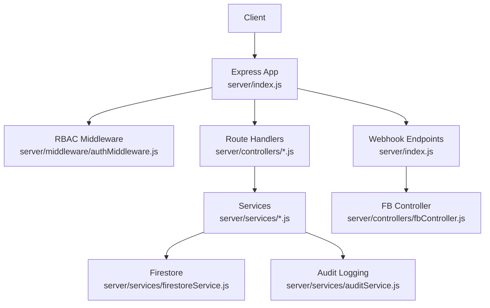
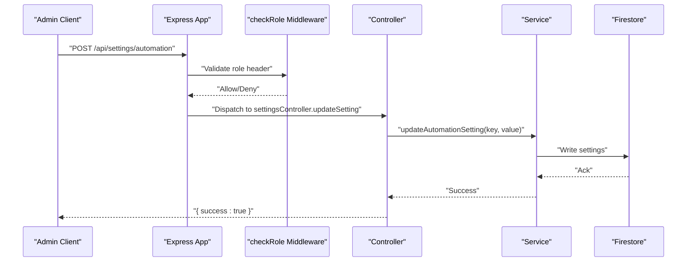
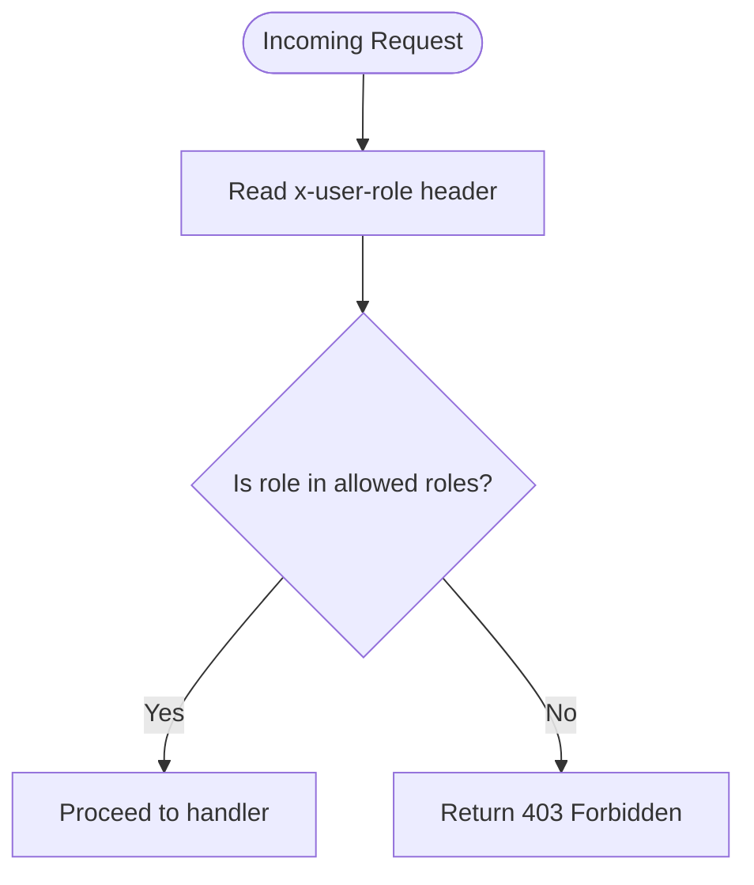
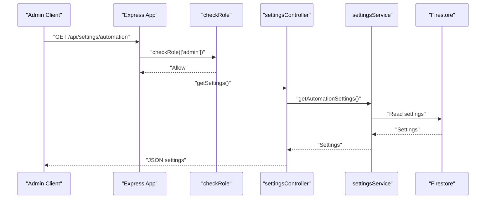
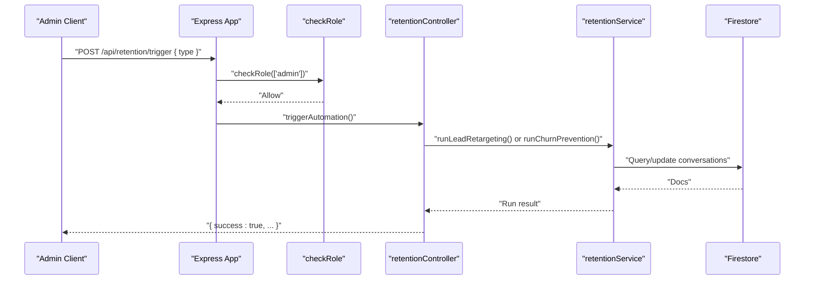
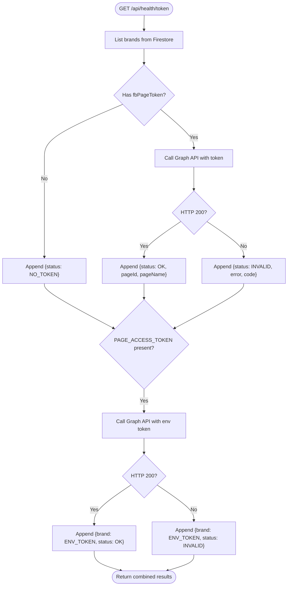
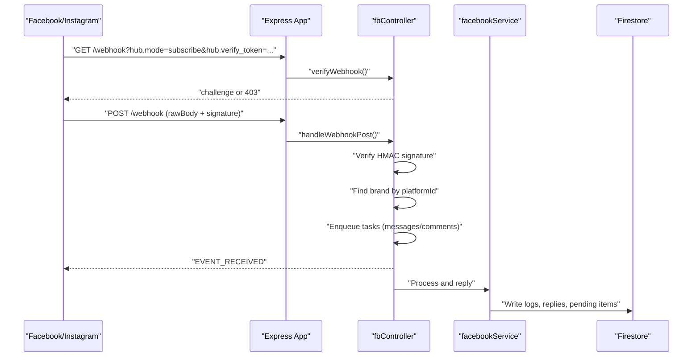
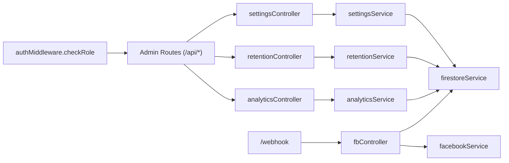

# System Management API

<cite>
**Referenced Files in This Document**
- [server/index.js](file://server/index.js)
- [server/middleware/authMiddleware.js](file://server/middleware/authMiddleware.js)
- [server/controllers/settingsController.js](file://server/controllers/settingsController.js)
- [server/controllers/retentionController.js](file://server/controllers/retentionController.js)
- [server/controllers/analyticsController.js](file://server/controllers/analyticsController.js)
- [server/controllers/fbController.js](file://server/controllers/fbController.js)
- [server/services/firestoreService.js](file://server/services/firestoreService.js)
- [server/services/auditService.js](file://server/services/auditService.js)
- [server/utils/logger.js](file://server/utils/logger.js)
- [server/scripts/seedGodMode.js](file://server/scripts/seedGodMode.js)
- [server/scripts/seedElitePack.js](file://server/scripts/seedElitePack.js)
</cite>

## Table of Contents
1. [Introduction](#introduction)
2. [Project Structure](#project-structure)
3. [Core Components](#core-components)
4. [Architecture Overview](#architecture-overview)
5. [Detailed Component Analysis](#detailed-component-analysis)
6. [Dependency Analysis](#dependency-analysis)
7. [Performance Considerations](#performance-considerations)
8. [Troubleshooting Guide](#troubleshooting-guide)
9. [Conclusion](#conclusion)
10. [Appendices](#appendices)

## Introduction
This document provides comprehensive API documentation for system administration and configuration endpoints. It covers brand management operations, user permissions, API key management, system configuration, role-based access control, system health monitoring, webhook management, diagnostics, maintenance operations, and security considerations for privileged operations. It also includes request/response specifications, practical examples, and guidance for backup and restore procedures.

## Project Structure
The system is an Express-based backend exposing administrative endpoints under the /api path. Administrative routes are protected by a role-check middleware. Health checks monitor token validity and webhook subscriptions. Audit logging is centralized for privileged actions.

**Diagram sources**
- [server/index.js:37-192](file://server/index.js#L37-L192)
- [server/middleware/authMiddleware.js:6-21](file://server/middleware/authMiddleware.js#L6-L21)
- [server/controllers/settingsController.js:1-38](file://server/controllers/settingsController.js#L1-L38)
- [server/controllers/retentionController.js:1-52](file://server/controllers/retentionController.js#L1-L52)
- [server/controllers/analyticsController.js:1-22](file://server/controllers/analyticsController.js#L1-L22)
- [server/controllers/fbController.js:155-323](file://server/controllers/fbController.js#L155-L323)
- [server/services/firestoreService.js:56-114](file://server/services/firestoreService.js#L56-L114)
- [server/services/auditService.js:9-22](file://server/services/auditService.js#L9-L22)

**Section sources**
- [server/index.js:37-192](file://server/index.js#L37-L192)

## Core Components
- Role-based access control middleware enforces admin-only endpoints via a custom header.
- Settings controller manages automation configuration and bulk disable operations.
- Retention controller triggers and reports on customer lifecycle automations.
- Analytics controller exposes BI metrics for a given brand.
- Webhook endpoints verify and process inbound events from Facebook/Instagram.
- Health endpoints monitor token validity and webhook subscription status.
- Audit logging centralizes admin actions for compliance and tracing.

**Section sources**
- [server/middleware/authMiddleware.js:6-21](file://server/middleware/authMiddleware.js#L6-L21)
- [server/controllers/settingsController.js:1-38](file://server/controllers/settingsController.js#L1-L38)
- [server/controllers/retentionController.js:1-52](file://server/controllers/retentionController.js#L1-L52)
- [server/controllers/analyticsController.js:1-22](file://server/controllers/analyticsController.js#L1-L22)
- [server/index.js:48-171](file://server/index.js#L48-L171)
- [server/services/auditService.js:9-22](file://server/services/auditService.js#L9-L22)

## Architecture Overview
Administrative endpoints are mounted under /api and protected by the RBAC middleware. Controllers delegate to services that interact with Firestore. Webhooks are handled separately and validated for authenticity.

**Diagram sources**
- [server/index.js:189-190](file://server/index.js#L189-L190)
- [server/middleware/authMiddleware.js:6-21](file://server/middleware/authMiddleware.js#L6-L21)
- [server/controllers/settingsController.js:12-22](file://server/controllers/settingsController.js#L12-L22)

## Detailed Component Analysis

### Role-Based Access Control
- Enforced via a middleware that reads the x-user-role header and compares against allowed roles.
- Used on admin-only endpoints such as settings updates and retention triggers.

**Diagram sources**
- [server/middleware/authMiddleware.js:6-21](file://server/middleware/authMiddleware.js#L6-L21)

**Section sources**
- [server/middleware/authMiddleware.js:6-21](file://server/middleware/authMiddleware.js#L6-L21)
- [server/index.js:182-190](file://server/index.js#L182-L190)

### System Configuration Endpoints
- GET /api/settings/automation
  - Purpose: Retrieve current automation settings.
  - Authentication: Requires role admin.
  - Response: Settings object.
- POST /api/settings/automation
  - Purpose: Update a single automation setting by key.
  - Authentication: Requires role admin.
  - Request body: { key, value }.
  - Response: { success: true }.
- POST /api/settings/automation/disable-all
  - Purpose: Disable all automations.
  - Authentication: Requires role admin.
  - Response: { success: true, message }.

**Diagram sources**
- [server/index.js:189](file://server/index.js#L189)
- [server/controllers/settingsController.js:3-10](file://server/controllers/settingsController.js#L3-L10)

**Section sources**
- [server/index.js:189-191](file://server/index.js#L189-L191)
- [server/controllers/settingsController.js:1-38](file://server/controllers/settingsController.js#L1-L38)

### Retention and Customer Lifecycle Operations
- GET /api/retention/stats
  - Purpose: Retrieve aggregated retention statistics.
  - Authentication: Requires role admin.
  - Response: { pendingFollowups, churnRisk, recovered }.
- POST /api/retention/trigger
  - Purpose: Trigger a retention automation run.
  - Authentication: Requires role admin.
  - Request body: { type: "lead_retargeting" | "churn_prevention" }.
  - Response: { success: true, ...result }.

**Diagram sources**
- [server/index.js:182-183](file://server/index.js#L182-L183)
- [server/controllers/retentionController.js:4-21](file://server/controllers/retentionController.js#L4-L21)

**Section sources**
- [server/index.js:182-183](file://server/index.js#L182-L183)
- [server/controllers/retentionController.js:1-52](file://server/controllers/retentionController.js#L1-L52)

### Analytics and BI Metrics
- GET /api/analytics/bi
  - Purpose: Retrieve BI metrics for a brand.
  - Authentication: Requires role admin or ads.
  - Query: brandId (required).
  - Response: Metrics object.

**Section sources**
- [server/index.js:184-188](file://server/index.js#L184-L188)
- [server/controllers/analyticsController.js:1-22](file://server/controllers/analyticsController.js#L1-L22)

### System Health Monitoring
- GET /api/health/token
  - Purpose: Validate page access tokens for all brands and environment token.
  - Response: { success: true, allValid, tokens: [...] }.
- GET /api/health/webhook
  - Purpose: Verify webhook subscriptions for brands.
  - Response: { success: true, webhooks: [...] }.
- GET /api/health/automation
  - Purpose: Inspect automation readiness for a brand or sample.
  - Query: brandId (optional).
  - Response: { success: true, report: [...] }.

**Diagram sources**
- [server/index.js:51-91](file://server/index.js#L51-L91)

**Section sources**
- [server/index.js:51-171](file://server/index.js#L51-L171)

### Webhook Management
- GET /webhook and POST /webhook (and /api variants)
  - Purpose: Verify and process inbound webhook events.
  - Verification: Uses hub.verify_token and optional HMAC signature validation.
  - Processing: Idempotency checks, event routing by brand, and asynchronous task queuing.

**Diagram sources**
- [server/index.js:39-42](file://server/index.js#L39-L42)
- [server/controllers/fbController.js:155-323](file://server/controllers/fbController.js#L155-L323)

**Section sources**
- [server/index.js:39-42](file://server/index.js#L39-L42)
- [server/controllers/fbController.js:155-323](file://server/controllers/fbController.js#L155-L323)

### Audit Logging
- Centralized logging for administrative actions with structured details and timestamps.
- Non-blocking design ensures audit writes do not interrupt primary flows.

**Section sources**
- [server/services/auditService.js:9-22](file://server/services/auditService.js#L9-L22)

### Maintenance and Knowledge Base Utilities
- Seed scripts demonstrate how to populate knowledge base and draft replies for specific brands.
- Useful for onboarding and scaling automation content.

**Section sources**
- [server/scripts/seedGodMode.js:57-85](file://server/scripts/seedGodMode.js#L57-L85)
- [server/scripts/seedElitePack.js:108-132](file://server/scripts/seedElitePack.js#L108-L132)

## Dependency Analysis
Administrative endpoints depend on the RBAC middleware and controllers/services that interact with Firestore. Webhook processing depends on brand resolution and external API calls.

**Diagram sources**
- [server/middleware/authMiddleware.js:6-21](file://server/middleware/authMiddleware.js#L6-L21)
- [server/index.js:175-181](file://server/index.js#L175-L181)
- [server/controllers/settingsController.js:1-38](file://server/controllers/settingsController.js#L1-L38)
- [server/controllers/retentionController.js:1-52](file://server/controllers/retentionController.js#L1-L52)
- [server/controllers/analyticsController.js:1-22](file://server/controllers/analyticsController.js#L1-L22)
- [server/controllers/fbController.js:155-323](file://server/controllers/fbController.js#L155-L323)
- [server/services/firestoreService.js:56-114](file://server/services/firestoreService.js#L56-L114)

**Section sources**
- [server/index.js:175-181](file://server/index.js#L175-L181)
- [server/services/firestoreService.js:56-114](file://server/services/firestoreService.js#L56-L114)

## Performance Considerations
- Webhook processing uses idempotency checks and asynchronous task queues to avoid duplicate work and improve throughput.
- Retry wrappers handle transient and rate-limit errors from external APIs.
- Brand lookup caches reduce repeated Firestore queries for platform identifiers.
- Health checks batch operations and short-circuit on failures to keep response times predictable.

[No sources needed since this section provides general guidance]

## Troubleshooting Guide
- Access Denied (403): Ensure the x-user-role header is set to an allowed role for protected endpoints.
- Webhook verification fails: Confirm hub.verify_token matches the configured token and APP_SECRET is set for signature validation.
- Token invalid in health checks: Review PAGE_ACCESS_TOKEN and brand fbPageToken values; reissue tokens if expired.
- Webhook subscription missing: Validate page-level subscriptions and subscribed fields for feed/messages.
- Audit logs not appearing: Verify Firestore write permissions and that audit logging is invoked for admin actions.

**Section sources**
- [server/middleware/authMiddleware.js:17-18](file://server/middleware/authMiddleware.js#L17-L18)
- [server/controllers/fbController.js:155-173](file://server/controllers/fbController.js#L155-L173)
- [server/index.js:51-91](file://server/index.js#L51-L91)
- [server/index.js:93-124](file://server/index.js#L93-L124)
- [server/services/auditService.js:9-22](file://server/services/auditService.js#L9-L22)

## Conclusion
The System Management API provides robust administrative capabilities with role-based protection, comprehensive health monitoring, secure webhook handling, and structured audit logging. Administrators can manage automation settings, trigger retention workflows, query BI metrics, and maintain system health while adhering to security best practices.

[No sources needed since this section summarizes without analyzing specific files]

## Appendices

### Authentication and Authorization
- Header: x-user-role
  - Allowed values: admin, ads (as applicable).
  - Behavior: Requests without a matching role receive 403 Forbidden.

**Section sources**
- [server/middleware/authMiddleware.js:6-21](file://server/middleware/authMiddleware.js#L6-L21)
- [server/index.js:182-188](file://server/index.js#L182-L188)

### Request/Response Schemas

- GET /api/settings/automation
  - Response: Settings object (structure determined by settingsService).
- POST /api/settings/automation
  - Request: { key: string, value: any }.
  - Response: { success: true }.
- POST /api/settings/automation/disable-all
  - Response: { success: true, message: string }.
- POST /api/retention/trigger
  - Request: { type: "lead_retargeting" | "churn_prevention" }.
  - Response: { success: true, ...result }.
- GET /api/retention/stats
  - Response: { pendingFollowups: number, churnRisk: number, recovered: number }.
- GET /api/analytics/bi?brandId=<string>
  - Response: Metrics object (structure determined by analyticsService).
- GET /api/health/token
  - Response: { success: true, allValid: boolean, tokens: [{ brand, status, pageId?, pageName?, valid, error?, code? }] }.
- GET /api/health/webhook
  - Response: { success: true, webhooks: [{ brand, hasSubscription, feedSubscribed, messagesSubscribed, fields }] }.
- GET /api/health/automation?brandId=<string>
  - Response: { success: true, report: [{ brand, brandId, tokenPresent, commentAutoReply, commentAI, commentAutoLike, inboxAutoReply, inboxAI, hasDraftReplies, hasKnowledgeBase, hasCommentDrafts, isLearningMode, autoHyperIndex }] }.

**Section sources**
- [server/controllers/settingsController.js:3-31](file://server/controllers/settingsController.js#L3-L31)
- [server/controllers/retentionController.js:4-21](file://server/controllers/retentionController.js#L4-L21)
- [server/controllers/analyticsController.js:3-17](file://server/controllers/analyticsController.js#L3-L17)
- [server/index.js:51-171](file://server/index.js#L51-L171)

### Practical Examples

- Enable AI auto-reply for comments
  - Method: POST /api/settings/automation
  - Body: { key: "commentSettings.aiReply", value: true }
- Disable all automations
  - Method: POST /api/settings/automation/disable-all
- Trigger lead retargeting
  - Method: POST /api/retention/trigger
  - Body: { type: "lead_retargeting" }
- Retrieve BI metrics for a brand
  - Method: GET /api/analytics/bi?brandId=<brandId>
- Verify webhook subscription
  - Method: GET /api/health/webhook

**Section sources**
- [server/index.js:189-191](file://server/index.js#L189-L191)
- [server/index.js:182-183](file://server/index.js#L182-L183)
- [server/index.js:184-188](file://server/index.js#L184-L188)
- [server/index.js:93-124](file://server/index.js#L93-L124)

### Security Considerations
- RBAC enforcement via x-user-role header.
- Webhook signature validation using HMAC SHA-256 when APP_SECRET is configured.
- Token expiration detection updates brand status for visibility.
- Idempotency prevents duplicate processing of events.
- Audit logs capture admin actions for compliance.

**Section sources**
- [server/middleware/authMiddleware.js:6-21](file://server/middleware/authMiddleware.js#L6-L21)
- [server/controllers/fbController.js:176-200](file://server/controllers/fbController.js#L176-L200)
- [server/controllers/fbController.js:122-152](file://server/controllers/fbController.js#L122-L152)
- [server/services/auditService.js:9-22](file://server/services/auditService.js#L9-L22)

### Backup and Restore Procedures
- Firestore backups: Use Firestore export/import tools to back up collections used by the system (brands, draft_replies, knowledge_base, comments, conversations, audit_logs).
- Environment secrets: Store PAGE_ACCESS_TOKEN, APP_SECRET, and service account credentials securely; regenerate tokens if compromised.
- Knowledge base seeding: Use seed scripts to restore curated content for brands.

**Section sources**
- [server/scripts/seedGodMode.js:57-85](file://server/scripts/seedGodMode.js#L57-L85)
- [server/scripts/seedElitePack.js:108-132](file://server/scripts/seedElitePack.js#L108-L132)
- [server/services/firestoreService.js:56-114](file://server/services/firestoreService.js#L56-L114)