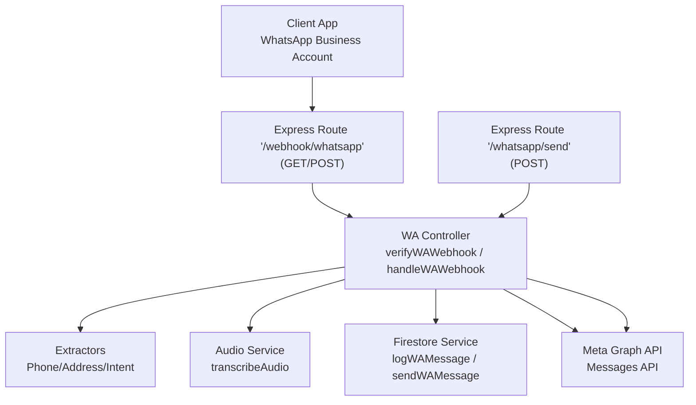
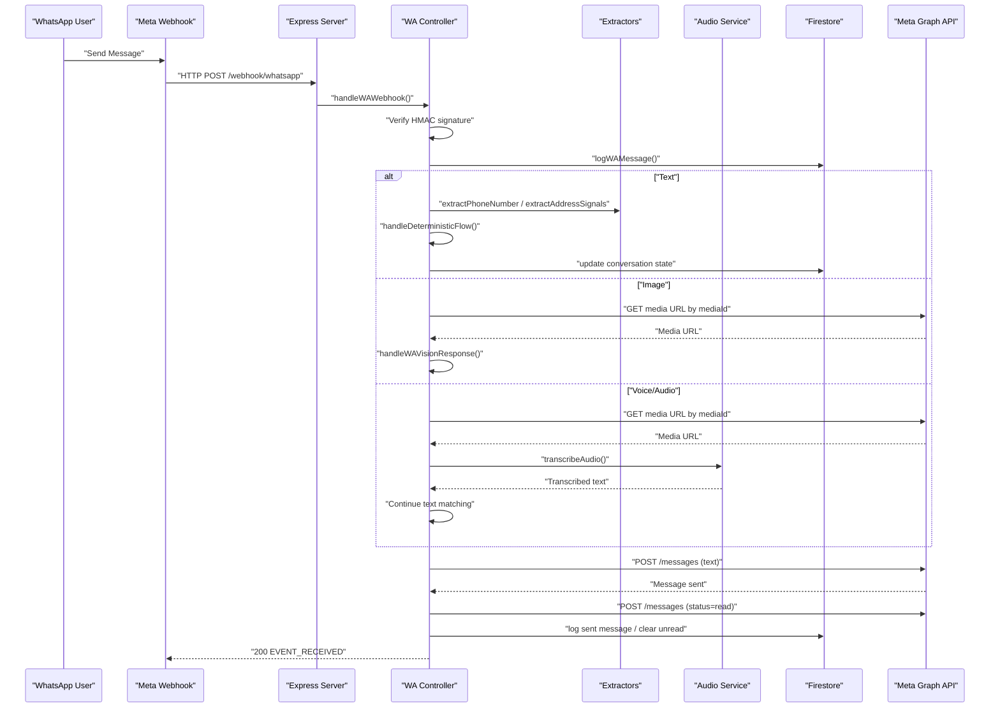
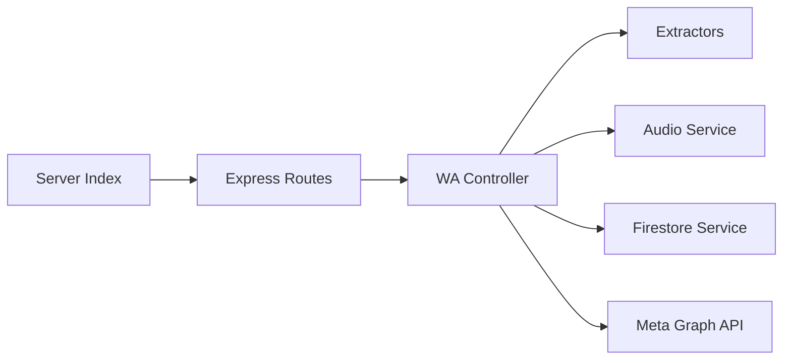

# WhatsApp Business API

<cite>
**Referenced Files in This Document**
- [index.js](file://server/index.js)
- [whatsapp.js](file://server/routes/whatsapp.js)
- [waController.js](file://server/controllers/waController.js)
- [audioService.js](file://server/services/audioService.js)
- [firestoreService.js](file://server/services/firestoreService.js)
- [extractors.js](file://server/utils/extractors.js)
- [linguisticEngine.js](file://server/utils/linguisticEngine.js)
- [authMiddleware.js](file://server/middleware/authMiddleware.js)
- [webhook.js](file://server/webhook.js)
- [fbController.js](file://server/controllers/fbController.js)
</cite>

## Table of Contents
1. [Introduction](#introduction)
2. [Project Structure](#project-structure)
3. [Core Components](#core-components)
4. [Architecture Overview](#architecture-overview)
5. [Detailed Component Analysis](#detailed-component-analysis)
6. [Dependency Analysis](#dependency-analysis)
7. [Performance Considerations](#performance-considerations)
8. [Troubleshooting Guide](#troubleshooting-guide)
9. [Conclusion](#conclusion)
10. [Appendices](#appendices)

## Introduction
This document provides comprehensive API documentation for the WhatsApp Business Platform integration endpoints implemented in the repository. It covers voice message transcription, template-based message sending, media handling, conversation management, authentication via WhatsApp Business API credentials, webhook event handling for message status updates, and integration with Meta’s Graph API. Practical examples illustrate automated responses, product catalog integration, and customer service workflows. It also documents error handling, rate-limiting considerations, and compliance requirements for business messaging.

## Project Structure
The WhatsApp integration is implemented as part of a larger Express-based backend with dedicated routes, controllers, services, and utilities:
- Routes define endpoint contracts for verification, inbound webhooks, and outbound message dispatch.
- Controllers orchestrate webhook validation, message processing, and outbound messaging.
- Services encapsulate integrations with Meta’s Graph API, audio transcription, and Firestore persistence.
- Utilities provide deterministic extraction and linguistic normalization for robust matching.

**Diagram sources**
- [whatsapp.js:1-15](file://server/routes/whatsapp.js#L1-L15)
- [waController.js:11-75](file://server/controllers/waController.js#L11-L75)
- [waController.js:310-396](file://server/controllers/waController.js#L310-L396)
- [audioService.js:11-50](file://server/services/audioService.js#L11-L50)
- [firestoreService.js:56-114](file://server/services/firestoreService.js#L56-L114)

**Section sources**
- [index.js:25-46](file://server/index.js#L25-L46)
- [whatsapp.js:1-15](file://server/routes/whatsapp.js#L1-L15)

## Core Components
- Webhook Verification Endpoint
  - Validates subscription mode and verify token for initial webhook setup.
  - Returns challenge on successful verification.
- Webhook Event Handler
  - Validates HMAC signature against stored app secret.
  - Parses incoming message events (text, image, voice/audio).
  - Resolves brand by phone number ID and processes messages accordingly.
- Outbound Messaging
  - Sends text messages via Meta Graph API Messages endpoint.
  - Marks message as read upon reply.
  - Logs conversation history and updates unread flags.
- Voice Message Transcription
  - Downloads audio via Meta Media API.
  - Uses Gemini multimodal model to transcribe to Bangla/Banglish.
- Media Handling
  - Retrieves media URLs via Graph API using media IDs.
  - Supports vision-based product matching and OCR fallback.
- Conversation Management
  - Maintains conversation state, lead capture, and deterministic ordering flow.
  - Links conversations by shared phone numbers across platforms.
- Authentication and Security
  - HMAC signature verification for inbound webhooks.
  - Environment-based credentials for Graph API access.
  - Role-based middleware for dashboard endpoints.

**Section sources**
- [waController.js:11-25](file://server/controllers/waController.js#L11-L25)
- [waController.js:28-75](file://server/controllers/waController.js#L28-L75)
- [waController.js:310-396](file://server/controllers/waController.js#L310-L396)
- [audioService.js:11-50](file://server/services/audioService.js#L11-L50)
- [firestoreService.js:56-114](file://server/services/firestoreService.js#L56-L114)

## Architecture Overview
The system integrates with Meta’s Graph API to receive and send WhatsApp messages, while persisting conversation data in Firestore. Deterministic extraction and linguistic normalization power automated responses, with optional AI fallback.

**Diagram sources**
- [waController.js:28-75](file://server/controllers/waController.js#L28-L75)
- [waController.js:77-167](file://server/controllers/waController.js#L77-L167)
- [waController.js:608-660](file://server/controllers/waController.js#L608-L660)
- [audioService.js:11-50](file://server/services/audioService.js#L11-L50)
- [firestoreService.js:398-426](file://server/controllers/waController.js#L398-L426)

## Detailed Component Analysis

### Webhook Endpoints
- GET /webhook/whatsapp
  - Purpose: Initial verification for webhook subscription.
  - Query parameters: hub.mode, hub.verify_token, hub.challenge.
  - Behavior: Validates token and returns challenge on success.
- POST /webhook/whatsapp
  - Purpose: Receive inbound message events from Meta.
  - Headers: x-hub-signature-256 or x-hub-signature for HMAC verification.
  - Body: WhatsApp webhook payload containing entry and changes.
  - Processing: Resolves brand by phone_number_id, logs message, and triggers processing pipeline.

**Section sources**
- [whatsapp.js:5-12](file://server/routes/whatsapp.js#L5-L12)
- [waController.js:11-25](file://server/controllers/waController.js#L11-L25)
- [waController.js:28-75](file://server/controllers/waController.js#L28-L75)

### Outbound Message Dispatch
- Endpoint: POST /whatsapp/send
  - Purpose: Send a message from the dashboard to a WhatsApp recipient.
  - Request body: recipientId, text, brandId.
  - Behavior: Resolves brand, sends message via Graph API, marks as read if applicable, logs conversation history, and optionally captures expert teaching for future drafts.

**Section sources**
- [whatsapp.js:11-12](file://server/routes/whatsapp.js#L11-L12)
- [waController.js:543-603](file://server/controllers/waController.js#L543-L603)

### Voice Message Transcription
- Function: transcribeAudio(url, brandData, authToken)
  - Downloads audio via Graph API (with optional bearer token).
  - Uses Gemini 1.5 Flash multimodal model to transcribe to Bangla/Banglish.
  - Returns transcribed text for downstream text matching.

**Section sources**
- [audioService.js:11-50](file://server/services/audioService.js#L11-L50)
- [waController.js:90-102](file://server/controllers/waController.js#L90-L102)

### Media Handling and Vision
- Retrieving Media URL
  - Function: getWAMediaUrl(mediaId, brandData)
  - Calls Graph API to fetch media URL using media ID and brand access token.
- Vision-Based Product Matching
  - Generates perceptual hash of incoming image.
  - Matches against indexed product fingerprints; replies with product info if matched.
  - Fallback: OCR via Tesseract to extract Bengali/English text and match against approved drafts.

**Section sources**
- [waController.js:662-673](file://server/controllers/waController.js#L662-L673)
- [waController.js:608-660](file://server/controllers/waController.js#L608-L660)

### Conversation Management
- Logging Incoming Messages
  - Function: logWAMessage(wa_id, text, brandData)
  - Creates or updates conversation document and appends message to conversation history.
- Deterministic Ordering Flow
  - State machine guiding users through phone collection, address collection, and confirmation.
  - Integrates with extractors for phone and address detection.
- Lead Capture and Cross-Platform Linking
  - Detects phone numbers and addresses from messages.
  - Links conversations sharing the same phone number across platforms.

**Section sources**
- [waController.js:398-426](file://server/controllers/waController.js#L398-L426)
- [waController.js:462-541](file://server/controllers/waController.js#L462-L541)
- [waController.js:431-457](file://server/controllers/waController.js#L431-L457)

### Authentication and Security
- Webhook Signature Verification
  - Validates HMAC-SHA256 signature using stored app secret and raw request body.
- Credentials Resolution
  - Brand lookup resolves waAccessToken and whatsappPhoneId for Graph API calls.
- Role-Based Access Control
  - Middleware enforces allowed roles for protected endpoints.

**Section sources**
- [waController.js:29-42](file://server/controllers/waController.js#L29-L42)
- [firestoreService.js:56-114](file://server/services/firestoreService.js#L56-L114)
- [authMiddleware.js:6-21](file://server/middleware/authMiddleware.js#L6-L21)

### Integration with Meta’s Graph API
- Sending Text Messages
  - Endpoint: https://graph.facebook.com/v17.0/{phone_number_id}/messages
  - Payload: messaging_product=whatsapp, to, text
  - Headers: Authorization: Bearer {waAccessToken}
- Marking Messages as Read
  - Endpoint: https://graph.facebook.com/v17.0/{phone_number_id}/messages
  - Payload: messaging_product=whatsapp, status=read, message_id
- Retrieving Media URLs
  - Endpoint: https://graph.facebook.com/v17.0/{media_id}
  - Headers: Authorization: Bearer {waAccessToken}

**Section sources**
- [waController.js:317-325](file://server/controllers/waController.js#L317-L325)
- [waController.js:329-337](file://server/controllers/waController.js#L329-L337)
- [waController.js:664-668](file://server/controllers/waController.js#L664-L668)

### Request and Response Schemas

- Webhook Verification (GET)
  - Query parameters:
    - hub.mode: "subscribe"
    - hub.verify_token: "your verify token"
    - hub.challenge: "challenge to return"
  - Response: 200 with challenge on success; 403 otherwise.

- Webhook Event (POST)
  - Headers:
    - x-hub-signature-256: HMAC signature
  - Body (subset):
    - object: "whatsapp_business_account"
    - entry[].changes[].value.metadata.phone_number_id
    - entry[].changes[].value.messages[0].from
    - entry[].changes[].value.messages[0].text/body
    - entry[].changes[].value.messages[0].image/id
    - entry[].changes[].value.messages[0].voice/ audio/id
  - Response: 200 "EVENT_RECEIVED" on success; 404 for unsupported object.

- Send Message from Dashboard (POST)
  - Path: /whatsapp/send
  - Request body:
    - recipientId: string
    - text: string
    - brandId: string
  - Response: { success: true } on success.

- Voice Transcription
  - Input: audio URL (Meta Media API), brandData, optional authToken
  - Output: transcribed text string

- Media URL Retrieval
  - Input: mediaId, brandData
  - Output: media URL string

**Section sources**
- [whatsapp.js:5-12](file://server/routes/whatsapp.js#L5-L12)
- [waController.js:11-25](file://server/controllers/waController.js#L11-L25)
- [waController.js:28-75](file://server/controllers/waController.js#L28-L75)
- [waController.js:543-603](file://server/controllers/waController.js#L543-L603)
- [audioService.js:11-50](file://server/services/audioService.js#L11-L50)
- [waController.js:662-673](file://server/controllers/waController.js#L662-L673)

### Practical Examples

- Automated Responses
  - Text messages trigger deterministic flow for greeting, phone collection, address collection, and confirmation.
  - Approved draft replies are matched using fuzzy search and phonetic normalization.

- Product Catalog Integration
  - Image messages are hashed and matched against indexed products; if matched, a product-specific reply is sent.
  - OCR fallback extracts text and attempts draft matching.

- Customer Service Workflows
  - Lead capture detects phone numbers and addresses from messages.
  - Conversations are linked by shared phone numbers across platforms for unified inbox.

**Section sources**
- [waController.js:106-167](file://server/controllers/waController.js#L106-L167)
- [waController.js:170-254](file://server/controllers/waController.js#L170-L254)
- [waController.js:608-660](file://server/controllers/waController.js#L608-L660)
- [extractors.js:26-62](file://server/utils/extractors.js#L26-L62)
- [linguisticEngine.js:86-141](file://server/utils/linguisticEngine.js#L86-L141)

## Dependency Analysis
The WA controller orchestrates multiple internal and external dependencies:
- Internal services: Firestore for persistence, linguistic utilities for matching, audio service for transcription.
- External APIs: Meta Graph API for messages and media.
- Security: HMAC verification and environment-based credentials.

**Diagram sources**
- [waController.js:1-9](file://server/controllers/waController.js#L1-L9)
- [whatsapp.js:1-15](file://server/routes/whatsapp.js#L1-L15)
- [index.js:25-46](file://server/index.js#L25-L46)

**Section sources**
- [waController.js:1-9](file://server/controllers/waController.js#L1-L9)
- [firestoreService.js:1-126](file://server/services/firestoreService.js#L1-L126)

## Performance Considerations
- Message Processing Pipeline
  - Deterministic matching prioritizes speed; AI fallback is reserved for ambiguous queries.
  - Phonetic normalization and fuzzy search reduce latency while improving recall.
- Media Handling
  - Perceptual hashing enables fast product matching; OCR is used as a fallback.
- Read Receipts
  - Status read requests are sent after replies to improve user experience and reduce perceived latency.
- Rate Limiting and Retries
  - While primarily documented for Facebook Graph API, similar patterns apply to WhatsApp Graph API:
    - Detect rate-limit errors and retry with exponential backoff.
    - Implement idempotency to avoid duplicate processing.

[No sources needed since this section provides general guidance]

## Troubleshooting Guide
- Webhook Verification Failures
  - Ensure hub.verify_token matches the configured verify token.
  - Confirm GET endpoint is reachable and returns the challenge.
- Webhook Signature Mismatch
  - Verify APP_SECRET/WA_APP_SECRET is set and matches the signing secret.
  - Ensure raw body is captured during request parsing.
- Missing Tokens or Credentials
  - Confirm waAccessToken and whatsappPhoneId are present in brand data.
  - Validate environment variables for development fallback.
- Media Retrieval Errors
  - Check media ID validity and access token permissions.
  - Retry retrieval if transient errors occur.
- Read Receipt Errors
  - Some environments may restrict status updates; log and continue processing.
- AI Transcription Failures
  - Verify Gemini API key availability and network connectivity.
  - Ensure audio format is supported by the multimodal model.

**Section sources**
- [waController.js:11-25](file://server/controllers/waController.js#L11-L25)
- [waController.js:29-42](file://server/controllers/waController.js#L29-L42)
- [waController.js:310-396](file://server/controllers/waController.js#L310-L396)
- [waController.js:662-673](file://server/controllers/waController.js#L662-L673)
- [audioService.js:11-50](file://server/services/audioService.js#L11-L50)

## Conclusion
The WhatsApp Business Platform integration provides a robust foundation for inbound/outbound messaging, voice transcription, media handling, and conversation management. By combining deterministic matching, linguistic normalization, and AI fallback, it supports scalable customer service workflows. Secure webhook handling, credential management, and Graph API integration ensure reliable operation within Meta’s ecosystem.

[No sources needed since this section summarizes without analyzing specific files]

## Appendices

### Compliance and Best Practices
- Business Messaging Guidelines
  - Adhere to Meta’s Business Messaging Policies and Terms.
  - Obtain user consent for automated messaging and opt-out mechanisms.
- Data Privacy
  - Minimize data retention; securely store tokens and PII.
  - Enable encryption at rest and in transit.
- Operational Hygiene
  - Monitor rate limits and implement backoff strategies.
  - Maintain idempotent event processing to prevent duplicates.

[No sources needed since this section provides general guidance]