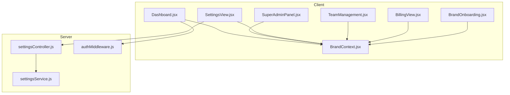
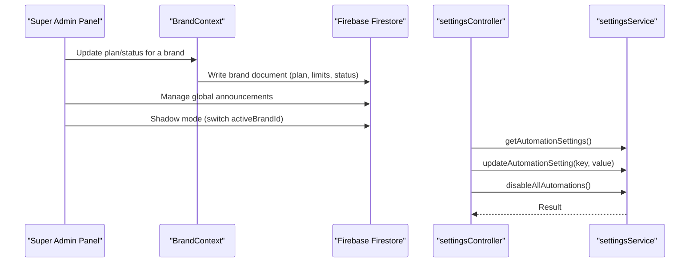
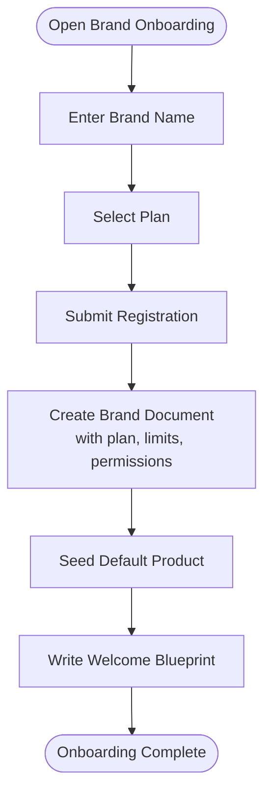
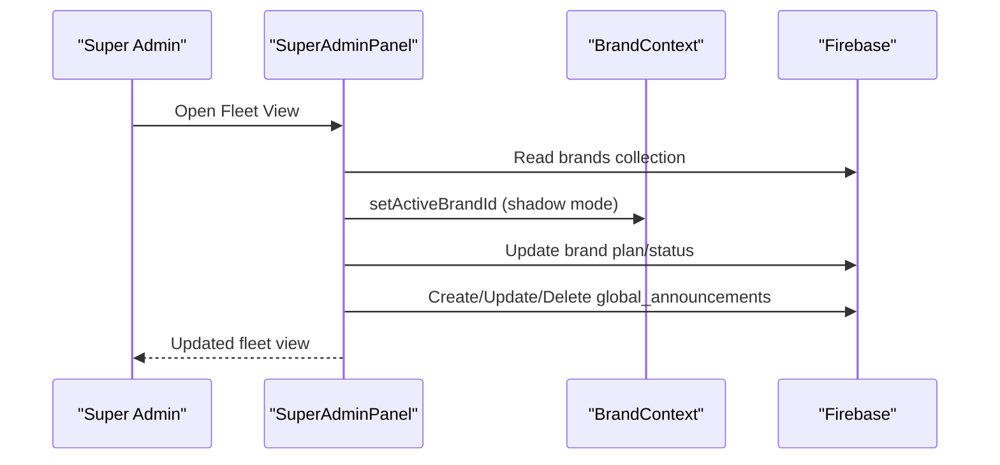
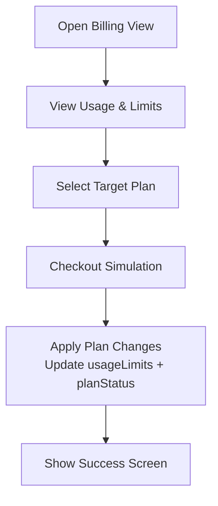
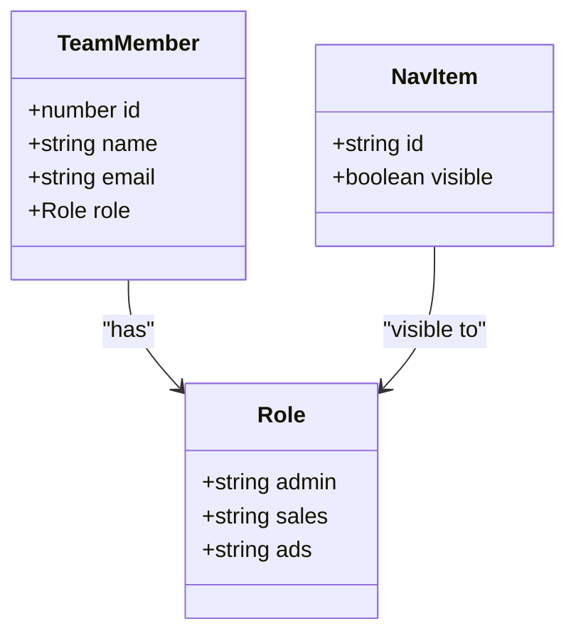
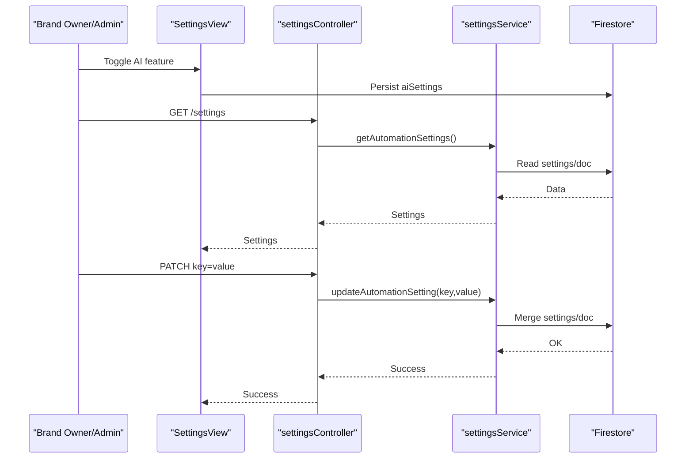
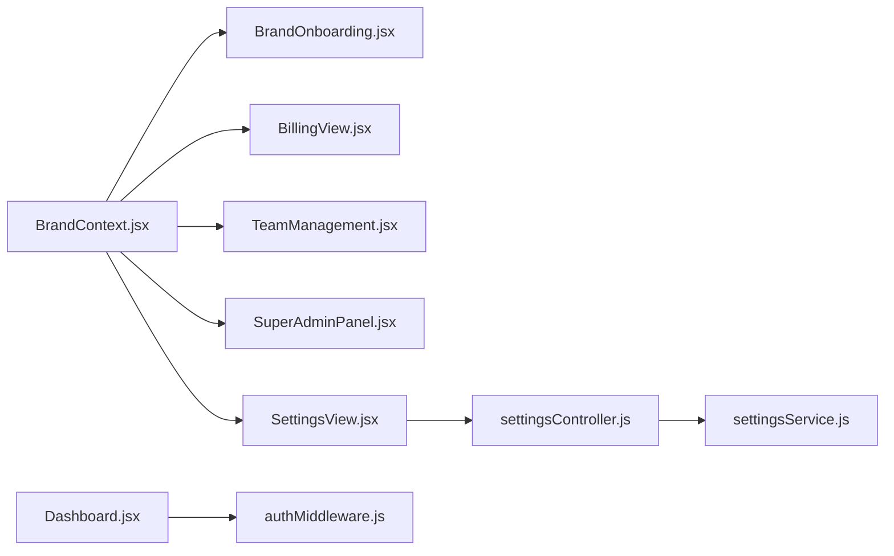

# Administration

<cite>
**Referenced Files in This Document**
- [BrandOnboarding.jsx](file://client/src/components/Brand/BrandOnboarding.jsx)
- [SuperAdminPanel.jsx](file://client/src/components/Views/SuperAdminPanel.jsx)
- [BillingView.jsx](file://client/src/components/Views/BillingView.jsx)
- [TeamManagement.jsx](file://client/src/components/TeamManagement.jsx)
- [BrandContext.jsx](file://client/src/context/BrandContext.jsx)
- [SettingsView.jsx](file://client/src/components/Views/SettingsView.jsx)
- [settingsController.js](file://server/controllers/settingsController.js)
- [settingsService.js](file://server/services/settingsService.js)
- [authMiddleware.js](file://server/middleware/authMiddleware.js)
- [Dashboard.jsx](file://client/src/Dashboard.jsx)
</cite>

## Table of Contents
1. [Introduction](#introduction)
2. [Project Structure](#project-structure)
3. [Core Components](#core-components)
4. [Architecture Overview](#architecture-overview)
5. [Detailed Component Analysis](#detailed-component-analysis)
6. [Dependency Analysis](#dependency-analysis)
7. [Performance Considerations](#performance-considerations)
8. [Troubleshooting Guide](#troubleshooting-guide)
9. [Conclusion](#conclusion)
10. [Appendices](#appendices)

## Introduction
This document provides comprehensive administration documentation for the platform’s multi-brand support, role-based access control, team management, billing systems, and system configuration. It explains how administrators and super admins manage brands, configure subscriptions, monitor system health, and govern permissions. It also outlines onboarding workflows, usage tracking, and operational controls, with guidance for scaling and maintaining security and compliance.

## Project Structure
The administration surface is primarily implemented in the client application with React components and a Firebase backend. Key areas include:
- Brand onboarding and multi-brand context
- Super admin dashboard for fleet-wide monitoring and control
- Billing and subscription management
- Team and role management
- System settings and automation controls
- Authentication and role enforcement middleware

**Diagram sources**
- [BrandOnboarding.jsx:1-243](file://client/src/components/Brand/BrandOnboarding.jsx#L1-L243)
- [SuperAdminPanel.jsx:1-526](file://client/src/components/Views/SuperAdminPanel.jsx#L1-L526)
- [BillingView.jsx:1-327](file://client/src/components/Views/BillingView.jsx#L1-L327)
- [TeamManagement.jsx:1-90](file://client/src/components/TeamManagement.jsx#L1-L90)
- [BrandContext.jsx:1-250](file://client/src/context/BrandContext.jsx#L1-L250)
- [SettingsView.jsx:1-409](file://client/src/components/Views/SettingsView.jsx#L1-L409)
- [settingsController.js:1-38](file://server/controllers/settingsController.js#L1-L38)
- [settingsService.js:1-74](file://server/services/settingsService.js#L1-L74)
- [authMiddleware.js:1-26](file://server/middleware/authMiddleware.js#L1-L26)
- [Dashboard.jsx:474-500](file://client/src/Dashboard.jsx#L474-L500)

**Section sources**
- [BrandOnboarding.jsx:1-243](file://client/src/components/Brand/BrandOnboarding.jsx#L1-L243)
- [SuperAdminPanel.jsx:1-526](file://client/src/components/Views/SuperAdminPanel.jsx#L1-L526)
- [BillingView.jsx:1-327](file://client/src/components/Views/BillingView.jsx#L1-L327)
- [TeamManagement.jsx:1-90](file://client/src/components/TeamManagement.jsx#L1-L90)
- [BrandContext.jsx:1-250](file://client/src/context/BrandContext.jsx#L1-L250)
- [SettingsView.jsx:1-409](file://client/src/components/Views/SettingsView.jsx#L1-L409)
- [settingsController.js:1-38](file://server/controllers/settingsController.js#L1-L38)
- [settingsService.js:1-74](file://server/services/settingsService.js#L1-L74)
- [authMiddleware.js:1-26](file://server/middleware/authMiddleware.js#L1-L26)
- [Dashboard.jsx:474-500](file://client/src/Dashboard.jsx#L474-L500)

## Core Components
- Brand onboarding and multi-brand context: Initializes new brands, sets plan tiers, and seeds default resources.
- Super admin panel: Fleet-wide visibility, announcements, plan updates, and brand status control.
- Billing view: Plan selection, usage monitoring, checkout simulation, and success confirmation.
- Team management: Role-based member listing and permissions guide.
- System settings: AI and automation toggles, API keys, and display preferences.
- Authentication and role enforcement: Middleware to gate protected routes by role.

**Section sources**
- [BrandOnboarding.jsx:1-243](file://client/src/components/Brand/BrandOnboarding.jsx#L1-L243)
- [SuperAdminPanel.jsx:1-526](file://client/src/components/Views/SuperAdminPanel.jsx#L1-L526)
- [BillingView.jsx:1-327](file://client/src/components/Views/BillingView.jsx#L1-L327)
- [TeamManagement.jsx:1-90](file://client/src/components/TeamManagement.jsx#L1-L90)
- [BrandContext.jsx:1-250](file://client/src/context/BrandContext.jsx#L1-L250)
- [SettingsView.jsx:1-409](file://client/src/components/Views/SettingsView.jsx#L1-L409)
- [authMiddleware.js:1-26](file://server/middleware/authMiddleware.js#L1-L26)

## Architecture Overview
The admin architecture centers on a React client with Firebase as the data store. Super admin capabilities are exposed via a dedicated panel that reads and writes brand records, while standard brand owners access billing and settings views. Automation settings are stored separately and controlled via a settings controller/service.

**Diagram sources**
- [SuperAdminPanel.jsx:89-128](file://client/src/components/Views/SuperAdminPanel.jsx#L89-L128)
- [BrandContext.jsx:77-160](file://client/src/context/BrandContext.jsx#L77-L160)
- [settingsController.js:3-31](file://server/controllers/settingsController.js#L3-L31)
- [settingsService.js:6-66](file://server/services/settingsService.js#L6-L66)

## Detailed Component Analysis

### Multi-Brand Support and Onboarding
- Onboarding flow supports three plans with distinct resource caps and agent counts.
- Registration initializes a brand record with usage limits, permissions, and a default product.
- Zero-touch provisioning includes seeding a welcome blueprint and default product.

**Diagram sources**
- [BrandOnboarding.jsx:42-54](file://client/src/components/Brand/BrandOnboarding.jsx#L42-L54)
- [BrandContext.jsx:77-160](file://client/src/context/BrandContext.jsx#L77-L160)

**Section sources**
- [BrandOnboarding.jsx:12-54](file://client/src/components/Brand/BrandOnboarding.jsx#L12-L54)
- [BrandContext.jsx:77-160](file://client/src/context/BrandContext.jsx#L77-L160)

### Super Admin Panel
- Fleet overview cards show total brands, active units, and estimated global volume.
- Real-time health indicators simulate latency and uptime metrics.
- Announcement hub allows creation, activation/pausing, and deletion of broadcasts.
- Brand fleet table supports search, filtering, quick plan updates, status toggling, and shadow mode access.

**Diagram sources**
- [SuperAdminPanel.jsx:32-163](file://client/src/components/Views/SuperAdminPanel.jsx#L32-L163)
- [BrandContext.jsx:225-242](file://client/src/context/BrandContext.jsx#L225-L242)

**Section sources**
- [SuperAdminPanel.jsx:63-163](file://client/src/components/Views/SuperAdminPanel.jsx#L63-L163)
- [BrandContext.jsx:225-242](file://client/src/context/BrandContext.jsx#L225-L242)

### Billing Systems and Usage Tracking
- Plan tiers define monthly quotas for orders, products, AI replies, and agents.
- Billing view displays usage meters and plan status, with a checkout simulation that updates brand usage limits and status.
- Usage statistics are updated via the brand context and persisted to the brand document.

**Diagram sources**
- [BillingView.jsx:60-118](file://client/src/components/Views/BillingView.jsx#L60-L118)
- [BrandContext.jsx:178-194](file://client/src/context/BrandContext.jsx#L178-L194)

**Section sources**
- [BillingView.jsx:60-118](file://client/src/components/Views/BillingView.jsx#L60-L118)
- [BrandContext.jsx:178-194](file://client/src/context/BrandContext.jsx#L178-L194)

### Team Management and Role-Based Access
- Team management lists members with role badges and a permissions guide.
- Navigation exposes an “admin” tab conditionally for super admins.
- Authentication middleware enforces role-based access to protected routes.

**Diagram sources**
- [TeamManagement.jsx:4-22](file://client/src/components/TeamManagement.jsx#L4-L22)
- [Dashboard.jsx:494-496](file://client/src/Dashboard.jsx#L494-L496)
- [authMiddleware.js:6-21](file://server/middleware/authMiddleware.js#L6-L21)

**Section sources**
- [TeamManagement.jsx:4-89](file://client/src/components/TeamManagement.jsx#L4-L89)
- [Dashboard.jsx:494-496](file://client/src/Dashboard.jsx#L494-L496)
- [authMiddleware.js:6-21](file://server/middleware/authMiddleware.js#L6-L21)

### System Configuration and Automation Controls
- Settings view manages AI and bot strategy toggles, API keys, and display preferences.
- Automation settings are fetched and updated via a dedicated controller/service pair.
- Emergency kill switch disables all automations atomically.

**Diagram sources**
- [SettingsView.jsx:54-94](file://client/src/components/Views/SettingsView.jsx#L54-L94)
- [settingsController.js:3-22](file://server/controllers/settingsController.js#L3-L22)
- [settingsService.js:6-45](file://server/services/settingsService.js#L6-L45)

**Section sources**
- [SettingsView.jsx:9-94](file://client/src/components/Views/SettingsView.jsx#L9-L94)
- [settingsController.js:1-38](file://server/controllers/settingsController.js#L1-L38)
- [settingsService.js:1-74](file://server/services/settingsService.js#L1-L74)

## Dependency Analysis
- BrandContext orchestrates multi-brand state, role detection, and usage updates.
- SuperAdminPanel depends on BrandContext for fleet data and on Firebase for real-time updates.
- BillingView depends on BrandContext for active brand and on Firebase for persistence.
- SettingsView depends on BrandContext for brand data and on settingsController for automation settings.
- Authentication middleware gates protected routes based on role.

**Diagram sources**
- [BrandContext.jsx:1-250](file://client/src/context/BrandContext.jsx#L1-L250)
- [BrandOnboarding.jsx:1-243](file://client/src/components/Brand/BrandOnboarding.jsx#L1-L243)
- [BillingView.jsx:1-327](file://client/src/components/Views/BillingView.jsx#L1-L327)
- [TeamManagement.jsx:1-90](file://client/src/components/TeamManagement.jsx#L1-L90)
- [SuperAdminPanel.jsx:1-526](file://client/src/components/Views/SuperAdminPanel.jsx#L1-L526)
- [SettingsView.jsx:1-409](file://client/src/components/Views/SettingsView.jsx#L1-L409)
- [settingsController.js:1-38](file://server/controllers/settingsController.js#L1-L38)
- [settingsService.js:1-74](file://server/services/settingsService.js#L1-L74)
- [Dashboard.jsx:474-500](file://client/src/Dashboard.jsx#L474-L500)
- [authMiddleware.js:1-26](file://server/middleware/authMiddleware.js#L1-L26)

**Section sources**
- [BrandContext.jsx:1-250](file://client/src/context/BrandContext.jsx#L1-L250)
- [Dashboard.jsx:474-500](file://client/src/Dashboard.jsx#L474-L500)
- [authMiddleware.js:1-26](file://server/middleware/authMiddleware.js#L1-L26)

## Performance Considerations
- Real-time listeners: SuperAdminPanel and SettingsView use onSnapshot; ensure unsubscription to prevent leaks.
- Batch updates: Group Firestore writes for plan changes and settings to minimize round trips.
- Conditional rendering: Avoid heavy computations in render paths; memoize derived values (e.g., stats, filters).
- UI responsiveness: Local state updates (e.g., AI toggles) before server writes improve perceived performance.

[No sources needed since this section provides general guidance]

## Troubleshooting Guide
- Onboarding failures: Verify network connectivity and that brand registration resolves to a document ID; check console errors during initialization.
- Billing updates: Confirm activeBrandId is set; ensure usage limits are applied and plan status transitions to active after upgrade.
- Automation settings: If toggles revert, confirm write operations succeed and refresh brand data to sync context.
- Role access denied: Ensure the x-user-role header is set appropriately; verify allowed roles in middleware.
- Super admin actions: Use shadow mode to impersonate a brand and validate fleet changes; confirm real-time updates via onSnapshot.

**Section sources**
- [BrandOnboarding.jsx:42-54](file://client/src/components/Brand/BrandOnboarding.jsx#L42-L54)
- [BillingView.jsx:93-118](file://client/src/components/Views/BillingView.jsx#L93-L118)
- [SettingsView.jsx:54-94](file://client/src/components/Views/SettingsView.jsx#L54-L94)
- [authMiddleware.js:6-21](file://server/middleware/authMiddleware.js#L6-L21)
- [SuperAdminPanel.jsx:111-123](file://client/src/components/Views/SuperAdminPanel.jsx#L111-L123)

## Conclusion
The administration subsystem provides a robust foundation for multi-brand orchestration, subscription management, and system governance. Super admins gain fleet-wide visibility and control, while brand owners manage billing, settings, and team roles. Automation settings and emergency controls ensure operational safety. For enterprise-scale deployments, adopt role-based policies, monitor usage trends, and maintain secure API key management.

[No sources needed since this section summarizes without analyzing specific files]

## Appendices

### Administrative Reporting and Monitoring
- Fleet metrics: Total brands, active subscriptions, and estimated GMV are computed from brand documents.
- Health indicators: Simulated latency and uptime provide near-real-time system pulse feedback.
- Announcement logs: Centralized broadcast feed supports targeted communications.

**Section sources**
- [SuperAdminPanel.jsx:63-108](file://client/src/components/Views/SuperAdminPanel.jsx#L63-L108)
- [SuperAdminPanel.jsx:230-266](file://client/src/components/Views/SuperAdminPanel.jsx#L230-L266)
- [SuperAdminPanel.jsx:268-382](file://client/src/components/Views/SuperAdminPanel.jsx#L268-L382)

### Security and Compliance Guidance
- Role enforcement: Use the middleware to restrict access to sensitive routes.
- Secrets management: Prefer BYOK for AI keys; avoid storing secrets in client code.
- Audit trail: Track plan changes and automation toggles via Firestore logs.
- Data minimization: Limit exposure of personal data in announcements and logs.

**Section sources**
- [authMiddleware.js:6-21](file://server/middleware/authMiddleware.js#L6-L21)
- [SettingsView.jsx:296-341](file://client/src/components/Views/SettingsView.jsx#L296-L341)
- [settingsService.js:48-66](file://server/services/settingsService.js#L48-L66)