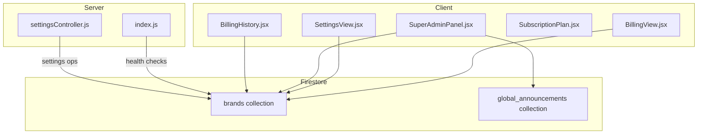
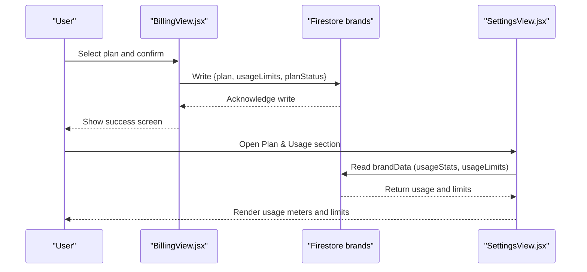
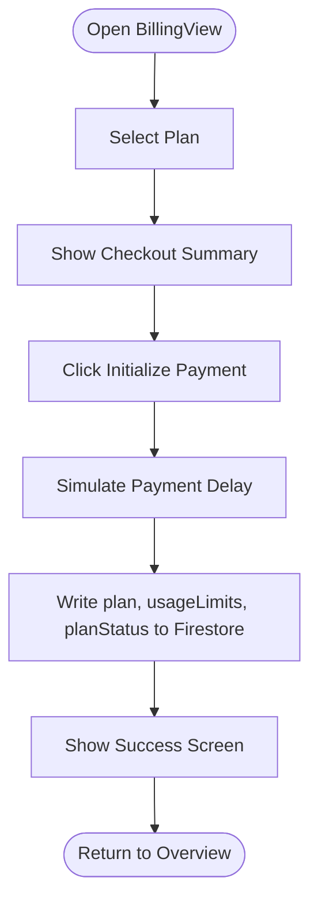
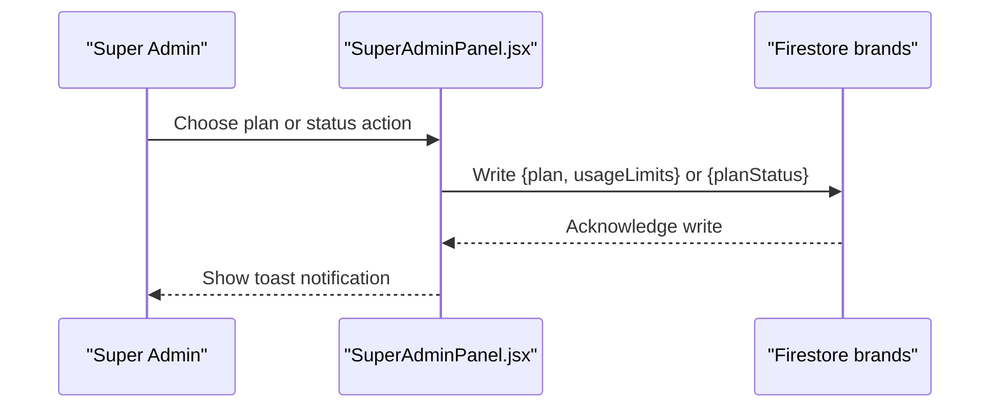
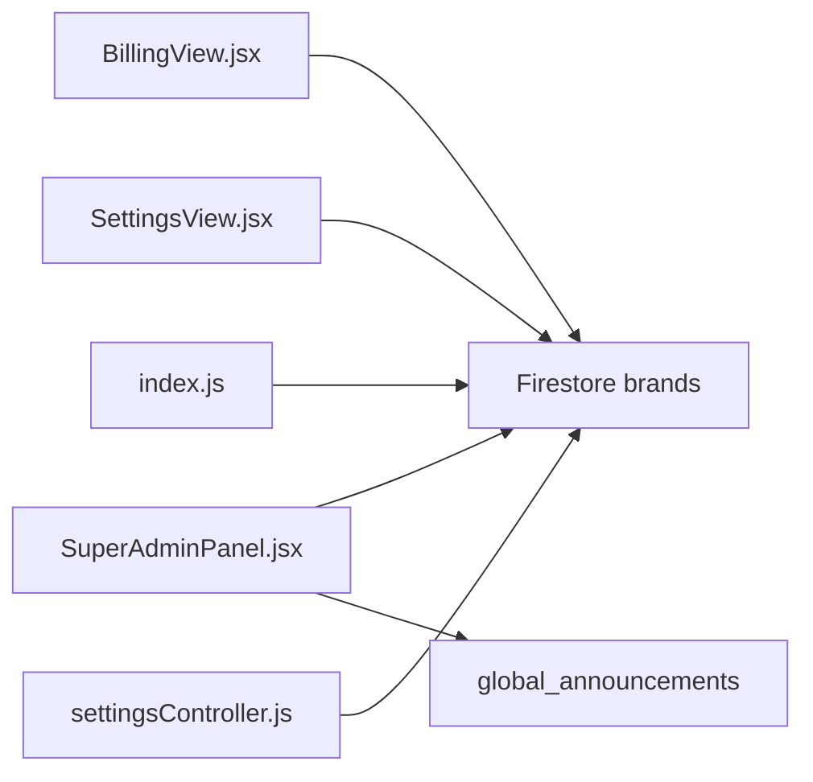

# Billing and Subscription Management

<cite>
**Referenced Files in This Document**
- [BillingView.jsx](file://client/src/components/Views/BillingView.jsx)
- [SettingsView.jsx](file://client/src/components/Views/SettingsView.jsx)
- [SuperAdminPanel.jsx](file://client/src/components/Views/SuperAdminPanel.jsx)
- [SubscriptionPlan.jsx](file://client/src/components/Views/SubscriptionPlan.jsx)
- [BillingHistory.jsx](file://client/src/components/Views/BillingHistory.jsx)
- [index.js](file://server/index.js)
- [settingsController.js](file://server/controllers/settingsController.js)
- [seedElitePack.js](file://server/scripts/seedElitePack.js)
</cite>

## Table of Contents
1. [Introduction](#introduction)
2. [Project Structure](#project-structure)
3. [Core Components](#core-components)
4. [Architecture Overview](#architecture-overview)
5. [Detailed Component Analysis](#detailed-component-analysis)
6. [Dependency Analysis](#dependency-analysis)
7. [Performance Considerations](#performance-considerations)
8. [Troubleshooting Guide](#troubleshooting-guide)
9. [Conclusion](#conclusion)

## Introduction
This document explains the billing and subscription management capabilities present in the repository. It covers plan tiers, usage tracking, quota enforcement, and administrative controls visible in the frontend, along with backend integration points and operational scripts that support billing-related workflows. Where functionality is not implemented in the repository (such as external payment processing), this is clearly indicated.

## Project Structure
The billing and subscription features are primarily implemented in the client-side React views and integrated with Firebase Firestore for persistence. Backend services and routes are minimal and focused on health checks and webhook handling. Enterprise billing features such as invoicing and contract management are not present in the repository.

**Diagram sources**
- [BillingView.jsx:1-327](file://client/src/components/Views/BillingView.jsx#L1-L327)
- [SettingsView.jsx:1-409](file://client/src/components/Views/SettingsView.jsx#L1-L409)
- [SuperAdminPanel.jsx:1-526](file://client/src/components/Views/SuperAdminPanel.jsx#L1-L526)
- [SubscriptionPlan.jsx:1-137](file://client/src/components/Views/SubscriptionPlan.jsx#L1-L137)
- [BillingHistory.jsx:1-84](file://client/src/components/Views/BillingHistory.jsx#L1-L84)
- [index.js:1-203](file://server/index.js#L1-L203)
- [settingsController.js:1-38](file://server/controllers/settingsController.js#L1-L38)

**Section sources**
- [BillingView.jsx:1-327](file://client/src/components/Views/BillingView.jsx#L1-L327)
- [SettingsView.jsx:1-409](file://client/src/components/Views/SettingsView.jsx#L1-L409)
- [SuperAdminPanel.jsx:1-526](file://client/src/components/Views/SuperAdminPanel.jsx#L1-L526)
- [SubscriptionPlan.jsx:1-137](file://client/src/components/Views/SubscriptionPlan.jsx#L1-L137)
- [BillingHistory.jsx:1-84](file://client/src/components/Views/BillingHistory.jsx#L1-L84)
- [index.js:1-203](file://server/index.js#L1-L203)
- [settingsController.js:1-38](file://server/controllers/settingsController.js#L1-L38)

## Core Components
- Plan selection UI and upgrade flow
- Usage monitoring dashboards
- Administrative controls for plan updates and status
- Historical billing records display
- Backend health and webhook endpoints

**Section sources**
- [BillingView.jsx:66-118](file://client/src/components/Views/BillingView.jsx#L66-L118)
- [SettingsView.jsx:112-204](file://client/src/components/Views/SettingsView.jsx#L112-L204)
- [SuperAdminPanel.jsx:89-123](file://client/src/components/Views/SuperAdminPanel.jsx#L89-L123)
- [BillingHistory.jsx:1-84](file://client/src/components/Views/BillingHistory.jsx#L1-L84)
- [index.js:37-124](file://server/index.js#L37-L124)

## Architecture Overview
The billing UI components persist plan and usage data to Firestore under the brands collection. Administrative actions (plan change, status toggle) are executed client-side via Firestore writes. Backend routes expose health and webhook endpoints but do not implement payment processing or subscription lifecycle logic.

**Diagram sources**
- [BillingView.jsx:93-118](file://client/src/components/Views/BillingView.jsx#L93-L118)
- [SettingsView.jsx:112-204](file://client/src/components/Views/SettingsView.jsx#L112-L204)

**Section sources**
- [BillingView.jsx:93-118](file://client/src/components/Views/BillingView.jsx#L93-L118)
- [SettingsView.jsx:112-204](file://client/src/components/Views/SettingsView.jsx#L112-L204)

## Detailed Component Analysis

### Plan Tiers and Features
The system defines three tiers: free trial, business pro, and enterprise. Each plan exposes resource quotas and feature sets in the UI.

- Free Starter
  - Orders per month: 50
  - Products: 20
  - AI replies per month: 100
  - Active agents: 1
- Business Pro
  - Orders per month: 500
  - Products: 200
  - AI replies per month: 1,000
  - Active agents: 5
- Enterprise
  - Orders per month: Unlimited
  - Products: Unlimited
  - AI replies per month: Unlimited
  - Active agents: 20

These limits are enforced in the UI by usage meters and conditional logic.

**Section sources**
- [BillingView.jsx:66-91](file://client/src/components/Views/BillingView.jsx#L66-L91)
- [BillingView.jsx:99-103](file://client/src/components/Views/BillingView.jsx#L99-L103)
- [SettingsView.jsx:150-196](file://client/src/components/Views/SettingsView.jsx#L150-L196)
- [SuperAdminPanel.jsx:93-97](file://client/src/components/Views/SuperAdminPanel.jsx#L93-L97)

### Usage Tracking and Quota Enforcement
Usage tracking is implemented client-side using Firestore-backed brand data. The system tracks monthly orders, product catalog size, and AI replies. The UI renders progress bars and numeric displays for each metric and applies visual warnings when approaching limits.

- Monthly Orders: displayed and compared against maxOrders
- Product Catalog: displayed and compared against maxProducts
- AI Replies: displayed and compared against aiRepliesPerMonth

Quota enforcement is visible in downstream components that conditionally render warnings when usage exceeds limits.

**Section sources**
- [SettingsView.jsx:150-196](file://client/src/components/Views/SettingsView.jsx#L150-L196)
- [SuperAdminPanel.jsx:417-462](file://client/src/components/Views/SuperAdminPanel.jsx#L417-L462)
- [BillingView.jsx:156-182](file://client/src/components/Views/BillingView.jsx#L156-L182)

### Upgrade Flow and Checkout UI
The upgrade flow simulates payment processing and updates the brand record with the selected plan and usage limits. The checkout screen presents plan details, subtotal, discount, and total due. A success screen confirms synchronization with the selected tier.

**Diagram sources**
- [BillingView.jsx:93-118](file://client/src/components/Views/BillingView.jsx#L93-L118)
- [BillingView.jsx:226-303](file://client/src/components/Views/BillingView.jsx#L226-L303)

**Section sources**
- [BillingView.jsx:93-118](file://client/src/components/Views/BillingView.jsx#L93-L118)
- [BillingView.jsx:226-303](file://client/src/components/Views/BillingView.jsx#L226-L303)

### Administrative Controls (Super Admin Panel)
Administrators can update a brand’s plan and status directly from the Super Admin Panel. Actions include switching between free trial, business pro, and enterprise tiers and toggling plan status between active and suspended.

**Diagram sources**
- [SuperAdminPanel.jsx:89-123](file://client/src/components/Views/SuperAdminPanel.jsx#L89-L123)

**Section sources**
- [SuperAdminPanel.jsx:89-123](file://client/src/components/Views/SuperAdminPanel.jsx#L89-L123)

### Billing History and Invoices
The Billing History view displays past invoices, dates, amounts, and payment methods, with options to download invoices. This is a presentation layer for historical records.

**Section sources**
- [BillingHistory.jsx:1-84](file://client/src/components/Views/BillingHistory.jsx#L1-L84)

### Backend Integration Points
- Health endpoints: token and webhook health checks
- Webhook verification and handling
- General API routes for other services

Note: Payment processing, subscription renewals, and proration are not implemented in the backend routes shown.

**Section sources**
- [index.js:37-124](file://server/index.js#L37-L124)
- [index.js:175-192](file://server/index.js#L175-L192)

### Coupon Management and Promotional Pricing
Coupon management and promotional pricing are not implemented in the repository. The checkout UI currently shows zero discount and does not integrate with coupon systems.

**Section sources**
- [BillingView.jsx:252-260](file://client/src/components/Views/BillingView.jsx#L252-L260)

### Subscription Upgrades/Downgrades
Plan changes are performed client-side by updating the brand document with the new plan and associated usage limits. There is no backend endpoint for upgrades/downgrades.

**Section sources**
- [BillingView.jsx:99-110](file://client/src/components/Views/BillingView.jsx#L99-L110)
- [SuperAdminPanel.jsx:98-101](file://client/src/components/Views/SuperAdminPanel.jsx#L98-L101)

### Failed Payments, Cancellations, and Refunds
- Failed payments: The upgrade flow simulates payment processing and shows a success screen after a delay; there is no failure handling or retry logic in the UI.
- Cancellations: No cancellation UI or backend logic is present.
- Refunds: Refund policies are documented in server scripts, but no refund initiation or processing is implemented in the UI.

**Section sources**
- [BillingView.jsx:93-118](file://client/src/components/Views/BillingView.jsx#L93-L118)
- [seedElitePack.js:64-69](file://server/scripts/seedElitePack.js#L64-L69)

### Enterprise Billing Scenarios
- Invoicing: Not implemented in the repository.
- Contract management: Not implemented.
- Volume discounts: Not implemented.

**Section sources**
- [SubscriptionPlan.jsx:42-58](file://client/src/components/Views/SubscriptionPlan.jsx#L42-L58)

## Dependency Analysis
- Client components depend on Firebase Firestore for reading and writing brand data.
- Super Admin Panel depends on Firestore collections for brand fleet management and global announcements.
- Backend routes provide health checks and webhook endpoints but do not implement billing logic.

**Diagram sources**
- [BillingView.jsx:1-327](file://client/src/components/Views/BillingView.jsx#L1-L327)
- [SettingsView.jsx:1-409](file://client/src/components/Views/SettingsView.jsx#L1-L409)
- [SuperAdminPanel.jsx:1-526](file://client/src/components/Views/SuperAdminPanel.jsx#L1-L526)
- [index.js:1-203](file://server/index.js#L1-L203)
- [settingsController.js:1-38](file://server/controllers/settingsController.js#L1-L38)

**Section sources**
- [BillingView.jsx:1-327](file://client/src/components/Views/BillingView.jsx#L1-L327)
- [SettingsView.jsx:1-409](file://client/src/components/Views/SettingsView.jsx#L1-L409)
- [SuperAdminPanel.jsx:1-526](file://client/src/components/Views/SuperAdminPanel.jsx#L1-L526)
- [index.js:1-203](file://server/index.js#L1-L203)
- [settingsController.js:1-38](file://server/controllers/settingsController.js#L1-L38)

## Performance Considerations
- Firestore reads/writes for brand data are used for plan and usage updates. Keep queries scoped to brand IDs to minimize cost and latency.
- Batch updates are not used; consider batching multiple field updates if plan changes become more frequent.
- UI rendering of usage meters is client-side; ensure throttling for frequent updates in large fleets.

## Troubleshooting Guide
- If plan updates appear stuck, verify Firestore connectivity and permissions for the active brand ID.
- If usage meters show incorrect values, confirm that usageStats and usageLimits are being written consistently during upgrades.
- If admin actions fail silently, check browser console for Firestore errors and network tab for failed requests.

**Section sources**
- [BillingView.jsx:112-117](file://client/src/components/Views/BillingView.jsx#L112-L117)
- [SuperAdminPanel.jsx:103-108](file://client/src/components/Views/SuperAdminPanel.jsx#L103-L108)

## Conclusion
The repository implements a billing UI with plan selection, usage tracking, and administrative controls using Firestore. Payment processing, renewals, proration, coupons, cancellations, refunds, and enterprise invoicing are not implemented in the provided code. To productionize billing, integrate a payment provider and implement backend endpoints for subscription lifecycle management.