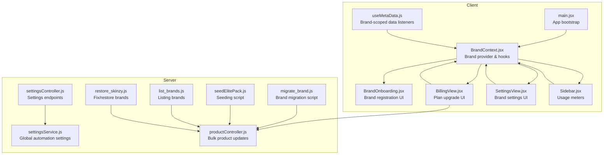
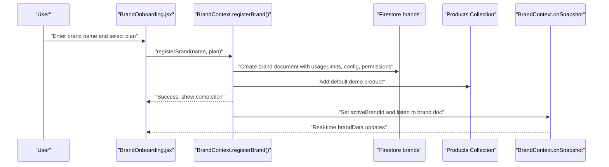
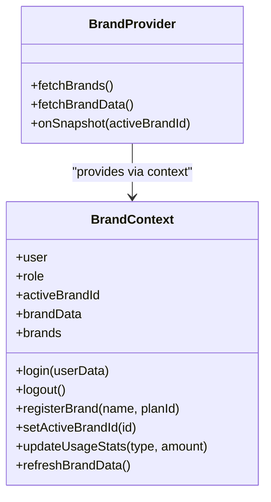
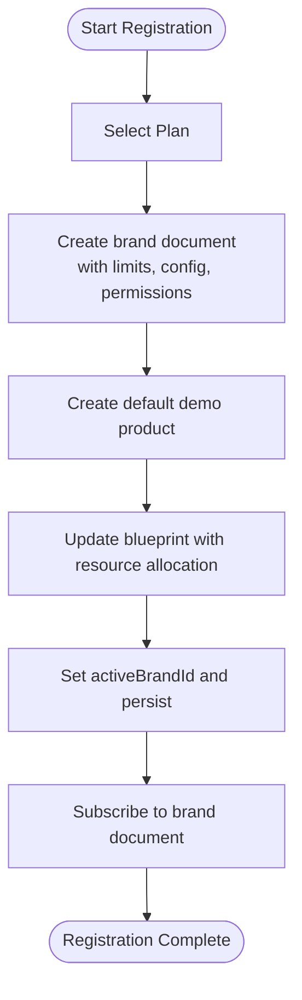
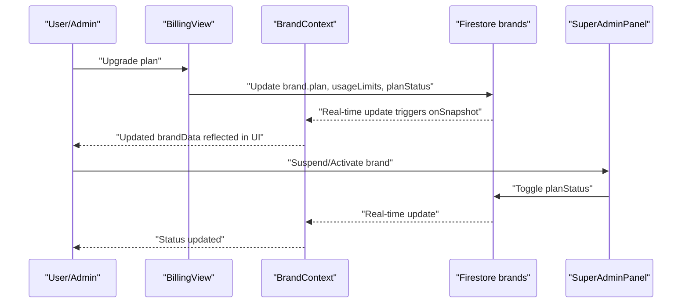
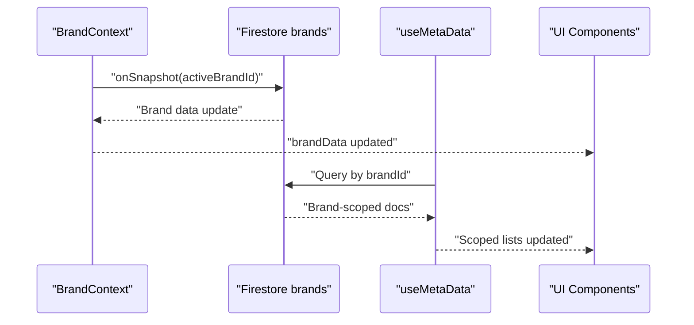
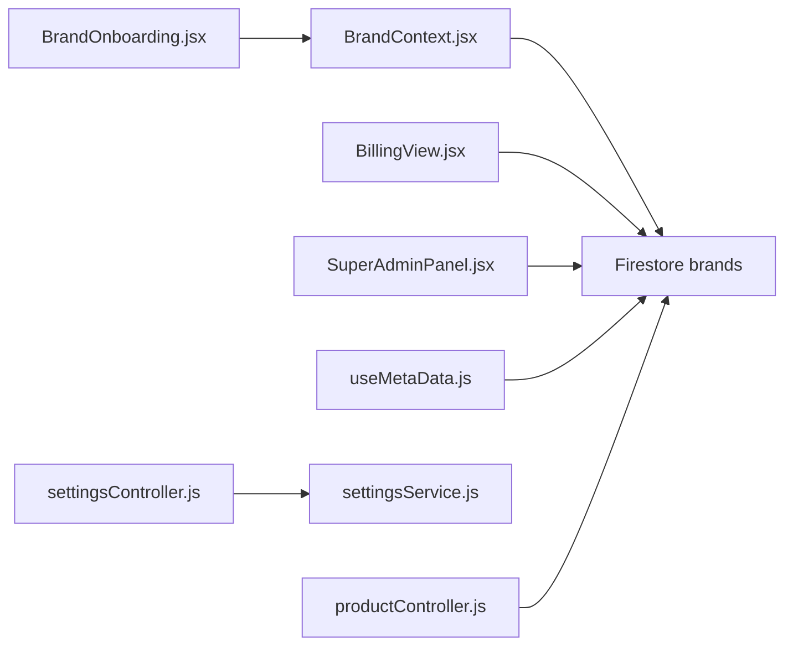

# Brand Management

<cite>
**Referenced Files in This Document**
- [BrandContext.jsx](file://client/src/context/BrandContext.jsx)
- [BrandOnboarding.jsx](file://client/src/components/Brand/BrandOnboarding.jsx)
- [SuperAdminPanel.jsx](file://client/src/components/Views/SuperAdminPanel.jsx)
- [BillingView.jsx](file://client/src/components/Views/BillingView.jsx)
- [SettingsView.jsx](file://client/src/components/Views/SettingsView.jsx)
- [Sidebar.jsx](file://client/src/components/Sidebar.jsx)
- [useMetaData.js](file://client/src/hooks/useMetaData.js)
- [main.jsx](file://client/src/main.jsx)
- [migrate_brand.js](file://server/scripts/migrate_brand.js)
- [seedElitePack.js](file://server/scripts/seedElitePack.js)
- [settingsController.js](file://server/controllers/settingsController.js)
- [settingsService.js](file://server/services/settingsService.js)
- [productController.js](file://server/controllers/productController.js)
- [list_brands.js](file://server/list_brands.js)
- [restore_skinzy.js](file://server/restore_skinzy.js)
</cite>

## Table of Contents
1. [Introduction](#introduction)
2. [Project Structure](#project-structure)
3. [Core Components](#core-components)
4. [Architecture Overview](#architecture-overview)
5. [Detailed Component Analysis](#detailed-component-analysis)
6. [Dependency Analysis](#dependency-analysis)
7. [Performance Considerations](#performance-considerations)
8. [Troubleshooting Guide](#troubleshooting-guide)
9. [Conclusion](#conclusion)
10. [Appendices](#appendices)

## Introduction
This document explains the brand management architecture and workflows in the application. It covers multi-brand support, brand registration and onboarding, real-time brand data synchronization, brand lifecycle management (including billing, suspension, and deactivation), and operational scripts for migration and seeding. It also provides guidance for scaling from single-brand to enterprise multi-brand environments with emphasis on isolation and security.

## Project Structure
The brand management system spans the client-side React application and the server-side Node.js services. The client initializes a brand-aware context provider and exposes onboarding and billing UIs. The server provides controllers and services for settings, product operations, and administrative tasks.

**Diagram sources**
- [main.jsx:1-12](file://client/src/main.jsx#L1-L12)
- [BrandContext.jsx:1-250](file://client/src/context/BrandContext.jsx#L1-L250)
- [BrandOnboarding.jsx:1-243](file://client/src/components/Brand/BrandOnboarding.jsx#L1-L243)
- [BillingView.jsx:93-128](file://client/src/components/Views/BillingView.jsx#L93-L128)
- [SettingsView.jsx:133-165](file://client/src/components/Views/SettingsView.jsx#L133-L165)
- [Sidebar.jsx:464-492](file://client/src/components/Sidebar.jsx#L464-L492)
- [useMetaData.js:38-83](file://client/src/hooks/useMetaData.js#L38-L83)
- [settingsController.js:1-38](file://server/controllers/settingsController.js#L1-L38)
- [settingsService.js:1-74](file://server/services/settingsService.js#L1-L74)
- [productController.js:1-87](file://server/controllers/productController.js#L1-L87)
- [migrate_brand.js:1-64](file://server/scripts/migrate_brand.js#L1-L64)
- [seedElitePack.js:1-135](file://server/scripts/seedElitePack.js#L1-L135)
- [list_brands.js:1-24](file://server/list_brands.js#L1-L24)
- [restore_skinzy.js:1-34](file://server/restore_skinzy.js#L1-L34)

**Section sources**
- [main.jsx:1-12](file://client/src/main.jsx#L1-L12)
- [BrandContext.jsx:1-250](file://client/src/context/BrandContext.jsx#L1-L250)

## Core Components
- BrandContext: Central React context managing user, roles, active brand, brand list, and real-time brand data synchronization. Provides brand registration, usage statistics updates, and brand switching.
- BrandOnboarding: Multi-step UI for brand creation, plan selection, and zero-touch initialization.
- BillingView: Plan upgrade UI that updates brand plan and limits.
- SettingsView and Sidebar: Display usage meters and plan expiry; integrate with brand data.
- useMetaData: Real-time listeners scoped to the active brand across products, conversations, orders, and comments.
- Server-side settings controller/service: Global automation toggles and emergency kill switch.
- Migration and seeding scripts: Administrative utilities for brand migration and content seeding.

**Section sources**
- [BrandContext.jsx:1-250](file://client/src/context/BrandContext.jsx#L1-L250)
- [BrandOnboarding.jsx:1-243](file://client/src/components/Brand/BrandOnboarding.jsx#L1-L243)
- [BillingView.jsx:93-128](file://client/src/components/Views/BillingView.jsx#L93-L128)
- [SettingsView.jsx:133-165](file://client/src/components/Views/SettingsView.jsx#L133-L165)
- [Sidebar.jsx:464-492](file://client/src/components/Sidebar.jsx#L464-L492)
- [useMetaData.js:38-83](file://client/src/hooks/useMetaData.js#L38-L83)
- [settingsController.js:1-38](file://server/controllers/settingsController.js#L1-L38)
- [settingsService.js:1-74](file://server/services/settingsService.js#L1-L74)
- [migrate_brand.js:1-64](file://server/scripts/migrate_brand.js#L1-L64)
- [seedElitePack.js:1-135](file://server/scripts/seedElitePack.js#L1-L135)

## Architecture Overview
The system uses Firebase Firestore as the primary data store. The client maintains a single active brand at a time and subscribes to real-time updates for that brand. Brand registration creates a new brand document with plan-specific limits and initializes default resources. Billing updates change plan metadata and limits. Administrative scripts manage migrations and content seeding.

**Diagram sources**
- [BrandOnboarding.jsx:42-54](file://client/src/components/Brand/BrandOnboarding.jsx#L42-L54)
- [BrandContext.jsx:77-160](file://client/src/context/BrandContext.jsx#L77-L160)
- [BrandContext.jsx:202-223](file://client/src/context/BrandContext.jsx#L202-L223)

**Section sources**
- [BrandContext.jsx:77-160](file://client/src/context/BrandContext.jsx#L77-L160)
- [BrandContext.jsx:202-223](file://client/src/context/BrandContext.jsx#L202-L223)

## Detailed Component Analysis

### BrandContext Implementation
BrandContext centralizes brand state and operations:
- Authentication and roles: Tracks user, role, and persists user in localStorage.
- Brand discovery: Lists brands per user or all brands for super-admin.
- Real-time synchronization: Subscribes to the active brand document and updates local state.
- Registration: Creates a new brand with plan limits, usage stats, config, permissions, and blueprint; initializes a default product and updates blueprint.
- Usage tracking: Increments usage counters for orders, products, and AI replies.
- Brand switching: Updates activeBrandId and re-subscribes to the brand document.

**Diagram sources**
- [BrandContext.jsx:7-243](file://client/src/context/BrandContext.jsx#L7-L243)

**Section sources**
- [BrandContext.jsx:7-243](file://client/src/context/BrandContext.jsx#L7-L243)

### Brand Registration Workflow
The registration flow:
- Plan selection: Free Starter, Business Pro, Enterprise.
- Document creation: Writes brand metadata, limits, usage stats, config, permissions, and blueprint.
- Zero-touch initialization: Adds a default product and updates blueprint with resource allocation details.
- Active brand activation: Sets activeBrandId, persists it, refreshes brand list, and subscribes to real-time updates.

**Diagram sources**
- [BrandOnboarding.jsx:42-54](file://client/src/components/Brand/BrandOnboarding.jsx#L42-L54)
- [BrandContext.jsx:77-160](file://client/src/context/BrandContext.jsx#L77-L160)

**Section sources**
- [BrandOnboarding.jsx:42-54](file://client/src/components/Brand/BrandOnboarding.jsx#L42-L54)
- [BrandContext.jsx:77-160](file://client/src/context/BrandContext.jsx#L77-L160)

### Brand Lifecycle Management
- Billing and upgrades: BillingView updates plan, limits, and status in Firestore.
- Usage tracking: updateUsageStats increments monthly counters; UI displays usage meters and expiry.
- Deactivation/suspension: SuperAdminPanel toggles planStatus between active and suspended.
- Data security and isolation: useMetaData listens only to the active brand’s collections, ensuring per-brand isolation.

**Diagram sources**
- [BillingView.jsx:93-128](file://client/src/components/Views/BillingView.jsx#L93-L128)
- [BrandContext.jsx:202-223](file://client/src/context/BrandContext.jsx#L202-L223)
- [SuperAdminPanel.jsx:495-525](file://client/src/components/Views/SuperAdminPanel.jsx#L495-L525)

**Section sources**
- [BillingView.jsx:93-128](file://client/src/components/Views/BillingView.jsx#L93-L128)
- [SuperAdminPanel.jsx:495-525](file://client/src/components/Views/SuperAdminPanel.jsx#L495-L525)
- [BrandContext.jsx:202-223](file://client/src/context/BrandContext.jsx#L202-L223)

### Brand Permissions and Ownership
- Ownership: Brand owner is determined by ownerEmail and ownerId stored during registration.
- Permissions: permissions field controls capabilities like bulk upload and advanced analytics based on plan tier.
- Role-based access: Super-admin role granted for specific admin user; otherwise brand-owner role.

**Section sources**
- [BrandContext.jsx:77-160](file://client/src/context/BrandContext.jsx#L77-L160)

### Brand Configuration Options
- Config: theme, language, timezone.
- Blueprint: AI-initialized onboarding guide with resource allocation details.
- Usage stats: ordersThisMonth, aiRepliesThisMonth, productsCount.
- Limits: maxOrders, maxProducts, aiRepliesPerMonth, activeAgents.

**Section sources**
- [BrandContext.jsx:77-160](file://client/src/context/BrandContext.jsx#L77-L160)

### Real-Time Updates and Data Synchronization
- Real-time subscription: onSnapshot on the active brand document keeps brandData current.
- Per-brand listeners: useMetaData listens to products, conversations, orders, comment drafts, and pending comments scoped to activeBrandId.
- Usage updates: updateUsageStats increments counters and refreshes local state.

**Diagram sources**
- [BrandContext.jsx:202-223](file://client/src/context/BrandContext.jsx#L202-L223)
- [useMetaData.js:38-83](file://client/src/hooks/useMetaData.js#L38-L83)

**Section sources**
- [BrandContext.jsx:202-223](file://client/src/context/BrandContext.jsx#L202-L223)
- [useMetaData.js:38-83](file://client/src/hooks/useMetaData.js#L38-L83)

### Brand Creation Process: Plan Selection, Resource Allocation, Initialization
- Plan selection: Free Starter, Business Pro, Enterprise with distinct limits.
- Resource allocation: usageLimits and permissions set accordingly.
- Automatic initialization: default product created and blueprint updated.
- Activation: activeBrandId set and persisted.

**Section sources**
- [BrandContext.jsx:77-160](file://client/src/context/BrandContext.jsx#L77-L160)

### Usage Tracking and Plan Limitations
- Monthly usage meters: ordersThisMonth vs maxOrders; visualized in SettingsView and Sidebar.
- Expiry display: planExpiry shown in SettingsView and Sidebar.
- Threshold warnings: color-coded usage meters indicate approaching limits.

**Section sources**
- [SettingsView.jsx:133-165](file://client/src/components/Views/SettingsView.jsx#L133-L165)
- [Sidebar.jsx:464-492](file://client/src/components/Sidebar.jsx#L464-L492)

### Brand Permissions, Ownership Transfer, and Deactivation
- Permissions: Controlled by permissions field derived from plan.
- Ownership: ownerEmail and ownerId fields define ownership.
- Deactivation: planStatus toggled via SuperAdminPanel; UI reflects status.

**Section sources**
- [BrandContext.jsx:77-160](file://client/src/context/BrandContext.jsx#L77-L160)
- [SuperAdminPanel.jsx:495-525](file://client/src/components/Views/SuperAdminPanel.jsx#L495-L525)

### Scaling Guidance: Single Brand to Enterprise Multi-Brand
- Multi-brand support: BrandContext supports multiple brands per user; activeBrandId determines scope.
- Isolation: useMetaData ensures queries are scoped to activeBrandId; server-side controllers filter by brandId.
- Security: Real-time listeners and server routes enforce brand scoping; avoid leaking cross-brand data.
- Best practices:
  - Always filter Firestore queries by brandId.
  - Use onSnapshot selectively and unsubscribe appropriately.
  - Keep permissions aligned with plan tiers.
  - Monitor usage meters and proactively upgrade plans.

**Section sources**
- [useMetaData.js:38-83](file://client/src/hooks/useMetaData.js#L38-L83)
- [productController.js:6-82](file://server/controllers/productController.js#L6-L82)

## Dependency Analysis
- Client depends on Firebase Firestore for real-time brand data and scoped queries.
- BrandContext orchestrates authentication, brand discovery, registration, and real-time updates.
- BillingView and SuperAdminPanel mutate brand metadata in Firestore.
- useMetaData ensures per-brand data isolation across UI components.
- Server-side settings controller/service manages global automation toggles; unrelated to brand data.

**Diagram sources**
- [BrandContext.jsx:1-250](file://client/src/context/BrandContext.jsx#L1-L250)
- [BrandOnboarding.jsx:1-243](file://client/src/components/Brand/BrandOnboarding.jsx#L1-L243)
- [BillingView.jsx:93-128](file://client/src/components/Views/BillingView.jsx#L93-L128)
- [SuperAdminPanel.jsx:495-525](file://client/src/components/Views/SuperAdminPanel.jsx#L495-L525)
- [useMetaData.js:38-83](file://client/src/hooks/useMetaData.js#L38-L83)
- [settingsController.js:1-38](file://server/controllers/settingsController.js#L1-L38)
- [settingsService.js:1-74](file://server/services/settingsService.js#L1-L74)
- [productController.js:1-87](file://server/controllers/productController.js#L1-L87)

**Section sources**
- [BrandContext.jsx:1-250](file://client/src/context/BrandContext.jsx#L1-L250)
- [BrandOnboarding.jsx:1-243](file://client/src/components/Brand/BrandOnboarding.jsx#L1-L243)
- [BillingView.jsx:93-128](file://client/src/components/Views/BillingView.jsx#L93-L128)
- [SuperAdminPanel.jsx:495-525](file://client/src/components/Views/SuperAdminPanel.jsx#L495-L525)
- [useMetaData.js:38-83](file://client/src/hooks/useMetaData.js#L38-L83)
- [settingsController.js:1-38](file://server/controllers/settingsController.js#L1-L38)
- [settingsService.js:1-74](file://server/services/settingsService.js#L1-L74)
- [productController.js:1-87](file://server/controllers/productController.js#L1-L87)

## Performance Considerations
- Real-time subscriptions: Keep subscriptions minimal and unsubscribe on unmount to reduce bandwidth and CPU.
- Batch operations: Use server-side batch updates for bulk product changes to minimize round trips.
- Embeddings and side effects: Asynchronous embedding updates should not block UI responsiveness.
- Query scoping: Always filter by brandId to avoid scanning large datasets.

[No sources needed since this section provides general guidance]

## Troubleshooting Guide
- Authentication recovery: If localStorage user is corrupted, BrandContext clears it and logs a recovery message.
- Real-time listener errors: BrandContext logs and handles errors from onSnapshot.
- Brand listing issues: Server-side scripts list_brands.js and restore_skinzy.js assist in diagnosing and fixing brand records.
- Migration failures: migrate_brand.js logs detailed steps and exits after completion or failure.

**Section sources**
- [BrandContext.jsx:162-176](file://client/src/context/BrandContext.jsx#L162-L176)
- [BrandContext.jsx:217-220](file://client/src/context/BrandContext.jsx#L217-L220)
- [list_brands.js:1-24](file://server/list_brands.js#L1-L24)
- [restore_skinzy.js:1-34](file://server/restore_skinzy.js#L1-L34)
- [migrate_brand.js:56-60](file://server/scripts/migrate_brand.js#L56-L60)

## Conclusion
The brand management system provides robust multi-brand support with real-time synchronization, plan-driven permissions, and automated initialization. By scoping all data access to the active brand and leveraging Firestore’s real-time capabilities, the system scales from single-brand to enterprise environments while maintaining isolation and performance. Administrative scripts streamline migration and seeding, supporting operational efficiency.

[No sources needed since this section summarizes without analyzing specific files]

## Appendices

### Appendix A: Server-Side Automation Settings
- Global automation toggles are managed via settingsController and settingsService.
- An emergency kill switch disables all automations atomically.

**Section sources**
- [settingsController.js:1-38](file://server/controllers/settingsController.js#L1-L38)
- [settingsService.js:1-74](file://server/services/settingsService.js#L1-L74)

### Appendix B: Bulk Operations and Inventory Sync
- Bulk product updates are executed server-side with per-item validation and asynchronous side effects (embedding updates and ad inventory sync).

**Section sources**
- [productController.js:6-82](file://server/controllers/productController.js#L6-L82)