# System Configuration and Settings

<cite>
**Referenced Files in This Document**
- [SuperAdminPanel.jsx](file://client/src/components/Views/SuperAdminPanel.jsx)
- [BrandContext.jsx](file://client/src/context/BrandContext.jsx)
- [settingsController.js](file://server/controllers/settingsController.js)
- [settingsService.js](file://server/services/settingsService.js)
- [analyticsController.js](file://server/controllers/analyticsController.js)
- [auditService.js](file://server/services/auditService.js)
- [logger.js](file://server/utils/logger.js)
- [authMiddleware.js](file://server/middleware/authMiddleware.js)
- [firestoreService.js](file://server/services/firestoreService.js)
- [migrate_brand.js](file://server/scripts/migrate_brand.js)
- [check.js](file://server/check.js)
- [diagnose.js](file://server/diagnose.js)
- [status.js](file://server/status.js)
</cite>

## Table of Contents
1. [Introduction](#introduction)
2. [Project Structure](#project-structure)
3. [Core Components](#core-components)
4. [Architecture Overview](#architecture-overview)
5. [Detailed Component Analysis](#detailed-component-analysis)
6. [Dependency Analysis](#dependency-analysis)
7. [Performance Considerations](#performance-considerations)
8. [Troubleshooting Guide](#troubleshooting-guide)
9. [Conclusion](#conclusion)
10. [Appendices](#appendices)

## Introduction
This document describes the system configuration and settings for the platform, focusing on:
- Platform-wide settings and administrative controls
- Super admin panel functionality for monitoring, user/brand management, and analytics
- Global settings configuration, default brand settings, and permission controls
- Backup and recovery procedures, system health monitoring, and performance optimization
- Custom branding and white-label configurations
- Multi-tenant setup and cross-brand operations
- System updates, maintenance windows, and emergency procedures
- Security configurations, audit logging, and compliance considerations

## Project Structure
The system comprises:
- Frontend (React) with a Super Admin Panel and Brand context provider
- Backend (Node.js/Express) with controllers, services, middleware, and CLI diagnostics
- Firebase/Firestore for persistence and identity integration
- Scripts for migrations and diagnostics

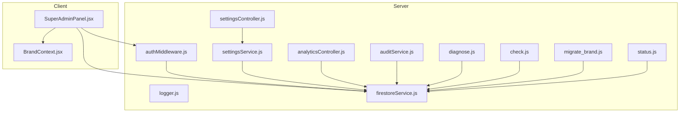

**Diagram sources**
- [SuperAdminPanel.jsx:1-526](file://client/src/components/Views/SuperAdminPanel.jsx#L1-L526)
- [BrandContext.jsx:1-250](file://client/src/context/BrandContext.jsx#L1-L250)
- [authMiddleware.js:1-26](file://server/middleware/authMiddleware.js#L1-L26)
- [settingsController.js:1-38](file://server/controllers/settingsController.js#L1-L38)
- [settingsService.js:1-74](file://server/services/settingsService.js#L1-L74)
- [analyticsController.js:1-22](file://server/controllers/analyticsController.js#L1-L22)
- [auditService.js:1-25](file://server/services/auditService.js#L1-L25)
- [logger.js:1-10](file://server/utils/logger.js#L1-L10)
- [firestoreService.js:1-126](file://server/services/firestoreService.js#L1-L126)
- [diagnose.js:1-64](file://server/diagnose.js#L1-L64)
- [check.js:1-13](file://server/check.js#L1-L13)
- [status.js:1-4](file://server/status.js#L1-L4)
- [migrate_brand.js:1-64](file://server/scripts/migrate_brand.js#L1-L64)

**Section sources**
- [SuperAdminPanel.jsx:1-526](file://client/src/components/Views/SuperAdminPanel.jsx#L1-L526)
- [BrandContext.jsx:1-250](file://client/src/context/BrandContext.jsx#L1-L250)
- [settingsController.js:1-38](file://server/controllers/settingsController.js#L1-L38)
- [settingsService.js:1-74](file://server/services/settingsService.js#L1-L74)
- [analyticsController.js:1-22](file://server/controllers/analyticsController.js#L1-L22)
- [auditService.js:1-25](file://server/services/auditService.js#L1-L25)
- [logger.js:1-10](file://server/utils/logger.js#L1-L10)
- [authMiddleware.js:1-26](file://server/middleware/authMiddleware.js#L1-L26)
- [firestoreService.js:1-126](file://server/services/firestoreService.js#L1-L126)
- [diagnose.js:1-64](file://server/diagnose.js#L1-L64)
- [check.js:1-13](file://server/check.js#L1-L13)
- [status.js:1-4](file://server/status.js#L1-L4)
- [migrate_brand.js:1-64](file://server/scripts/migrate_brand.js#L1-L64)

## Core Components
- Super Admin Panel: Real-time dashboard for fleet-wide stats, brand fleet management, announcements broadcasting, and system health indicators.
- Brand Context Provider: Multi-tenant orchestration, brand switching, role-based access, and usage statistics.
- Settings Management: Global automation toggles persisted in Firestore with emergency kill switch.
- Analytics: Brand-specific BI metrics retrieval.
- Audit Logging: Structured audit trail entries for admin/system actions.
- Diagnostics and Health: Environment checks, connectivity verification, and status endpoints.
- Security and Permissions: Role-based access control via middleware and Firestore-backed roles.

**Section sources**
- [SuperAdminPanel.jsx:32-526](file://client/src/components/Views/SuperAdminPanel.jsx#L32-L526)
- [BrandContext.jsx:7-250](file://client/src/context/BrandContext.jsx#L7-L250)
- [settingsController.js:1-38](file://server/controllers/settingsController.js#L1-L38)
- [settingsService.js:1-74](file://server/services/settingsService.js#L1-L74)
- [analyticsController.js:1-22](file://server/controllers/analyticsController.js#L1-L22)
- [auditService.js:1-25](file://server/services/auditService.js#L1-L25)
- [authMiddleware.js:1-26](file://server/middleware/authMiddleware.js#L1-L26)

## Architecture Overview
The system integrates a React frontend with Firebase/Firestore for persistence and authentication. Backend controllers expose REST endpoints for settings, analytics, and diagnostics. Middleware enforces role-based access. Services encapsulate Firestore operations and caching.

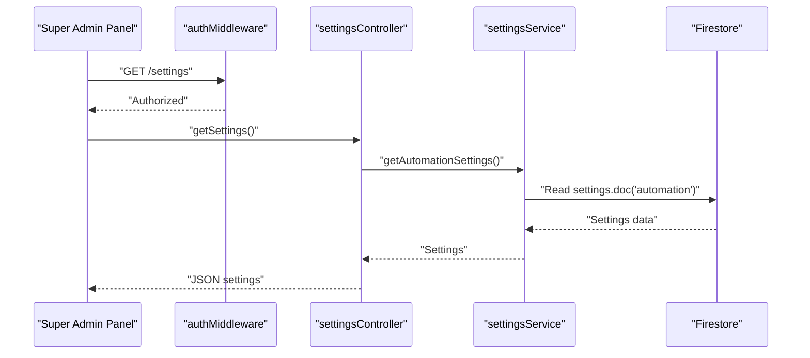

**Diagram sources**
- [SuperAdminPanel.jsx:1-526](file://client/src/components/Views/SuperAdminPanel.jsx#L1-L526)
- [authMiddleware.js:1-26](file://server/middleware/authMiddleware.js#L1-L26)
- [settingsController.js:1-38](file://server/controllers/settingsController.js#L1-L38)
- [settingsService.js:1-74](file://server/services/settingsService.js#L1-L74)
- [firestoreService.js:1-126](file://server/services/firestoreService.js#L1-L126)

## Detailed Component Analysis

### Super Admin Panel
- Fleet-wide statistics cards for total brands, active subscriptions, and estimated revenue.
- System health simulation with latency and uptime metrics.
- Announcement hub for creating, activating, and deleting global broadcasts.
- Brand fleet table with filtering, search, plan updates, status toggling, and “Shadow Mode” to impersonate a brand.
- Real-time Firestore snapshots for announcements and brand data.

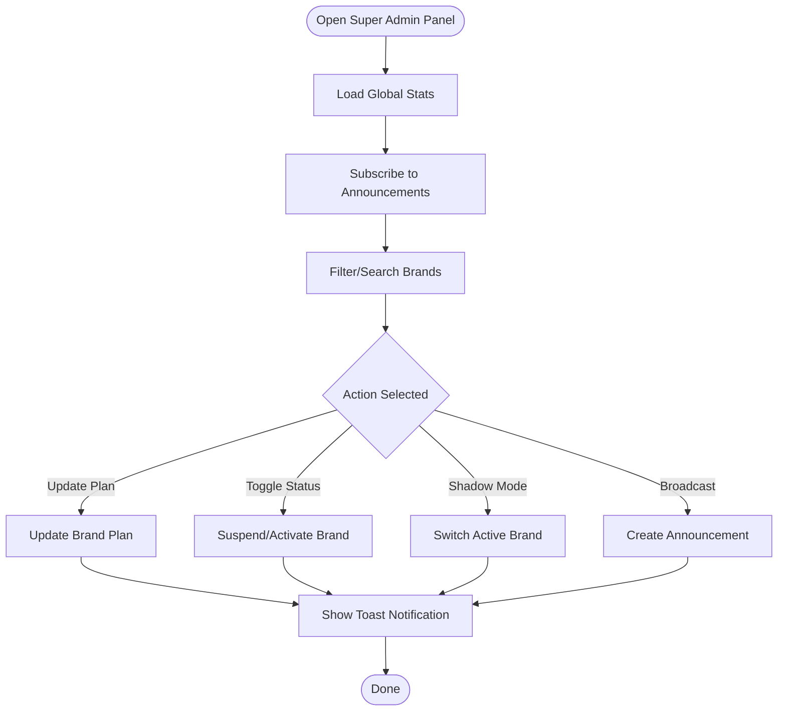

**Diagram sources**
- [SuperAdminPanel.jsx:32-526](file://client/src/components/Views/SuperAdminPanel.jsx#L32-L526)

**Section sources**
- [SuperAdminPanel.jsx:32-526](file://client/src/components/Views/SuperAdminPanel.jsx#L32-L526)

### Brand Context Provider (Multi-Tenant)
- Role determination: super-admin vs brand-owner based on user email.
- Brand listing and selection with real-time snapshot updates.
- Brand registration with plan-based limits, usage stats, permissions, and default config.
- Usage stat increments for orders, products, and AI replies.
- Local storage-based user session persistence.

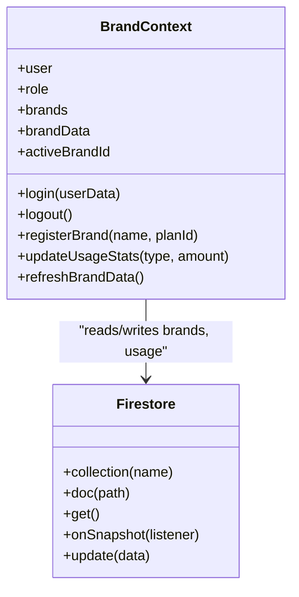

**Diagram sources**
- [BrandContext.jsx:1-250](file://client/src/context/BrandContext.jsx#L1-L250)
- [firestoreService.js:1-126](file://server/services/firestoreService.js#L1-L126)

**Section sources**
- [BrandContext.jsx:7-250](file://client/src/context/BrandContext.jsx#L7-L250)

### Settings Management (Global Automation Controls)
- Retrieve global automation settings with sensible defaults.
- Update individual automation toggles via merge writes.
- Emergency kill switch to disable all automations atomically.
- Feature gating helper to check if a feature is enabled.

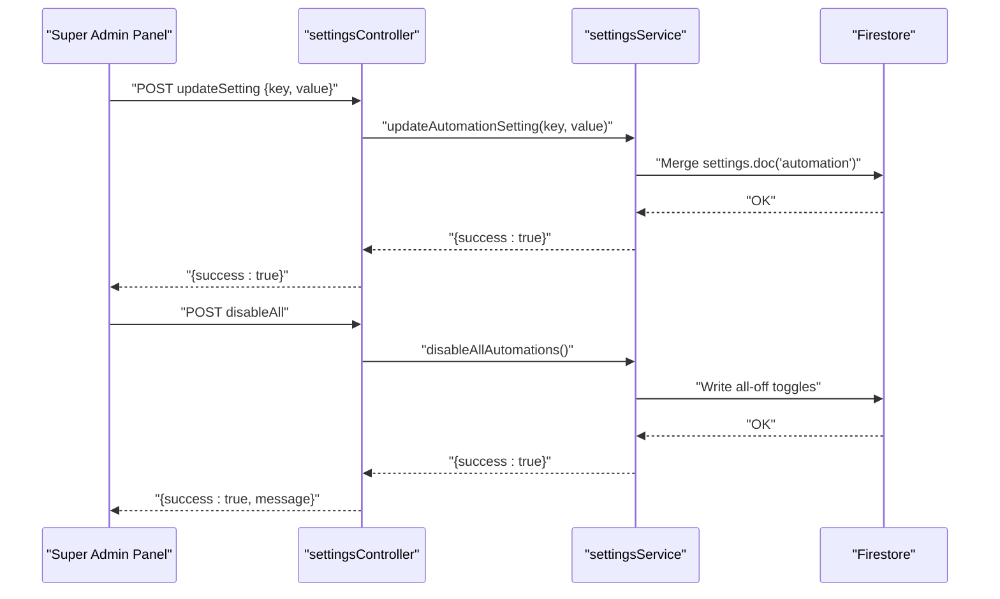

**Diagram sources**
- [settingsController.js:1-38](file://server/controllers/settingsController.js#L1-L38)
- [settingsService.js:1-74](file://server/services/settingsService.js#L1-L74)
- [firestoreService.js:1-126](file://server/services/firestoreService.js#L1-L126)

**Section sources**
- [settingsController.js:1-38](file://server/controllers/settingsController.js#L1-L38)
- [settingsService.js:1-74](file://server/services/settingsService.js#L1-L74)

### Analytics and BI Metrics
- Endpoint to fetch brand-specific BI metrics.
- Requires brandId query parameter.
- Centralized service pattern for metrics aggregation.

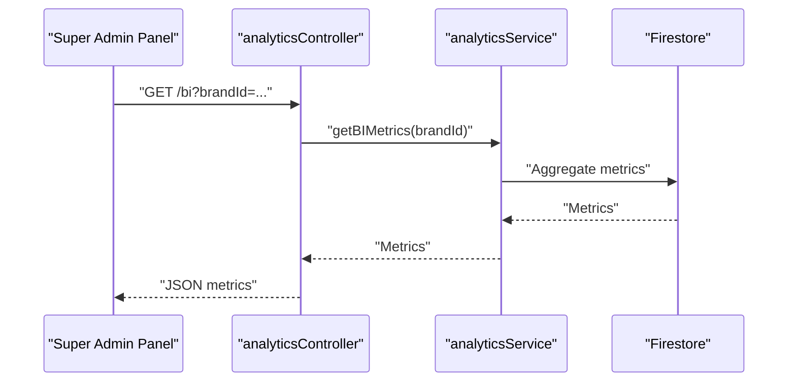

**Diagram sources**
- [analyticsController.js:1-22](file://server/controllers/analyticsController.js#L1-L22)

**Section sources**
- [analyticsController.js:1-22](file://server/controllers/analyticsController.js#L1-L22)

### Audit Logging and Compliance
- Structured audit log entries with action, details, user ID, timestamp, and sort key.
- Non-failing write to avoid disrupting flows.
- Recommended for compliance: retain logs per policy, redact sensitive fields, and secure access.

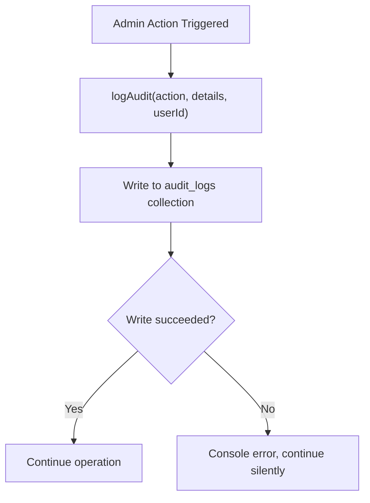

**Diagram sources**
- [auditService.js:1-25](file://server/services/auditService.js#L1-L25)

**Section sources**
- [auditService.js:1-25](file://server/services/auditService.js#L1-L25)

### Security and Permissions
- Role enforcement via middleware using a role header or admin fallback.
- Super admin detection via a specific email in client-side context.
- Firestore-based role resolution recommended for production.

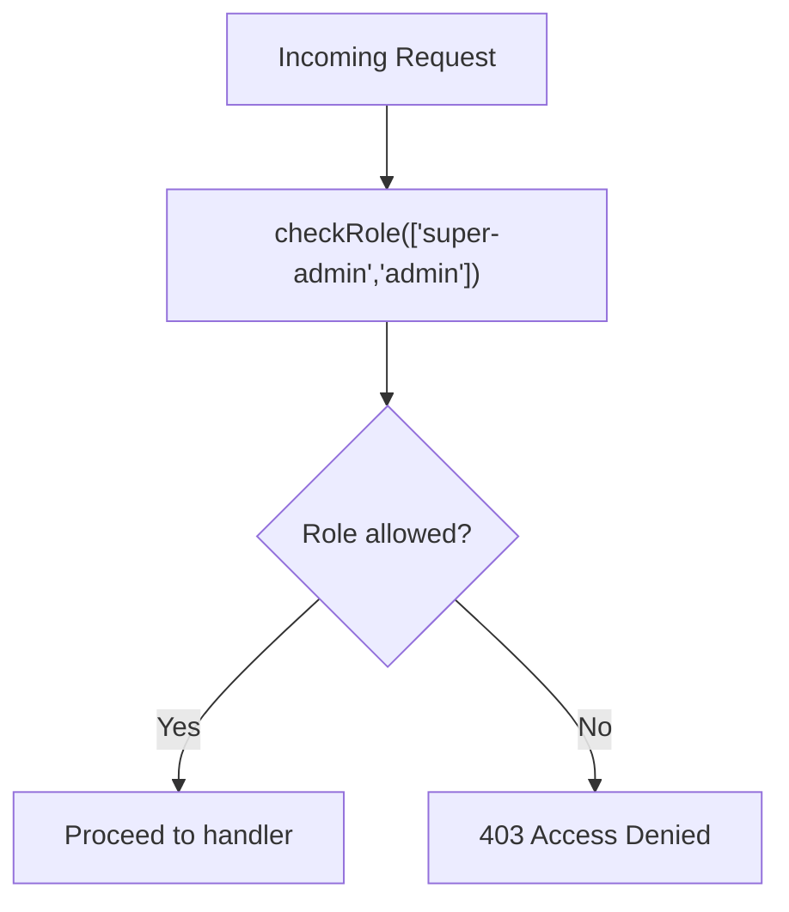

**Diagram sources**
- [authMiddleware.js:1-26](file://server/middleware/authMiddleware.js#L1-L26)
- [BrandContext.jsx:21-27](file://client/src/context/BrandContext.jsx#L21-L27)

**Section sources**
- [authMiddleware.js:1-26](file://server/middleware/authMiddleware.js#L1-L26)
- [BrandContext.jsx:21-27](file://client/src/context/BrandContext.jsx#L21-L27)

### System Health Monitoring and Diagnostics
- Environment and Firebase checks, brand lookup fallbacks, and diagnostic output.
- Connectivity and brand presence checks.
- Status endpoint for basic API health.

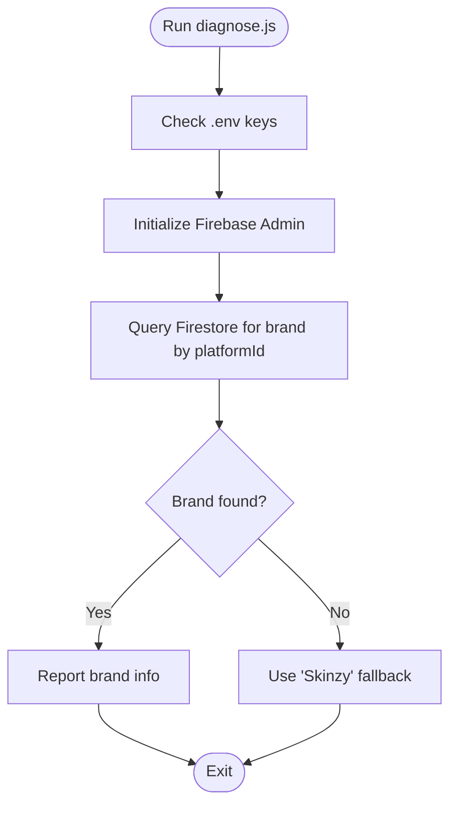

**Diagram sources**
- [diagnose.js:1-64](file://server/diagnose.js#L1-L64)
- [firestoreService.js:55-114](file://server/services/firestoreService.js#L55-L114)

**Section sources**
- [diagnose.js:1-64](file://server/diagnose.js#L1-L64)
- [check.js:1-13](file://server/check.js#L1-L13)
- [status.js:1-4](file://server/status.js#L1-L4)

### Backup and Recovery Procedures
- Brand migration script demonstrates safe migration of brand data and related collections.
- Recommended steps:
  - Snapshot Firestore collections before migration.
  - Validate brand existence and target ID uniqueness.
  - Run migration script to copy data and update references.
  - Verify migrated data and remove old document if desired.
  - Monitor system health after migration.

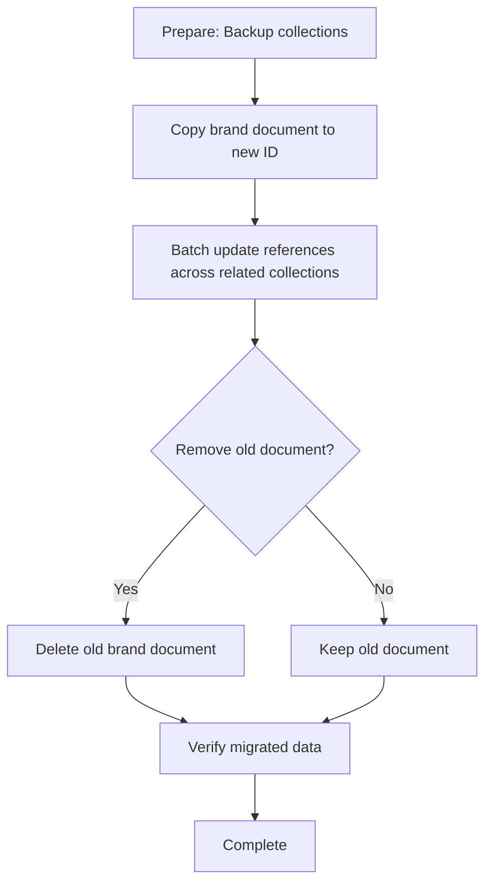

**Diagram sources**
- [migrate_brand.js:1-64](file://server/scripts/migrate_brand.js#L1-L64)

**Section sources**
- [migrate_brand.js:1-64](file://server/scripts/migrate_brand.js#L1-L64)

### Custom Branding and White-Label Configurations
- Default brand config includes theme, language, and timezone.
- Permissions per plan tier (e.g., bulk upload, advanced analytics).
- Brand registration initializes default product and blueprint.
- Developer fallback logic supports single-tenant owner brand with preset tokens and settings.

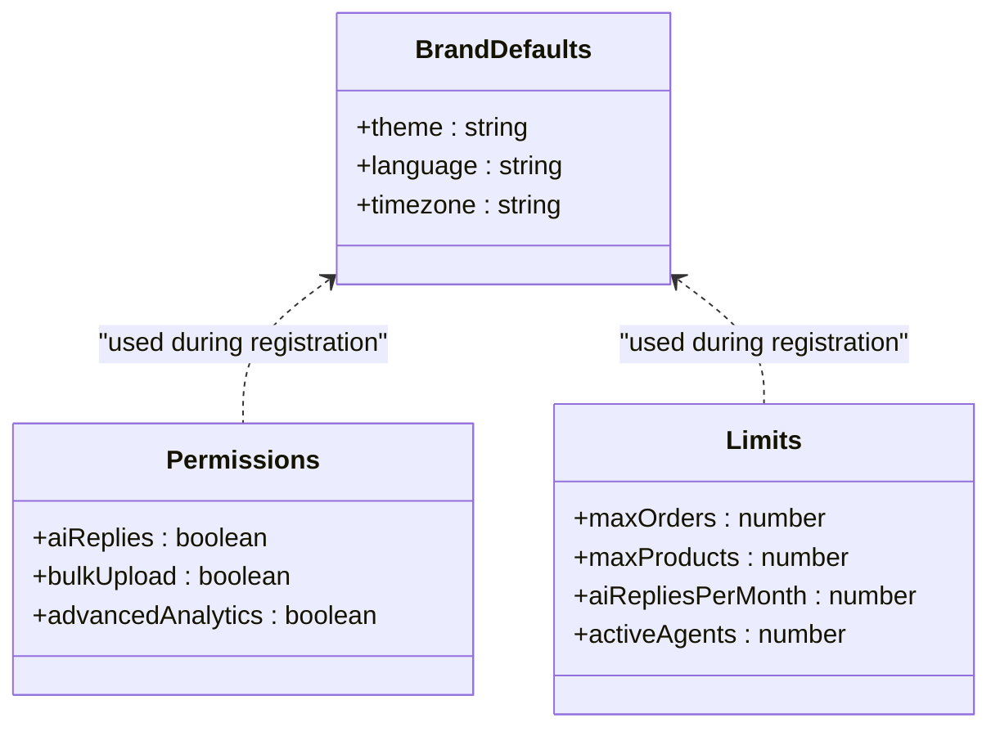

**Diagram sources**
- [BrandContext.jsx:77-160](file://client/src/context/BrandContext.jsx#L77-L160)
- [firestoreService.js:55-114](file://server/services/firestoreService.js#L55-L114)

**Section sources**
- [BrandContext.jsx:77-160](file://client/src/context/BrandContext.jsx#L77-L160)
- [firestoreService.js:55-114](file://server/services/firestoreService.js#L55-L114)

### Multi-Tenant Setup and Cross-Brand Operations
- Super admin sees all brands; brand owners see only their brands.
- Shadow mode allows super admin to operate as a selected brand.
- Brand switching updates activeBrandId and refreshes data.

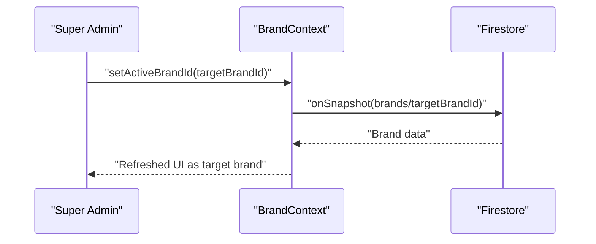

**Diagram sources**
- [BrandContext.jsx:202-223](file://client/src/context/BrandContext.jsx#L202-L223)
- [SuperAdminPanel.jsx:125-128](file://client/src/components/Views/SuperAdminPanel.jsx#L125-L128)

**Section sources**
- [BrandContext.jsx:202-223](file://client/src/context/BrandContext.jsx#L202-L223)
- [SuperAdminPanel.jsx:125-128](file://client/src/components/Views/SuperAdminPanel.jsx#L125-L128)

## Dependency Analysis
- Controllers depend on services for business logic.
- Services depend on Firestore for persistence and caching.
- Middleware depends on Firestore for role resolution.
- Client components depend on Firebase for real-time updates and role-based rendering.

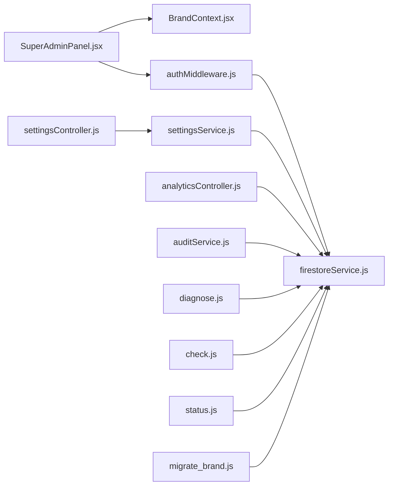

**Diagram sources**
- [SuperAdminPanel.jsx:1-526](file://client/src/components/Views/SuperAdminPanel.jsx#L1-L526)
- [BrandContext.jsx:1-250](file://client/src/context/BrandContext.jsx#L1-L250)
- [authMiddleware.js:1-26](file://server/middleware/authMiddleware.js#L1-L26)
- [settingsController.js:1-38](file://server/controllers/settingsController.js#L1-L38)
- [settingsService.js:1-74](file://server/services/settingsService.js#L1-L74)
- [analyticsController.js:1-22](file://server/controllers/analyticsController.js#L1-L22)
- [auditService.js:1-25](file://server/services/auditService.js#L1-L25)
- [firestoreService.js:1-126](file://server/services/firestoreService.js#L1-L126)
- [diagnose.js:1-64](file://server/diagnose.js#L1-L64)
- [check.js:1-13](file://server/check.js#L1-L13)
- [status.js:1-4](file://server/status.js#L1-L4)
- [migrate_brand.js:1-64](file://server/scripts/migrate_brand.js#L1-L64)

**Section sources**
- [SuperAdminPanel.jsx:1-526](file://client/src/components/Views/SuperAdminPanel.jsx#L1-L526)
- [BrandContext.jsx:1-250](file://client/src/context/BrandContext.jsx#L1-L250)
- [settingsController.js:1-38](file://server/controllers/settingsController.js#L1-L38)
- [settingsService.js:1-74](file://server/services/settingsService.js#L1-L74)
- [analyticsController.js:1-22](file://server/controllers/analyticsController.js#L1-L22)
- [auditService.js:1-25](file://server/services/auditService.js#L1-L25)
- [authMiddleware.js:1-26](file://server/middleware/authMiddleware.js#L1-L26)
- [firestoreService.js:1-126](file://server/services/firestoreService.js#L1-L126)
- [diagnose.js:1-64](file://server/diagnose.js#L1-L64)
- [check.js:1-13](file://server/check.js#L1-L13)
- [status.js:1-4](file://server/status.js#L1-L4)
- [migrate_brand.js:1-64](file://server/scripts/migrate_brand.js#L1-L64)

## Performance Considerations
- Real-time snapshots: Use pagination and efficient queries to limit payload sizes.
- Caching: Firestore service caches brand lookups; leverage for repeated requests.
- Batch operations: Use batch writes for bulk updates (e.g., migration script).
- Health indicators: Simulated metrics in the admin panel; replace with live telemetry in production.
- Logging: Minimal overhead; ensure log rotation and offload for high-volume environments.

[No sources needed since this section provides general guidance]

## Troubleshooting Guide
- Authentication failures: Verify role header and ensure Firestore-backed roles are configured.
- Settings not applying: Confirm merge writes and document existence for automation settings.
- Analytics errors: Ensure brandId is provided and brand exists.
- Diagnostics: Use diagnose script to verify environment variables and Firebase initialization.
- Connectivity: Use status endpoint and check.js to validate Firestore connectivity and brand records.

**Section sources**
- [authMiddleware.js:1-26](file://server/middleware/authMiddleware.js#L1-L26)
- [settingsController.js:1-38](file://server/controllers/settingsController.js#L1-L38)
- [analyticsController.js:1-22](file://server/controllers/analyticsController.js#L1-L22)
- [diagnose.js:1-64](file://server/diagnose.js#L1-L64)
- [check.js:1-13](file://server/check.js#L1-L13)
- [status.js:1-4](file://server/status.js#L1-L4)

## Conclusion
The platform provides a robust foundation for system-wide configuration and administration:
- Super admin panel enables fleet oversight, brand management, and global communications.
- Settings management centralizes automation controls with an emergency kill switch.
- Multi-tenant architecture supports white-label deployments with plan-based permissions.
- Diagnostics and health monitoring assist in operational assurance.
- Audit logging and security middleware support compliance and access control.

[No sources needed since this section summarizes without analyzing specific files]

## Appendices

### System Updates and Maintenance Windows
- Schedule maintenance during low-traffic periods.
- Communicate via the announcement hub to inform stakeholders.
- Validate environment variables and Firebase credentials before deployment.

[No sources needed since this section provides general guidance]

### Emergency Procedures
- Use the emergency kill switch to disable all automations immediately.
- Review audit logs for recent admin actions.
- Perform diagnostics to isolate environment or connectivity issues.

**Section sources**
- [settingsService.js:48-66](file://server/services/settingsService.js#L48-L66)
- [auditService.js:1-25](file://server/services/auditService.js#L1-L25)
- [diagnose.js:1-64](file://server/diagnose.js#L1-L64)