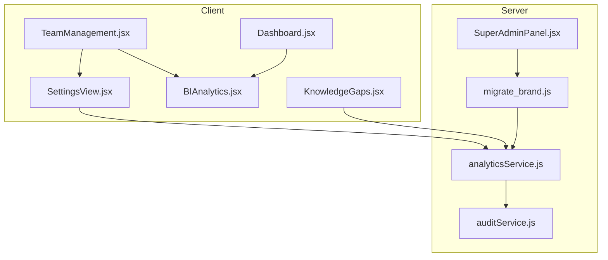
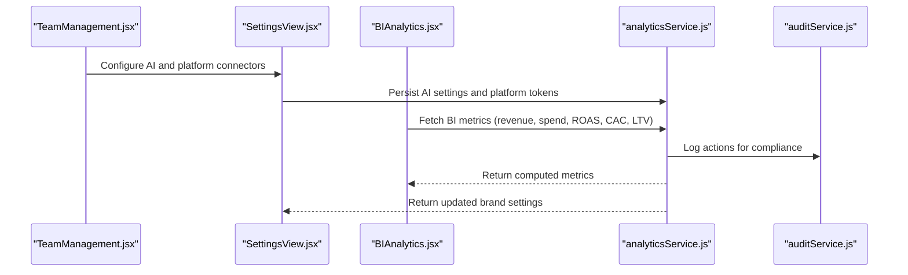
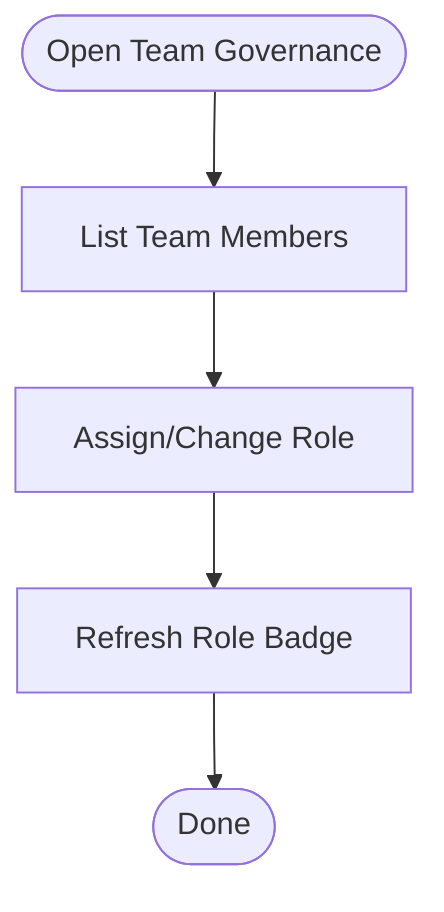
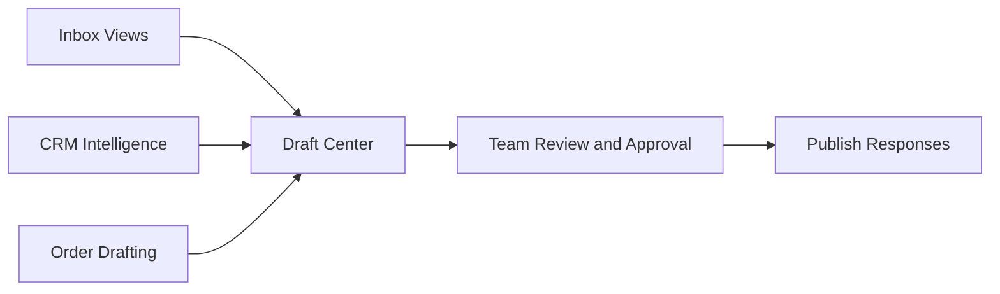
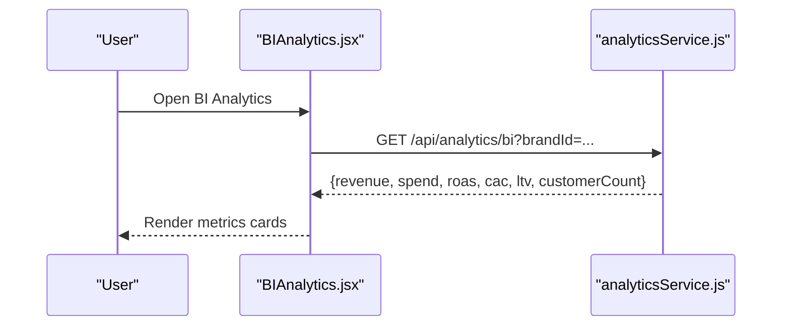
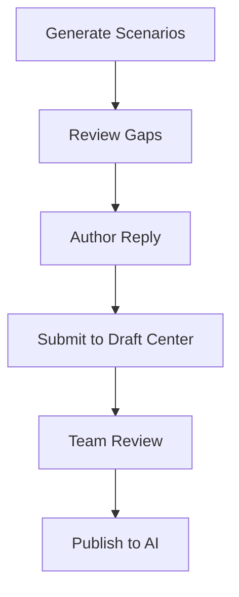
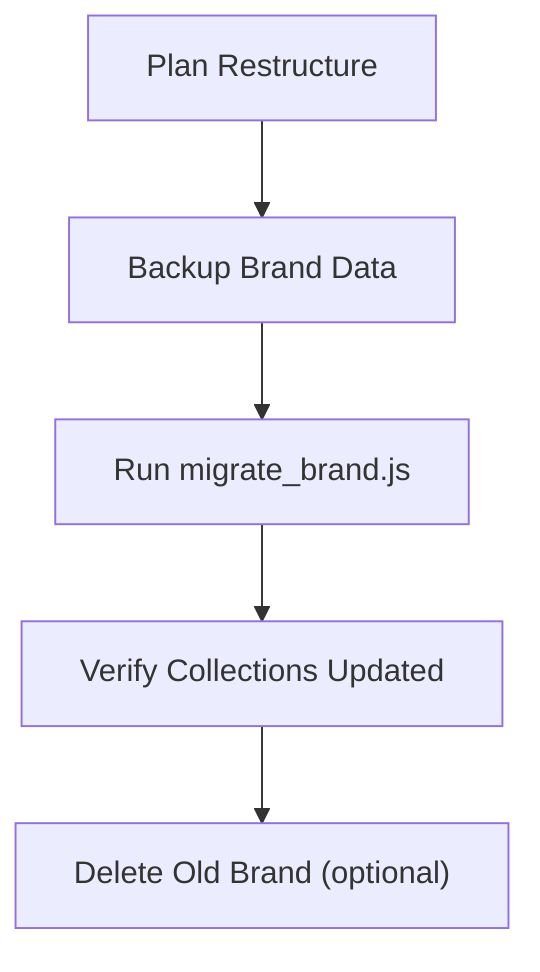
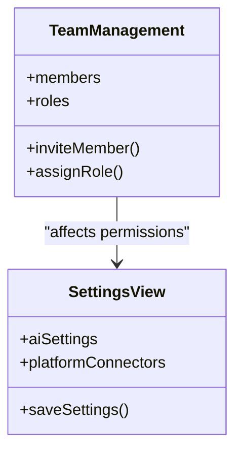
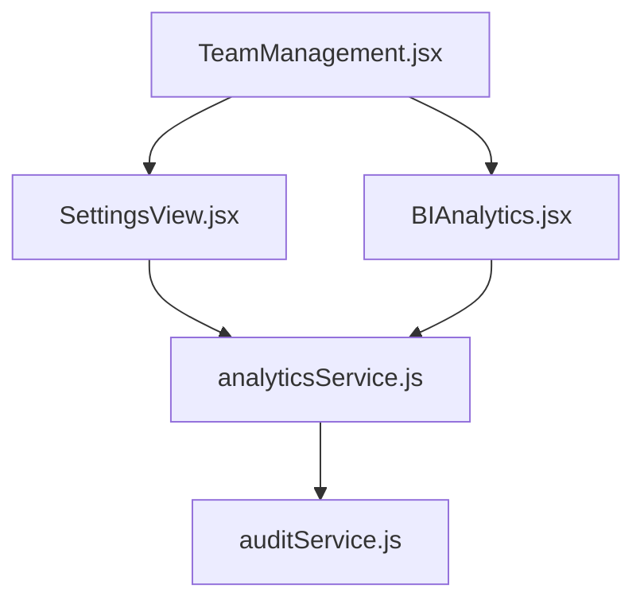

# Team Management

<cite>
**Referenced Files in This Document**
- [TeamManagement.jsx](file://client/src/components/TeamManagement.jsx)
- [BIAnalytics.jsx](file://client/src/components/BIAnalytics.jsx)
- [analyticsService.js](file://server/services/analyticsService.js)
- [SettingsView.jsx](file://client/src/components/Views/SettingsView.jsx)
- [KnowledgeGaps.jsx](file://client/src/components/Views/KnowledgeGaps.jsx)
- [Dashboard.jsx](file://client/src/Dashboard.jsx)
- [auditService.js](file://server/services/auditService.js)
- [migrate_brand.js](file://server/scripts/migrate_brand.js)
- [SuperAdminPanel.jsx](file://client/src/components/Views/SuperAdminPanel.jsx)
</cite>

## Table of Contents
1. [Introduction](#introduction)
2. [Project Structure](#project-structure)
3. [Core Components](#core-components)
4. [Architecture Overview](#architecture-overview)
5. [Detailed Component Analysis](#detailed-component-analysis)
6. [Dependency Analysis](#dependency-analysis)
7. [Performance Considerations](#performance-considerations)
8. [Troubleshooting Guide](#troubleshooting-guide)
9. [Conclusion](#conclusion)
10. [Appendices](#appendices)

## Introduction
This document provides comprehensive team management guidance for onboarding, role assignment, collaboration, and analytics within the platform. It explains current capabilities reflected in the codebase, including team governance, role permissions, AI-driven training, BI analytics, and operational controls. Where features are not yet implemented, this document outlines recommended workflows and best practices to support team operations, collaboration, and performance tracking.

## Project Structure
Team-related functionality spans the frontend UI and backend services:
- Frontend components manage team views, settings, analytics dashboards, and training workflows.
- Backend services compute analytics and maintain audit logs for compliance and insights.
- Scripts and admin panels support brand-level operations and migrations.

**Diagram sources**
- [TeamManagement.jsx:1-90](file://client/src/components/TeamManagement.jsx#L1-L90)
- [SettingsView.jsx:1-409](file://client/src/components/Views/SettingsView.jsx#L1-L409)
- [BIAnalytics.jsx:1-170](file://client/src/components/BIAnalytics.jsx#L1-L170)
- [KnowledgeGaps.jsx:1-299](file://client/src/components/Views/KnowledgeGaps.jsx#L1-L299)
- [Dashboard.jsx:502-529](file://client/src/Dashboard.jsx#L502-L529)
- [analyticsService.js:44-80](file://server/services/analyticsService.js#L44-L80)
- [auditService.js:1-24](file://server/services/auditService.js#L1-L24)
- [migrate_brand.js:1-63](file://server/scripts/migrate_brand.js#L1-L63)
- [SuperAdminPanel.jsx:423-525](file://client/src/components/Views/SuperAdminPanel.jsx#L423-L525)

**Section sources**
- [TeamManagement.jsx:1-90](file://client/src/components/TeamManagement.jsx#L1-L90)
- [SettingsView.jsx:1-409](file://client/src/components/Views/SettingsView.jsx#L1-L409)
- [BIAnalytics.jsx:1-170](file://client/src/components/BIAnalytics.jsx#L1-L170)
- [KnowledgeGaps.jsx:1-299](file://client/src/components/Views/KnowledgeGaps.jsx#L1-L299)
- [Dashboard.jsx:502-529](file://client/src/Dashboard.jsx#L502-L529)
- [analyticsService.js:44-80](file://server/services/analyticsService.js#L44-L80)
- [auditService.js:1-24](file://server/services/auditService.js#L1-L24)
- [migrate_brand.js:1-63](file://server/scripts/migrate_brand.js#L1-L63)
- [SuperAdminPanel.jsx:423-525](file://client/src/components/Views/SuperAdminPanel.jsx#L423-L525)

## Core Components
- Team Governance: Displays team members, roles, and role permission summaries. Supports inviting new members and managing role badges.
- Settings and AI Controls: Centralized configuration for AI features, platform connectors, and display preferences.
- BI Analytics: Real-time financial and unit economics metrics for growth intelligence.
- Knowledge Gaps: Training interface to convert AI learning opportunities into drafts and improve team readiness.
- Audit and Operations: Backend audit logging and brand migration scripts for operational control.

**Section sources**
- [TeamManagement.jsx:4-89](file://client/src/components/TeamManagement.jsx#L4-L89)
- [SettingsView.jsx:9-409](file://client/src/components/Views/SettingsView.jsx#L9-L409)
- [BIAnalytics.jsx:4-169](file://client/src/components/BIAnalytics.jsx#L4-L169)
- [KnowledgeGaps.jsx:148-299](file://client/src/components/Views/KnowledgeGaps.jsx#L148-L299)
- [auditService.js:9-22](file://server/services/auditService.js#L9-L22)
- [migrate_brand.js:4-63](file://server/scripts/migrate_brand.js#L4-L63)

## Architecture Overview
The team management architecture integrates UI components with backend analytics and operational services. The frontend requests analytics and settings, while backend services calculate metrics and maintain audit trails.

**Diagram sources**
- [TeamManagement.jsx:24-86](file://client/src/components/TeamManagement.jsx#L24-L86)
- [SettingsView.jsx:54-94](file://client/src/components/Views/SettingsView.jsx#L54-L94)
- [BIAnalytics.jsx:16-29](file://client/src/components/BIAnalytics.jsx#L16-L29)
- [analyticsService.js:54-76](file://server/services/analyticsService.js#L54-L76)
- [auditService.js:9-22](file://server/services/auditService.js#L9-L22)

## Detailed Component Analysis

### Team Governance and Role Assignment
- Displays team members with role badges and permission summaries.
- Provides an “Invite Member” action and a permissions guide for Admin, Sales, and Ads Manager roles.
- Role-based access is indicated in the UI; actual enforcement depends on backend authorization policies.

**Diagram sources**
- [TeamManagement.jsx:4-89](file://client/src/components/TeamManagement.jsx#L4-L89)

**Section sources**
- [TeamManagement.jsx:4-89](file://client/src/components/TeamManagement.jsx#L4-L89)

### Team Collaboration and Communication Features
- Shared workspace access is implied by the presence of shared components and navigation in the dashboard.
- Collaboration workflows are supported through:
  - Inbox and CRM integrations (visible in dashboard navigation).
  - Comment and order drafting interfaces.
  - Knowledge gaps training to standardize responses and improve team readiness.

**Diagram sources**
- [Dashboard.jsx:42-60](file://client/src/Dashboard.jsx#L42-L60)
- [KnowledgeGaps.jsx:148-299](file://client/src/components/Views/KnowledgeGaps.jsx#L148-L299)

**Section sources**
- [Dashboard.jsx:42-60](file://client/src/Dashboard.jsx#L42-L60)
- [KnowledgeGaps.jsx:148-299](file://client/src/components/Views/KnowledgeGaps.jsx#L148-L299)

### Team Performance Tracking and Analytics
- BI Analytics displays revenue, spend, ROAS, CAC, LTV, and customer counts.
- The analytics service computes metrics from Firestore collections and logs actions for auditability.

**Diagram sources**
- [BIAnalytics.jsx:16-29](file://client/src/components/BIAnalytics.jsx#L16-L29)
- [analyticsService.js:54-76](file://server/services/analyticsService.js#L54-L76)

**Section sources**
- [BIAnalytics.jsx:4-169](file://client/src/components/BIAnalytics.jsx#L4-L169)
- [analyticsService.js:54-80](file://server/services/analyticsService.js#L54-L80)

### Team Training and Knowledge Sharing
- Knowledge Gaps enables team members to:
  - Discover practical scenarios.
  - Author brand-aligned replies.
  - Convert scenarios to drafts for review and publishing.
- Progress tracking indicates readiness and completion status.

**Diagram sources**
- [KnowledgeGaps.jsx:173-186](file://client/src/components/Views/KnowledgeGaps.jsx#L173-L186)

**Section sources**
- [KnowledgeGaps.jsx:148-299](file://client/src/components/Views/KnowledgeGaps.jsx#L148-L299)

### Team Restructuring and Brand-Level Operations
- Brand migration script supports moving data between brand IDs, enabling team restructuring across brands.
- Super Admin Panel provides brand visibility and status controls.

**Diagram sources**
- [migrate_brand.js:4-63](file://server/scripts/migrate_brand.js#L4-L63)
- [SuperAdminPanel.jsx:423-525](file://client/src/components/Views/SuperAdminPanel.jsx#L423-L525)

**Section sources**
- [migrate_brand.js:4-63](file://server/scripts/migrate_brand.js#L4-L63)
- [SuperAdminPanel.jsx:423-525](file://client/src/components/Views/SuperAdminPanel.jsx#L423-L525)

### Team-Based Permission Management
- Role badges and permission summaries are visible in the team view.
- AI and platform connector settings are centrally managed in Settings, affecting team-wide capabilities.

**Diagram sources**
- [TeamManagement.jsx:4-89](file://client/src/components/TeamManagement.jsx#L4-L89)
- [SettingsView.jsx:54-94](file://client/src/components/Views/SettingsView.jsx#L54-L94)

**Section sources**
- [TeamManagement.jsx:4-89](file://client/src/components/TeamManagement.jsx#L4-L89)
- [SettingsView.jsx:54-94](file://client/src/components/Views/SettingsView.jsx#L54-L94)

## Dependency Analysis
- TeamManagement depends on UI patterns and role display logic.
- SettingsView depends on Firestore to persist AI and platform configurations.
- BIAnalytics depends on analyticsService for metric computation.
- auditService ensures non-blocking logging for all actions.

**Diagram sources**
- [TeamManagement.jsx:1-90](file://client/src/components/TeamManagement.jsx#L1-L90)
- [SettingsView.jsx:1-409](file://client/src/components/Views/SettingsView.jsx#L1-L409)
- [BIAnalytics.jsx:1-170](file://client/src/components/BIAnalytics.jsx#L1-L170)
- [analyticsService.js:44-80](file://server/services/analyticsService.js#L44-L80)
- [auditService.js:1-24](file://server/services/auditService.js#L1-L24)

**Section sources**
- [TeamManagement.jsx:1-90](file://client/src/components/TeamManagement.jsx#L1-L90)
- [SettingsView.jsx:1-409](file://client/src/components/Views/SettingsView.jsx#L1-L409)
- [BIAnalytics.jsx:1-170](file://client/src/components/BIAnalytics.jsx#L1-L170)
- [analyticsService.js:44-80](file://server/services/analyticsService.js#L44-L80)
- [auditService.js:1-24](file://server/services/auditService.js#L1-L24)

## Performance Considerations
- Centralize AI and platform settings to reduce repeated configuration overhead.
- Use audit logs to monitor performance regressions and identify bottlenecks.
- Batch updates for large-scale team changes to minimize UI thrashing.

[No sources needed since this section provides general guidance]

## Troubleshooting Guide
- If analytics data appears stale, verify the BI endpoint and network connectivity.
- If AI settings fail to save, confirm Firestore write permissions and retry.
- For audit discrepancies, check audit logs for action timestamps and user IDs.

**Section sources**
- [BIAnalytics.jsx:16-29](file://client/src/components/BIAnalytics.jsx#L16-L29)
- [SettingsView.jsx:71-94](file://client/src/components/Views/SettingsView.jsx#L71-L94)
- [auditService.js:9-22](file://server/services/auditService.js#L9-L22)

## Conclusion
The current codebase provides a solid foundation for team governance, AI-powered training, and BI analytics. To enhance collaboration and performance tracking, consider implementing:
- Invitation and email verification workflows (UI and backend).
- Skill assignments and availability management for team members.
- Shared workspace access controls and collaborative workflows.
- Team-based permission enforcement aligned with roles.
- Team training workflows and knowledge sharing mechanisms.

[No sources needed since this section summarizes without analyzing specific files]

## Appendices
- Team Roles and Permissions Summary:
  - Admin: Full engine control including settings, team, and billing.
  - Sales: Access to Inbox, CRM Intelligence, and Order Drafting.
  - Ads Manager: Access to Campaigns, Audience Sync, and BI Analytics.

**Section sources**
- [TeamManagement.jsx:64-83](file://client/src/components/TeamManagement.jsx#L64-L83)