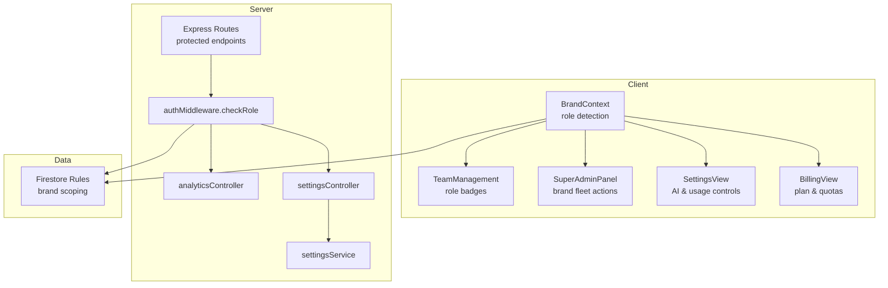
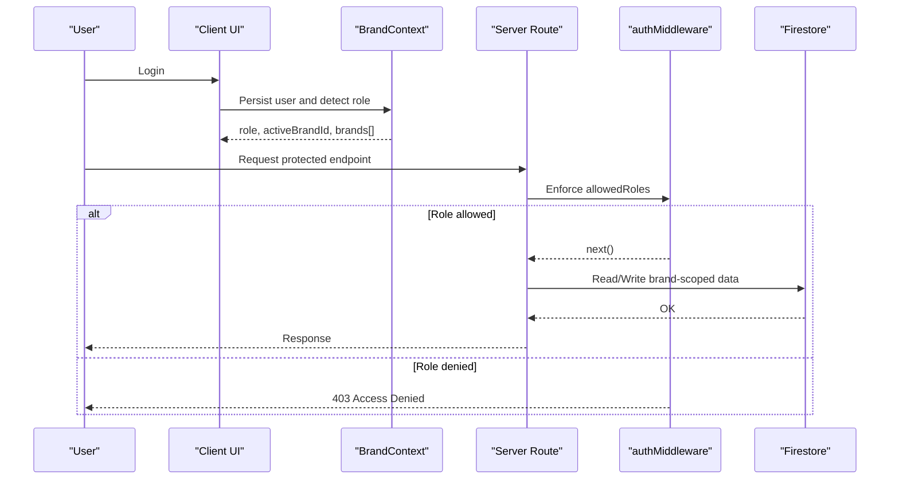
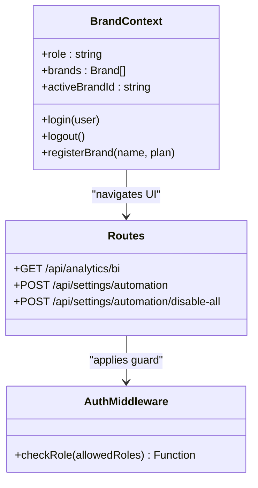
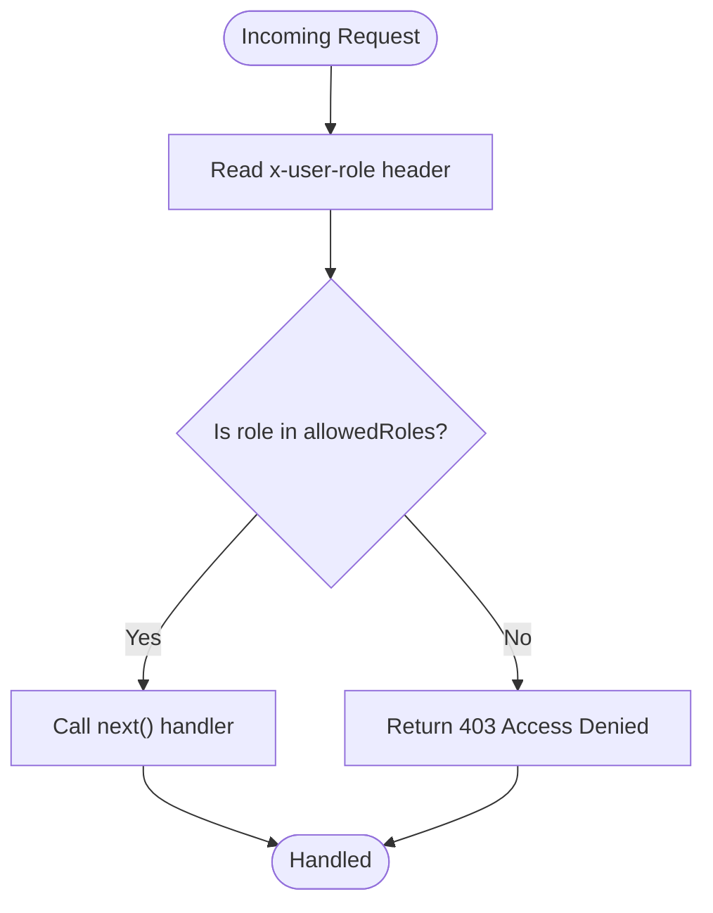
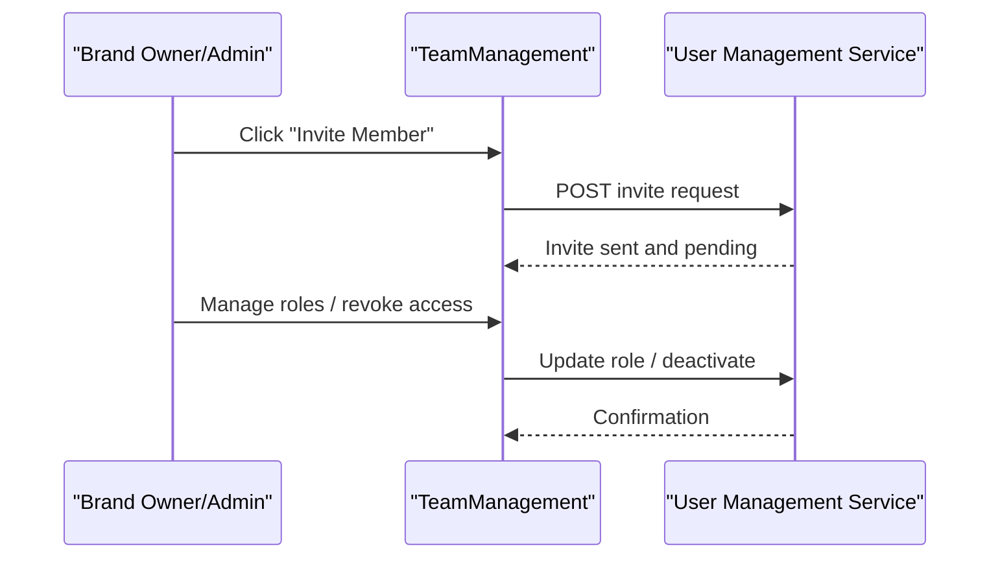
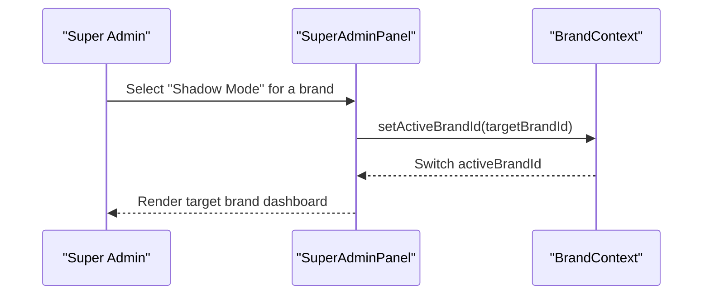
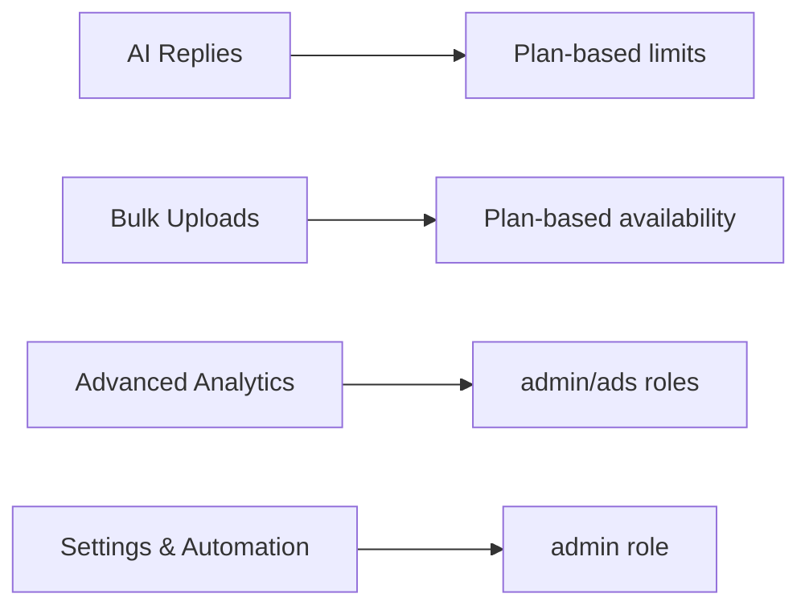
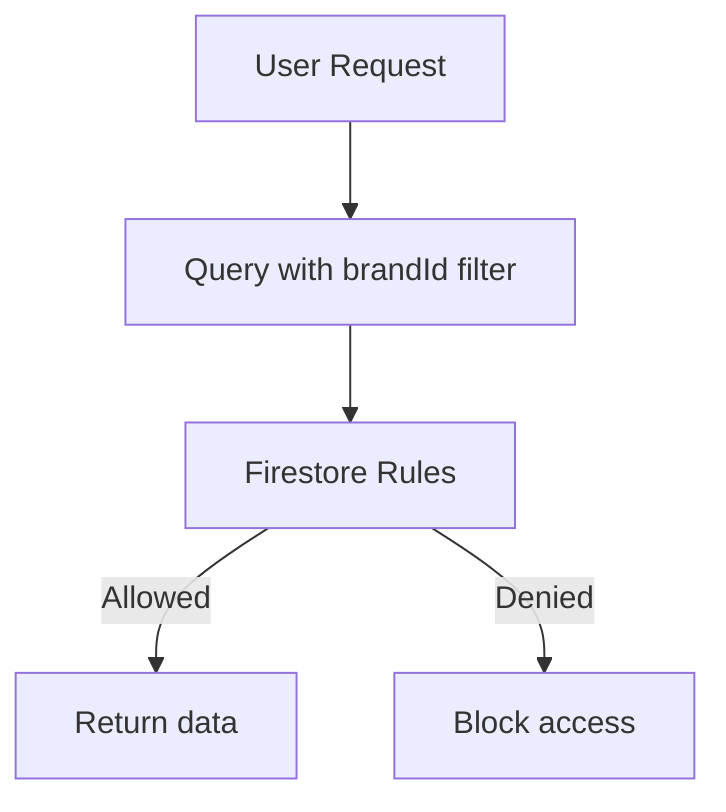
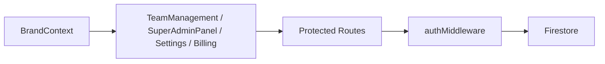

# User Permissions and Access Control

<cite>
**Referenced Files in This Document**
- [authMiddleware.js](file://server/middleware/authMiddleware.js)
- [index.js](file://server/index.js)
- [BrandContext.jsx](file://client/src/context/BrandContext.jsx)
- [TeamManagement.jsx](file://client/src/components/TeamManagement.jsx)
- [SuperAdminPanel.jsx](file://client/src/components/Views/SuperAdminPanel.jsx)
- [SettingsView.jsx](file://client/src/components/Views/SettingsView.jsx)
- [BillingView.jsx](file://client/src/components/Views/BillingView.jsx)
- [analyticsController.js](file://server/controllers/analyticsController.js)
- [settingsController.js](file://server/controllers/settingsController.js)
- [settingsService.js](file://server/services/settingsService.js)
- [firestore.rules](file://firestore.rules)
</cite>

## Table of Contents
1. [Introduction](#introduction)
2. [Project Structure](#project-structure)
3. [Core Components](#core-components)
4. [Architecture Overview](#architecture-overview)
5. [Detailed Component Analysis](#detailed-component-analysis)
6. [Dependency Analysis](#dependency-analysis)
7. [Performance Considerations](#performance-considerations)
8. [Troubleshooting Guide](#troubleshooting-guide)
9. [Conclusion](#conclusion)

## Introduction
This document explains the user permissions and access control model implemented in the platform. It covers role-based access control (RBAC), role definitions, permission enforcement, user management workflows, and multi-brand access patterns. It also documents permission matrices for key platform features such as AI replies, bulk uploads, and advanced analytics, and provides guidance for implementing custom permission schemes and managing user access across multiple brands.

## Project Structure
The permission system spans both client-side and server-side components:
- Client-side role determination and navigation filtering are handled via the Brand Context provider.
- Server-side enforcement is performed by a role-checking middleware applied to protected routes.
- Firestore security rules provide data-level isolation by brand.
- UI components expose team management, billing, and settings views that reflect role-aware capabilities.

**Diagram sources**
- [BrandContext.jsx:21-39](file://client/src/context/BrandContext.jsx#L21-L39)
- [authMiddleware.js:6-21](file://server/middleware/authMiddleware.js#L6-L21)
- [index.js:182-191](file://server/index.js#L182-L191)
- [analyticsController.js:1-21](file://server/controllers/analyticsController.js#L1-L21)
- [settingsController.js:1-38](file://server/controllers/settingsController.js#L1-L38)
- [settingsService.js:6-24](file://server/services/settingsService.js#L6-L24)
- [firestore.rules:1-50](file://firestore.rules#L1-L50)

**Section sources**
- [BrandContext.jsx:21-39](file://client/src/context/BrandContext.jsx#L21-L39)
- [authMiddleware.js:6-21](file://server/middleware/authMiddleware.js#L6-L21)
- [index.js:182-191](file://server/index.js#L182-L191)
- [firestore.rules:1-50](file://firestore.rules#L1-L50)

## Core Components
- Role determination and multi-brand support:
  - The Brand Context sets the user’s effective role and active brand, and loads brand lists based on ownership or super-admin status.
- Role enforcement:
  - The auth middleware checks a role header against an allowed list and blocks unauthorized requests.
- Protected routes:
  - Several backend endpoints are guarded by the middleware, including analytics and settings operations.
- UI role awareness:
  - Team management displays role badges and permissions summaries.
  - Super Admin Panel exposes brand fleet actions (plan updates, suspension).
  - Settings and Billing views reflect plan limits and usage.

**Section sources**
- [BrandContext.jsx:21-39](file://client/src/context/BrandContext.jsx#L21-L39)
- [authMiddleware.js:6-21](file://server/middleware/authMiddleware.js#L6-L21)
- [index.js:182-191](file://server/index.js#L182-L191)
- [TeamManagement.jsx:64-82](file://client/src/components/TeamManagement.jsx#L64-L82)
- [SuperAdminPanel.jsx:494-500](file://client/src/components/Views/SuperAdminPanel.jsx#L494-L500)
- [SettingsView.jsx:182-196](file://client/src/components/Views/SettingsView.jsx#L182-L196)
- [BillingView.jsx:99-118](file://client/src/components/Views/BillingView.jsx#L99-L118)

## Architecture Overview
The RBAC architecture combines client-side role inference, server-side enforcement, and Firestore data isolation:

**Diagram sources**
- [BrandContext.jsx:62-75](file://client/src/context/BrandContext.jsx#L62-L75)
- [authMiddleware.js:6-21](file://server/middleware/authMiddleware.js#L6-L21)
- [index.js:182-191](file://server/index.js#L182-L191)
- [firestore.rules:1-50](file://firestore.rules#L1-L50)

## Detailed Component Analysis

### Role System and Hierarchies
- Roles inferred on the client:
  - Super-admin: special-case for a specific email; grants access to fleet-wide operations.
  - Brand owner: default role; manages a subset of brands owned by the user.
- UI role badges and summaries:
  - Team Management displays role badges and a permissions guide for Admin, Sales, Ads Manager.
- Server-side enforcement:
  - The middleware accepts an allowed roles array and compares against a role header; denies otherwise.

**Diagram sources**
- [BrandContext.jsx:62-75](file://client/src/context/BrandContext.jsx#L62-L75)
- [authMiddleware.js:6-21](file://server/middleware/authMiddleware.js#L6-L21)
- [index.js:182-191](file://server/index.js#L182-L191)

**Section sources**
- [BrandContext.jsx:21-39](file://client/src/context/BrandContext.jsx#L21-L39)
- [TeamManagement.jsx:64-82](file://client/src/components/TeamManagement.jsx#L64-L82)
- [authMiddleware.js:6-21](file://server/middleware/authMiddleware.js#L6-L21)

### Permission Enforcement and Protected Endpoints
- Enforced endpoints:
  - Analytics BI stats: requires admin or ads roles.
  - Automation settings: requires admin role.
- Enforcement mechanism:
  - Middleware reads a role header and compares against allowed roles; returns 403 on mismatch.

**Diagram sources**
- [authMiddleware.js:6-21](file://server/middleware/authMiddleware.js#L6-L21)
- [index.js:182-191](file://server/index.js#L182-L191)

**Section sources**
- [index.js:182-191](file://server/index.js#L182-L191)
- [authMiddleware.js:6-21](file://server/middleware/authMiddleware.js#L6-L21)

### Team Member Management and Invitation Workflows
- Team Management UI:
  - Lists members with role badges and a permissions guide.
  - Provides an “Invite Member” action.
- Invitation and access revocation:
  - The UI indicates invite capability; actual user creation and role assignment are not shown in the provided files. Implement custom claims or a dedicated user management service to persist roles and send invitations.

**Diagram sources**
- [TeamManagement.jsx:34-36](file://client/src/components/TeamManagement.jsx#L34-L36)

**Section sources**
- [TeamManagement.jsx:24-84](file://client/src/components/TeamManagement.jsx#L24-L84)

### Multi-Brand Access and Shadow Mode
- Multi-brand support:
  - Brand Context loads brands owned by the user or all brands for super-admin.
  - Provides active brand switching and fleet-level operations in the Super Admin Panel.
- Shadow mode:
  - Super Admin Panel allows viewing another brand’s dashboard as if logged in as that brand.

**Diagram sources**
- [SuperAdminPanel.jsx:125-128](file://client/src/components/Views/SuperAdminPanel.jsx#L125-L128)
- [BrandContext.jsx:226-239](file://client/src/context/BrandContext.jsx#L226-L239)

**Section sources**
- [BrandContext.jsx:21-39](file://client/src/context/BrandContext.jsx#L21-L39)
- [SuperAdminPanel.jsx:494-500](file://client/src/components/Views/SuperAdminPanel.jsx#L494-L500)

### Permission Matrix for Platform Features
The following matrix summarizes feature availability and access controls observed in the codebase:

- AI Replies
  - Controlled by plan tier and monthly limits; UI shows usage vs. limits.
  - Access: Brand owners with active plan; governed by plan limits.
- Bulk Uploads
  - UI exists for bulk stock updates; access depends on plan tier (bulk upload flag derived from plan).
- Advanced Analytics
  - BI analytics endpoint requires admin or ads roles.
- Settings and Automation Controls
  - Requires admin role; includes toggles for AI features and global automation settings.

**Diagram sources**
- [BrandContext.jsx:105-105](file://client/src/context/BrandContext.jsx#L105-L105)
- [BillingView.jsx:99-118](file://client/src/components/Views/BillingView.jsx#L99-L118)
- [SettingsView.jsx:182-196](file://client/src/components/Views/SettingsView.jsx#L182-L196)
- [index.js:184-191](file://server/index.js#L184-L191)

**Section sources**
- [BrandContext.jsx:105-105](file://client/src/context/BrandContext.jsx#L105-L105)
- [BillingView.jsx:99-118](file://client/src/components/Views/BillingView.jsx#L99-L118)
- [SettingsView.jsx:182-196](file://client/src/components/Views/SettingsView.jsx#L182-L196)
- [index.js:184-191](file://server/index.js#L184-L191)

### Data Isolation and Security Best Practices
- Firestore rules enforce brand-level scoping:
  - Documents include a brandId field; rules permit access based on brand membership.
- Recommendations:
  - Enforce role-based access at the API level using custom claims.
  - Store user roles in Firestore and derive allowedRoles dynamically.
  - Scope all queries to the active brandId.
  - Audit sensitive operations with logs.

**Diagram sources**
- [firestore.rules:4-9](file://firestore.rules#L4-L9)
- [firestore.rules:15-43](file://firestore.rules#L15-L43)

**Section sources**
- [firestore.rules:1-50](file://firestore.rules#L1-L50)

## Dependency Analysis
- Client-side:
  - BrandContext determines role and brand context; UI components render role-aware views.
- Server-side:
  - Routes delegate to controllers; auth middleware enforces roles; services encapsulate business logic.
- Data:
  - Firestore rules enforce brand scoping; backend routes rely on brandId fields.

**Diagram sources**
- [BrandContext.jsx:226-239](file://client/src/context/BrandContext.jsx#L226-L239)
- [index.js:182-191](file://server/index.js#L182-L191)
- [authMiddleware.js:6-21](file://server/middleware/authMiddleware.js#L6-L21)
- [firestore.rules:1-50](file://firestore.rules#L1-L50)

**Section sources**
- [BrandContext.jsx:226-239](file://client/src/context/BrandContext.jsx#L226-L239)
- [index.js:182-191](file://server/index.js#L182-L191)
- [authMiddleware.js:6-21](file://server/middleware/authMiddleware.js#L6-L21)
- [firestore.rules:1-50](file://firestore.rules#L1-L50)

## Performance Considerations
- Role checks are lightweight middleware; keep allowedRoles minimal and static per route.
- Use Firestore composite indexes for brandId queries to avoid scanning.
- Cache frequently accessed plan and usage data in the client to reduce round trips.

## Troubleshooting Guide
- Access Denied errors:
  - Verify the x-user-role header matches allowedRoles for the route.
  - Confirm the user’s role in BrandContext and that the active brandId is set.
- Unexpected role behavior:
  - Super-admin is hard-coded for a specific email; adjust BrandContext logic to use custom claims or Firestore user roles.
- Data visibility issues:
  - Ensure brandId is present on documents and queries; confirm Firestore rules allow access.

**Section sources**
- [authMiddleware.js:6-21](file://server/middleware/authMiddleware.js#L6-L21)
- [BrandContext.jsx:21-39](file://client/src/context/BrandContext.jsx#L21-L39)
- [firestore.rules:4-9](file://firestore.rules#L4-L9)

## Conclusion
The platform implements a practical RBAC model combining client-side role inference, server-side middleware enforcement, and Firestore data isolation. Roles include brand owners and super-admins, with UI components reflecting role-aware capabilities. To strengthen the system, integrate custom claims for dynamic roles, centralize user management, and apply stricter access controls for sensitive endpoints. The permission matrix and workflows documented here provide a foundation for extending the system with custom roles and multi-brand governance.