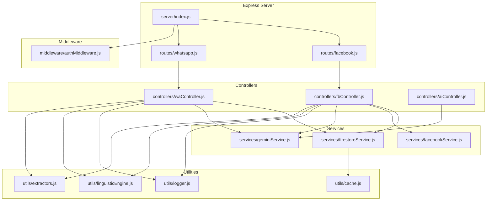
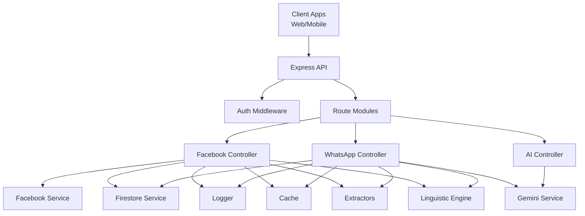
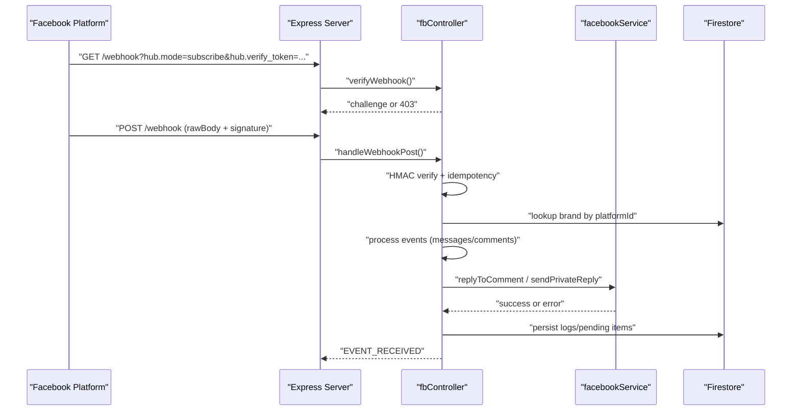
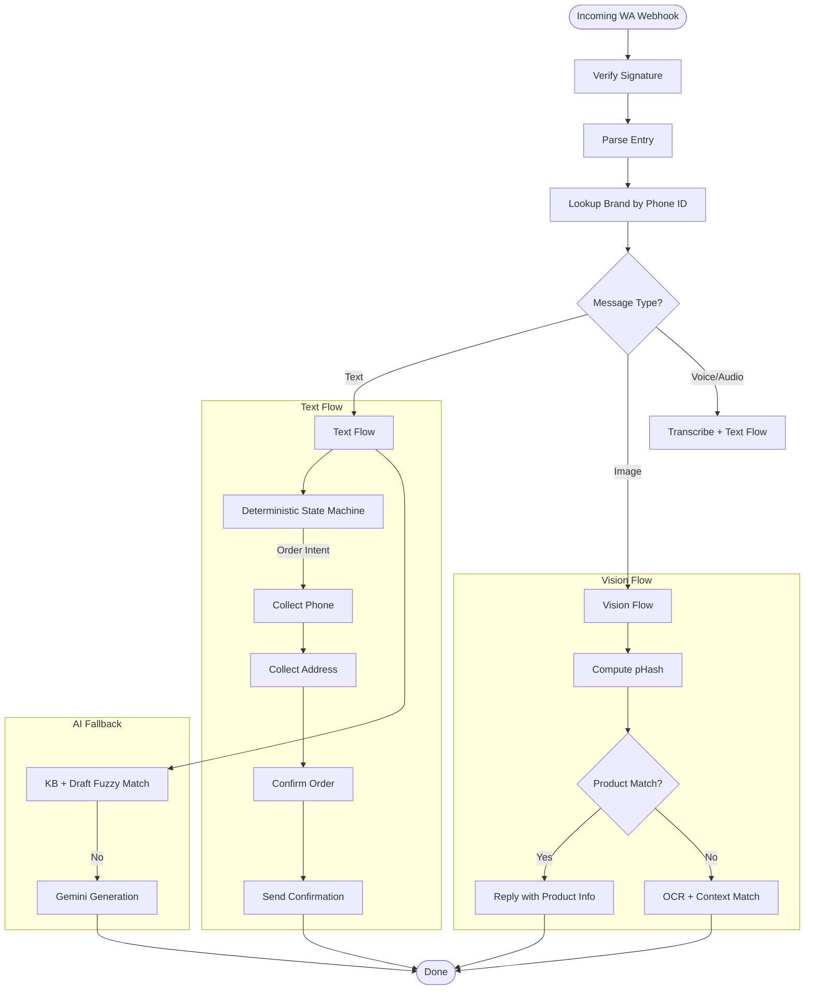
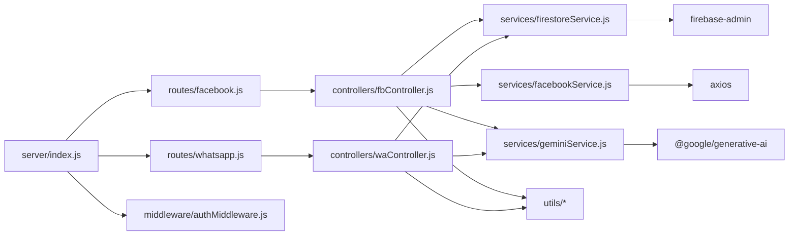

# Backend Services

<cite>
**Referenced Files in This Document**
- [index.js](file://server/index.js)
- [fbController.js](file://server/controllers/fbController.js)
- [waController.js](file://server/controllers/waController.js)
- [authMiddleware.js](file://server/middleware/authMiddleware.js)
- [facebookService.js](file://server/services/facebookService.js)
- [firestoreService.js](file://server/services/firestoreService.js)
- [geminiService.js](file://server/services/geminiService.js)
- [facebook.js](file://server/routes/facebook.js)
- [whatsapp.js](file://server/routes/whatsapp.js)
- [logger.js](file://server/utils/logger.js)
- [cache.js](file://server/utils/cache.js)
- [linguisticEngine.js](file://server/utils/linguisticEngine.js)
- [extractors.js](file://server/utils/extractors.js)
- [aiController.js](file://server/controllers/aiController.js)
</cite>

## Table of Contents
1. [Introduction](#introduction)
2. [Project Structure](#project-structure)
3. [Core Components](#core-components)
4. [Architecture Overview](#architecture-overview)
5. [Detailed Component Analysis](#detailed-component-analysis)
6. [Dependency Analysis](#dependency-analysis)
7. [Performance Considerations](#performance-considerations)
8. [Troubleshooting Guide](#troubleshooting-guide)
9. [Conclusion](#conclusion)
10. [Appendices](#appendices)

## Introduction
This document describes the backend services powering the Express.js modular API. It explains the controller-service pattern, API endpoint structure, middleware configuration, and error handling strategies. It covers Facebook and WhatsApp integration controllers, authentication middleware, service layer abstractions, webhook processing workflows, message delivery mechanisms, real-time communication patterns, Google Gemini AI integration, database service layer, and cross-platform synchronization. Guidance is also provided for extending the service architecture, adding new platform integrations, and maintaining service isolation through microservice patterns.

## Project Structure
The backend is organized around a modular Express server with:
- Routes grouped by domain (Facebook, WhatsApp, AI, Products, Ads, CRM)
- Controllers implementing platform-specific logic and orchestration
- Services encapsulating external API calls and shared utilities
- Middleware for authentication and authorization
- Utilities for logging, caching, linguistic processing, and data extraction

**Diagram sources**
- [index.js:1-203](file://server/index.js#L1-L203)
- [facebook.js:1-42](file://server/routes/facebook.js#L1-L42)
- [whatsapp.js:1-15](file://server/routes/whatsapp.js#L1-L15)
- [fbController.js:1-800](file://server/controllers/fbController.js#L1-L800)
- [waController.js:1-680](file://server/controllers/waController.js#L1-L680)
- [aiController.js:1-167](file://server/controllers/aiController.js#L1-L167)
- [firestoreService.js:1-126](file://server/services/firestoreService.js#L1-L126)
- [facebookService.js:1-287](file://server/services/facebookService.js#L1-L287)
- [geminiService.js:1-35](file://server/services/geminiService.js#L1-L35)
- [authMiddleware.js:1-26](file://server/middleware/authMiddleware.js#L1-L26)
- [logger.js:1-10](file://server/utils/logger.js#L1-L10)
- [cache.js:1-45](file://server/utils/cache.js#L1-L45)
- [linguisticEngine.js:1-144](file://server/utils/linguisticEngine.js#L1-L144)
- [extractors.js:1-154](file://server/utils/extractors.js#L1-L154)

**Section sources**
- [index.js:1-203](file://server/index.js#L1-L203)
- [facebook.js:1-42](file://server/routes/facebook.js#L1-L42)
- [whatsapp.js:1-15](file://server/routes/whatsapp.js#L1-L15)

## Core Components
- Express server bootstrap and middleware stack
- Route registration for Facebook, WhatsApp, AI, and other domains
- Health checks for tokens and webhooks
- Authentication middleware enforcing role-based access
- Controllers for Facebook and WhatsApp webhooks and dashboards
- Service layer for Firestore, Facebook Graph API, and Gemini AI
- Utilities for logging, caching, linguistic normalization, and data extraction

**Section sources**
- [index.js:1-203](file://server/index.js#L1-L203)
- [authMiddleware.js:1-26](file://server/middleware/authMiddleware.js#L1-L26)
- [firestoreService.js:1-126](file://server/services/firestoreService.js#L1-L126)
- [facebookService.js:1-287](file://server/services/facebookService.js#L1-L287)
- [geminiService.js:1-35](file://server/services/geminiService.js#L1-L35)
- [logger.js:1-10](file://server/utils/logger.js#L1-L10)
- [cache.js:1-45](file://server/utils/cache.js#L1-L45)
- [linguisticEngine.js:1-144](file://server/utils/linguisticEngine.js#L1-L144)
- [extractors.js:1-154](file://server/utils/extractors.js#L1-L154)

## Architecture Overview
The system follows a layered architecture:
- HTTP Layer: Express routes and controllers
- Service Abstraction: Encapsulated external API calls and data access
- Persistence: Firestore-backed models and caches
- Intelligence: Gemini AI for generation and vision
- Utilities: Logging, caching, linguistic normalization, and extractors

**Diagram sources**
- [index.js:1-203](file://server/index.js#L1-L203)
- [facebook.js:1-42](file://server/routes/facebook.js#L1-L42)
- [whatsapp.js:1-15](file://server/routes/whatsapp.js#L1-L15)
- [fbController.js:1-800](file://server/controllers/fbController.js#L1-L800)
- [waController.js:1-680](file://server/controllers/waController.js#L1-L680)
- [aiController.js:1-167](file://server/controllers/aiController.js#L1-L167)
- [facebookService.js:1-287](file://server/services/facebookService.js#L1-L287)
- [geminiService.js:1-35](file://server/services/geminiService.js#L1-L35)
- [firestoreService.js:1-126](file://server/services/firestoreService.js#L1-L126)
- [logger.js:1-10](file://server/utils/logger.js#L1-L10)
- [cache.js:1-45](file://server/utils/cache.js#L1-L45)
- [linguisticEngine.js:1-144](file://server/utils/linguisticEngine.js#L1-L144)
- [extractors.js:1-154](file://server/utils/extractors.js#L1-L154)

## Detailed Component Analysis

### Express Server and Routing
- Global middleware: CORS, JSON body parser with raw body capture, request logging
- Health endpoints: token validity, webhook subscription status, automation readiness
- Route mounting under /api for Vercel compatibility
- Role-based protected endpoints for admin/ads roles

**Section sources**
- [index.js:1-203](file://server/index.js#L1-L203)
- [facebook.js:1-42](file://server/routes/facebook.js#L1-L42)
- [whatsapp.js:1-15](file://server/routes/whatsapp.js#L1-L15)
- [authMiddleware.js:1-26](file://server/middleware/authMiddleware.js#L1-L26)

### Facebook Integration Controller
Responsibilities:
- Webhook verification and payload handling
- HMAC signature validation
- Idempotency checks to prevent duplicate processing
- Multi-message accumulation and echo handling
- Inbox automation: system replies, AI fallback, human handoff
- Comment processing: spam filtering, auto-like, lead capture, duplicate prevention
- Retry wrapper for rate-limited or transient errors
- Timeout safeguards with fallback persistence
- Token health monitoring and status updates

**Diagram sources**
- [index.js:39-42](file://server/index.js#L39-L42)
- [fbController.js:155-323](file://server/controllers/fbController.js#L155-L323)
- [facebookService.js:54-106](file://server/services/facebookService.js#L54-L106)
- [firestoreService.js:56-114](file://server/services/firestoreService.js#L56-L114)

**Section sources**
- [fbController.js:1-800](file://server/controllers/fbController.js#L1-L800)
- [facebookService.js:1-287](file://server/services/facebookService.js#L1-L287)
- [firestoreService.js:1-126](file://server/services/firestoreService.js#L1-L126)

### WhatsApp Integration Controller
Responsibilities:
- Webhook verification and signature validation
- Deterministic state machine for order flow (phone, address, confirmation)
- Lead capture via phone number and address extraction
- Knowledge base and fuzzy matching for approved drafts
- AI fallback using Gemini
- Image/media handling with OCR and product fingerprinting
- Outgoing message delivery and read receipts
- Cross-platform conversation linking by phone number

**Diagram sources**
- [waController.js:28-167](file://server/controllers/waController.js#L28-L167)
- [waController.js:462-541](file://server/controllers/waController.js#L462-L541)
- [waController.js:608-660](file://server/controllers/waController.js#L608-L660)
- [geminiService.js:1-35](file://server/services/geminiService.js#L1-L35)
- [extractors.js:1-154](file://server/utils/extractors.js#L1-L154)

**Section sources**
- [waController.js:1-680](file://server/controllers/waController.js#L1-L680)
- [geminiService.js:1-35](file://server/services/geminiService.js#L1-L35)
- [extractors.js:1-154](file://server/utils/extractors.js#L1-L154)

### Authentication Middleware
- Role enforcement via a custom header or default admin
- Access denied responses with clear error messages
- Used to protect sensitive endpoints (analytics, retention, settings)

**Section sources**
- [authMiddleware.js:1-26](file://server/middleware/authMiddleware.js#L1-L26)
- [index.js:182-191](file://server/index.js#L182-L191)

### Service Layer Abstractions

#### Firestore Service
- Initializes Firebase Admin SDK from environment or file
- Provides brand lookup by platform identifiers with caching
- Exposes Firestore client and helpers

**Section sources**
- [firestoreService.js:1-126](file://server/services/firestoreService.js#L1-L126)
- [cache.js:1-45](file://server/utils/cache.js#L1-L45)

#### Facebook Service
- Encapsulates Graph API calls for profiles, messages, comments, likes, posts
- Centralized error classification and logging
- Delivery helpers for templates and media

**Section sources**
- [facebookService.js:1-287](file://server/services/facebookService.js#L1-L287)

#### Gemini Service
- Dynamic model initialization with API key validation
- Vision model support
- Enforces missing key conditions

**Section sources**
- [geminiService.js:1-35](file://server/services/geminiService.js#L1-L35)

### Utilities
- Logger: ISO-formatted timestamps for server logs
- Cache: In-memory cache with TTL
- Linguistic Engine: Phonetic normalization, noise cleaning, keyword mapping
- Extractors: Phone number, address signals, intent detection, sentiment

**Section sources**
- [logger.js:1-10](file://server/utils/logger.js#L1-L10)
- [cache.js:1-45](file://server/utils/cache.js#L1-L45)
- [linguisticEngine.js:1-144](file://server/utils/linguisticEngine.js#L1-L144)
- [extractors.js:1-154](file://server/utils/extractors.js#L1-L154)

### AI Controller
- Generates linguistic variations for training
- Discovers knowledge gaps and suggests answers
- Trains AI assistant with brand-specific blueprints
- Uses default Gemini model for generation

**Section sources**
- [aiController.js:1-167](file://server/controllers/aiController.js#L1-L167)
- [geminiService.js:1-35](file://server/services/geminiService.js#L1-L35)

## Dependency Analysis

**Diagram sources**
- [index.js:1-203](file://server/index.js#L1-L203)
- [facebook.js:1-42](file://server/routes/facebook.js#L1-L42)
- [whatsapp.js:1-15](file://server/routes/whatsapp.js#L1-L15)
- [fbController.js:1-800](file://server/controllers/fbController.js#L1-L800)
- [waController.js:1-680](file://server/controllers/waController.js#L1-L680)
- [firestoreService.js:1-126](file://server/services/firestoreService.js#L1-L126)
- [facebookService.js:1-287](file://server/services/facebookService.js#L1-L287)
- [geminiService.js:1-35](file://server/services/geminiService.js#L1-L35)

**Section sources**
- [index.js:1-203](file://server/index.js#L1-L203)
- [facebook.js:1-42](file://server/routes/facebook.js#L1-L42)
- [whatsapp.js:1-15](file://server/routes/whatsapp.js#L1-L15)
- [fbController.js:1-800](file://server/controllers/fbController.js#L1-L800)
- [waController.js:1-680](file://server/controllers/waController.js#L1-L680)
- [firestoreService.js:1-126](file://server/services/firestoreService.js#L1-L126)
- [facebookService.js:1-287](file://server/services/facebookService.js#L1-L287)
- [geminiService.js:1-35](file://server/services/geminiService.js#L1-L35)

## Performance Considerations
- Idempotency and deduplication reduce redundant processing and improve reliability
- In-memory and Firestore-based duplicate tracking prevents race conditions
- Retry with exponential backoff mitigates transient failures and rate limits
- Timeout guards with fallback persistence ensure graceful degradation
- Caching brand lookups reduces latency and external calls
- Deterministic flows and fuzzy matching minimize LLM usage while preserving accuracy
- Batched operations and parallel fetches (e.g., automation health report) optimize throughput

[No sources needed since this section provides general guidance]

## Troubleshooting Guide
Common areas to inspect:
- Webhook signature mismatches and missing APP_SECRET configurations
- Token expiration and invalidation flags in Firestore
- Rate-limit and permission errors from Facebook Graph API
- Missing or misconfigured Gemini API keys
- Brand lookup failures and fallback logic
- Health check endpoints for token/webhook status diagnostics

Operational checks:
- Use health endpoints to validate token validity and webhook subscriptions
- Inspect logs for API classifications and error codes
- Verify brand records and platform IDs in Firestore
- Confirm environment variables for secrets and IDs

**Section sources**
- [fbController.js:155-323](file://server/controllers/fbController.js#L155-L323)
- [facebookService.js:17-52](file://server/services/facebookService.js#L17-L52)
- [geminiService.js:8-18](file://server/services/geminiService.js#L8-L18)
- [firestoreService.js:56-114](file://server/services/firestoreService.js#L56-L114)
- [index.js:51-124](file://server/index.js#L51-L124)

## Conclusion
The backend employs a robust controller-service pattern with clear separation of concerns. Facebook and WhatsApp integrations are implemented with strong safety nets: idempotency, retries, timeouts, and comprehensive error handling. The service layer abstracts external dependencies, while utilities provide linguistic normalization and data extraction. The modular architecture supports extension and maintains isolation suitable for microservice-style evolution.

[No sources needed since this section summarizes without analyzing specific files]

## Appendices

### API Endpoint Reference
- GET /api/status
- GET /api/ping
- GET /api/health/token
- GET /api/health/webhook
- GET /api/health/automation
- GET /api/search
- GET /api/retention/stats (admin)
- POST /api/retention/trigger (admin)
- GET /api/analytics/bi (admin, ads)
- GET /api/analytics/persona-metrics (admin, ads)
- GET /api/settings/automation (admin)
- POST /api/settings/automation (admin)
- POST /api/settings/automation/disable-all (admin)
- GET /webhook and POST /webhook (Facebook)
- GET /api/webhook (Facebook)
- GET /api/webhook/whatsapp and POST /api/webhook/whatsapp (WhatsApp)
- POST /api/whatsapp/send (WhatsApp dashboard)
- POST /api/brands/:brandId/index-products (Facebook)
- POST /api/brands/:brandId/posts/:postId (Facebook)
- POST /api/ai/generate-comment-variations (AI)
- POST /api/ai/hide-comment (Facebook)

**Section sources**
- [index.js:38-192](file://server/index.js#L38-L192)
- [facebook.js:1-42](file://server/routes/facebook.js#L1-L42)
- [whatsapp.js:1-15](file://server/routes/whatsapp.js#L1-L15)

### Extending the Service Architecture
- Add a new route module under server/routes/
- Implement a controller under server/controllers/
- Create or reuse a service under server/services/
- Integrate with existing middleware and utilities
- Add health checks and logging
- Maintain idempotency and error classification patterns

[No sources needed since this section provides general guidance]