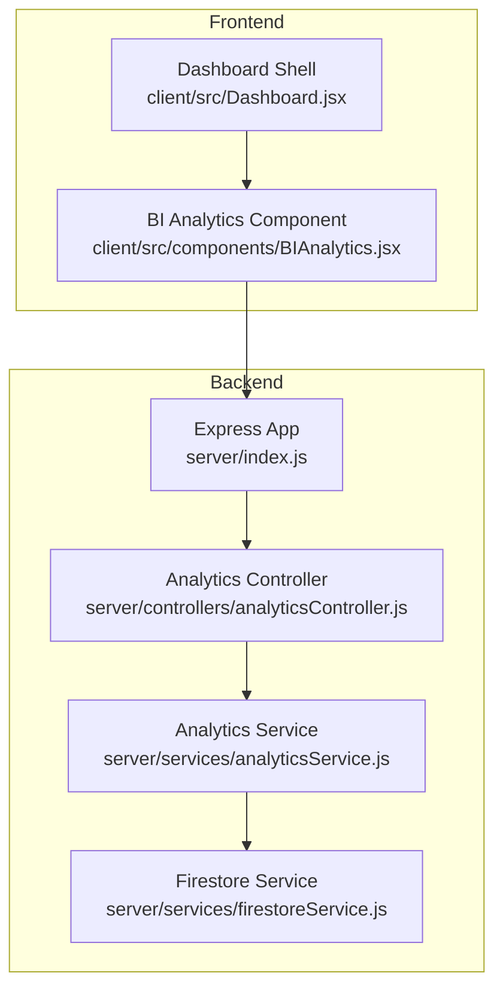
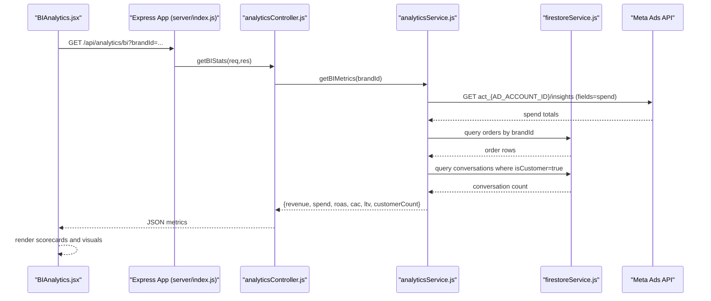
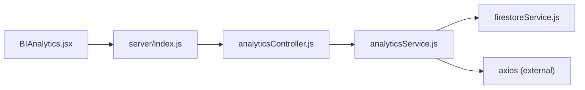

# Analytics Dashboard

<cite>
**Referenced Files in This Document**
- [server/index.js](file://server/index.js)
- [server/controllers/analyticsController.js](file://server/controllers/analyticsController.js)
- [server/services/analyticsService.js](file://server/services/analyticsService.js)
- [server/services/firestoreService.js](file://server/services/firestoreService.js)
- [client/src/components/BIAnalytics.jsx](file://client/src/components/BIAnalytics.jsx)
- [client/src/Dashboard.jsx](file://client/src/Dashboard.jsx)
</cite>

## Table of Contents
1. [Introduction](#introduction)
2. [Project Structure](#project-structure)
3. [Core Components](#core-components)
4. [Architecture Overview](#architecture-overview)
5. [Detailed Component Analysis](#detailed-component-analysis)
6. [Dependency Analysis](#dependency-analysis)
7. [Performance Considerations](#performance-considerations)
8. [Troubleshooting Guide](#troubleshooting-guide)
9. [Conclusion](#conclusion)
10. [Appendices](#appendices)

## Introduction
This document describes the analytics dashboard implementation for collecting business intelligence (BI) metrics, aggregating data from multiple sources, and rendering actionable visualizations. It covers:
- Backend analytics controller and service logic for computing revenue, ad spend, ROAS, CAC, LTV, and customer counts
- Frontend analytics component integration, real-time data fetching, and chart-like visual rendering
- Business KPIs, conversion metrics, customer acquisition costs, and revenue analytics
- Dashboard customization, metric filtering, time range selection, and export functionality
- Guidance on interpreting analytics data, identifying trends, and making data-driven decisions

## Project Structure
The analytics dashboard spans backend and frontend modules:
- Backend: Express routes and controllers expose analytics endpoints; services query Firestore and external APIs
- Frontend: A dedicated BI analytics component fetches metrics and renders scorecards and visual breakdowns

**Diagram sources**
- [server/index.js:175-184](file://server/index.js#L175-L184)
- [server/controllers/analyticsController.js:1-21](file://server/controllers/analyticsController.js#L1-L21)
- [server/services/analyticsService.js:1-81](file://server/services/analyticsService.js#L1-L81)
- [server/services/firestoreService.js:1-126](file://server/services/firestoreService.js#L1-L126)
- [client/src/components/BIAnalytics.jsx:1-170](file://client/src/components/BIAnalytics.jsx#L1-L170)
- [client/src/Dashboard.jsx:116-800](file://client/src/Dashboard.jsx#L116-L800)

**Section sources**
- [server/index.js:175-184](file://server/index.js#L175-L184)
- [client/src/Dashboard.jsx:116-800](file://client/src/Dashboard.jsx#L116-L800)

## Core Components
- Analytics Controller: Validates brandId and delegates to service; returns computed metrics or error
- Analytics Service: Aggregates revenue from orders, ad spend from Meta Ads API, and computes ROAS, CAC, LTV, and customer count
- Firestore Service: Provides Firestore client and brand lookup utilities
- BI Analytics Component: Fetches metrics via GET /api/analytics/bi, renders scorecards and visual breakdowns

Key metrics exposed:
- Total Revenue
- Ad Spend
- Real ROAS (Revenue per Ad Spend)
- Unit CAC (Customer Acquisition Cost)
- LTV (Lifetime Value)
- Active Customer Count

**Section sources**
- [server/controllers/analyticsController.js:1-21](file://server/controllers/analyticsController.js#L1-L21)
- [server/services/analyticsService.js:54-76](file://server/services/analyticsService.js#L54-L76)
- [server/services/firestoreService.js:53](file://server/services/firestoreService.js#L53)
- [client/src/components/BIAnalytics.jsx:4-29](file://client/src/components/BIAnalytics.jsx#L4-L29)

## Architecture Overview
The analytics pipeline follows a clear separation of concerns:
- Route registration exposes /api/analytics/bi protected by role checks
- Controller validates inputs and invokes service
- Service performs data aggregation from Firestore and Meta Ads API
- Frontend component requests metrics and renders cards and gauges

**Diagram sources**
- [server/index.js:184](file://server/index.js#L184)
- [server/controllers/analyticsController.js:3-17](file://server/controllers/analyticsController.js#L3-L17)
- [server/services/analyticsService.js:7-28](file://server/services/analyticsService.js#L7-L28)
- [server/services/analyticsService.js:33-49](file://server/services/analyticsService.js#L33-L49)
- [server/services/analyticsService.js:58-62](file://server/services/analyticsService.js#L58-L62)
- [server/services/analyticsService.js:64-75](file://server/services/analyticsService.js#L64-L75)
- [server/services/firestoreService.js:53](file://server/services/firestoreService.js#L53)
- [client/src/components/BIAnalytics.jsx:16-29](file://client/src/components/BIAnalytics.jsx#L16-L29)

## Detailed Component Analysis

### Backend Analytics Controller
Responsibilities:
- Extract brandId from query parameters
- Validate presence of brandId
- Invoke service to compute metrics
- Return JSON response or error

Behavior:
- On missing brandId, responds with 400 and error message
- On service errors, logs and returns 500 with error message

**Section sources**
- [server/controllers/analyticsController.js:1-21](file://server/controllers/analyticsController.js#L1-L21)

### Backend Analytics Service
Responsibilities:
- Retrieve ad spend from Meta Ads API using configured account and token
- Aggregate sales revenue from Firestore orders filtered by brandId
- Count customers by counting conversations marked as customer
- Compute derived metrics:
  - ROAS = revenue / spend (0 if spend is zero)
  - CAC = spend / customerCount (0 if customerCount is zero)
  - LTV = revenue / customerCount (0 if customerCount is zero)

Data sources:
- Meta Ads API: https://graph.facebook.com/v21.0/act_{AD_ACCOUNT_ID}/insights
- Firestore collections:
  - orders: brandId filter, totalAmount accumulation
  - conversations: isCustomer filter, size as customerCount

Notes:
- Ad spend aggregation sums daily spend over the requested date preset
- Revenue aggregation sums totalAmount across orders
- Customer count uses conversation collection size where isCustomer is true

**Section sources**
- [server/services/analyticsService.js:7-28](file://server/services/analyticsService.js#L7-L28)
- [server/services/analyticsService.js:33-49](file://server/services/analyticsService.js#L33-L49)
- [server/services/analyticsService.js:58-62](file://server/services/analyticsService.js#L58-L62)
- [server/services/analyticsService.js:64-75](file://server/services/analyticsService.js#L64-L75)

### Frontend BI Analytics Component
Responsibilities:
- Fetch metrics from backend endpoint on mount and when activeBrandId changes
- Render:
  - Four main metric cards: Total Revenue, Ad Spend, Real ROAS, Unit CAC
  - LTV distribution visualization with progress segments
  - Growth efficiency gauge with comparative commentary
- Provide loading state and error logging

Data flow:
- Uses VITE_API_URL environment variable for base URL
- Calls GET /api/analytics/bi?brandId={activeBrandId}
- Updates local state with returned metrics

UI highlights:
- Metric cards include icons, units, and trend indicators
- LTV visualization shows average LTV and active customer count
- Efficiency gauge displays ROAS and comparative benchmark text
- “Generate BI Report” button placeholder for export/report generation

**Section sources**
- [client/src/components/BIAnalytics.jsx:4-29](file://client/src/components/BIAnalytics.jsx#L4-L29)
- [client/src/components/BIAnalytics.jsx:74-112](file://client/src/components/BIAnalytics.jsx#L74-L112)
- [client/src/components/BIAnalytics.jsx:114-164](file://client/src/components/BIAnalytics.jsx#L114-L164)

### Dashboard Integration
The BI analytics component is integrated into the main dashboard shell. The dashboard manages navigation, branding context, and theme preferences. The BI component receives activeBrandId from context and uses it to fetch metrics.

**Section sources**
- [client/src/Dashboard.jsx:116-800](file://client/src/Dashboard.jsx#L116-L800)
- [client/src/components/BIAnalytics.jsx:4](file://client/src/components/BIAnalytics.jsx#L4)

## Dependency Analysis
- Route binding: /api/analytics/bi is registered in the Express app and protected by role middleware
- Controller depends on service module
- Service depends on Firestore service and axios for Meta Ads API
- Frontend component depends on environment configuration and fetch API

**Diagram sources**
- [server/index.js:175-184](file://server/index.js#L175-L184)
- [server/controllers/analyticsController.js:1](file://server/controllers/analyticsController.js#L1)
- [server/services/analyticsService.js:1-3](file://server/services/analyticsService.js#L1-L3)
- [server/services/firestoreService.js:53](file://server/services/firestoreService.js#L53)
- [client/src/components/BIAnalytics.jsx:5](file://client/src/components/BIAnalytics.jsx#L5)

**Section sources**
- [server/index.js:175-184](file://server/index.js#L175-L184)
- [server/controllers/analyticsController.js:1](file://server/controllers/analyticsController.js#L1)
- [server/services/analyticsService.js:1-3](file://server/services/analyticsService.js#L1-L3)
- [client/src/components/BIAnalytics.jsx:5](file://client/src/components/BIAnalytics.jsx#L5)

## Performance Considerations
- Data aggregation:
  - Ad spend query aggregates daily spend; consider caching aggregated values per brand/time-range to reduce API calls
  - Revenue and customer count queries scan collections; ensure Firestore indexes exist for brandId and isCustomer filters
- Network:
  - Meta Ads API calls are synchronous; consider batching or parallelization if extending to multiple brands/time ranges
- Rendering:
  - Frontend fetch occurs on brand change; consider debouncing rapid brand switches and adding retry/backoff logic
- Caching:
  - Firestore queries could benefit from short-lived caching for repeated reads during a session

[No sources needed since this section provides general guidance]

## Troubleshooting Guide
Common issues and resolutions:
- Missing brandId:
  - Symptom: 400 Bad Request from controller
  - Resolution: Ensure activeBrandId is passed to the BI component
- Ad spend API errors:
  - Symptom: Zero spend returned; backend logs error
  - Resolution: Verify AD_ACCOUNT_ID and PAGE_ACCESS_TOKEN environment variables; check token validity and permissions
- Revenue or customer count zero:
  - Symptom: Zero values for revenue or customerCount
  - Resolution: Confirm orders exist under brandId and conversations have isCustomer=true
- CORS or network errors:
  - Symptom: Frontend fetch fails
  - Resolution: Verify VITE_API_URL and network connectivity; ensure backend allows cross-origin requests

**Section sources**
- [server/controllers/analyticsController.js:6-8](file://server/controllers/analyticsController.js#L6-L8)
- [server/services/analyticsService.js:24-27](file://server/services/analyticsService.js#L24-L27)
- [client/src/components/BIAnalytics.jsx:18-26](file://client/src/components/BIAnalytics.jsx#L18-L26)

## Conclusion
The analytics dashboard integrates backend metrics computation with a clean frontend visualization layer. It currently focuses on core financial and customer metrics (revenue, ad spend, ROAS, CAC, LTV, customer count) and provides a foundation for richer dashboards, filtering, time range selection, and export capabilities.

## Appendices

### API Definitions
- Endpoint: GET /api/analytics/bi
- Role: admin, ads
- Query parameters:
  - brandId (required): identifier used to filter orders and derive metrics
- Response fields:
  - revenue: number
  - spend: number
  - roas: number
  - cac: number
  - ltv: number
  - customerCount: number
- Example request:
  - GET /api/analytics/bi?brandId=example-brand-id
- Example response:
  - { revenue: 10000, spend: 1200, roas: 8.33, cac: 120.00, ltv: 100.00, customerCount: 100 }

**Section sources**
- [server/index.js:184](file://server/index.js#L184)
- [server/controllers/analyticsController.js:3-17](file://server/controllers/analyticsController.js#L3-L17)
- [server/services/analyticsService.js:64-75](file://server/services/analyticsService.js#L64-L75)

### Business KPIs and Interpretation
- Revenue: Total sales attributed to the brand
- Ad Spend: Aggregated Meta Ads spend over the selected period
- ROAS: Revenue per dollar spent; higher indicates efficient advertising
- CAC: Average cost to acquire a customer; lower is favorable
- LTV: Average revenue per customer; higher indicates strong customer value
- Customer Count: Total active customers used for unit economics

Guidance:
- Compare ROAS to industry benchmarks; aim for improvement over time
- Track CAC trends; reductions often come from improved targeting or higher conversion rates
- Monitor LTV growth as an indicator of retention and upsell effectiveness
- Use customerCount to assess growth velocity and marketing efficiency

[No sources needed since this section provides general guidance]

### Dashboard Customization, Filtering, and Export
Current capabilities:
- Brand scoping via activeBrandId
- Real-time metrics refresh on brand change
- Visual breakdowns for LTV and efficiency

Future enhancements (recommended):
- Time range selection (e.g., last 7 days, last 30 days) to pass to analytics service
- Metric filtering (e.g., by channel, product category)
- Export functionality (CSV/PDF) for BI reports
- Multi-brand comparison views
- Alerts and thresholds for KPIs

[No sources needed since this section proposes future enhancements]