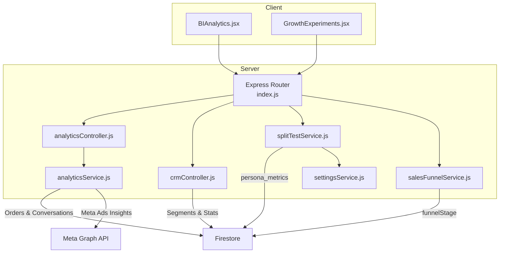
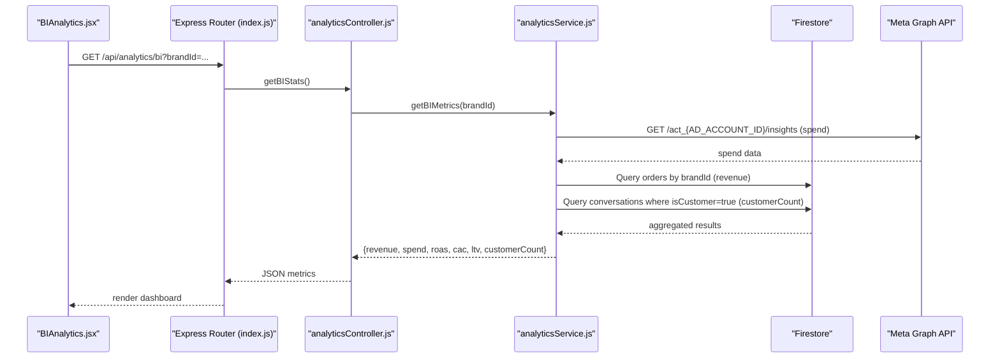
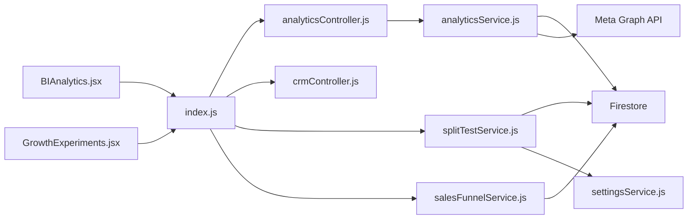
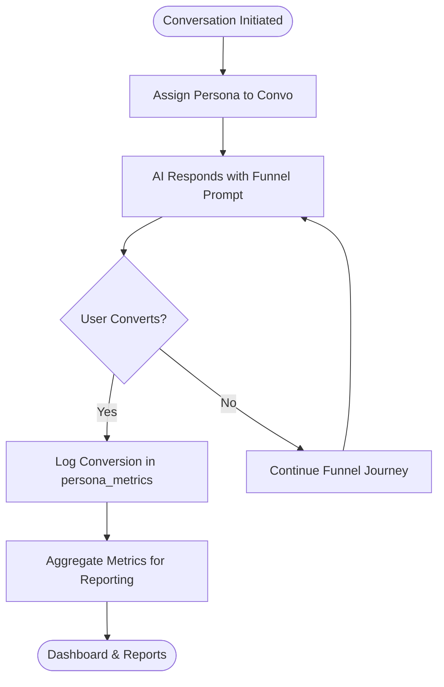

# Business Intelligence

<cite>
**Referenced Files in This Document**
- [analyticsController.js](file://server/controllers/analyticsController.js)
- [analyticsService.js](file://server/services/analyticsService.js)
- [BIAnalytics.jsx](file://client/src/components/BIAnalytics.jsx)
- [index.js](file://server/index.js)
- [splitTestService.js](file://server/services/splitTestService.js)
- [salesFunnelService.js](file://server/services/salesFunnelService.js)
- [settingsService.js](file://server/services/settingsService.js)
- [crmController.js](file://server/controllers/crmController.js)
- [GrowthExperiments.jsx](file://client/src/components/GrowthExperiments.jsx)
</cite>

## Table of Contents
1. [Introduction](#introduction)
2. [Project Structure](#project-structure)
3. [Core Components](#core-components)
4. [Architecture Overview](#architecture-overview)
5. [Detailed Component Analysis](#detailed-component-analysis)
6. [Dependency Analysis](#dependency-analysis)
7. [Performance Considerations](#performance-considerations)
8. [Troubleshooting Guide](#troubleshooting-guide)
9. [Conclusion](#conclusion)
10. [Appendices](#appendices)

## Introduction
This document provides comprehensive business intelligence documentation for analytics dashboards, performance metrics, and growth experimentation. It explains how the analytics controller integrates with backend services to compute key business metrics, how sales funnel optimization and split testing are implemented, and how frontend components visualize conversion tracking, customer insights, and business KPIs. It also outlines report generation, export functionality, and real-time performance monitoring, along with guidance for interpreting analytics data and making data-driven decisions.

## Project Structure
The business intelligence stack spans the server-side controllers and services, and the client-side visualization components. The server exposes analytics endpoints, computes metrics, and persists experiment data. The client renders dashboards and growth experiments views, and orchestrates real-time updates.

**Diagram sources**
- [index.js:184-188](file://server/index.js#L184-L188)
- [analyticsController.js:1-21](file://server/controllers/analyticsController.js#L1-L21)
- [analyticsService.js:1-81](file://server/services/analyticsService.js#L1-L81)
- [splitTestService.js:1-65](file://server/services/splitTestService.js#L1-L65)
- [salesFunnelService.js:1-61](file://server/services/salesFunnelService.js#L1-L61)
- [settingsService.js:1-74](file://server/services/settingsService.js#L1-L74)
- [crmController.js:1-78](file://server/controllers/crmController.js#L1-L78)
- [BIAnalytics.jsx:1-170](file://client/src/components/BIAnalytics.jsx#L1-L170)
- [GrowthExperiments.jsx:1-153](file://client/src/components/GrowthExperiments.jsx#L1-L153)

**Section sources**
- [index.js:184-188](file://server/index.js#L184-L188)
- [analyticsController.js:1-21](file://server/controllers/analyticsController.js#L1-L21)
- [analyticsService.js:1-81](file://server/services/analyticsService.js#L1-L81)
- [splitTestService.js:1-65](file://server/services/splitTestService.js#L1-L65)
- [salesFunnelService.js:1-61](file://server/services/salesFunnelService.js#L1-L61)
- [settingsService.js:1-74](file://server/services/settingsService.js#L1-L74)
- [crmController.js:1-78](file://server/controllers/crmController.js#L1-L78)
- [BIAnalytics.jsx:1-170](file://client/src/components/BIAnalytics.jsx#L1-L170)
- [GrowthExperiments.jsx:1-153](file://client/src/components/GrowthExperiments.jsx#L1-L153)

## Core Components
- Analytics Controller: Validates brand context and delegates metric computation to the analytics service.
- Analytics Service: Aggregates revenue from orders, counts customers from conversations, queries Meta Ads spend via the Graph API, and computes ROAS, CAC, and LTV.
- Frontend BI Dashboard: Fetches metrics and renders scorecards, LTV distribution, and growth efficiency visualization.
- Growth Experiments: Visualizes persona split test performance and autopilot funnel health.
- CRM Segmentation: Runs customer segmentation and returns distribution statistics.
- Split Testing: Assigns personas to conversations and logs conversions for analytics.
- Sales Funnel: Detects funnel stage from message context and augments AI responses to guide progression.
- Settings: Provides feature toggles for enabling/disabling split testing and related automations.

**Section sources**
- [analyticsController.js:1-21](file://server/controllers/analyticsController.js#L1-L21)
- [analyticsService.js:54-76](file://server/services/analyticsService.js#L54-L76)
- [BIAnalytics.jsx:16-29](file://client/src/components/BIAnalytics.jsx#L16-L29)
- [GrowthExperiments.jsx:4-11](file://client/src/components/GrowthExperiments.jsx#L4-L11)
- [crmController.js:9-43](file://server/controllers/crmController.js#L9-L43)
- [splitTestService.js:9-34](file://server/services/splitTestService.js#L9-L34)
- [salesFunnelService.js:13-32](file://server/services/salesFunnelService.js#L13-L32)
- [settingsService.js:42-45](file://server/services/settingsService.js#L42-L45)

## Architecture Overview
The analytics pipeline integrates frontend dashboards with backend services and external APIs. The frontend requests brand-specific metrics, the controller validates inputs, the service aggregates data from Firestore and the Meta Graph API, and returns computed KPIs to the UI.

**Diagram sources**
- [index.js:184](file://server/index.js#L184)
- [analyticsController.js:3-17](file://server/controllers/analyticsController.js#L3-L17)
- [analyticsService.js:7-28](file://server/services/analyticsService.js#L7-L28)
- [analyticsService.js:33-49](file://server/services/analyticsService.js#L33-L49)
- [analyticsService.js:58-62](file://server/services/analyticsService.js#L58-L62)
- [analyticsService.js:64-75](file://server/services/analyticsService.js#L64-L75)
- [BIAnalytics.jsx:19](file://client/src/components/BIAnalytics.jsx#L19)

## Detailed Component Analysis

### Analytics Controller
Responsibilities:
- Validates presence of brandId query parameter.
- Calls analytics service to compute business metrics.
- Handles errors and returns structured responses.

Processing logic:
- On missing brandId, responds with 400.
- On success, returns computed metrics.
- On failure, logs and returns 500.

**Section sources**
- [analyticsController.js:3-17](file://server/controllers/analyticsController.js#L3-L17)

### Analytics Service
Responsibilities:
- Retrieve ad spend from Meta Ads Insights via Graph API.
- Aggregate sales revenue from orders by brandId.
- Count customers from conversations marked as customers.
- Compute ROAS, CAC, and LTV.

Data sources:
- Meta Graph API for spend.
- Firestore collections: orders, conversations.

Complexity:
- Spend aggregation: O(n) over daily insights.
- Revenue aggregation: O(n) over orders.
- Customer count: O(n) over conversations.

Error handling:
- Returns zeros on API or DB errors and logs messages.

**Section sources**
- [analyticsService.js:7-28](file://server/services/analyticsService.js#L7-L28)
- [analyticsService.js:33-49](file://server/services/analyticsService.js#L33-L49)
- [analyticsService.js:58-62](file://server/services/analyticsService.js#L58-L62)
- [analyticsService.js:64-75](file://server/services/analyticsService.js#L64-L75)

### BI Analytics Dashboard (Frontend)
Responsibilities:
- Fetches metrics from the backend endpoint.
- Renders scorecards for revenue, spend, ROAS, and CAC.
- Visualizes LTV distribution and growth efficiency.
- Provides a placeholder action to generate a BI report.

Integration:
- Uses VITE_API_URL to target the backend.
- Re-fetches metrics when activeBrandId changes.

**Section sources**
- [BIAnalytics.jsx:5-29](file://client/src/components/BIAnalytics.jsx#L5-L29)
- [BIAnalytics.jsx:75-112](file://client/src/components/BIAnalytics.jsx#L75-L112)
- [BIAnalytics.jsx:115-164](file://client/src/components/BIAnalytics.jsx#L115-L164)

### Growth Experiments Dashboard (Frontend)
Responsibilities:
- Visualizes persona performance metrics (conversion rates).
- Shows autopilot funnel health with drop-off percentages.
- Indicates active split testing and conversion lift.

**Section sources**
- [GrowthExperiments.jsx:4-11](file://client/src/components/GrowthExperiments.jsx#L4-L11)
- [GrowthExperiments.jsx:68-95](file://client/src/components/GrowthExperiments.jsx#L68-L95)
- [GrowthExperiments.jsx:97-147](file://client/src/components/GrowthExperiments.jsx#L97-L147)

### CRM Segmentation
Responsibilities:
- Segments conversations into categories (Hot Lead, Regular Customer, Window Shopper, Returning Buyer).
- Computes segment distribution statistics for a brand.

Processing logic:
- Reads conversations by brandId.
- Applies scoring rules to assign segments.
- Commits batch updates and returns counts.

**Section sources**
- [crmController.js:9-43](file://server/controllers/crmController.js#L9-L43)
- [crmController.js:48-75](file://server/controllers/crmController.js#L48-L75)

### Split Testing Service
Responsibilities:
- Assigns a sticky persona to a conversation based on its ID.
- Logs conversions for persona analytics.

Feature gating:
- Uses settings to determine whether split testing is enabled.

**Section sources**
- [splitTestService.js:9-34](file://server/services/splitTestService.js#L9-L34)
- [splitTestService.js:39-59](file://server/services/splitTestService.js#L39-L59)
- [settingsService.js:42-45](file://server/services/settingsService.js#L42-L45)

### Sales Funnel Service
Responsibilities:
- Detects funnel stage from the latest message.
- Generates prompts to guide the user toward the next stage.

**Section sources**
- [salesFunnelService.js:13-32](file://server/services/salesFunnelService.js#L13-L32)
- [salesFunnelService.js:37-54](file://server/services/salesFunnelService.js#L37-L54)

### Settings Service
Responsibilities:
- Manages automation feature toggles.
- Provides helper to check if a feature is enabled.
- Supports emergency kill switch to disable all automations.

**Section sources**
- [settingsService.js:6-24](file://server/services/settingsService.js#L6-L24)
- [settingsService.js:42-45](file://server/services/settingsService.js#L42-L45)
- [settingsService.js:50-66](file://server/services/settingsService.js#L50-L66)

## Dependency Analysis
The analytics controller depends on the analytics service, which in turn depends on Firestore and the Meta Graph API. The frontend components depend on the Express routes exposed in the server index. Growth experiments integrate persona metrics and funnel stage data. CRM segmentation is independent and relies solely on Firestore.

**Diagram sources**
- [index.js:184-188](file://server/index.js#L184-L188)
- [analyticsController.js:1](file://server/controllers/analyticsController.js#L1)
- [analyticsService.js:1](file://server/services/analyticsService.js#L1)
- [splitTestService.js:1](file://server/services/splitTestService.js#L1)
- [salesFunnelService.js:1](file://server/services/salesFunnelService.js#L1)
- [settingsService.js:1](file://server/services/settingsService.js#L1)
- [crmController.js:1](file://server/controllers/crmController.js#L1)
- [BIAnalytics.jsx:1](file://client/src/components/BIAnalytics.jsx#L1)
- [GrowthExperiments.jsx:1](file://client/src/components/GrowthExperiments.jsx#L1)

**Section sources**
- [index.js:184-188](file://server/index.js#L184-L188)
- [analyticsController.js:1](file://server/controllers/analyticsController.js#L1)
- [analyticsService.js:1](file://server/services/analyticsService.js#L1)
- [splitTestService.js:1](file://server/services/splitTestService.js#L1)
- [salesFunnelService.js:1](file://server/services/salesFunnelService.js#L1)
- [settingsService.js:1](file://server/services/settingsService.js#L1)
- [crmController.js:1](file://server/controllers/crmController.js#L1)
- [BIAnalytics.jsx:1](file://client/src/components/BIAnalytics.jsx#L1)
- [GrowthExperiments.jsx:1](file://client/src/components/GrowthExperiments.jsx#L1)

## Performance Considerations
- API calls to the Meta Graph API should be cached or rate-limited to avoid quota exhaustion.
- Firestore queries for revenue and customer counts should be indexed by brandId and timestamps to reduce latency.
- Batch writes are used for CRM segmentation to minimize write costs and improve throughput.
- Frontend should debounce frequent re-renders and leverage memoization for large datasets.
- Consider paginating CRM segmentation jobs for very large conversation sets.

## Troubleshooting Guide
Common issues and resolutions:
- Missing brandId: Controller returns 400; ensure frontend passes brandId.
- Meta Ads API errors: Analytics service logs and returns zero spend; verify AD_ACCOUNT_ID and PAGE_ACCESS_TOKEN.
- Firestore read/write failures: Analytics service logs and returns zeros; check permissions and indexes.
- Split testing not taking effect: Verify enableSplitTesting toggle in settings; ensure persona assignment occurs before conversion logging.
- Funnel stage not updating: Ensure last message triggers detection logic; confirm conversation persistence.

**Section sources**
- [analyticsController.js:6-8](file://server/controllers/analyticsController.js#L6-L8)
- [analyticsService.js:24-27](file://server/services/analyticsService.js#L24-L27)
- [analyticsService.js:45-48](file://server/services/analyticsService.js#L45-L48)
- [splitTestService.js:30-33](file://server/services/splitTestService.js#L30-L33)
- [settingsService.js:42-45](file://server/services/settingsService.js#L42-L45)

## Conclusion
The business intelligence system integrates frontend dashboards with backend analytics services and external APIs to deliver actionable insights. The analytics controller and service provide core KPIs, while CRM segmentation, split testing, and sales funnel services support growth experimentation and optimization. The frontend components visualize conversion tracking and funnel health, enabling data-driven decision-making and continuous improvement.

## Appendices

### API Definitions
- GET /api/analytics/bi
  - Description: Returns business intelligence metrics for a brand.
  - Query parameters: brandId (required).
  - Response: { revenue, spend, roas, cac, ltv, customerCount }.
  - Access roles: admin, ads.

- POST /api/crm/segment
  - Description: Segments all conversations for a brand.
  - Request body: { brandId }.
  - Response: { success, updated }.

- GET /api/crm/stats
  - Description: Returns segment distribution stats for a brand.
  - Query parameters: brandId (required).
  - Response: { success, stats, total }.

- GET /api/analytics/persona-metrics
  - Description: Placeholder endpoint for persona metrics.
  - Query parameters: brandId (required).
  - Response: { success, metrics: [...] }.

- GET /api/settings/automation
  - Description: Retrieves automation feature toggles.
  - Response: { key: boolean, ... }.

- POST /api/settings/automation
  - Description: Updates a specific automation setting.
  - Request body: { key, value }.
  - Response: { success }.

- POST /api/settings/automation/disable-all
  - Description: Disables all automations (emergency).
  - Response: { success }.

**Section sources**
- [index.js:184-191](file://server/index.js#L184-L191)
- [crmController.js:3-7](file://server/controllers/crmController.js#L3-L7)
- [crmController.js:48-75](file://server/controllers/crmController.js#L48-L75)

### Data Flow for Conversion Tracking

**Diagram sources**
- [splitTestService.js:9-34](file://server/services/splitTestService.js#L9-L34)
- [splitTestService.js:39-59](file://server/services/splitTestService.js#L39-L59)
- [salesFunnelService.js:37-54](file://server/services/salesFunnelService.js#L37-L54)

### Interpretation and Decision-Making Guidance
- ROAS: Higher indicates efficient marketing spend; compare against industry benchmarks.
- CAC vs LTV: Aim for LTV/CAC > 3; optimize acquisition channels or customer lifetime value drivers.
- Conversion Rates by Persona: Focus on high-performing personas; scale successful messaging styles.
- Funnel Drop-offs: Investigate stages with high drop-off; refine copy, reduce friction, or add urgency.
- Segment Distribution: Target “Hot Leads” and “Returning Buyers” with personalized campaigns.