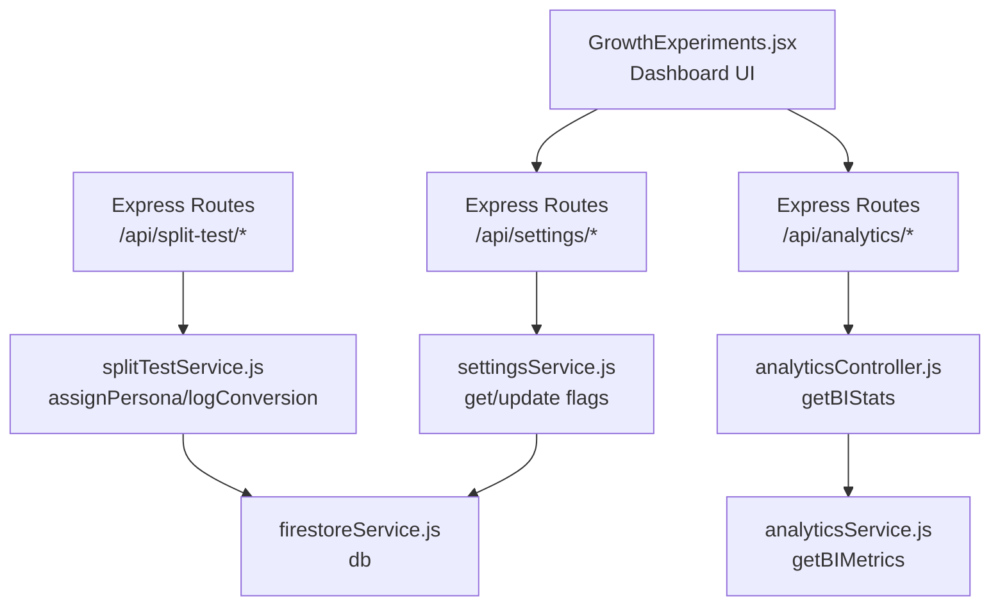
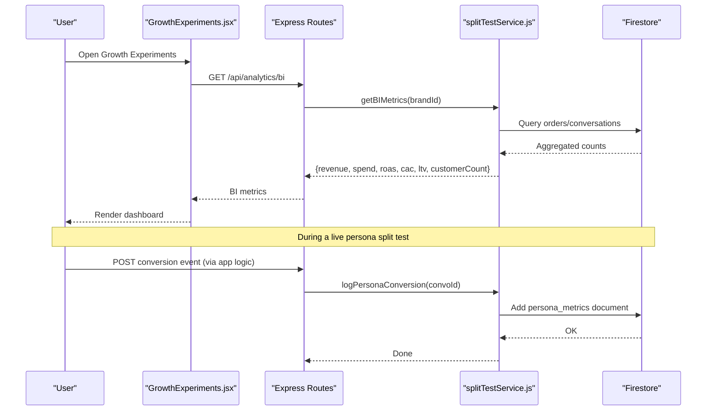
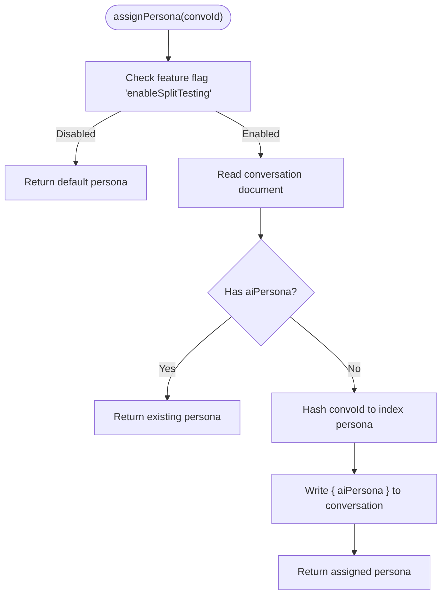
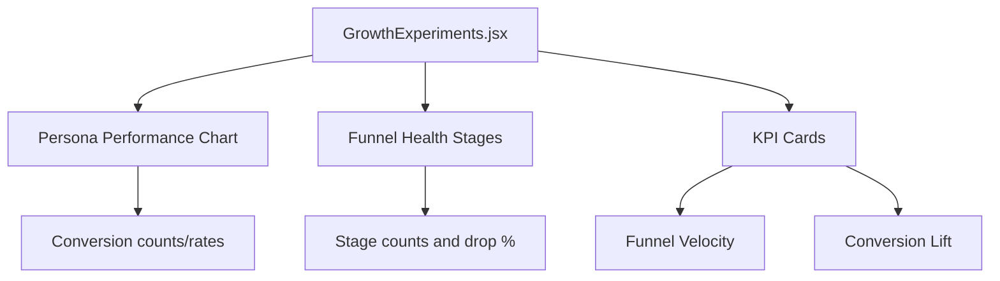
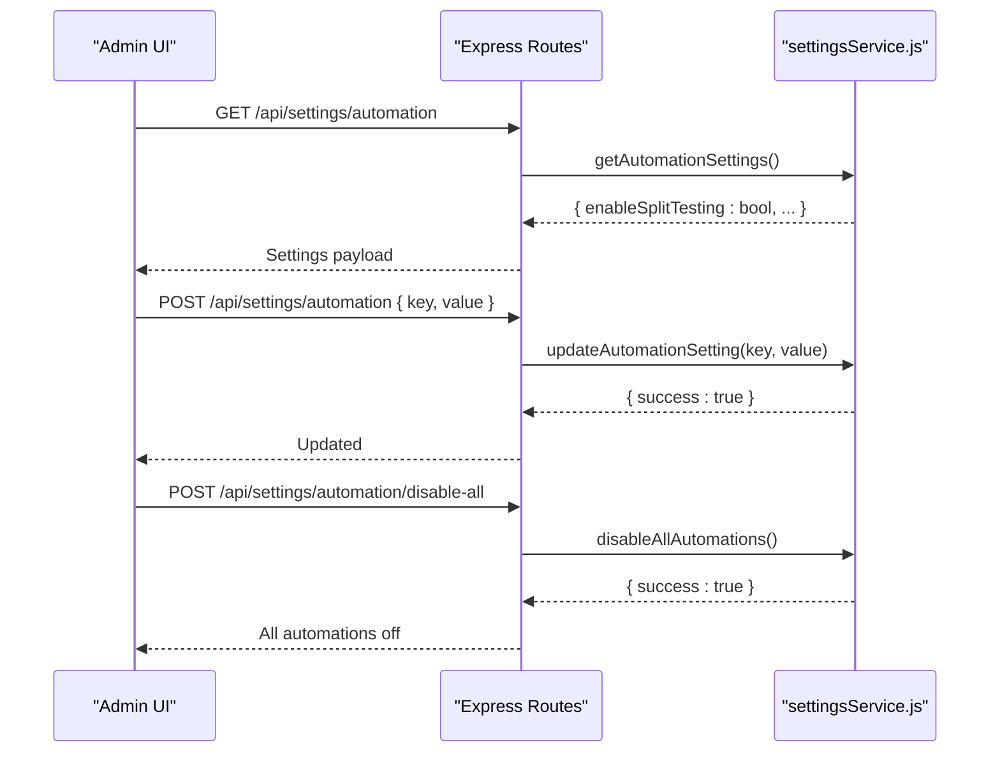
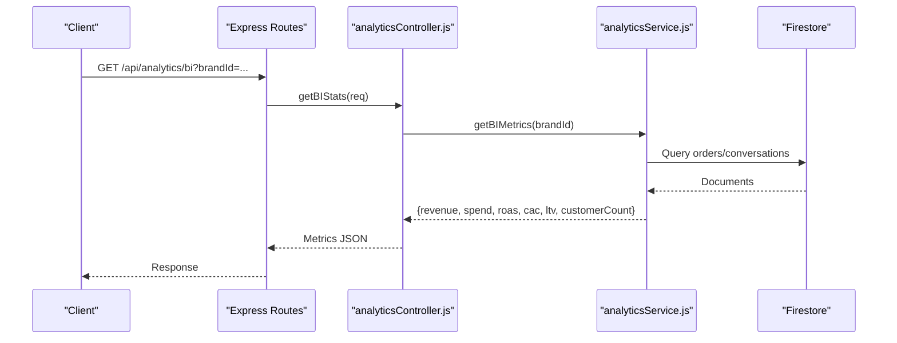
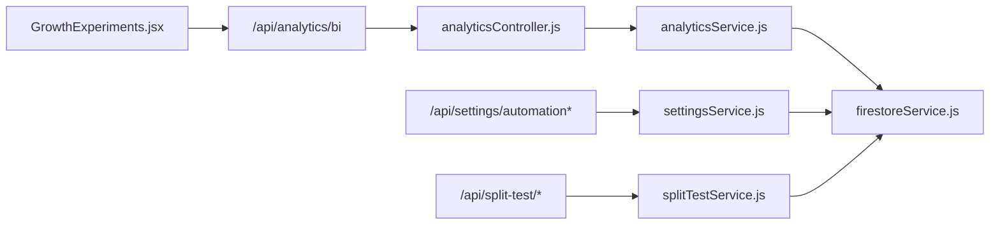

# Growth Experiments

<cite>
**Referenced Files in This Document**
- [GrowthExperiments.jsx](file://client/src/components/GrowthExperiments.jsx)
- [splitTestService.js](file://server/services/splitTestService.js)
- [settingsService.js](file://server/services/settingsService.js)
- [firestoreService.js](file://server/services/firestoreService.js)
- [index.js](file://server/index.js)
- [analyticsService.js](file://server/services/analyticsService.js)
- [analyticsController.js](file://server/controllers/analyticsController.js)
- [AutomationControlCenter.jsx](file://client/src/components/AutomationControlCenter.jsx)
</cite>

## Table of Contents
1. [Introduction](#introduction)
2. [Project Structure](#project-structure)
3. [Core Components](#core-components)
4. [Architecture Overview](#architecture-overview)
5. [Detailed Component Analysis](#detailed-component-analysis)
6. [Dependency Analysis](#dependency-analysis)
7. [Performance Considerations](#performance-considerations)
8. [Troubleshooting Guide](#troubleshooting-guide)
9. [Conclusion](#conclusion)
10. [Appendices](#appendices)

## Introduction
This document explains the growth experimentation and split testing capabilities implemented in the project. It focuses on the AI persona split testing service, the frontend Growth Experiments dashboard, and supporting infrastructure for analytics and feature controls. It also provides practical guidance for designing experiments, measuring impact, interpreting results, and scaling successful variants while avoiding common biases.

## Project Structure
The growth experimentation system spans:
- Frontend dashboard for monitoring persona performance and funnel health
- Backend split testing service that assigns personas and records conversions
- Feature flagging and kill switch for safe experimentation
- Analytics pipeline for business metrics and reporting

**Diagram sources**
- [GrowthExperiments.jsx:1-153](file://client/src/components/GrowthExperiments.jsx#L1-L153)
- [index.js:184-191](file://server/index.js#L184-L191)
- [settingsService.js:1-73](file://server/services/settingsService.js#L1-L73)
- [analyticsController.js:1-22](file://server/controllers/analyticsController.js#L1-L22)
- [analyticsService.js:1-81](file://server/services/analyticsService.js#L1-L81)
- [splitTestService.js:1-65](file://server/services/splitTestService.js#L1-L65)
- [firestoreService.js:1-126](file://server/services/firestoreService.js#L1-L126)

**Section sources**
- [GrowthExperiments.jsx:1-153](file://client/src/components/GrowthExperiments.jsx#L1-L153)
- [index.js:184-191](file://server/index.js#L184-L191)

## Core Components
- Growth Experiments dashboard: visualizes persona conversion rates, funnel stages, and key growth metrics.
- Split testing service: sticky assignment of AI personas to conversations and conversion logging.
- Feature flags and kill switch: centralized control of automation features including split testing.
- Analytics service/controller: computes business metrics and exposes them via API.

**Section sources**
- [GrowthExperiments.jsx:4-153](file://client/src/components/GrowthExperiments.jsx#L4-L153)
- [splitTestService.js:9-59](file://server/services/splitTestService.js#L9-L59)
- [settingsService.js:6-46](file://server/services/settingsService.js#L6-L46)
- [analyticsController.js:3-17](file://server/controllers/analyticsController.js#L3-L17)
- [analyticsService.js:54-76](file://server/services/analyticsService.js#L54-L76)

## Architecture Overview
The system integrates frontend dashboards with backend services and Firestore. The split testing service is gated by a feature flag and writes persona metrics to a dedicated collection for later aggregation and visualization.

**Diagram sources**
- [GrowthExperiments.jsx:1-153](file://client/src/components/GrowthExperiments.jsx#L1-L153)
- [index.js:184-188](file://server/index.js#L184-L188)
- [analyticsController.js:3-17](file://server/controllers/analyticsController.js#L3-L17)
- [analyticsService.js:54-76](file://server/services/analyticsService.js#L54-L76)
- [splitTestService.js:39-59](file://server/services/splitTestService.js#L39-L59)
- [firestoreService.js:53-53](file://server/services/firestoreService.js#L53-L53)

## Detailed Component Analysis

### Split Testing Service
Responsibilities:
- Sticky assignment of an AI persona to a conversation identifier
- Conversion logging keyed by persona for downstream analysis

Implementation highlights:
- Uses a deterministic hash of the conversation ID to ensure consistent assignment across sessions.
- Reads and writes to Firestore collections for persona assignment and metrics.
- Respects a feature flag to disable or enable the experiment.

**Diagram sources**
- [splitTestService.js:9-34](file://server/services/splitTestService.js#L9-L34)

**Section sources**
- [splitTestService.js:9-34](file://server/services/splitTestService.js#L9-L34)
- [splitTestService.js:39-59](file://server/services/splitTestService.js#L39-L59)

### Growth Experiments Dashboard
Responsibilities:
- Present persona performance metrics (conversion counts and rates)
- Visualize sales funnel health and drop-offs
- Display high-level growth indicators (velocity, lift)

Key UI elements:
- Persona performance bar chart with conversion rates
- Funnel stage progress bars with drop-off percentages
- Metric cards for active persona, funnel velocity, and conversion lift

**Diagram sources**
- [GrowthExperiments.jsx:29-149](file://client/src/components/GrowthExperiments.jsx#L29-L149)

**Section sources**
- [GrowthExperiments.jsx:4-153](file://client/src/components/GrowthExperiments.jsx#L4-L153)

### Feature Flags and Kill Switch
Responsibilities:
- Centralized control of automation features including split testing
- Emergency disable-all mechanism

**Diagram sources**
- [index.js:189-191](file://server/index.js#L189-L191)
- [settingsService.js:6-46](file://server/services/settingsService.js#L6-L46)
- [settingsService.js:50-66](file://server/services/settingsService.js#L50-L66)
- [AutomationControlCenter.jsx:16-60](file://client/src/components/AutomationControlCenter.jsx#L16-L60)

**Section sources**
- [settingsService.js:6-46](file://server/services/settingsService.js#L6-L46)
- [settingsService.js:50-66](file://server/services/settingsService.js#L50-L66)
- [index.js:189-191](file://server/index.js#L189-L191)
- [AutomationControlCenter.jsx:16-60](file://client/src/components/AutomationControlCenter.jsx#L16-L60)

### Analytics Pipeline
Responsibilities:
- Compute business metrics (revenue, spend, ROAS, CAC, LTV, customer count)
- Expose metrics via controller endpoint

**Diagram sources**
- [index.js:184-188](file://server/index.js#L184-L188)
- [analyticsController.js:3-17](file://server/controllers/analyticsController.js#L3-L17)
- [analyticsService.js:54-76](file://server/services/analyticsService.js#L54-L76)

**Section sources**
- [analyticsController.js:3-17](file://server/controllers/analyticsController.js#L3-L17)
- [analyticsService.js:54-76](file://server/services/analyticsService.js#L54-L76)

## Dependency Analysis
- The Growth Experiments dashboard depends on analytics endpoints for real-time metrics.
- The split testing service depends on Firestore and the settings service for feature gating.
- The analytics service depends on Firestore and external APIs for spend data.

**Diagram sources**
- [GrowthExperiments.jsx:1-153](file://client/src/components/GrowthExperiments.jsx#L1-L153)
- [index.js:184-191](file://server/index.js#L184-L191)
- [analyticsController.js:1-22](file://server/controllers/analyticsController.js#L1-L22)
- [analyticsService.js:1-81](file://server/services/analyticsService.js#L1-L81)
- [settingsService.js:1-73](file://server/services/settingsService.js#L1-L73)
- [splitTestService.js:1-65](file://server/services/splitTestService.js#L1-L65)
- [firestoreService.js:1-126](file://server/services/firestoreService.js#L1-L126)

**Section sources**
- [index.js:184-191](file://server/index.js#L184-L191)
- [firestoreService.js:53-53](file://server/services/firestoreService.js#L53-L53)

## Performance Considerations
- Deterministic persona assignment avoids repeated hashing overhead and ensures stickiness without extra lookups.
- Firestore queries for persona metrics should be indexed by persona and timestamp for efficient aggregation.
- Analytics computations should be cached or paginated to avoid heavy scans on large datasets.
- Use server-side timestamps for persona metrics to simplify time-based aggregations.

## Troubleshooting Guide
Common issues and resolutions:
- Persona assignment not applied
  - Verify the feature flag is enabled and the conversation document exists.
  - Check logs for errors during write operations to Firestore.
  - Ensure the conversation ID is passed correctly to the assignment function.

- Conversion events not recorded
  - Confirm the conversation exists and contains the persona.
  - Verify the persona metrics collection is being written to and accessible.

- Analytics endpoint returns zeros
  - Ensure brand ID is provided and orders/conversations exist for the brand.
  - Check external API connectivity for spend data retrieval.

- Feature toggle not taking effect
  - Confirm the settings document exists and the key is present.
  - Use the kill switch to reset all automation flags if needed.

**Section sources**
- [splitTestService.js:39-59](file://server/services/splitTestService.js#L39-L59)
- [settingsService.js:6-46](file://server/services/settingsService.js#L6-L46)
- [settingsService.js:50-66](file://server/services/settingsService.js#L50-L66)
- [analyticsService.js:54-76](file://server/services/analyticsService.js#L54-L76)

## Conclusion
The system provides a practical foundation for growth experimentation through persona split testing, real-time dashboarding, and robust analytics. By leveraging feature flags, deterministic assignment, and structured conversion logging, teams can safely iterate on messaging styles and measure their impact. The included guidance helps design sound experiments, interpret results, and scale winning variants responsibly.

## Appendices

### Experimental Design Playbook
- Define a single metric to optimize (e.g., conversion rate from inquiry to order).
- Randomize exposure (personas) per conversation using a stable hash of the conversation ID.
- Run experiments for sufficient time to accumulate meaningful samples; monitor for statistical stability.
- Track funnel drop-offs to identify where personas influence behavior.
- Use confidence-based interpretations: avoid premature stops; prefer formal significance checks before scaling.
- Document baseline metrics and post-experiment comparisons for reproducibility.

### Typical Growth Experiments
- Messaging style A/B: Friendly vs. Professional personas
- Tone variation: Direct vs. Storyteller personas
- CTAs and closing strategies: compare different prompts or sequences
- Timing and sequencing: vary initial response length or follow-ups

### Measuring Impact and Scaling
- Compare conversion rates across persona groups over equivalent traffic windows.
- Validate lift using confidence intervals; avoid decisions based solely on point estimates.
- Scale the top-performing variant; keep a small ongoing experiment to guard against shifts.
- Continuously monitor funnel health to detect regressions.