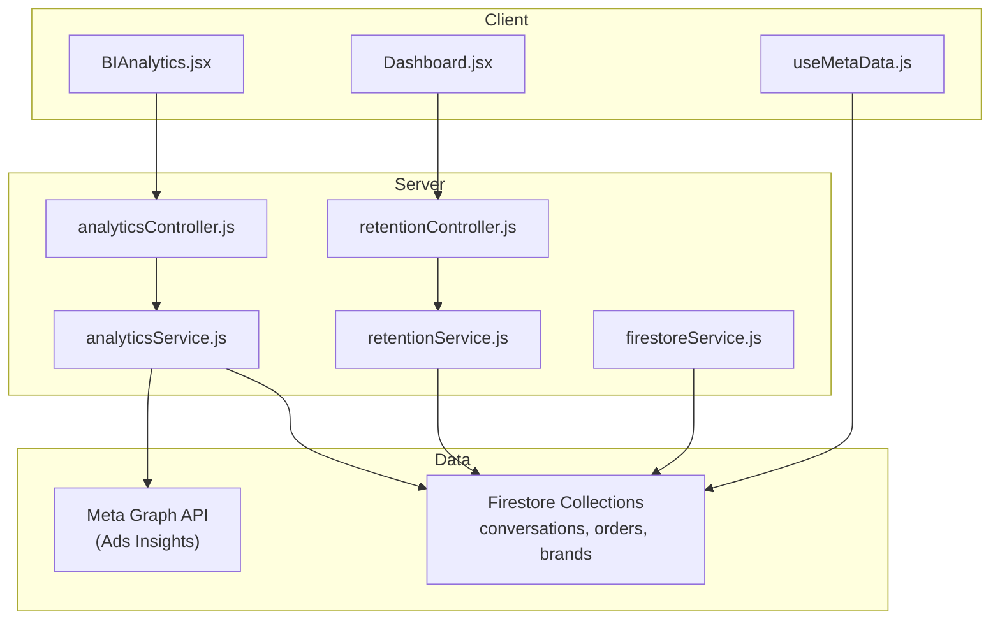
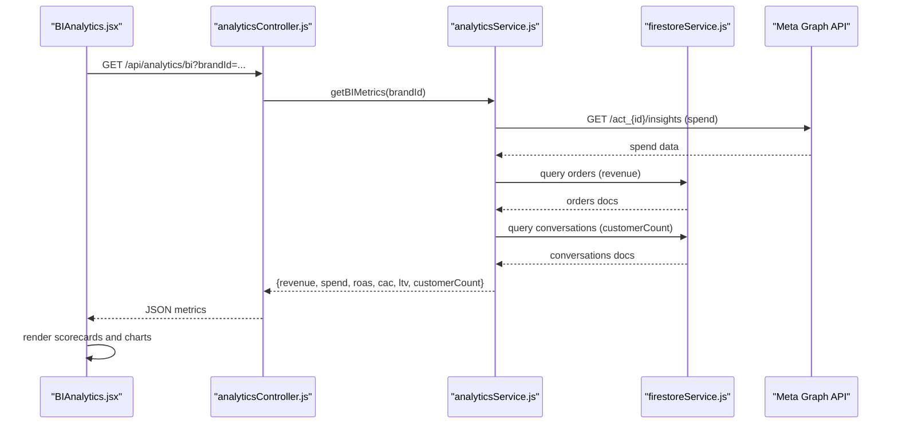
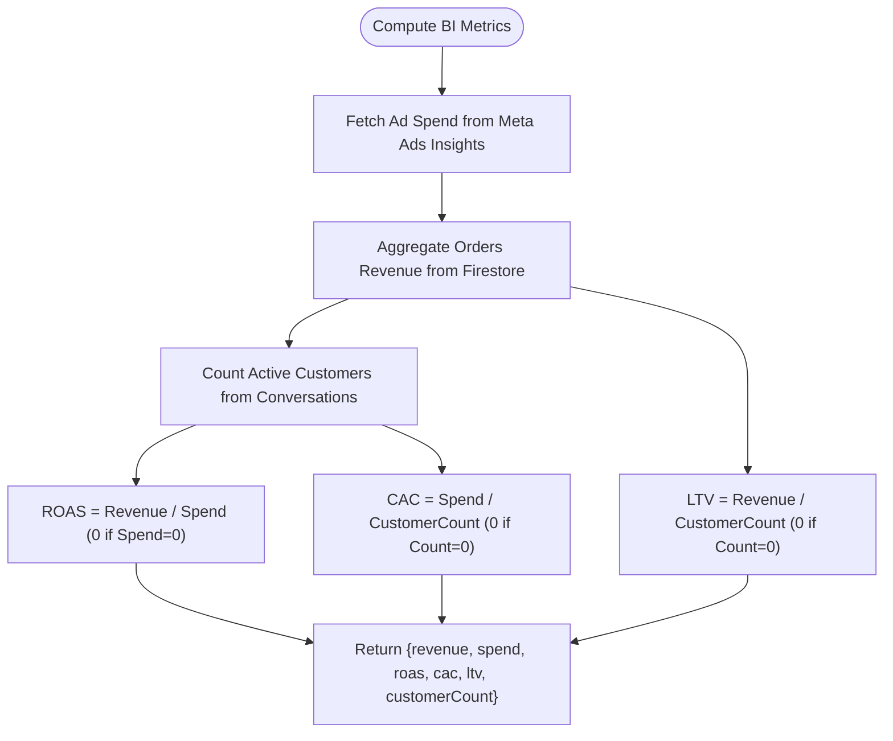
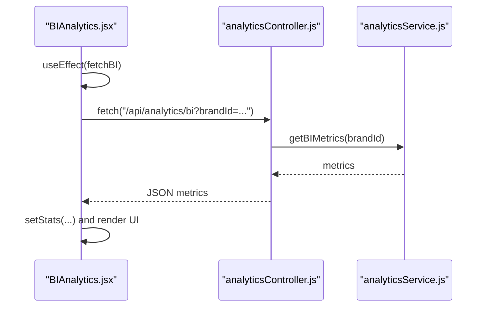
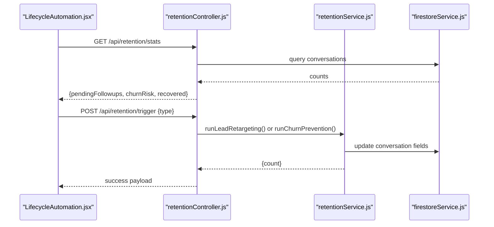
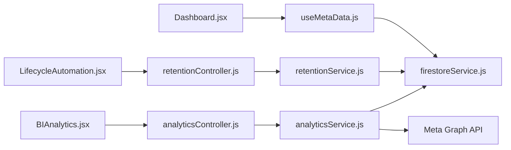

# Performance Metrics

<cite>
**Referenced Files in This Document**
- [BIAnalytics.jsx](file://client/src/components/BIAnalytics.jsx)
- [analyticsController.js](file://server/controllers/analyticsController.js)
- [analyticsService.js](file://server/services/analyticsService.js)
- [retentionController.js](file://server/controllers/retentionController.js)
- [retentionService.js](file://server/services/retentionService.js)
- [Dashboard.jsx](file://client/src/Dashboard.jsx)
- [useMetaData.js](file://client/src/hooks/useMetaData.js)
- [firestoreService.js](file://server/services/firestoreService.js)
- [firestore.rules](file://firestore.rules)
</cite>

## Table of Contents
1. [Introduction](#introduction)
2. [Project Structure](#project-structure)
3. [Core Components](#core-components)
4. [Architecture Overview](#architecture-overview)
5. [Detailed Component Analysis](#detailed-component-analysis)
6. [Dependency Analysis](#dependency-analysis)
7. [Performance Considerations](#performance-considerations)
8. [Troubleshooting Guide](#troubleshooting-guide)
9. [Conclusion](#conclusion)
10. [Appendices](#appendices)

## Introduction
This document explains the business performance metrics and key performance indicators (KPIs) implemented in the system. It covers how metrics are collected, calculated, and surfaced in dashboards, along with guidance for real-time monitoring, alerting, trend analysis, benchmarking, and creating custom metrics tailored to specific business objectives.

The primary KPIs currently supported are:
- Total Revenue
- Ad Spend
- Real ROAS (Return on Ad Spend)
- Unit CAC (Customer Acquisition Cost)
- Lifetime Value (LTV)
- Active Customer Count

Additional operational KPIs include churn risk and recovered revenue, derived from lifecycle automation and retention workflows.

## Project Structure
The metrics pipeline spans the frontend and backend:
- Frontend: React components fetch and render metrics, and integrate with lifecycle automation views.
- Backend: Controllers orchestrate requests, services compute metrics from Firestore and external APIs, and Firestore stores conversation, order, and brand data.

**Diagram sources**
- [BIAnalytics.jsx:1-170](file://client/src/components/BIAnalytics.jsx#L1-L170)
- [analyticsController.js:1-22](file://server/controllers/analyticsController.js#L1-L22)
- [analyticsService.js:1-81](file://server/services/analyticsService.js#L1-L81)
- [retentionController.js:1-52](file://server/controllers/retentionController.js#L1-L52)
- [retentionService.js:1-123](file://server/services/retentionService.js#L1-L123)
- [firestoreService.js:1-126](file://server/services/firestoreService.js#L1-L126)

**Section sources**
- [BIAnalytics.jsx:1-170](file://client/src/components/BIAnalytics.jsx#L1-L170)
- [analyticsController.js:1-22](file://server/controllers/analyticsController.js#L1-L22)
- [analyticsService.js:1-81](file://server/services/analyticsService.js#L1-L81)
- [retentionController.js:1-52](file://server/controllers/retentionController.js#L1-L52)
- [retentionService.js:1-123](file://server/services/retentionService.js#L1-L123)
- [firestoreService.js:1-126](file://server/services/firestoreService.js#L1-L126)

## Core Components
- BIAnalytics (frontend): Fetches and displays core financial and unit economics metrics in a responsive dashboard layout.
- Analytics Controller (backend): Validates inputs and delegates to the analytics service.
- Analytics Service (backend): Computes revenue, ad spend, ROAS, CAC, LTV, and customer counts using Firestore and Meta Graph API.
- Retention Controller and Service (backend): Power lifecycle automation and expose churn risk/recovered metrics.
- Firestore Service (backend): Provides Firestore access and brand lookup helpers.
- Firestore Rules: Enforce brand-scoped access to collections.

**Section sources**
- [BIAnalytics.jsx:1-170](file://client/src/components/BIAnalytics.jsx#L1-L170)
- [analyticsController.js:1-22](file://server/controllers/analyticsController.js#L1-L22)
- [analyticsService.js:1-81](file://server/services/analyticsService.js#L1-L81)
- [retentionController.js:1-52](file://server/controllers/retentionController.js#L1-L52)
- [retentionService.js:1-123](file://server/services/retentionService.js#L1-L123)
- [firestoreService.js:1-126](file://server/services/firestoreService.js#L1-L126)
- [firestore.rules:1-50](file://firestore.rules#L1-L50)

## Architecture Overview
The system follows a clean separation of concerns:
- UI components request metrics via HTTP endpoints.
- Controllers validate parameters and call services.
- Services query Firestore and external APIs, then compute KPIs.
- Results are returned to the UI for rendering.

**Diagram sources**
- [BIAnalytics.jsx:16-29](file://client/src/components/BIAnalytics.jsx#L16-L29)
- [analyticsController.js:3-17](file://server/controllers/analyticsController.js#L3-L17)
- [analyticsService.js:7-49](file://server/services/analyticsService.js#L7-L49)
- [firestoreService.js:33-53](file://server/services/firestoreService.js#L33-L53)

## Detailed Component Analysis

### Business KPIs and Calculation Algorithms
- Total Revenue: Sum of order totals for a brand.
- Ad Spend: Aggregated spend from Meta Ads Insights API for the configured account.
- Real ROAS: Revenue divided by spend; zero when spend is zero.
- Unit CAC: Ad spend divided by number of active customers; zero when customer count is zero.
- Lifetime Value (LTV): Revenue divided by number of active customers; zero when customer count is zero.
- Active Customer Count: Count of conversation documents marked as customers.

**Diagram sources**
- [analyticsService.js:54-76](file://server/services/analyticsService.js#L54-L76)

**Section sources**
- [analyticsService.js:54-76](file://server/services/analyticsService.js#L54-L76)

### Real-Time Performance Monitoring and Rendering
- The BIAnalytics component fetches metrics on mount and renders scorecards and distribution visuals.
- It displays trends and includes a growth efficiency gauge with a comparative statement against industry benchmarks.

**Diagram sources**
- [BIAnalytics.jsx:16-29](file://client/src/components/BIAnalytics.jsx#L16-L29)
- [analyticsController.js:3-17](file://server/controllers/analyticsController.js#L3-L17)
- [analyticsService.js:54-76](file://server/services/analyticsService.js#L54-L76)

**Section sources**
- [BIAnalytics.jsx:16-29](file://client/src/components/BIAnalytics.jsx#L16-L29)
- [BIAnalytics.jsx:74-164](file://client/src/components/BIAnalytics.jsx#L74-L164)

### Lifecycle Automation KPIs (Churn Risk and Recovered)
- The retention controller exposes stats for churn risk and recovered revenue.
- The retention service runs automated campaigns to prevent churn and re-engage leads, updating conversation documents accordingly.

**Diagram sources**
- [retentionController.js:23-46](file://server/controllers/retentionController.js#L23-L46)
- [retentionController.js:4-21](file://server/controllers/retentionController.js#L4-L21)
- [retentionService.js:10-52](file://server/services/retentionService.js#L10-L52)
- [retentionService.js:58-98](file://server/services/retentionService.js#L58-L98)

**Section sources**
- [retentionController.js:23-46](file://server/controllers/retentionController.js#L23-L46)
- [retentionService.js:10-52](file://server/services/retentionService.js#L10-L52)
- [retentionService.js:58-98](file://server/services/retentionService.js#L58-L98)

### Data Sources and Access Control
- Firestore collections used:
  - conversations: customer flags, timestamps, and counts.
  - orders: brand-scoped order totals for revenue.
  - brands: brand metadata and tokens.
- Firestore rules enforce brand scoping for most resources.

**Section sources**
- [firestore.rules:11-26](file://firestore.rules#L11-L26)
- [firestore.rules:33-43](file://firestore.rules#L33-L43)
- [firestoreService.js:56-114](file://server/services/firestoreService.js#L56-L114)

## Dependency Analysis
- BIAnalytics depends on analyticsController and analyticsService for data.
- analyticsController depends on analyticsService.
- analyticsService depends on Firestore and Meta Graph API.
- Retention components depend on Firestore and optional Meta Messaging API.
- Dashboard integrates lifecycle automation stats and metadata hooks.

**Diagram sources**
- [BIAnalytics.jsx:16-29](file://client/src/components/BIAnalytics.jsx#L16-L29)
- [analyticsController.js:1-22](file://server/controllers/analyticsController.js#L1-L22)
- [analyticsService.js:1-81](file://server/services/analyticsService.js#L1-L81)
- [retentionController.js:1-52](file://server/controllers/retentionController.js#L1-L52)
- [retentionService.js:1-123](file://server/services/retentionService.js#L1-L123)
- [Dashboard.jsx:1-1014](file://client/src/Dashboard.jsx#L1-L1014)
- [useMetaData.js:1-83](file://client/src/hooks/useMetaData.js#L1-L83)
- [firestoreService.js:1-126](file://server/services/firestoreService.js#L1-L126)

**Section sources**
- [BIAnalytics.jsx:16-29](file://client/src/components/BIAnalytics.jsx#L16-L29)
- [analyticsController.js:1-22](file://server/controllers/analyticsController.js#L1-L22)
- [analyticsService.js:1-81](file://server/services/analyticsService.js#L1-L81)
- [retentionController.js:1-52](file://server/controllers/retentionController.js#L1-L52)
- [retentionService.js:1-123](file://server/services/retentionService.js#L1-L123)
- [Dashboard.jsx:1-1014](file://client/src/Dashboard.jsx#L1-L1014)
- [useMetaData.js:1-83](file://client/src/hooks/useMetaData.js#L1-L83)
- [firestoreService.js:1-126](file://server/services/firestoreService.js#L1-L126)

## Performance Considerations
- Data volume: Large conversation and order datasets can increase query times. Consider adding Firestore indexes on brandId and timestamps.
- External API latency: Meta Graph API calls can be slow; implement caching and retry logic at the service layer.
- UI responsiveness: Debounce frequent re-fetches and avoid unnecessary re-renders by memoizing metrics.
- Batch writes: Use Firestore batch operations for segmentation and updates to reduce round trips.
- Caching: Cache brand lookups and frequently accessed aggregations to minimize repeated reads.

[No sources needed since this section provides general guidance]

## Troubleshooting Guide
Common issues and resolutions:
- Missing brandId: analyticsController returns a 400 error when brandId is absent.
- Ad spend not available: analyticsService returns zero if required environment variables are missing or API calls fail.
- Revenue aggregation errors: analyticsService catches exceptions and logs them; defaults to zero revenue.
- Retention automation disabled: retentionService checks feature flags and logs when disabled.
- Access control: Firestore rules restrict reads/writes by brand; ensure brandId is present in documents.

**Section sources**
- [analyticsController.js:6-8](file://server/controllers/analyticsController.js#L6-L8)
- [analyticsService.js:11-27](file://server/services/analyticsService.js#L11-L27)
- [analyticsService.js:45-48](file://server/services/analyticsService.js#L45-L48)
- [retentionService.js:11-14](file://server/services/retentionService.js#L11-L14)
- [firestore.rules:4-9](file://firestore.rules#L4-L9)

## Conclusion
The system provides a solid foundation for business KPIs with clear separation between UI, controllers, and services. Current metrics include revenue, spend, ROAS, CAC, LTV, and customer counts, with additional churn-related KPIs exposed via lifecycle automation. Extending the system to support additional KPIs, real-time alerts, and advanced trend analysis requires minimal changes to services and UI components.

[No sources needed since this section summarizes without analyzing specific files]

## Appendices

### Metric Interpretation and Benchmarking
- ROAS: Higher is generally better; compare to industry benchmarks by category.
- CAC vs LTV: Target LTV/CAC ratios above 3:1 for sustainable growth.
- Customer Count: Monitor growth trends month-over-month.
- Churn Risk and Recovered: Use these signals to adjust retention campaigns and budget allocation.

[No sources needed since this section provides general guidance]

### Creating Custom Metrics
Steps to add a new metric:
1. Define the calculation in analyticsService.js or a new service module.
2. Add a route in analyticsController.js to expose the endpoint.
3. Consume the endpoint in BIAnalytics.jsx and render in the UI.
4. Ensure Firestore indexes exist for efficient queries.
5. Add appropriate access controls in firestore.rules.

Example extension points:
- Monthly Recurring Revenue (MRR): Aggregate subscription orders by recurring interval.
- Customer Acquisition Cost by Channel: Segment spend by ad creative or campaign.
- Engagement Metrics: Average response time, first-touch resolution rate, NPS-like sentiment.

[No sources needed since this section provides general guidance]