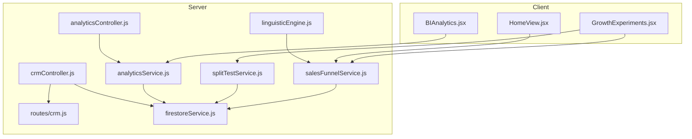
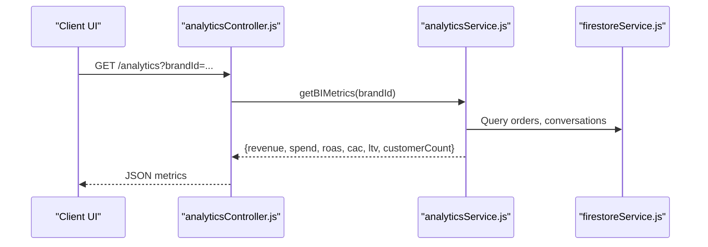
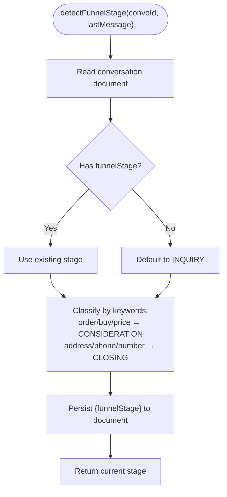
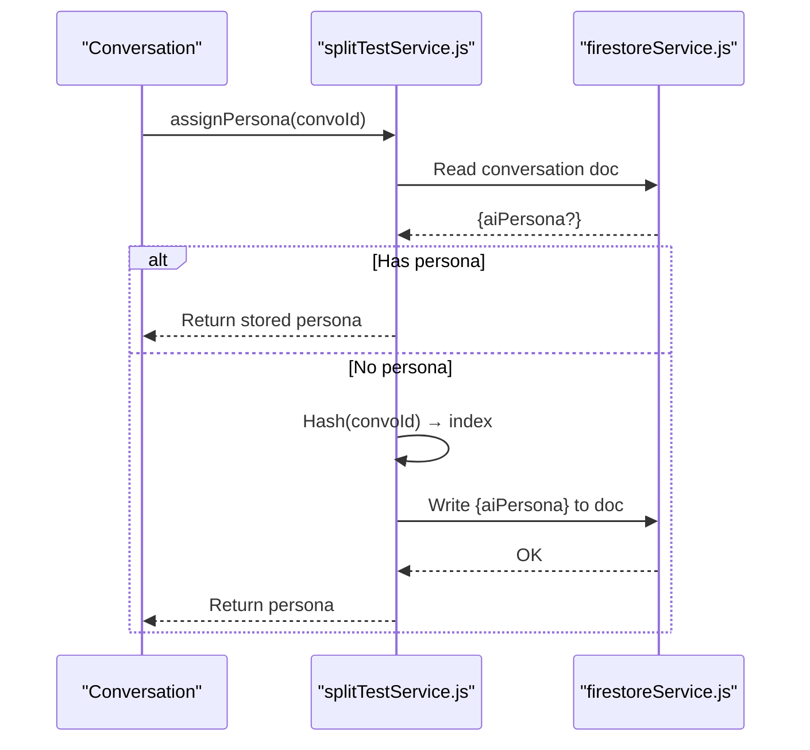
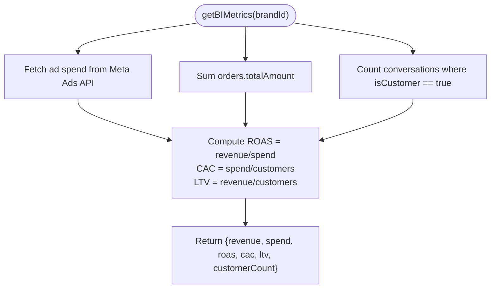
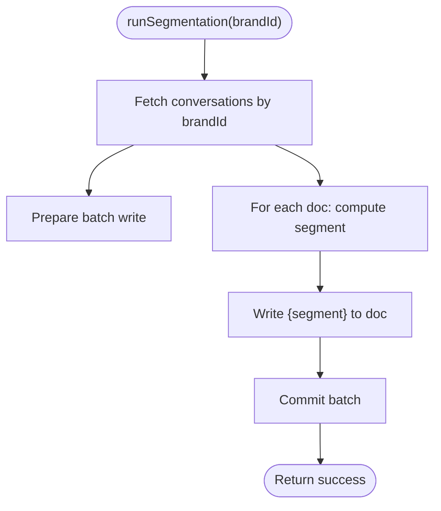
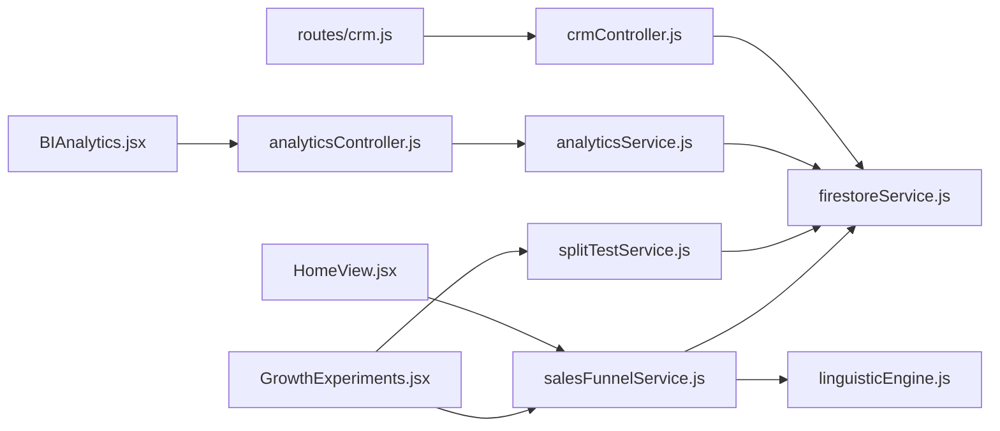

# Sales Funnel Optimization

<cite>
**Referenced Files in This Document**
- [salesFunnelService.js](file://server/services/salesFunnelService.js)
- [splitTestService.js](file://server/services/splitTestService.js)
- [analyticsService.js](file://server/services/analyticsService.js)
- [analyticsController.js](file://server/controllers/analyticsController.js)
- [crmController.js](file://server/controllers/crmController.js)
- [crm.js](file://server/routes/crm.js)
- [firestoreService.js](file://server/services/firestoreService.js)
- [linguisticEngine.js](file://server/utils/linguisticEngine.js)
- [GrowthExperiments.jsx](file://client/src/components/GrowthExperiments.jsx)
- [HomeView.jsx](file://client/src/components/Views/HomeView.jsx)
- [BIAnalytics.jsx](file://client/src/components/BIAnalytics.jsx)
</cite>

## Table of Contents
1. [Introduction](#introduction)
2. [Project Structure](#project-structure)
3. [Core Components](#core-components)
4. [Architecture Overview](#architecture-overview)
5. [Detailed Component Analysis](#detailed-component-analysis)
6. [Dependency Analysis](#dependency-analysis)
7. [Performance Considerations](#performance-considerations)
8. [Troubleshooting Guide](#troubleshooting-guide)
9. [Conclusion](#conclusion)
10. [Appendices](#appendices)

## Introduction
This document explains the sales funnel optimization capabilities implemented in the project. It covers customer journey mapping, conversion rate analysis, funnel performance tracking, growth experiments for A/B testing personas, funnel stage detection, drop-off identification, visualization tools, and actionable recommendations. It also provides guidance on setting up funnel tracking, analyzing conversion funnels across customer segments, and implementing improvements based on data insights.

## Project Structure
The funnel optimization system spans backend services and frontend dashboards:
- Backend services manage funnel stage detection, persona assignment and conversion logging, analytics computation, CRM segmentation, and Firestore integration.
- Frontend dashboards visualize funnel health, persona performance, and BI metrics.

**Diagram sources**
- [GrowthExperiments.jsx](file://client/src/components/GrowthExperiments.jsx)
- [HomeView.jsx](file://client/src/components/Views/HomeView.jsx)
- [BIAnalytics.jsx](file://client/src/components/BIAnalytics.jsx)
- [salesFunnelService.js](file://server/services/salesFunnelService.js)
- [splitTestService.js](file://server/services/splitTestService.js)
- [analyticsService.js](file://server/services/analyticsService.js)
- [analyticsController.js](file://server/controllers/analyticsController.js)
- [crmController.js](file://server/controllers/crmController.js)
- [crm.js](file://server/routes/crm.js)
- [firestoreService.js](file://server/services/firestoreService.js)
- [linguisticEngine.js](file://server/utils/linguisticEngine.js)

**Section sources**
- [salesFunnelService.js:1-61](file://server/services/salesFunnelService.js#L1-L61)
- [splitTestService.js:1-65](file://server/services/splitTestService.js#L1-L65)
- [analyticsService.js:1-81](file://server/services/analyticsService.js#L1-L81)
- [analyticsController.js:1-22](file://server/controllers/analyticsController.js#L1-L22)
- [crmController.js:1-78](file://server/controllers/crmController.js#L1-L78)
- [crm.js:1-9](file://server/routes/crm.js#L1-L9)
- [firestoreService.js:1-126](file://server/services/firestoreService.js#L1-L126)
- [linguisticEngine.js:1-144](file://server/utils/linguisticEngine.js#L1-L144)
- [GrowthExperiments.jsx:1-153](file://client/src/components/GrowthExperiments.jsx#L1-L153)
- [HomeView.jsx:1-250](file://client/src/components/Views/HomeView.jsx#L1-L250)
- [BIAnalytics.jsx](file://client/src/components/BIAnalytics.jsx)

## Core Components
- Sales funnel service: Detects funnel stage from conversation context and generates stage-specific prompts to guide the buyer journey.
- Growth experiments (A/B testing): Assigns AI personas to conversations, logs conversions per persona, and surfaces performance metrics.
- Analytics service/controller: Computes revenue, ad spend, ROAS, CAC, LTV, and exposes them via controller endpoints.
- CRM segmentation: Segments conversations into customer types and computes distribution statistics.
- Linguistic engine: Provides robust intent matching and normalization to support contextual funnel detection.
- Frontend dashboards: Visualize funnel stages, persona performance, and BI metrics.

**Section sources**
- [salesFunnelService.js:1-61](file://server/services/salesFunnelService.js#L1-L61)
- [splitTestService.js:1-65](file://server/services/splitTestService.js#L1-L65)
- [analyticsService.js:1-81](file://server/services/analyticsService.js#L1-L81)
- [analyticsController.js:1-22](file://server/controllers/analyticsController.js#L1-L22)
- [crmController.js:1-78](file://server/controllers/crmController.js#L1-L78)
- [linguisticEngine.js:1-144](file://server/utils/linguisticEngine.js#L1-L144)
- [GrowthExperiments.jsx:1-153](file://client/src/components/GrowthExperiments.jsx#L1-L153)
- [HomeView.jsx:1-250](file://client/src/components/Views/HomeView.jsx#L1-L250)
- [BIAnalytics.jsx](file://client/src/components/BIAnalytics.jsx)

## Architecture Overview
The funnel optimization pipeline integrates frontend dashboards with backend services:
- Frontend dashboards collect brand identifiers and render funnel and persona metrics.
- Backend services persist and compute metrics in Firestore and external APIs.
- Controllers expose endpoints for analytics retrieval and CRM segmentation.

**Diagram sources**
- [analyticsController.js:1-22](file://server/controllers/analyticsController.js#L1-L22)
- [analyticsService.js:1-81](file://server/services/analyticsService.js#L1-L81)
- [firestoreService.js:1-126](file://server/services/firestoreService.js#L1-L126)

## Detailed Component Analysis

### Sales Funnel Service
Responsibilities:
- Detect funnel stage from the latest message in a conversation.
- Persist the detected stage back to the conversation document.
- Generate stage-aware prompts to guide the buyer journey.

Implementation highlights:
- Stage enumeration supports inquiry, consideration, closing, and completed.
- Keyword-based detection promotes transitions between stages.
- Prompt augmentation appends stage-specific guidance to AI responses.

**Diagram sources**
- [salesFunnelService.js:1-61](file://server/services/salesFunnelService.js#L1-L61)

**Section sources**
- [salesFunnelService.js:1-61](file://server/services/salesFunnelService.js#L1-L61)

### Growth Experiments (A/B Testing Personas)
Responsibilities:
- Assign AI personas to conversations in a sticky manner.
- Log conversions per persona for performance analysis.
- Visualize persona performance and funnel health in the dashboard.

Implementation highlights:
- Sticky assignment uses a deterministic hash of the conversation ID.
- Conversion events are recorded in a dedicated collection for analytics.
- Dashboard displays persona conversion rates and funnel drop-offs.

**Diagram sources**
- [splitTestService.js:1-65](file://server/services/splitTestService.js#L1-L65)
- [firestoreService.js:1-126](file://server/services/firestoreService.js#L1-L126)

**Section sources**
- [splitTestService.js:1-65](file://server/services/splitTestService.js#L1-L65)
- [GrowthExperiments.jsx:1-153](file://client/src/components/GrowthExperiments.jsx#L1-L153)

### Funnel Visualization Tools
The frontend provides two complementary views:
- Master Sales Funnel widget: Shows stage counts and conversion percentages.
- Autopilot Funnel Health: Displays funnel stage progression and drop-off percentages.

These visuals help identify bottlenecks and track improvements over time.

**Section sources**
- [HomeView.jsx:96-110](file://client/src/components/Views/HomeView.jsx#L96-L110)
- [GrowthExperiments.jsx:97-147](file://client/src/components/GrowthExperiments.jsx#L97-L147)

### Conversion Rate Analysis and BI Metrics
Backend computes:
- Revenue from orders.
- Ad spend via Meta Ads API.
- ROAS, CAC, LTV, and customer count from Firestore.

Frontend dashboards present these metrics in digestible cards.

**Diagram sources**
- [analyticsService.js:1-81](file://server/services/analyticsService.js#L1-L81)

**Section sources**
- [analyticsService.js:1-81](file://server/services/analyticsService.js#L1-L81)
- [analyticsController.js:1-22](file://server/controllers/analyticsController.js#L1-L22)
- [BIAnalytics.jsx](file://client/src/components/BIAnalytics.jsx)

### CRM Segmentation and Customer Behavior Analysis
The CRM segmentation service:
- Computes a lead/customer segment for each conversation based on lead score and purchase history.
- Tags conversations and provides distribution statistics.

This enables analyzing funnel performance across segments (e.g., Hot Lead vs. Window Shopper).

**Diagram sources**
- [crmController.js:1-78](file://server/controllers/crmController.js#L1-L78)

**Section sources**
- [crmController.js:1-78](file://server/controllers/crmController.js#L1-L78)
- [crm.js:1-9](file://server/routes/crm.js#L1-L9)

### Linguistic Engine for Contextual Detection
The linguistic engine:
- Normalizes Bangla/Romanized text to a phonetic identity.
- Cleans noise words and builds intent categories.
- Generates variations to improve matching for keyword-based funnel detection.

This supports robust stage classification from diverse customer inputs.

**Section sources**
- [linguisticEngine.js:1-144](file://server/utils/linguisticEngine.js#L1-L144)
- [salesFunnelService.js:19-31](file://server/services/salesFunnelService.js#L19-L31)

## Dependency Analysis
- salesFunnelService depends on Firestore for persistence and optionally on linguisticEngine for advanced intent matching.
- splitTestService depends on Firestore for persona assignment and conversion logging.
- analyticsService depends on Firestore and external Meta Ads API for spend data.
- CRM segmentation depends on Firestore queries and batch writes.
- Frontend dashboards depend on backend endpoints for rendering metrics and funnel visuals.

**Diagram sources**
- [salesFunnelService.js:1-61](file://server/services/salesFunnelService.js#L1-L61)
- [splitTestService.js:1-65](file://server/services/splitTestService.js#L1-L65)
- [analyticsService.js:1-81](file://server/services/analyticsService.js#L1-L81)
- [analyticsController.js:1-22](file://server/controllers/analyticsController.js#L1-L22)
- [crmController.js:1-78](file://server/controllers/crmController.js#L1-L78)
- [crm.js:1-9](file://server/routes/crm.js#L1-L9)
- [firestoreService.js:1-126](file://server/services/firestoreService.js#L1-L126)
- [linguisticEngine.js:1-144](file://server/utils/linguisticEngine.js#L1-L144)
- [GrowthExperiments.jsx:1-153](file://client/src/components/GrowthExperiments.jsx#L1-L153)
- [HomeView.jsx:1-250](file://client/src/components/Views/HomeView.jsx#L1-L250)
- [BIAnalytics.jsx](file://client/src/components/BIAnalytics.jsx)

**Section sources**
- [salesFunnelService.js:1-61](file://server/services/salesFunnelService.js#L1-L61)
- [splitTestService.js:1-65](file://server/services/splitTestService.js#L1-L65)
- [analyticsService.js:1-81](file://server/services/analyticsService.js#L1-L81)
- [analyticsController.js:1-22](file://server/controllers/analyticsController.js#L1-L22)
- [crmController.js:1-78](file://server/controllers/crmController.js#L1-L78)
- [crm.js:1-9](file://server/routes/crm.js#L1-L9)
- [firestoreService.js:1-126](file://server/services/firestoreService.js#L1-L126)
- [linguisticEngine.js:1-144](file://server/utils/linguisticEngine.js#L1-L144)
- [GrowthExperiments.jsx:1-153](file://client/src/components/GrowthExperiments.jsx#L1-L153)
- [HomeView.jsx:1-250](file://client/src/components/Views/HomeView.jsx#L1-L250)
- [BIAnalytics.jsx](file://client/src/components/BIAnalytics.jsx)

## Performance Considerations
- Keyword-based funnel detection is lightweight but can be enhanced with vector embeddings or intent classifiers for higher accuracy.
- Sticky persona assignment avoids repeated recomputation and ensures stable experiment groups.
- Batch writes in CRM segmentation reduce Firestore write costs and latency.
- Caching brand lookups and analytics results can improve dashboard responsiveness.
- Offload heavy analytics to scheduled jobs to avoid blocking API requests.

## Troubleshooting Guide
Common issues and resolutions:
- Missing brandId in analytics endpoint: Ensure the brand identifier is passed and validated.
- Empty persona metrics: Verify persona assignment and conversion logging are enabled and the persona_metrics collection exists.
- No funnel stage updates: Confirm the conversation document is writable and the last message triggers keyword matches.
- CRM segmentation not applied: Check Firestore permissions and batch commit success.

**Section sources**
- [analyticsController.js:6-8](file://server/controllers/analyticsController.js#L6-L8)
- [splitTestService.js:39-59](file://server/services/splitTestService.js#L39-L59)
- [salesFunnelService.js:13-31](file://server/services/salesFunnelService.js#L13-L31)
- [crmController.js:13-42](file://server/controllers/crmController.js#L13-L42)

## Conclusion
The system combines contextual funnel detection, persona-driven A/B testing, CRM segmentation, and BI metrics to deliver a comprehensive funnel optimization solution. Frontend dashboards visualize key performance indicators, while backend services ensure reliable data capture and computation. By leveraging these components, teams can identify drop-off points, optimize conversion strategies, and continuously improve funnel performance across customer segments.

## Appendices

### Setting Up Funnel Tracking
- Enable persona split testing and ensure feature flags are configured.
- Integrate funnel stage detection into conversation handling to persist funnelStage.
- Configure analytics endpoints to compute revenue, spend, and derived metrics.
- Run CRM segmentation periodically to tag conversations by segment.

**Section sources**
- [splitTestService.js:9-34](file://server/services/splitTestService.js#L9-L34)
- [salesFunnelService.js:13-31](file://server/services/salesFunnelService.js#L13-L31)
- [analyticsService.js:54-76](file://server/services/analyticsService.js#L54-L76)
- [crmController.js:9-43](file://server/controllers/crmController.js#L9-L43)

### Analyzing Conversion Funnels Across Segments
- Use CRM segmentation to tag conversations by customer type.
- Aggregate funnel metrics per segment to compare conversion rates.
- Visualize segment distributions and funnel drop-offs in dashboards.

**Section sources**
- [crmController.js:48-75](file://server/controllers/crmController.js#L48-L75)
- [GrowthExperiments.jsx:97-147](file://client/src/components/GrowthExperiments.jsx#L97-L147)

### Implementing Funnel Improvements Based on Data Insights
- Focus on stages with highest drop-off percentages.
- Test persona variations to identify high-performing communication styles.
- Optimize prompts and CTAs at each funnel stage to reduce friction.
- Monitor ROAS, CAC, and LTV to validate improvement impact.

**Section sources**
- [GrowthExperiments.jsx:97-147](file://client/src/components/GrowthExperiments.jsx#L97-L147)
- [BIAnalytics.jsx](file://client/src/components/BIAnalytics.jsx)
- [analyticsService.js:54-76](file://server/services/analyticsService.js#L54-L76)