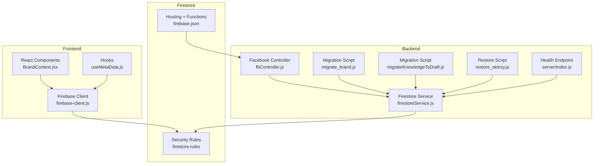
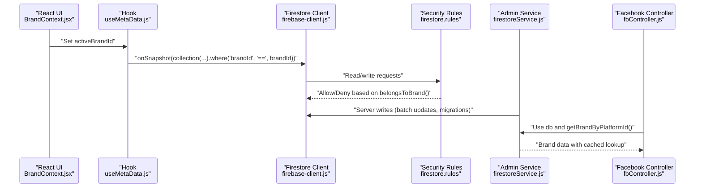
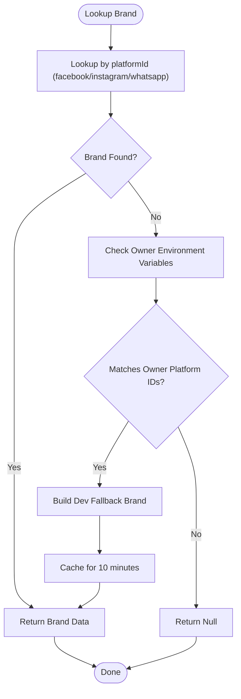
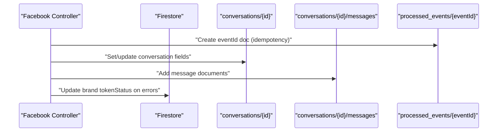
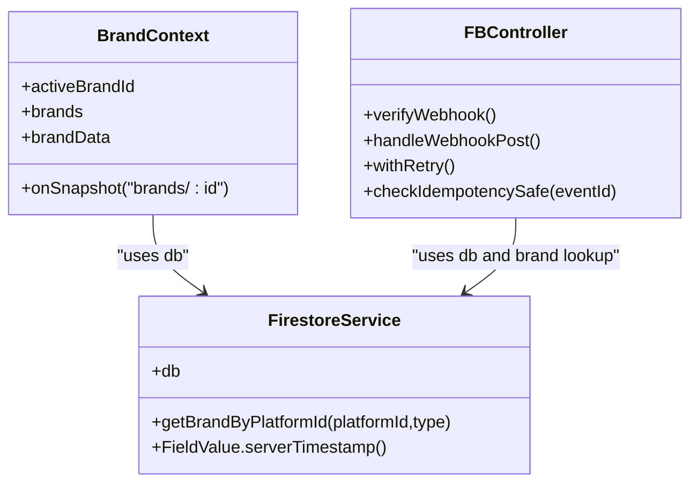
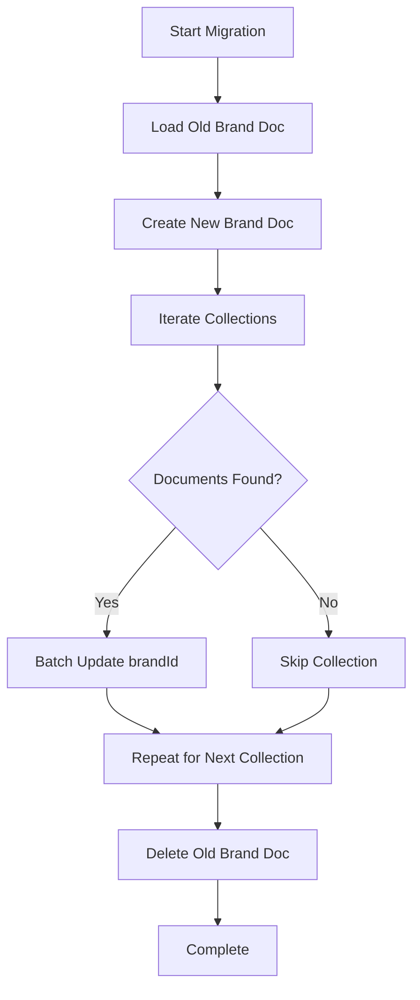
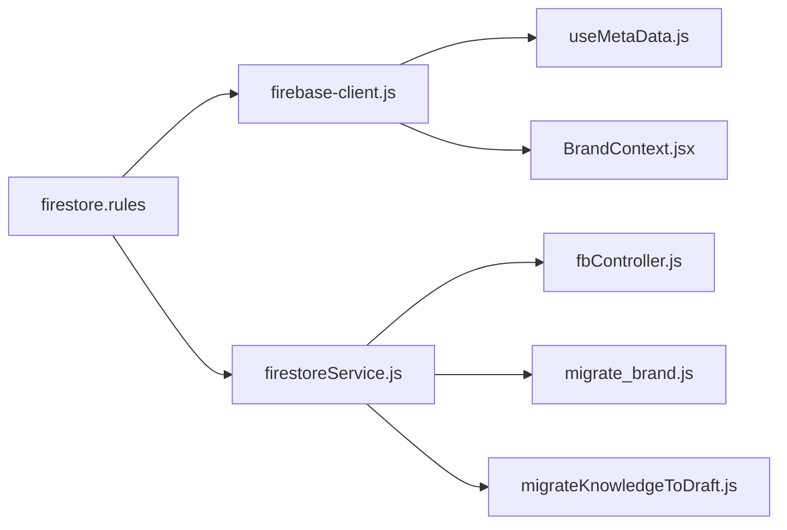

# Database Design

<cite>
**Referenced Files in This Document**
- [firestore.rules](file://firestore.rules)
- [firebase.json](file://firebase.json)
- [client/src/firebase-client.js](file://client/src/firebase-client.js)
- [client/src/context/BrandContext.jsx](file://client/src/context/BrandContext.jsx)
- [client/src/hooks/useMetaData.js](file://client/src/hooks/useMetaData.js)
- [server/services/firestoreService.js](file://server/services/firestoreService.js)
- [server/controllers/fbController.js](file://server/controllers/fbController.js)
- [server/scripts/migrate_brand.js](file://server/scripts/migrate_brand.js)
- [server/scripts/migrateKnowledgeToDraft.js](file://server/scripts/migrateKnowledgeToDraft.js)
- [server/restore_skinzy.js](file://server/restore_skinzy.js)
- [server/index.js](file://server/index.js)
</cite>

## Table of Contents
1. [Introduction](#introduction)
2. [Project Structure](#project-structure)
3. [Core Components](#core-components)
4. [Architecture Overview](#architecture-overview)
5. [Detailed Component Analysis](#detailed-component-analysis)
6. [Dependency Analysis](#dependency-analysis)
7. [Performance Considerations](#performance-considerations)
8. [Troubleshooting Guide](#troubleshooting-guide)
9. [Conclusion](#conclusion)
10. [Appendices](#appendices)

## Introduction
This document provides comprehensive database design documentation for the Firebase Firestore implementation powering the application. It covers collection structure, document relationships, security rules, indexing strategy, and data models for brands, conversations, knowledge base, products, and orders. It also explains real-time synchronization patterns, caching strategies, performance optimization techniques, schema design principles, data validation rules, access control mechanisms, and integration between frontend React components and backend services. Guidance on data migration strategies, backup procedures, and production scaling considerations is included.

## Project Structure
The database layer integrates with:
- Frontend React app using the client-side Firestore SDK for real-time subscriptions and local UI state.
- Backend Node.js services using the Admin SDK for server-side reads/writes, migrations, and integrations with external APIs.
- Firebase Hosting and Cloud Functions for hosting and API endpoints.
- Firebase Security Rules governing access control across collections.

**Diagram sources**
- [client/src/context/BrandContext.jsx:1-249](file://client/src/context/BrandContext.jsx#L1-L249)
- [client/src/hooks/useMetaData.js:1-83](file://client/src/hooks/useMetaData.js#L1-L83)
- [client/src/firebase-client.js:1-26](file://client/src/firebase-client.js#L1-L26)
- [server/services/firestoreService.js:1-126](file://server/services/firestoreService.js#L1-L126)
- [server/controllers/fbController.js:1-200](file://server/controllers/fbController.js#L1-L200)
- [server/scripts/migrate_brand.js:1-64](file://server/scripts/migrate_brand.js#L1-L64)
- [server/scripts/migrateKnowledgeToDraft.js:1-72](file://server/scripts/migrateKnowledgeToDraft.js#L1-L72)
- [server/restore_skinzy.js:1-52](file://server/restore_skinzy.js#L1-L52)
- [server/index.js:126-149](file://server/index.js#L126-L149)
- [firestore.rules:1-51](file://firestore.rules#L1-L51)
- [firebase.json:1-37](file://firebase.json#L1-L37)

**Section sources**
- [client/src/firebase-client.js:1-26](file://client/src/firebase-client.js#L1-L26)
- [client/src/context/BrandContext.jsx:1-249](file://client/src/context/BrandContext.jsx#L1-L249)
- [client/src/hooks/useMetaData.js:1-83](file://client/src/hooks/useMetaData.js#L1-L83)
- [server/services/firestoreService.js:1-126](file://server/services/firestoreService.js#L1-L126)
- [server/controllers/fbController.js:1-200](file://server/controllers/fbController.js#L1-L200)
- [server/scripts/migrate_brand.js:1-64](file://server/scripts/migrate_brand.js#L1-L64)
- [server/scripts/migrateKnowledgeToDraft.js:1-72](file://server/scripts/migrateKnowledgeToDraft.js#L1-L72)
- [server/restore_skinzy.js:1-52](file://server/restore_skinzy.js#L1-L52)
- [server/index.js:126-149](file://server/index.js#L126-L149)
- [firestore.rules:1-51](file://firestore.rules#L1-L51)
- [firebase.json:1-37](file://firebase.json#L1-L37)

## Core Components
- Firestore collections and documents:
  - brands: top-level tenant container with per-brand settings and metadata.
  - products: catalog items linked to a brand via brandId.
  - conversations: customer interaction threads; nested messages subcollection.
  - knowledge_base: AI knowledge entries linked to a brand via brandId.
  - draft_replies: reusable replies linked to a brand via brandId.
  - knowledge_gaps: gaps derived from knowledge_base, linked to a brand via brandId.
  - draft_orders: order templates linked to a brand via brandId.
  - logs: operational logs linked to a brand via brandId.
  - processed_events: idempotency tracking for webhooks.
- Real-time synchronization:
  - Frontend uses onSnapshot listeners scoped by brandId to keep UI in sync.
- Access control:
  - Security rules enforce brand scoping via brandId checks and helper functions.
- Caching:
  - Backend caches brand lookups keyed by platform identifiers to reduce repeated reads.

**Section sources**
- [firestore.rules:1-51](file://firestore.rules#L1-L51)
- [client/src/hooks/useMetaData.js:1-83](file://client/src/hooks/useMetaData.js#L1-L83)
- [client/src/context/BrandContext.jsx:1-249](file://client/src/context/BrandContext.jsx#L1-L249)
- [server/services/firestoreService.js:55-114](file://server/services/firestoreService.js#L55-L114)

## Architecture Overview
The system uses a multi-tenant model with brandId as the primary scoping key. Frontend components subscribe to brand-scoped collections, while backend services perform server-side writes, integrations, and migrations.

**Diagram sources**
- [client/src/context/BrandContext.jsx:1-249](file://client/src/context/BrandContext.jsx#L1-L249)
- [client/src/hooks/useMetaData.js:1-83](file://client/src/hooks/useMetaData.js#L1-L83)
- [client/src/firebase-client.js:1-26](file://client/src/firebase-client.js#L1-L26)
- [firestore.rules:1-51](file://firestore.rules#L1-L51)
- [server/services/firestoreService.js:55-114](file://server/services/firestoreService.js#L55-L114)
- [server/controllers/fbController.js:1-200](file://server/controllers/fbController.js#L1-L200)

## Detailed Component Analysis

### Collection: brands
- Purpose: Tenant container holding brand metadata, tokens, and automation settings.
- Key fields observed in code:
  - ownerEmail, name, facebookPageId, instagramId, whatsappPhoneId, fbPageToken, waAccessToken, googleAIKey, inboxSettings, aiSettings, commentSettings, isDevFallback, createdAt, updatedAt, tokenStatus, lastHealthError, lastErrorTimestamp.
- Access control:
  - Read/write allowed broadly in rules; intended to be restricted to system admins in production.
- Real-time usage:
  - Frontend listens to the active brand document for live updates.
- Backend usage:
  - Brand lookup by platform identifiers with fallback to owner-defined environment variables.
  - Caching reduces repeated lookups.

**Diagram sources**
- [server/services/firestoreService.js:55-114](file://server/services/firestoreService.js#L55-L114)

**Section sources**
- [server/services/firestoreService.js:55-114](file://server/services/firestoreService.js#L55-L114)
- [client/src/context/BrandContext.jsx:202-223](file://client/src/context/BrandContext.jsx#L202-L223)
- [firestore.rules:11-13](file://firestore.rules#L11-L13)

### Collection: products
- Purpose: Product catalog per brand.
- Key fields observed:
  - brandId (tenant key), name, price, offerPrice, stock, category, images/images (array), description, variantOf, createdAt, updatedAt.
- Access control:
  - Readable by anyone; write requires belongsToBrand on the product’s brandId.
- Frontend usage:
  - Real-time subscription filtered by brandId.
- Backend usage:
  - Indexed for fingerprinting and search.

**Section sources**
- [client/src/hooks/useMetaData.js:38-44](file://client/src/hooks/useMetaData.js#L38-L44)
- [firestore.rules:15-18](file://firestore.rules#L15-L18)

### Collection: conversations and nested messages
- Purpose: Customer conversation threads and message history.
- Key fields observed:
  - conversations: brandId, status, isPriority, error, lastMatchedDraftId, sentiment, isHumanHandoff, createdAt, updatedAt.
  - messages: nested under conversations; timestamped entries.
- Access control:
  - conversations and messages readable/writable broadly; enforcement via brandId-scoped queries.
- Backend usage:
  - Message accumulation and idempotency tracking via processed_events.
  - Webhook handling updates conversation status and priority.

**Section sources**
- [firestore.rules:20-26](file://firestore.rules#L20-L26)
- [server/controllers/fbController.js:1017-1168](file://server/controllers/fbController.js#L1017-L1168)
- [server/controllers/fbController.js:1799-1891](file://server/controllers/fbController.js#L1799-L1891)

### Collection: knowledge_base
- Purpose: AI knowledge entries per brand.
- Key fields observed:
  - brandId, keywords (array), answer, status, type, successCount, timestamp.
- Access control:
  - Readable by anyone; write requires belongsToBrand on the KB’s brandId.
- Backend usage:
  - Migration script transforms knowledge_base entries into draft_replies.

**Section sources**
- [firestore.rules:28-31](file://firestore.rules#L28-L31)
- [server/scripts/migrateKnowledgeToDraft.js:19-72](file://server/scripts/migrateKnowledgeToDraft.js#L19-L72)

### Collection: draft_replies
- Purpose: Reusable reply drafts per brand.
- Key fields observed:
  - brandId, keyword, variations (array), result, status, type, successCount, timestamp.
- Access control:
  - Read/write requires belongsToBrand on draft’s brandId.
- Backend usage:
  - Used by AI and CRM controllers for automated replies.

**Section sources**
- [firestore.rules:33-35](file://firestore.rules#L33-L35)
- [server/controllers/aiController.js:17-143](file://server/controllers/aiController.js#L17-L143)

### Collection: knowledge_gaps
- Purpose: Identified gaps derived from knowledge_base per brand.
- Key fields observed:
  - brandId, keywords (array), suggestions, status, type, timestamp.
- Access control:
  - Read/write requires belongsToBrand on gap’s brandId.

**Section sources**
- [firestore.rules:37-39](file://firestore.rules#L37-L39)

### Collection: draft_orders
- Purpose: Order template drafts per brand.
- Key fields observed:
  - brandId, items, customerInfo, pricing, status, timestamp.
- Access control:
  - Read/write requires belongsToBrand on order’s brandId.

**Section sources**
- [firestore.rules:41-43](file://firestore.rules#L41-L43)

### Collection: logs
- Purpose: Operational logs per brand.
- Key fields observed:
  - brandId, level, message, timestamp.
- Access control:
  - Create allowed broadly; read requires belongsToBrand on log’s brandId.

**Section sources**
- [firestore.rules:45-48](file://firestore.rules#L45-L48)

### Collection: processed_events
- Purpose: Idempotency tracking for webhook events.
- Key fields observed:
  - eventId (document id), timestamp.
- Access control:
  - Not exposed in rules; managed via server-side writes.

**Section sources**
- [server/controllers/fbController.js:101-115](file://server/controllers/fbController.js#L101-L115)

### Real-time Synchronization Patterns
- Frontend:
  - onSnapshot listeners scoped by brandId for knowledge_gaps, draft_replies, knowledge_base, products, conversations, orders, comment drafts, and pending comments.
- Backend:
  - Batch writes and serverTimestamp usage for consistency.
  - Idempotency via processed_events to prevent duplicate processing.

**Diagram sources**
- [server/controllers/fbController.js:101-115](file://server/controllers/fbController.js#L101-L115)
- [server/controllers/fbController.js:273-995](file://server/controllers/fbController.js#L273-L995)

**Section sources**
- [client/src/hooks/useMetaData.js:14-82](file://client/src/hooks/useMetaData.js#L14-L82)
- [server/controllers/fbController.js:101-115](file://server/controllers/fbController.js#L101-L115)
- [server/controllers/fbController.js:273-995](file://server/controllers/fbController.js#L273-L995)

### Caching Strategies
- Backend cache:
  - getBrandByPlatformId caches brand lookups by platformId for 10 minutes to reduce read pressure.
- Frontend cache:
  - React onSnapshot maintains local reactive state; no explicit in-memory cache beyond React state.

**Section sources**
- [server/services/firestoreService.js:55-114](file://server/services/firestoreService.js#L55-L114)
- [client/src/hooks/useMetaData.js:1-83](file://client/src/hooks/useMetaData.js#L1-L83)

### Security Rules and Access Control
- Helper function belongsToBrand checks:
  - request.auth presence, request/resource brandId equality, or resource brandId equality.
- Collection-level allowances:
  - brands: broad read/write (to be restricted in production).
  - products: read public; write requires belongsToBrand.
  - conversations/messages: broad read/write; enforced via brandId-scoped queries.
  - knowledge_base: read public; write requires belongsToBrand.
  - draft_replies/knowledge_gaps/draft_orders: read/write require belongsToBrand.
  - logs: create allowed; read requires belongsToBrand.

**Section sources**
- [firestore.rules:1-51](file://firestore.rules#L1-L51)

### Indexing Strategy
- Current evidence:
  - Queries filter by brandId across multiple collections (brands, products, conversations, knowledge_base, draft_replies, comment_drafts, pending_comments, orders).
  - Pagination limits are used in several places (e.g., limit 1, limit 5, limit 15).
- Recommended indexes (conceptual):
  - Composite indexes on (brandId, createdAt) for time-series queries.
  - Compound indexes on (brandId, status) for filtering by status within a brand.
  - Text search indexes for knowledge_base keyword arrays if full-text search is adopted.
- Note: Firestore indexes are typically inferred from query patterns; ensure queries align with index coverage to avoid “Too Many Documents” errors.

**Section sources**
- [client/src/hooks/useMetaData.js:14-82](file://client/src/hooks/useMetaData.js#L14-L82)
- [server/index.js:126-149](file://server/index.js#L126-L149)

### Data Validation Rules
- Enforced in code:
  - brandId present on documents requiring tenant scoping.
  - serverTimestamp used for createdAt/updatedAt consistency.
  - Batch operations for bulk updates during migrations.
- Recommended validation patterns (conceptual):
  - Require brandId on create for all brand-scoped collections.
  - Enforce numeric fields (price, stock) and array fields (images, keywords) to be present or defaulted.
  - Normalize timestamps and sanitize free-text fields.

**Section sources**
- [server/scripts/migrate_brand.js:29-48](file://server/scripts/migrate_brand.js#L29-L48)
- [server/scripts/migrateKnowledgeToDraft.js:19-72](file://server/scripts/migrateKnowledgeToDraft.js#L19-L72)
- [server/services/firestoreService.js:117-125](file://server/services/firestoreService.js#L117-L125)

### Integration Between Frontend and Backend
- Frontend:
  - Initializes Firebase client and subscribes to brand-scoped collections.
  - Uses BrandContext for multi-brand selection and activeBrandId propagation.
- Backend:
  - Uses Admin SDK to perform server-side writes, migrations, and integrations.
  - getBrandByPlatformId resolves brand context for incoming events.

**Diagram sources**
- [client/src/context/BrandContext.jsx:1-249](file://client/src/context/BrandContext.jsx#L1-L249)
- [server/services/firestoreService.js:1-126](file://server/services/firestoreService.js#L1-L126)
- [server/controllers/fbController.js:154-200](file://server/controllers/fbController.js#L154-L200)

**Section sources**
- [client/src/context/BrandContext.jsx:1-249](file://client/src/context/BrandContext.jsx#L1-L249)
- [client/src/firebase-client.js:1-26](file://client/src/firebase-client.js#L1-L26)
- [server/services/firestoreService.js:1-126](file://server/services/firestoreService.js#L1-L126)
- [server/controllers/fbController.js:154-200](file://server/controllers/fbController.js#L154-L200)

### Data Migration Strategies
- Brand rename/migration:
  - Copy brand document, update brandId across related collections, then delete old document.
  - Batch updates ensure atomicity per collection.
- Knowledge base to draft replies:
  - Transform knowledge_base entries into draft_replies with deduplication checks.
- Restore/fix brand state:
  - Scripts to inspect and repair brand inconsistencies.

**Diagram sources**
- [server/scripts/migrate_brand.js:4-60](file://server/scripts/migrate_brand.js#L4-L60)

**Section sources**
- [server/scripts/migrate_brand.js:1-64](file://server/scripts/migrate_brand.js#L1-L64)
- [server/scripts/migrateKnowledgeToDraft.js:1-72](file://server/scripts/migrateKnowledgeToDraft.js#L1-L72)
- [server/restore_skinzy.js:1-52](file://server/restore_skinzy.js#L1-L52)

### Backup Procedures
- Recommended practices (conceptual):
  - Use Firestore Online Backups for point-in-time recovery.
  - Export collections periodically using scripts or CLI for offsite backups.
  - Maintain a small subset of recent exports for quick restoration testing.

[No sources needed since this section provides general guidance]

### Scaling Considerations for Production
- Query patterns:
  - Ensure all brand-scoped queries include brandId filters to leverage composite indexes.
  - Use pagination and limit clauses to constrain result sets.
- Write patterns:
  - Prefer batch writes for bulk updates to reduce cost and latency.
  - Use serverTimestamp consistently for time-series sorting.
- Security:
  - Tighten rules for brands, logs, and sensitive collections.
  - Enforce auth checks and validate brandId on create/update.
- Monitoring:
  - Track query costs and index usage.
  - Monitor webhook idempotency and error rates.

[No sources needed since this section provides general guidance]

## Dependency Analysis
- Frontend depends on:
  - firebase-client for initialization and db instance.
  - BrandContext for activeBrandId and brand data.
  - useMetaData for real-time subscriptions to brand-scoped collections.
- Backend depends on:
  - firestoreService for db and brand lookup utilities.
  - fbController for webhook handling and conversation/message updates.
  - Migration scripts for data transformations.

**Diagram sources**
- [client/src/firebase-client.js:1-26](file://client/src/firebase-client.js#L1-L26)
- [client/src/hooks/useMetaData.js:1-83](file://client/src/hooks/useMetaData.js#L1-L83)
- [client/src/context/BrandContext.jsx:1-249](file://client/src/context/BrandContext.jsx#L1-L249)
- [server/services/firestoreService.js:1-126](file://server/services/firestoreService.js#L1-L126)
- [server/controllers/fbController.js:1-200](file://server/controllers/fbController.js#L1-L200)
- [server/scripts/migrate_brand.js:1-64](file://server/scripts/migrate_brand.js#L1-L64)
- [server/scripts/migrateKnowledgeToDraft.js:1-72](file://server/scripts/migrateKnowledgeToDraft.js#L1-L72)
- [firestore.rules:1-51](file://firestore.rules#L1-L51)

**Section sources**
- [client/src/firebase-client.js:1-26](file://client/src/firebase-client.js#L1-L26)
- [client/src/hooks/useMetaData.js:1-83](file://client/src/hooks/useMetaData.js#L1-L83)
- [client/src/context/BrandContext.jsx:1-249](file://client/src/context/BrandContext.jsx#L1-L249)
- [server/services/firestoreService.js:1-126](file://server/services/firestoreService.js#L1-L126)
- [server/controllers/fbController.js:1-200](file://server/controllers/fbController.js#L1-L200)
- [server/scripts/migrate_brand.js:1-64](file://server/scripts/migrate_brand.js#L1-L64)
- [server/scripts/migrateKnowledgeToDraft.js:1-72](file://server/scripts/migrateKnowledgeToDraft.js#L1-L72)
- [firestore.rules:1-51](file://firestore.rules#L1-L51)

## Performance Considerations
- Real-time listeners:
  - Use brandId filters to minimize document load.
  - Unsubscribe on component unmount to prevent leaks.
- Batch operations:
  - Use batch writes for multi-document updates.
- Timestamps:
  - serverTimestamp ensures accurate ordering and avoids clock skew.
- Limits and pagination:
  - Apply limit and pagination to avoid large result sets.

[No sources needed since this section provides general guidance]

## Troubleshooting Guide
- Authentication and Authorization:
  - Verify belongsToBrand logic and ensure brandId is present on documents.
- Idempotency:
  - Check processed_events existence to prevent duplicate processing.
- Health checks:
  - Use the /api/health/automation endpoint to validate connectivity and basic counts per brand.

**Section sources**
- [firestore.rules:1-51](file://firestore.rules#L1-L51)
- [server/controllers/fbController.js:101-115](file://server/controllers/fbController.js#L101-L115)
- [server/index.js:126-149](file://server/index.js#L126-L149)

## Conclusion
The Firestore implementation follows a robust multi-tenant design centered on brandId scoping, with real-time synchronization via onSnapshot listeners and server-side safety via Admin SDK operations. Security rules provide a foundation for access control, while caching and batch operations optimize performance. Migration scripts demonstrate safe, incremental schema and data evolution. For production, tighten security rules, add composite indexes aligned to query patterns, and establish monitoring and backup procedures.

## Appendices

### Appendix A: Hosting and Functions Integration
- Firebase Hosting rewrites API paths to Cloud Functions, enabling serverless backend orchestration.

**Section sources**
- [firebase.json:14-36](file://firebase.json#L14-L36)