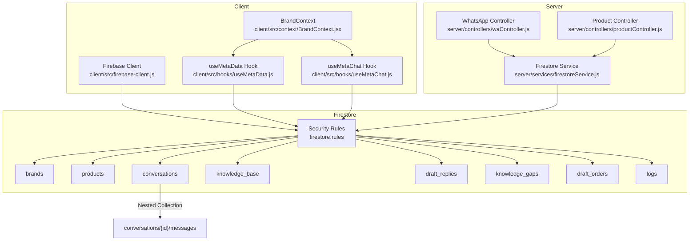
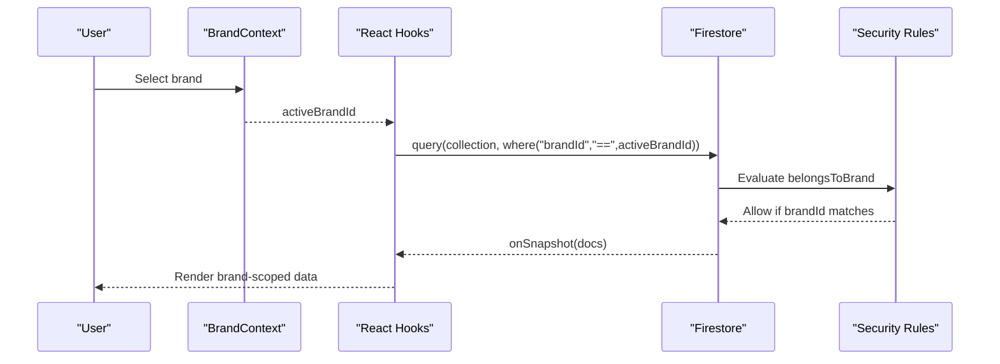
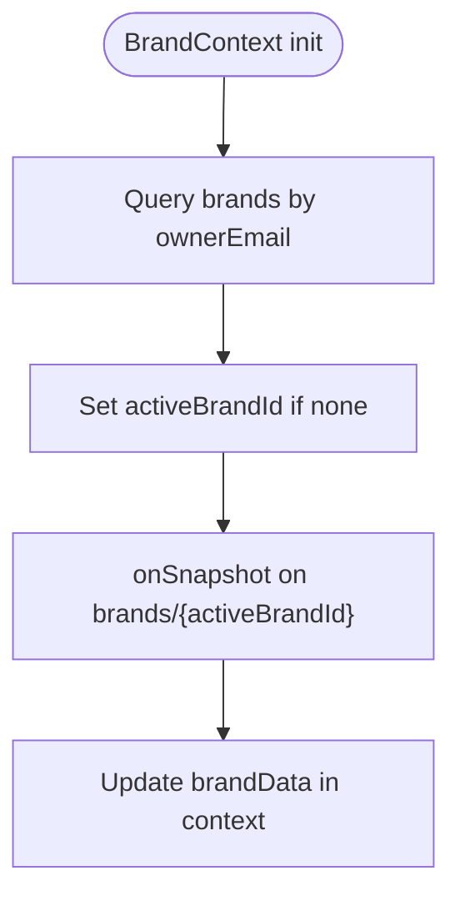
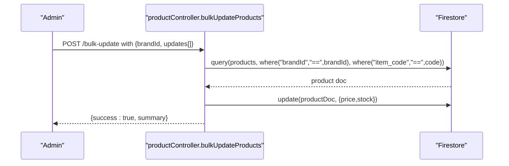
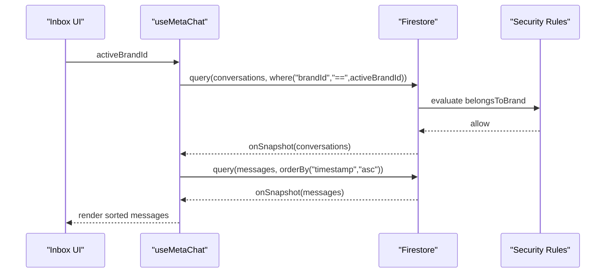
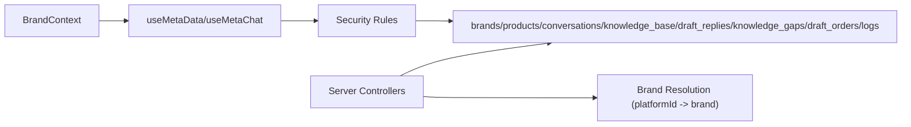

# Firestore Schema Structure

<cite>
**Referenced Files in This Document**
- [firestore.rules](file://firestore.rules)
- [client/src/firebase-client.js](file://client/src/firebase-client.js)
- [client/src/context/BrandContext.jsx](file://client/src/context/BrandContext.jsx)
- [client/src/hooks/useMetaData.js](file://client/src/hooks/useMetaData.js)
- [client/src/hooks/useMetaChat.js](file://client/src/hooks/useMetaChat.js)
- [server/services/firestoreService.js](file://server/services/firestoreService.js)
- [server/controllers/waController.js](file://server/controllers/waController.js)
- [server/controllers/productController.js](file://server/controllers/productController.js)
</cite>

## Table of Contents
1. [Introduction](#introduction)
2. [Project Structure](#project-structure)
3. [Core Components](#core-components)
4. [Architecture Overview](#architecture-overview)
5. [Detailed Component Analysis](#detailed-component-analysis)
6. [Dependency Analysis](#dependency-analysis)
7. [Performance Considerations](#performance-considerations)
8. [Troubleshooting Guide](#troubleshooting-guide)
9. [Conclusion](#conclusion)

## Introduction
This document describes the Firestore database schema used by the application, focusing on the collections that power brand-centric operations: brands, products, conversations, knowledge_base, draft_replies, knowledge_gaps, draft_orders, and logs. It explains document structure, field definitions, relationships, brand-based access control, and real-time synchronization patterns used by frontend components.

## Project Structure
The schema is enforced by Firestore Security Rules and consumed by client-side React hooks and server-side controllers. The client initializes Firebase and listens to brand-scoped collections. The server resolves brand context from platform identifiers and writes brand-scoped documents.

**Diagram sources**
- [client/src/firebase-client.js:1-26](file://client/src/firebase-client.js#L1-L26)
- [client/src/context/BrandContext.jsx:1-250](file://client/src/context/BrandContext.jsx#L1-L250)
- [client/src/hooks/useMetaData.js:1-83](file://client/src/hooks/useMetaData.js#L1-L83)
- [client/src/hooks/useMetaChat.js:1-245](file://client/src/hooks/useMetaChat.js#L1-L245)
- [server/services/firestoreService.js:1-126](file://server/services/firestoreService.js#L1-L126)
- [server/controllers/waController.js:1-680](file://server/controllers/waController.js#L1-L680)
- [server/controllers/productController.js:1-87](file://server/controllers/productController.js#L1-L87)
- [firestore.rules:1-51](file://firestore.rules#L1-L51)

**Section sources**
- [client/src/firebase-client.js:1-26](file://client/src/firebase-client.js#L1-L26)
- [client/src/context/BrandContext.jsx:1-250](file://client/src/context/BrandContext.jsx#L1-L250)
- [client/src/hooks/useMetaData.js:1-83](file://client/src/hooks/useMetaData.js#L1-L83)
- [client/src/hooks/useMetaChat.js:1-245](file://client/src/hooks/useMetaChat.js#L1-L245)
- [server/services/firestoreService.js:1-126](file://server/services/firestoreService.js#L1-L126)
- [server/controllers/waController.js:1-680](file://server/controllers/waController.js#L1-L680)
- [server/controllers/productController.js:1-87](file://server/controllers/productController.js#L1-L87)
- [firestore.rules:1-51](file://firestore.rules#L1-L51)

## Core Components
This section outlines each collection, its purpose, brand scoping, and typical fields observed in the codebase.

- brands
  - Purpose: Stores brand profiles and configuration.
  - Key fields observed: ownerEmail, ownerId, plan, planStatus, planExpiry, usageLimits, usageStats, blueprint, config, permissions, onboardingStep, isPrototype, and timestamps.
  - Access control: Read/write allowed broadly in rules; intended to be restricted to system admins in production.
  - Typical operations: Create brand, update usage stats, listen to brand document for real-time updates.

- products
  - Purpose: Product catalog scoped per brand.
  - Key fields observed: brandId, name, price, sku, description, category, stock, status, images, createdAt.
  - Access control: Read publicly; write requires brand ownership.
  - Typical operations: Bulk updates by item_code and brandId; used as context for AI responses.

- conversations
  - Purpose: Inbox threads per brand; nested messages subcollection.
  - Key fields observed: brandId, platform, name, lastMessage, timestamp, unread, lastMessageTimestamp, customerPhone, customerAddress, botState, linkedConvos, isLead.
  - Access control: Read/write allowed broadly; filtering by brandId in queries.
  - Nested collection: conversations/{id}/messages.

- knowledge_base
  - Purpose: Knowledge base entries scoped per brand.
  - Key fields observed: brandId, keywords (array), answer, title, category, status, createdAt.
  - Access control: Read publicly; write requires brand ownership.

- draft_replies
  - Purpose: Draft replies and canned responses scoped per brand.
  - Key fields observed: brandId, keyword, result, variations (array), status, type, successCount, timestamp.
  - Access control: Read/write requires brand ownership.

- knowledge_gaps
  - Purpose: Identified knowledge gaps scoped per brand.
  - Key fields observed: brandId, topic, context, suggestedAnswer, status, createdAt.
  - Access control: Read/write requires brand ownership.

- draft_orders
  - Purpose: Draft order templates scoped per brand.
  - Key fields observed: brandId, items, customerInfo, total, status, createdAt.
  - Access control: Read/write requires brand ownership.

- logs
  - Purpose: Audit and operational logs scoped per brand.
  - Key fields observed: brandId, type, platform, text, sender_wa_id, timestamp.
  - Access control: Create allowed; read requires brand ownership.

**Section sources**
- [client/src/context/BrandContext.jsx:77-160](file://client/src/context/BrandContext.jsx#L77-L160)
- [client/src/hooks/useMetaData.js:14-83](file://client/src/hooks/useMetaData.js#L14-L83)
- [client/src/hooks/useMetaChat.js:30-101](file://client/src/hooks/useMetaChat.js#L30-L101)
- [server/controllers/waController.js:398-426](file://server/controllers/waController.js#L398-L426)
- [server/controllers/waController.js:170-254](file://server/controllers/waController.js#L170-L254)
- [server/controllers/waController.js:267-308](file://server/controllers/waController.js#L267-L308)
- [server/controllers/waController.js:543-603](file://server/controllers/waController.js#L543-L603)
- [server/controllers/productController.js:30-64](file://server/controllers/productController.js#L30-L64)
- [firestore.rules:11-48](file://firestore.rules#L11-L48)

## Architecture Overview
Brand-based access control is the central security mechanism. The brandId field acts as the primary boundary:
- Frontend: BrandContext determines activeBrandId and scopes all Firestore queries to brandId.
- Backend: Controllers resolve brand context from platform identifiers and enforce brandId scoping for writes.
- Rules: The belongsToBrand helper enforces that reads/writes match the requesting or existing document’s brandId.

**Diagram sources**
- [client/src/context/BrandContext.jsx:200-223](file://client/src/context/BrandContext.jsx#L200-L223)
- [client/src/hooks/useMetaData.js:14-83](file://client/src/hooks/useMetaData.js#L14-L83)
- [client/src/hooks/useMetaChat.js:30-101](file://client/src/hooks/useMetaChat.js#L30-L101)
- [firestore.rules:4-9](file://firestore.rules#L4-L9)

## Detailed Component Analysis

### brands
- Purpose: Central brand profile and plan/usage data.
- Typical fields: ownerEmail, ownerId, plan, planStatus, planExpiry, usageLimits, usageStats, blueprint, config, permissions, onboardingStep, isPrototype, createdAt.
- Real-time pattern: onSnapshot on the brand document to keep UI in sync with plan and usage changes.

**Diagram sources**
- [client/src/context/BrandContext.jsx:15-60](file://client/src/context/BrandContext.jsx#L15-L60)
- [client/src/context/BrandContext.jsx:200-223](file://client/src/context/BrandContext.jsx#L200-L223)

**Section sources**
- [client/src/context/BrandContext.jsx:77-160](file://client/src/context/BrandContext.jsx#L77-L160)
- [client/src/context/BrandContext.jsx:178-194](file://client/src/context/BrandContext.jsx#L178-L194)
- [client/src/context/BrandContext.jsx:200-223](file://client/src/context/BrandContext.jsx#L200-L223)

### products
- Purpose: Product catalog used for context in AI and reply generation.
- Typical fields: brandId, name, price, sku, description, category, stock, status, images, createdAt.
- Operations: Bulk updates by item_code and brandId; used to build prompts for AI.

**Diagram sources**
- [server/controllers/productController.js:6-82](file://server/controllers/productController.js#L6-L82)

**Section sources**
- [server/controllers/productController.js:30-64](file://server/controllers/productController.js#L30-L64)

### conversations and nested messages
- Purpose: Inbox threads and message history per brand.
- Typical fields: brandId, platform, name, lastMessage, timestamp, unread, lastMessageTimestamp, customerPhone, customerAddress, botState, linkedConvos, isLead, and nested messages with text, type, brandId, platform, timestamp, time.
- Real-time pattern: onSnapshot on conversations with brandId filter; onSnapshot on conversations/{id}/messages ordered by timestamp.

**Diagram sources**
- [client/src/hooks/useMetaChat.js:30-101](file://client/src/hooks/useMetaChat.js#L30-L101)
- [firestore.rules:20-26](file://firestore.rules#L20-L26)

**Section sources**
- [client/src/hooks/useMetaChat.js:30-101](file://client/src/hooks/useMetaChat.js#L30-L101)

### knowledge_base
- Purpose: Brand-scoped knowledge articles used for deterministic replies.
- Typical fields: brandId, keywords (array), answer, title, category, status, createdAt.
- Real-time pattern: onSnapshot on knowledge_base filtered by brandId.

**Section sources**
- [client/src/hooks/useMetaData.js:30-36](file://client/src/hooks/useMetaData.js#L30-L36)
- [server/controllers/waController.js:141-151](file://server/controllers/waController.js#L141-L151)

### draft_replies
- Purpose: Brand-scoped draft replies and canned responses.
- Typical fields: brandId, keyword, result, variations (array), status, type, successCount, timestamp.
- Real-time pattern: onSnapshot on draft_replies filtered by brandId; fuzzy matching against variations.

**Section sources**
- [client/src/hooks/useMetaData.js:22-28](file://client/src/hooks/useMetaData.js#L22-L28)
- [server/controllers/waController.js:170-254](file://server/controllers/waController.js#L170-L254)

### knowledge_gaps
- Purpose: Brand-scoped knowledge gaps identified for training.
- Typical fields: brandId, topic, context, suggestedAnswer, status, createdAt.
- Real-time pattern: onSnapshot on knowledge_gaps filtered by brandId.

**Section sources**
- [client/src/hooks/useMetaData.js:14-20](file://client/src/hooks/useMetaData.js#L14-L20)

### draft_orders
- Purpose: Brand-scoped draft order templates.
- Typical fields: brandId, items, customerInfo, total, status, createdAt.
- Access control: Read/write requires brand ownership.

**Section sources**
- [firestore.rules:41-43](file://firestore.rules#L41-L43)

### logs
- Purpose: Brand-scoped audit and operational logs.
- Typical fields: brandId, type, platform, text, sender_wa_id, timestamp.
- Access control: Create allowed; read requires brand ownership.

**Section sources**
- [server/controllers/waController.js:385-392](file://server/controllers/waController.js#L385-L392)
- [firestore.rules:45-48](file://firestore.rules#L45-L48)

## Dependency Analysis
- BrandContext supplies activeBrandId to all hooks that query brand-scoped collections.
- Security Rules rely on brandId to enforce access boundaries.
- Server controllers resolve brand context from platform identifiers and write brand-scoped documents.
- Frontend hooks use onSnapshot to maintain real-time synchronization.

**Diagram sources**
- [client/src/context/BrandContext.jsx:15-60](file://client/src/context/BrandContext.jsx#L15-L60)
- [client/src/hooks/useMetaData.js:14-83](file://client/src/hooks/useMetaData.js#L14-L83)
- [client/src/hooks/useMetaChat.js:30-101](file://client/src/hooks/useMetaChat.js#L30-L101)
- [firestore.rules:4-9](file://firestore.rules#L4-L9)
- [server/services/firestoreService.js:56-114](file://server/services/firestoreService.js#L56-L114)
- [server/controllers/waController.js:54-75](file://server/controllers/waController.js#L54-L75)

**Section sources**
- [client/src/context/BrandContext.jsx:15-60](file://client/src/context/BrandContext.jsx#L15-L60)
- [client/src/hooks/useMetaData.js:14-83](file://client/src/hooks/useMetaData.js#L14-L83)
- [client/src/hooks/useMetaChat.js:30-101](file://client/src/hooks/useMetaChat.js#L30-L101)
- [firestore.rules:4-9](file://firestore.rules#L4-L9)
- [server/services/firestoreService.js:56-114](file://server/services/firestoreService.js#L56-L114)
- [server/controllers/waController.js:54-75](file://server/controllers/waController.js#L54-L75)

## Performance Considerations
- Indexing for ordering: The messages listener orders by timestamp. If a composite index is missing, the listener falls back to an unordered query and sorts client-side. Ensure a compound index exists for conversations/{id}/messages by (brandId, timestamp) to avoid fallback costs.
- Query scoping: Always filter by brandId to minimize document reads and improve performance.
- Batch operations: Use server-side batch updates for bulk product changes to reduce round trips.
- Real-time listeners: Prefer lightweight initial queries and incremental updates to avoid unnecessary re-renders.

[No sources needed since this section provides general guidance]

## Troubleshooting Guide
- Missing composite index for message ordering:
  - Symptom: Listener fails with a precondition/unimplemented error when ordering by timestamp.
  - Resolution: Create a composite index for conversations/{id}/messages by (brandId, timestamp) as indicated by the fallback logic in the chat hook.
  - Evidence: [client/src/hooks/useMetaChat.js:85-99](file://client/src/hooks/useMetaChat.js#L85-L99)

- Unauthorized access:
  - Symptom: Writes or reads denied by rules.
  - Resolution: Ensure brandId is present and matches the authenticated user’s brand context.
  - Evidence: [firestore.rules:4-9](file://firestore.rules#L4-L9)

- Brand context not set:
  - Symptom: Queries return no results.
  - Resolution: Verify BrandContext sets activeBrandId and that BrandContext is initialized before hooks run.
  - Evidence: [client/src/context/BrandContext.jsx:33-35](file://client/src/context/BrandContext.jsx#L33-L35)

- Server-side brand resolution:
  - Symptom: Platform events not associated with a brand.
  - Resolution: Confirm platformId mapping and environment fallback logic.
  - Evidence: [server/services/firestoreService.js:56-114](file://server/services/firestoreService.js#L56-L114)

**Section sources**
- [client/src/hooks/useMetaChat.js:85-99](file://client/src/hooks/useMetaChat.js#L85-L99)
- [firestore.rules:4-9](file://firestore.rules#L4-L9)
- [client/src/context/BrandContext.jsx:33-35](file://client/src/context/BrandContext.jsx#L33-L35)
- [server/services/firestoreService.js:56-114](file://server/services/firestoreService.js#L56-L114)

## Conclusion
The schema centers on brandId as the primary security and scoping boundary. Frontend hooks and server controllers consistently apply brandId filters and updates, while Firestore Security Rules enforce access control. Real-time synchronization is achieved through onSnapshot listeners scoped to brandId, with graceful fallbacks for missing indexes. Proper indexing and consistent brandId usage are essential for correctness and performance.