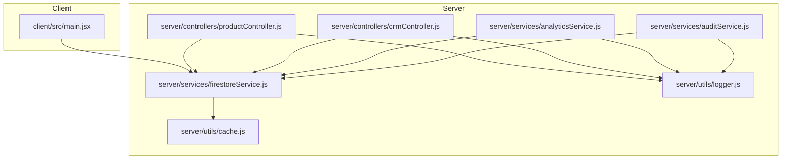
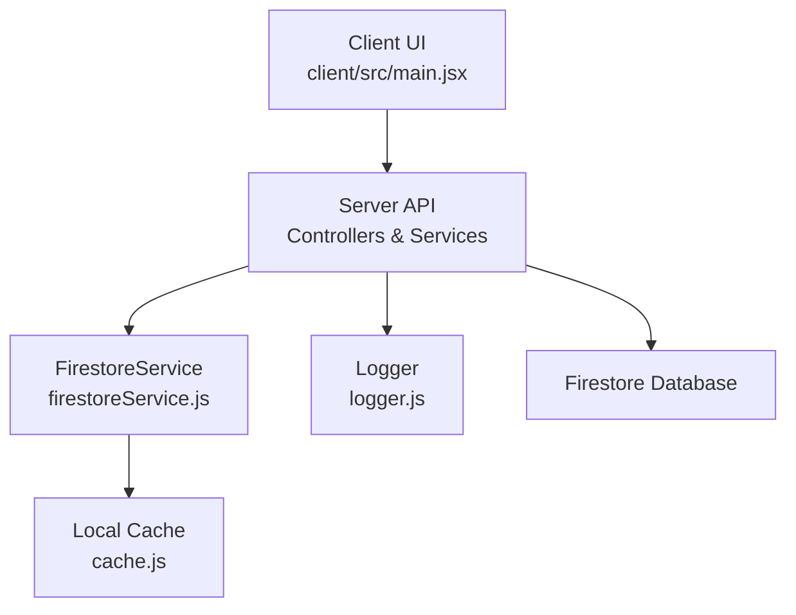
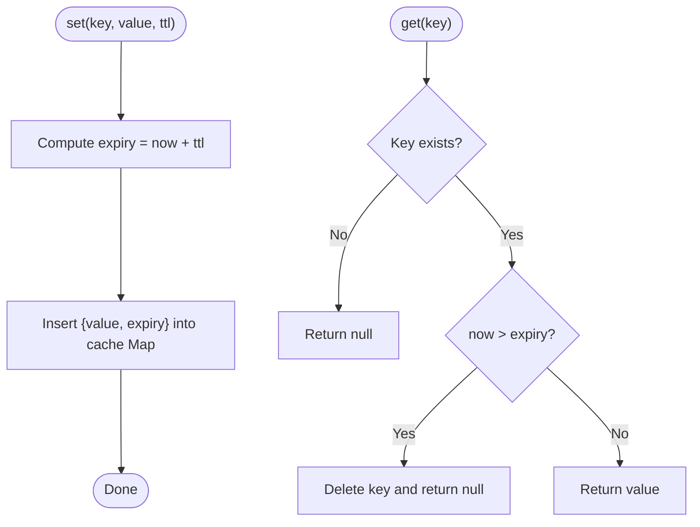
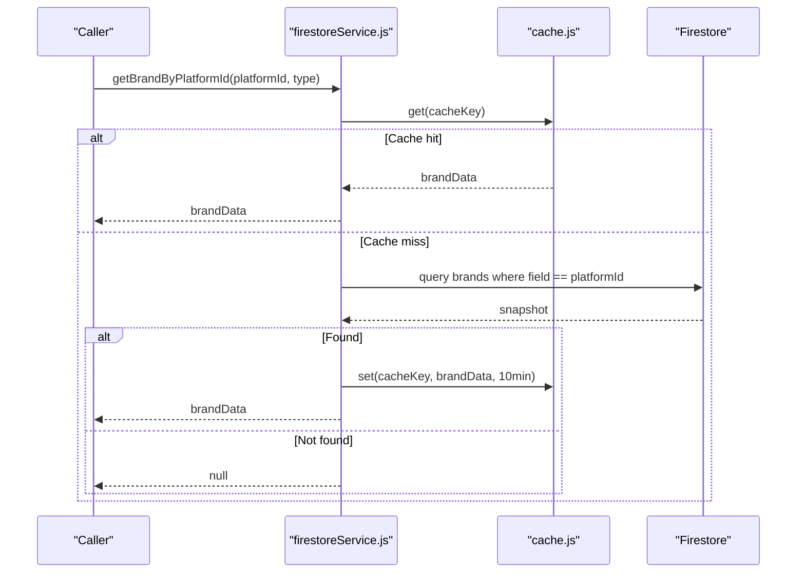
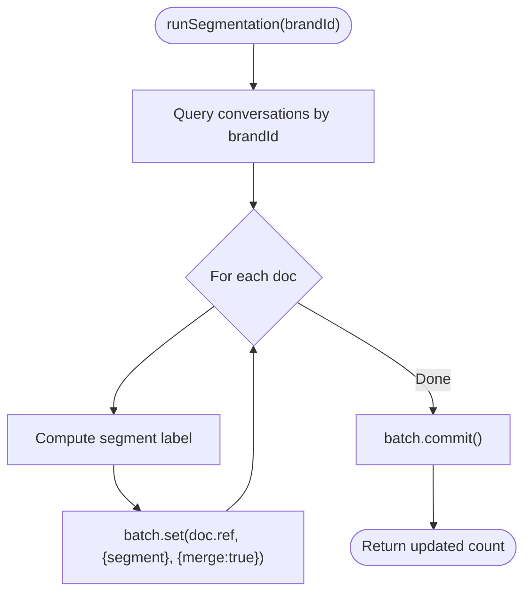
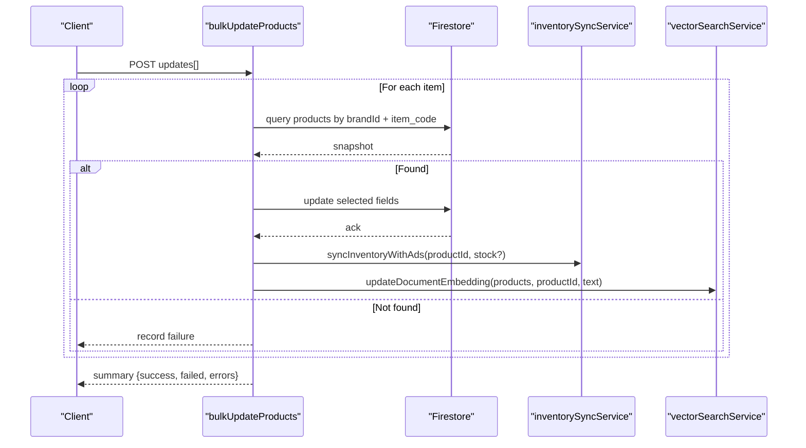
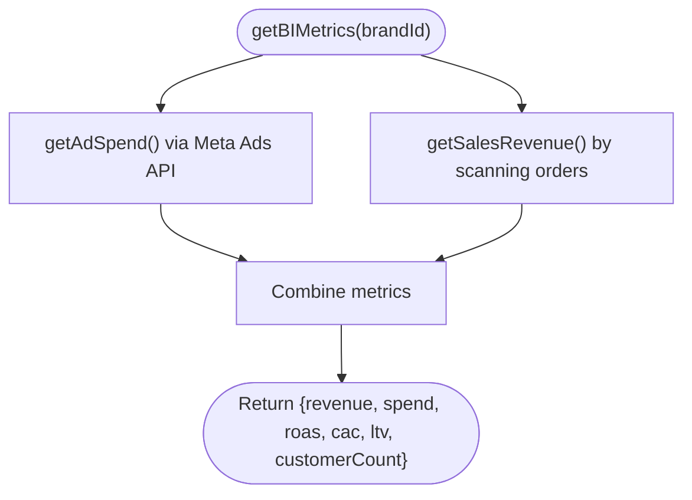
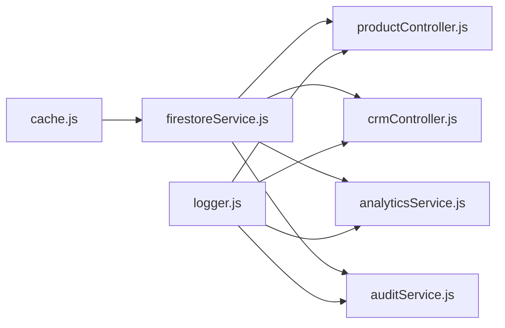

# Performance and Caching Strategies

<cite>
**Referenced Files in This Document**
- [cache.js](file://server/utils/cache.js)
- [firestoreService.js](file://server/services/firestoreService.js)
- [productController.js](file://server/controllers/productController.js)
- [crmController.js](file://server/controllers/crmController.js)
- [analyticsService.js](file://server/services/analyticsService.js)
- [auditService.js](file://server/services/auditService.js)
- [logger.js](file://server/utils/logger.js)
- [main.jsx](file://client/src/main.jsx)
</cite>

## Table of Contents
1. [Introduction](#introduction)
2. [Project Structure](#project-structure)
3. [Core Components](#core-components)
4. [Architecture Overview](#architecture-overview)
5. [Detailed Component Analysis](#detailed-component-analysis)
6. [Dependency Analysis](#dependency-analysis)
7. [Performance Considerations](#performance-considerations)
8. [Troubleshooting Guide](#troubleshooting-guide)
9. [Conclusion](#conclusion)
10. [Appendices](#appendices)

## Introduction
This document provides a comprehensive guide to performance optimization strategies for Firestore-based applications. It focuses on caching mechanisms, query and indexing patterns, pagination for large datasets, FirestoreService abstractions, batch and transaction handling, performance monitoring, bottleneck identification, scaling considerations, and frontend rendering optimizations with cached data.

## Project Structure
The repository organizes performance-critical logic primarily in two areas:
- Server utilities and services: caching, Firestore abstraction, controllers, and analytics
- Client application bootstrap and context providers

**Diagram sources**
- [main.jsx:1-12](file://client/src/main.jsx#L1-L12)
- [firestoreService.js:1-126](file://server/services/firestoreService.js#L1-L126)
- [cache.js:1-45](file://server/utils/cache.js#L1-L45)
- [productController.js:1-87](file://server/controllers/productController.js#L1-L87)
- [crmController.js:1-78](file://server/controllers/crmController.js#L1-L78)
- [analyticsService.js:1-81](file://server/services/analyticsService.js#L1-L81)
- [auditService.js:1-25](file://server/services/auditService.js#L1-L25)
- [logger.js:1-10](file://server/utils/logger.js#L1-L10)

**Section sources**
- [main.jsx:1-12](file://client/src/main.jsx#L1-L12)
- [firestoreService.js:1-126](file://server/services/firestoreService.js#L1-L126)
- [cache.js:1-45](file://server/utils/cache.js#L1-L45)

## Core Components
- Local in-memory cache with TTL and eviction
- FirestoreService abstraction encapsulating initialization, brand lookup with caching, and server timestamp utilities
- Controllers leveraging Firestore queries and batch writes
- Analytics and audit services performing Firestore reads/writes
- Logging utilities for performance monitoring

Key responsibilities:
- cache.js: set/get/clear with TTL-based expiration
- firestoreService.js: initialize Firebase Admin SDK, expose Firestore database, and provide a cached brand lookup helper
- productController.js: bulk update with per-item Firestore updates and async embedding updates
- crmController.js: batch segmentation and stats aggregation
- analyticsService.js: revenue retrieval and BI metrics computation
- auditService.js: non-blocking audit logging
- logger.js: server-side logging

**Section sources**
- [cache.js:1-45](file://server/utils/cache.js#L1-L45)
- [firestoreService.js:1-126](file://server/services/firestoreService.js#L1-L126)
- [productController.js:1-87](file://server/controllers/productController.js#L1-L87)
- [crmController.js:1-78](file://server/controllers/crmController.js#L1-L78)
- [analyticsService.js:1-81](file://server/services/analyticsService.js#L1-L81)
- [auditService.js:1-25](file://server/services/auditService.js#L1-L25)
- [logger.js:1-10](file://server/utils/logger.js#L1-L10)

## Architecture Overview
The system follows a layered architecture:
- Client renders UI and consumes context providers
- Server exposes controllers and services
- Services abstract Firestore operations and caching
- Utilities provide logging and local caching

**Diagram sources**
- [main.jsx:1-12](file://client/src/main.jsx#L1-L12)
- [firestoreService.js:1-126](file://server/services/firestoreService.js#L1-L126)
- [cache.js:1-45](file://server/utils/cache.js#L1-L45)
- [logger.js:1-10](file://server/utils/logger.js#L1-L10)

## Detailed Component Analysis

### Local Cache Implementation (cache.js)
- Data structure: Map-based cache storing value and expiry timestamp
- TTL management: On set, compute expiry as current time plus TTL; on get, compare current time to expiry and evict expired entries
- Cache invalidation: Explicit clear by key or full clear; implicit eviction on expiration
- Memory optimization: Minimal footprint; no LRU or size limits; suitable for small, frequently accessed keys

**Diagram sources**
- [cache.js:1-45](file://server/utils/cache.js#L1-L45)

**Section sources**
- [cache.js:1-45](file://server/utils/cache.js#L1-L45)

### FirestoreService Abstraction (firestoreService.js)
- Initialization: Loads service account from environment or file; supports fallback to project ID; initializes Admin SDK and Firestore
- Brand lookup helper: Computes cache key from platform type and ID; retrieves from cache if present; otherwise performs a single-field equality query against brands collection; caches result for 10 minutes; includes owner-dev fallback logic
- Exposed utilities: FieldValue and serverTimestamp for consistent timestamp handling

**Diagram sources**
- [firestoreService.js:55-114](file://server/services/firestoreService.js#L55-L114)
- [cache.js:1-45](file://server/utils/cache.js#L1-L45)

**Section sources**
- [firestoreService.js:1-126](file://server/services/firestoreService.js#L1-L126)

### Batch Operations and Transactions (crmController.js)
- Segmentation job: Iterates conversation documents for a brand, computes segment label, and batches updates using Firestore batch; commits atomically
- Stats aggregation: Performs a full collection scan filtered by brandId and counts segments; returns totals

**Diagram sources**
- [crmController.js:9-43](file://server/controllers/crmController.js#L9-L43)

**Section sources**
- [crmController.js:1-78](file://server/controllers/crmController.js#L1-L78)

### Bulk Updates and Asynchronous Embeddings (productController.js)
- Bulk update: Validates inputs, finds product by brandId and item_code, applies selective updates, triggers inventory sync, and asynchronously updates embeddings without blocking the response
- Concurrency: Uses Promise.all to process updates concurrently

**Diagram sources**
- [productController.js:6-82](file://server/controllers/productController.js#L6-L82)

**Section sources**
- [productController.js:1-87](file://server/controllers/productController.js#L1-L87)

### Analytics and Audit Logging (analyticsService.js, auditService.js)
- Analytics: Retrieves ad spend via external API and sales revenue by scanning orders; computes ROAS/CAC/LTV
- Audit: Writes structured audit logs to Firestore with timestamp fields; designed to be non-blocking

**Diagram sources**
- [analyticsService.js:54-76](file://server/services/analyticsService.js#L54-L76)

**Section sources**
- [analyticsService.js:1-81](file://server/services/analyticsService.js#L1-L81)
- [auditService.js:1-25](file://server/services/auditService.js#L1-L25)

## Dependency Analysis
- cache.js is used by firestoreService.js for brand lookup caching
- Controllers depend on FirestoreService for database operations
- Services may depend on controllers for orchestration
- Logger is used across controllers and services for performance monitoring

**Diagram sources**
- [cache.js:1-45](file://server/utils/cache.js#L1-L45)
- [firestoreService.js:1-126](file://server/services/firestoreService.js#L1-L126)
- [productController.js:1-87](file://server/controllers/productController.js#L1-L87)
- [crmController.js:1-78](file://server/controllers/crmController.js#L1-L78)
- [analyticsService.js:1-81](file://server/services/analyticsService.js#L1-L81)
- [auditService.js:1-25](file://server/services/auditService.js#L1-L25)
- [logger.js:1-10](file://server/utils/logger.js#L1-L10)

**Section sources**
- [firestoreService.js:1-126](file://server/services/firestoreService.js#L1-L126)
- [cache.js:1-45](file://server/utils/cache.js#L1-L45)
- [productController.js:1-87](file://server/controllers/productController.js#L1-L87)
- [crmController.js:1-78](file://server/controllers/crmController.js#L1-L78)
- [analyticsService.js:1-81](file://server/services/analyticsService.js#L1-L81)
- [auditService.js:1-25](file://server/services/auditService.js#L1-L25)
- [logger.js:1-10](file://server/utils/logger.js#L1-L10)

## Performance Considerations

### Caching Mechanisms
- TTL Management: Cache entries expire after a computed expiry time; expired entries are evicted on access
- Cache Invalidation: Explicit clear by key or full clear; implicit eviction on expiration
- Memory Optimization: Map-based cache with minimal overhead; suitable for small, frequently accessed keys; consider adding size limits or LRU for larger workloads
- Application-Level Caching: Brand lookup helper caches results for 10 minutes to reduce repeated queries

Recommendations:
- Add cache hit/miss metrics and eviction counters
- Introduce cache warming for hot keys
- Consider Redis or in-memory stores with TTL for distributed environments

**Section sources**
- [cache.js:1-45](file://server/utils/cache.js#L1-L45)
- [firestoreService.js:55-114](file://server/services/firestoreService.js#L55-L114)

### Query Optimization Patterns
- Equality Filters: Prefer equality filters on indexed fields (e.g., brandId, item_code)
- Projection: Limit returned fields to reduce payload size
- Pagination: Use cursor-based pagination for large datasets
- Composite Indexes: Ensure composite indexes exist for multi-field filters and orderings

Current patterns observed:
- Single equality filter queries for brands and products
- Full collection scans for segmentation and revenue calculation

Recommendations:
- Add composite indexes for frequent filters and sorts
- Implement pagination for segmentation and analytics endpoints
- Use projection to limit fields returned

**Section sources**
- [firestoreService.js:65-70](file://server/services/firestoreService.js#L65-L70)
- [productController.js:30-40](file://server/controllers/productController.js#L30-L40)
- [crmController.js:14-16](file://server/controllers/crmController.js#L14-L16)
- [analyticsService.js:35-44](file://server/services/analyticsService.js#L35-L44)

### Indexing Strategies
- Single-field indexes: Ensure brandId, item_code, isCustomer, segment are indexed
- Composite indexes: Create composite indexes for multi-field filters (e.g., brandId + item_code, brandId + timestamp)
- Ordering: When ordering by a field, include it in the index

Recommendations:
- Review query patterns and create indexes accordingly
- Monitor query costs and adjust indexes to minimize collection scans

**Section sources**
- [firestoreService.js:61-65](file://server/services/firestoreService.js#L61-L65)
- [productController.js:30-34](file://server/controllers/productController.js#L30-L34)
- [crmController.js:14-16](file://server/controllers/crmController.js#L14-L16)
- [analyticsService.js:58-60](file://server/services/analyticsService.js#L58-L60)

### Pagination Implementation for Large Datasets
- Cursor-based pagination: Use startAfter with last document snapshot for subsequent pages
- Page size tuning: Balance between latency and throughput
- Background loading: Preload next page while user scrolls

Recommendations:
- Apply to segmentation and analytics endpoints
- Implement server-side pagination in controllers

**Section sources**
- [crmController.js:14-16](file://server/controllers/crmController.js#L14-L16)
- [analyticsService.js:58-60](file://server/services/analyticsService.js#L58-L60)

### FirestoreService Abstractions
- Initialization: Robust initialization supporting environment variables and file-based credentials
- Utility exports: FieldValue and serverTimestamp for consistent timestamps
- Brand lookup caching: Encapsulates caching logic for brand resolution

Recommendations:
- Centralize Firestore configuration and error handling
- Add retry/backoff for transient failures

**Section sources**
- [firestoreService.js:1-126](file://server/services/firestoreService.js#L1-L126)

### Batch Operations and Transactions
- Batch writes: Use Firestore batch for atomic updates across documents
- Transaction handling: Use transactions for read-modify-write with conflict resolution

Current usage:
- Segmentation uses batch.set with merge
- No explicit transactions observed

Recommendations:
- Use transactions for operations requiring strict consistency
- Monitor batch sizes and commit frequency

**Section sources**
- [crmController.js:19-36](file://server/controllers/crmController.js#L19-L36)

### Performance Monitoring and Bottleneck Identification
- Logging: Use serverLog for timing and error reporting
- Metrics: Track query counts, latency, cache hit rates, and batch commit times
- Profiling: Identify slow queries and long-running operations

Current usage:
- Logging in controllers and services
- Basic console logging

Recommendations:
- Integrate structured logging with metrics
- Add tracing spans around critical paths
- Monitor Firestore usage quotas and alert on anomalies

**Section sources**
- [logger.js:1-10](file://server/utils/logger.js#L1-L10)
- [productController.js:13-13](file://server/controllers/productController.js#L13-L13)
- [crmController.js:37-37](file://server/controllers/crmController.js#L37-L37)
- [analyticsService.js:55-56](file://server/services/analyticsService.js#L55-L56)

### Scaling Considerations for High-Volume Applications
- Horizontal scaling: Distribute load across instances
- Database scaling: Optimize indexes and queries; consider sharding by brandId
- Caching: Increase cache TTL for stable data; add cache warming
- Asynchronous processing: Offload heavy computations to background tasks

Recommendations:
- Implement rate limiting and circuit breakers
- Use CDN for static assets
- Monitor and scale Firestore capacity

**Section sources**
- [firestoreService.js:55-114](file://server/services/firestoreService.js#L55-L114)
- [productController.js:55-58](file://server/controllers/productController.js#L55-L58)

### Frontend Rendering with Cached Data and Reactivity
- Context providers: Use BrandProvider to share brand state across components
- Reactive updates: Invalidate or refresh cache on data changes
- Efficient rendering: Memoize derived data and avoid unnecessary re-renders

Recommendations:
- Implement cache invalidation on write operations
- Use React.memo and useMemo for expensive computations
- Debounce frequent updates

**Section sources**
- [main.jsx:4-10](file://client/src/main.jsx#L4-L10)

## Troubleshooting Guide
Common issues and resolutions:
- Cache misses: Verify TTL and key construction; ensure cache is populated before access
- Slow queries: Add appropriate indexes; switch to equality filters; implement pagination
- Batch failures: Check batch size limits; ensure documents exist before update
- Audit logging failures: Non-blocking design prevents crashes; monitor logs for errors
- Initialization errors: Verify service account credentials and environment variables

**Section sources**
- [cache.js:20-30](file://server/utils/cache.js#L20-L30)
- [firestoreService.js:36-51](file://server/services/firestoreService.js#L36-L51)
- [crmController.js:19-36](file://server/controllers/crmController.js#L19-L36)
- [auditService.js:18-22](file://server/services/auditService.js#L18-L22)
- [logger.js:4-7](file://server/utils/logger.js#L4-L7)

## Conclusion
This document outlined performance optimization strategies for Firestore, including local caching with TTL, query and indexing improvements, pagination, batch and transaction usage, monitoring, and scaling. Applying these patterns will improve responsiveness, reduce costs, and support growth for high-volume applications. The provided diagrams and references help map strategies to concrete implementations in the repository.

## Appendices
- Best practices checklist:
  - Add composite indexes for multi-field filters
  - Implement cursor-based pagination
  - Use batch writes for atomic updates
  - Monitor cache hit rates and query latency
  - Log and alert on performance regressions