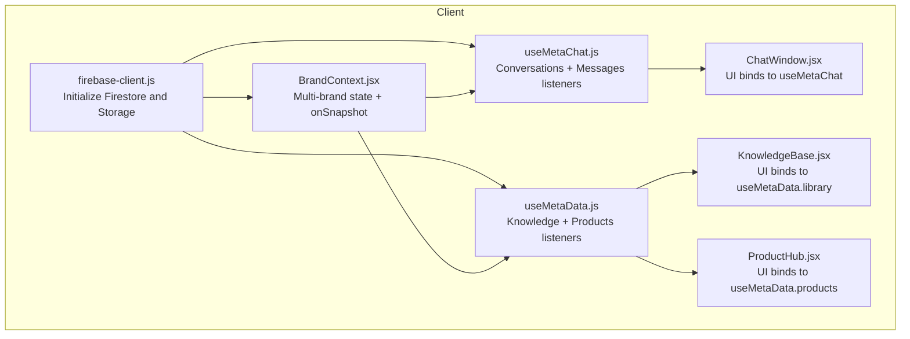
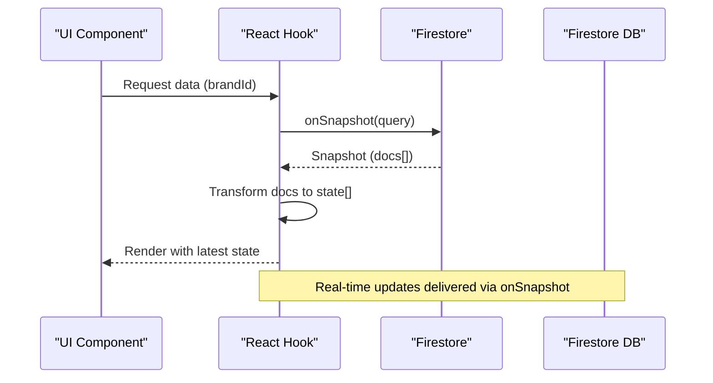
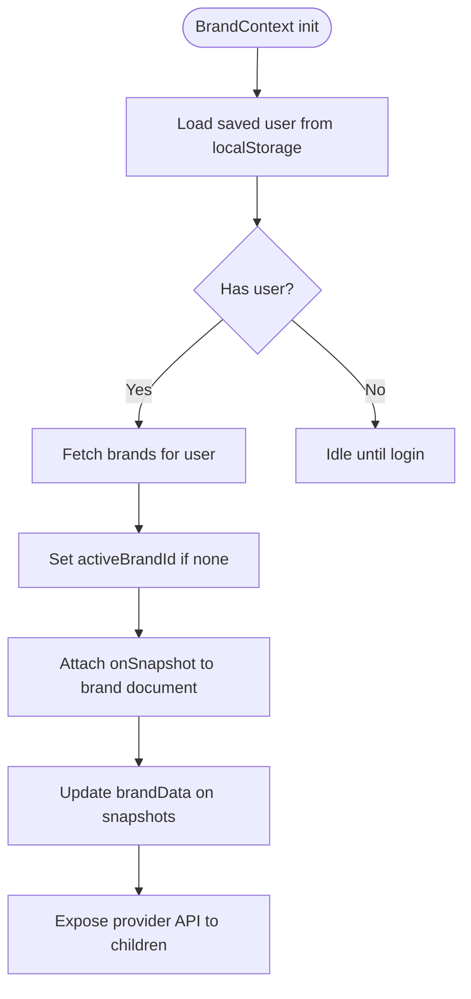
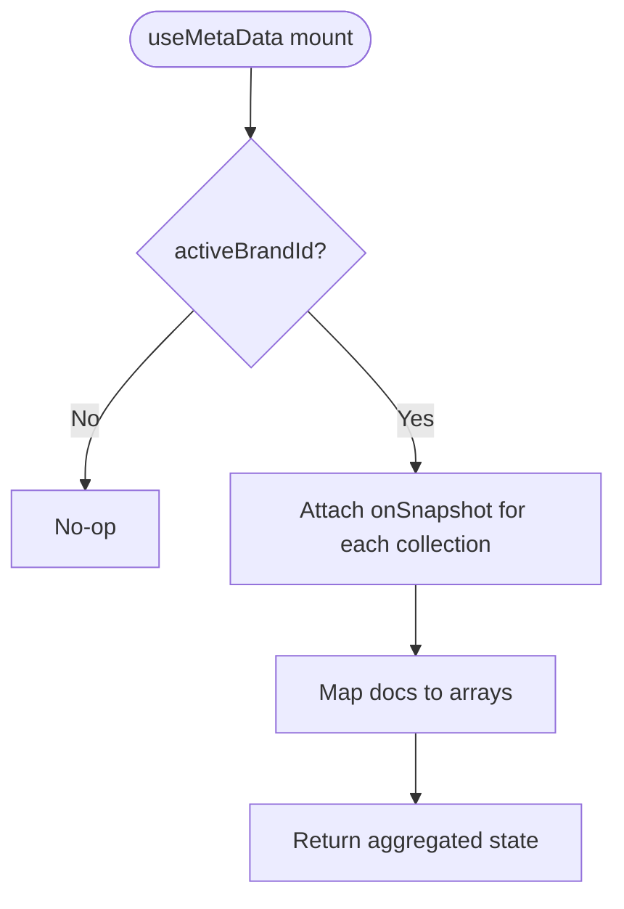
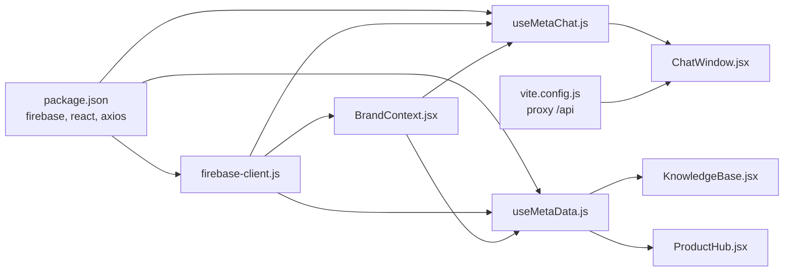

# Real-time Data Synchronization

<cite>
**Referenced Files in This Document**
- [BrandContext.jsx](file://client/src/context/BrandContext.jsx)
- [useMetaChat.js](file://client/src/hooks/useMetaChat.js)
- [useMetaData.js](file://client/src/hooks/useMetaData.js)
- [firebase-client.js](file://client/src/firebase-client.js)
- [ChatWindow.jsx](file://client/src/components/Inbox/ChatWindow.jsx)
- [KnowledgeBase.jsx](file://client/src/components/Views/KnowledgeBase.jsx)
- [ProductHub.jsx](file://client/src/components/Views/ProductHub.jsx)
- [package.json](file://client/package.json)
- [vite.config.js](file://client/vite.config.js)
</cite>

## Table of Contents
1. [Introduction](#introduction)
2. [Project Structure](#project-structure)
3. [Core Components](#core-components)
4. [Architecture Overview](#architecture-overview)
5. [Detailed Component Analysis](#detailed-component-analysis)
6. [Dependency Analysis](#dependency-analysis)
7. [Performance Considerations](#performance-considerations)
8. [Troubleshooting Guide](#troubleshooting-guide)
9. [Conclusion](#conclusion)
10. [Appendices](#appendices)

## Introduction
This document explains real-time data synchronization patterns implemented in the client using Firestore listeners and React hooks. It focuses on:
- BrandContext managing multi-brand state with real-time updates
- useMetaChat enabling optimistic updates and synchronized messaging
- useMetaData aggregating knowledge base and product data in real time
- Practical guidance on Firestore query listeners, snapshot handling, offline persistence, conflict resolution, performance, memory management, error handling, and debugging

## Project Structure
The client integrates Firebase Firestore and Storage with React hooks and context to deliver real-time experiences across inbox, knowledge base, and product management.

**Diagram sources**
- [firebase-client.js:1-26](file://client/src/firebase-client.js#L1-L26)
- [BrandContext.jsx:1-250](file://client/src/context/BrandContext.jsx#L1-L250)
- [useMetaChat.js:1-245](file://client/src/hooks/useMetaChat.js#L1-L245)
- [useMetaData.js:1-84](file://client/src/hooks/useMetaData.js#L1-L84)
- [ChatWindow.jsx:1-478](file://client/src/components/Inbox/ChatWindow.jsx#L1-L478)
- [KnowledgeBase.jsx:1-163](file://client/src/components/Views/KnowledgeBase.jsx#L1-L163)
- [ProductHub.jsx:1-732](file://client/src/components/Views/ProductHub.jsx#L1-L732)

**Section sources**
- [firebase-client.js:1-26](file://client/src/firebase-client.js#L1-L26)
- [BrandContext.jsx:1-250](file://client/src/context/BrandContext.jsx#L1-L250)
- [useMetaChat.js:1-245](file://client/src/hooks/useMetaChat.js#L1-L245)
- [useMetaData.js:1-84](file://client/src/hooks/useMetaData.js#L1-L84)
- [ChatWindow.jsx:1-478](file://client/src/components/Inbox/ChatWindow.jsx#L1-L478)
- [KnowledgeBase.jsx:1-163](file://client/src/components/Views/KnowledgeBase.jsx#L1-L163)
- [ProductHub.jsx:1-732](file://client/src/components/Views/ProductHub.jsx#L1-L732)

## Core Components
- BrandContext: Provides multi-brand selection, brand data subscription, and usage stats updates. It attaches a real-time listener to the active brand document and exposes loading and state controls.
- useMetaChat: Manages conversations and messages lists, implements optimistic UI for sending, and handles fallback ordering when Firestore indexes are unavailable.
- useMetaData: Subscribes to multiple collections (knowledge gaps, drafts, library, products, conversations, orders, comments) and exposes consolidated arrays for UI components.

**Section sources**
- [BrandContext.jsx:1-250](file://client/src/context/BrandContext.jsx#L1-L250)
- [useMetaChat.js:1-245](file://client/src/hooks/useMetaChat.js#L1-L245)
- [useMetaData.js:1-84](file://client/src/hooks/useMetaData.js#L1-L84)

## Architecture Overview
The system uses Firestore’s onSnapshot to keep React components synchronized with backend data. BrandContext centralizes brand selection and applies per-brand filtering to listeners. useMetaChat and useMetaData encapsulate query construction and snapshot handling, while UI components consume derived state.

**Diagram sources**
- [BrandContext.jsx:202-223](file://client/src/context/BrandContext.jsx#L202-L223)
- [useMetaChat.js:31-58](file://client/src/hooks/useMetaChat.js#L31-L58)
- [useMetaData.js:14-52](file://client/src/hooks/useMetaData.js#L14-L52)

## Detailed Component Analysis

### BrandContext: Multi-brand Real-time State
- Responsibilities:
  - Load brands for the current user and set active brand
  - Subscribe to the active brand document for real-time updates
  - Expose loading flags and mutation helpers (e.g., usage stats)
- Key behaviors:
  - Uses onSnapshot on the active brand document to keep brandData reactive
  - Applies brandId-based filtering for all listeners via where("brandId", "==", activeBrandId)
  - Maintains role and user state, persists user to localStorage

**Diagram sources**
- [BrandContext.jsx:162-223](file://client/src/context/BrandContext.jsx#L162-L223)

**Section sources**
- [BrandContext.jsx:1-250](file://client/src/context/BrandContext.jsx#L1-L250)

### useMetaChat: Optimistic Updates and Message Synchronization
- Responsibilities:
  - Manage conversations list with client-side sorting by last message timestamps
  - Stream messages in ascending order by timestamp
  - Implement optimistic UI for sent messages
  - Fallback ordering when Firestore index is missing
- Optimistic update flow:
  - On send, insert a temporary message with a local ID and isOptimistic flag
  - After successful write, remove the optimistic message after a short delay
  - Clear optimistic message on errors

```mermaid
sequenceDiagram
participant UI as "ChatWindow"
participant Hook as "useMetaChat"
participant FS as "Firestore"
participant API as "Server API"
UI->>Hook : handleSendMessage(text, files, product)
Hook->>Hook : Create optimistic message (local tempId)
Hook->>FS : addDoc(messages) with numeric timestamp
Hook->>FS : updateDoc(conversations) lastMessage fields
Hook->>API : POST /api/messages/send (or WhatsApp endpoint)
Hook->>Hook : Remove optimistic message after delay
FS-->>Hook : onSnapshot messages updates
Hook-->>UI : Render latest messages (including optimistic)
```

**Diagram sources**
- [useMetaChat.js:117-201](file://client/src/hooks/useMetaChat.js#L117-L201)
- [ChatWindow.jsx:234-306](file://client/src/components/Inbox/ChatWindow.jsx#L234-L306)

**Section sources**
- [useMetaChat.js:1-245](file://client/src/hooks/useMetaChat.js#L1-L245)
- [ChatWindow.jsx:1-478](file://client/src/components/Inbox/ChatWindow.jsx#L1-L478)

### useMetaData: Knowledge Base and Product Aggregation
- Responsibilities:
  - Subscribe to knowledge gaps, draft replies, knowledge base, products, conversations, orders, comment drafts, and pending comments
  - Apply brandId-based filtering for each collection
  - Expose consolidated arrays for UI views

**Diagram sources**
- [useMetaData.js:14-52](file://client/src/hooks/useMetaData.js#L14-L52)

**Section sources**
- [useMetaData.js:1-84](file://client/src/hooks/useMetaData.js#L1-L84)
- [KnowledgeBase.jsx:1-163](file://client/src/components/Views/KnowledgeBase.jsx#L1-L163)
- [ProductHub.jsx:1-732](file://client/src/components/Views/ProductHub.jsx#L1-L732)

### UI Integration Examples
- ChatWindow consumes useMetaChat to render conversations and messages, including optimistic entries
- KnowledgeBase and ProductHub consume useMetaData to render library and product grids

**Section sources**
- [ChatWindow.jsx:234-306](file://client/src/components/Inbox/ChatWindow.jsx#L234-L306)
- [KnowledgeBase.jsx:1-163](file://client/src/components/Views/KnowledgeBase.jsx#L1-L163)
- [ProductHub.jsx:1-732](file://client/src/components/Views/ProductHub.jsx#L1-L732)

## Dependency Analysis
- Firebase initialization and exports are centralized in firebase-client.js
- React hooks depend on BrandContext for activeBrandId and onSnapshot APIs
- UI components depend on hooks for derived state and callbacks

**Diagram sources**
- [package.json:12-21](file://client/package.json#L12-L21)
- [vite.config.js:7-14](file://client/vite.config.js#L7-L14)
- [firebase-client.js:1-26](file://client/src/firebase-client.js#L1-L26)
- [BrandContext.jsx:1-250](file://client/src/context/BrandContext.jsx#L1-L250)
- [useMetaChat.js:1-245](file://client/src/hooks/useMetaChat.js#L1-L245)
- [useMetaData.js:1-84](file://client/src/hooks/useMetaData.js#L1-L84)
- [ChatWindow.jsx:1-478](file://client/src/components/Inbox/ChatWindow.jsx#L1-L478)
- [KnowledgeBase.jsx:1-163](file://client/src/components/Views/KnowledgeBase.jsx#L1-L163)
- [ProductHub.jsx:1-732](file://client/src/components/Views/ProductHub.jsx#L1-L732)

**Section sources**
- [package.json:1-39](file://client/package.json#L1-L39)
- [vite.config.js:1-16](file://client/vite.config.js#L1-L16)
- [firebase-client.js:1-26](file://client/src/firebase-client.js#L1-L26)
- [BrandContext.jsx:1-250](file://client/src/context/BrandContext.jsx#L1-L250)
- [useMetaChat.js:1-245](file://client/src/hooks/useMetaChat.js#L1-L245)
- [useMetaData.js:1-84](file://client/src/hooks/useMetaData.js#L1-L84)
- [ChatWindow.jsx:1-478](file://client/src/components/Inbox/ChatWindow.jsx#L1-L478)
- [KnowledgeBase.jsx:1-163](file://client/src/components/Views/KnowledgeBase.jsx#L1-L163)
- [ProductHub.jsx:1-732](file://client/src/components/Views/ProductHub.jsx#L1-L732)

## Performance Considerations
- Prefer lightweight queries with brandId filters to minimize dataset size
- Use client-side sorting for small lists (e.g., conversations) to avoid composite indexes
- Keep listeners scoped to active brand and selected conversation to reduce bandwidth and CPU
- Debounce UI updates when batching many snapshot events
- Avoid unnecessary re-renders by memoizing derived data and callbacks
- Use numeric timestamps consistently to prevent ordering inconsistencies across collections

[No sources needed since this section provides general guidance]

## Troubleshooting Guide
- Missing Firestore index:
  - Symptom: orderBy fails with a “missing index” error
  - Resolution: useMetaChat falls back to an unordered query and sorts client-side
- Silent ordering anomalies:
  - Cause: mixing serverTimestamp() objects with numeric timestamps in the same collection
  - Fix: normalize timestamps to numeric milliseconds for consistent ordering
- Network interruptions:
  - Firestore onSnapshot provides an error callback; capture and log errors to surface issues
  - UI should indicate syncing/loading states and retry logic where appropriate
- Memory leaks:
  - Ensure onSnapshot subscriptions are returned and cleaned up in useEffect return functions
  - Avoid accumulating stale listeners when switching brands or closing modals

**Section sources**
- [useMetaChat.js:82-100](file://client/src/hooks/useMetaChat.js#L82-L100)
- [BrandContext.jsx:202-223](file://client/src/context/BrandContext.jsx#L202-L223)

## Conclusion
The application leverages Firestore’s real-time capabilities through onSnapshot to synchronize state across components. BrandContext centralizes brand-aware filtering, while useMetaChat and useMetaData encapsulate query logic and snapshot handling. By applying optimistic UI, fallback ordering, and careful listener lifecycle management, the system achieves responsive, resilient real-time experiences.

[No sources needed since this section summarizes without analyzing specific files]

## Appendices

### Firestore Query Patterns and Best Practices
- Use where("brandId", "==", activeBrandId) to scope data per brand
- For ordered lists, prefer client-side sort when Firestore index is unavailable
- Normalize timestamps to numeric milliseconds to ensure consistent ordering
- Keep listeners minimal and scoped to active selections

**Section sources**
- [BrandContext.jsx:34-58](file://client/src/context/BrandContext.jsx#L34-L58)
- [useMetaChat.js:31-58](file://client/src/hooks/useMetaChat.js#L31-L58)
- [useMetaData.js:14-52](file://client/src/hooks/useMetaData.js#L14-L52)

### Offline Persistence and Conflict Resolution
- Firestore SDK enables offline persistence by default; changes queue locally and sync when connectivity resumes
- Conflict resolution:
  - Use optimistic UI for immediate feedback, then reconcile with server state
  - For concurrent edits, prefer server timestamps and merge strategies in your write operations
  - Monitor error callbacks from onSnapshot and handle transient failures gracefully

**Section sources**
- [useMetaChat.js:117-201](file://client/src/hooks/useMetaChat.js#L117-L201)
- [BrandContext.jsx:202-223](file://client/src/context/BrandContext.jsx#L202-L223)

### Implementing Custom Real-time Features
- Steps:
  - Determine the target collection and filter keys (e.g., brandId)
  - Create a React hook with useEffect that constructs a query and attaches onSnapshot
  - Map snapshot docs to state arrays and expose setters for mutations
  - Integrate with UI components and handle error callbacks
- Example pattern:
  - useBrand for activeBrandId
  - query(collection(db, "your_collection"), where("brandId", "==", activeBrandId))
  - onSnapshot(query, snapshot => setState(...))

**Section sources**
- [BrandContext.jsx:1-250](file://client/src/context/BrandContext.jsx#L1-L250)
- [useMetaChat.js:1-245](file://client/src/hooks/useMetaChat.js#L1-L245)
- [useMetaData.js:1-84](file://client/src/hooks/useMetaData.js#L1-L84)