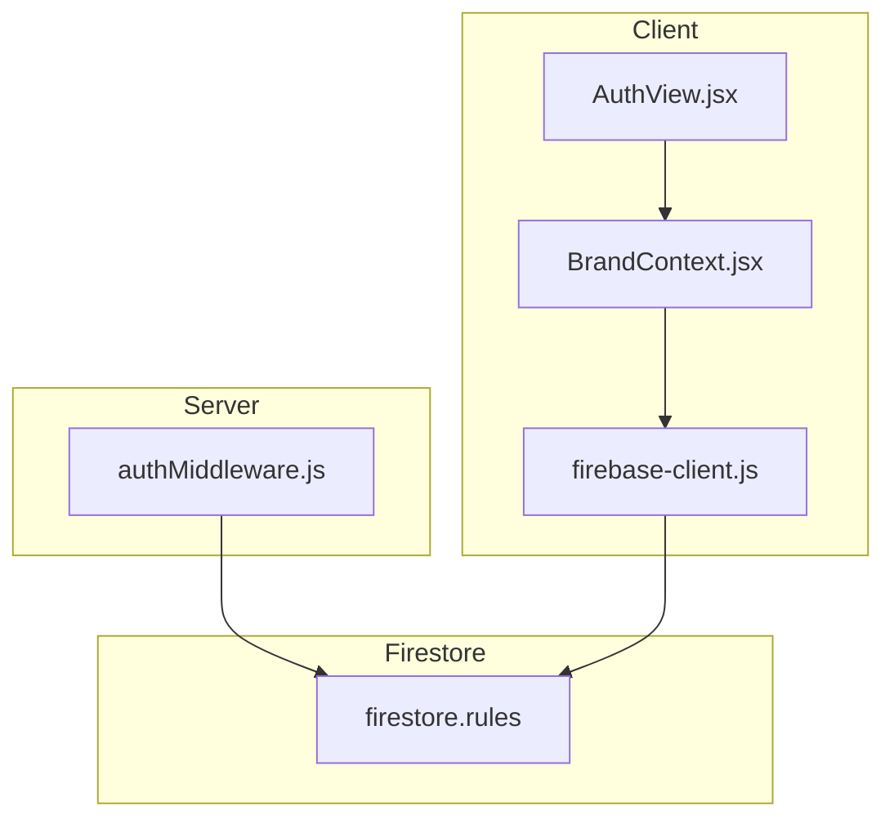
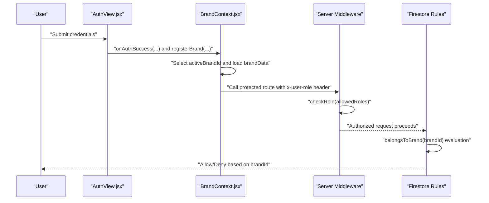
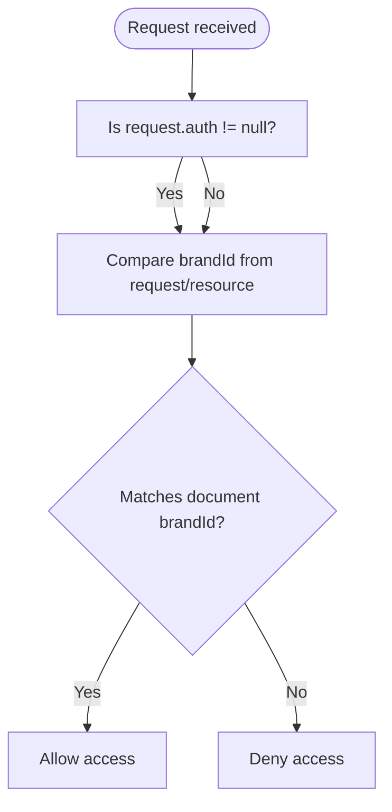
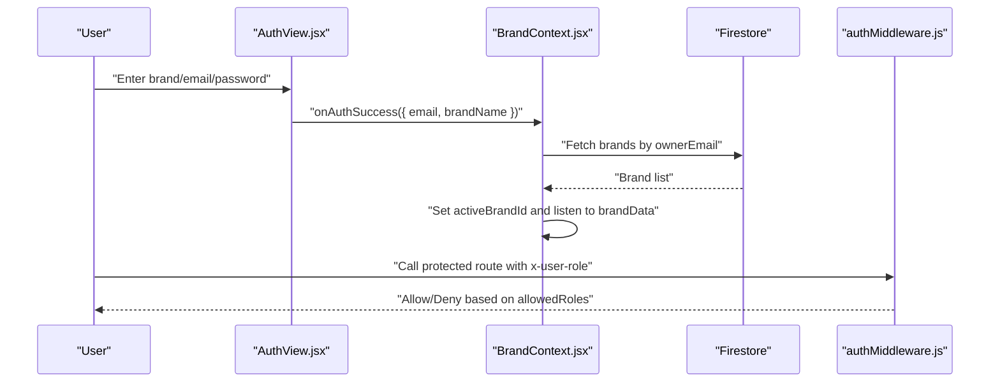
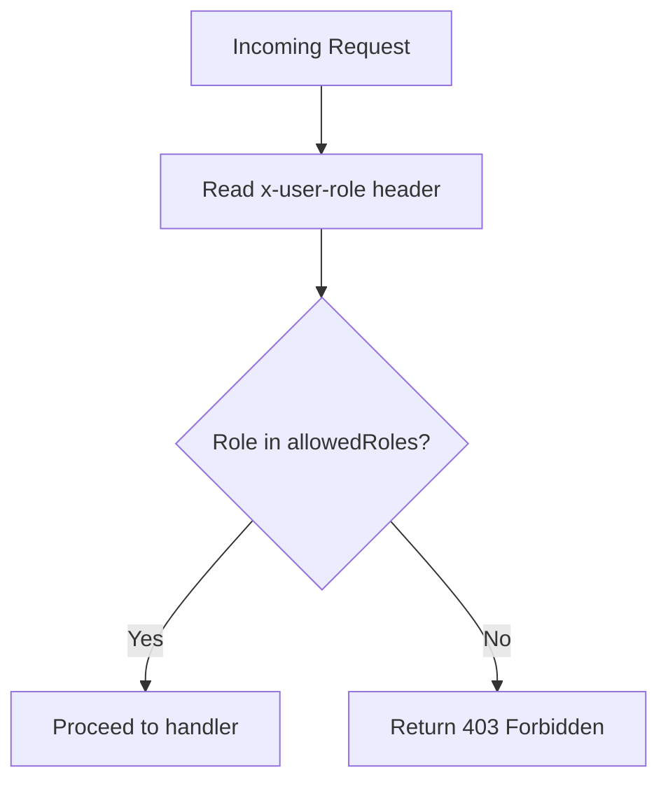
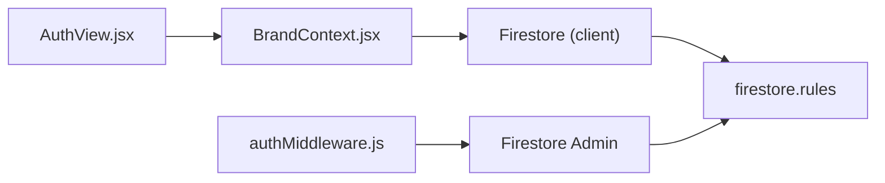

# Security Rules and Access Control

<cite>
**Referenced Files in This Document**
- [firestore.rules](file://firestore.rules)
- [BrandContext.jsx](file://client/src/context/BrandContext.jsx)
- [AuthView.jsx](file://client/src/components/Views/AuthView.jsx)
- [authMiddleware.js](file://server/middleware/authMiddleware.js)
- [migrate_brand.js](file://server/scripts/migrate_brand.js)
- [firebase-client.js](file://client/src/firebase-client.js)
</cite>

## Table of Contents
1. [Introduction](#introduction)
2. [Project Structure](#project-structure)
3. [Core Components](#core-components)
4. [Architecture Overview](#architecture-overview)
5. [Detailed Component Analysis](#detailed-component-analysis)
6. [Dependency Analysis](#dependency-analysis)
7. [Performance Considerations](#performance-considerations)
8. [Troubleshooting Guide](#troubleshooting-guide)
9. [Conclusion](#conclusion)

## Introduction
This document explains the Firestore security rules and access control mechanisms used to enforce brand-based authorization. It details the brandId field validation that isolates data per brand, the role of request.auth in access control, and how public versus private data is modeled across collections. It also covers the authentication flow, the belongsToBrand helper function, read/write permissions per collection, common access scenarios, troubleshooting authentication issues, and best practices for extending the permission system safely.

## Project Structure
The security model spans three layers:
- Client-side brand-aware context and authentication UI
- Server-side middleware for role checks
- Firestore security rules enforcing brand isolation and access patterns

**Diagram sources**
- [BrandContext.jsx](file://client/src/context/BrandContext.jsx)
- [AuthView.jsx](file://client/src/components/Views/AuthView.jsx)
- [firebase-client.js](file://client/src/firebase-client.js)
- [authMiddleware.js](file://server/middleware/authMiddleware.js)
- [firestore.rules](file://firestore.rules)

**Section sources**
- [BrandContext.jsx](file://client/src/context/BrandContext.jsx)
- [AuthView.jsx](file://client/src/components/Views/AuthView.jsx)
- [firebase-client.js](file://client/src/firebase-client.js)
- [authMiddleware.js](file://server/middleware/authMiddleware.js)
- [firestore.rules](file://firestore.rules)

## Core Components
- Brand-based authorization relies on the brandId field stored in each document. Collections enforce read/write access based on whether the requesting principal can be associated with the document’s brandId.
- The belongsToBrand helper function encapsulates the access logic so that rules remain concise and consistent.
- request.auth is present in the rules and can be used to enforce authenticated access; however, the current implementation primarily relies on brandId matching for authorization decisions.

Key rule expressions and behaviors:
- Helper function: belongsToBrand(brandId) evaluates to true when the requester is authenticated and the brandId matches the document’s brandId (either existing or incoming).
- Collection-level permissions:
  - brands: read/write allowed for all (placeholder for future admin-only restrictions).
  - products: read allowed for all; write requires belongsToBrand on the brandId in the incoming data.
  - conversations: read/write allowed for all; brand isolation is enforced by application-layer queries.
  - messages: read/write allowed for all.
  - knowledge_base: read allowed for all; write requires belongsToBrand on the brandId in the incoming data.
  - draft_replies, knowledge_gaps, draft_orders: read/write allowed when belongsToBrand matches either request.resource.data.brandId or resource.data.brandId.
  - logs: create allowed for all; read requires belongsToBrand on the brandId from the stored resource data.

These patterns ensure that:
- Public data is readable by all (e.g., products, knowledge_base).
- Private data is restricted to the owning brand via brandId.
- Write operations validate brand ownership before allowing updates.

**Section sources**
- [firestore.rules](file://firestore.rules)

## Architecture Overview
The authorization architecture combines client-side brand selection, server-side role enforcement, and Firestore rules.

**Diagram sources**
- [AuthView.jsx](file://client/src/components/Views/AuthView.jsx)
- [BrandContext.jsx](file://client/src/context/BrandContext.jsx)
- [authMiddleware.js](file://server/middleware/authMiddleware.js)
- [firestore.rules](file://firestore.rules)

## Detailed Component Analysis

### Brand-Based Authorization Model
The system uses a shared brandId field to isolate data per brand. The belongsToBrand helper centralizes the authorization logic, ensuring consistent enforcement across collections.

**Diagram sources**
- [firestore.rules](file://firestore.rules)

**Section sources**
- [firestore.rules](file://firestore.rules)

### Authentication Flow
- Client-side authentication UI collects brand identity, email, and password. On successful submission, the app invokes onAuthSuccess and optionally registers a brand.
- BrandContext manages user state, loads brands owned by the user, and selects an active brand. It listens to the active brand document to keep brandData up to date.
- Server middleware enforces role-based access for protected routes using an x-user-role header. In production, roles should be derived from Firebase Auth custom claims or Firestore user documents.

**Diagram sources**
- [AuthView.jsx](file://client/src/components/Views/AuthView.jsx)
- [BrandContext.jsx](file://client/src/context/BrandContext.jsx)
- [authMiddleware.js](file://server/middleware/authMiddleware.js)

**Section sources**
- [AuthView.jsx](file://client/src/components/Views/AuthView.jsx)
- [BrandContext.jsx](file://client/src/context/BrandContext.jsx)
- [authMiddleware.js](file://server/middleware/authMiddleware.js)

### Collection Permissions Matrix
- brands: read/write allowed for all (placeholder for future admin-only).
- products: read allowed for all; write requires belongsToBrand(request.resource.data.brandId).
- conversations: read/write allowed for all; brand isolation enforced by queries.
- messages: read/write allowed for all.
- knowledge_base: read allowed for all; write requires belongsToBrand(request.resource.data.brandId).
- draft_replies: read/write allowed when belongsToBrand matches request.resource.data.brandId or resource.data.brandId.
- knowledge_gaps: read/write allowed when belongsToBrand matches request.resource.data.brandId or resource.data.brandId.
- draft_orders: read/write allowed when belongsToBrand matches request.resource.data.brandId or resource.data.brandId.
- logs: create allowed for all; read requires belongsToBrand(resource.data.brandId).

Public vs private access patterns:
- Public: products, knowledge_base, conversations/messages are publicly readable.
- Private: write operations and sensitive reads require brand ownership via brandId.

**Section sources**
- [firestore.rules](file://firestore.rules)

### Data Isolation via brandId Validation
- Incoming writes to products, knowledge_base, and drafts validate brandId from the request payload.
- Existing documents’ brandId is validated for read/update operations in draft_replies, knowledge_gaps, and draft_orders.
- Logs enforce brandId read isolation from stored resource data.

Best practices for maintaining isolation:
- Always include brandId on create operations.
- Enforce brandId equality for updates and deletes.
- Use application-layer queries to restrict reads to the active brand’s documents.

**Section sources**
- [firestore.rules](file://firestore.rules)

### Role-Based Access Control (RBAC) on Server Routes
- The server middleware checks the x-user-role header against allowed roles and returns 403 if unauthorized.
- In production, roles should be populated from Firebase Auth custom claims or Firestore user documents.

**Diagram sources**
- [authMiddleware.js](file://server/middleware/authMiddleware.js)

**Section sources**
- [authMiddleware.js](file://server/middleware/authMiddleware.js)

### Migration and brandId Consistency
- Scripts update brandId across collections during brand migrations to maintain referential integrity and access control correctness.
- This ensures that after a rename or consolidation, documents remain isolated under the correct brandId.

**Section sources**
- [migrate_brand.js](file://server/scripts/migrate_brand.js)

## Dependency Analysis
- Client depends on Firebase Firestore for data access and on BrandContext for brand-aware queries.
- Server middleware depends on Firestore admin SDK to manage data and on request headers for role enforcement.
- Firestore rules depend on request.auth presence and brandId fields to enforce access.

**Diagram sources**
- [AuthView.jsx](file://client/src/components/Views/AuthView.jsx)
- [BrandContext.jsx](file://client/src/context/BrandContext.jsx)
- [authMiddleware.js](file://server/middleware/authMiddleware.js)
- [firestore.rules](file://firestore.rules)

**Section sources**
- [BrandContext.jsx](file://client/src/context/BrandContext.jsx)
- [authMiddleware.js](file://server/middleware/authMiddleware.js)
- [firestore.rules](file://firestore.rules)

## Performance Considerations
- Keep brandId indexing efficient by avoiding wildcard queries on brandId; use targeted queries in the client.
- Minimize unnecessary reads/writes by leveraging onSnapshot listeners and batching operations server-side.
- Use server middleware to reduce redundant client retries for unauthorized requests.

## Troubleshooting Guide
Common issues and resolutions:
- Access denied errors:
  - Verify that the document contains the correct brandId and that the request originates from the same brand.
  - Ensure that request.auth is present when relying on authenticated checks.
- Role-based failures:
  - Confirm that the x-user-role header is set correctly on outgoing requests.
  - In production, populate roles via Firebase Auth custom claims or Firestore user documents.
- Authentication UI problems:
  - Check that onAuthSuccess sets the user state and triggers brand loading.
  - Ensure BrandContext selects an active brand and subscribes to brandData updates.
- Migration inconsistencies:
  - Run the brand migration script to update brandId across collections.

**Section sources**
- [AuthView.jsx](file://client/src/components/Views/AuthView.jsx)
- [BrandContext.jsx](file://client/src/context/BrandContext.jsx)
- [authMiddleware.js](file://server/middleware/authMiddleware.js)
- [migrate_brand.js](file://server/scripts/migrate_brand.js)

## Conclusion
The system enforces brand-based authorization through a combination of Firestore security rules, client-side brand context, and server middleware. The belongsToBrand helper simplifies access control logic, while brandId serves as the canonical isolation boundary. By following the documented best practices—ensuring brandId presence on writes, restricting reads via queries, and enforcing roles server-side—you can safely extend the permission system as new features are introduced.