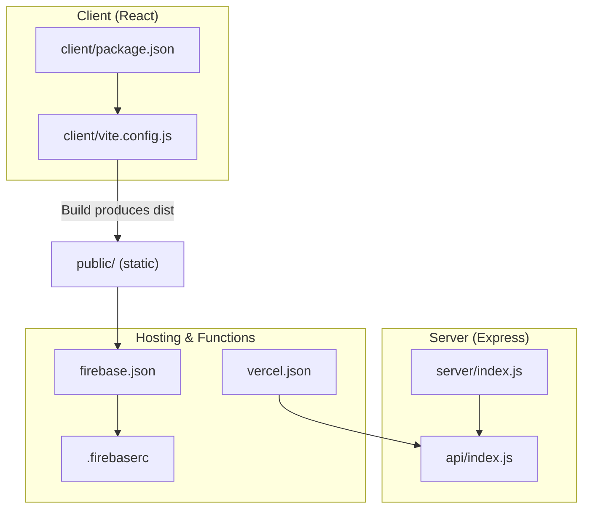
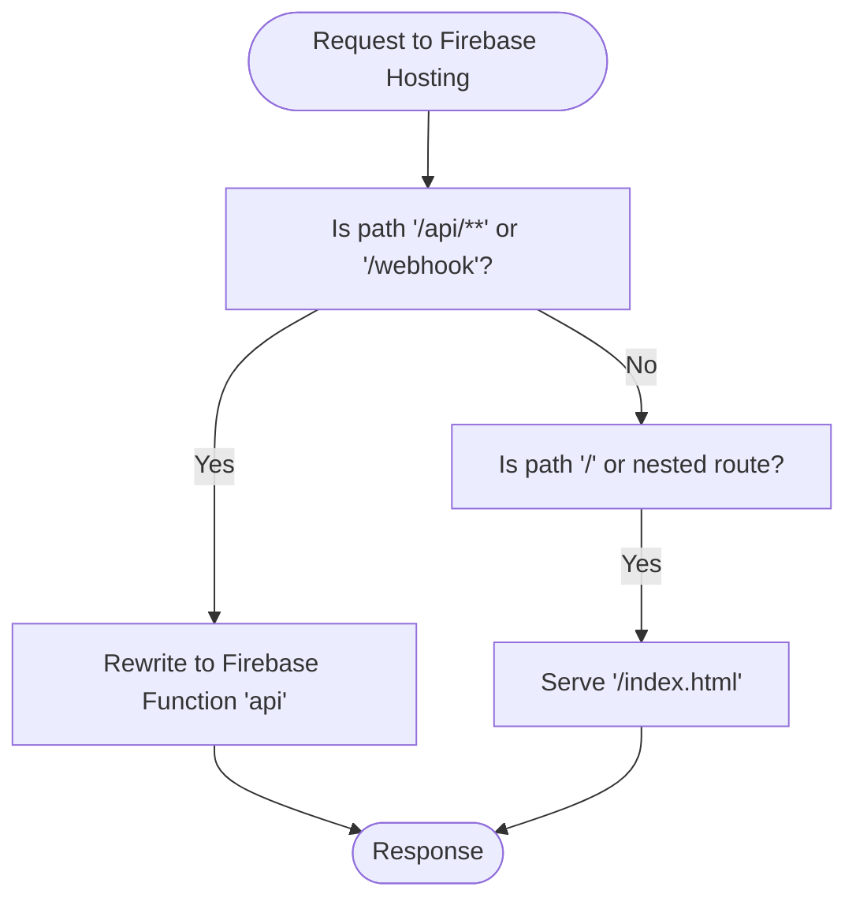
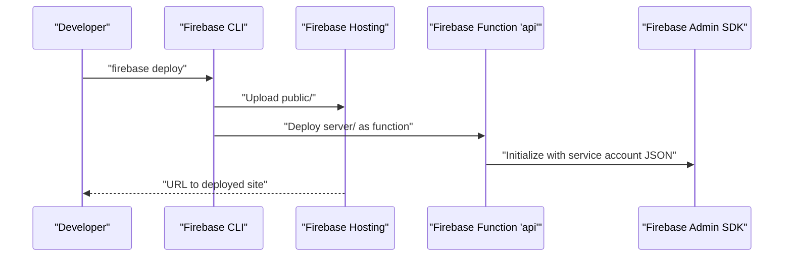
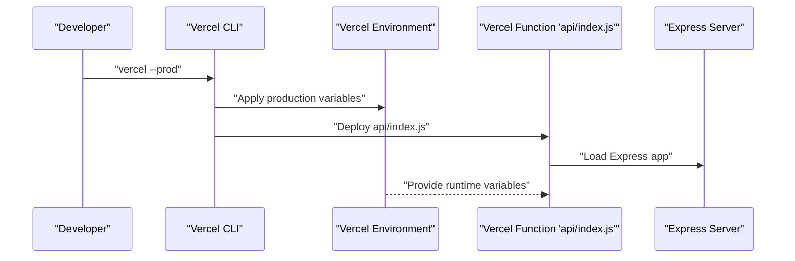
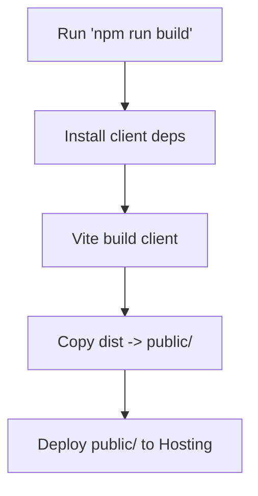
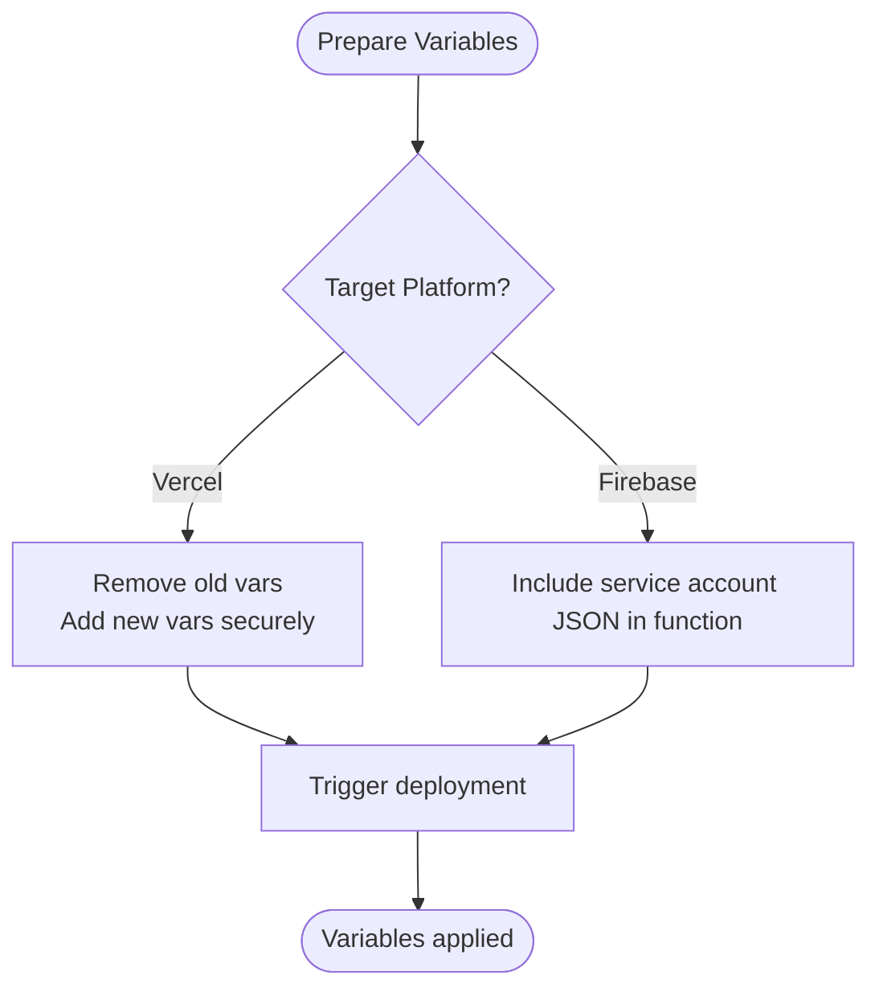
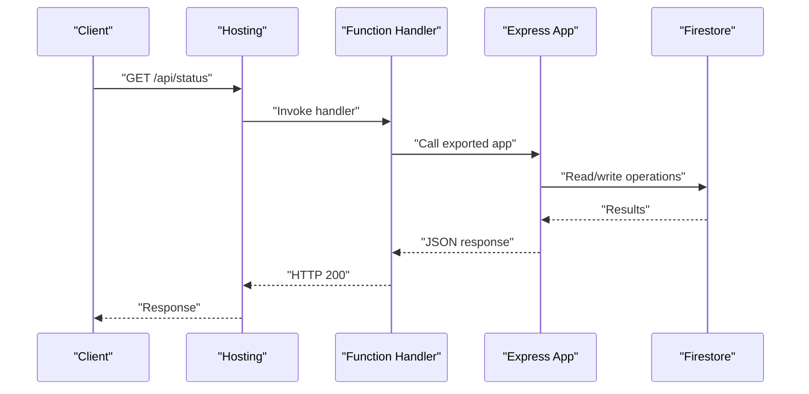
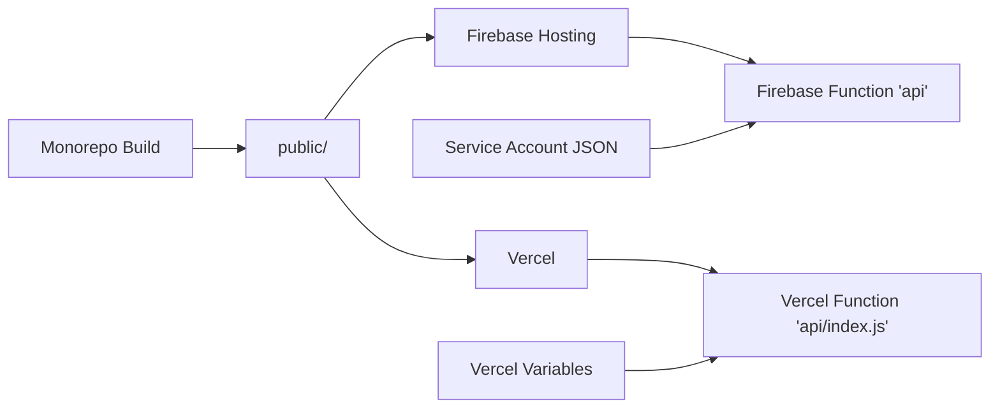

# Cloud Deployment

<cite>
**Referenced Files in This Document**
- [vercel.json](file://vercel.json)
- [firebase.json](file://firebase.json)
- [.firebaserc](file://.firebaserc)
- [package.json](file://package.json)
- [client/vite.config.js](file://client/vite.config.js)
- [client/package.json](file://client/package.json)
- [server/index.js](file://server/index.js)
- [api/index.js](file://api/index.js)
- [deploy_vercel_env.sh](file://deploy_vercel_env.sh)
- [update_vercel_env.js](file://update_vercel_env.js)
- [server/firebase-service-account.json](file://server/firebase-service-account.json)
</cite>

## Table of Contents
1. [Introduction](#introduction)
2. [Project Structure](#project-structure)
3. [Core Components](#core-components)
4. [Architecture Overview](#architecture-overview)
5. [Detailed Component Analysis](#detailed-component-analysis)
6. [Dependency Analysis](#dependency-analysis)
7. [Performance Considerations](#performance-considerations)
8. [Troubleshooting Guide](#troubleshooting-guide)
9. [Conclusion](#conclusion)
10. [Appendices](#appendices)

## Introduction
This document provides end-to-end cloud deployment guidance for a React frontend and Express backend monorepo, focusing on:
- Firebase Hosting configuration and rewrites for static hosting and API routing
- Vercel deployment setup, environment variable management, and function configuration
- Build processes using Vite and the monorepo build script
- Step-by-step deployment across development, staging, and production
- Rollback procedures and verification steps
- CDN configuration, SSL, and performance optimization for global users

## Project Structure
The repository follows a monorepo layout with a client built via Vite and a server implemented with Express. Static assets are produced by the client build and served by Firebase Hosting. API traffic is routed either to Firebase Functions (for Firebase deployments) or Vercel Functions (for Vercel deployments). Environment variables are managed per platform and injected during builds or runtime.



**Diagram sources**
- [client/package.json:1-39](file://client/package.json#L1-L39)
- [client/vite.config.js:1-16](file://client/vite.config.js#L1-L16)
- [server/index.js:1-203](file://server/index.js#L1-L203)
- [api/index.js:1-2](file://api/index.js#L1-L2)
- [firebase.json:1-37](file://firebase.json#L1-L37)
- [.firebaserc:1-6](file://.firebaserc#L1-L6)
- [vercel.json:1-16](file://vercel.json#L1-L16)

**Section sources**
- [client/package.json:1-39](file://client/package.json#L1-L39)
- [client/vite.config.js:1-16](file://client/vite.config.js#L1-L16)
- [server/index.js:1-203](file://server/index.js#L1-L203)
- [api/index.js:1-2](file://api/index.js#L1-L2)
- [firebase.json:1-37](file://firebase.json#L1-L37)
- [.firebaserc:1-6](file://.firebaserc#L1-L6)
- [vercel.json:1-16](file://vercel.json#L1-L16)

## Core Components
- Static site build and hosting
  - The client is built with Vite and the resulting static assets are copied into a top-level public folder for hosting.
  - Firebase Hosting serves the public directory and rewrites unmatched requests to index.html for SPA routing.
- API routing and functions
  - Firebase Functions: API endpoints are rewritten to a single function named api.
  - Vercel Functions: API endpoints are handled by a serverless function configured under api/index.js with memory and duration limits.
- Environment variables
  - Vercel-managed variables are added via CLI or script; sensitive keys are uploaded securely.
  - Firebase Functions rely on a service account JSON file included in the function bundle.

**Section sources**
- [package.json:8-13](file://package.json#L8-L13)
- [firebase.json:14-36](file://firebase.json#L14-L36)
- [vercel.json:8-14](file://vercel.json#L8-L14)
- [deploy_vercel_env.sh:1-26](file://deploy_vercel_env.sh#L1-L26)
- [update_vercel_env.js:1-22](file://update_vercel_env.js#L1-L22)
- [server/firebase-service-account.json:1-14](file://server/firebase-service-account.json#L1-L14)

## Architecture Overview
The deployment architecture supports two primary cloud providers with shared routing logic and provider-specific function handlers.

```mermaid
graph TB
Browser["Browser (SPA)"] --> Host["Firebase Hosting or Vercel"]
Host --> |"/api/*" or "/webhook"| FuncFB["Firebase Function 'api'"]
Host --> |"/api/*" or "/webhook"| FuncVC["Vercel Function 'api/index.js'"]
subgraph "Static Assets"
Public["public/"]
ClientBuild["client/dist (built by Vite)"]
end
ClientBuild --> Public
Public --> Host
EnvVercel["Vercel Environment Variables"] --> FuncVC
EnvVercel --> Srv["Express Server (server/index.js)"]
Srv --> FuncVC
EnvFB["Firebase Service Account JSON"] --> FuncFB
```

**Diagram sources**
- [firebase.json:21-34](file://firebase.json#L21-L34)
- [vercel.json:3-7](file://vercel.json#L3-L7)
- [vercel.json:8-14](file://vercel.json#L8-L14)
- [package.json:9](file://package.json#L9)
- [server/index.js:37-46](file://server/index.js#L37-L46)
- [server/firebase-service-account.json:1-14](file://server/firebase-service-account.json#L1-L14)

## Detailed Component Analysis

### Firebase Hosting Configuration
- Static asset serving
  - Hosting public directory is set to the top-level public folder containing client build artifacts.
- Rewrites
  - API rewrites route /api/** to the Firebase function named api.
  - Webhook endpoint rewrite targets the same function.
  - SPA fallback rewrite directs all unmatched paths to index.html for client-side routing.



**Diagram sources**
- [firebase.json:21-34](file://firebase.json#L21-L34)

**Section sources**
- [firebase.json:14-36](file://firebase.json#L14-L36)
- [.firebaserc:1-6](file://.firebaserc#L1-L6)

### Firebase Functions Deployment
- Codebase and ignore list
  - Functions source is set to the server directory with standard ignore patterns.
- Runtime and environment
  - The service account JSON is included in the function bundle via includeFiles to enable admin SDK usage.



**Diagram sources**
- [firebase.json:2-13](file://firebase.json#L2-L13)
- [server/firebase-service-account.json:1-14](file://server/firebase-service-account.json#L1-L14)

**Section sources**
- [firebase.json:2-13](file://firebase.json#L2-L13)
- [server/firebase-service-account.json:1-14](file://server/firebase-service-account.json#L1-L14)

### Vercel Deployment Setup
- Rewrites
  - API and webhook rewrites target the Vercel function api/index.js.
  - SPA fallback rewrites all other paths to index.html.
- Function configuration
  - Memory and max duration are set for api/index.js.
  - includeFiles specifies inclusion of the service account JSON for admin SDK usage.
- Environment variables
  - Production variables are added via shell script or Node script, including tokens and service account JSON.
  - The script removes existing variables before adding new ones to keep state clean.



**Diagram sources**
- [vercel.json:3-14](file://vercel.json#L3-L14)
- [deploy_vercel_env.sh:1-26](file://deploy_vercel_env.sh#L1-L26)
- [update_vercel_env.js:1-22](file://update_vercel_env.js#L1-L22)

**Section sources**
- [vercel.json:1-16](file://vercel.json#L1-L16)
- [deploy_vercel_env.sh:1-26](file://deploy_vercel_env.sh#L1-L26)
- [update_vercel_env.js:1-22](file://update_vercel_env.js#L1-L22)

### Build Process Using Vite and Monorepo Script
- Client build
  - The client uses Vite to produce optimized static assets.
- Monorepo build
  - The root build script installs client dependencies, runs the Vite build, and copies the output into the public directory for hosting.
- Local development
  - Client development server proxies API requests to a local Express server.



**Diagram sources**
- [package.json:9](file://package.json#L9)
- [client/vite.config.js:7-14](file://client/vite.config.js#L7-L14)

**Section sources**
- [package.json:8-13](file://package.json#L8-L13)
- [client/vite.config.js:1-16](file://client/vite.config.js#L1-L16)

### Environment Variable Management
- Vercel
  - Production variables are removed and re-added via a shell script or Node script.
  - Sensitive values like the Firebase service account JSON are streamed securely to avoid exposing secrets in logs.
- Firebase
  - The service account JSON is bundled with the function via includeFiles to enable admin SDK initialization.



**Diagram sources**
- [deploy_vercel_env.sh:1-26](file://deploy_vercel_env.sh#L1-L26)
- [update_vercel_env.js:16-18](file://update_vercel_env.js#L16-L18)
- [vercel.json:12](file://vercel.json#L12)
- [server/firebase-service-account.json:1-14](file://server/firebase-service-account.json#L1-L14)

**Section sources**
- [deploy_vercel_env.sh:1-26](file://deploy_vercel_env.sh#L1-L26)
- [update_vercel_env.js:1-22](file://update_vercel_env.js#L1-L22)
- [vercel.json:12](file://vercel.json#L12)

### API Routing and Function Entrypoints
- Express server exports the app for Vercel and exposes health endpoints.
- Vercel function wraps the Express app for serverless execution.
- Firebase rewrites route API and webhook traffic to the function named api.



**Diagram sources**
- [server/index.js:37-46](file://server/index.js#L37-L46)
- [api/index.js:1](file://api/index.js#L1)
- [firebase.json:23-29](file://firebase.json#L23-L29)
- [vercel.json:4-6](file://vercel.json#L4-L6)

**Section sources**
- [server/index.js:37-46](file://server/index.js#L37-L46)
- [api/index.js:1-2](file://api/index.js#L1-L2)
- [firebase.json:21-34](file://firebase.json#L21-L34)
- [vercel.json:3-7](file://vercel.json#L3-L7)

## Dependency Analysis
- Hosting and function coupling
  - Firebase Hosting rewrites depend on the presence of a function named api.
  - Vercel rewrites depend on the function path api/index.js.
- Build and deployment coupling
  - The monorepo build script depends on the client build pipeline and the public directory being present for hosting.
- Environment variable coupling
  - Vercel functions depend on production variables for third-party integrations.
  - Firebase functions depend on the service account JSON for admin SDK usage.



**Diagram sources**
- [package.json:9](file://package.json#L9)
- [firebase.json:21-34](file://firebase.json#L21-L34)
- [vercel.json:3-14](file://vercel.json#L3-L14)
- [server/firebase-service-account.json:1-14](file://server/firebase-service-account.json#L1-L14)

**Section sources**
- [package.json:9](file://package.json#L9)
- [firebase.json:21-34](file://firebase.json#L21-L34)
- [vercel.json:3-14](file://vercel.json#L3-L14)

## Performance Considerations
- CDN and caching
  - Firebase Hosting and Vercel provide global CDNs; ensure cache headers are set appropriately for static assets and consider enabling long-lived caches for immutable assets.
- SSL and HTTPS
  - Both platforms enforce HTTPS; configure custom domains and certificates through their respective dashboards or CLI.
- Latency optimization
  - Place functions close to data sources; minimize cold starts by tuning memory and duration settings.
  - Use Vercel’s edge network and Firebase’s global infrastructure for reduced latency.
- Asset optimization
  - Enable compression and minification via Vite; avoid unnecessary polyfills and reduce payload sizes.

[No sources needed since this section provides general guidance]

## Troubleshooting Guide
- Verify build output
  - Ensure the public directory exists after running the monorepo build script and contains the client dist artifacts.
- Test API endpoints locally
  - Confirm that the Express server responds to health endpoints and that CORS allows cross-origin requests.
- Environment variables
  - On Vercel, confirm variables are present in production and that the service account JSON is correctly uploaded.
  - On Firebase, verify the service account JSON is included in the function bundle.
- Rewrites and routing
  - Validate that Firebase Hosting rewrites match the function name and that Vercel rewrites target the correct function path.

**Section sources**
- [package.json:9](file://package.json#L9)
- [server/index.js:37-46](file://server/index.js#L37-L46)
- [deploy_vercel_env.sh:1-26](file://deploy_vercel_env.sh#L1-L26)
- [vercel.json:3-14](file://vercel.json#L3-L14)

## Conclusion
This guide outlines a robust deployment strategy for a React and Express application across Firebase Hosting and Vercel. By leveraging provider-specific rewrites, function configurations, and secure environment variable management, teams can achieve reliable, scalable, and globally performant deployments. Use the provided scripts and configurations to automate and standardize the build and deployment lifecycle.

[No sources needed since this section summarizes without analyzing specific files]

## Appendices

### Step-by-Step Deployment Guides

- Development
  - Build client and copy to public:
    - Run the monorepo build script to install client dependencies, build the client, and copy dist to public.
  - Local testing:
    - Start the Express server and the client dev server; confirm API proxy works and SPA routing functions.
  - Notes:
    - Use local environment variables for development tokens and endpoints.

- Staging
  - Prepare staging environment variables on Vercel:
    - Remove and re-add staging variables using the provided scripts.
  - Build and deploy:
    - Run the monorepo build script, then deploy to Vercel staging.
  - Verify:
    - Confirm API endpoints respond and static assets load correctly.

- Production
  - Prepare production environment variables on Vercel:
    - Remove and re-add production variables using the provided scripts; securely upload the service account JSON.
  - Build and deploy:
    - Run the monorepo build script, then deploy to Vercel production.
  - Verify:
    - Confirm API endpoints, webhooks, and static assets are live and healthy.

**Section sources**
- [package.json:9](file://package.json#L9)
- [deploy_vercel_env.sh:1-26](file://deploy_vercel_env.sh#L1-L26)
- [update_vercel_env.js:1-22](file://update_vercel_env.js#L1-L22)

### Rollback Procedures
- Vercel
  - Revert to the previous production deployment using the Vercel dashboard or CLI rollback commands.
  - If necessary, redeploy the last known good commit to restore state.
- Firebase
  - Revert to the previous function version or redeploy the last known good commit.

[No sources needed since this section provides general guidance]

### Deployment Verification Steps
- Static assets
  - Load the homepage and confirm all resources (CSS, JS, images) are served.
- API endpoints
  - Call health endpoints and verify responses.
- Webhooks
  - Confirm webhook verification and event handling endpoints respond as expected.

**Section sources**
- [server/index.js:48-124](file://server/index.js#L48-L124)

### CDN Configuration and SSL
- CDN
  - Configure CDN behavior via provider dashboards or CLI; set cache policies for static assets and API responses.
- SSL
  - Provision and manage SSL certificates through the provider’s domain settings; ensure HTTPS enforcement is enabled.

[No sources needed since this section provides general guidance]