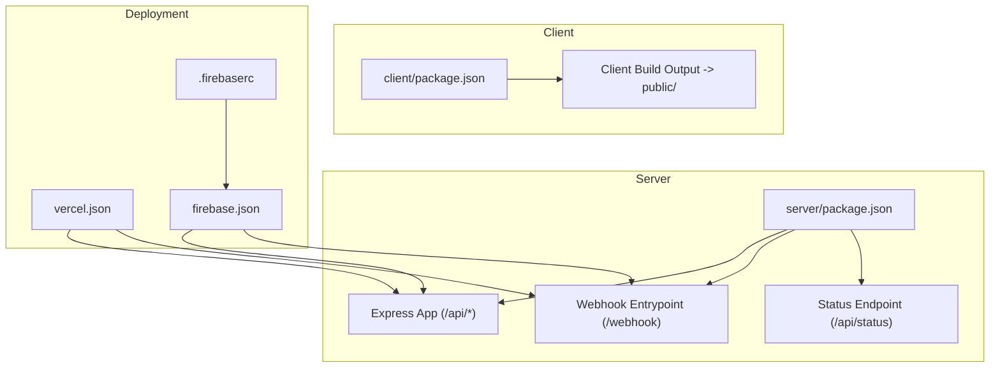
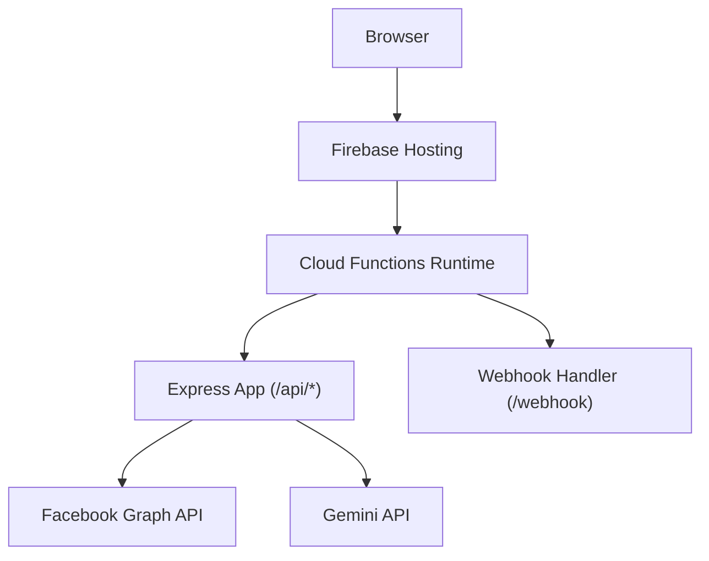
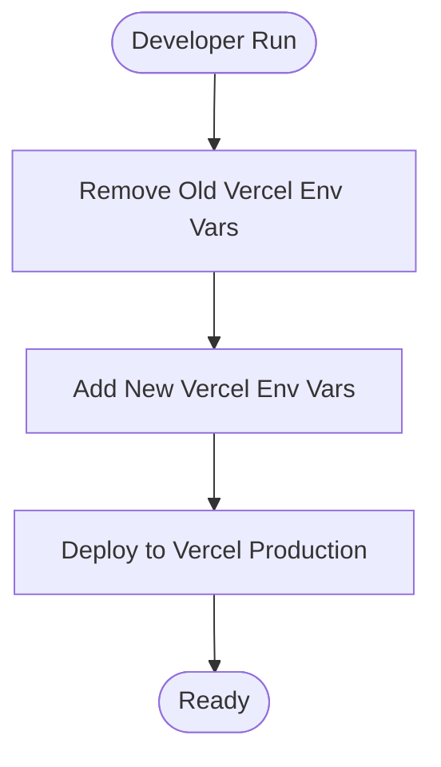
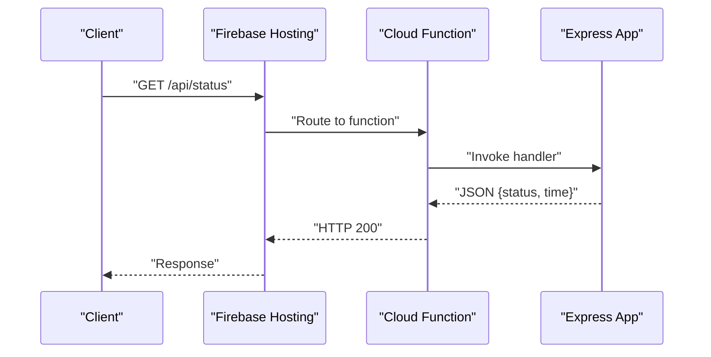
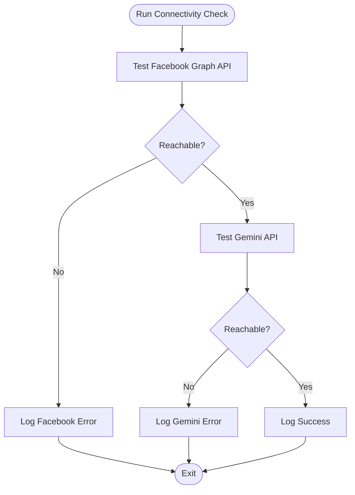
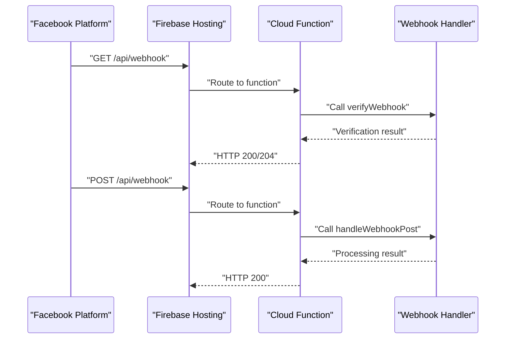
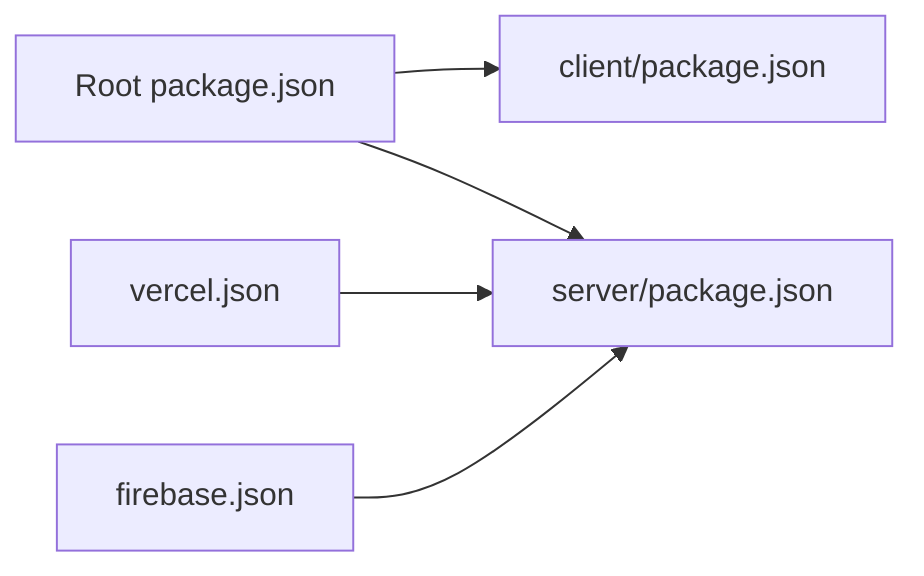

# Deployment and Operations

<cite>
**Referenced Files in This Document**
- [vercel.json](file://vercel.json)
- [firebase.json](file://firebase.json)
- [.firebaserc](file://.firebaserc)
- [deploy_vercel_env.sh](file://deploy_vercel_env.sh)
- [update_vercel_env.js](file://update_vercel_env.js)
- [package.json](file://package.json)
- [client/package.json](file://client/package.json)
- [server/package.json](file://server/package.json)
- [server/webhook.js](file://server/webhook.js)
- [server/status.js](file://server/status.js)
- [server/check.js](file://server/check.js)
- [server/check_connectivity.js](file://server/check_connectivity.js)
- [server/checkLogs.js](file://server/checkLogs.js)
- [server/diagnose.js](file://server/diagnose.js)
- [server/check_app_status.js](file://server/check_app_status.js)
</cite>

## Table of Contents
1. [Introduction](#introduction)
2. [Project Structure](#project-structure)
3. [Core Components](#core-components)
4. [Architecture Overview](#architecture-overview)
5. [Detailed Component Analysis](#detailed-component-analysis)
6. [Dependency Analysis](#dependency-analysis)
7. [Performance Considerations](#performance-considerations)
8. [Troubleshooting Guide](#troubleshooting-guide)
9. [Conclusion](#conclusion)
10. [Appendices](#appendices)

## Introduction
This document provides comprehensive deployment and operations guidance for the project, covering Firebase Hosting and Cloud Functions, Vercel deployment, environment configuration, CI/CD integration, monitoring, health checks, scaling, performance optimization, cost management, backups, disaster recovery, and incident response. It synthesizes the repository’s configuration and operational scripts to help teams maintain reliability and performance in production.

## Project Structure
The project is organized into:
- Client: React application built via Vite and deployed to Firebase Hosting.
- Server: Express-based API and Cloud Functions codebase.
- Root configurations: Vercel and Firebase deployment definitions, environment management scripts, and monorepo metadata.

Key deployment-related artifacts:
- Vercel rewrites and function sizing configuration.
- Firebase Hosting and Functions configuration.
- Environment variable management via shell and Node scripts.
- Operational scripts for connectivity, diagnostics, and status checks.

**Diagram sources**
- [vercel.json:1-16](file://vercel.json#L1-L16)
- [firebase.json:1-37](file://firebase.json#L1-L37)
- [.firebaserc:1-6](file://.firebaserc#L1-L6)
- [client/package.json:1-39](file://client/package.json#L1-L39)
- [server/package.json:1-26](file://server/package.json#L1-L26)

**Section sources**
- [vercel.json:1-16](file://vercel.json#L1-L16)
- [firebase.json:1-37](file://firebase.json#L1-L37)
- [.firebaserc:1-6](file://.firebaserc#L1-L6)
- [package.json:1-40](file://package.json#L1-L40)
- [client/package.json:1-39](file://client/package.json#L1-L39)
- [server/package.json:1-26](file://server/package.json#L1-L26)

## Core Components
- Vercel configuration defines rewrites and function resource limits for the API entrypoint and webhook handler.
- Firebase configuration defines Hosting and Functions, routing API and webhook traffic to the Cloud Functions backend.
- Environment management scripts upload secrets to Vercel and trigger production deploys.
- Operational scripts validate connectivity, query Firestore, and diagnose environment readiness.

**Section sources**
- [vercel.json:1-16](file://vercel.json#L1-L16)
- [firebase.json:14-36](file://firebase.json#L14-L36)
- [deploy_vercel_env.sh:1-26](file://deploy_vercel_env.sh#L1-L26)
- [update_vercel_env.js:1-22](file://update_vercel_env.js#L1-L22)
- [server/check_connectivity.js:1-28](file://server/check_connectivity.js#L1-L28)
- [server/checkLogs.js:1-38](file://server/checkLogs.js#L1-L38)
- [server/diagnose.js:1-64](file://server/diagnose.js#L1-L64)

## Architecture Overview
The runtime architecture routes client requests through Firebase Hosting to the Express API, which is implemented as a Cloud Function. Webhooks are handled via a dedicated endpoint and rewrites.

**Diagram sources**
- [firebase.json:21-34](file://firebase.json#L21-L34)
- [vercel.json:3-6](file://vercel.json#L3-L6)
- [server/webhook.js:1-22](file://server/webhook.js#L1-L22)

**Section sources**
- [firebase.json:14-36](file://firebase.json#L14-L36)
- [vercel.json:1-16](file://vercel.json#L1-L16)
- [server/webhook.js:1-22](file://server/webhook.js#L1-L22)

## Detailed Component Analysis

### Vercel Deployment Pipeline
- Rewrites:
  - API requests under /api are routed to the API entrypoint.
  - Webhook requests under /webhook are routed to the webhook entrypoint.
  - Static fallback routes to index.html for SPA navigation.
- Function sizing:
  - Memory and max duration configured for the API function.
  - Includes a service account file for secure access during function execution.

Operational notes:
- Environment variables are managed via scripts that remove and add Vercel environment variables per environment.
- Production deploy is triggered after variable updates.

**Diagram sources**
- [deploy_vercel_env.sh:1-26](file://deploy_vercel_env.sh#L1-L26)
- [update_vercel_env.js:1-22](file://update_vercel_env.js#L1-L22)
- [vercel.json:8-14](file://vercel.json#L8-L14)

**Section sources**
- [vercel.json:1-16](file://vercel.json#L1-L16)
- [deploy_vercel_env.sh:1-26](file://deploy_vercel_env.sh#L1-L26)
- [update_vercel_env.js:1-22](file://update_vercel_env.js#L1-L22)

### Firebase Hosting and Functions
- Hosting:
  - Public directory is set to the built client output.
  - Rewrites route API and webhook traffic to the Cloud Functions backend.
- Functions:
  - Codebase defined under server/.
  - Ignore patterns exclude development artifacts.

**Diagram sources**
- [firebase.json:14-36](file://firebase.json#L14-L36)
- [server/status.js:1-4](file://server/status.js#L1-L4)

**Section sources**
- [firebase.json:1-37](file://firebase.json#L1-L37)
- [.firebaserc:1-6](file://.firebaserc#L1-L6)

### Environment Variable Management
- Vercel:
  - Shell script removes existing variables and adds new ones for production.
  - Securely uploads the Firebase service account JSON as an environment variable.
  - Triggers a production deploy after updates.
- Node script:
  - Removes and re-adds variables programmatically.
  - Supports synchronizing output variables and deploying with provided credentials.

Best practices:
- Store sensitive keys in Vercel environment variables, not in source.
- Rotate tokens and keys periodically; automate via scripts.

**Section sources**
- [deploy_vercel_env.sh:1-26](file://deploy_vercel_env.sh#L1-L26)
- [update_vercel_env.js:1-22](file://update_vercel_env.js#L1-L22)

### Health Checks and Monitoring
- Status endpoint:
  - Provides a simple JSON response indicating API availability and current time.
- Connectivity checks:
  - Validates reachability to Facebook Graph API using a page access token.
  - Validates reachability to Gemini API using an API key.
- Firestore diagnostics:
  - Tests Firestore queries against conversation message collections.
- Environment and Firebase diagnostics:
  - Confirms presence and validity of service account file.
  - Initializes Firebase Admin SDK and verifies brand lookup fallback behavior.
- Application status checks:
  - Uses app ID and secret to query Facebook app metadata and roles.

**Diagram sources**
- [server/check_connectivity.js:1-28](file://server/check_connectivity.js#L1-L28)

**Section sources**
- [server/status.js:1-4](file://server/status.js#L1-L4)
- [server/check_connectivity.js:1-28](file://server/check_connectivity.js#L1-L28)
- [server/checkLogs.js:1-38](file://server/checkLogs.js#L1-L38)
- [server/diagnose.js:1-64](file://server/diagnose.js#L1-L64)
- [server/check_app_status.js:1-36](file://server/check_app_status.js#L1-L36)

### Webhook Handling
- The webhook entrypoint registers GET and POST handlers for verification and payload processing.
- A catch-all route ensures method-specific handling for GET/POST and returns appropriate errors otherwise.

**Diagram sources**
- [firebase.json:26-29](file://firebase.json#L26-L29)
- [vercel.json:4-5](file://vercel.json#L4-L5)
- [server/webhook.js:1-22](file://server/webhook.js#L1-L22)

**Section sources**
- [server/webhook.js:1-22](file://server/webhook.js#L1-L22)

## Dependency Analysis
- Client build depends on the monorepo’s build script to produce static assets consumed by Firebase Hosting.
- Server dependencies include Express, Firebase Admin, and external APIs (Facebook, Gemini).
- Vercel and Firebase configurations define routing and resource allocation for the API function.

**Diagram sources**
- [package.json:1-40](file://package.json#L1-L40)
- [client/package.json:1-39](file://client/package.json#L1-L39)
- [server/package.json:1-26](file://server/package.json#L1-L26)
- [vercel.json:1-16](file://vercel.json#L1-L16)
- [firebase.json:1-37](file://firebase.json#L1-L37)

**Section sources**
- [package.json:1-40](file://package.json#L1-L40)
- [client/package.json:1-39](file://client/package.json#L1-L39)
- [server/package.json:1-26](file://server/package.json#L1-L26)

## Performance Considerations
- Function sizing:
  - Configure memory and max duration in Vercel to match workload characteristics.
- Build optimization:
  - Minimize client bundle size and leverage CDN benefits via Firebase Hosting.
- External API latency:
  - Monitor Facebook and Gemini API latencies; consider caching and retries for non-critical operations.
- Firestore queries:
  - Use targeted queries and indexes; avoid large unfiltered scans.

[No sources needed since this section provides general guidance]

## Troubleshooting Guide
Common checks and remediation steps:
- Verify environment variables:
  - Use diagnostic scripts to confirm presence and correctness of tokens and keys.
- Test connectivity:
  - Run connectivity checks to ensure external APIs are reachable.
- Validate Firestore:
  - Use query diagnostics to confirm collection access and structure assumptions.
- Inspect webhook routing:
  - Confirm rewrites and method handling for GET/POST.
- Application status:
  - Query Facebook app metadata and roles to validate configuration.

**Section sources**
- [server/diagnose.js:1-64](file://server/diagnose.js#L1-L64)
- [server/check_connectivity.js:1-28](file://server/check_connectivity.js#L1-L28)
- [server/checkLogs.js:1-38](file://server/checkLogs.js#L1-L38)
- [server/webhook.js:1-22](file://server/webhook.js#L1-L22)
- [server/check_app_status.js:1-36](file://server/check_app_status.js#L1-L36)

## Conclusion
The deployment pipeline integrates Firebase Hosting and Functions with Vercel-managed environment variables and function sizing. Operational scripts provide robust health checks and diagnostics for connectivity, Firestore, and environment readiness. By following the outlined practices for CI/CD, monitoring, scaling, and incident response, teams can maintain a reliable and performant production system.

[No sources needed since this section summarizes without analyzing specific files]

## Appendices

### CI/CD Integration Guidance
- Automate environment variable synchronization using the provided scripts.
- Trigger production deploys after variable updates.
- Gate deployments on successful health checks and connectivity tests.

**Section sources**
- [deploy_vercel_env.sh:1-26](file://deploy_vercel_env.sh#L1-L26)
- [update_vercel_env.js:1-22](file://update_vercel_env.js#L1-L22)

### Backup and Disaster Recovery
- Export Firestore data regularly using official tooling.
- Store Firebase service account keys securely and rotate them periodically.
- Maintain multiple environments (staging/production) with distinct configurations.

[No sources needed since this section provides general guidance]

### Incident Response Playbook
- Define escalation paths for external API outages.
- Use status endpoints and health checks to triage issues quickly.
- Document rollback procedures for failed deployments.

[No sources needed since this section provides general guidance]