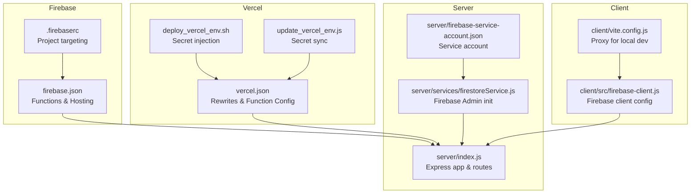
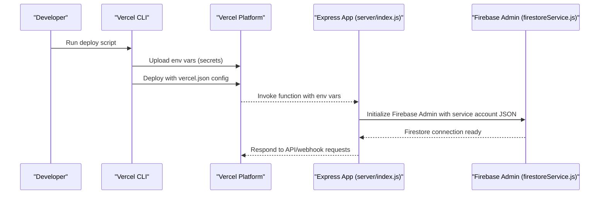
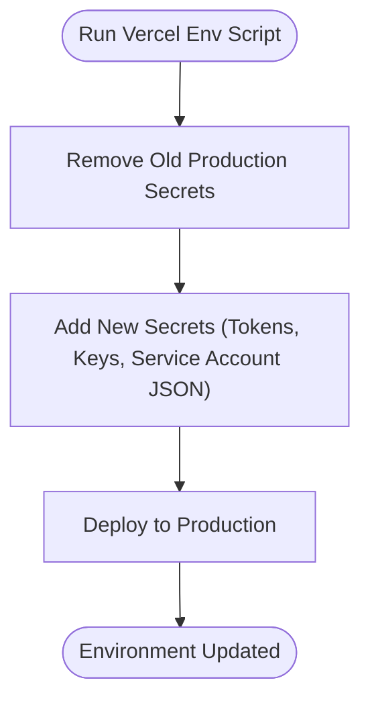
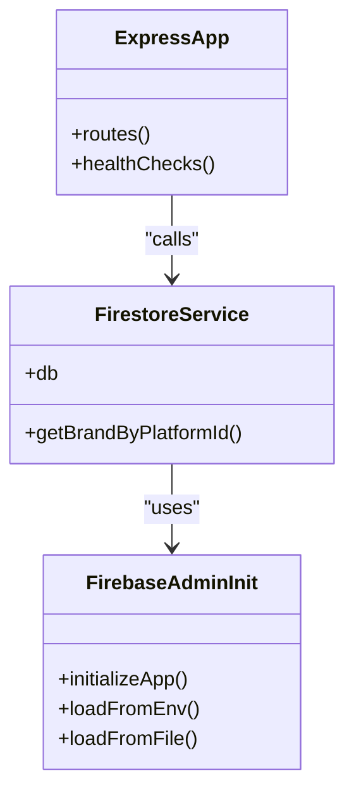
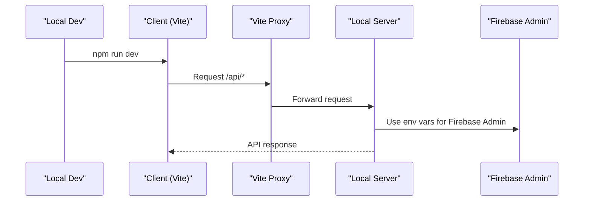
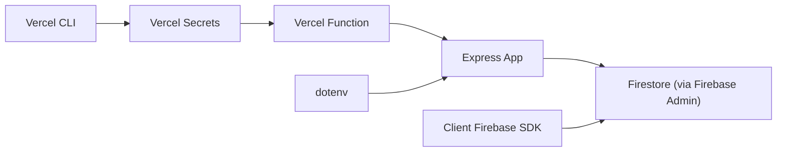

# Environment Configuration

<cite>
**Referenced Files in This Document**
- [.firebaserc](file://.firebaserc)
- [firebase.json](file://firebase.json)
- [vercel.json](file://vercel.json)
- [deploy_vercel_env.sh](file://deploy_vercel_env.sh)
- [update_vercel_env.js](file://update_vercel_env.js)
- [package.json](file://package.json)
- [client/src/firebase-client.js](file://client/src/firebase-client.js)
- [client/vite.config.js](file://client/vite.config.js)
- [server/index.js](file://server/index.js)
- [server/services/firestoreService.js](file://server/services/firestoreService.js)
- [server/firebase-service-account.json](file://server/firebase-service-account.json)
</cite>

## Table of Contents
1. [Introduction](#introduction)
2. [Project Structure](#project-structure)
3. [Core Components](#core-components)
4. [Architecture Overview](#architecture-overview)
5. [Detailed Component Analysis](#detailed-component-analysis)
6. [Dependency Analysis](#dependency-analysis)
7. [Performance Considerations](#performance-considerations)
8. [Troubleshooting Guide](#troubleshooting-guide)
9. [Conclusion](#conclusion)
10. [Appendices](#appendices)

## Introduction
This document explains how the project manages environment configuration across Firebase and Vercel, and how environment variables are injected and validated during builds and deployments. It covers:
- Firebase project targeting and hosting/functions configuration
- Vercel environment variable management and secret handling
- Cross-platform configuration for local development and production
- Deployment script automation and environment variable injection
- Best practices for secrets, configuration drift prevention, and environment isolation

## Project Structure
The repository organizes environment configuration across three primary areas:
- Firebase configuration: project targeting and hosting/functions routing
- Vercel configuration: rewrites, function memory/duration limits, and file inclusion
- Environment variable management: shell script and Node.js automation for Vercel, plus local dotenv loading

**Diagram sources**
- [.firebaserc:1-6](file://.firebaserc#L1-L6)
- [firebase.json:1-37](file://firebase.json#L1-L37)
- [vercel.json:1-16](file://vercel.json#L1-L16)
- [deploy_vercel_env.sh:1-26](file://deploy_vercel_env.sh#L1-L26)
- [update_vercel_env.js:1-22](file://update_vercel_env.js#L1-L22)
- [server/index.js:1-203](file://server/index.js#L1-L203)
- [server/services/firestoreService.js:1-126](file://server/services/firestoreService.js#L1-L126)
- [server/firebase-service-account.json:1-14](file://server/firebase-service-account.json#L1-L14)
- [client/src/firebase-client.js:1-26](file://client/src/firebase-client.js#L1-L26)
- [client/vite.config.js:1-16](file://client/vite.config.js#L1-L16)

**Section sources**
- [.firebaserc:1-6](file://.firebaserc#L1-L6)
- [firebase.json:1-37](file://firebase.json#L1-L37)
- [vercel.json:1-16](file://vercel.json#L1-L16)
- [deploy_vercel_env.sh:1-26](file://deploy_vercel_env.sh#L1-L26)
- [update_vercel_env.js:1-22](file://update_vercel_env.js#L1-L22)
- [server/index.js:1-203](file://server/index.js#L1-L203)
- [server/services/firestoreService.js:1-126](file://server/services/firestoreService.js#L1-L126)
- [server/firebase-service-account.json:1-14](file://server/firebase-service-account.json#L1-L14)
- [client/src/firebase-client.js:1-26](file://client/src/firebase-client.js#L1-L26)
- [client/vite.config.js:1-16](file://client/vite.config.js#L1-L16)

## Core Components
- Firebase project targeting: The .firebaserc file defines the default Firebase project used by Firebase CLI commands.
- Firebase hosting/functions: The firebase.json file configures the Functions codebase, hosting public directory, and rewrite rules to route API traffic to Cloud Functions.
- Vercel rewrites/function config: The vercel.json file defines rewrites for API/webhook routes and function-level settings such as memory and duration, plus includeFiles for the service account.
- Environment variable management: Shell and Node scripts automate adding/removing Vercel production secrets and deploying changes.
- Local development: The client’s Vite proxy forwards API requests to the local server, while the server loads environment variables via dotenv.

**Section sources**
- [.firebaserc:1-6](file://.firebaserc#L1-L6)
- [firebase.json:1-37](file://firebase.json#L1-L37)
- [vercel.json:1-16](file://vercel.json#L1-L16)
- [deploy_vercel_env.sh:1-26](file://deploy_vercel_env.sh#L1-L26)
- [update_vercel_env.js:1-22](file://update_vercel_env.js#L1-L22)
- [client/vite.config.js:1-16](file://client/vite.config.js#L1-L16)
- [server/index.js:1-203](file://server/index.js#L1-L203)

## Architecture Overview
The environment configuration supports a multi-layered runtime:
- Client-side Firebase SDK initialization with static keys
- Server-side Firebase Admin initialization using environment-provided service account JSON
- Vercel-managed environment variables injected at build/runtime
- Local development using dotenv and Vite proxy

**Diagram sources**
- [vercel.json:1-16](file://vercel.json#L1-L16)
- [deploy_vercel_env.sh:1-26](file://deploy_vercel_env.sh#L1-L26)
- [update_vercel_env.js:1-22](file://update_vercel_env.js#L1-L22)
- [server/index.js:1-203](file://server/index.js#L1-L203)
- [server/services/firestoreService.js:1-126](file://server/services/firestoreService.js#L1-L126)

## Detailed Component Analysis

### Firebase Project Targeting and CLI Setup
- The .firebaserc file sets the default Firebase project for CLI operations, ensuring commands target the intended project without specifying flags.
- firebase.json configures:
  - Functions codebase and source directory
  - Hosting public directory and ignore patterns
  - Rewrites to route /api/** and /webhook to the Cloud Function named “api”
- These files collectively define how Firebase deploys and routes traffic to the backend.

**Section sources**
- [.firebaserc:1-6](file://.firebaserc#L1-L6)
- [firebase.json:1-37](file://firebase.json#L1-L37)

### Vercel Environment Variables and Secret Handling
- Production secrets are managed via two mechanisms:
  - Shell script: deploy_vercel_env.sh removes existing production secrets and adds new ones, then deploys to production.
  - Node.js script: update_vercel_env.js synchronizes specific keys and deploys using Vercel CLI with explicit token/scope.
- The scripts upload the Firebase service account JSON as a secret under FIREBASE_SERVICE_ACCOUNT and optionally GOOGLE_APPLICATION_CREDENTIALS_JSON for compatibility.
- The vercel.json file includes:
  - Rewrites for API/webhook and SPA fallback
  - Function-level includeFiles to bundle the service account JSON into the function runtime

**Diagram sources**
- [deploy_vercel_env.sh:1-26](file://deploy_vercel_env.sh#L1-L26)
- [update_vercel_env.js:1-22](file://update_vercel_env.js#L1-L22)
- [vercel.json:1-16](file://vercel.json#L1-L16)

**Section sources**
- [deploy_vercel_env.sh:1-26](file://deploy_vercel_env.sh#L1-L26)
- [update_vercel_env.js:1-22](file://update_vercel_env.js#L1-L22)
- [vercel.json:1-16](file://vercel.json#L1-L16)

### Cross-Platform Configuration Management
- Client-side Firebase initialization uses static keys embedded in the client code. This is acceptable for client SDK usage but must remain separate from server-side secrets.
- Server-side Firebase Admin initialization reads the service account JSON from either:
  - Environment variables (FIREBASE_SERVICE_ACCOUNT or GOOGLE_APPLICATION_CREDENTIALS_JSON)
  - A bundled file included via vercel.json includeFiles
- The server also loads environment variables via dotenv for local development and health checks.

**Diagram sources**
- [server/services/firestoreService.js:1-126](file://server/services/firestoreService.js#L1-L126)
- [server/index.js:1-203](file://server/index.js#L1-L203)

**Section sources**
- [client/src/firebase-client.js:1-26](file://client/src/firebase-client.js#L1-L26)
- [server/services/firestoreService.js:1-126](file://server/services/firestoreService.js#L1-L126)
- [server/index.js:1-203](file://server/index.js#L1-L203)

### Multi-Environment Deployment Strategy
- Development:
  - Local server runs on port 3000; client proxy forwards /api to localhost:3000
  - dotenv loads environment variables for local runs
- Staging/Production:
  - Vercel manages environment variables and function configuration
  - firebase.json and vercel.json define routing and function packaging
  - Scripts automate secret updates and deployments

**Diagram sources**
- [client/vite.config.js:1-16](file://client/vite.config.js#L1-L16)
- [server/index.js:1-203](file://server/index.js#L1-L203)
- [server/services/firestoreService.js:1-126](file://server/services/firestoreService.js#L1-L126)

**Section sources**
- [client/vite.config.js:1-16](file://client/vite.config.js#L1-L16)
- [server/index.js:1-203](file://server/index.js#L1-L203)
- [server/services/firestoreService.js:1-126](file://server/services/firestoreService.js#L1-L126)

### Environment Variable Injection During Build
- vercel.json includeFiles bundles the service account JSON into the function runtime, enabling the function to load it even if not present in environment variables.
- The server attempts to parse the service account from environment variables first, then falls back to the bundled file path.

**Section sources**
- [vercel.json:1-16](file://vercel.json#L1-L16)
- [server/services/firestoreService.js:1-126](file://server/services/firestoreService.js#L1-L126)

### Configuration Validation
- Health endpoints in the server validate:
  - Facebook page access token availability and validity
  - Webhook subscription status per brand
- These endpoints rely on environment variables and Firestore data to report status.

**Section sources**
- [server/index.js:51-124](file://server/index.js#L51-L124)

## Dependency Analysis
The environment configuration depends on:
- Vercel CLI for secret management and deployment
- Firebase Admin SDK for database operations
- Client-side Firebase SDK for frontend interactions
- Dotenv for local environment variable loading

**Diagram sources**
- [vercel.json:1-16](file://vercel.json#L1-L16)
- [server/index.js:1-203](file://server/index.js#L1-L203)
- [server/services/firestoreService.js:1-126](file://server/services/firestoreService.js#L1-L126)
- [client/src/firebase-client.js:1-26](file://client/src/firebase-client.js#L1-L26)
- [package.json:1-40](file://package.json#L1-L40)

**Section sources**
- [vercel.json:1-16](file://vercel.json#L1-L16)
- [server/index.js:1-203](file://server/index.js#L1-L203)
- [server/services/firestoreService.js:1-126](file://server/services/firestoreService.js#L1-L126)
- [client/src/firebase-client.js:1-26](file://client/src/firebase-client.js#L1-L26)
- [package.json:1-40](file://package.json#L1-L40)

## Performance Considerations
- Function memory and max duration are configured in vercel.json to balance cost and responsiveness.
- The server caches brand lookups to reduce Firestore queries.
- Avoid unnecessary re-deploys by batching environment variable updates with the provided scripts.

[No sources needed since this section provides general guidance]

## Troubleshooting Guide
Common issues and resolutions:
- Firebase Admin initialization fails:
  - Verify FIREBASE_SERVICE_ACCOUNT or GOOGLE_APPLICATION_CREDENTIALS_JSON is set in Vercel production.
  - Confirm the service account JSON is valid and includes the private key with proper newline handling.
- Client Firebase initialization errors:
  - Ensure client-side keys match the Firebase project defined in .firebaserc.
- Vercel deployment failures:
  - Use the provided scripts to remove stale secrets and redeploy.
  - Confirm includeFiles in vercel.json matches the service account file path.
- Local development connectivity:
  - Ensure Vite proxy targets the correct local port and that dotenv variables are loaded.

**Section sources**
- [server/services/firestoreService.js:1-126](file://server/services/firestoreService.js#L1-L126)
- [client/src/firebase-client.js:1-26](file://client/src/firebase-client.js#L1-L26)
- [vercel.json:1-16](file://vercel.json#L1-L16)
- [deploy_vercel_env.sh:1-26](file://deploy_vercel_env.sh#L1-L26)
- [client/vite.config.js:1-16](file://client/vite.config.js#L1-L16)

## Conclusion
The project’s environment configuration integrates Firebase and Vercel seamlessly:
- Firebase CLI and hosting/functions are configured via .firebaserc and firebase.json.
- Vercel manages production secrets and function behavior via vercel.json and automation scripts.
- Cross-platform initialization ensures the client and server use appropriate credentials.
Adhering to the best practices below will help maintain secure, reliable, and isolated environments across development, staging, and production.

[No sources needed since this section summarizes without analyzing specific files]

## Appendices

### Best Practices for Managing Sensitive Credentials
- Store secrets in Vercel production environment only; avoid committing secrets to version control.
- Use dedicated service accounts with minimal permissions for server-side operations.
- Rotate secrets regularly and update Vercel production variables using the provided scripts.
- Validate environment variables at startup and fail fast on missing or invalid values.

[No sources needed since this section provides general guidance]

### Configuration Drift Prevention
- Centralize environment variable definitions in Vercel; scripts should be the single source of truth for production secrets.
- Keep firebase.json and vercel.json in version control to track intentional changes.
- Review includeFiles and function settings after any Firebase or Vercel updates.

[No sources needed since this section provides general guidance]

### Environment Isolation Strategies
- Separate Vercel environments (preview/staging/production) with distinct secrets and function settings.
- Use different Firebase projects for development and production, reflected in .firebaserc and client-side keys.
- Restrict access to Vercel tokens and scopes; enforce least privilege for CI/CD automation.

[No sources needed since this section provides general guidance]

### Local Development Configuration
- Install dependencies for client and server.
- Start the client dev server and local server; Vite proxy forwards API requests to the local backend.
- Use dotenv for local environment variables; ensure keys align with the Firebase project used for development.

**Section sources**
- [package.json:1-40](file://package.json#L1-L40)
- [client/vite.config.js:1-16](file://client/vite.config.js#L1-L16)
- [server/index.js:1-203](file://server/index.js#L1-L203)

### Testing Environment Setup
- Use Vercel preview deployments to validate environment variables and function behavior before promoting to production.
- Run health checks against the API endpoints to confirm token and webhook status.

**Section sources**
- [server/index.js:51-124](file://server/index.js#L51-L124)

### Production Hardening Procedures
- Audit Vercel secrets and function settings periodically.
- Enable Vercel’s automatic secret encryption and restrict function access to internal APIs.
- Harden Firebase rules and service account permissions; monitor Firestore usage and costs.

[No sources needed since this section provides general guidance]