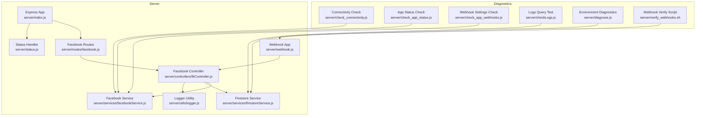
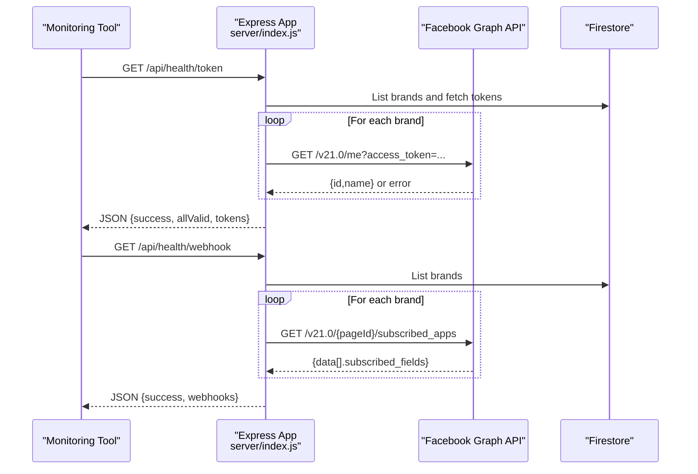
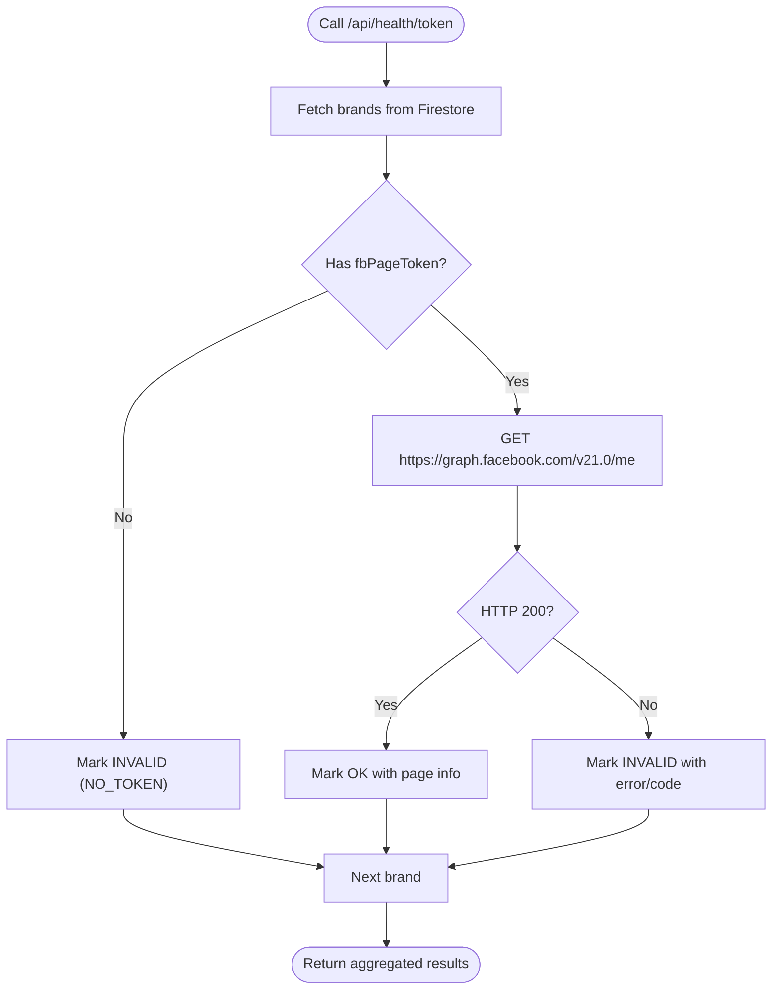
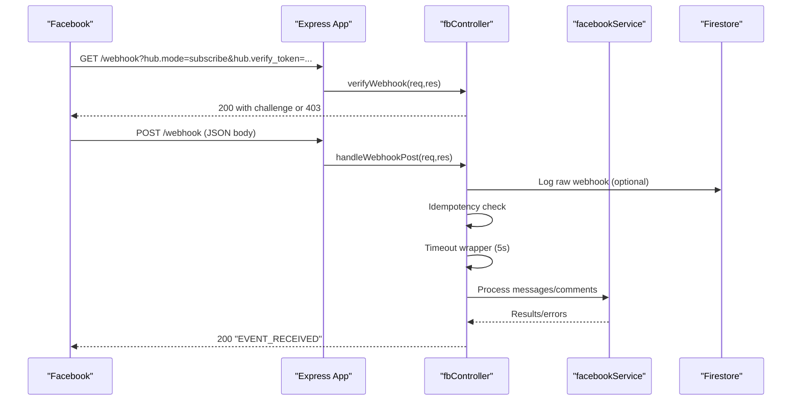
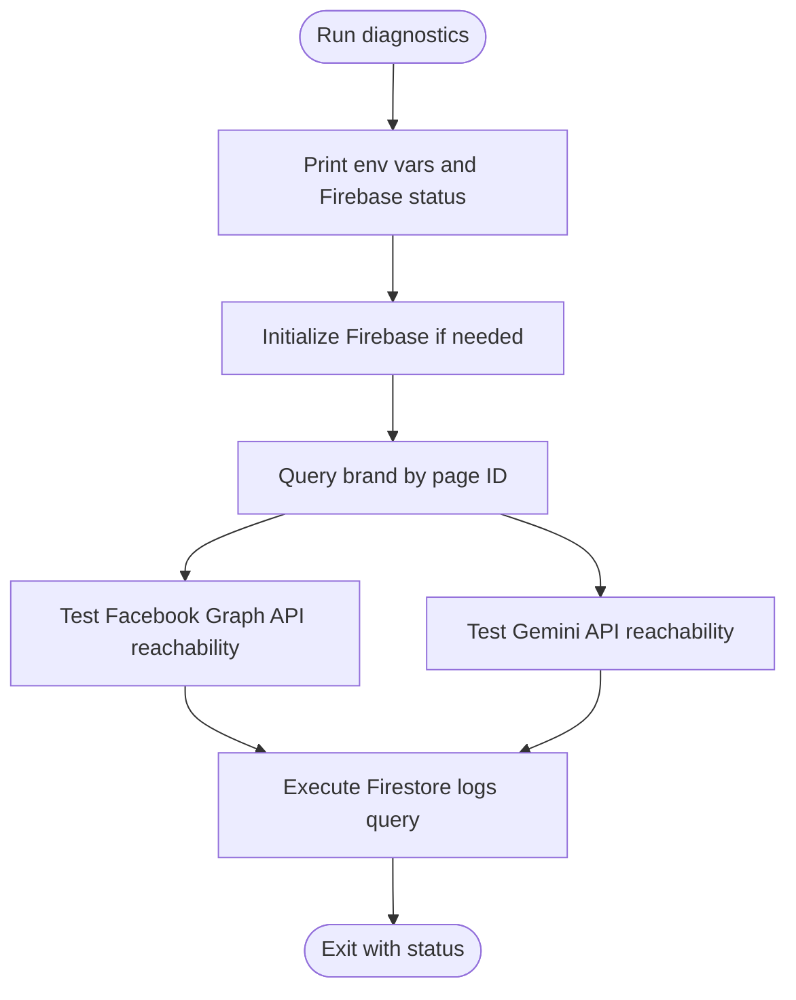
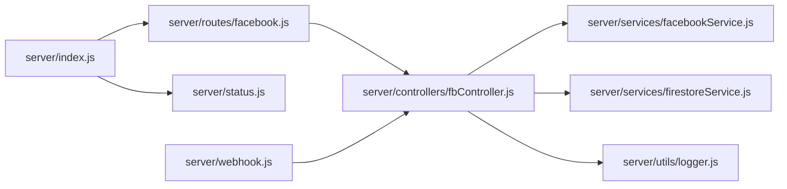

# Monitoring and Health Checks

<cite>
**Referenced Files in This Document**
- [index.js](file://server/index.js)
- [status.js](file://server/status.js)
- [webhook.js](file://server/webhook.js)
- [routes/facebook.js](file://server/routes/facebook.js)
- [controllers/fbController.js](file://server/controllers/fbController.js)
- [services/facebookService.js](file://server/services/facebookService.js)
- [services/firestoreService.js](file://server/services/firestoreService.js)
- [utils/logger.js](file://server/utils/logger.js)
- [check_connectivity.js](file://server/check_connectivity.js)
- [check_app_status.js](file://server/check_app_status.js)
- [check_app_webhooks.js](file://server/check_app_webhooks.js)
- [checkLogs.js](file://server/checkLogs.js)
- [diagnose.js](file://server/diagnose.js)
- [verify_webhooks.sh](file://server/verify_webhooks.sh)
</cite>

## Table of Contents
1. [Introduction](#introduction)
2. [Project Structure](#project-structure)
3. [Core Components](#core-components)
4. [Architecture Overview](#architecture-overview)
5. [Detailed Component Analysis](#detailed-component-analysis)
6. [Dependency Analysis](#dependency-analysis)
7. [Performance Considerations](#performance-considerations)
8. [Troubleshooting Guide](#troubleshooting-guide)
9. [Conclusion](#conclusion)
10. [Appendices](#appendices)

## Introduction
This document provides comprehensive guidance for monitoring and health checks of the system. It covers:
- Health check endpoints for token validity, webhook subscriptions, and automation readiness
- Connectivity verification to external APIs
- Webhook subscription monitoring and verification
- Automated diagnostics and troubleshooting scripts
- Operational observability, logging, and performance monitoring
- Alerting thresholds, incident detection, and integration with external monitoring tools

## Project Structure
The monitoring and health-check surface is primarily implemented in the Express server with dedicated routes and controllers. Supporting scripts and utilities assist with diagnostics and connectivity checks.

**Diagram sources**
- [index.js:37-192](file://server/index.js#L37-L192)
- [status.js:1-4](file://server/status.js#L1-L4)
- [webhook.js:1-22](file://server/webhook.js#L1-L22)
- [routes/facebook.js:1-42](file://server/routes/facebook.js#L1-L42)
- [controllers/fbController.js:154-323](file://server/controllers/fbController.js#L154-L323)
- [services/facebookService.js:1-287](file://server/services/facebookService.js#L1-L287)
- [services/firestoreService.js:1-126](file://server/services/firestoreService.js#L1-L126)
- [utils/logger.js:1-10](file://server/utils/logger.js#L1-L10)
- [check_connectivity.js:1-28](file://server/check_connectivity.js#L1-L28)
- [check_app_status.js:1-36](file://server/check_app_status.js#L1-L36)
- [check_app_webhooks.js:1-40](file://server/check_app_webhooks.js#L1-L40)
- [checkLogs.js:1-38](file://server/checkLogs.js#L1-L38)
- [diagnose.js:1-64](file://server/diagnose.js#L1-L64)
- [verify_webhooks.sh:1-55](file://server/verify_webhooks.sh#L1-L55)

**Section sources**
- [index.js:37-192](file://server/index.js#L37-L192)
- [routes/facebook.js:1-42](file://server/routes/facebook.js#L1-L42)
- [controllers/fbController.js:154-323](file://server/controllers/fbController.js#L154-L323)
- [services/facebookService.js:1-287](file://server/services/facebookService.js#L1-L287)
- [services/firestoreService.js:1-126](file://server/services/firestoreService.js#L1-L126)
- [utils/logger.js:1-10](file://server/utils/logger.js#L1-L10)
- [check_connectivity.js:1-28](file://server/check_connectivity.js#L1-L28)
- [check_app_status.js:1-36](file://server/check_app_status.js#L1-L36)
- [check_app_webhooks.js:1-40](file://server/check_app_webhooks.js#L1-L40)
- [checkLogs.js:1-38](file://server/checkLogs.js#L1-L38)
- [diagnose.js:1-64](file://server/diagnose.js#L1-L64)
- [verify_webhooks.sh:1-55](file://server/verify_webhooks.sh#L1-L55)

## Core Components
- Health check endpoints:
  - GET /api/status: Basic liveness endpoint returning API status and version.
  - GET /api/ping: Simple latency check returning current timestamp.
  - GET /api/health/token: Validates page access tokens for all brands and the environment token against the Facebook Graph API.
  - GET /api/health/webhook: Verifies webhook subscriptions per brand by checking subscribed fields for feed and messages.
  - GET /api/health/automation: Reports automation readiness (drafts, knowledge base presence, settings) for a brand or a sample.
- Webhook endpoints:
  - GET /webhook and POST /webhook (and /api/webhook variants) handled by the Facebook controller for verification and event processing.
- Diagnostics and connectivity:
  - Scripts for connectivity checks to Facebook Graph API and Gemini API.
  - Scripts for app status and webhook subscription checks.
  - Environment and Firebase diagnostics.
  - Logs query validation script.
  - Webhook verification script for local testing.

**Section sources**
- [index.js:38-171](file://server/index.js#L38-L171)
- [routes/facebook.js:7-8](file://server/routes/facebook.js#L7-L8)
- [controllers/fbController.js:154-323](file://server/controllers/fbController.js#L154-L323)
- [check_connectivity.js:1-28](file://server/check_connectivity.js#L1-L28)
- [check_app_status.js:1-36](file://server/check_app_status.js#L1-L36)
- [check_app_webhooks.js:1-40](file://server/check_app_webhooks.js#L1-L40)
- [checkLogs.js:1-38](file://server/checkLogs.js#L1-L38)
- [diagnose.js:1-64](file://server/diagnose.js#L1-L64)
- [verify_webhooks.sh:1-55](file://server/verify_webhooks.sh#L1-L55)

## Architecture Overview
The monitoring architecture integrates health endpoints, webhook processing, and diagnostics to provide observability and automated checks.

**Diagram sources**
- [index.js:51-124](file://server/index.js#L51-L124)
- [services/firestoreService.js:56-114](file://server/services/firestoreService.js#L56-L114)
- [services/facebookService.js:200-209](file://server/services/facebookService.js#L200-L209)

## Detailed Component Analysis

### Health Endpoints
- /api/status: Returns API liveness and version.
- /api/ping: Returns a simple pong with timestamp for latency checks.
- /api/health/token:
  - Iterates all brands and validates each page access token against the Facebook Graph API.
  - Also validates the environment token if present.
  - Aggregates validity and returns a summary.
- /api/health/webhook:
  - For each brand with a page token and page ID, checks subscribed apps and fields (feed, messages).
  - Returns per-brand subscription status.
- /api/health/automation:
  - Reports automation readiness by checking presence of draft replies, knowledge base, and comment drafts.
  - Includes settings flags for system auto-reply, AI reply, auto-like, and learning mode.

**Diagram sources**
- [index.js:51-91](file://server/index.js#L51-L91)
- [services/firestoreService.js:56-114](file://server/services/firestoreService.js#L56-L114)
- [services/facebookService.js:200-209](file://server/services/facebookService.js#L200-L209)

**Section sources**
- [index.js:38-171](file://server/index.js#L38-L171)

### Webhook Endpoints and Monitoring
- Verification:
  - GET /webhook and GET /api/webhook validate the hub mode and verify token.
- Event Processing:
  - POST /webhook and POST /api/webhook parse events, enforce idempotency, apply timeouts, and route to appropriate handlers.
  - Logs raw webhook bodies and headers for debugging.
- Subscription Monitoring:
  - The health endpoint checks subscribed fields for feed and messages per brand.

**Diagram sources**
- [routes/facebook.js:7-8](file://server/routes/facebook.js#L7-L8)
- [controllers/fbController.js:154-323](file://server/controllers/fbController.js#L154-L323)
- [services/facebookService.js:17-52](file://server/services/facebookService.js#L17-L52)
- [services/firestoreService.js:56-114](file://server/services/firestoreService.js#L56-L114)

**Section sources**
- [routes/facebook.js:7-8](file://server/routes/facebook.js#L7-L8)
- [controllers/fbController.js:154-323](file://server/controllers/fbController.js#L154-L323)

### Diagnostics and Connectivity Scripts
- Connectivity:
  - Tests reachability to Facebook Graph API and Gemini API and reports success or failure.
- App Status:
  - Queries Facebook app metadata and roles to confirm app configuration.
- Webhook Settings:
  - Lists app-level webhook subscriptions and fields.
- Logs Query:
  - Executes a Firestore query against a conversation subcollection to validate read access.
- Environment Diagnostics:
  - Prints environment variables, checks Firebase service account presence, initializes Firebase, and verifies brand lookup fallbacks.
- Webhook Verify Script:
  - Sends sample webhook payloads locally to test verification and processing.

**Diagram sources**
- [diagnose.js:9-61](file://server/diagnose.js#L9-L61)
- [check_connectivity.js:4-25](file://server/check_connectivity.js#L4-L25)
- [checkLogs.js:21-35](file://server/checkLogs.js#L21-L35)

**Section sources**
- [check_connectivity.js:1-28](file://server/check_connectivity.js#L1-L28)
- [check_app_status.js:1-36](file://server/check_app_status.js#L1-L36)
- [check_app_webhooks.js:1-40](file://server/check_app_webhooks.js#L1-L40)
- [checkLogs.js:1-38](file://server/checkLogs.js#L1-L38)
- [diagnose.js:1-64](file://server/diagnose.js#L1-L64)
- [verify_webhooks.sh:1-55](file://server/verify_webhooks.sh#L1-L55)

## Dependency Analysis
The health endpoints depend on Firestore for brand data and the Facebook Graph API for token and subscription validation. The webhook pipeline depends on the Facebook controller, Facebook service, and Firestore for persistence and logging.

**Diagram sources**
- [index.js:37-192](file://server/index.js#L37-L192)
- [routes/facebook.js:1-42](file://server/routes/facebook.js#L1-L42)
- [controllers/fbController.js:154-323](file://server/controllers/fbController.js#L154-L323)
- [services/facebookService.js:1-287](file://server/services/facebookService.js#L1-L287)
- [services/firestoreService.js:1-126](file://server/services/firestoreService.js#L1-L126)
- [utils/logger.js:1-10](file://server/utils/logger.js#L1-L10)
- [status.js:1-4](file://server/status.js#L1-L4)
- [webhook.js:1-22](file://server/webhook.js#L1-L22)

**Section sources**
- [index.js:37-192](file://server/index.js#L37-L192)
- [controllers/fbController.js:154-323](file://server/controllers/fbController.js#L154-L323)

## Performance Considerations
- Timeouts and Idempotency:
  - Webhook processing applies a 5-second timeout wrapper around message/comment processing to avoid long executions on platforms with strict limits.
  - Idempotency checks prevent duplicate processing of events.
- Retry Logic:
  - Facebook API calls use retry wrappers for transient and rate-limit errors.
- Logging:
  - Centralized logging utility records timestamps and contextual messages for traceability.
- Recommendations:
  - Use pagination and batching for large-scale brand lists in health checks.
  - Add circuit breakers for external API calls under load.
  - Instrument key endpoints with metrics for latency and error rates.

[No sources needed since this section provides general guidance]

## Troubleshooting Guide
- Health Endpoint Failures:
  - /api/health/token: Review individual brand token validity and error codes returned by the Facebook Graph API.
  - /api/health/webhook: Ensure page tokens have sufficient permissions and that the app is subscribed to feed and messages.
- Webhook Issues:
  - Verify tokens and signatures; check raw webhook logs for malformed payloads.
  - Use the webhook verification script to simulate inbound events locally.
- Connectivity Problems:
  - Run the connectivity script to validate reachability to Facebook Graph API and Gemini API.
- Logs and Queries:
  - Use the logs query script to validate Firestore read access for conversation subcollections.
- Environment and Firebase:
  - Run the environment diagnostics script to confirm environment variables and Firebase initialization.

**Section sources**
- [index.js:51-124](file://server/index.js#L51-L124)
- [controllers/fbController.js:154-323](file://server/controllers/fbController.js#L154-L323)
- [check_connectivity.js:1-28](file://server/check_connectivity.js#L1-L28)
- [checkLogs.js:1-38](file://server/checkLogs.js#L1-L38)
- [diagnose.js:1-64](file://server/diagnose.js#L1-L64)
- [verify_webhooks.sh:1-55](file://server/verify_webhooks.sh#L1-L55)

## Conclusion
The system provides robust health checks, webhook monitoring, and diagnostics to support production observability. By leveraging the built-in endpoints and scripts, teams can automate monitoring, detect incidents early, and troubleshoot efficiently. Integrating these checks with external monitoring tools enables proactive alerts and continuous system health assurance.

[No sources needed since this section summarizes without analyzing specific files]

## Appendices

### Health Check Endpoints Reference
- GET /api/status
  - Purpose: Liveness and version check.
  - Response: { status, version }.
- GET /api/ping
  - Purpose: Latency check.
  - Response: { status: "pong", time }.
- GET /api/health/token
  - Purpose: Validate page access tokens for brands and environment token.
  - Response: { success, allValid, tokens: [{ brand, status, pageId?, pageName?, valid, error?, code? }] }.
- GET /api/health/webhook
  - Purpose: Verify webhook subscriptions per brand.
  - Response: { success, webhooks: [{ brand, hasSubscription, feedSubscribed, messagesSubscribed, fields }] }.
- GET /api/health/automation
  - Purpose: Report automation readiness for a brand or a sample.
  - Response: { success, report: [{ brand, brandId, tokenPresent, commentAutoReply, commentAI, commentAutoLike, inboxAutoReply, inboxAI, hasDraftReplies, hasKnowledgeBase, hasCommentDrafts, isLearningMode, autoHyperIndex }] }.

**Section sources**
- [index.js:38-171](file://server/index.js#L38-L171)

### Webhook Endpoints Reference
- GET /webhook and POST /webhook
  - Purpose: Verification and event processing.
  - Behavior: Verification uses hub mode and verify token; POST parses entries, enforces idempotency, applies timeouts, and routes to handlers.

**Section sources**
- [routes/facebook.js:7-8](file://server/routes/facebook.js#L7-L8)
- [controllers/fbController.js:154-323](file://server/controllers/fbController.js#L154-L323)

### Diagnostic Scripts Reference
- Connectivity: check_connectivity.js
  - Tests reachability to Facebook Graph API and Gemini API.
- App Status: check_app_status.js
  - Retrieves app metadata and roles.
- Webhook Settings: check_app_webhooks.js
  - Lists app-level webhook subscriptions and fields.
- Logs Query: checkLogs.js
  - Executes a Firestore query against a conversation subcollection.
- Environment Diagnostics: diagnose.js
  - Prints environment variables, checks Firebase service account, initializes Firebase, and queries brand data.
- Webhook Verify Script: verify_webhooks.sh
  - Sends sample webhook payloads to /api/webhook for local testing.

**Section sources**
- [check_connectivity.js:1-28](file://server/check_connectivity.js#L1-L28)
- [check_app_status.js:1-36](file://server/check_app_status.js#L1-L36)
- [check_app_webhooks.js:1-40](file://server/check_app_webhooks.js#L1-L40)
- [checkLogs.js:1-38](file://server/checkLogs.js#L1-L38)
- [diagnose.js:1-64](file://server/diagnose.js#L1-L64)
- [verify_webhooks.sh:1-55](file://server/verify_webhooks.sh#L1-L55)

### Observability and Alerting Guidance
- Metrics to Track:
  - Health endpoint response times and error rates.
  - Webhook processing latency and timeout counts.
  - Facebook API error classifications (rate limit, permission, network).
- Thresholds and Alerts:
  - Health endpoints: alert if response time exceeds thresholds or if allValid is false.
  - Webhook: alert if subscription fields are missing or processing timeouts occur.
  - Facebook API: alert on recurring rate limit or permission errors.
- External Monitoring Tools:
  - Integrate health endpoints with uptime monitoring (e.g., UptimeRobot, PagerTree).
  - Stream logs to centralized logging (e.g., Cloud Logging, DataDog) and set up log-based alerts.
  - Export Prometheus metrics for custom dashboards if applicable.

[No sources needed since this section provides general guidance]