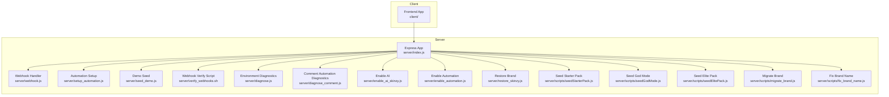
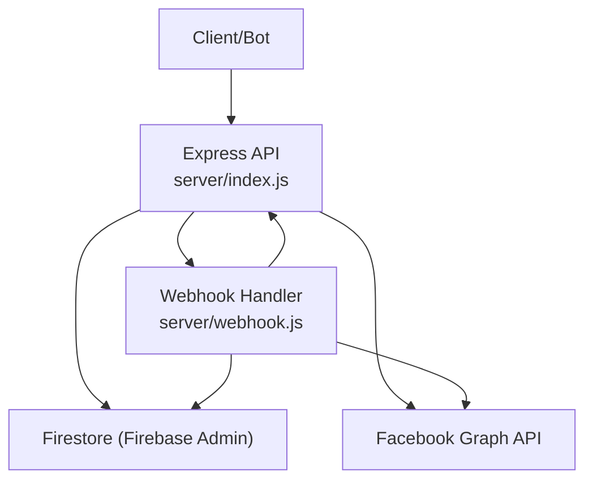
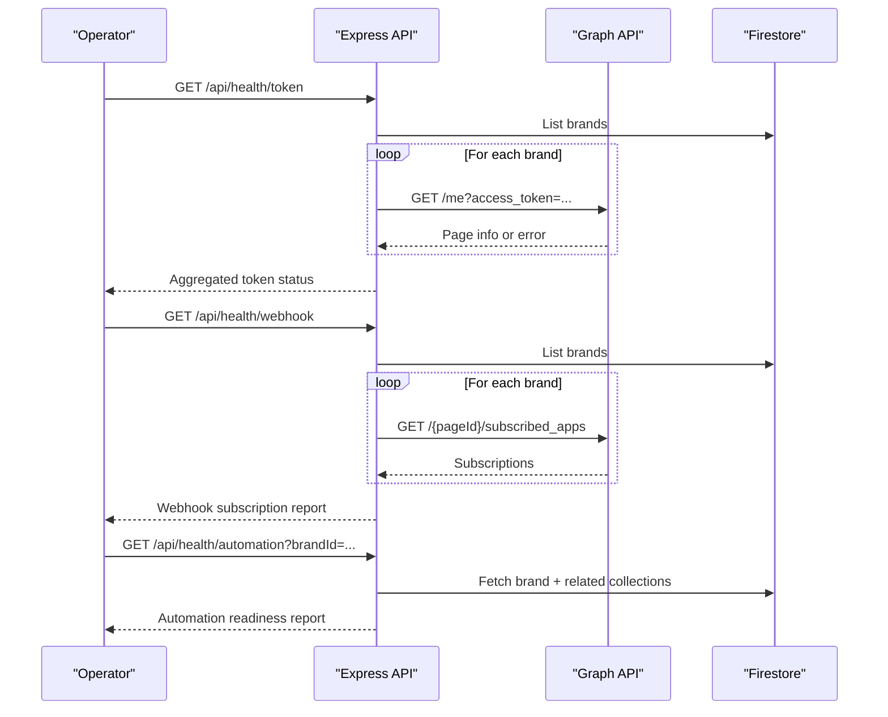
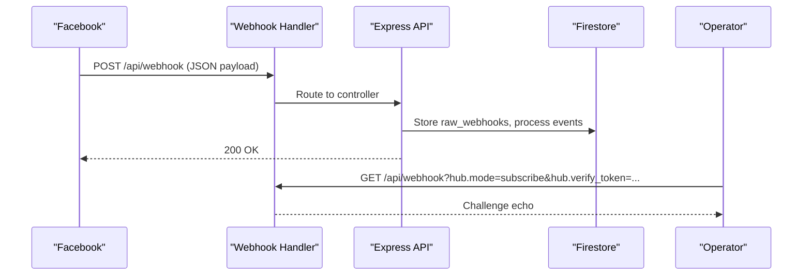
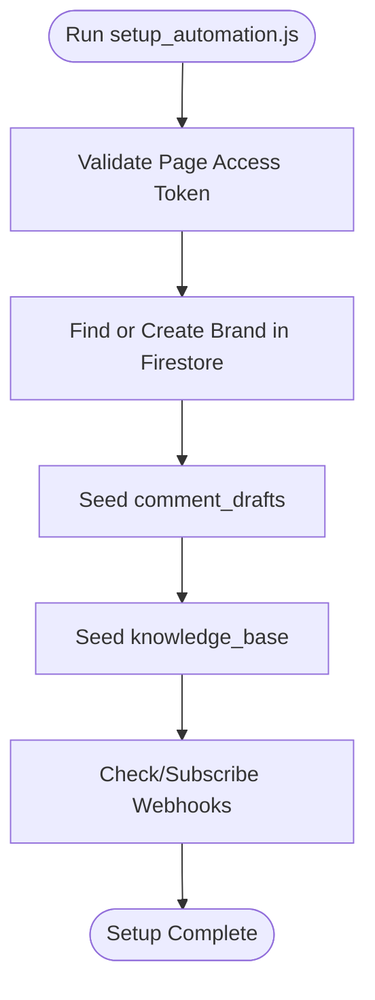
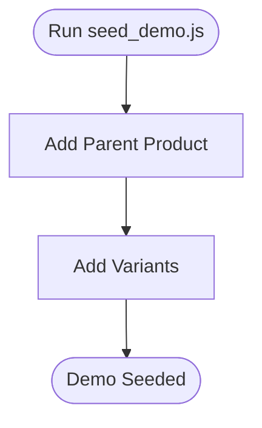
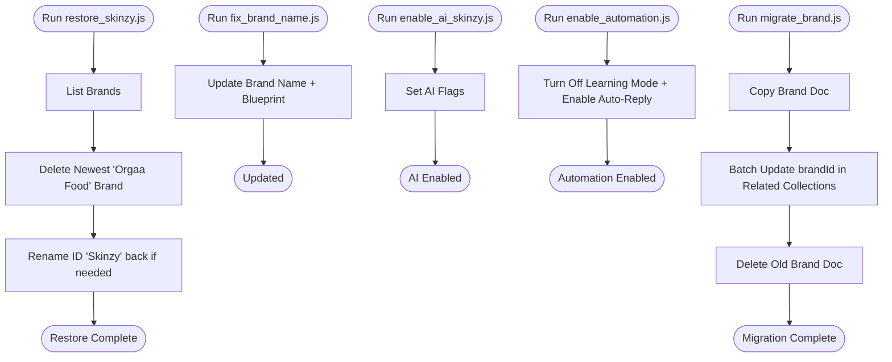
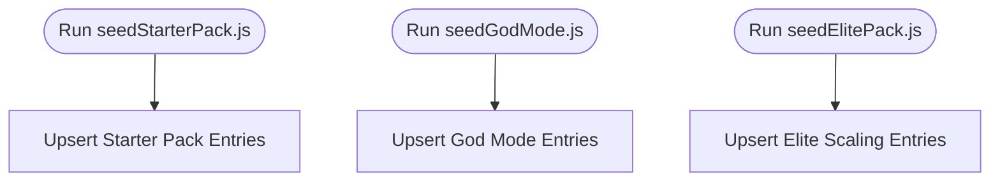
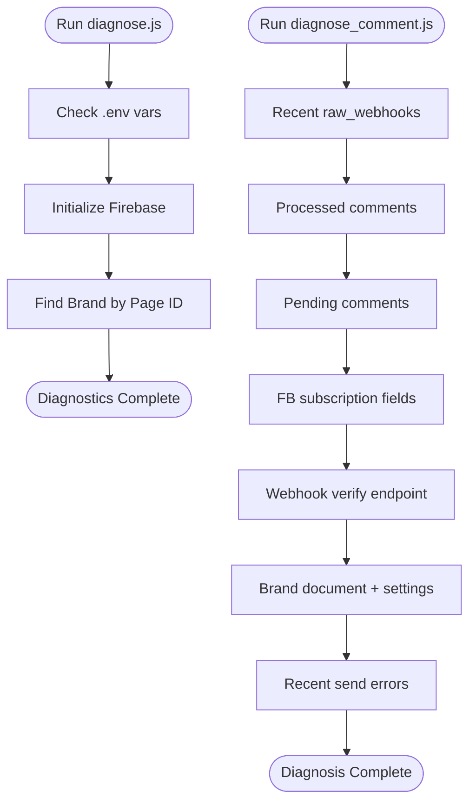
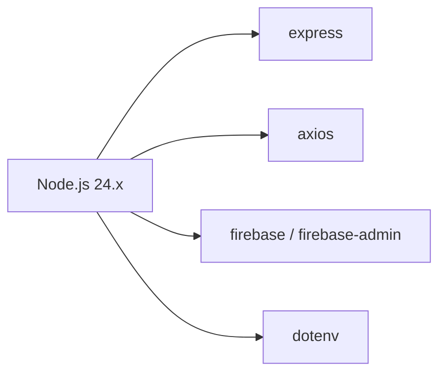

# Operational Procedures

<cite>
**Referenced Files in This Document**
- [server/index.js](file://server/index.js)
- [server/webhook.js](file://server/webhook.js)
- [server/setup_automation.js](file://server/setup_automation.js)
- [server/seed_demo.js](file://server/seed_demo.js)
- [server/verify_webhooks.sh](file://server/verify_webhooks.sh)
- [server/diagnose.js](file://server/diagnose.js)
- [server/diagnose_comment.js](file://server/diagnose_comment.js)
- [server/enable_ai_skinzy.js](file://server/enable_ai_skinzy.js)
- [server/enable_automation.js](file://server/enable_automation.js)
- [server/restore_skinzy.js](file://server/restore_skinzy.js)
- [server/scripts/seedStarterPack.js](file://server/scripts/seedStarterPack.js)
- [server/scripts/seedGodMode.js](file://server/scripts/seedGodMode.js)
- [server/scripts/seedElitePack.js](file://server/scripts/seedElitePack.js)
- [server/scripts/migrate_brand.js](file://server/scripts/migrate_brand.js)
- [server/scripts/fix_brand_name.js](file://server/scripts/fix_brand_name.js)
- [package.json](file://package.json)
</cite>

## Table of Contents
1. [Introduction](#introduction)
2. [Project Structure](#project-structure)
3. [Core Components](#core-components)
4. [Architecture Overview](#architecture-overview)
5. [Detailed Component Analysis](#detailed-component-analysis)
6. [Dependency Analysis](#dependency-analysis)
7. [Performance Considerations](#performance-considerations)
8. [Troubleshooting Guide](#troubleshooting-guide)
9. [Conclusion](#conclusion)
10. [Appendices](#appendices)

## Introduction
This document provides comprehensive operational procedures for routine maintenance, system administration, and emergency response. It covers automation setup, demo data seeding, brand restoration, webhook verification, system repair, recovery workflows, backup and restore, data migration, disaster recovery planning, runbooks, escalation procedures, post-incident analysis, capacity planning, performance tuning, and cost optimization strategies.

## Project Structure
The repository is a monorepo with a Node.js/Express backend, Firebase Admin integration, and a Vercel-compatible webhook handler. Operational scripts reside under server/ and server/scripts/, while the frontend is under client/.

**Diagram sources**
- [server/index.js:1-203](file://server/index.js#L1-L203)
- [server/webhook.js:1-22](file://server/webhook.js#L1-L22)
- [server/setup_automation.js:1-346](file://server/setup_automation.js#L1-L346)
- [server/seed_demo.js:1-69](file://server/seed_demo.js#L1-L69)
- [server/verify_webhooks.sh:1-55](file://server/verify_webhooks.sh#L1-L55)
- [server/diagnose.js:1-64](file://server/diagnose.js#L1-L64)
- [server/diagnose_comment.js:1-185](file://server/diagnose_comment.js#L1-L185)
- [server/enable_ai_skinzy.js:1-27](file://server/enable_ai_skinzy.js#L1-L27)
- [server/enable_automation.js:1-29](file://server/enable_automation.js#L1-L29)
- [server/restore_skinzy.js:1-53](file://server/restore_skinzy.js#L1-L53)
- [server/scripts/seedStarterPack.js:1-141](file://server/scripts/seedStarterPack.js#L1-L141)
- [server/scripts/seedGodMode.js:1-89](file://server/scripts/seedGodMode.js#L1-L89)
- [server/scripts/seedElitePack.js:1-135](file://server/scripts/seedElitePack.js#L1-L135)
- [server/scripts/migrate_brand.js:1-64](file://server/scripts/migrate_brand.js#L1-L64)
- [server/scripts/fix_brand_name.js:1-38](file://server/scripts/fix_brand_name.js#L1-L38)
- [package.json:1-40](file://package.json#L1-L40)

**Section sources**
- [server/index.js:1-203](file://server/index.js#L1-L203)
- [package.json:1-40](file://package.json#L1-L40)

## Core Components
- Express API with health checks for tokens, webhooks, and automation status
- Webhook endpoints for Facebook Messenger and comments
- Automation setup script to configure brand settings, seed replies/knowledge base, and validate subscriptions
- Demo data seeding for product catalog
- Diagnostic and verification scripts for environment, subscriptions, and processing
- Brand management utilities for enabling AI, restoring brand state, and migrating brands
- Knowledge packs for starter, god-mode, and elite scaling automation

**Section sources**
- [server/index.js:37-192](file://server/index.js#L37-L192)
- [server/webhook.js:1-22](file://server/webhook.js#L1-L22)
- [server/setup_automation.js:1-346](file://server/setup_automation.js#L1-L346)
- [server/seed_demo.js:1-69](file://server/seed_demo.js#L1-L69)
- [server/diagnose.js:1-64](file://server/diagnose.js#L1-L64)
- [server/diagnose_comment.js:1-185](file://server/diagnose_comment.js#L1-L185)
- [server/enable_ai_skinzy.js:1-27](file://server/enable_ai_skinzy.js#L1-L27)
- [server/enable_automation.js:1-29](file://server/enable_automation.js#L1-L29)
- [server/restore_skinzy.js:1-53](file://server/restore_skinzy.js#L1-L53)
- [server/scripts/seedStarterPack.js:1-141](file://server/scripts/seedStarterPack.js#L1-L141)
- [server/scripts/seedGodMode.js:1-89](file://server/scripts/seedGodMode.js#L1-L89)
- [server/scripts/seedElitePack.js:1-135](file://server/scripts/seedElitePack.js#L1-L135)
- [server/scripts/migrate_brand.js:1-64](file://server/scripts/migrate_brand.js#L1-L64)
- [server/scripts/fix_brand_name.js:1-38](file://server/scripts/fix_brand_name.js#L1-L38)

## Architecture Overview
The system exposes health endpoints and webhook handlers, integrates with Firebase Admin for Firestore operations, and interacts with the Facebook Graph API for token validation and webhook subscriptions.

**Diagram sources**
- [server/index.js:37-192](file://server/index.js#L37-L192)
- [server/webhook.js:1-22](file://server/webhook.js#L1-L22)

## Detailed Component Analysis

### Health Checks and Monitoring
- Token health: validates page access tokens per brand and environment token
- Webhook health: verifies subscribed fields for feed/messages
- Automation health: inspects brand automation settings and presence of drafts/knowledge base

**Diagram sources**
- [server/index.js:51-171](file://server/index.js#L51-L171)

**Section sources**
- [server/index.js:51-171](file://server/index.js#L51-L171)

### Webhook Endpoints and Verification
- Exposed at GET/POST /webhook and /api/webhook
- Dedicated handler app supports direct Vercel routing
- Verification script simulates comment and inbox events

**Diagram sources**
- [server/webhook.js:1-22](file://server/webhook.js#L1-L22)
- [server/index.js:39-42](file://server/index.js#L39-L42)
- [server/verify_webhooks.sh:1-55](file://server/verify_webhooks.sh#L1-L55)

**Section sources**
- [server/webhook.js:1-22](file://server/webhook.js#L1-L22)
- [server/index.js:39-42](file://server/index.js#L39-L42)
- [server/verify_webhooks.sh:1-55](file://server/verify_webhooks.sh#L1-L55)

### Automation Setup Procedure
- Validates page access token
- Updates/creates brand document with automation settings
- Seeds comment drafts and knowledge base
- Verifies/activates webhook subscriptions
- Produces a setup summary

**Diagram sources**
- [server/setup_automation.js:30-340](file://server/setup_automation.js#L30-L340)

**Section sources**
- [server/setup_automation.js:1-346](file://server/setup_automation.js#L1-L346)

### Demo Data Seeding
- Adds a parent product and variants for a brand
- Useful for testing product hub and variant linking

**Diagram sources**
- [server/seed_demo.js:5-65](file://server/seed_demo.js#L5-L65)

**Section sources**
- [server/seed_demo.js:1-69](file://server/seed_demo.js#L1-L69)

### Brand Restoration and Management
- Restore brand naming and blueprint
- Enable AI and automation flags
- Migrate brand identifiers across collections
- General brand cleanup and restoration

**Diagram sources**
- [server/restore_skinzy.js:13-49](file://server/restore_skinzy.js#L13-L49)
- [server/scripts/fix_brand_name.js:4-29](file://server/scripts/fix_brand_name.js#L4-L29)
- [server/enable_ai_skinzy.js:13-23](file://server/enable_ai_skinzy.js#L13-L23)
- [server/enable_automation.js:13-25](file://server/enable_automation.js#L13-L25)
- [server/scripts/migrate_brand.js:4-54](file://server/scripts/migrate_brand.js#L4-L54)

**Section sources**
- [server/restore_skinzy.js:1-53](file://server/restore_skinzy.js#L1-L53)
- [server/scripts/fix_brand_name.js:1-38](file://server/scripts/fix_brand_name.js#L1-L38)
- [server/enable_ai_skinzy.js:1-27](file://server/enable_ai_skinzy.js#L1-L27)
- [server/enable_automation.js:1-29](file://server/enable_automation.js#L1-L29)
- [server/scripts/migrate_brand.js:1-64](file://server/scripts/migrate_brand.js#L1-L64)

### Knowledge Packs and Scaling
- Starter pack: basic intents for greeting, pricing, delivery, authenticity, location, ordering, COD, returns, discount, stock
- God Mode: advanced conversion, cultural handling, anti-fraud, product-specific intelligence, logistics, growth, human handover, post-sales delight, SEO logic
- Elite Pack: trust/authority, wholesale/business partnership, urgency/logistics, payments/security, product specifics, human connection, post-purchase satisfaction

**Diagram sources**
- [server/scripts/seedStarterPack.js:114-137](file://server/scripts/seedStarterPack.js#L114-L137)
- [server/scripts/seedGodMode.js:57-85](file://server/scripts/seedGodMode.js#L57-L85)
- [server/scripts/seedElitePack.js:108-131](file://server/scripts/seedElitePack.js#L108-L131)

**Section sources**
- [server/scripts/seedStarterPack.js:1-141](file://server/scripts/seedStarterPack.js#L1-L141)
- [server/scripts/seedGodMode.js:1-89](file://server/scripts/seedGodMode.js#L1-L89)
- [server/scripts/seedElitePack.js:1-135](file://server/scripts/seedElitePack.js#L1-L135)

### Diagnostics and Verification
- Environment and Firebase checks
- Live comment automation diagnosis including raw webhooks, processed comments, pending comments, subscription fields, webhook verify endpoint, brand document, and recent error logs

**Diagram sources**
- [server/diagnose.js:9-60](file://server/diagnose.js#L9-L60)
- [server/diagnose_comment.js:18-181](file://server/diagnose_comment.js#L18-L181)

**Section sources**
- [server/diagnose.js:1-64](file://server/diagnose.js#L1-L64)
- [server/diagnose_comment.js:1-185](file://server/diagnose_comment.js#L1-L185)

## Dependency Analysis
- Node.js runtime pinned to 24.x
- Express, CORS, body-parser, dotenv, axios, firebase/firebase-admin
- Client build pipeline depends on Node.js and npm

**Diagram sources**
- [package.json:5-31](file://package.json#L5-L31)

**Section sources**
- [package.json:1-40](file://package.json#L1-L40)

## Performance Considerations
- Use limit queries and paginated reads for large collections (e.g., health checks)
- Batch writes for bulk updates during migrations
- Cache-friendly designs for frequent health checks
- Optimize webhook payload handling and early exits for unsupported events
- Monitor external API latency (Facebook Graph API) and apply timeouts

## Troubleshooting Guide
- Token invalid/expired: re-run token health check and renew page access token
- Missing webhook subscriptions: use setup script or diagnostics to subscribe fields
- No webhooks received: verify verify endpoint, subscription permissions, and app roles
- Automation disabled: enable AI and automation flags via dedicated scripts
- Brand naming issues: use fix_brand_name and restore_skinzy scripts
- Migration failures: validate brand existence and run batch updates carefully

**Section sources**
- [server/index.js:51-171](file://server/index.js#L51-L171)
- [server/diagnose_comment.js:82-120](file://server/diagnose_comment.js#L82-L120)
- [server/enable_ai_skinzy.js:13-23](file://server/enable_ai_skinzy.js#L13-L23)
- [server/enable_automation.js:13-25](file://server/enable_automation.js#L13-L25)
- [server/scripts/fix_brand_name.js:4-29](file://server/scripts/fix_brand_name.js#L4-L29)
- [server/scripts/migrate_brand.js:4-54](file://server/scripts/migrate_brand.js#L4-L54)

## Conclusion
These procedures provide a structured approach to maintaining the system, validating integrations, scaling automation, and recovering from incidents. Use the runbooks and scripts to automate routine tasks, monitor health continuously, and respond quickly to emergencies.

## Appendices

### Runbooks

#### Routine Maintenance
- Daily: check /api/health/token and /api/health/webhook
- Weekly: review /api/health/automation and run diagnostics
- Monthly: refresh page access tokens and re-seed knowledge packs as needed

#### Emergency Response
- Webhook outage:
  - Verify verify endpoint and subscription fields
  - Re-run setup script to activate subscriptions
- Automation failure:
  - Enable AI and automation flags
  - Confirm brand document settings
- Brand restoration:
  - Fix brand name and restore ID naming
  - Migrate brand identifiers if needed

#### Escalation Procedures
- Tier 1: Operator runs health checks and diagnostics
- Tier 2: Senior operator reviews logs and performs targeted repairs
- Tier 3: Platform team investigates infrastructure and third-party API issues

#### Post-Incident Analysis
- Document root cause, impact, and resolution steps
- Update knowledge packs with new intents
- Retest webhooks and automation after fixes

#### Backup and Restore
- Firestore snapshots for brands and related collections
- Version control for scripts and environment variables
- Test restore in staging before production

#### Disaster Recovery Planning
- Multi-region deployment strategy
- Automated failover for webhook endpoints
- Regular DR drills for database and app recovery

#### Capacity Planning and Cost Optimization
- Monitor API rate limits and adjust polling intervals
- Right-size instance types and autoscaling thresholds
- Optimize image and media storage costs
- Consolidate redundant automations and knowledge entries