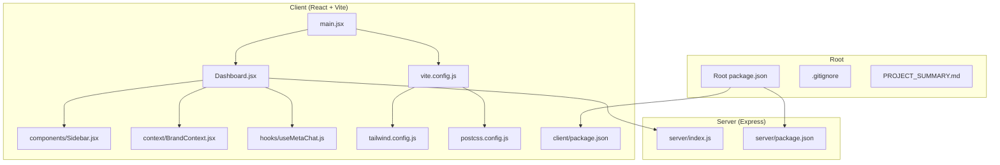
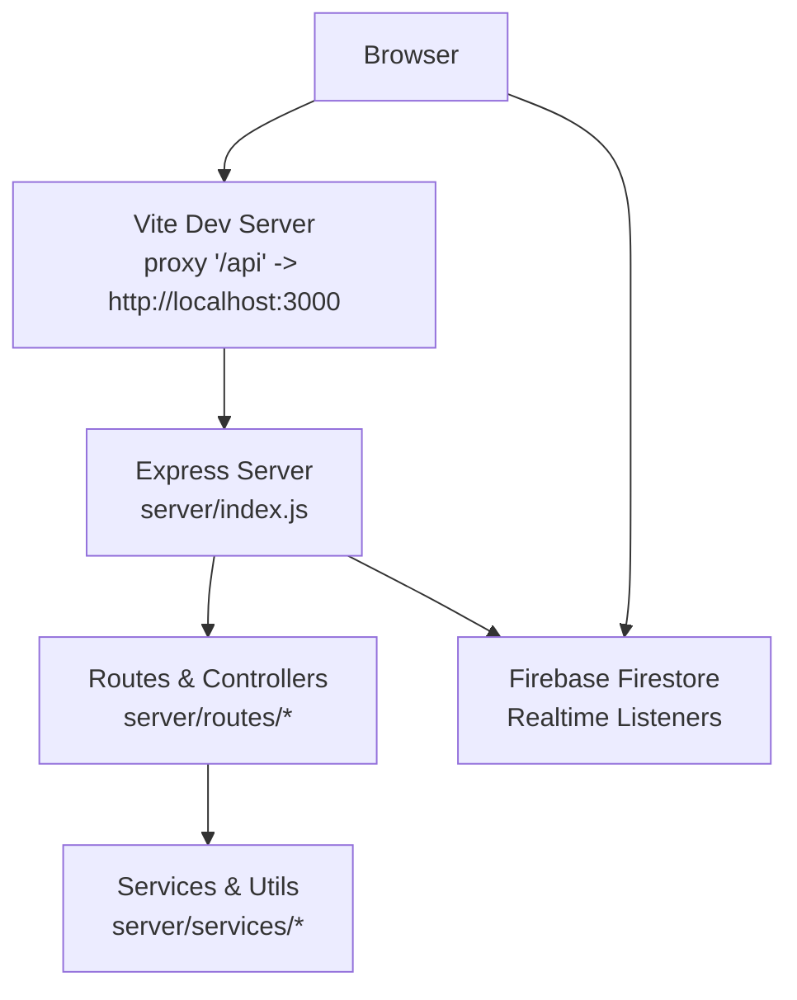
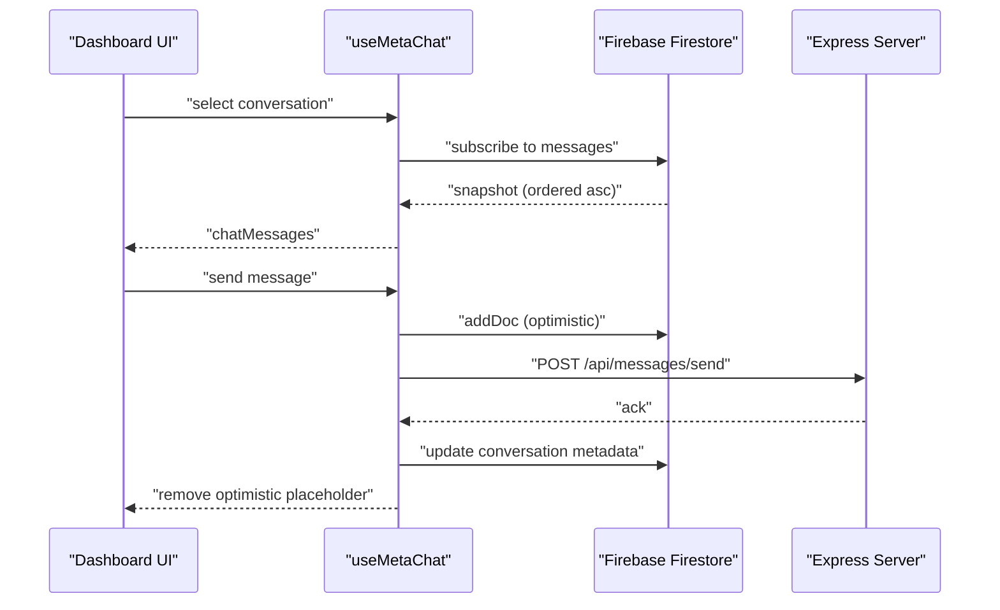
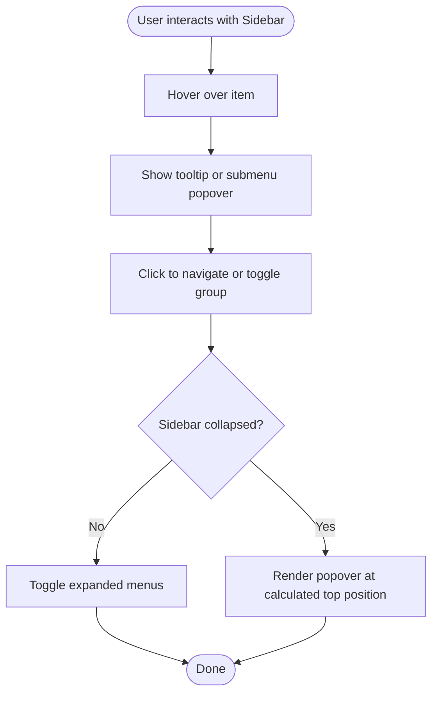
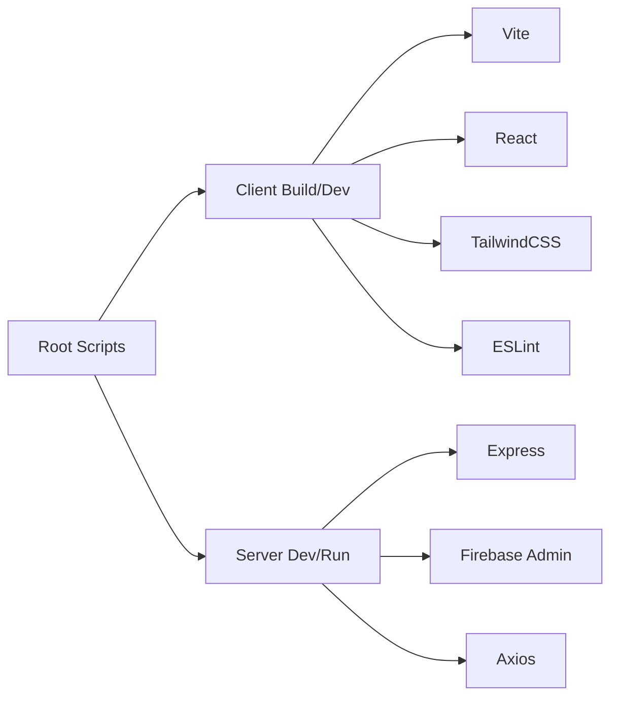

# Development Guidelines

<cite>
**Referenced Files in This Document**
- [package.json](file://package.json)
- [client/package.json](file://client/package.json)
- [server/package.json](file://server/package.json)
- [client/vite.config.js](file://client/vite.config.js)
- [client/tailwind.config.js](file://client/tailwind.config.js)
- [client/postcss.config.js](file://client/postcss.config.js)
- [PROJECT_SUMMARY.md](file://PROJECT_SUMMARY.md)
- [.gitignore](file://.gitignore)
- [client/src/main.jsx](file://client/src/main.jsx)
- [client/src/Dashboard.jsx](file://client/src/Dashboard.jsx)
- [client/src/components/Sidebar.jsx](file://client/src/components/Sidebar.jsx)
- [client/src/hooks/useMetaChat.js](file://client/src/hooks/useMetaChat.js)
- [client/src/context/BrandContext.jsx](file://client/src/context/BrandContext.jsx)
- [server/index.js](file://server/index.js)
</cite>

## Table of Contents
1. [Introduction](#introduction)
2. [Project Structure](#project-structure)
3. [Core Components](#core-components)
4. [Architecture Overview](#architecture-overview)
5. [Detailed Component Analysis](#detailed-component-analysis)
6. [Dependency Analysis](#dependency-analysis)
7. [Performance Considerations](#performance-considerations)
8. [Testing Strategies](#testing-strategies)
9. [Development Workflow and Contribution](#development-workflow-and-contribution)
10. [Build Configuration and Quality Assurance](#build-configuration-and-quality-assurance)
11. [Extending the Platform](#extending-the-platform)
12. [Troubleshooting Guide](#troubleshooting-guide)
13. [Conclusion](#conclusion)

## Introduction
This document defines comprehensive development guidelines for the Meta Business Solution monorepo. It covers code standards, testing strategies, contribution workflows, build configuration, linting, and quality assurance. It also explains JavaScript/React conventions, naming patterns, architectural principles, and how to extend the platform while maintaining consistency across the client (React + Vite) and server (Express) layers.

## Project Structure
The repository follows a monorepo layout with a clear separation between client and server:
- Root scripts orchestrate installation and builds for both client and server.
- Client is a React application built with Vite, styled with TailwindCSS and PostCSS.
- Server is an Express API with modular routes and services, plus CLI scripts for diagnostics and seeding.

**Diagram sources**
- [package.json:1-40](file://package.json#L1-L40)
- [client/src/main.jsx:1-12](file://client/src/main.jsx#L1-L12)
- [client/src/Dashboard.jsx:1-120](file://client/src/Dashboard.jsx#L1-L120)
- [client/src/components/Sidebar.jsx:1-60](file://client/src/components/Sidebar.jsx#L1-L60)
- [client/src/context/BrandContext.jsx:1-40](file://client/src/context/BrandContext.jsx#L1-L40)
- [client/src/hooks/useMetaChat.js:1-40](file://client/src/hooks/useMetaChat.js#L1-L40)
- [client/vite.config.js:1-16](file://client/vite.config.js#L1-L16)
- [client/tailwind.config.js:1-30](file://client/tailwind.config.js#L1-L30)
- [client/postcss.config.js:1-7](file://client/postcss.config.js#L1-L7)
- [server/index.js:1-40](file://server/index.js#L1-L40)

**Section sources**
- [PROJECT_SUMMARY.md:1-63](file://PROJECT_SUMMARY.md#L1-L63)
- [.gitignore:1-12](file://.gitignore#L1-L12)
- [package.json:1-40](file://package.json#L1-L40)

## Core Components
- Client entry initializes the React root and wraps the app with BrandProvider.
- Dashboard composes navigation, views, modals, and global UI state.
- Sidebar implements hierarchical navigation, tooltips, drag-and-drop reordering, and brand switching.
- BrandContext manages authentication state, brand selection, and usage statistics.
- useMetaChat encapsulates real-time messaging, optimistic updates, and outbound API calls.
- Server exposes modular routes and health checks, with CORS and body parsing configured.

**Section sources**
- [client/src/main.jsx:1-12](file://client/src/main.jsx#L1-L12)
- [client/src/Dashboard.jsx:116-280](file://client/src/Dashboard.jsx#L116-L280)
- [client/src/components/Sidebar.jsx:150-220](file://client/src/components/Sidebar.jsx#L150-L220)
- [client/src/context/BrandContext.jsx:7-76](file://client/src/context/BrandContext.jsx#L7-L76)
- [client/src/hooks/useMetaChat.js:16-58](file://client/src/hooks/useMetaChat.js#L16-L58)
- [server/index.js:25-46](file://server/index.js#L25-L46)

## Architecture Overview
The system uses a thin client (React/Vite) communicating with an Express API. Real-time updates are handled via Firebase Firestore listeners. The client proxies API requests to the server during development.

**Diagram sources**
- [client/vite.config.js:7-14](file://client/vite.config.js#L7-L14)
- [server/index.js:175-192](file://server/index.js#L175-L192)

**Section sources**
- [client/vite.config.js:1-16](file://client/vite.config.js#L1-L16)
- [server/index.js:1-40](file://server/index.js#L1-L40)

## Detailed Component Analysis

### React Hooks and Context
- useMetaChat: Manages conversation lists, message streams, optimistic UI, and outbound send requests. It normalizes timestamps and falls back to unsorted queries when Firestore indexes are missing.
- BrandContext: Centralizes authentication, brand enumeration, and usage stats updates with Firestore snapshots.

**Diagram sources**
- [client/src/hooks/useMetaChat.js:103-201](file://client/src/hooks/useMetaChat.js#L103-L201)
- [server/index.js:175-192](file://server/index.js#L175-L192)

**Section sources**
- [client/src/hooks/useMetaChat.js:16-101](file://client/src/hooks/useMetaChat.js#L16-L101)
- [client/src/context/BrandContext.jsx:15-60](file://client/src/context/BrandContext.jsx#L15-L60)

### Sidebar Navigation and Drag-and-Drop
- Implements collapsible navigation, grouped submenus, tooltips, and magnetic hover effects.
- Supports drag-and-drop reordering of main navigation items and long-press customization of mobile dock slots.

**Diagram sources**
- [client/src/components/Sidebar.jsx:6-17](file://client/src/components/Sidebar.jsx#L6-L17)
- [client/src/components/Sidebar.jsx:19-99](file://client/src/components/Sidebar.jsx#L19-L99)
- [client/src/components/Sidebar.jsx:312-444](file://client/src/components/Sidebar.jsx#L312-L444)

**Section sources**
- [client/src/components/Sidebar.jsx:150-543](file://client/src/components/Sidebar.jsx#L150-L543)

### Client Entry and Provider Setup
- main.jsx mounts the root and wraps the app with BrandProvider to share brand and user state across components.

**Section sources**
- [client/src/main.jsx:1-12](file://client/src/main.jsx#L1-L12)
- [client/src/context/BrandContext.jsx:225-243](file://client/src/context/BrandContext.jsx#L225-L243)

## Dependency Analysis
- Root orchestrates client/server builds and installs dependencies for both layers.
- Client depends on React, Vite, TailwindCSS, and ESLint tooling.
- Server depends on Express, CORS, body-parser, Firebase Admin, and various service libraries.

**Diagram sources**
- [package.json:8-13](file://package.json#L8-L13)
- [client/package.json:6-11](file://client/package.json#L6-L11)
- [server/package.json:6-24](file://server/package.json#L6-L24)

**Section sources**
- [package.json:1-40](file://package.json#L1-L40)
- [client/package.json:1-39](file://client/package.json#L1-L39)
- [server/package.json:1-26](file://server/package.json#L1-L26)

## Performance Considerations
- Client-side sorting and fallback ordering for message lists reduce reliance on Firestore composite indexes.
- Optimistic UI for sending messages improves perceived responsiveness; cleanup removes placeholders after acknowledgment.
- Firestore snapshots are used for real-time updates; ensure indexes exist for production to avoid fallbacks.

[No sources needed since this section provides general guidance]

## Testing Strategies
- Unit testing: Use a framework like Vitest or Jest to test React hooks and pure functions. Focus on useMetaChat logic (message ordering, optimistic updates) and BrandContext selectors.
- Integration testing: Mock Firebase SDK and Express routes to validate end-to-end flows (send message, receive updates).
- End-to-end testing: Use Playwright or Cypress to automate user journeys (login, switch brand, compose and send messages, verify real-time updates).
- Linting and formatting: Enforce ESLint rules and Prettier formatting to maintain code quality across the monorepo.

[No sources needed since this section provides general guidance]

## Development Workflow and Contribution
- Branching: Feature branches per task; keep main clean and deployable.
- Commit hygiene: Atomic commits with clear messages; reference issues.
- Pull Requests: Open PRs early; include screenshots for UI changes; ensure CI passes.
- Code Review: Require at least one reviewer; address comments promptly; keep diffs focused.
- Local setup: Install all dependencies using root script, configure environment variables, and run both client and server concurrently.

**Section sources**
- [PROJECT_SUMMARY.md:46-63](file://PROJECT_SUMMARY.md#L46-L63)
- [package.json:8-13](file://package.json#L8-L13)

## Build Configuration and Quality Assurance
- Build commands:
  - Root build compiles client and copies dist to public for deployment.
  - Client dev runs Vite; server dev runs nodemon on the Express entry.
- Linting: Client exposes an ESLint script; configure rules in the client’s ESLint configuration.
- Styles: Tailwind content scanning includes client source; PostCSS pipeline enabled.
- Environment: Client and server require environment files for API keys and credentials; ensure they are excluded from version control via .gitignore.

**Section sources**
- [package.json:8-13](file://package.json#L8-L13)
- [client/package.json:9](file://client/package.json#L9)
- [client/vite.config.js:1-16](file://client/vite.config.js#L1-L16)
- [client/tailwind.config.js:1-30](file://client/tailwind.config.js#L1-L30)
- [client/postcss.config.js:1-7](file://client/postcss.config.js#L1-L7)
- [.gitignore:1-12](file://.gitignore#L1-L12)

## Extending the Platform
- Adding a new view:
  - Create a new view component under client/src/components/Views/.
  - Register it in Dashboard main navigation and ensure translation keys exist.
  - Wire routing and hash-based navigation.
- Adding a new API endpoint:
  - Define route handlers in server/routes and controllers in server/controllers.
  - Add Express routes in server/index.js under the /api prefix.
  - Implement service logic in server/services and reuse shared utilities.
- Real-time updates:
  - Use Firebase Firestore collections and listeners in React components.
  - Keep timestamps normalized (numeric milliseconds) to avoid ordering issues.
- Theming and localization:
  - Extend Tailwind theme in tailwind.config.js.
  - Add new translation keys in client/utils/translations.js and reference them via the translation helper in components.

**Section sources**
- [client/src/Dashboard.jsx:432-496](file://client/src/Dashboard.jsx#L432-L496)
- [server/index.js:175-192](file://server/index.js#L175-L192)
- [client/tailwind.config.js:1-30](file://client/tailwind.config.js#L1-L30)

## Troubleshooting Guide
- Missing Firestore index errors:
  - useMetaChat falls back to unsorted queries and sorts client-side; add indexes in production to improve performance.
- Authentication issues:
  - Verify user session persistence and BrandContext initialization; check local storage keys.
- Development proxy:
  - Ensure Vite proxy targets the correct server port; confirm CORS settings in Express.

**Section sources**
- [client/src/hooks/useMetaChat.js:82-100](file://client/src/hooks/useMetaChat.js#L82-L100)
- [client/src/context/BrandContext.jsx:162-176](file://client/src/context/BrandContext.jsx#L162-L176)
- [client/vite.config.js:7-14](file://client/vite.config.js#L7-L14)
- [server/index.js:25-35](file://server/index.js#L25-L35)

## Conclusion
These guidelines establish a consistent foundation for building, testing, and extending the Meta Business Solution. By adhering to the documented conventions—React patterns, Firebase-first data flows, Express modular routes, and strong quality gates—you can deliver robust features while preserving system reliability and developer productivity.