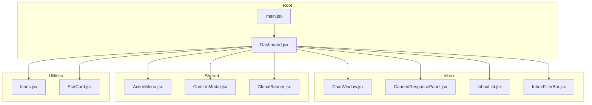
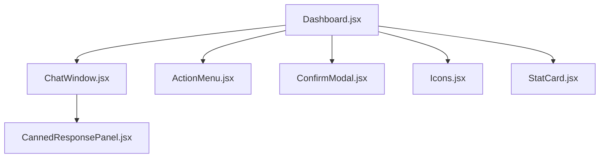
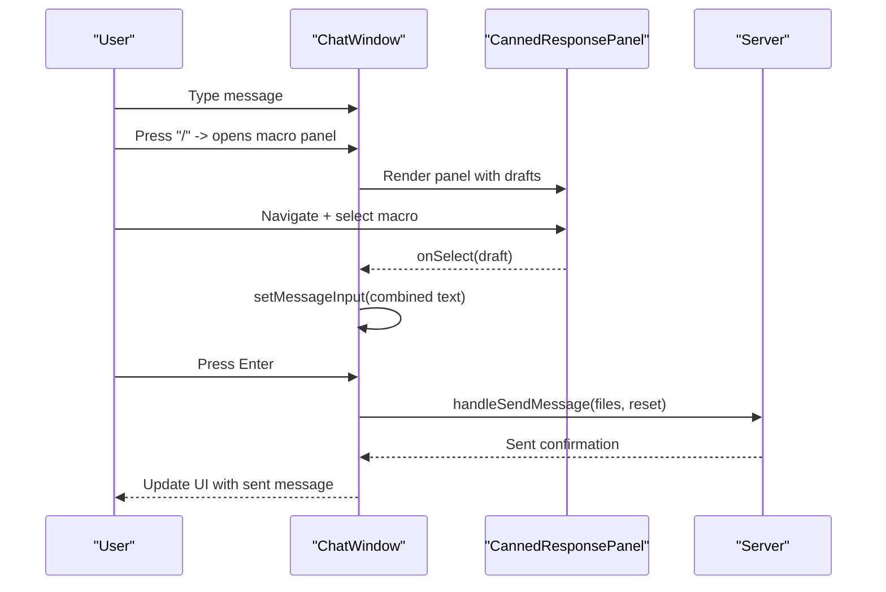
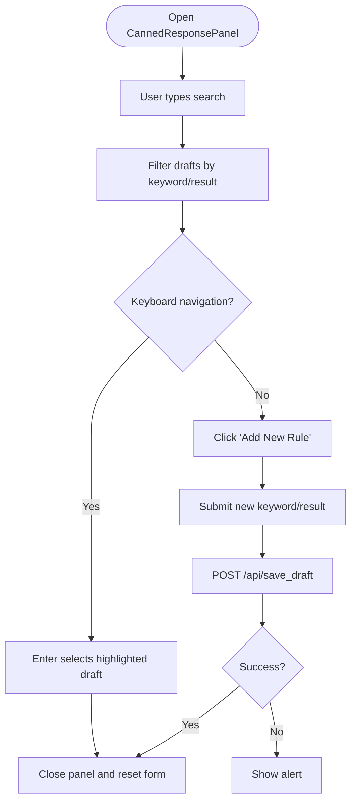
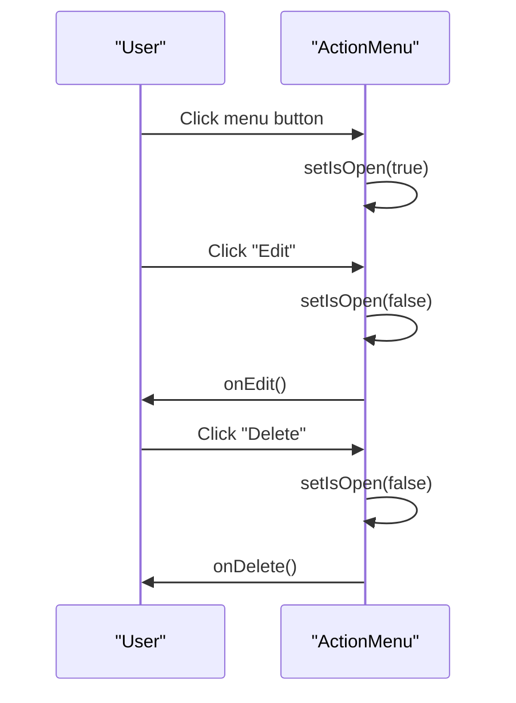
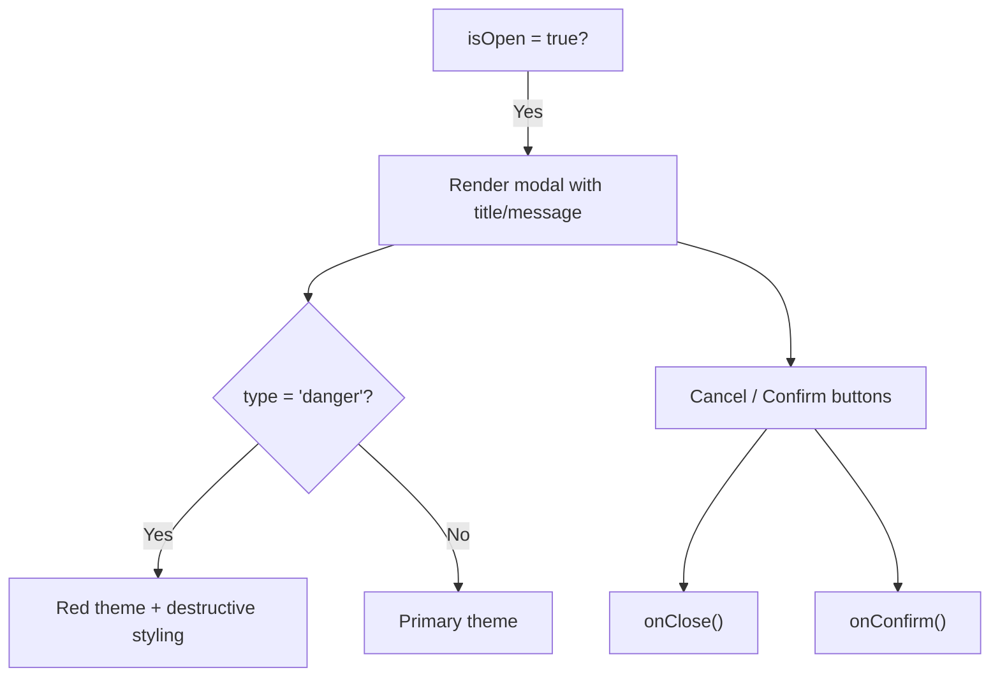
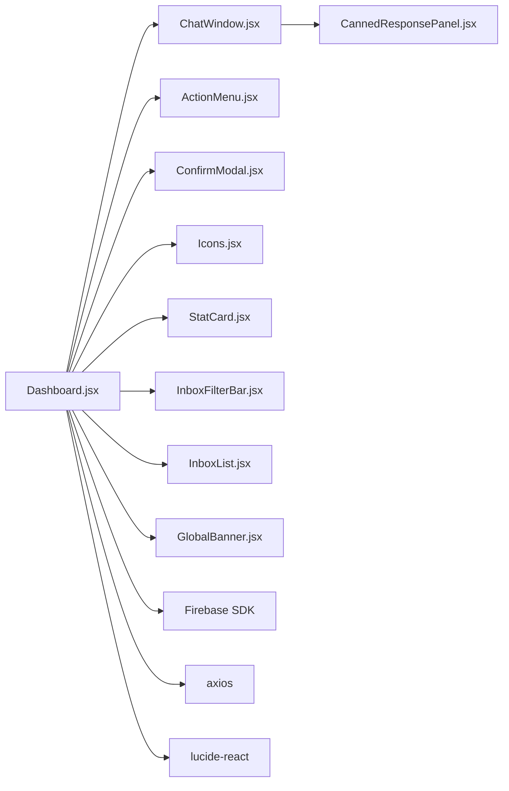

# Component Library

<cite>
**Referenced Files in This Document**
- [ChatWindow.jsx](file://client/src/components/Inbox/ChatWindow.jsx)
- [CannedResponsePanel.jsx](file://client/src/components/Inbox/CannedResponsePanel.jsx)
- [ActionMenu.jsx](file://client/src/components/Shared/ActionMenu.jsx)
- [ConfirmModal.jsx](file://client/src/components/Shared/ConfirmModal.jsx)
- [Icons.jsx](file://client/src/components/Icons.jsx)
- [StatCard.jsx](file://client/src/components/StatCard.jsx)
- [InboxList.jsx](file://client/src/components/Inbox/InboxList.jsx)
- [InboxFilterBar.jsx](file://client/src/components/Inbox/InboxFilterBar.jsx)
- [GlobalBanner.jsx](file://client/src/components/Shared/GlobalBanner.jsx)
- [Dashboard.jsx](file://client/src/Dashboard.jsx)
- [main.jsx](file://client/src/main.jsx)
- [package.json](file://client/package.json)
</cite>

## Table of Contents
1. [Introduction](#introduction)
2. [Project Structure](#project-structure)
3. [Core Components](#core-components)
4. [Architecture Overview](#architecture-overview)
5. [Detailed Component Analysis](#detailed-component-analysis)
6. [Dependency Analysis](#dependency-analysis)
7. [Performance Considerations](#performance-considerations)
8. [Troubleshooting Guide](#troubleshooting-guide)
9. [Conclusion](#conclusion)
10. [Appendices](#appendices)

## Introduction
This document describes the component library system used in the client application. It focuses on the modular component architecture centered around:
- Inbox components: ChatWindow and CannedResponsePanel
- Shared components: ActionMenu and ConfirmModal
- Utility components: Icons and StatCard
- Supporting components: InboxList, InboxFilterBar, and GlobalBanner

It explains component props, event handling patterns, reusability strategies, naming conventions, file organization, import/export patterns, composition, prop validation, and integration with the overall design system. It also provides guidelines for creating new components, maintaining consistency, and extending the library.

## Project Structure
The component library is organized by feature domains:
- Inbox: messaging and conversation UI
- Shared: reusable UI primitives and modals
- Utilities: icons and stat cards
- Views: higher-level pages/views
- Root: Dashboard orchestrates composition and state

**Diagram sources**
- [main.jsx:1-12](file://client/src/main.jsx#L1-L12)
- [Dashboard.jsx:116-1014](file://client/src/Dashboard.jsx#L116-L1014)
- [ChatWindow.jsx:1-478](file://client/src/components/Inbox/ChatWindow.jsx#L1-L478)
- [CannedResponsePanel.jsx:1-272](file://client/src/components/Inbox/CannedResponsePanel.jsx#L1-L272)
- [InboxList.jsx:1-150](file://client/src/components/Inbox/InboxList.jsx#L1-L150)
- [InboxFilterBar.jsx:1-151](file://client/src/components/Inbox/InboxFilterBar.jsx#L1-L151)
- [ActionMenu.jsx:1-59](file://client/src/components/Shared/ActionMenu.jsx#L1-L59)
- [ConfirmModal.jsx:1-56](file://client/src/components/Shared/ConfirmModal.jsx#L1-L56)
- [GlobalBanner.jsx:1-122](file://client/src/components/Shared/GlobalBanner.jsx#L1-L122)
- [Icons.jsx:1-181](file://client/src/components/Icons.jsx#L1-L181)
- [StatCard.jsx:1-30](file://client/src/components/StatCard.jsx#L1-L30)

**Section sources**
- [Dashboard.jsx:29-67](file://client/src/Dashboard.jsx#L29-L67)
- [main.jsx:1-12](file://client/src/main.jsx#L1-L12)

## Core Components
This section summarizes the primary components and their responsibilities.

- ChatWindow
  - Purpose: Conversation UI with message history, compose area, quick replies, media gallery, and contextual actions.
  - Key props: selection state, message arrays, handlers for send/suggest/delete/edit, UI flags, refs for scrolling.
  - Composition: Uses CannedResponsePanel for quick replies; integrates with InboxList and filters; supports forward/cancel interactions.
  - Event handling: keyboard shortcuts, context menus, touch gestures, click-outside detection.

- CannedResponsePanel
  - Purpose: Inline quick reply selector with search, navigation, and inline creation of new canned replies.
  - Key props: drafts, onSelect callback, theme mode, brand identifier.
  - Event handling: keyboard navigation, click-outside, form submission with API call.

- ActionMenu
  - Purpose: Context menu for edit/delete actions with localization support.
  - Key props: theme mode, callbacks for edit/delete, translation function.
  - Event handling: click-outside detection.

- ConfirmModal
  - Purpose: Confirmation dialog with danger vs neutral variants and localization.
  - Key props: open state, callbacks, title/message, theme mode, translation function, type.
  - Event handling: cancel/confirm actions.

- Icons
  - Purpose: SVG icon exports for platform and UI affordances.
  - Usage: Imported directly by Dashboard and other components.

- StatCard
  - Purpose: Metric card with optional trend indicator and theme-specific styling.
  - Key props: icon, title, value, color, trend, trendLabel, theme, dark mode flag.

**Section sources**
- [ChatWindow.jsx:5-14](file://client/src/components/Inbox/ChatWindow.jsx#L5-L14)
- [CannedResponsePanel.jsx:4-15](file://client/src/components/Inbox/CannedResponsePanel.jsx#L4-L15)
- [ActionMenu.jsx:4-16](file://client/src/components/Shared/ActionMenu.jsx#L4-L16)
- [ConfirmModal.jsx:4-5](file://client/src/components/Shared/ConfirmModal.jsx#L4-L5)
- [Icons.jsx:1-181](file://client/src/components/Icons.jsx#L1-L181)
- [StatCard.jsx:3-27](file://client/src/components/StatCard.jsx#L3-L27)

## Architecture Overview
The Dashboard composes Inbox components and Shared components to deliver a cohesive messaging experience. It manages global state (theme, language, navigation) and passes down props and callbacks to child components. Icons and StatCard are utility components reused across views.

**Diagram sources**
- [Dashboard.jsx:830-898](file://client/src/Dashboard.jsx#L830-L898)
- [ChatWindow.jsx:3-442](file://client/src/components/Inbox/ChatWindow.jsx#L3-L442)
- [CannedResponsePanel.jsx:89-268](file://client/src/components/Inbox/CannedResponsePanel.jsx#L89-L268)
- [ActionMenu.jsx:18-55](file://client/src/components/Shared/ActionMenu.jsx#L18-L55)
- [ConfirmModal.jsx:7-52](file://client/src/components/Shared/ConfirmModal.jsx#L7-L52)
- [Icons.jsx:1-181](file://client/src/components/Icons.jsx#L1-L181)
- [StatCard.jsx:3-27](file://client/src/components/StatCard.jsx#L3-L27)

## Detailed Component Analysis

### ChatWindow Analysis
- Props
  - Selection and conversation: selectedConvo, chatMessages, optimisticMessages
  - UI state: isDarkMode, messageInput, attachedFiles, showScrollButton
  - Handlers: handleSendMessage, handleSuggestReply, handleDeleteMessage, startEditMessage, cancelInteractions, onForward
  - Flags: isAiThinking, isSending, isSyncingHistory
  - Callbacks: setAttachedFiles, setReplyTo, onOpenOrderDrafting, onOpenCatalogShare, onBack, onScroll, scrollToBottom
  - Data: drafts, brandId
  - Refs: chatEndRef, setLightbox

- Event handling patterns
  - Keyboard shortcuts: Enter to send, Shift+Enter for newline, Tab/Arrows for macro navigation
  - Context menu: mouse right-click and long-press touch gesture
  - Click-outside: closes macro menu and context menu
  - File attachment: controlled input with preview removal
  - Scroll behavior: scroll-to-bottom button and auto-show/hide logic

- Composition
  - Integrates CannedResponsePanel for quick replies
  - Renders product cards and media galleries
  - Supports forward/cancel interactions and reply-to editing

**Diagram sources**
- [ChatWindow.jsx:59-89](file://client/src/components/Inbox/ChatWindow.jsx#L59-L89)
- [ChatWindow.jsx:435-442](file://client/src/components/Inbox/ChatWindow.jsx#L435-L442)
- [CannedResponsePanel.jsx:54-63](file://client/src/components/Inbox/CannedResponsePanel.jsx#L54-L63)

**Section sources**
- [ChatWindow.jsx:5-14](file://client/src/components/Inbox/ChatWindow.jsx#L5-L14)
- [ChatWindow.jsx:59-89](file://client/src/components/Inbox/ChatWindow.jsx#L59-L89)
- [ChatWindow.jsx:100-122](file://client/src/components/Inbox/ChatWindow.jsx#L100-L122)
- [ChatWindow.jsx:435-442](file://client/src/components/Inbox/ChatWindow.jsx#L435-L442)

### CannedResponsePanel Analysis
- Props
  - drafts: array of canned reply entries
  - onSelect: callback invoked with selected draft
  - isDarkMode: theme flag
  - brandId: context for saving new replies

- Event handling patterns
  - Keyboard navigation: Up/Down arrows, Enter to select
  - Click-outside to close
  - Inline form for adding new canned replies with validation and API submission

- API integration
  - Saves new draft via POST to /api/save_draft with keyword/result and brandId

**Diagram sources**
- [CannedResponsePanel.jsx:17-27](file://client/src/components/Inbox/CannedResponsePanel.jsx#L17-L27)
- [CannedResponsePanel.jsx:54-63](file://client/src/components/Inbox/CannedResponsePanel.jsx#L54-L63)
- [CannedResponsePanel.jsx:65-87](file://client/src/components/Inbox/CannedResponsePanel.jsx#L65-L87)

**Section sources**
- [CannedResponsePanel.jsx:4-15](file://client/src/components/Inbox/CannedResponsePanel.jsx#L4-L15)
- [CannedResponsePanel.jsx:54-63](file://client/src/components/Inbox/CannedResponsePanel.jsx#L54-L63)
- [CannedResponsePanel.jsx:65-87](file://client/src/components/Inbox/CannedResponsePanel.jsx#L65-L87)

### ActionMenu Analysis
- Props
  - isDarkMode: theme flag
  - onEdit, onDelete: callbacks
  - t: translation function

- Event handling patterns
  - Toggle open/close
  - Click-outside to close
  - Localized labels

**Diagram sources**
- [ActionMenu.jsx:18-55](file://client/src/components/Shared/ActionMenu.jsx#L18-L55)

**Section sources**
- [ActionMenu.jsx:4-16](file://client/src/components/Shared/ActionMenu.jsx#L4-L16)
- [ActionMenu.jsx:18-55](file://client/src/components/Shared/ActionMenu.jsx#L18-L55)

### ConfirmModal Analysis
- Props
  - isOpen, onClose, onConfirm: modal lifecycle and actions
  - title, message: content
  - isDarkMode, t: theme and localization
  - type: variant (danger vs default)

- Behavior
  - Renders backdrop and animated modal
  - Danger type uses red styling; others use primary color

**Diagram sources**
- [ConfirmModal.jsx:4-53](file://client/src/components/Shared/ConfirmModal.jsx#L4-L53)

**Section sources**
- [ConfirmModal.jsx:4-53](file://client/src/components/Shared/ConfirmModal.jsx#L4-L53)

### Icons Analysis
- Organization
  - Exports individual SVG icon components grouped by platform and UI affordance
  - Consistent signature: accept size prop with default

- Usage pattern
  - Imported directly by Dashboard and other components to render platform badges and UI icons

**Section sources**
- [Icons.jsx:1-181](file://client/src/components/Icons.jsx#L1-L181)

### StatCard Analysis
- Props
  - icon: icon component
  - title, value: metric text
  - color: accent color
  - trend, trendLabel: optional trend indicator
  - theme: styling variant (e.g., vortex)
  - isDarkMode: theme flag

- Behavior
  - Theme-aware borders and glows
  - Optional trend badge with positive/negative coloring

**Section sources**
- [StatCard.jsx:3-27](file://client/src/components/StatCard.jsx#L3-L27)

### Supporting Components
- InboxList
  - Filters and renders conversation threads with platform badges, priority indicators, and unread dots
  - Supports collapsed mode and active thread highlighting

- InboxFilterBar
  - Provides search, date filtering, and bulk-select mode with action toolbar

- GlobalBanner
  - Fetches live announcements from Firestore, handles dismissal, and local persistence

**Section sources**
- [InboxList.jsx:5-41](file://client/src/components/Inbox/InboxList.jsx#L5-L41)
- [InboxFilterBar.jsx:4-24](file://client/src/components/Inbox/InboxFilterBar.jsx#L4-L24)
- [GlobalBanner.jsx:6-53](file://client/src/components/Shared/GlobalBanner.jsx#L6-L53)

## Dependency Analysis
- Internal dependencies
  - Dashboard composes Inbox components and Shared components
  - ChatWindow depends on CannedResponsePanel
  - Dashboard imports Icons and StatCard for rendering

- External dependencies
  - lucide-react for UI icons
  - firebase for real-time data and persistence
  - axios for API requests
  - Tailwind CSS for styling

**Diagram sources**
- [Dashboard.jsx:29-67](file://client/src/Dashboard.jsx#L29-L67)
- [package.json:12-21](file://client/package.json#L12-L21)

**Section sources**
- [Dashboard.jsx:29-67](file://client/src/Dashboard.jsx#L29-L67)
- [package.json:12-21](file://client/package.json#L12-L21)

## Performance Considerations
- Rendering lists
  - Use memoization and stable callbacks to avoid unnecessary re-renders (e.g., stableScrollToBottom, stableSetSelectedConvoIds)
- Event handling
  - Debounce or throttle heavy handlers (e.g., scroll events)
- Conditional rendering
  - Modal overlays and large lists should be conditionally mounted/unmounted
- Image/media
  - Lazy-load and preview attachments; avoid rendering oversized images
- Theming
  - Prefer CSS variables or Tailwind utilities to minimize runtime style computations

## Troubleshooting Guide
- Macro panel not closing
  - Ensure click-outside handler removes context menu and macro panel state
  - Verify macroMenuRef is attached to the panel element

- Canned reply save fails
  - Confirm brandId is present and endpoint responds with 2xx
  - Check network errors and alert fallback

- Context menu overlaps
  - Adjust z-index and positioning logic to stay within viewport bounds

- ConfirmModal not responding
  - Verify isOpen prop and that onConfirm/onClose are passed correctly

**Section sources**
- [ChatWindow.jsx:91-98](file://client/src/components/Inbox/ChatWindow.jsx#L91-L98)
- [CannedResponsePanel.jsx:46-52](file://client/src/components/Inbox/CannedResponsePanel.jsx#L46-L52)
- [ConfirmModal.jsx:4-5](file://client/src/components/Shared/ConfirmModal.jsx#L4-L5)

## Conclusion
The component library follows a clear separation of concerns:
- Inbox components encapsulate messaging UI and interactions
- Shared components provide reusable primitives for actions and modals
- Utilities offer consistent iconography and metric displays
- Dashboard orchestrates composition, state, and cross-cutting concerns

Consistency is achieved through shared props, event patterns, theming, and localization. Extending the library involves adding new components under appropriate folders, exporting them from the Dashboard, and adhering to naming and prop conventions.

## Appendices

### Naming Conventions and File Organization
- Feature-based grouping: Inbox/, Shared/, Views/, components/
- PascalCase for component filenames and React component names
- Utility modules (Icons, StatCard) export pure components

**Section sources**
- [Dashboard.jsx:29-67](file://client/src/Dashboard.jsx#L29-L67)

### Import/Export Patterns
- Dashboard imports components directly from their feature folders
- Icons and StatCard are imported individually for tree-shaking benefits
- No barrel exports are used; explicit imports improve clarity

**Section sources**
- [Dashboard.jsx:29-67](file://client/src/Dashboard.jsx#L29-L67)
- [Icons.jsx:1-181](file://client/src/components/Icons.jsx#L1-L181)
- [StatCard.jsx:1-30](file://client/src/components/StatCard.jsx#L1-L30)

### Guidelines for Creating New Components
- Place in the appropriate folder (Inbox/Shared/Utility)
- Use PascalCase for filenames and component names
- Accept props minimally; favor composition over deep nesting
- Provide clear event callbacks for parent orchestration
- Respect isDarkMode and theme props consistently
- Localize text via t() where applicable
- Export default and keep side effects minimal
- Add to Dashboard imports and compose where appropriate