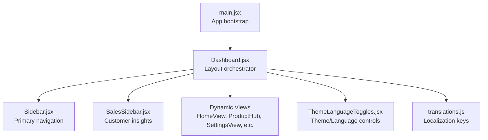
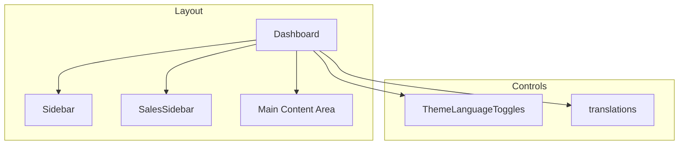
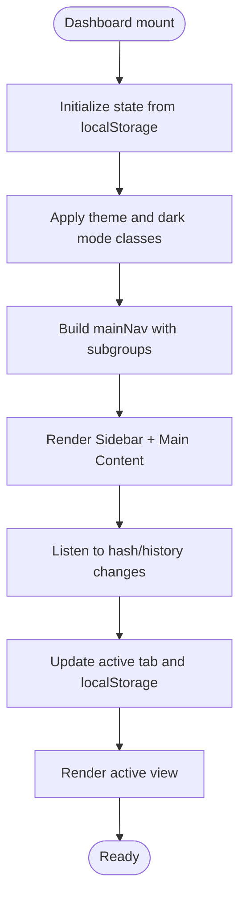
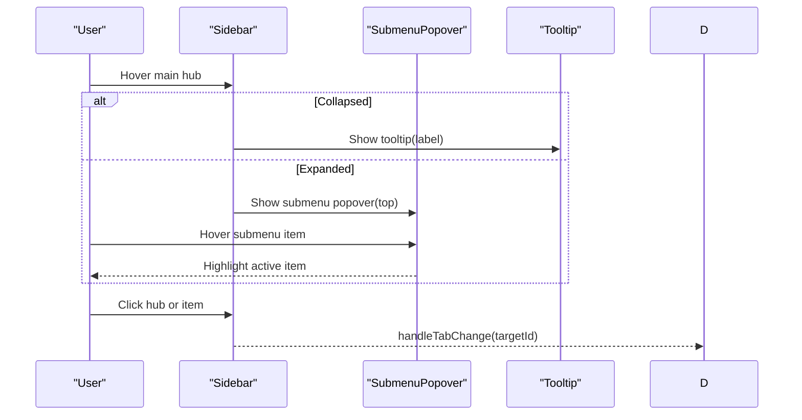
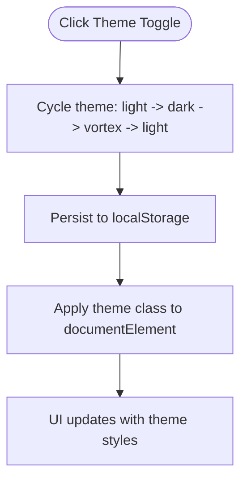
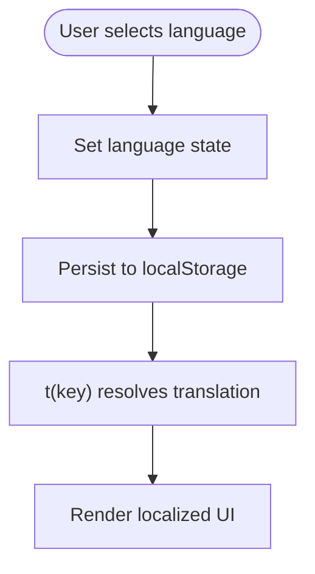
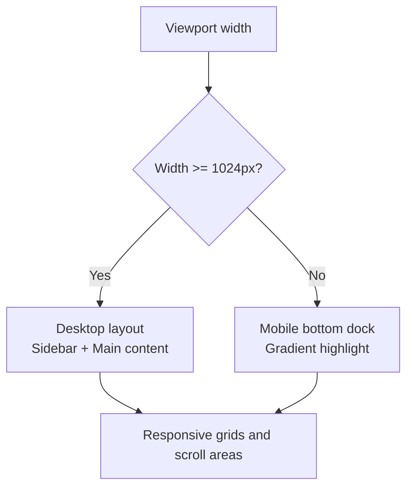
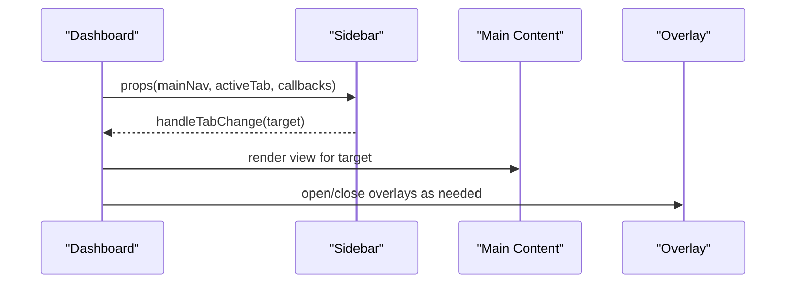
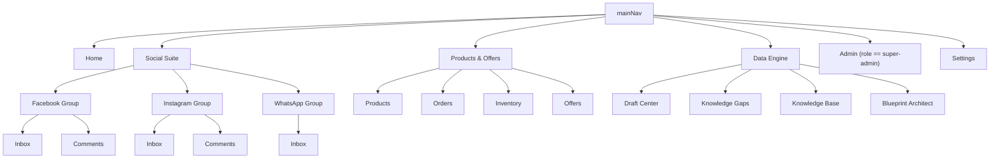
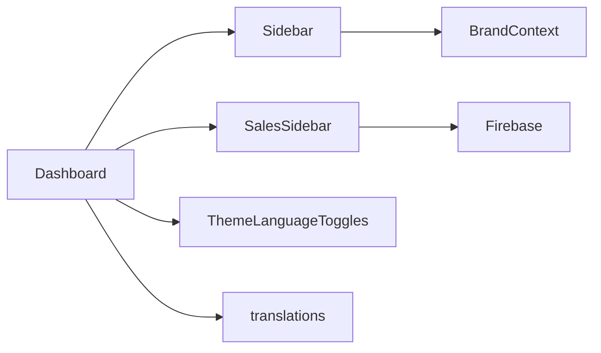

# Dashboard Interface

<cite>
**Referenced Files in This Document**
- [Dashboard.jsx](file://client/src/Dashboard.jsx)
- [Sidebar.jsx](file://client/src/components/Sidebar.jsx)
- [SalesSidebar.jsx](file://client/src/components/SalesSidebar.jsx)
- [ThemeLanguageToggles.jsx](file://client/src/components/ThemeLanguageToggles.jsx)
- [translations.js](file://client/src/utils/translations.js)
- [main.jsx](file://client/src/main.jsx)
</cite>

## Table of Contents
1. [Introduction](#introduction)
2. [Project Structure](#project-structure)
3. [Core Components](#core-components)
4. [Architecture Overview](#architecture-overview)
5. [Detailed Component Analysis](#detailed-component-analysis)
6. [Dependency Analysis](#dependency-analysis)
7. [Performance Considerations](#performance-considerations)
8. [Troubleshooting Guide](#troubleshooting-guide)
9. [Conclusion](#conclusion)

## Introduction
This document describes the Dashboard interface system, focusing on the main layout structure, sidebar navigation, theme switching, and language localization. It explains responsive design patterns, grid systems, and component composition, and covers navigation hierarchy, menu organization, active state management, and user experience patterns. It also provides guidance on customizing layouts, extending navigation options, and maintaining consistent UI patterns across screen sizes.

## Project Structure
The Dashboard is the central orchestrator that composes the sidebar, content area, and interactive overlays. It manages persistent state (theme, language, active tab, sidebar collapse), navigation configuration, and dynamic content rendering. The sidebar provides hierarchical navigation with collapsible groups and tooltips. The Sales sidebar appears alongside chat windows to present customer insights and order history. Theme and language toggles are integrated into the settings view and global controls.

**Diagram sources**
- [main.jsx:1-12](file://client/src/main.jsx#L1-L12)
- [Dashboard.jsx:116-1014](file://client/src/Dashboard.jsx#L116-L1014)
- [Sidebar.jsx:150-543](file://client/src/components/Sidebar.jsx#L150-L543)
- [SalesSidebar.jsx:9-362](file://client/src/components/SalesSidebar.jsx#L9-L362)
- [ThemeLanguageToggles.jsx:1-50](file://client/src/components/ThemeLanguageToggles.jsx#L1-L50)
- [translations.js:1-266](file://client/src/utils/translations.js#L1-L266)

**Section sources**
- [main.jsx:1-12](file://client/src/main.jsx#L1-L12)
- [Dashboard.jsx:116-1014](file://client/src/Dashboard.jsx#L116-L1014)

## Core Components
- Dashboard: Central layout manager, state persistence, navigation configuration, and dynamic content rendering. Manages theme, language, active tab, sidebar collapse, and mobile navigation.
- Sidebar: Collapsible primary navigation with grouped hubs, tooltips, brand switcher, and subscription health indicator.
- SalesSidebar: Right-side panel for customer insights, contact details, shared media preview, AI analytics, and order history.
- ThemeLanguageToggles: Theme cycling and language selection controls.
- translations: Localization dictionary for English and Bengali.

Key responsibilities:
- Layout orchestration and responsive breakpoints
- Persistent state via localStorage
- Dynamic content routing based on active tab
- Interactive overlays and modals

**Section sources**
- [Dashboard.jsx:116-1014](file://client/src/Dashboard.jsx#L116-L1014)
- [Sidebar.jsx:150-543](file://client/src/components/Sidebar.jsx#L150-L543)
- [SalesSidebar.jsx:9-362](file://client/src/components/SalesSidebar.jsx#L9-L362)
- [ThemeLanguageToggles.jsx:1-50](file://client/src/components/ThemeLanguageToggles.jsx#L1-L50)
- [translations.js:1-266](file://client/src/utils/translations.js#L1-L266)

## Architecture Overview
The Dashboard composes modular views and sidebars, with state managed centrally. Navigation is hierarchical with main hubs and subgroups. Theme and language are persisted and applied globally. The layout adapts to desktop and mobile with a bottom dock for quick access.

**Diagram sources**
- [Dashboard.jsx:786-1014](file://client/src/Dashboard.jsx#L786-L1014)
- [Sidebar.jsx:150-543](file://client/src/components/Sidebar.jsx#L150-L543)
- [SalesSidebar.jsx:9-362](file://client/src/components/SalesSidebar.jsx#L9-L362)
- [ThemeLanguageToggles.jsx:1-50](file://client/src/components/ThemeLanguageToggles.jsx#L1-L50)
- [translations.js:1-266](file://client/src/utils/translations.js#L1-L266)

## Detailed Component Analysis

### Dashboard Layout and State Management
- Persistent state:
  - Dark mode and theme persistence
  - Active tab with URL hash and localStorage synchronization
  - Sidebar collapsed state
  - Navigation slots customization
- Navigation configuration:
  - Hierarchical mainNav with subgroups and nested items
  - Dynamic visibility based on role (e.g., admin)
- Responsive behavior:
  - Desktop: Full-width sidebar with collapsible groups
  - Mobile: Bottom dock with customizable slots and long-press picker
- Content area:
  - Route-based rendering of views (HomeView, ProductHub, SettingsView, etc.)
  - Special handling for chat and comment management screens
- Error boundary:
  - Global error handling around major sections

**Diagram sources**
- [Dashboard.jsx:116-263](file://client/src/Dashboard.jsx#L116-L263)
- [Dashboard.jsx:432-496](file://client/src/Dashboard.jsx#L432-L496)
- [Dashboard.jsx:806-951](file://client/src/Dashboard.jsx#L806-L951)

**Section sources**
- [Dashboard.jsx:116-263](file://client/src/Dashboard.jsx#L116-L263)
- [Dashboard.jsx:432-496](file://client/src/Dashboard.jsx#L432-L496)
- [Dashboard.jsx:806-951](file://client/src/Dashboard.jsx#L806-L951)

### Sidebar Navigation Implementation
- Collapsible design:
  - Width transitions between compact and expanded modes
  - Mobile overlay with slide-in animation
- Navigation hierarchy:
  - Main hubs with icons and labels
  - Subgroups with expand/collapse
  - Nested items under grouped hubs
- Tooltips and popovers:
  - Collapsed mode shows tooltip for labels
  - Expanded mode shows submenu popover with hover bridge
- Brand switcher:
  - Dropdown to switch brands and open onboarding
- Subscription health:
  - Plan health bar and expiry date display
- Drag-and-drop:
  - Reorder main hubs via drag events

**Diagram sources**
- [Sidebar.jsx:19-99](file://client/src/components/Sidebar.jsx#L19-L99)
- [Sidebar.jsx:514-539](file://client/src/components/Sidebar.jsx#L514-L539)

**Section sources**
- [Sidebar.jsx:150-543](file://client/src/components/Sidebar.jsx#L150-L543)

### Theme Switching Functionality
- Theme cycle:
  - Cycle through light, dark, vortex themes
  - Persist to localStorage and apply to document element
- Visual indicators:
  - Theme-specific styling and glow effects
- Integration:
  - Controlled by ThemeToggle component and SettingsView

**Diagram sources**
- [ThemeLanguageToggles.jsx:4-32](file://client/src/components/ThemeLanguageToggles.jsx#L4-L32)
- [Dashboard.jsx:219-231](file://client/src/Dashboard.jsx#L219-L231)

**Section sources**
- [ThemeLanguageToggles.jsx:1-50](file://client/src/components/ThemeLanguageToggles.jsx#L1-L50)
- [Dashboard.jsx:219-231](file://client/src/Dashboard.jsx#L219-L231)

### Language Localization Features
- Translation keys:
  - Comprehensive English and Bengali dictionaries
- Runtime translation:
  - t(key) function resolves localized strings
- Usage:
  - Applied to labels, buttons, and UI text across components
- Language toggle:
  - Switch between English and Bengali

**Diagram sources**
- [translations.js:1-266](file://client/src/utils/translations.js#L1-L266)
- [Dashboard.jsx:265-267](file://client/src/Dashboard.jsx#L265-L267)
- [ThemeLanguageToggles.jsx:34-49](file://client/src/components/ThemeLanguageToggles.jsx#L34-L49)

**Section sources**
- [translations.js:1-266](file://client/src/utils/translations.js#L1-L266)
- [Dashboard.jsx:265-267](file://client/src/Dashboard.jsx#L265-L267)
- [ThemeLanguageToggles.jsx:34-49](file://client/src/components/ThemeLanguageToggles.jsx#L34-L49)

### Responsive Design Patterns and Grid Systems
- Breakpoints:
  - Desktop: Full sidebar, main content area
  - Mobile: Bottom dock with animated gradient highlight
- Layout containers:
  - Flexbox-based layout with overflow handling
  - Edge-to-edge wrapper for full-viewport backgrounds
- Grids:
  - Responsive grids for media galleries and navigation pickers
- Scroll behavior:
  - Custom scrollbars and smooth scrolling in chat area
  - Auto-show scroll-to-bottom button when scrolled near bottom

**Diagram sources**
- [Dashboard.jsx:776-781](file://client/src/Dashboard.jsx#L776-L781)
- [Dashboard.jsx:614-670](file://client/src/Dashboard.jsx#L614-L670)
- [SalesSidebar.jsx:89-96](file://client/src/components/SalesSidebar.jsx#L89-L96)

**Section sources**
- [Dashboard.jsx:614-670](file://client/src/Dashboard.jsx#L614-L670)
- [Dashboard.jsx:776-781](file://client/src/Dashboard.jsx#L776-L781)
- [SalesSidebar.jsx:89-96](file://client/src/components/SalesSidebar.jsx#L89-L96)

### Component Composition and Integration
- Sidebar integration:
  - Receives mainNav, activeTab, callbacks, and theme state
  - Provides brand switcher and subscription health
- Content area integration:
  - Renders views based on active tab
  - Passes theme, language, and handlers to child components
- Interactive overlays:
  - Order drafting, catalog share, media gallery, lightbox, follow-up modal
- Mobile menu:
  - Bottom dock with long-press navigation picker

**Diagram sources**
- [Dashboard.jsx:786-804](file://client/src/Dashboard.jsx#L786-L804)
- [Dashboard.jsx:828-951](file://client/src/Dashboard.jsx#L828-L951)
- [Dashboard.jsx:954-1008](file://client/src/Dashboard.jsx#L954-L1008)

**Section sources**
- [Dashboard.jsx:786-804](file://client/src/Dashboard.jsx#L786-L804)
- [Dashboard.jsx:828-951](file://client/src/Dashboard.jsx#L828-L951)
- [Dashboard.jsx:954-1008](file://client/src/Dashboard.jsx#L954-L1008)

### Navigation Hierarchy, Menu Organization, and Active State Management
- Main hubs:
  - Home, Social Suite, Products & Offers, Data Engine, Admin, Settings
- Subgroups:
  - Platform-specific groups (Facebook, Instagram, WhatsApp)
  - Nested items under each platform group
- Active state:
  - Highlight parent hub when a child is active
  - Visual indicators for active items and subgroups
- Role-based visibility:
  - Admin hub shown only for super-admin

**Diagram sources**
- [Dashboard.jsx:432-496](file://client/src/Dashboard.jsx#L432-L496)

**Section sources**
- [Dashboard.jsx:432-496](file://client/src/Dashboard.jsx#L432-L496)

### User Experience Patterns
- Smooth animations:
  - Entrance animations for panels and overlays
  - Gradient highlights and glow effects
- Accessibility:
  - Clear visual feedback for active states
  - Hover states and focus affordances
- Interaction patterns:
  - Long-press to customize bottom dock slots
  - Drag-and-drop reordering of main hubs
  - Tooltip and popover interactions for navigation

**Section sources**
- [Dashboard.jsx:580-670](file://client/src/Dashboard.jsx#L580-L670)
- [Sidebar.jsx:176-190](file://client/src/components/Sidebar.jsx#L176-L190)

## Dependency Analysis
- Dashboard depends on:
  - Sidebar for navigation
  - SalesSidebar for customer insights
  - ThemeLanguageToggles for theme/language controls
  - translations for localization
- Sidebar depends on:
  - Brand context for brand switching
  - Tooltip and SubmenuPopover for UX
- SalesSidebar depends on:
  - Firebase for contact updates
  - Conversation and order data

**Diagram sources**
- [Dashboard.jsx:46-66](file://client/src/Dashboard.jsx#L46-L66)
- [Sidebar.jsx:1-4](file://client/src/components/Sidebar.jsx#L1-L4)
- [SalesSidebar.jsx:1-7](file://client/src/components/SalesSidebar.jsx#L1-L7)

**Section sources**
- [Dashboard.jsx:46-66](file://client/src/Dashboard.jsx#L46-L66)
- [Sidebar.jsx:1-4](file://client/src/components/Sidebar.jsx#L1-L4)
- [SalesSidebar.jsx:1-7](file://client/src/components/SalesSidebar.jsx#L1-L7)

## Performance Considerations
- Memoization:
  - UseMemo for computed stats and metrics to avoid unnecessary recalculations
- Local storage:
  - Persist state to reduce re-computation on reload
- Conditional rendering:
  - Only render overlays and modals when needed
- Scroll handling:
  - Debounced scroll listeners and smooth scrolling for chat
- Animations:
  - Prefer CSS transitions and hardware-accelerated properties

[No sources needed since this section provides general guidance]

## Troubleshooting Guide
- Theme not applying:
  - Verify localStorage key and document class application
  - Ensure ThemeToggle persists and cycles correctly
- Language not updating:
  - Confirm t() function resolves keys and language state is persisted
- Navigation not responding:
  - Check handleTabChange and hash/history listeners
  - Validate mainNav structure and activeTab state
- Sidebar not collapsing:
  - Inspect isSidebarCollapsed state and localStorage persistence
- Mobile dock not appearing:
  - Verify bottom dock rendering and long-press handlers

**Section sources**
- [Dashboard.jsx:219-231](file://client/src/Dashboard.jsx#L219-L231)
- [Dashboard.jsx:265-267](file://client/src/Dashboard.jsx#L265-L267)
- [Dashboard.jsx:250-263](file://client/src/Dashboard.jsx#L250-L263)
- [Dashboard.jsx:143-146](file://client/src/Dashboard.jsx#L143-L146)
- [Dashboard.jsx:614-670](file://client/src/Dashboard.jsx#L614-L670)

## Conclusion
The Dashboard interface system integrates a robust layout, hierarchical navigation, theme and language controls, and responsive design patterns. Its modular composition enables easy customization of navigation slots, extension of hubs, and consistent UI across devices. By leveraging memoization, local storage persistence, and thoughtful UX patterns, the system balances performance and usability.