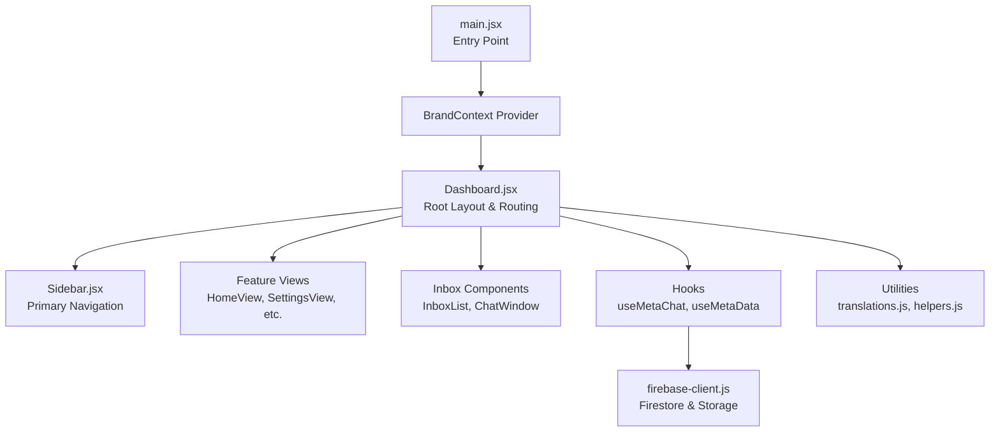
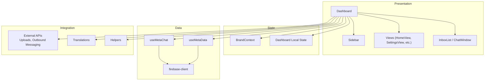
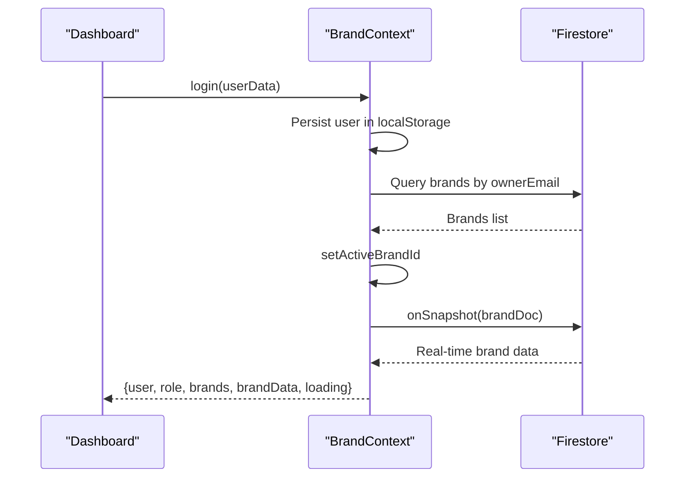
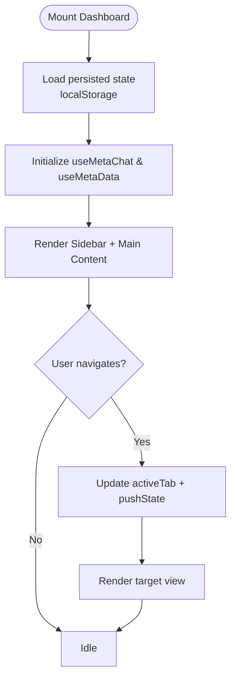
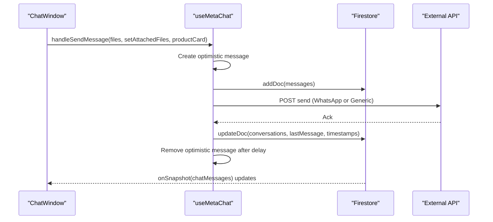
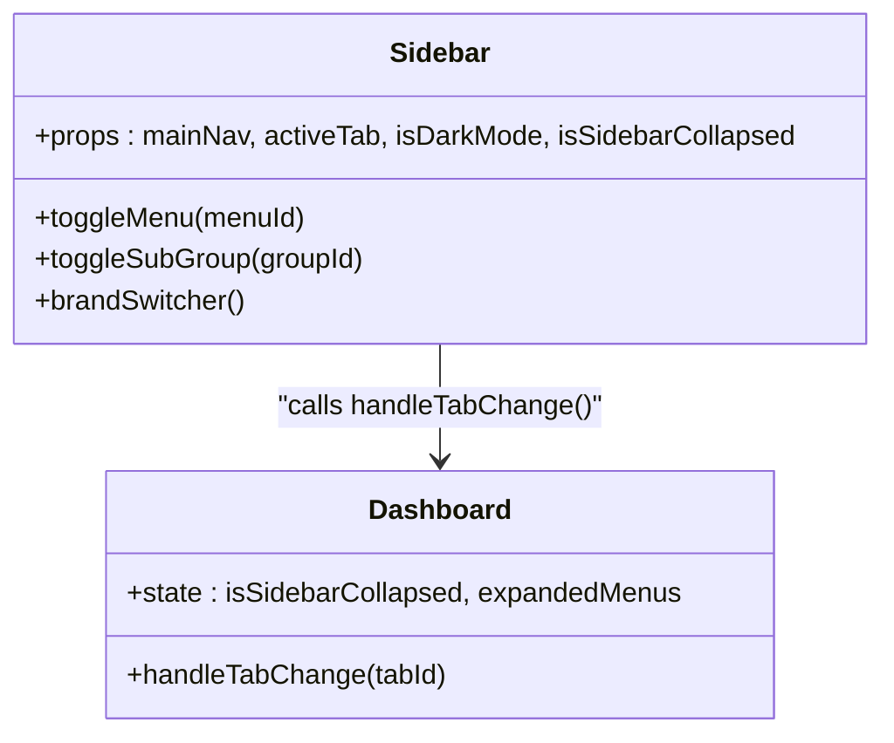
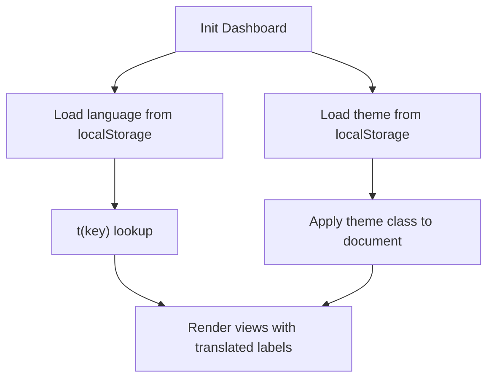
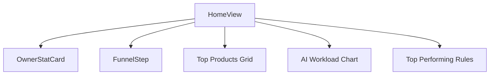
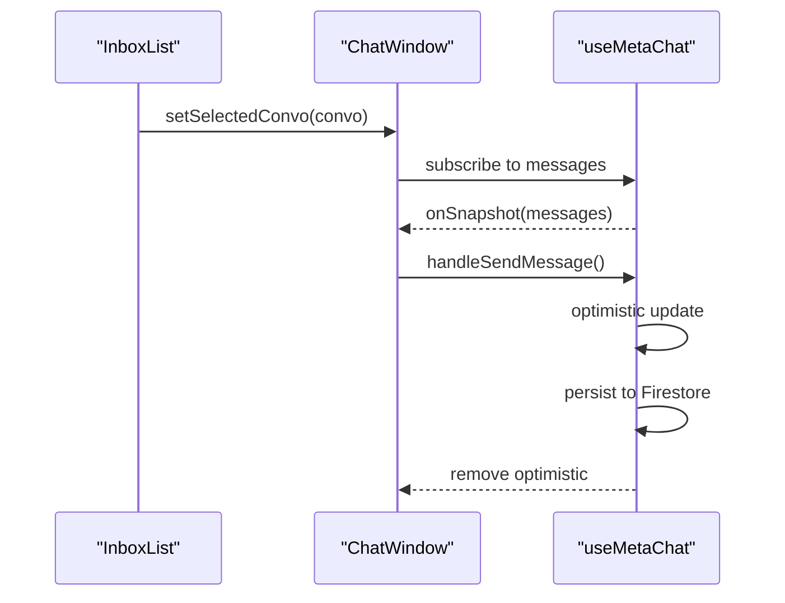
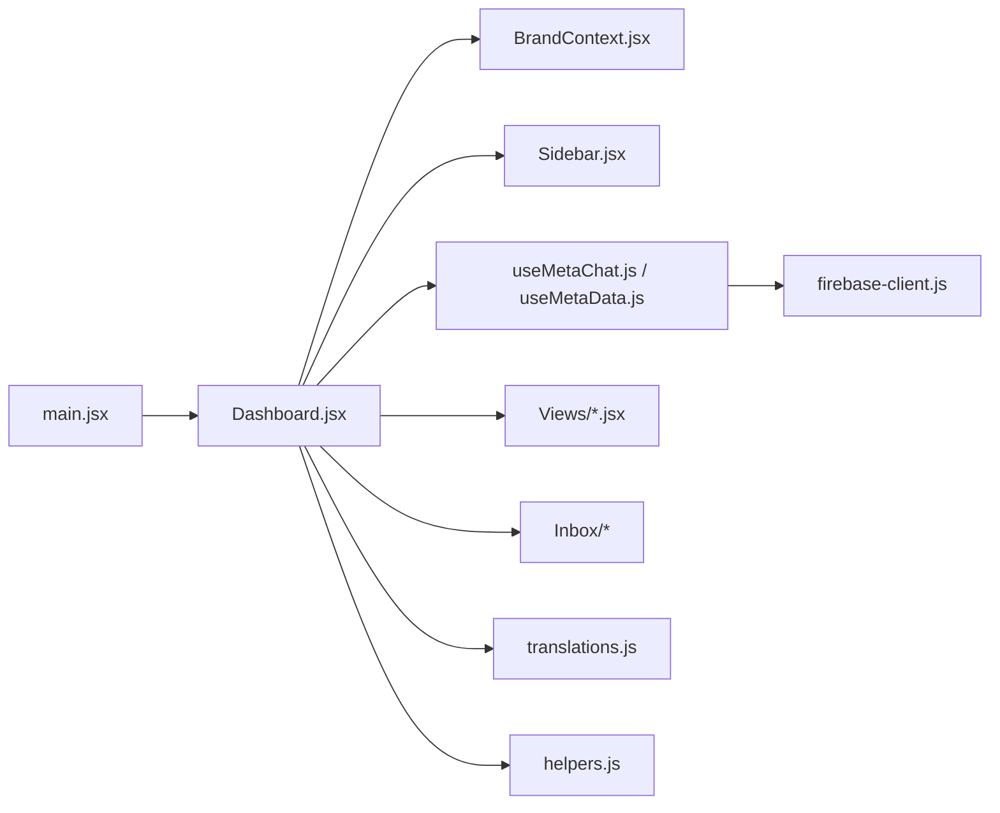

# Frontend Application

<cite>
**Referenced Files in This Document**
- [client/src/main.jsx](file://client/src/main.jsx)
- [client/src/Dashboard.jsx](file://client/src/Dashboard.jsx)
- [client/src/context/BrandContext.jsx](file://client/src/context/BrandContext.jsx)
- [client/src/firebase-client.js](file://client/src/firebase-client.js)
- [client/src/hooks/useMetaChat.js](file://client/src/hooks/useMetaChat.js)
- [client/src/hooks/useMetaData.js](file://client/src/hooks/useMetaData.js)
- [client/src/components/Sidebar.jsx](file://client/src/components/Sidebar.jsx)
- [client/src/components/Inbox/ChatWindow.jsx](file://client/src/components/Inbox/ChatWindow.jsx)
- [client/src/components/Inbox/InboxList.jsx](file://client/src/components/Inbox/InboxList.jsx)
- [client/src/components/Views/HomeView.jsx](file://client/src/components/Views/HomeView.jsx)
- [client/src/components/ThemeLanguageToggles.jsx](file://client/src/components/ThemeLanguageToggles.jsx)
- [client/src/utils/translations.js](file://client/src/utils/translations.js)
- [client/src/utils/helpers.js](file://client/src/utils/helpers.js)
</cite>

## Table of Contents
1. [Introduction](#introduction)
2. [Project Structure](#project-structure)
3. [Core Components](#core-components)
4. [Architecture Overview](#architecture-overview)
5. [Detailed Component Analysis](#detailed-component-analysis)
6. [Dependency Analysis](#dependency-analysis)
7. [Performance Considerations](#performance-considerations)
8. [Troubleshooting Guide](#troubleshooting-guide)
9. [Conclusion](#conclusion)
10. [Appendices](#appendices)

## Introduction
This document describes the React-based dashboard frontend for a unified business operations platform. It focuses on the component architecture, state management via BrandContext, real-time communication with Firebase, and responsive design. It also covers the modular component hierarchy, navigation system, theme and localization support, and interactive UI patterns. Special emphasis is placed on the Dashboard layout, sidebar navigation, real-time messaging components, and integration with Firebase for real-time synchronization, optimistic updates, and offline resilience strategies.

## Project Structure
The frontend is organized around a single-page application entry point that mounts the Dashboard inside a BrandContext provider. The Dashboard orchestrates navigation, persistent UI state, and renders feature-specific views. Real-time data is sourced from Firebase via dedicated hooks and shared context. Localization and theming are supported globally.

**Diagram sources**
- [client/src/main.jsx:1-12](file://client/src/main.jsx#L1-L12)
- [client/src/Dashboard.jsx:116-1014](file://client/src/Dashboard.jsx#L116-L1014)
- [client/src/context/BrandContext.jsx:7-242](file://client/src/context/BrandContext.jsx#L7-L242)
- [client/src/firebase-client.js:1-26](file://client/src/firebase-client.js#L1-L26)
- [client/src/hooks/useMetaChat.js:16-244](file://client/src/hooks/useMetaChat.js#L16-L244)
- [client/src/hooks/useMetaData.js:6-83](file://client/src/hooks/useMetaData.js#L6-L83)
- [client/src/utils/translations.js:1-266](file://client/src/utils/translations.js#L1-L266)
- [client/src/utils/helpers.js:1-10](file://client/src/utils/helpers.js#L1-L10)

**Section sources**
- [client/src/main.jsx:1-12](file://client/src/main.jsx#L1-L12)
- [client/src/Dashboard.jsx:116-1014](file://client/src/Dashboard.jsx#L116-L1014)

## Core Components
- BrandContext: Centralized brand and user state with real-time Firestore listeners, role-aware rendering, and usage statistics updates.
- Dashboard: Orchestrates persistent UI state (theme, language, sidebar, tabs), navigation, and renders feature views. Integrates real-time hooks and Firebase actions.
- Sidebar: Collapsible primary navigation with grouped hubs, tooltips, and brand switcher.
- useMetaChat: Real-time inbox and chat management with optimistic updates, reply/edit/delete, and external API posting.
- useMetaData: Real-time data for knowledge gaps, drafts, library, products, conversations, orders, and comment-related collections.
- InboxList and ChatWindow: Interactive inbox list and chat UI with macros, media gallery, and contextual actions.
- ThemeLanguageToggles: Theme cycling and language switching utilities.
- Translations and Helpers: Localization dictionary and safe date conversion utility.

**Section sources**
- [client/src/context/BrandContext.jsx:1-250](file://client/src/context/BrandContext.jsx#L1-L250)
- [client/src/Dashboard.jsx:116-1014](file://client/src/Dashboard.jsx#L116-L1014)
- [client/src/components/Sidebar.jsx:1-543](file://client/src/components/Sidebar.jsx#L1-L543)
- [client/src/hooks/useMetaChat.js:16-244](file://client/src/hooks/useMetaChat.js#L16-L244)
- [client/src/hooks/useMetaData.js:6-83](file://client/src/hooks/useMetaData.js#L6-L83)
- [client/src/components/Inbox/InboxList.jsx:1-150](file://client/src/components/Inbox/InboxList.jsx#L1-L150)
- [client/src/components/Inbox/ChatWindow.jsx:1-478](file://client/src/components/Inbox/ChatWindow.jsx#L1-L478)
- [client/src/components/ThemeLanguageToggles.jsx:1-50](file://client/src/components/ThemeLanguageToggles.jsx#L1-L50)
- [client/src/utils/translations.js:1-266](file://client/src/utils/translations.js#L1-L266)
- [client/src/utils/helpers.js:1-10](file://client/src/utils/helpers.js#L1-L10)

## Architecture Overview
The application follows a layered architecture:
- Presentation Layer: Dashboard and feature views.
- State Layer: BrandContext for brand/user state and role; local state in Dashboard for UI and routing.
- Data Layer: useMetaChat and useMetaData for real-time Firestore subscriptions; Firebase client initialization.
- Integration Layer: External API calls for uploads and outbound messaging; translation and helper utilities.

**Diagram sources**
- [client/src/Dashboard.jsx:116-1014](file://client/src/Dashboard.jsx#L116-L1014)
- [client/src/context/BrandContext.jsx:7-242](file://client/src/context/BrandContext.jsx#L7-L242)
- [client/src/hooks/useMetaChat.js:16-244](file://client/src/hooks/useMetaChat.js#L16-L244)
- [client/src/hooks/useMetaData.js:6-83](file://client/src/hooks/useMetaData.js#L6-L83)
- [client/src/firebase-client.js:1-26](file://client/src/firebase-client.js#L1-L26)
- [client/src/utils/translations.js:1-266](file://client/src/utils/translations.js#L1-L266)
- [client/src/utils/helpers.js:1-10](file://client/src/utils/helpers.js#L1-L10)

## Detailed Component Analysis

### BrandContext and Authentication Flow
BrandContext manages user session, brand selection, and real-time brand data. It initializes Firestore, listens to brand documents, and exposes role-aware state. It also supports registration and usage statistics updates.

**Diagram sources**
- [client/src/context/BrandContext.jsx:7-242](file://client/src/context/BrandContext.jsx#L7-L242)

**Section sources**
- [client/src/context/BrandContext.jsx:1-250](file://client/src/context/BrandContext.jsx#L1-L250)

### Dashboard Navigation and Persistent State
Dashboard maintains persistent UI state (theme, language, sidebar collapse, active tab, navigation slots) and orchestrates navigation between views. It computes metrics per active hub and renders overlays and modals.

**Diagram sources**
- [client/src/Dashboard.jsx:116-1014](file://client/src/Dashboard.jsx#L116-L1014)

**Section sources**
- [client/src/Dashboard.jsx:116-1014](file://client/src/Dashboard.jsx#L116-L1014)

### Real-Time Messaging with Optimistic Updates
useMetaChat sets up real-time listeners for conversations and messages, applies client-side sorting, and implements optimistic updates for immediate feedback during sending. It posts to external APIs for outbound delivery and updates conversation metadata.

**Diagram sources**
- [client/src/hooks/useMetaChat.js:16-244](file://client/src/hooks/useMetaChat.js#L16-L244)
- [client/src/components/Inbox/ChatWindow.jsx:1-478](file://client/src/components/Inbox/ChatWindow.jsx#L1-L478)

**Section sources**
- [client/src/hooks/useMetaChat.js:16-244](file://client/src/hooks/useMetaChat.js#L16-L244)
- [client/src/components/Inbox/ChatWindow.jsx:1-478](file://client/src/components/Inbox/ChatWindow.jsx#L1-L478)

### Sidebar Navigation and Brand Switching
Sidebar renders grouped navigation hubs, supports collapsible mode, and provides a brand switcher. It integrates with Dashboard to toggle menus and navigate to hubs.

**Diagram sources**
- [client/src/components/Sidebar.jsx:150-543](file://client/src/components/Sidebar.jsx#L150-L543)
- [client/src/Dashboard.jsx:116-1014](file://client/src/Dashboard.jsx#L116-L1014)

**Section sources**
- [client/src/components/Sidebar.jsx:1-543](file://client/src/components/Sidebar.jsx#L1-L543)
- [client/src/Dashboard.jsx:116-1014](file://client/src/Dashboard.jsx#L116-L1014)

### Localization and Theming
Localization is handled via a translations dictionary keyed by language. Theme toggling cycles among predefined themes and persists selections. Language and theme are applied globally in Dashboard and propagated to child components.

**Diagram sources**
- [client/src/Dashboard.jsx:116-1014](file://client/src/Dashboard.jsx#L116-L1014)
- [client/src/utils/translations.js:1-266](file://client/src/utils/translations.js#L1-L266)
- [client/src/components/ThemeLanguageToggles.jsx:1-50](file://client/src/components/ThemeLanguageToggles.jsx#L1-L50)

**Section sources**
- [client/src/utils/translations.js:1-266](file://client/src/utils/translations.js#L1-L266)
- [client/src/components/ThemeLanguageToggles.jsx:1-50](file://client/src/components/ThemeLanguageToggles.jsx#L1-L50)
- [client/src/Dashboard.jsx:116-1014](file://client/src/Dashboard.jsx#L116-L1014)

### HomeView Metrics and Cards
HomeView composes reusable cards and funnel steps to present financial, growth, product, and AI workload metrics. It reads from Dashboard-provided stats and uses localized labels.

**Diagram sources**
- [client/src/components/Views/HomeView.jsx:1-250](file://client/src/components/Views/HomeView.jsx#L1-L250)

**Section sources**
- [client/src/components/Views/HomeView.jsx:1-250](file://client/src/components/Views/HomeView.jsx#L1-L250)

### InboxList and ChatWindow Interactions
InboxList filters and renders conversations with platform badges and status indicators. ChatWindow implements message composition, macros, contextual actions, media preview, and optimistic rendering.

**Diagram sources**
- [client/src/components/Inbox/InboxList.jsx:1-150](file://client/src/components/Inbox/InboxList.jsx#L1-L150)
- [client/src/components/Inbox/ChatWindow.jsx:1-478](file://client/src/components/Inbox/ChatWindow.jsx#L1-L478)
- [client/src/hooks/useMetaChat.js:16-244](file://client/src/hooks/useMetaChat.js#L16-L244)

**Section sources**
- [client/src/components/Inbox/InboxList.jsx:1-150](file://client/src/components/Inbox/InboxList.jsx#L1-L150)
- [client/src/components/Inbox/ChatWindow.jsx:1-478](file://client/src/components/Inbox/ChatWindow.jsx#L1-L478)
- [client/src/hooks/useMetaChat.js:16-244](file://client/src/hooks/useMetaChat.js#L16-L244)

## Dependency Analysis
- Dashboard depends on BrandContext for user/brand state and on useMetaChat/useMetaData for real-time data.
- useMetaChat depends on Firebase client and external APIs for uploads and outbound messaging.
- Sidebar depends on BrandContext for brand switching and on Dashboard for navigation callbacks.
- Translation utilities are consumed by Dashboard and child components for labels.

**Diagram sources**
- [client/src/main.jsx:1-12](file://client/src/main.jsx#L1-L12)
- [client/src/Dashboard.jsx:116-1014](file://client/src/Dashboard.jsx#L116-L1014)
- [client/src/context/BrandContext.jsx:7-242](file://client/src/context/BrandContext.jsx#L7-L242)
- [client/src/hooks/useMetaChat.js:16-244](file://client/src/hooks/useMetaChat.js#L16-L244)
- [client/src/hooks/useMetaData.js:6-83](file://client/src/hooks/useMetaData.js#L6-L83)
- [client/src/firebase-client.js:1-26](file://client/src/firebase-client.js#L1-L26)
- [client/src/utils/translations.js:1-266](file://client/src/utils/translations.js#L1-L266)
- [client/src/utils/helpers.js:1-10](file://client/src/utils/helpers.js#L1-L10)

**Section sources**
- [client/src/main.jsx:1-12](file://client/src/main.jsx#L1-L12)
- [client/src/Dashboard.jsx:116-1014](file://client/src/Dashboard.jsx#L116-L1014)
- [client/src/context/BrandContext.jsx:7-242](file://client/src/context/BrandContext.jsx#L7-L242)
- [client/src/hooks/useMetaChat.js:16-244](file://client/src/hooks/useMetaChat.js#L16-L244)
- [client/src/hooks/useMetaData.js:6-83](file://client/src/hooks/useMetaData.js#L6-L83)
- [client/src/firebase-client.js:1-26](file://client/src/firebase-client.js#L1-L26)
- [client/src/utils/translations.js:1-266](file://client/src/utils/translations.js#L1-L266)
- [client/src/utils/helpers.js:1-10](file://client/src/utils/helpers.js#L1-L10)

## Performance Considerations
- Real-time listeners: Use client-side sorting in memory to avoid Firestore composite indexes where possible. The messaging hook falls back to unordered queries with client-side ordering when timestamp indexes are unavailable.
- Optimistic updates: Minimize re-renders by batching UI updates and removing optimistic messages after a short delay.
- Local persistence: Persist UI state (theme, language, sidebar state, active tab) to localStorage to reduce server round trips on reload.
- Image previews: Generate object URLs for local files and clean them up after sending to limit memory footprint.
- Scroll handling: Debounce scroll events and use smooth scrolling judiciously to maintain responsiveness.

[No sources needed since this section provides general guidance]

## Troubleshooting Guide
- Authentication recovery: BrandContext attempts to recover user from localStorage and clears invalid entries on failure.
- Firestore listener errors: The messaging hook logs listener errors and falls back to unordered queries with client-side sorting when timestamp indexes are missing.
- Error boundary: Dashboard wraps major sections in an error boundary to gracefully handle runtime errors with a styled recovery UI.

**Section sources**
- [client/src/context/BrandContext.jsx:162-176](file://client/src/context/BrandContext.jsx#L162-L176)
- [client/src/hooks/useMetaChat.js:82-100](file://client/src/hooks/useMetaChat.js#L82-L100)
- [client/src/Dashboard.jsx:78-114](file://client/src/Dashboard.jsx#L78-L114)

## Conclusion
The frontend employs a clear separation of concerns: BrandContext centralizes identity and brand state, Dashboard coordinates navigation and UI persistence, and hooks encapsulate real-time data and messaging. Firebase powers live synchronization, while optimistic updates and local persistence deliver a responsive experience. Localization and theming are integrated at the root level for consistency across views.

[No sources needed since this section summarizes without analyzing specific files]

## Appendices

### Firebase Initialization and Offline Notes
- Firebase app and Firestore are initialized once and exported for use in hooks and components.
- Storage initialization is guarded; if disabled, a warning is logged and the module remains null.

**Section sources**
- [client/src/firebase-client.js:1-26](file://client/src/firebase-client.js#L1-L26)

### Safe Date Utility
- Converts Firestore timestamps safely to JavaScript Date objects, handling edge cases and invalid inputs.

**Section sources**
- [client/src/utils/helpers.js:1-10](file://client/src/utils/helpers.js#L1-L10)