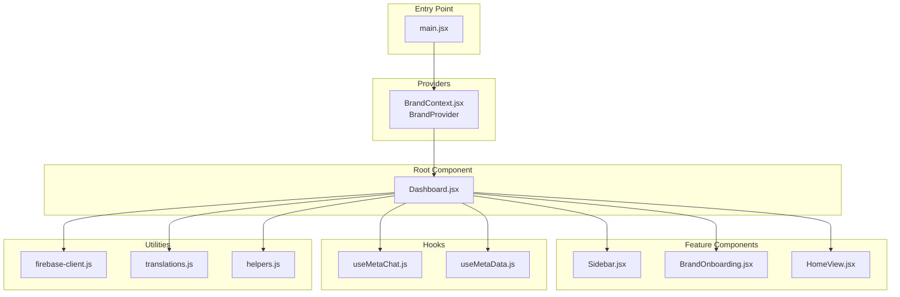
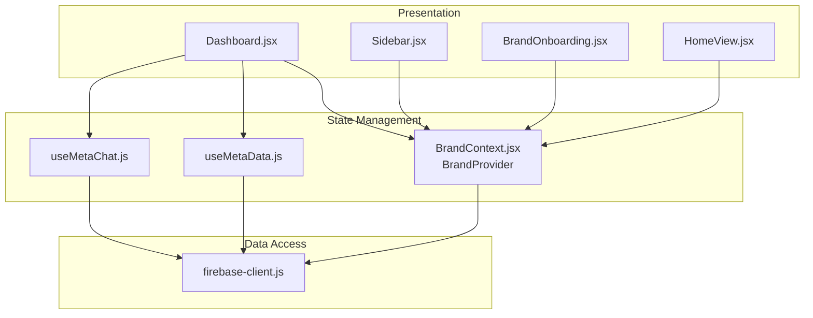
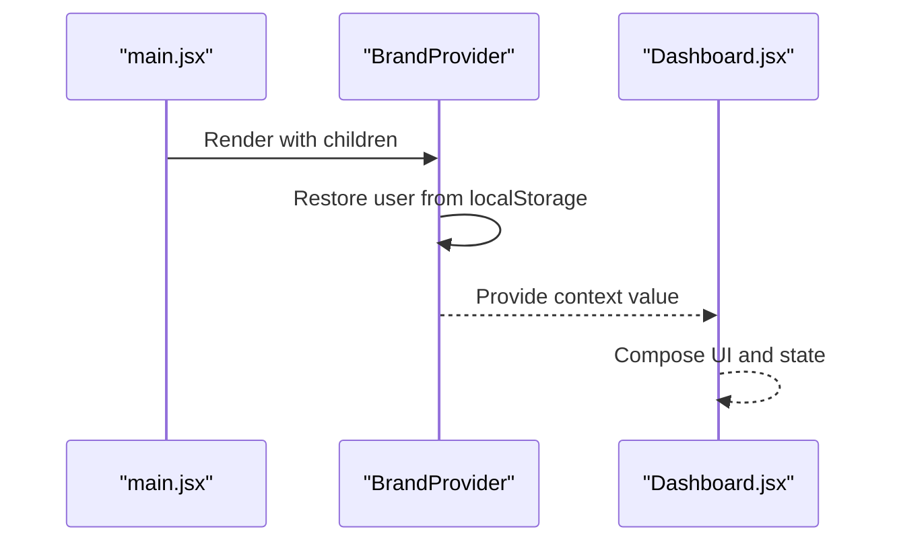
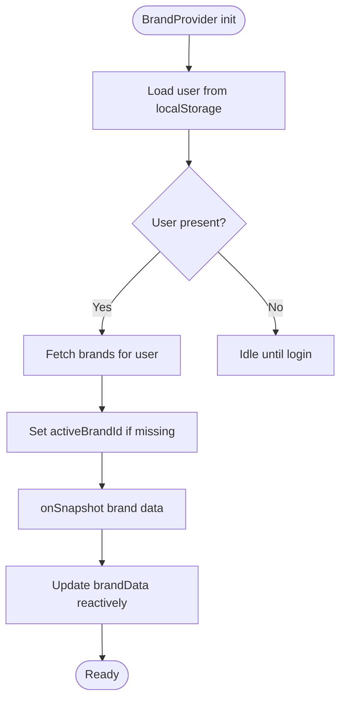
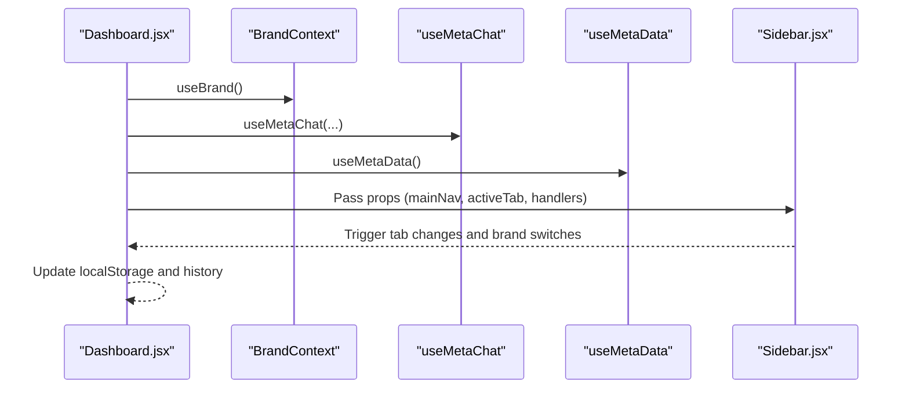
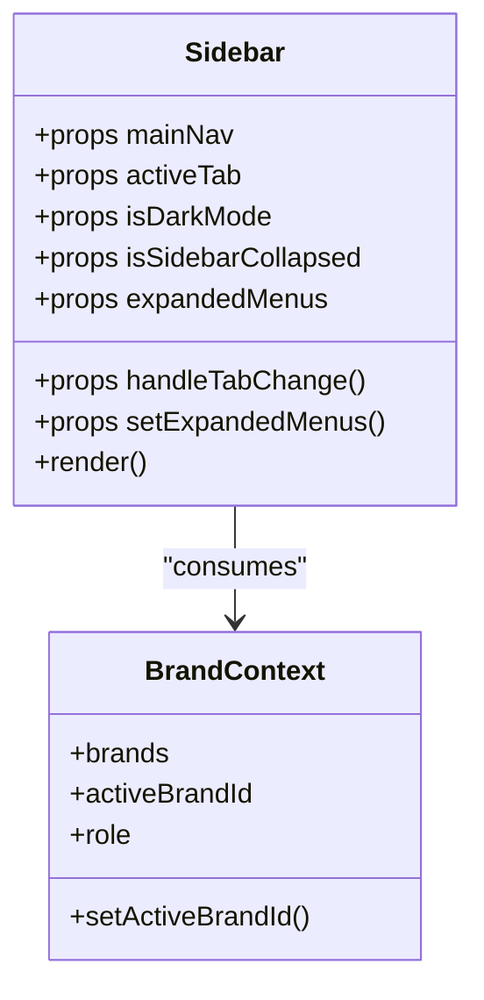
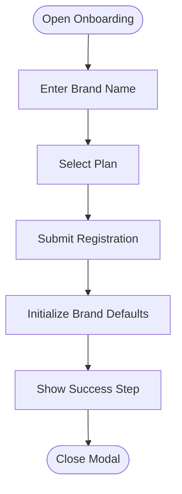
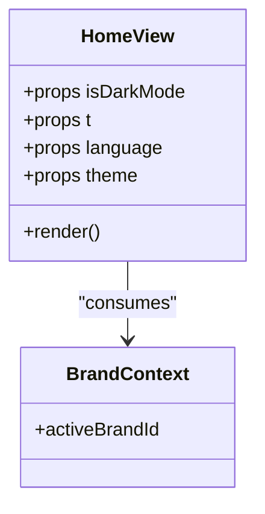
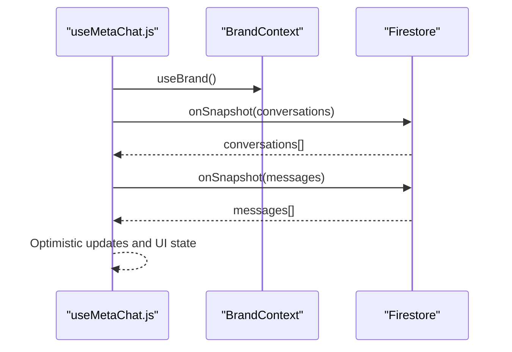
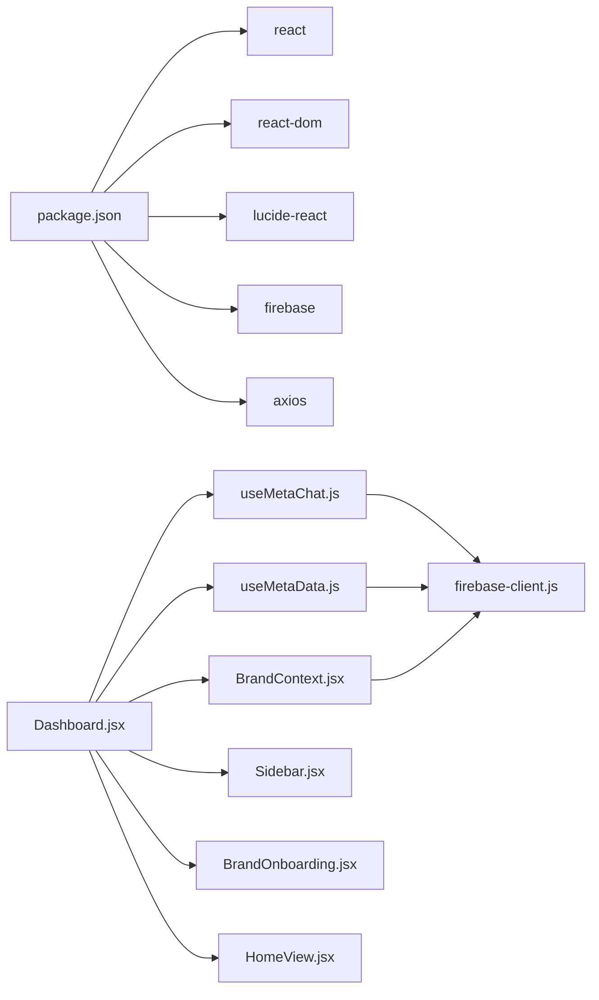

# React Application Architecture

<cite>
**Referenced Files in This Document**
- [main.jsx](file://client/src/main.jsx)
- [BrandContext.jsx](file://client/src/context/BrandContext.jsx)
- [Dashboard.jsx](file://client/src/Dashboard.jsx)
- [Sidebar.jsx](file://client/src/components/Sidebar.jsx)
- [BrandOnboarding.jsx](file://client/src/components/Brand/BrandOnboarding.jsx)
- [HomeView.jsx](file://client/src/components/Views/HomeView.jsx)
- [useMetaChat.js](file://client/src/hooks/useMetaChat.js)
- [useMetaData.js](file://client/src/hooks/useMetaData.js)
- [firebase-client.js](file://client/src/firebase-client.js)
- [package.json](file://client/package.json)
</cite>

## Table of Contents
1. [Introduction](#introduction)
2. [Project Structure](#project-structure)
3. [Core Components](#core-components)
4. [Architecture Overview](#architecture-overview)
5. [Detailed Component Analysis](#detailed-component-analysis)
6. [Dependency Analysis](#dependency-analysis)
7. [Performance Considerations](#performance-considerations)
8. [Troubleshooting Guide](#troubleshooting-guide)
9. [Conclusion](#conclusion)

## Introduction
This document explains the React application architecture with a focus on the entry point, the Dashboard root component, and the BrandContext provider setup. It details the modular component structure, strategies to prevent prop drilling, state management patterns, and the multi-brand state management implementation. Guidance is provided on React best practices, performance optimization through proper component structuring, and maintaining clean separation of concerns across application layers.

## Project Structure
The client application follows a feature-based structure under client/src, with clear separation between:
- Entry point and providers
- Context and hooks for state management
- Feature components organized by domain (Inbox, Views, Shared)
- Utilities for translation and helpers
- Firebase integration for persistence and storage

**Diagram sources**
- [main.jsx:1-12](file://client/src/main.jsx#L1-L12)
- [BrandContext.jsx:7-243](file://client/src/context/BrandContext.jsx#L7-L243)
- [Dashboard.jsx:116-779](file://client/src/Dashboard.jsx#L116-L779)
- [Sidebar.jsx:150-543](file://client/src/components/Sidebar.jsx#L150-L543)
- [BrandOnboarding.jsx:5-243](file://client/src/components/Brand/BrandOnboarding.jsx#L5-L243)
- [HomeView.jsx:52-250](file://client/src/components/Views/HomeView.jsx#L52-L250)
- [useMetaChat.js:16-244](file://client/src/hooks/useMetaChat.js#L16-L244)
- [useMetaData.js:6-83](file://client/src/hooks/useMetaData.js#L6-L83)
- [firebase-client.js:1-26](file://client/src/firebase-client.js#L1-L26)

**Section sources**
- [main.jsx:1-12](file://client/src/main.jsx#L1-L12)
- [BrandContext.jsx:7-243](file://client/src/context/BrandContext.jsx#L7-L243)
- [Dashboard.jsx:116-779](file://client/src/Dashboard.jsx#L116-L779)

## Core Components
- Entry point and provider setup:
  - The application initializes the BrandProvider at the root and renders the Dashboard inside it.
- Dashboard root component:
  - Orchestrates UI state, navigation, and integrates multiple feature views and hooks.
- BrandContext provider:
  - Centralizes multi-brand state, authentication, brand switching, and usage metrics.
- Feature components:
  - Modular components like Sidebar, BrandOnboarding, and HomeView consume context and hooks.
- Hooks:
  - useMetaChat and useMetaData encapsulate real-time listeners and brand-scoped data fetching.

Key implementation highlights:
- Provider exposes a compact context value with user, roles, brands, activeBrandId, brandData, and actions.
- Dashboard composes UI state with persistent preferences stored in localStorage.
- Hooks isolate Firestore listeners and brand-scoped queries.

**Section sources**
- [main.jsx:7-11](file://client/src/main.jsx#L7-L11)
- [BrandContext.jsx:225-242](file://client/src/context/BrandContext.jsx#L225-L242)
- [Dashboard.jsx:116-276](file://client/src/Dashboard.jsx#L116-L276)
- [useMetaChat.js:16-244](file://client/src/hooks/useMetaChat.js#L16-L244)
- [useMetaData.js:6-83](file://client/src/hooks/useMetaData.js#L6-L83)

## Architecture Overview
The application follows a layered architecture:
- Presentation layer: Dashboard and feature components
- State management layer: BrandContext provider and custom hooks
- Data access layer: Firebase Firestore and Storage
- Utility layer: Translations, helpers, and environment configuration

**Diagram sources**
- [Dashboard.jsx:116-779](file://client/src/Dashboard.jsx#L116-L779)
- [BrandContext.jsx:7-243](file://client/src/context/BrandContext.jsx#L7-L243)
- [useMetaChat.js:16-244](file://client/src/hooks/useMetaChat.js#L16-L244)
- [useMetaData.js:6-83](file://client/src/hooks/useMetaData.js#L6-L83)
- [firebase-client.js:1-26](file://client/src/firebase-client.js#L1-L26)

## Detailed Component Analysis

### Entry Point and Provider Setup
- main.jsx mounts the BrandProvider and renders Dashboard. This ensures all child components can consume the BrandContext.
- The provider initializes user session from localStorage and sets role accordingly.

**Diagram sources**
- [main.jsx:7-11](file://client/src/main.jsx#L7-L11)
- [BrandContext.jsx:162-176](file://client/src/context/BrandContext.jsx#L162-L176)

**Section sources**
- [main.jsx:7-11](file://client/src/main.jsx#L7-L11)
- [BrandContext.jsx:162-176](file://client/src/context/BrandContext.jsx#L162-L176)

### BrandContext Provider Implementation
- Multi-brand state management:
  - Maintains user, role, brands list, activeBrandId, and brandData.
  - Provides login/logout and brand registration with plan-based initialization.
- Real-time synchronization:
  - Uses Firestore onSnapshot to keep brandData reactive.
  - Updates usage stats atomically and refreshes local state.
- Role-based visibility:
  - Super-admin privileges for specific emails; otherwise brand-owner.
- Persistence:
  - Stores user and active brand ID in localStorage for session continuity.

**Diagram sources**
- [BrandContext.jsx:15-39](file://client/src/context/BrandContext.jsx#L15-L39)
- [BrandContext.jsx:196-223](file://client/src/context/BrandContext.jsx#L196-L223)

**Section sources**
- [BrandContext.jsx:7-243](file://client/src/context/BrandContext.jsx#L7-L243)

### Dashboard Root Component
- Composition and state:
  - Manages UI state (theme, sidebar, tabs, modals) and persists to localStorage.
  - Integrates useMetaChat and useMetaData hooks for real-time data.
  - Renders feature views conditionally based on active tab and role.
- Navigation and branding:
  - Builds mainNav dynamically, including role-gated entries.
  - Computes metrics for active hub and manages profile dropdown.
- Error boundary:
  - Wraps UI with a global ErrorBoundary for graceful degradation.

**Diagram sources**
- [Dashboard.jsx:116-276](file://client/src/Dashboard.jsx#L116-L276)
- [Dashboard.jsx:432-496](file://client/src/Dashboard.jsx#L432-L496)
- [Sidebar.jsx:150-543](file://client/src/components/Sidebar.jsx#L150-L543)

**Section sources**
- [Dashboard.jsx:116-779](file://client/src/Dashboard.jsx#L116-L779)

### Sidebar Component
- Role-aware navigation:
  - Displays admin entry only for super-admin.
  - Renders grouped hubs with submenus and nested items.
- Brand switching:
  - Allows switching activeBrandId and opening onboarding modal.
- Interactive UX:
  - Handles drag-and-drop reordering, tooltips, and popover menus.
  - Integrates with Dashboard for tab changes and state updates.

**Diagram sources**
- [Sidebar.jsx:150-543](file://client/src/components/Sidebar.jsx#L150-L543)
- [BrandContext.jsx:225-242](file://client/src/context/BrandContext.jsx#L225-L242)

**Section sources**
- [Sidebar.jsx:150-543](file://client/src/components/Sidebar.jsx#L150-L543)

### BrandOnboarding Component
- Multi-step onboarding:
  - Step 1: Brand name input.
  - Step 2: Plan selection with feature highlights.
  - Step 3: Initialization confirmation and success state.
- Context integration:
  - Uses registerBrand from BrandContext to create a new brand and initialize defaults.

**Diagram sources**
- [BrandOnboarding.jsx:5-243](file://client/src/components/Brand/BrandOnboarding.jsx#L5-L243)
- [BrandContext.jsx:77-160](file://client/src/context/BrandContext.jsx#L77-L160)

**Section sources**
- [BrandOnboarding.jsx:5-243](file://client/src/components/Brand/BrandOnboarding.jsx#L5-L243)
- [BrandContext.jsx:77-160](file://client/src/context/BrandContext.jsx#L77-L160)

### HomeView Component
- Modular UI:
  - Reusable cards and sections for metrics and insights.
  - Consumes brand context for activeBrandId and displays greeting based on time.
- Data presentation:
  - Uses props for theme and language; integrates with translations.

**Diagram sources**
- [HomeView.jsx:52-250](file://client/src/components/Views/HomeView.jsx#L52-L250)
- [BrandContext.jsx:225-242](file://client/src/context/BrandContext.jsx#L225-L242)

**Section sources**
- [HomeView.jsx:52-250](file://client/src/components/Views/HomeView.jsx#L52-L250)

### Hooks: useMetaChat and useMetaData
- Real-time listeners:
  - useMetaChat listens to conversations and messages collections for the active brand.
  - useMetaData aggregates multiple brand-scoped collections (gaps, drafts, library, products, orders, comments).
- Optimistic updates and error handling:
  - useMetaChat implements optimistic UI for sending messages and handles Firestore ordering nuances.
- Brand scoping:
  - Both hooks derive activeBrandId from BrandContext to ensure data isolation.

**Diagram sources**
- [useMetaChat.js:16-101](file://client/src/hooks/useMetaChat.js#L16-L101)
- [useMetaData.js:6-52](file://client/src/hooks/useMetaData.js#L6-L52)
- [BrandContext.jsx:17-200](file://client/src/context/BrandContext.jsx#L17-L200)

**Section sources**
- [useMetaChat.js:16-244](file://client/src/hooks/useMetaChat.js#L16-L244)
- [useMetaData.js:6-83](file://client/src/hooks/useMetaData.js#L6-L83)

## Dependency Analysis
- External dependencies:
  - React, React DOM, lucide-react, Firebase SDK, axios, Tailwind utilities.
- Internal dependencies:
  - BrandContext is consumed by Dashboard, Sidebar, BrandOnboarding, and HomeView.
  - Hooks depend on BrandContext and Firebase client.
  - Firebase client exports db and storage for Firestore and Storage.

**Diagram sources**
- [package.json:12-37](file://client/package.json#L12-L37)
- [Dashboard.jsx:116-779](file://client/src/Dashboard.jsx#L116-L779)
- [BrandContext.jsx:7-243](file://client/src/context/BrandContext.jsx#L7-L243)
- [useMetaChat.js:16-244](file://client/src/hooks/useMetaChat.js#L16-L244)
- [useMetaData.js:6-83](file://client/src/hooks/useMetaData.js#L6-L83)
- [firebase-client.js:1-26](file://client/src/firebase-client.js#L1-L26)

**Section sources**
- [package.json:12-37](file://client/package.json#L12-L37)
- [firebase-client.js:1-26](file://client/src/firebase-client.js#L1-L26)

## Performance Considerations
- Minimize re-renders:
  - Use memoization for derived data (e.g., stats computation) and stable callbacks to avoid unnecessary effect triggers.
  - Prefer useMemo and useCallback for expensive computations and event handlers.
- Efficient listeners:
  - Firestore onSnapshot listeners are scoped to activeBrandId; ensure cleanup on unmount to prevent memory leaks.
- Local storage caching:
  - Persist UI preferences and user sessions to reduce initialization overhead.
- Bundle size:
  - Keep imports lazy where feasible and avoid bundling unused icons or utilities.

## Troubleshooting Guide
- Authentication recovery:
  - If localStorage user is corrupted, BrandProvider clears it and continues in an unauthenticated state.
- Firestore listener errors:
  - useMetaChat includes fallback logic for missing timestamp indexes and logs errors for diagnostics.
- Brand data not loading:
  - Verify activeBrandId is set and onSnapshot is subscribed; check network connectivity and Firestore rules.
- Role-based UI issues:
  - Ensure role is correctly inferred from user email; super-admin visibility depends on a specific email match.

**Section sources**
- [BrandContext.jsx:162-176](file://client/src/context/BrandContext.jsx#L162-L176)
- [useMetaChat.js:82-100](file://client/src/hooks/useMetaChat.js#L82-L100)

## Conclusion
The application employs a clear provider-first architecture with a robust BrandContext for multi-brand state management. Dashboard acts as the orchestrator, composing modular components and integrating hooks for real-time data. Prop drilling is minimized through context and hooks, while localStorage and Firestore provide persistence and synchronization. Following the outlined best practices will help maintain scalability, performance, and a clean separation of concerns across layers.