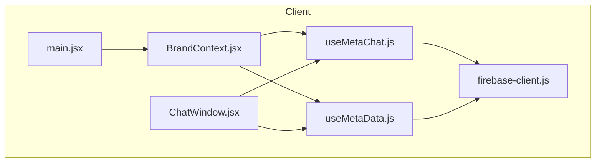
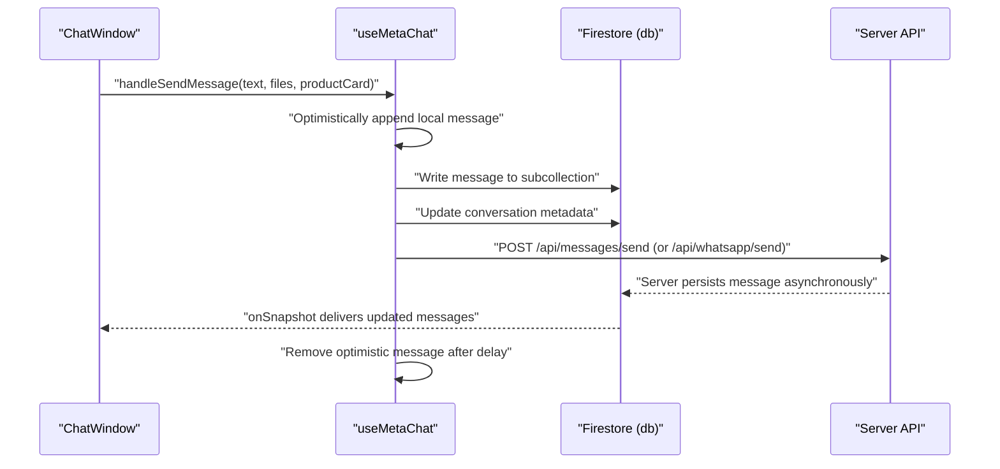
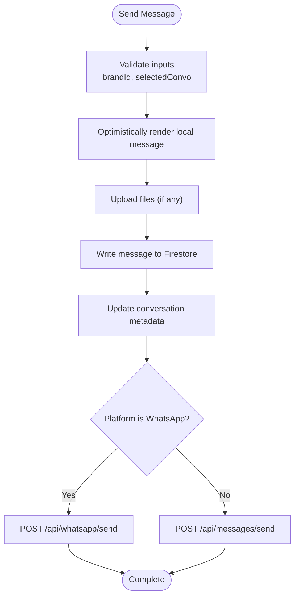
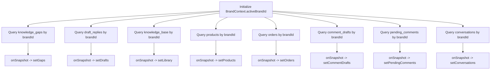
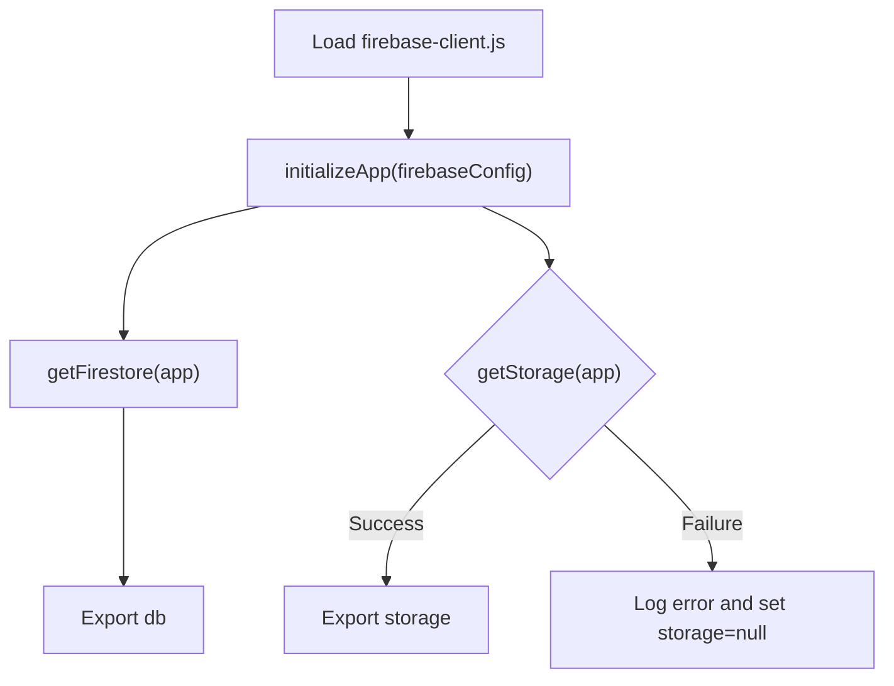
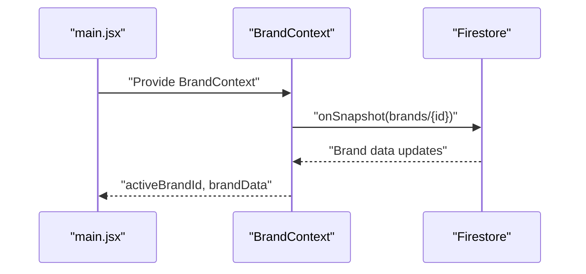
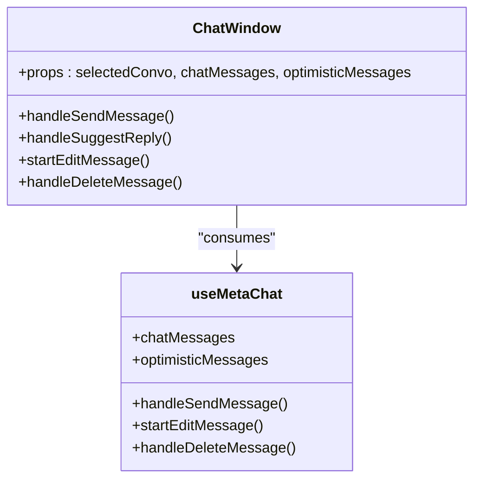
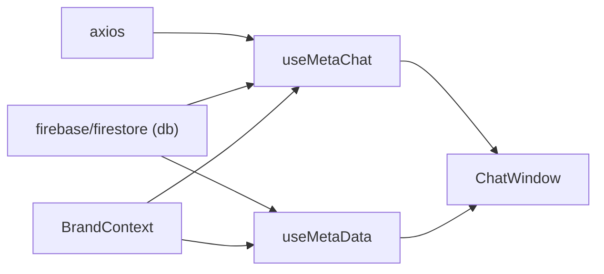

# Real-time Communication

<cite>
**Referenced Files in This Document**
- [useMetaChat.js](file://client/src/hooks/useMetaChat.js)
- [useMetaData.js](file://client/src/hooks/useMetaData.js)
- [firebase-client.js](file://client/src/firebase-client.js)
- [BrandContext.jsx](file://client/src/context/BrandContext.jsx)
- [ChatWindow.jsx](file://client/src/components/Inbox/ChatWindow.jsx)
- [main.jsx](file://client/src/main.jsx)
- [package.json](file://client/package.json)
</cite>

## Table of Contents
1. [Introduction](#introduction)
2. [Project Structure](#project-structure)
3. [Core Components](#core-components)
4. [Architecture Overview](#architecture-overview)
5. [Detailed Component Analysis](#detailed-component-analysis)
6. [Dependency Analysis](#dependency-analysis)
7. [Performance Considerations](#performance-considerations)
8. [Troubleshooting Guide](#troubleshooting-guide)
9. [Conclusion](#conclusion)

## Introduction
This document explains the real-time communication features implemented in the frontend, focusing on:
- useMetaChat hook for real-time messaging, optimistic updates, and Firebase integration
- useMetaData hook for synchronized data binding across multiple domains
- Firebase client configuration and connection management
- Practical guidance for message queuing, conflict resolution, offline resilience, and performance optimization
- Troubleshooting common connectivity and synchronization issues

## Project Structure
The real-time features are centered around two React hooks and a Firebase client module. The hooks are consumed by the ChatWindow component, and the BrandContext supplies the active brand identifier used to scope Firestore queries.

**Diagram sources**
- [main.jsx:7-11](file://client/src/main.jsx#L7-L11)
- [BrandContext.jsx:225-242](file://client/src/context/BrandContext.jsx#L225-L242)
- [firebase-client.js:15-25](file://client/src/firebase-client.js#L15-L25)
- [useMetaChat.js:16-244](file://client/src/hooks/useMetaChat.js#L16-L244)
- [useMetaData.js:6-82](file://client/src/hooks/useMetaData.js#L6-L82)
- [ChatWindow.jsx:5-14](file://client/src/components/Inbox/ChatWindow.jsx#L5-L14)

**Section sources**
- [main.jsx:7-11](file://client/src/main.jsx#L7-L11)
- [BrandContext.jsx:225-242](file://client/src/context/BrandContext.jsx#L225-L242)
- [firebase-client.js:15-25](file://client/src/firebase-client.js#L15-L25)
- [useMetaChat.js:16-244](file://client/src/hooks/useMetaChat.js#L16-L244)
- [useMetaData.js:6-82](file://client/src/hooks/useMetaData.js#L6-L82)
- [ChatWindow.jsx:5-14](file://client/src/components/Inbox/ChatWindow.jsx#L5-L14)

## Core Components
- useMetaChat: Manages real-time conversations and messages, optimistic UI updates, sending logic, and reply/edit/delete actions.
- useMetaData: Synchronizes multiple data domains (knowledge gaps, drafts, library, products, orders, comments, conversations) in real time.
- firebase-client: Initializes Firebase app and Firestore database instance.
- BrandContext: Provides activeBrandId used to scope all Firestore queries.
- ChatWindow: Renders the chat UI and integrates with useMetaChat for user interactions.

**Section sources**
- [useMetaChat.js:16-244](file://client/src/hooks/useMetaChat.js#L16-L244)
- [useMetaData.js:6-82](file://client/src/hooks/useMetaData.js#L6-L82)
- [firebase-client.js:15-25](file://client/src/firebase-client.js#L15-L25)
- [BrandContext.jsx:225-242](file://client/src/context/BrandContext.jsx#L225-L242)
- [ChatWindow.jsx:5-14](file://client/src/components/Inbox/ChatWindow.jsx#L5-L14)

## Architecture Overview
The real-time architecture relies on Firestore’s onSnapshot listeners to keep UIs in sync. The hooks encapsulate:
- Query construction scoped by activeBrandId
- Real-time listeners for collections and nested subcollections
- Optimistic rendering for immediate feedback during send operations
- Server-side persistence and eventual consistency

**Diagram sources**
- [useMetaChat.js:117-201](file://client/src/hooks/useMetaChat.js#L117-L201)
- [ChatWindow.jsx:444-462](file://client/src/components/Inbox/ChatWindow.jsx#L444-L462)

**Section sources**
- [useMetaChat.js:117-201](file://client/src/hooks/useMetaChat.js#L117-L201)
- [ChatWindow.jsx:444-462](file://client/src/components/Inbox/ChatWindow.jsx#L444-L462)

## Detailed Component Analysis

### useMetaChat: Real-time Messaging and Optimistic Updates
Responsibilities:
- Listens to conversations and messages using onSnapshot
- Applies client-side sorting for accurate inbox ordering
- Implements optimistic UI for send operations
- Handles reply-to, edit, delete, and history sync actions
- Integrates with server APIs for platform-specific sends

Key behaviors:
- Conversation listener uses a where clause without orderBy to avoid composite index overhead; sorts client-side deterministically.
- Message listener applies ascending order; supports graceful fallback to unordered query when timestamp index is missing.
- Optimistic messages are appended with a temporary id and removed after a short delay or on error.
- Mixed timestamp formats are normalized to numeric milliseconds for consistent ordering.

**Diagram sources**
- [useMetaChat.js:117-201](file://client/src/hooks/useMetaChat.js#L117-L201)

**Section sources**
- [useMetaChat.js:30-58](file://client/src/hooks/useMetaChat.js#L30-L58)
- [useMetaChat.js:60-101](file://client/src/hooks/useMetaChat.js#L60-L101)
- [useMetaChat.js:117-201](file://client/src/hooks/useMetaChat.js#L117-L201)

### useMetaData: Multi-domain Real-time Synchronization
Responsibilities:
- Subscribes to multiple collections (knowledge_gaps, draft_replies, knowledge_base, products, orders, comment_drafts, pending_comments, conversations)
- Filters each collection by brandId via onSnapshot
- Exposes consolidated state for UI consumption

**Diagram sources**
- [useMetaData.js:14-52](file://client/src/hooks/useMetaData.js#L14-L52)
- [useMetaData.js:58-80](file://client/src/hooks/useMetaData.js#L58-L80)

**Section sources**
- [useMetaData.js:6-82](file://client/src/hooks/useMetaData.js#L6-L82)

### Firebase Client Configuration and Connection Management
- Initializes Firebase app and Firestore instance
- Attempts to initialize Storage with graceful error logging if disabled
- No explicit Firestore persistence or offline configuration is present in the current code

**Diagram sources**
- [firebase-client.js:5-25](file://client/src/firebase-client.js#L5-L25)

**Section sources**
- [firebase-client.js:5-25](file://client/src/firebase-client.js#L5-L25)

### BrandContext: Scope and Provider
- Supplies activeBrandId used by both hooks to scope queries
- Listens to brand document changes for real-time updates
- Ensures hooks receive a valid brand identifier before querying

**Diagram sources**
- [main.jsx:7-11](file://client/src/main.jsx#L7-L11)
- [BrandContext.jsx:202-223](file://client/src/context/BrandContext.jsx#L202-L223)

**Section sources**
- [BrandContext.jsx:225-242](file://client/src/context/BrandContext.jsx#L225-L242)
- [BrandContext.jsx:202-223](file://client/src/context/BrandContext.jsx#L202-L223)

### ChatWindow: Real-time UI Binding
- Receives messages and optimistic messages from useMetaChat
- Renders sent/received messages, reply/edit/delete affordances, and product cards
- Integrates with macros and file attachment previews
- Triggers send actions and contextual operations

**Diagram sources**
- [ChatWindow.jsx:5-14](file://client/src/components/Inbox/ChatWindow.jsx#L5-L14)
- [useMetaChat.js:237-243](file://client/src/hooks/useMetaChat.js#L237-L243)

**Section sources**
- [ChatWindow.jsx:234-306](file://client/src/components/Inbox/ChatWindow.jsx#L234-L306)
- [ChatWindow.jsx:444-462](file://client/src/components/Inbox/ChatWindow.jsx#L444-L462)

## Dependency Analysis
- useMetaChat depends on:
  - Firebase Firestore (db) for real-time listeners and writes
  - BrandContext for activeBrandId scoping
  - Axios for server-side send operations
- useMetaData depends on:
  - Firebase Firestore (db) for multi-collection real-time listeners
  - BrandContext for activeBrandId scoping
- ChatWindow depends on:
  - useMetaChat for state and actions
  - useMetaData for auxiliary data (e.g., drafts)

**Diagram sources**
- [useMetaChat.js:2-14](file://client/src/hooks/useMetaChat.js#L2-L14)
- [useMetaData.js:2-4](file://client/src/hooks/useMetaData.js#L2-L4)
- [ChatWindow.jsx:5-14](file://client/src/components/Inbox/ChatWindow.jsx#L5-L14)

**Section sources**
- [useMetaChat.js:2-14](file://client/src/hooks/useMetaChat.js#L2-L14)
- [useMetaData.js:2-4](file://client/src/hooks/useMetaData.js#L2-L4)
- [ChatWindow.jsx:5-14](file://client/src/components/Inbox/ChatWindow.jsx#L5-L14)

## Performance Considerations
- Client-side sorting for conversations ensures correctness without composite indexes.
- Message listener falls back to unordered query with client-side sort when timestamp index is missing, preventing silent exclusions.
- Optimistic UI reduces perceived latency; messages are removed after a short delay or on error.
- Mixed timestamp formats normalized to numeric milliseconds for consistent ordering.
- Consider enabling Firestore persistence to improve offline resilience and reduce cold-start costs.

[No sources needed since this section provides general guidance]

## Troubleshooting Guide
Common issues and resolutions:
- Missing timestamp index causing ordering problems:
  - The message listener detects specific error codes and falls back to an unordered query with client-side sort.
- Firebase Storage initialization failure:
  - Storage initialization logs an error and sets storage to null; ensure storage is enabled in the Firebase Console.
- Empty conversations after switching brands:
  - Ensure activeBrandId is available before initializing listeners; BrandContext manages this via onSnapshot.
- Mixed timestamp types causing inconsistent ordering:
  - Normalize timestamps to numeric milliseconds for all writes to maintain consistent ordering.

**Section sources**
- [useMetaChat.js:82-100](file://client/src/hooks/useMetaChat.js#L82-L100)
- [firebase-client.js:18-24](file://client/src/firebase-client.js#L18-L24)
- [BrandContext.jsx:202-223](file://client/src/context/BrandContext.jsx#L202-L223)

## Conclusion
The real-time communication stack leverages Firestore’s onSnapshot listeners and React hooks to deliver responsive, synchronized experiences. Optimistic updates, client-side sorting, and graceful fallbacks for missing indexes provide a robust foundation. Extending the solution with Firestore persistence would further enhance offline reliability and performance.