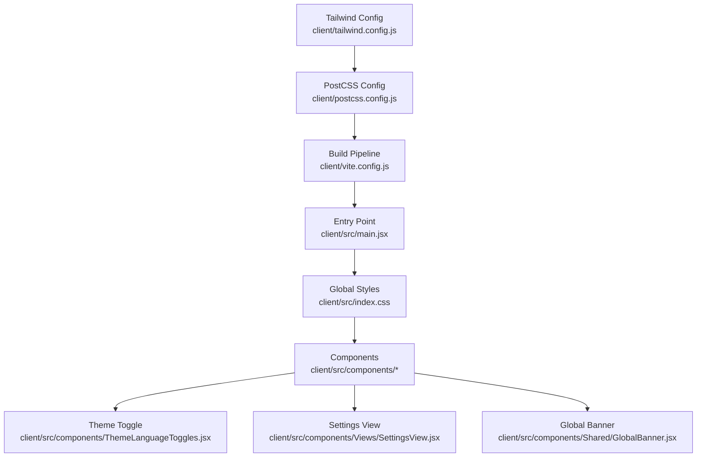
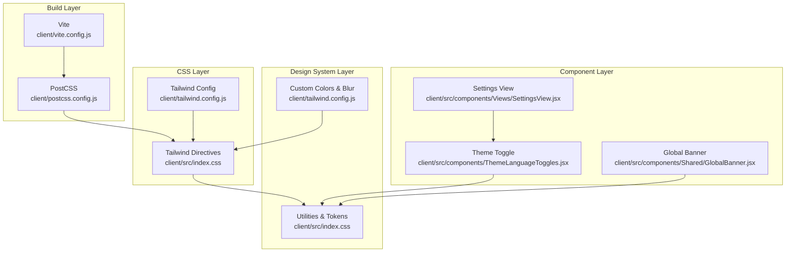
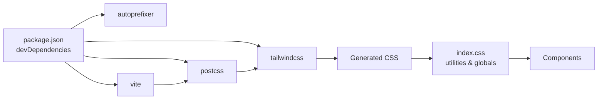

# Styling and Theming

<cite>
**Referenced Files in This Document**
- [tailwind.config.js](file://client/tailwind.config.js)
- [postcss.config.js](file://client/postcss.config.js)
- [index.css](file://client/src/index.css)
- [package.json](file://client/package.json)
- [vite.config.js](file://client/vite.config.js)
- [main.jsx](file://client/src/main.jsx)
- [ThemeLanguageToggles.jsx](file://client/src/components/ThemeLanguageToggles.jsx)
- [SettingsView.jsx](file://client/src/components/Views/SettingsView.jsx)
- [GlobalBanner.jsx](file://client/src/components/Shared/GlobalBanner.jsx)
- [BrandContext.jsx](file://client/src/context/BrandContext.jsx)
</cite>

## Table of Contents
1. [Introduction](#introduction)
2. [Project Structure](#project-structure)
3. [Core Components](#core-components)
4. [Architecture Overview](#architecture-overview)
5. [Detailed Component Analysis](#detailed-component-analysis)
6. [Dependency Analysis](#dependency-analysis)
7. [Performance Considerations](#performance-considerations)
8. [Troubleshooting Guide](#troubleshooting-guide)
9. [Conclusion](#conclusion)
10. [Appendices](#appendices)

## Introduction
This document explains the styling and theming implementation across the client application. It covers Tailwind CSS configuration, custom CSS organization, design system patterns, theming approaches (including color schemes, typography, and responsive breakpoints), PostCSS integration, the build process, and practical guidance for extending the design system, creating custom themes, and implementing dark/light mode switching. It also provides best practices for CSS organization, performance optimization, and cross-browser compatibility.

## Project Structure
The styling pipeline is organized around a modern build stack:
- Tailwind CSS is configured to scan application sources and extend design tokens.
- PostCSS orchestrates Tailwind and Autoprefixer.
- Vite builds the app and applies the PostCSS pipeline.
- Custom CSS defines global styles, glassmorphism utilities, animations, and responsive adjustments.
- Components consume design tokens and apply utility-first classes.

**Diagram sources**
- [tailwind.config.js:1-30](file://client/tailwind.config.js#L1-L30)
- [postcss.config.js:1-7](file://client/postcss.config.js#L1-L7)
- [vite.config.js:1-16](file://client/vite.config.js#L1-L16)
- [main.jsx:1-12](file://client/src/main.jsx#L1-L12)
- [index.css:1-260](file://client/src/index.css#L1-L260)
- [ThemeLanguageToggles.jsx:1-50](file://client/src/components/ThemeLanguageToggles.jsx#L1-L50)
- [SettingsView.jsx:344-362](file://client/src/components/Views/SettingsView.jsx#L344-L362)
- [GlobalBanner.jsx:1-122](file://client/src/components/Shared/GlobalBanner.jsx#L1-L122)

**Section sources**
- [tailwind.config.js:1-30](file://client/tailwind.config.js#L1-L30)
- [postcss.config.js:1-7](file://client/postcss.config.js#L1-L7)
- [index.css:1-260](file://client/src/index.css#L1-L260)
- [vite.config.js:1-16](file://client/vite.config.js#L1-L16)
- [main.jsx:1-12](file://client/src/main.jsx#L1-L12)

## Core Components
- Tailwind configuration extends color palettes and adds a custom blur size for backdrop effects.
- PostCSS enables Tailwind and Autoprefixer for vendor prefixes.
- Global CSS establishes a glassmorphism design system, animations, and responsive adjustments.
- Theme toggle component cycles among light, dark, and a third theme variant while persisting preferences.
- Settings view integrates the theme toggle and displays theme controls.
- Global banner demonstrates themed components using design tokens.

Key implementation references:
- Tailwind extensions: [tailwind.config.js:7-26](file://client/tailwind.config.js#L7-L26)
- PostCSS plugins: [postcss.config.js:1-7](file://client/postcss.config.js#L1-L7)
- Glassmorphism utilities and animations: [index.css:23-110](file://client/src/index.css#L23-L110)
- Theme toggle logic and variants: [ThemeLanguageToggles.jsx:4-32](file://client/src/components/ThemeLanguageToggles.jsx#L4-L32)
- Theme toggle usage in settings: [SettingsView.jsx:360-362](file://client/src/components/Views/SettingsView.jsx#L360-L362)
- Themed banner component: [GlobalBanner.jsx:64-118](file://client/src/components/Shared/GlobalBanner.jsx#L64-L118)

**Section sources**
- [tailwind.config.js:1-30](file://client/tailwind.config.js#L1-L30)
- [postcss.config.js:1-7](file://client/postcss.config.js#L1-L7)
- [index.css:1-260](file://client/src/index.css#L1-L260)
- [ThemeLanguageToggles.jsx:1-50](file://client/src/components/ThemeLanguageToggles.jsx#L1-L50)
- [SettingsView.jsx:344-362](file://client/src/components/Views/SettingsView.jsx#L344-L362)
- [GlobalBanner.jsx:1-122](file://client/src/components/Shared/GlobalBanner.jsx#L1-L122)

## Architecture Overview
The styling architecture follows a layered approach:
- Build layer: Vite compiles TypeScript/JSX and runs PostCSS.
- CSS layer: Tailwind directives import base, components, and utilities; PostCSS processes them with Autoprefixer.
- Design system layer: Tailwind extensions and global CSS define tokens and reusable utilities.
- Component layer: Components apply design tokens and utilities consistently.

**Diagram sources**
- [vite.config.js:1-16](file://client/vite.config.js#L1-L16)
- [postcss.config.js:1-7](file://client/postcss.config.js#L1-L7)
- [index.css:1-260](file://client/src/index.css#L1-L260)
- [tailwind.config.js:1-30](file://client/tailwind.config.js#L1-L30)
- [ThemeLanguageToggles.jsx:1-50](file://client/src/components/ThemeLanguageToggles.jsx#L1-L50)
- [GlobalBanner.jsx:1-122](file://client/src/components/Shared/GlobalBanner.jsx#L1-L122)
- [SettingsView.jsx:344-362](file://client/src/components/Views/SettingsView.jsx#L344-L362)

## Detailed Component Analysis

### Tailwind CSS Configuration
- Scans HTML and TS/JSX sources for class usage.
- Extends color palette with a named semantic color family and adds a custom backdrop blur size.
- No plugins are enabled.

Implementation references:
- Content scanning: [tailwind.config.js:3-6](file://client/tailwind.config.js#L3-L6)
- Color extension: [tailwind.config.js:9-22](file://client/tailwind.config.js#L9-L22)
- Backdrop blur extension: [tailwind.config.js:23-25](file://client/tailwind.config.js#L23-L25)
- Plugins: [tailwind.config.js:28-29](file://client/tailwind.config.js#L28-L29)

**Section sources**
- [tailwind.config.js:1-30](file://client/tailwind.config.js#L1-L30)

### PostCSS Configuration
- Enables Tailwind and Autoprefixer plugins.
- Ensures vendor-prefixed CSS output.

Implementation references:
- Plugins: [postcss.config.js:1-7](file://client/postcss.config.js#L1-L7)

**Section sources**
- [postcss.config.js:1-7](file://client/postcss.config.js#L1-L7)

### Global CSS and Design System
- Imports Tailwind base, components, and utilities.
- Defines CSS variables for glassmorphism backgrounds and borders.
- Provides reusable utilities for glass cards, inputs, buttons, animations, and scrollbars.
- Implements responsive adjustments for tablets and phones.
- Includes premium enhancements like mesh gradients and slow spin animations.

Implementation references:
- Tailwind directives: [index.css:1-3](file://client/src/index.css#L1-L3)
- CSS variables: [index.css:5-12](file://client/src/index.css#L5-L12)
- Glass card utilities: [index.css:23-35](file://client/src/index.css#L23-L35)
- Glass input utilities: [index.css:37-50](file://client/src/index.css#L37-L50)
- Button utilities: [index.css:52-67](file://client/src/index.css#L52-L67)
- Animations: [index.css:69-87](file://client/src/index.css#L69-L87), [index.css:135-139](file://client/src/index.css#L135-L139), [index.css:238-245](file://client/src/index.css#L238-L245)
- Mesh background: [index.css:119-133](file://client/src/index.css#L119-L133)
- Responsive adjustments: [index.css:144-203](file://client/src/index.css#L144-L203), [index.css:248-259](file://client/src/index.css#L248-L259)

**Section sources**
- [index.css:1-260](file://client/src/index.css#L1-L260)

### Theme Toggle Component
- Cycles through three themes and persists selection in local storage.
- Uses design tokens for colors and shadows.
- Integrates with a language toggle component.

Implementation references:
- Theme cycling and persistence: [ThemeLanguageToggles.jsx:5-11](file://client/src/components/ThemeLanguageToggles.jsx#L5-L11)
- Theme-aware button classes: [ThemeLanguageToggles.jsx:16-19](file://client/src/components/ThemeLanguageToggles.jsx#L16-L19)
- Variant icons and labels: [ThemeLanguageToggles.jsx:22-30](file://client/src/components/ThemeLanguageToggles.jsx#L22-L30)

**Section sources**
- [ThemeLanguageToggles.jsx:1-50](file://client/src/components/ThemeLanguageToggles.jsx#L1-L50)

### Settings View Integration
- Displays theme settings and embeds the theme toggle component.
- Applies theme-aware background and border classes.

Implementation references:
- Theme section layout: [SettingsView.jsx:345-347](file://client/src/components/Views/SettingsView.jsx#L345-L347)
- Theme label and toggle: [SettingsView.jsx:360-362](file://client/src/components/Views/SettingsView.jsx#L360-L362)

**Section sources**
- [SettingsView.jsx:344-362](file://client/src/components/Views/SettingsView.jsx#L344-L362)

### Global Banner Component
- Demonstrates themed banners using design tokens and animations.
- Uses color variants mapped to announcement types.

Implementation references:
- Type configuration and mapping: [GlobalBanner.jsx:64-71](file://client/src/components/Shared/GlobalBanner.jsx#L64-L71)
- Themed banner container: [GlobalBanner.jsx:75-117](file://client/src/components/Shared/GlobalBanner.jsx#L75-L117)

**Section sources**
- [GlobalBanner.jsx:1-122](file://client/src/components/Shared/GlobalBanner.jsx#L1-L122)

### Build Process Integration
- Vite dev/build commands integrate with the PostCSS pipeline.
- Tailwind scans configured sources during build.

Implementation references:
- Scripts: [package.json:6-11](file://client/package.json#L6-L11)
- Plugin registration: [vite.config.js](file://client/vite.config.js#L6)
- Tailwind content scanning: [tailwind.config.js:3-6](file://client/tailwind.config.js#L3-L6)

**Section sources**
- [package.json:1-39](file://client/package.json#L1-L39)
- [vite.config.js:1-16](file://client/vite.config.js#L1-L16)
- [tailwind.config.js:1-30](file://client/tailwind.config.js#L1-L30)

## Dependency Analysis
The styling stack depends on Tailwind and PostCSS for CSS generation and Autoprefixer for compatibility. Vite orchestrates the build. Components depend on design tokens and utilities defined in global CSS and Tailwind extensions.

**Diagram sources**
- [package.json:25-36](file://client/package.json#L25-L36)
- [postcss.config.js:1-7](file://client/postcss.config.js#L1-L7)
- [tailwind.config.js:1-30](file://client/tailwind.config.js#L1-L30)
- [index.css:1-260](file://client/src/index.css#L1-L260)

**Section sources**
- [package.json:1-39](file://client/package.json#L1-L39)
- [postcss.config.js:1-7](file://client/postcss.config.js#L1-L7)
- [tailwind.config.js:1-30](file://client/tailwind.config.js#L1-L30)
- [index.css:1-260](file://client/src/index.css#L1-L260)

## Performance Considerations
- Utility-first approach minimizes CSS bloat by generating only used classes at build time.
- Tailwind’s purge/content scanning ensures unused styles are removed in production builds.
- CSS variables reduce duplication and improve maintainability.
- Glassmorphism effects rely on backdrop filters; prefer them sparingly on lower-end devices.
- Animations use efficient transforms and opacity; avoid heavy filters on many elements simultaneously.
- Keep media queries minimal and scoped to necessary breakpoints.

[No sources needed since this section provides general guidance]

## Troubleshooting Guide
Common issues and resolutions:
- Classes not applying:
  - Verify Tailwind content paths include component files: [tailwind.config.js:3-6](file://client/tailwind.config.js#L3-L6)
  - Ensure global CSS is imported in the entry point: [main.jsx](file://client/src/main.jsx#L5)
- Theme toggle not persisting:
  - Confirm local storage keys and theme cycling logic: [ThemeLanguageToggles.jsx:5-11](file://client/src/components/ThemeLanguageToggles.jsx#L5-L11)
- Dark mode visuals inconsistent:
  - Check theme-aware classes and CSS variables in global styles: [index.css:5-12](file://client/src/index.css#L5-L12), [index.css:32-35](file://client/src/index.css#L32-L35)
- Build errors with PostCSS/Tailwind:
  - Confirm plugin configuration: [postcss.config.js:1-7](file://client/postcss.config.js#L1-L7)
  - Validate dev dependencies: [package.json:25-36](file://client/package.json#L25-L36)

**Section sources**
- [tailwind.config.js:1-30](file://client/tailwind.config.js#L1-L30)
- [main.jsx:1-12](file://client/src/main.jsx#L1-L12)
- [ThemeLanguageToggles.jsx:1-50](file://client/src/components/ThemeLanguageToggles.jsx#L1-L50)
- [index.css:1-260](file://client/src/index.css#L1-L260)
- [postcss.config.js:1-7](file://client/postcss.config.js#L1-L7)
- [package.json:1-39](file://client/package.json#L1-L39)

## Conclusion
The project employs a clean, scalable styling architecture centered on Tailwind CSS, PostCSS, and a glassmorphism-inspired design system. The theme toggle and settings integration demonstrate a practical theming approach, while global utilities and responsive rules ensure consistent visuals across devices. Following the best practices outlined here will help maintain design consistency, optimize performance, and support future customization.

[No sources needed since this section summarizes without analyzing specific files]

## Appendices

### Theming Approach and Design Tokens
- Semantic color family:
  - Named palette for primary branding: [tailwind.config.js:9-22](file://client/tailwind.config.js#L9-L22)
- Glassmorphism tokens:
  - CSS variables for backgrounds, borders, and blur: [index.css:5-12](file://client/src/index.css#L5-L12)
- Typography and spacing:
  - Body font stack and base styles: [index.css:14-21](file://client/src/index.css#L14-L21)
- Responsive breakpoints:
  - Tablet and mobile adjustments: [index.css:144-203](file://client/src/index.css#L144-L203)

**Section sources**
- [tailwind.config.js:1-30](file://client/tailwind.config.js#L1-L30)
- [index.css:1-260](file://client/src/index.css#L1-L260)

### Creating Custom Themes
- Extend Tailwind colors for additional palettes: [tailwind.config.js:9-22](file://client/tailwind.config.js#L9-L22)
- Add theme-specific CSS variables and utilities: [index.css:5-12](file://client/src/index.css#L5-L12)
- Integrate toggles and persist preferences: [ThemeLanguageToggles.jsx:5-11](file://client/src/components/ThemeLanguageToggles.jsx#L5-L11)

**Section sources**
- [tailwind.config.js:1-30](file://client/tailwind.config.js#L1-L30)
- [index.css:1-260](file://client/src/index.css#L1-L260)
- [ThemeLanguageToggles.jsx:1-50](file://client/src/components/ThemeLanguageToggles.jsx#L1-L50)

### Maintaining Design Consistency
- Prefer design tokens over hardcoded values.
- Centralize utilities in global CSS and Tailwind extensions.
- Use component-level classes to enforce consistent layouts and spacing.

[No sources needed since this section provides general guidance]

### Cross-Browser Compatibility
- Autoprefixer ensures vendor prefixes: [postcss.config.js:1-7](file://client/postcss.config.js#L1-L7)
- Test glassmorphism effects on older browsers and adjust fallbacks as needed.

**Section sources**
- [postcss.config.js:1-7](file://client/postcss.config.js#L1-L7)