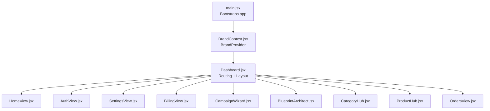
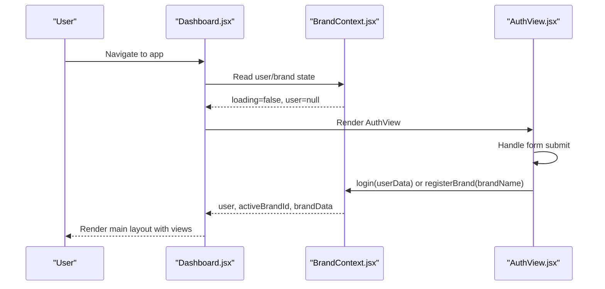
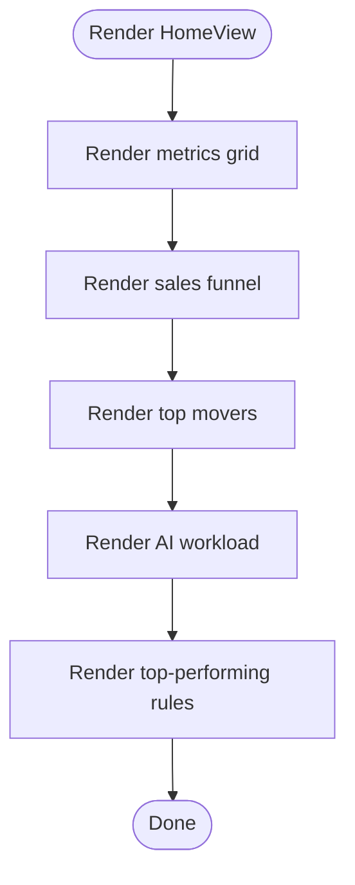
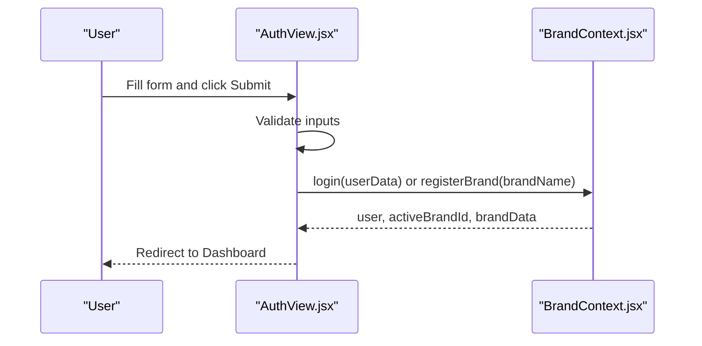
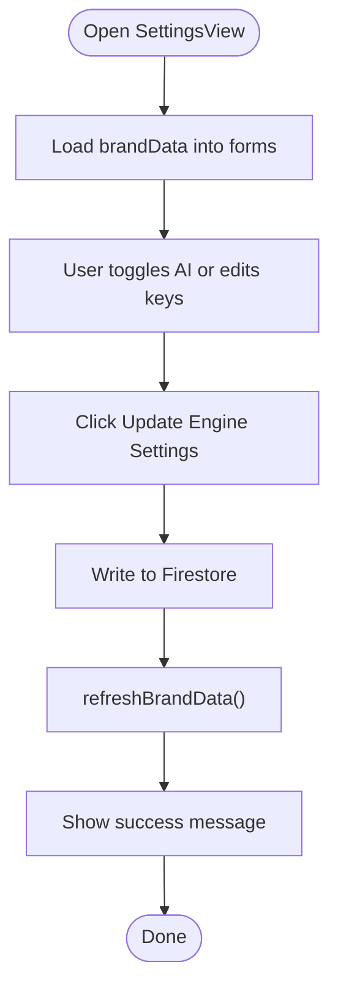
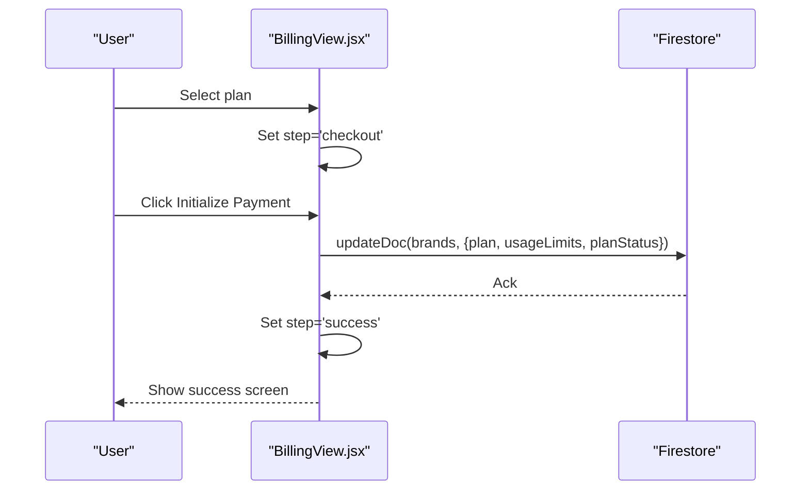
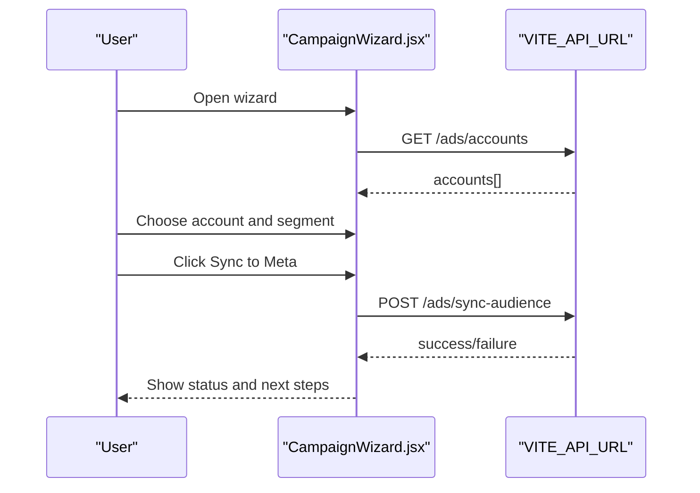
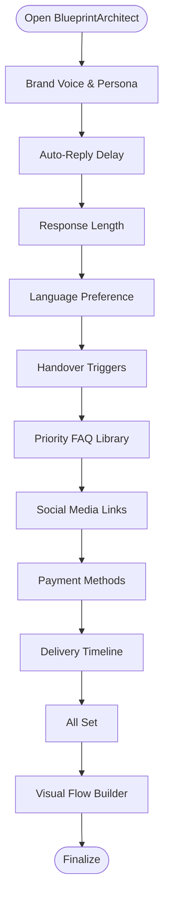
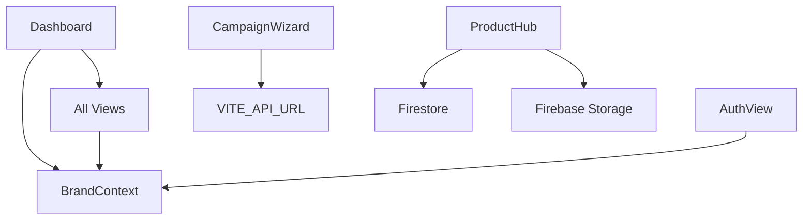

# View Components

<cite>
**Referenced Files in This Document**
- [Dashboard.jsx](file://client/src/Dashboard.jsx)
- [main.jsx](file://client/src/main.jsx)
- [BrandContext.jsx](file://client/src/context/BrandContext.jsx)
- [HomeView.jsx](file://client/src/components/Views/HomeView.jsx)
- [AuthView.jsx](file://client/src/components/Views/AuthView.jsx)
- [SettingsView.jsx](file://client/src/components/Views/SettingsView.jsx)
- [BillingView.jsx](file://client/src/components/Views/BillingView.jsx)
- [CampaignWizard.jsx](file://client/src/components/Views/CampaignWizard.jsx)
- [BlueprintArchitect.jsx](file://client/src/components/Views/BlueprintArchitect.jsx)
- [CategoryHub.jsx](file://client/src/components/Views/CategoryHub.jsx)
- [ProductHub.jsx](file://client/src/components/Views/ProductHub.jsx)
- [OrdersView.jsx](file://client/src/components/Views/OrdersView.jsx)
- [SubscriptionPlan.jsx](file://client/src/components/Views/SubscriptionPlan.jsx)
- [BillingHistory.jsx](file://client/src/components/Views/BillingHistory.jsx)
</cite>

## Table of Contents
1. [Introduction](#introduction)
2. [Project Structure](#project-structure)
3. [Core Components](#core-components)
4. [Architecture Overview](#architecture-overview)
5. [Detailed Component Analysis](#detailed-component-analysis)
6. [Dependency Analysis](#dependency-analysis)
7. [Performance Considerations](#performance-considerations)
8. [Troubleshooting Guide](#troubleshooting-guide)
9. [Conclusion](#conclusion)
10. [Appendices](#appendices)

## Introduction
This document explains the view-level components and page layouts that compose the application’s user interface. It focuses on major views such as HomeView, AuthView, SettingsView, BillingView, CampaignWizard, and BlueprintArchitect, detailing how they are composed, integrated with routing/navigation, and connected to global state. It also covers authentication flow, form handling, UI transitions, styling and responsiveness, and guidance for building new views consistently.

## Project Structure
The application is a React SPA bootstrapped in main.jsx and rendered inside a BrandProvider that supplies global brand and user state. The Dashboard orchestrates navigation, layout, and view rendering. Specific views live under client/src/components/Views and are rendered based on the active tab/state in Dashboard.

**Diagram sources**
- [main.jsx:7-11](file://client/src/main.jsx#L7-L11)
- [BrandContext.jsx:225-242](file://client/src/context/BrandContext.jsx#L225-L242)
- [Dashboard.jsx:806-952](file://client/src/Dashboard.jsx#L806-L952)
- [HomeView.jsx:52-249](file://client/src/components/Views/HomeView.jsx#L52-L249)
- [AuthView.jsx:141-297](file://client/src/components/Views/AuthView.jsx#L141-L297)
- [SettingsView.jsx:9-408](file://client/src/components/Views/SettingsView.jsx#L9-L408)
- [BillingView.jsx:60-326](file://client/src/components/Views/BillingView.jsx#L60-L326)
- [CampaignWizard.jsx:18-237](file://client/src/components/Views/CampaignWizard.jsx#L18-L237)
- [BlueprintArchitect.jsx:7-493](file://client/src/components/Views/BlueprintArchitect.jsx#L7-L493)
- [CategoryHub.jsx:4-156](file://client/src/components/Views/CategoryHub.jsx#L4-L156)
- [ProductHub.jsx:10-731](file://client/src/components/Views/ProductHub.jsx#L10-L731)
- [OrdersView.jsx:5-198](file://client/src/components/Views/OrdersView.jsx#L5-L198)

**Section sources**
- [main.jsx:7-11](file://client/src/main.jsx#L7-L11)
- [BrandContext.jsx:225-242](file://client/src/context/BrandContext.jsx#L225-L242)
- [Dashboard.jsx:806-952](file://client/src/Dashboard.jsx#L806-L952)

## Core Components
- HomeView: Executive dashboard with metrics, funnel, top movers, AI workload, and top-performing rules widgets. Uses BrandContext for brand identity and renders dynamic stats.
- AuthView: Onboarding and authentication gateway with animated hero sections, live demo slider, and form handling for brand creation or login.
- SettingsView: Brand configuration panel for API keys, AI toggles, plan usage, theme/language, and system status.
- BillingView: Plan selection, usage monitoring, checkout simulation, and success feedback.
- CampaignWizard: Meta Ads account selection, audience sync, and campaign activation flow.
- BlueprintArchitect: Multi-step wizard to define brand voice, delays, language preferences, FAQs, links, payment methods, delivery windows, and visual flow builder.
- CategoryHub: Main hub cards for social/products/data engines with metric tiles and navigation.
- ProductHub: Product catalog management with add/edit modals, image upload, AI description generation, and usage limits.
- OrdersView: Order vault with customer info, items, totals, and fulfillment actions.

**Section sources**
- [HomeView.jsx:52-249](file://client/src/components/Views/HomeView.jsx#L52-L249)
- [AuthView.jsx:141-297](file://client/src/components/Views/AuthView.jsx#L141-L297)
- [SettingsView.jsx:9-408](file://client/src/components/Views/SettingsView.jsx#L9-L408)
- [BillingView.jsx:60-326](file://client/src/components/Views/BillingView.jsx#L60-L326)
- [CampaignWizard.jsx:18-237](file://client/src/components/Views/CampaignWizard.jsx#L18-L237)
- [BlueprintArchitect.jsx:7-493](file://client/src/components/Views/BlueprintArchitect.jsx#L7-L493)
- [CategoryHub.jsx:4-156](file://client/src/components/Views/CategoryHub.jsx#L4-L156)
- [ProductHub.jsx:10-731](file://client/src/components/Views/ProductHub.jsx#L10-L731)
- [OrdersView.jsx:5-198](file://client/src/components/Views/OrdersView.jsx#L5-L198)

## Architecture Overview
The Dashboard composes the sidebar, header, and main content area. It reads the active tab from URL/hash and renders the appropriate view. Views receive props for theming, translation, and data from hooks and context. Authentication is handled by AuthView, which delegates to BrandContext login/register flows.

**Diagram sources**
- [Dashboard.jsx:772-774](file://client/src/Dashboard.jsx#L772-L774)
- [AuthView.jsx:150-160](file://client/src/components/Views/AuthView.jsx#L150-L160)
- [BrandContext.jsx:62-75](file://client/src/context/BrandContext.jsx#L62-L75)
- [BrandContext.jsx:77-160](file://client/src/context/BrandContext.jsx#L77-L160)

## Detailed Component Analysis

### HomeView Analysis
- Composition pattern: Renders reusable widgets (SectionHeader, OwnerStatCard, FunnelStep) and a main grid of metrics, funnel, top products, AI workload, and top-performing rules.
- Data flow: Receives stats and drafts via Dashboard props; uses BrandContext for active brand identity.
- Styling/responsiveness: Tailwind-based responsive grid and typography; animated entrance classes.
- Performance: Memoized stats computation in Dashboard; HomeView itself is a pure renderer.

**Diagram sources**
- [HomeView.jsx:52-249](file://client/src/components/Views/HomeView.jsx#L52-L249)

**Section sources**
- [HomeView.jsx:52-249](file://client/src/components/Views/HomeView.jsx#L52-L249)
- [Dashboard.jsx:210-216](file://client/src/Dashboard.jsx#L210-L216)

### AuthView Analysis
- Authentication flow: Form collects brand name, email, and password; on submit either registers a new brand (registerBrand) or logs in with defaults.
- UI transitions: Animated hero sections, live auto-reply slider, and scroll reveal effects.
- Styling: Dark/light mode-aware backgrounds, gradients, and backdrop blur; responsive hero and form layouts.

**Diagram sources**
- [AuthView.jsx:150-160](file://client/src/components/Views/AuthView.jsx#L150-L160)
- [BrandContext.jsx:62-75](file://client/src/context/BrandContext.jsx#L62-L75)
- [BrandContext.jsx:77-160](file://client/src/context/BrandContext.jsx#L77-L160)

**Section sources**
- [AuthView.jsx:141-297](file://client/src/components/Views/AuthView.jsx#L141-L297)
- [BrandContext.jsx:62-75](file://client/src/context/BrandContext.jsx#L62-L75)
- [BrandContext.jsx:77-160](file://client/src/context/BrandContext.jsx#L77-L160)

### SettingsView Analysis
- Form handling: Two-way binding for API keys and AI toggles; updates Firestore on save; shows success feedback.
- Data flow: Reads brandData from BrandContext; writes aiSettings and API credentials back to Firestore.
- UI patterns: Glass card design, usage meters, theme/language toggles, and system status indicators.

**Diagram sources**
- [SettingsView.jsx:30-94](file://client/src/components/Views/SettingsView.jsx#L30-L94)
- [BrandContext.jsx:216-223](file://client/src/context/BrandContext.jsx#L216-L223)

**Section sources**
- [SettingsView.jsx:9-408](file://client/src/components/Views/SettingsView.jsx#L9-L408)
- [BrandContext.jsx:216-223](file://client/src/context/BrandContext.jsx#L216-L223)

### BillingView Analysis
- Flow: Overview → Checkout → Success; simulates payment and updates brand plan and limits.
- UI: Glass cards, animated usage bars, plan comparison, and checkout mock form.
- Data: Updates Firestore with plan, usage limits, and status.

**Diagram sources**
- [BillingView.jsx:93-118](file://client/src/components/Views/BillingView.jsx#L93-L118)
- [BillingView.jsx:105-111](file://client/src/components/Views/BillingView.jsx#L105-L111)

**Section sources**
- [BillingView.jsx:60-326](file://client/src/components/Views/BillingView.jsx#L60-L326)

### CampaignWizard Analysis
- Flow: Select Ad Account → Sync Audience → Launch Campaign; integrates with external API via axios.
- UI: Three-column layout with step indicators, form controls, and live performance snapshot.
- Data: Fetches ad accounts and syncs audiences to Meta.

**Diagram sources**
- [CampaignWizard.jsx:36-71](file://client/src/components/Views/CampaignWizard.jsx#L36-L71)
- [CampaignWizard.jsx:56-70](file://client/src/components/Views/CampaignWizard.jsx#L56-L70)

**Section sources**
- [CampaignWizard.jsx:18-237](file://client/src/components/Views/CampaignWizard.jsx#L18-L237)

### BlueprintArchitect Analysis
- Flow: Multi-step wizard (voice, delay, length, language, triggers, FAQs, links, payments, delivery, visual flow builder).
- Persistence: Saves blueprint to Firestore on step completion; supports incremental progression.
- UI: Animated transitions, step progress indicator, and visual flow builder with add/delete rules.

**Diagram sources**
- [BlueprintArchitect.jsx:110-439](file://client/src/components/Views/BlueprintArchitect.jsx#L110-L439)

**Section sources**
- [BlueprintArchitect.jsx:7-493](file://client/src/components/Views/BlueprintArchitect.jsx#L7-L493)

### CategoryHub Analysis
- Purpose: Renders main engine hubs with hero, metrics, and module cards; integrates with translation and icons.
- Interaction: Navigates to submodules via onSubSelect callback.

**Section sources**
- [CategoryHub.jsx:4-156](file://client/src/components/Views/CategoryHub.jsx#L4-L156)
- [Dashboard.jsx:941-949](file://client/src/Dashboard.jsx#L941-L949)

### ProductHub Analysis
- Features: Add/edit product modal, image upload (Firebase Storage), AI image generation, AI description generation, usage limit enforcement, and stock visualization.
- Data: CRUD operations against Firestore; updates usage stats.

**Section sources**
- [ProductHub.jsx:10-731](file://client/src/components/Views/ProductHub.jsx#L10-L731)

### OrdersView Analysis
- Purpose: Displays orders with customer info, items, totals, and actions.
- UI: Glass cards with status badges and financial breakdown.

**Section sources**
- [OrdersView.jsx:5-198](file://client/src/components/Views/OrdersView.jsx#L5-L198)

### Additional Billing Views
- SubscriptionPlan: Plan showcase with features and CTA buttons.
- BillingHistory: Payment methods and invoice history.

**Section sources**
- [SubscriptionPlan.jsx:4-136](file://client/src/components/Views/SubscriptionPlan.jsx#L4-L136)
- [BillingHistory.jsx:4-84](file://client/src/components/Views/BillingHistory.jsx#L4-L84)

## Dependency Analysis
- Dashboard depends on BrandContext for user/brand state and exposes navigation and view rendering.
- Views depend on BrandContext for brand identity and Firestore for persistence.
- AuthView depends on BrandContext login/register flows.
- CampaignWizard depends on VITE_API_URL for Meta Ads integration.
- ProductHub depends on Firebase Firestore and Storage.

**Diagram sources**
- [Dashboard.jsx:116-123](file://client/src/Dashboard.jsx#L116-L123)
- [BrandContext.jsx:225-242](file://client/src/context/BrandContext.jsx#L225-L242)
- [AuthView.jsx:142-160](file://client/src/components/Views/AuthView.jsx#L142-L160)
- [CampaignWizard.jsx:39-49](file://client/src/components/Views/CampaignWizard.jsx#L39-L49)
- [ProductHub.jsx:1-8](file://client/src/components/Views/ProductHub.jsx#L1-L8)

**Section sources**
- [Dashboard.jsx:116-123](file://client/src/Dashboard.jsx#L116-L123)
- [BrandContext.jsx:225-242](file://client/src/context/BrandContext.jsx#L225-L242)
- [AuthView.jsx:142-160](file://client/src/components/Views/AuthView.jsx#L142-L160)
- [CampaignWizard.jsx:39-49](file://client/src/components/Views/CampaignWizard.jsx#L39-L49)
- [ProductHub.jsx:1-8](file://client/src/components/Views/ProductHub.jsx#L1-L8)

## Performance Considerations
- Prefer memoization for derived data (e.g., stats in Dashboard) to avoid unnecessary re-renders.
- Lazy-load heavy modals and overlays to reduce initial bundle impact.
- Debounce or throttle form inputs in SettingsView and BlueprintArchitect to minimize frequent writes.
- Use virtualized lists for large datasets (orders, products) if performance degrades.
- Keep view components pure and move side effects to hooks to simplify testing and improve predictability.

## Troubleshooting Guide
- Authentication fails: Verify BrandContext login/register flows and local user persistence. Check network requests to VITE_API_URL.
- Settings not saving: Ensure Firestore write permissions and that BrandContext.refreshBrandData is called after updates.
- Billing update errors: Confirm Firestore updateDoc calls and error alerts in BillingView.
- Campaign sync failures: Inspect axios responses and error handling in CampaignWizard.
- Product upload issues: Validate Firebase Storage enabled and upload progress tracking.

**Section sources**
- [BrandContext.jsx:62-75](file://client/src/context/BrandContext.jsx#L62-L75)
- [BrandContext.jsx:77-160](file://client/src/context/BrandContext.jsx#L77-L160)
- [SettingsView.jsx:71-94](file://client/src/components/Views/SettingsView.jsx#L71-L94)
- [BillingView.jsx:112-117](file://client/src/components/Views/BillingView.jsx#L112-L117)
- [CampaignWizard.jsx:56-70](file://client/src/components/Views/CampaignWizard.jsx#L56-L70)
- [ProductHub.jsx:167-202](file://client/src/components/Views/ProductHub.jsx#L167-L202)

## Conclusion
The view components are structured around a central Dashboard that manages navigation and layout, with each view encapsulating its own UI, data, and persistence patterns. Authentication is centralized in BrandContext and AuthView, while specialized views like BlueprintArchitect and CampaignWizard demonstrate complex multi-step flows with external integrations. Consistent theming, responsive design, and global state management enable scalable development and predictable user experiences.

## Appendices
- Creating new views:
  - Place the view under client/src/components/Views.
  - Import and render it in Dashboard based on active tab.
  - Connect to BrandContext and Firestore as needed.
  - Use Tailwind utilities for responsive design and glass/card styles.
  - Implement controlled forms and optimistic updates where appropriate.
- Maintaining consistent navigation:
  - Use the mainNav structure and handleTabChange to keep URL/hash state synchronized.
  - Leverage CategoryHub for grouping related submodules.
- Optimizing performance:
  - Memoize derived data.
  - Defer heavy computations and modal rendering.
  - Minimize re-renders by keeping views pure and moving side effects to hooks.