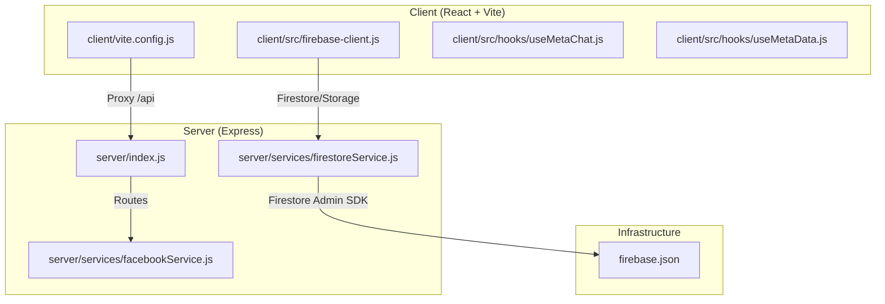
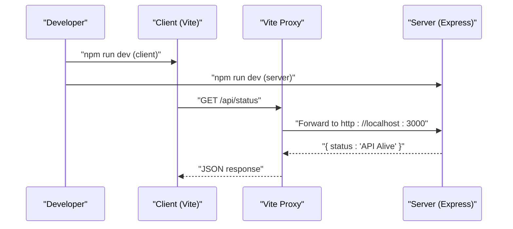
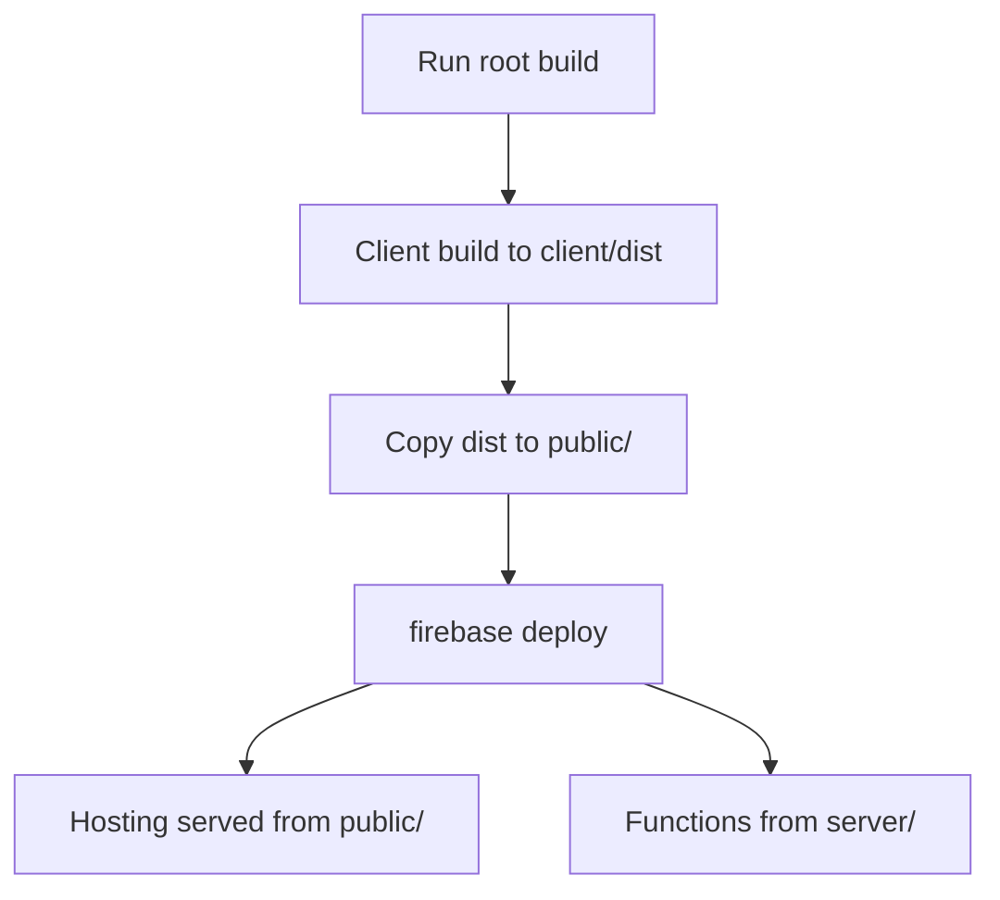
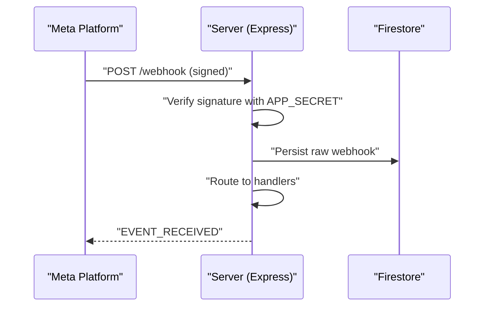
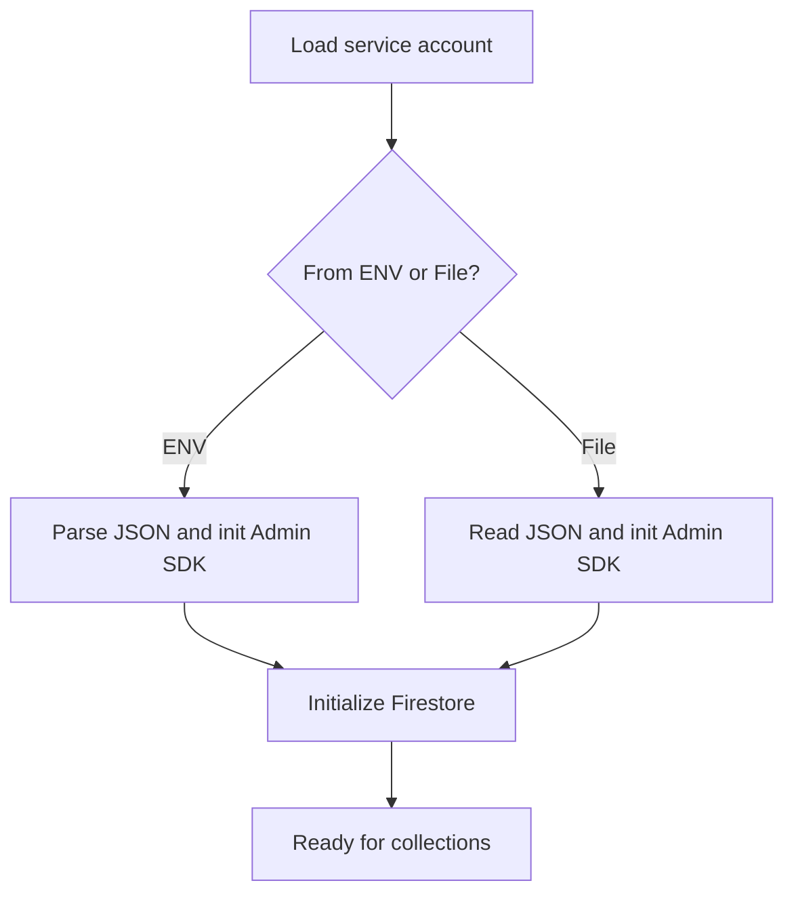

# Getting Started

<cite>
**Referenced Files in This Document**
- [package.json](file://package.json)
- [client/package.json](file://client/package.json)
- [server/package.json](file://server/package.json)
- [firebase.json](file://firebase.json)
- [vite.config.js](file://client/vite.config.js)
- [server/index.js](file://server/index.js)
- [server/services/firestoreService.js](file://server/services/firestoreService.js)
- [client/src/firebase-client.js](file://client/src/firebase-client.js)
- [server/services/facebookService.js](file://server/services/facebookService.js)
- [client/src/hooks/useMetaChat.js](file://client/src/hooks/useMetaChat.js)
- [client/src/hooks/useMetaData.js](file://client/src/hooks/useMetaData.js)
- [PROJECT_SUMMARY.md](file://PROJECT_SUMMARY.md)
</cite>

## Table of Contents
1. [Introduction](#introduction)
2. [Project Structure](#project-structure)
3. [Prerequisites](#prerequisites)
4. [Installation](#installation)
5. [Environment Configuration](#environment-configuration)
6. [Initial Setup](#initial-setup)
7. [Development Workflow](#development-workflow)
8. [Firebase Deployment Preparation](#firebase-deployment-preparation)
9. [Meta Platform Integrations](#meta-platform-integrations)
10. [Database Setup](#database-setup)
11. [Verification and Testing](#verification-and-testing)
12. [Troubleshooting Guide](#troubleshooting-guide)
13. [Conclusion](#conclusion)

## Introduction
This guide helps you set up the Meta Business Solution locally, configure environments, integrate with Firebase and Meta platforms, and prepare for deployment. It covers prerequisites, installation, environment variables, development workflow, and verification steps to ensure everything works as expected.

## Project Structure
The project is a monorepo with:
- Frontend (React + Vite) under client/
- Backend (Node.js Express) under server/
- Firebase hosting and functions configuration under firebase.json
- Root scripts orchestrate client and server builds

**Diagram sources**
- [client/vite.config.js:1-16](file://client/vite.config.js#L1-L16)
- [server/index.js:1-203](file://server/index.js#L1-L203)
- [server/services/firestoreService.js:1-126](file://server/services/firestoreService.js#L1-L126)
- [client/src/firebase-client.js:1-26](file://client/src/firebase-client.js#L1-L26)
- [server/services/facebookService.js:1-200](file://server/services/facebookService.js#L1-L200)
- [firebase.json:1-37](file://firebase.json#L1-L37)

**Section sources**
- [PROJECT_SUMMARY.md:5-18](file://PROJECT_SUMMARY.md#L5-L18)

## Prerequisites
- Node.js 24.x
- Firebase account and project
- Meta Developer credentials (Facebook/Instagram/Webhook)
- Personal Access Tokens and secrets for Meta and Firebase

**Section sources**
- [package.json:5-7](file://package.json#L5-L7)

## Installation
1. Install root dependencies and set up client and server:
   - Run the combined install script to install dependencies for root, client, and server.
2. Build the project:
   - The root build script compiles the client and copies the built assets to the public folder for hosting.

Notes:
- The root scripts orchestrate client and server builds and installs.
- The client uses Vite and React; the server uses Express.

**Section sources**
- [package.json:8-12](file://package.json#L8-L12)
- [client/package.json:6-11](file://client/package.json#L6-L11)
- [server/package.json:6-24](file://server/package.json#L6-L24)

## Environment Configuration
Create and maintain the following environment files:
- Client environment file: client/.env
- Server environment file: server/.env
- Firebase Admin service account: server/firebase-service-account.json

Required server variables (examples):
- PAGE_ACCESS_TOKEN: Facebook Page Access Token
- APP_SECRET: Meta Webhook verification secret
- VERIFY_TOKEN: Webhook verify token
- GOOGLE_APPLICATION_CREDENTIALS_JSON or FIREBASE_SERVICE_ACCOUNT: Firebase Admin service account JSON
- Optional: FACEBOOK_PAGE_ID, INSTAGRAM_ID, WHATSAPP_PHONE_ID, GEMINI_API_KEY, WA_ACCESS_TOKEN

Client variables (examples):
- VITE_API_URL: API base URL for frontend proxy (e.g., http://localhost:3000)

Notes:
- The project excludes .env and service account files from Git for security.
- The server loads Firebase Admin credentials either from environment variables or a local JSON file.

**Section sources**
- [PROJECT_SUMMARY.md:57-62](file://PROJECT_SUMMARY.md#L57-L62)
- [server/services/firestoreService.js:8-34](file://server/services/firestoreService.js#L8-L34)
- [server/services/facebookService.js:4](file://server/services/facebookService.js#L4)
- [client/src/firebase-client.js:5-13](file://client/src/firebase-client.js#L5-L13)
- [client/vite.config.js:7-14](file://client/vite.config.js#L7-L14)

## Initial Setup
1. Create environment files:
   - client/.env with VITE_API_URL=http://localhost:3000
   - server/.env with PAGE_ACCESS_TOKEN, APP_SECRET, VERIFY_TOKEN, GOOGLE_APPLICATION_CREDENTIALS_JSON, and optional Meta IDs/API keys
   - server/firebase-service-account.json with Firebase Admin service account
2. Initialize Firebase:
   - Ensure your Firebase project is configured in firebase.json for hosting and functions.
3. Verify client Firebase config:
   - Confirm client Firebase initialization matches your project settings.

**Section sources**
- [firebase.json:14-36](file://firebase.json#L14-L36)
- [client/src/firebase-client.js:5-13](file://client/src/firebase-client.js#L5-L13)

## Development Workflow
- Start the client and server concurrently:
  - Use the root scripts to run both dev servers.
- Local development ports:
  - Client runs on port 5173 (Vite)
  - Server runs on port 3000 (Express)
- Proxy configuration:
  - Client Vite proxies /api requests to http://localhost:3000

**Diagram sources**
- [client/vite.config.js:7-14](file://client/vite.config.js#L7-L14)
- [server/index.js:37-46](file://server/index.js#L37-L46)

**Section sources**
- [PROJECT_SUMMARY.md:46-52](file://PROJECT_SUMMARY.md#L46-L52)
- [client/vite.config.js:7-14](file://client/vite.config.js#L7-L14)
- [server/index.js:197-200](file://server/index.js#L197-L200)

## Firebase Deployment Preparation
- Hosting and Functions:
  - firebase.json defines functions codebase and hosting public directory, plus rewrite rules for /api/** and /webhook to the api function.
- Build and deploy:
  - Build the client and copy dist to public.
  - Deploy functions and hosting using Firebase CLI.

**Diagram sources**
- [package.json:9](file://package.json#L9)
- [firebase.json:2-12](file://firebase.json#L2-L12)
- [firebase.json:14-36](file://firebase.json#L14-L36)

**Section sources**
- [package.json:9](file://package.json#L9)
- [firebase.json:2-12](file://firebase.json#L2-L12)
- [firebase.json:14-36](file://firebase.json#L14-L36)

## Meta Platform Integrations
- Webhook verification and events:
  - Server exposes GET/POST /webhook and /api/webhook endpoints.
  - Uses APP_SECRET for signature verification and VERIFY_TOKEN for challenge.
- Facebook Graph API:
  - Sends messages and replies via PAGE_ACCESS_TOKEN.
  - Handles rate limits and permission errors.
- Client integration:
  - Client listens to Firestore collections for conversations and metadata.
  - Sends messages via API endpoints proxied from the client.

**Diagram sources**
- [server/index.js:39-42](file://server/index.js#L39-L42)
- [server/services/facebookService.js:4](file://server/services/facebookService.js#L4)
- [server/controllers/fbController.js:175-323](file://server/controllers/fbController.js#L175-L323)

**Section sources**
- [server/index.js:39-42](file://server/index.js#L39-L42)
- [server/services/facebookService.js:4](file://server/services/facebookService.js#L4)
- [server/controllers/fbController.js:175-323](file://server/controllers/fbController.js#L175-L323)

## Database Setup
- Firebase Admin initialization:
  - Credentials loaded from environment variables or local service account JSON.
  - Initializes Firestore and Storage with project bucket.
- Collections used:
  - brands, conversations, draft_replies, knowledge_base, comment_drafts, pending_comments, logs, raw_webhooks, leads, orders, products, knowledge_gaps.
- Client Firebase:
  - Initializes Firestore and attempts to initialize Storage with error handling.

**Diagram sources**
- [server/services/firestoreService.js:8-51](file://server/services/firestoreService.js#L8-L51)
- [client/src/firebase-client.js:15-25](file://client/src/firebase-client.js#L15-L25)

**Section sources**
- [server/services/firestoreService.js:8-51](file://server/services/firestoreService.js#L8-L51)
- [client/src/firebase-client.js:15-25](file://client/src/firebase-client.js#L15-L25)

## Verification and Testing
- Health checks:
  - Use /api/health/token to validate page access tokens.
  - Use /api/health/webhook to check webhook subscriptions.
  - Use /api/health/automation to review automation settings and data presence.
- Basic functionality:
  - Confirm /api/status responds with alive status.
  - Confirm /api/ping responds with pong and timestamp.
- Client-side:
  - Ensure Vite proxy forwards /api requests to the server.
  - Verify Firestore listeners for conversations and metadata.

**Section sources**
- [server/index.js:48-124](file://server/index.js#L48-L124)
- [server/index.js:192](file://server/index.js#L192)
- [client/vite.config.js:7-14](file://client/vite.config.js#L7-L14)
- [client/src/hooks/useMetaChat.js:30-101](file://client/src/hooks/useMetaChat.js#L30-L101)
- [client/src/hooks/useMetaData.js:14-82](file://client/src/hooks/useMetaData.js#L14-L82)

## Troubleshooting Guide
Common issues and resolutions:
- Firebase Storage initialization failure:
  - The client attempts to initialize Storage and logs an error if disabled in the Firebase Console.
- Missing environment variables:
  - Ensure PAGE_ACCESS_TOKEN, APP_SECRET, VERIFY_TOKEN, and GOOGLE_APPLICATION_CREDENTIALS_JSON are set.
- Port conflicts:
  - Client runs on 5173, server on 3000; adjust ports if needed.
- Webhook signature mismatch:
  - Verify APP_SECRET is correctly set; the server logs signature verification outcomes.
- Token expiration:
  - The server detects expired tokens and updates brand status in Firestore for visibility.

**Section sources**
- [client/src/firebase-client.js:18-24](file://client/src/firebase-client.js#L18-L24)
- [server/services/facebookService.js:4](file://server/services/facebookService.js#L4)
- [server/controllers/fbController.js:175-323](file://server/controllers/fbController.js#L175-L323)
- [server/index.js:51-91](file://server/index.js#L51-L91)

## Conclusion
You now have the essentials to install, configure, develop, and verify the Meta Business Solution. Use the provided scripts, environment files, and health checks to ensure a smooth setup. For production, follow the Firebase deployment steps and keep sensitive credentials secure.