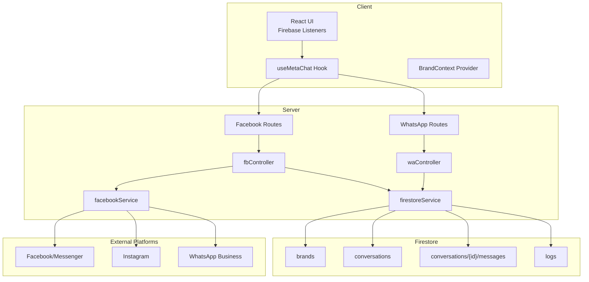
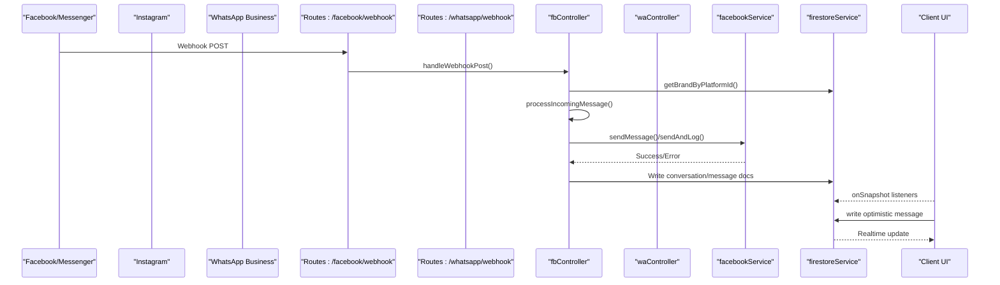
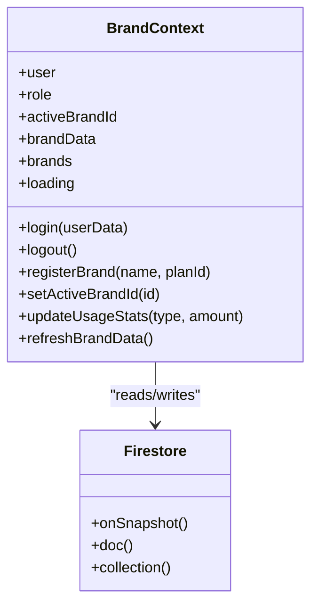
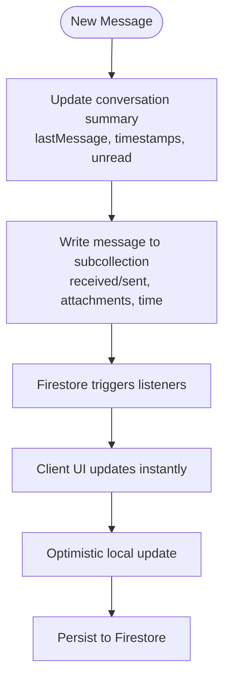
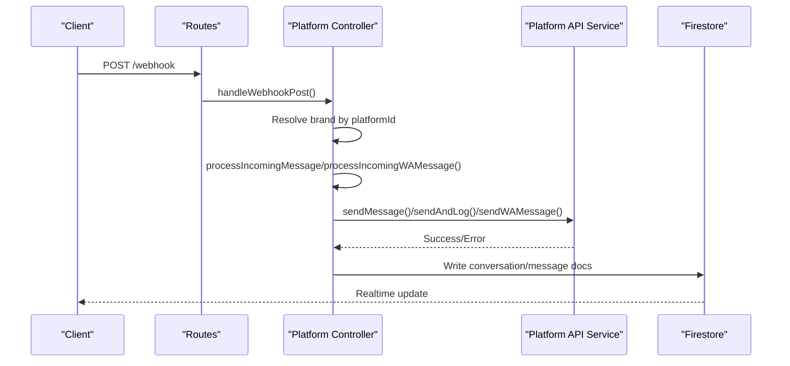
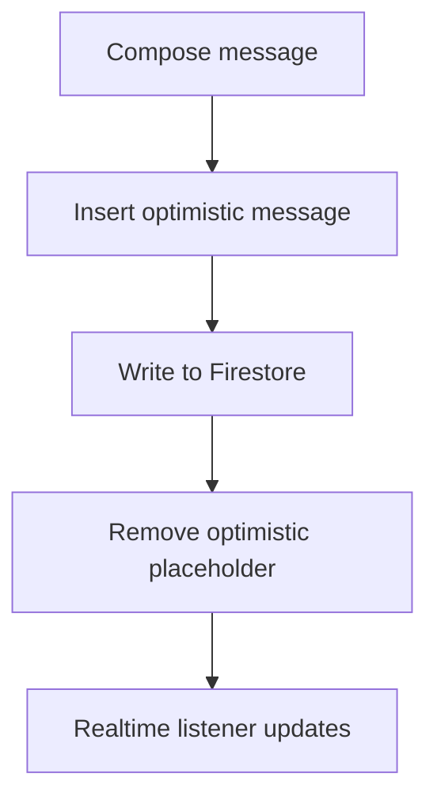
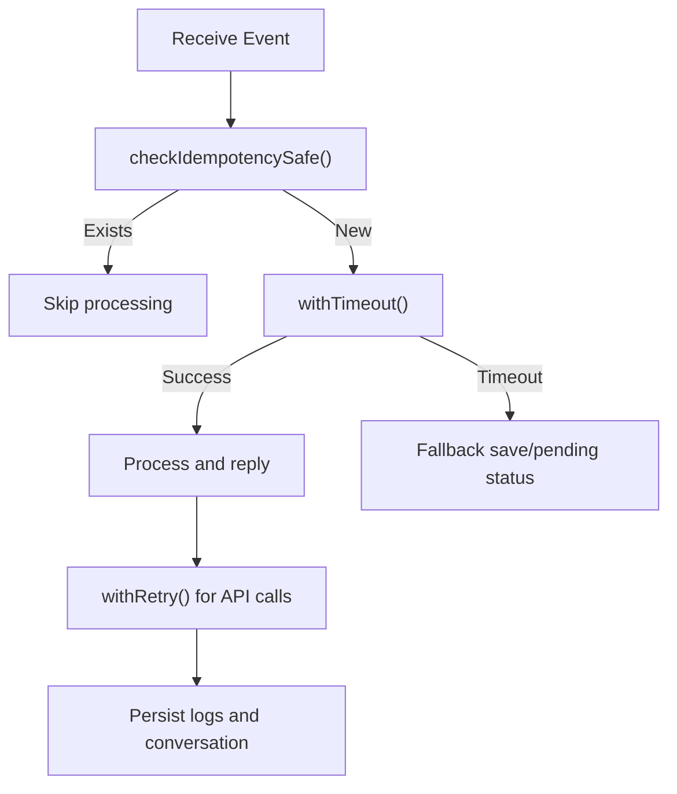
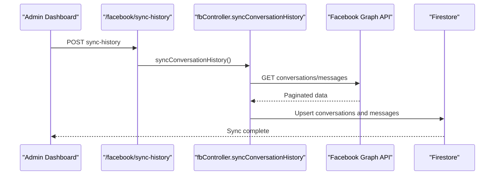
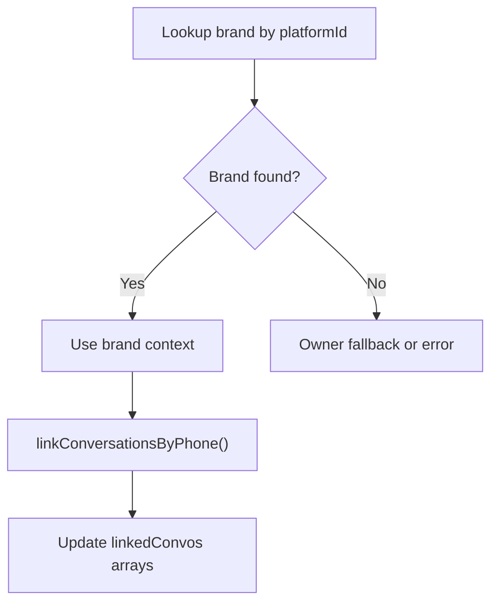
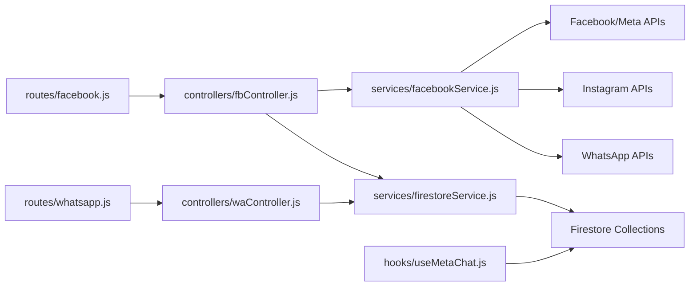

# Cross-Platform Synchronization

<cite>
**Referenced Files in This Document**
- [BrandContext.jsx](file://client/src/context/BrandContext.jsx)
- [useMetaChat.js](file://client/src/hooks/useMetaChat.js)
- [fbController.js](file://server/controllers/fbController.js)
- [waController.js](file://server/controllers/waController.js)
- [facebookService.js](file://server/services/facebookService.js)
- [firestoreService.js](file://server/services/firestoreService.js)
- [facebook.js](file://server/routes/facebook.js)
- [whatsapp.js](file://server/routes/whatsapp.js)
</cite>

## Table of Contents
1. [Introduction](#introduction)
2. [Project Structure](#project-structure)
3. [Core Components](#core-components)
4. [Architecture Overview](#architecture-overview)
5. [Detailed Component Analysis](#detailed-component-analysis)
6. [Dependency Analysis](#dependency-analysis)
7. [Performance Considerations](#performance-considerations)
8. [Troubleshooting Guide](#troubleshooting-guide)
9. [Conclusion](#conclusion)

## Introduction
This document explains how the system achieves cross-platform synchronization across Facebook Messenger, Instagram, and WhatsApp. It covers shared data models, conversation threading, real-time synchronization, optimistic updates, message routing, platform-specific transformations, conflict resolution, conversation history consolidation, user identity mapping, and feature parity maintenance. The goal is to provide a clear understanding of how unified conversations, messages, and user interactions are managed while preserving platform-specific capabilities.

## Project Structure
The solution is organized around:
- Frontend (React) with Firebase Realtime listeners for live updates
- Backend (Node.js/Express) with platform-specific controllers and shared services
- Shared Firestore collections for conversations, messages, brands, and logs
- Platform routes and controllers for Facebook and WhatsApp webhooks and dashboards

**Diagram sources**
- [facebook.js:1-42](file://server/routes/facebook.js#L1-L42)
- [whatsapp.js:1-15](file://server/routes/whatsapp.js#L1-L15)
- [fbController.js:154-323](file://server/controllers/fbController.js#L154-L323)
- [waController.js:27-75](file://server/controllers/waController.js#L27-L75)
- [facebookService.js:1-287](file://server/services/facebookService.js#L1-L287)
- [firestoreService.js:55-114](file://server/services/firestoreService.js#L55-L114)

**Section sources**
- [BrandContext.jsx:1-250](file://client/src/context/BrandContext.jsx#L1-L250)
- [useMetaChat.js:1-245](file://client/src/hooks/useMetaChat.js#L1-L245)
- [facebook.js:1-42](file://server/routes/facebook.js#L1-L42)
- [whatsapp.js:1-15](file://server/routes/whatsapp.js#L1-L15)

## Core Components
- BrandContext: Manages multi-brand accounts, active brand selection, and real-time brand data synchronization.
- useMetaChat: Provides conversation and message lists, optimistic updates, and send/reply/edit/delete operations.
- fbController: Processes Facebook/Instagram webhooks, handles inbound/outbound messages, vision replies, rich media dispatch, and conversation history sync.
- waController: Processes WhatsApp webhooks, handles inbound/outbound messages, vision handling, deterministic ordering flow, and conversation history sync.
- facebookService: Encapsulates Facebook Graph API calls for sending messages, replying to comments, media, and read receipts.
- firestoreService: Centralizes Firestore initialization, brand lookup by platform ID, and server timestamp utilities.

**Section sources**
- [BrandContext.jsx:1-250](file://client/src/context/BrandContext.jsx#L1-L250)
- [useMetaChat.js:1-245](file://client/src/hooks/useMetaChat.js#L1-L245)
- [fbController.js:154-323](file://server/controllers/fbController.js#L154-L323)
- [waController.js:27-75](file://server/controllers/waController.js#L27-L75)
- [facebookService.js:1-287](file://server/services/facebookService.js#L1-L287)
- [firestoreService.js:55-114](file://server/services/firestoreService.js#L55-L114)

## Architecture Overview
The system uses a webhook-first ingestion pipeline with shared Firestore models:
- Webhooks arrive at platform-specific routes and controllers
- Controllers resolve brand context via platform IDs
- Inbound messages are logged to conversation subcollections
- Outbound replies are sent via platform APIs and mirrored in Firestore
- Frontend listens to Firestore for real-time updates and supports optimistic UI

**Diagram sources**
- [facebook.js:7-8](file://server/routes/facebook.js#L7-L8)
- [whatsapp.js:6-9](file://server/routes/whatsapp.js#L6-L9)
- [fbController.js:175-323](file://server/controllers/fbController.js#L175-L323)
- [waController.js:27-75](file://server/controllers/waController.js#L27-L75)
- [facebookService.js:17-52](file://server/services/facebookService.js#L17-L52)
- [firestoreService.js:55-114](file://server/services/firestoreService.js#L55-L114)
- [useMetaChat.js:30-101](file://client/src/hooks/useMetaChat.js#L30-L101)

## Detailed Component Analysis

### BrandContext Implementation
- Maintains user session, roles, and active brand selection
- Loads brands for the user and subscribes to real-time brand updates
- Provides registration and usage statistics updates
- Enables multi-brand management and super-admin overrides

**Diagram sources**
- [BrandContext.jsx:7-242](file://client/src/context/BrandContext.jsx#L7-L242)
- [firestoreService.js:55-114](file://server/services/firestoreService.js#L55-L114)

**Section sources**
- [BrandContext.jsx:1-250](file://client/src/context/BrandContext.jsx#L1-L250)

### Conversation Threading and Real-Time Updates
- Conversation summaries stored under conversations/{id}
- Message threads stored under conversations/{id}/messages
- Client listens to both top-level conversations and message subcollections
- Sorting uses numeric timestamps for consistent ordering across platforms

**Diagram sources**
- [fbController.js:1401-1465](file://server/controllers/fbController.js#L1401-L1465)
- [waController.js:398-426](file://server/controllers/waController.js#L398-L426)
- [useMetaChat.js:30-101](file://client/src/hooks/useMetaChat.js#L30-L101)

**Section sources**
- [fbController.js:1401-1465](file://server/controllers/fbController.js#L1401-L1465)
- [waController.js:398-426](file://server/controllers/waController.js#L398-L426)
- [useMetaChat.js:30-101](file://client/src/hooks/useMetaChat.js#L30-L101)

### Message Routing Logic and Platform-Specific Transformations
- Facebook/Instagram:
  - Webhook verification and signature validation
  - Brand resolution by page ID or Instagram ID
  - Echo handling for admin replies
  - Vision handling via zero-token product matching and OCR fallback
  - Rich media dispatch (carousels, sequenced media)
  - Comment automation with spam filtering and lead capture
- WhatsApp:
  - Webhook verification and signature validation
  - Brand resolution by phone number ID
  - Deterministic ordering flow (phone/address/confirmation)
  - Vision handling via zero-token product matching and OCR fallback
  - Audio transcription and lead extraction

**Diagram sources**
- [facebook.js:7-8](file://server/routes/facebook.js#L7-L8)
- [whatsapp.js:6-9](file://server/routes/whatsapp.js#L6-L9)
- [fbController.js:175-323](file://server/controllers/fbController.js#L175-L323)
- [waController.js:27-75](file://server/controllers/waController.js#L27-L75)
- [facebookService.js:17-52](file://server/services/facebookService.js#L17-L52)

**Section sources**
- [fbController.js:175-323](file://server/controllers/fbController.js#L175-L323)
- [waController.js:27-75](file://server/controllers/waController.js#L27-L75)
- [facebookService.js:17-52](file://server/services/facebookService.js#L17-L52)

### Optimistic Update Patterns (Frontend)
- Local optimistic message insertion with temporary IDs
- Immediate UI rendering before backend persistence
- Automatic cleanup after successful server write
- Mixed timestamp handling (server timestamps vs numeric milliseconds) resolved via client-side sorting

**Diagram sources**
- [useMetaChat.js:117-201](file://client/src/hooks/useMetaChat.js#L117-L201)

**Section sources**
- [useMetaChat.js:117-201](file://client/src/hooks/useMetaChat.js#L117-L201)

### Conflict Resolution Strategies
- Idempotency: Event IDs prevent duplicate processing of the same webhook event
- Timeout safeguards: Tasks wrapped with timeouts and fallback persistence
- Duplicate prevention: Sets and Firestore checks for comments and events
- Retry logic: Wrapped Facebook API calls with exponential backoff-like delays
- Token health monitoring: Automatic flagging of expired tokens in brand records

**Diagram sources**
- [fbController.js:101-115](file://server/controllers/fbController.js#L101-L115)
- [fbController.js:54-71](file://server/controllers/fbController.js#L54-L71)
- [fbController.js:270-278](file://server/controllers/fbController.js#L270-L278)

**Section sources**
- [fbController.js:101-115](file://server/controllers/fbController.js#L101-L115)
- [fbController.js:54-71](file://server/controllers/fbController.js#L54-L71)
- [fbController.js:270-278](file://server/controllers/fbController.js#L270-L278)

### Conversation History Consolidation
- Facebook: Dedicated endpoint to sync conversations and messages from Graph API into Firestore
- Ensures consistent timestamps, avoids duplicates, and preserves message IDs
- Updates conversation summaries and message subcollections accordingly

**Diagram sources**
- [facebook.js:9-9](file://server/routes/facebook.js#L9-L9)
- [fbController.js:1724-1831](file://server/controllers/fbController.js#L1724-L1831)

**Section sources**
- [fbController.js:1724-1831](file://server/controllers/fbController.js#L1724-L1831)

### User Identity Mapping and Cross-Platform Linking
- Identity mapping: Resolves brand by platform-specific IDs (page ID, Instagram ID, phone number)
- Cross-platform linking: Detects shared phone numbers and links conversation IDs across platforms
- Ensures unified inbox experience regardless of platform

**Diagram sources**
- [firestoreService.js:55-114](file://server/services/firestoreService.js#L55-L114)
- [waController.js:431-457](file://server/controllers/waController.js#L431-L457)
- [fbController.js:1470-1497](file://server/controllers/fbController.js#L1470-L1497)

**Section sources**
- [firestoreService.js:55-114](file://server/services/firestoreService.js#L55-L114)
- [waController.js:431-457](file://server/controllers/waController.js#L431-L457)
- [fbController.js:1470-1497](file://server/controllers/fbController.js#L1470-L1497)

### Feature Parity Maintenance
- Shared automation engine: Deterministic flows, fuzzy matching, and AI fallback apply across platforms
- Platform-specific enhancements:
  - Facebook: Rich media, carousels, sequenced media, comment automation
  - WhatsApp: Deterministic ordering flow, vision handling, voice transcription
- Consistent logging and metrics across platforms for analytics and conversions

**Section sources**
- [fbController.js:1503-1583](file://server/controllers/fbController.js#L1503-L1583)
- [waController.js:462-541](file://server/controllers/waController.js#L462-L541)
- [facebookService.js:213-268](file://server/services/facebookService.js#L213-L268)

## Dependency Analysis
- Controllers depend on platform services and Firestore for persistence
- Routes expose endpoints for webhooks and dashboard operations
- Client depends on Firebase SDK for real-time listeners and writes
- Shared services encapsulate platform-specific API calls and brand resolution

**Diagram sources**
- [facebook.js:1-42](file://server/routes/facebook.js#L1-L42)
- [whatsapp.js:1-15](file://server/routes/whatsapp.js#L1-L15)
- [fbController.js:1-50](file://server/controllers/fbController.js#L1-L50)
- [waController.js:1-10](file://server/controllers/waController.js#L1-L10)
- [facebookService.js:1-287](file://server/services/facebookService.js#L1-L287)
- [firestoreService.js:1-126](file://server/services/firestoreService.js#L1-L126)
- [useMetaChat.js:1-20](file://client/src/hooks/useMetaChat.js#L1-L20)

**Section sources**
- [facebook.js:1-42](file://server/routes/facebook.js#L1-L42)
- [whatsapp.js:1-15](file://server/routes/whatsapp.js#L1-L15)
- [fbController.js:1-50](file://server/controllers/fbController.js#L1-L50)
- [waController.js:1-10](file://server/controllers/waController.js#L1-L10)
- [facebookService.js:1-287](file://server/services/facebookService.js#L1-L287)
- [firestoreService.js:1-126](file://server/services/firestoreService.js#L1-L126)
- [useMetaChat.js:1-20](file://client/src/hooks/useMetaChat.js#L1-L20)

## Performance Considerations
- Real-time listeners minimize polling and reduce latency
- Numeric timestamps ensure consistent sorting without composite indexes
- Optimistic UI reduces perceived latency during send operations
- Idempotency and timeout safeguards protect against duplicate processing and long-running tasks
- Vision caching stores computed results to avoid repeated compute costs

[No sources needed since this section provides general guidance]

## Troubleshooting Guide
Common issues and remedies:
- Webhook signature mismatches: Verify APP_SECRET and raw body HMAC calculation
- Token expiration: Controller flags brand token status and logs errors
- Duplicate processing: Idempotency checks prevent reprocessing
- Timeout handling: Tasks marked as pending with timeout fallbacks
- Missing timestamps: Ensure numeric milliseconds are used consistently across collections

**Section sources**
- [fbController.js:175-200](file://server/controllers/fbController.js#L175-L200)
- [fbController.js:122-152](file://server/controllers/fbController.js#L122-L152)
- [fbController.js:101-115](file://server/controllers/fbController.js#L101-L115)
- [fbController.js:273-275](file://server/controllers/fbController.js#L273-L275)

## Conclusion
The system achieves robust cross-platform synchronization by unifying conversation and message models in Firestore, implementing platform-specific controllers with shared services, and leveraging optimistic UI updates for responsiveness. Idempotency, timeouts, and retry logic ensure reliability, while cross-platform linking and history consolidation deliver a seamless customer experience across Facebook, Instagram, and WhatsApp.