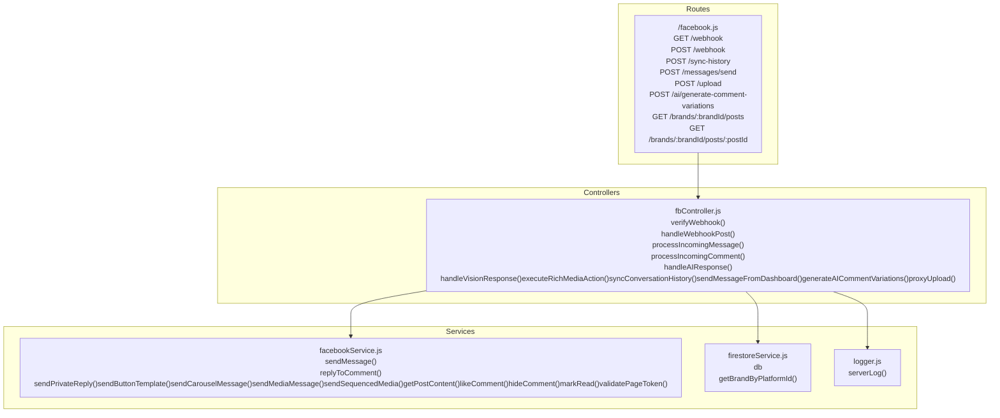
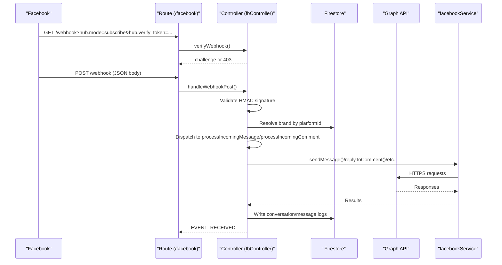
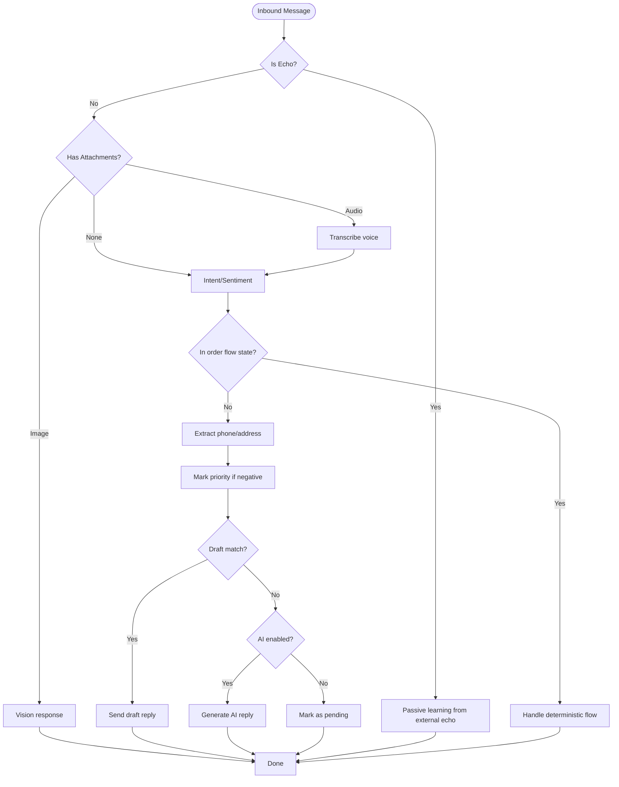
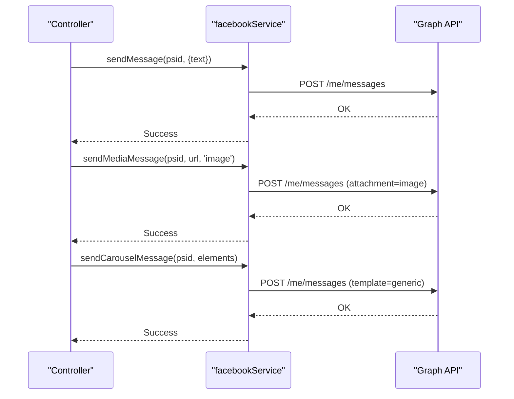
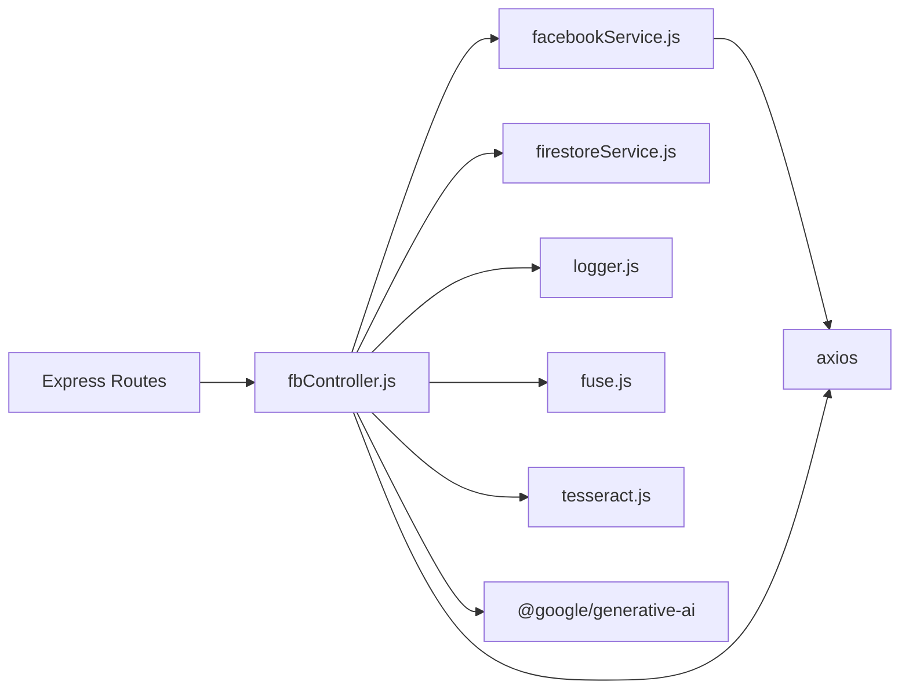

# Facebook Messenger Integration

<cite>
**Referenced Files in This Document**
- [fbController.js](file://server/controllers/fbController.js)
- [facebook.js](file://server/routes/facebook.js)
- [facebookService.js](file://server/services/facebookService.js)
- [webhook.js](file://server/webhook.js)
- [check_app_webhooks.js](file://server/check_app_webhooks.js)
- [subscribe_fb_page.js](file://server/scripts/subscribe_fb_page.js)
- [logger.js](file://server/utils/logger.js)
- [firestoreService.js](file://server/services/firestoreService.js)
- [package.json](file://package.json)
</cite>

## Table of Contents
1. [Introduction](#introduction)
2. [Project Structure](#project-structure)
3. [Core Components](#core-components)
4. [Architecture Overview](#architecture-overview)
5. [Detailed Component Analysis](#detailed-component-analysis)
6. [Dependency Analysis](#dependency-analysis)
7. [Performance Considerations](#performance-considerations)
8. [Troubleshooting Guide](#troubleshooting-guide)
9. [Conclusion](#conclusion)
10. [Appendices](#appendices)

## Introduction
This document explains the Facebook Messenger integration built into the system. It covers webhook verification and event handling, inbound message processing, conversation management, outbound messaging (text, media, rich templates), conversation history synchronization, comment moderation and AI-powered replies, product catalog indexing, post retrieval, and upload proxy functionality. It also provides implementation guidance for webhook handlers, message routing, and integration with the knowledge base and draft reply systems.

## Project Structure
The integration spans three main areas:
- Routes expose endpoints for webhooks, message sending, uploads, AI comment variations, and post retrieval.
- Controllers orchestrate webhook verification, inbound/outbound message processing, conversation sync, and AI/comment engines.
- Services encapsulate Facebook Graph API calls, product fingerprinting, and logging.

**Diagram sources**
- [facebook.js:1-42](file://server/routes/facebook.js#L1-L42)
- [fbController.js:154-323](file://server/controllers/fbController.js#L154-L323)
- [facebookService.js:17-286](file://server/services/facebookService.js#L17-L286)
- [firestoreService.js:56-125](file://server/services/firestoreService.js#L56-L125)
- [logger.js:4-7](file://server/utils/logger.js#L4-L7)

**Section sources**
- [facebook.js:1-42](file://server/routes/facebook.js#L1-L42)
- [fbController.js:154-323](file://server/controllers/fbController.js#L154-L323)
- [facebookService.js:17-286](file://server/services/facebookService.js#L17-L286)
- [firestoreService.js:56-125](file://server/services/firestoreService.js#L56-L125)
- [logger.js:4-7](file://server/utils/logger.js#L4-L7)

## Core Components
- Webhook verification and event ingestion: Validates signature, identifies brand, and dispatches events to appropriate handlers.
- Message processing engine: Determines whether to use deterministic rules, AI, or pass to human operators; supports attachments and rich media.
- Conversation management: Maintains conversation summaries and message threads; supports order flow state machine.
- Comment moderation and AI replies: Processes feed comments with spam filtering, auto-like, lead capture, and AI-generated responses.
- Rich messaging: Sends text, media, carousels, and button templates.
- History sync: Pulls conversations and messages from Facebook Graph API into Firestore.
- Upload proxy: Fast upload to Firebase Storage or Imgur with caching.
- Product catalog indexing and post retrieval: Indexes products and fetches posts for context-aware replies.

**Section sources**
- [fbController.js:154-323](file://server/controllers/fbController.js#L154-L323)
- [fbController.js:859-1002](file://server/controllers/fbController.js#L859-L1002)
- [fbController.js:1004-1111](file://server/controllers/fbController.js#L1004-L1111)
- [fbController.js:1348-1399](file://server/controllers/fbController.js#L1348-L1399)
- [fbController.js:1724-1831](file://server/controllers/fbController.js#L1724-L1831)
- [fbController.js:2118-2180](file://server/controllers/fbController.js#L2118-L2180)
- [facebookService.js:17-286](file://server/services/facebookService.js#L17-L286)
- [facebook.js:1-42](file://server/routes/facebook.js#L1-L42)

## Architecture Overview
High-level flow:
- Facebook sends webhook events to the route handler.
- Controller verifies signature and brand, then routes to message/comment handlers.
- Handlers use services to call Graph API and Firestore to persist state.
- AI engines generate contextual responses using product and conversation context.
- Outbound messages are sent via Graph API with robust error handling and retries.

**Diagram sources**
- [facebook.js:7-8](file://server/routes/facebook.js#L7-L8)
- [fbController.js:154-323](file://server/controllers/fbController.js#L154-L323)
- [facebookService.js:17-106](file://server/services/facebookService.js#L17-L106)
- [firestoreService.js:56-125](file://server/services/firestoreService.js#L56-L125)

## Detailed Component Analysis

### Webhook Endpoint Configuration and Verification
- Verification endpoint accepts GET with hub parameters and responds with challenge if token matches.
- Production webhook POST validates HMAC SHA-256 signature using APP_SECRET and req.rawBody.
- On successful verification, stores raw webhook payload for debugging.

Implementation highlights:
- Signature validation and optional enforcement.
- Brand resolution by platform ID and fallback to owner brand.
- Idempotency guard using Firestore to prevent duplicate processing.

**Section sources**
- [fbController.js:154-173](file://server/controllers/fbController.js#L154-L173)
- [fbController.js:176-323](file://server/controllers/fbController.js#L176-L323)
- [firestoreService.js:56-125](file://server/services/firestoreService.js#L56-L125)

### Event Handling Patterns
- Messaging events: Echo detection, inbound message routing, and postback handling.
- Feed events: Comment creation triggers moderation pipeline.

Key behaviors:
- Duplicate prevention for comments using in-memory and Firestore checks.
- Human handoff detection via keywords.
- Spam filtering and auto-like options.
- AI fallback for comments and inbox replies.

**Section sources**
- [fbController.js:251-311](file://server/controllers/fbController.js#L251-L311)
- [fbController.js:325-549](file://server/controllers/fbController.js#L325-L549)
- [fbController.js:2099-2116](file://server/controllers/fbController.js#L2099-L2116)

### Message Processing Engine
- Determines system auto-reply and AI-enabled settings per brand.
- Supports voice transcription and image-based product matching.
- Executes deterministic order flow for phone/address collection.
- Auto-tags customers and updates conversation summaries.
- Logs outbound messages and updates unread status.

**Diagram sources**
- [fbController.js:859-1002](file://server/controllers/fbController.js#L859-L1002)
- [fbController.js:1004-1111](file://server/controllers/fbController.js#L1004-L1111)
- [fbController.js:1503-1583](file://server/controllers/fbController.js#L1503-L1583)

**Section sources**
- [fbController.js:859-1002](file://server/controllers/fbController.js#L859-L1002)
- [fbController.js:1004-1111](file://server/controllers/fbController.js#L1004-L1111)
- [fbController.js:1503-1583](file://server/controllers/fbController.js#L1503-L1583)

### Conversation Management
- Persists conversation metadata and message threads with numeric timestamps for consistent ordering.
- Updates unread counts and last message previews.
- Supports linking conversations by phone across platforms.
- Handles echo messages from external sources and integrates them into history.

**Section sources**
- [fbController.js:1401-1465](file://server/controllers/fbController.js#L1401-L1465)
- [fbController.js:1623-1722](file://server/controllers/fbController.js#L1623-L1722)
- [fbController.js:1467-1497](file://server/controllers/fbController.js#L1467-L1497)

### Rich Message Templates and Media
- Text replies via sendMessage.
- Media attachments via sendMediaMessage and sendSequencedMedia.
- Carousels via sendCarouselMessage.
- Button templates via sendButtonTemplate.
- Mark read via markRead.

**Diagram sources**
- [facebookService.js:17-286](file://server/services/facebookService.js#L17-L286)

**Section sources**
- [facebookService.js:17-286](file://server/services/facebookService.js#L17-L286)

### Conversation History Synchronization
- Fetches conversations and messages from Graph API.
- Writes conversation summaries and message subcollections to Firestore.
- Uses numeric timestamps to maintain consistent ordering.

**Section sources**
- [fbController.js:1724-1831](file://server/controllers/fbController.js#L1724-L1831)

### Comment Moderation and AI Replies
- Detects spam and applies auto-like.
- Generates AI-powered public/private replies with sentiment-aware tone.
- Supports human handoff and pending queue.

**Section sources**
- [fbController.js:325-549](file://server/controllers/fbController.js#L325-L549)
- [fbController.js:805-856](file://server/controllers/fbController.js#L805-L856)

### AI-Powered Response Generation
- Unified inbox reply engine: tries draft rules and knowledge base, falls back to AI.
- Vision response engine: zero-token matching, OCR fallback, and AI vision model.
- Rich media actions: send more photos or carousels based on product variants.

**Section sources**
- [fbController.js:662-803](file://server/controllers/fbController.js#L662-L803)
- [fbController.js:1004-1111](file://server/controllers/fbController.js#L1004-L1111)
- [fbController.js:1113-1285](file://server/controllers/fbController.js#L1113-L1285)
- [fbController.js:1348-1399](file://server/controllers/fbController.js#L1348-L1399)

### Product Catalog Indexing and Post Retrieval
- Indexes brand products for vector search and visual matching.
- Retrieves latest posts and individual post content for context.

**Section sources**
- [facebook.js:28-39](file://server/routes/facebook.js#L28-L39)
- [facebookService.js:108-155](file://server/services/facebookService.js#L108-L155)

### Upload Proxy Functionality
- Attempts Firebase Storage buckets in parallel and caches the last successful one.
- Falls back to Imgur with aggressive timeouts.

**Section sources**
- [fbController.js:2118-2180](file://server/controllers/fbController.js#L2118-L2180)

### Webhook Subscription Management
- Subscribes a page to webhooks with required fields.
- Utility script checks app-level webhook subscriptions.

**Section sources**
- [subscribe_fb_page.js:4-48](file://server/scripts/subscribe_fb_page.js#L4-L48)
- [check_app_webhooks.js:7-39](file://server/check_app_webhooks.js#L7-L39)

## Dependency Analysis
- Express routes depend on fbController methods.
- fbController depends on facebookService for Graph API calls and firestoreService for brand/context lookup and persistence.
- Utilities include Fuse.js for fuzzy matching, Tesseract.js for OCR, and Gemini/AI libraries for generation.

**Diagram sources**
- [facebook.js:1-42](file://server/routes/facebook.js#L1-L42)
- [fbController.js:1-31](file://server/controllers/fbController.js#L1-L31)
- [facebookService.js:1-31](file://server/services/facebookService.js#L1-L31)
- [firestoreService.js:1-31](file://server/services/firestoreService.js#L1-L31)
- [package.json:14-31](file://package.json#L14-L31)

**Section sources**
- [facebook.js:1-42](file://server/routes/facebook.js#L1-L42)
- [fbController.js:1-31](file://server/controllers/fbController.js#L1-L31)
- [facebookService.js:1-31](file://server/services/facebookService.js#L1-L31)
- [firestoreService.js:1-31](file://server/services/firestoreService.js#L1-L31)
- [package.json:14-31](file://package.json#L14-L31)

## Performance Considerations
- Signature validation and idempotency reduce redundant work.
- Retry wrapper handles rate limits and transient errors for Graph API calls.
- Timeout guards ensure serverless functions do not exceed limits.
- Parallel upload proxy reduces latency for media.
- Numeric timestamps in Firestore ensure consistent ordering and efficient queries.

[No sources needed since this section provides general guidance]

## Troubleshooting Guide
Common issues and remedies:
- Webhook verification failures: confirm VERIFY_TOKEN and APP_SECRET are set and match Meta’s expectations.
- Signature mismatch warnings: ensure APP_SECRET is configured and req.rawBody is available.
- Token expiration errors: controller detects and flags brand token status in Firestore.
- Rate limits and transient errors: retry wrapper automatically retries with backoff.
- Upload failures: proxy switches to fastest available backend and caches success.

**Section sources**
- [fbController.js:154-173](file://server/controllers/fbController.js#L154-L173)
- [fbController.js:176-323](file://server/controllers/fbController.js#L176-L323)
- [fbController.js:54-71](file://server/controllers/fbController.js#L54-L71)
- [fbController.js:122-152](file://server/controllers/fbController.js#L122-L152)
- [fbController.js:2118-2180](file://server/controllers/fbController.js#L2118-L2180)

## Conclusion
The integration provides a robust, production-grade Facebook Messenger solution with strong security, idempotency, and resilience. It supports automated message handling, intelligent moderation, rich media, and seamless history synchronization. The modular design allows easy extension for additional features and improved AI-driven personalization.

[No sources needed since this section summarizes without analyzing specific files]

## Appendices

### Implementation Examples

- Webhook handlers
  - Verification: [verifyWebhook:154-173](file://server/controllers/fbController.js#L154-L173)
  - Event ingestion: [handleWebhookPost:176-323](file://server/controllers/fbController.js#L176-L323)

- Message routing and processing
  - Inbound message: [processIncomingMessage:859-874](file://server/controllers/fbController.js#L859-L874)
  - Threaded processing: [processThreadedMessage:876-1002](file://server/controllers/fbController.js#L876-L1002)
  - Deterministic flow: [handleDeterministicFlow:1503-1583](file://server/controllers/fbController.js#L1503-L1583)

- Outbound messaging
  - Text: [sendMessage:17-52](file://server/services/facebookService.js#L17-L52)
  - Media: [sendMediaMessage:235-255](file://server/services/facebookService.js#L235-L255)
  - Sequenced media: [sendSequencedMedia:259-268](file://server/services/facebookService.js#L259-L268)
  - Carousels: [sendCarouselMessage:213-233](file://server/services/facebookService.js#L213-L233)
  - Button templates: [sendButtonTemplate:157-183](file://server/services/facebookService.js#L157-L183)

- Conversation management
  - Sync history: [syncConversationHistory:1724-1831](file://server/controllers/fbController.js#L1724-L1831)
  - Send from dashboard: [sendMessageFromDashboard:1833-1997](file://server/controllers/fbController.js#L1833-L1997)
  - Log user message: [logUserMessage:1401-1465](file://server/controllers/fbController.js#L1401-L1465)

- Comment moderation and AI
  - Process comment: [processIncomingComment:325-549](file://server/controllers/fbController.js#L325-L549)
  - AI comment variations: [handleCommentAIResponse:805-856](file://server/controllers/fbController.js#L805-L856)
  - AI inbox replies: [handleAIResponse:1004-1111](file://server/controllers/fbController.js#L1004-L1111)

- Product and post utilities
  - Index products: [indexBrandProducts:30-39](file://server/routes/facebook.js#L30-L39)
  - Get posts: [getLatestPosts:2049-2076](file://server/controllers/fbController.js#L2049-L2076)
  - Get post by ID: [getPostById:2078-2097](file://server/controllers/fbController.js#L2078-L2097)

- Upload proxy
  - Proxy upload: [proxyUpload:2118-2180](file://server/controllers/fbController.js#L2118-L2180)

- Webhook subscription
  - Subscribe page: [subscribePage:4-48](file://server/scripts/subscribe_fb_page.js#L4-L48)
  - Check app subscriptions: [checkAppWebhooks:7-39](file://server/check_app_webhooks.js#L7-L39)