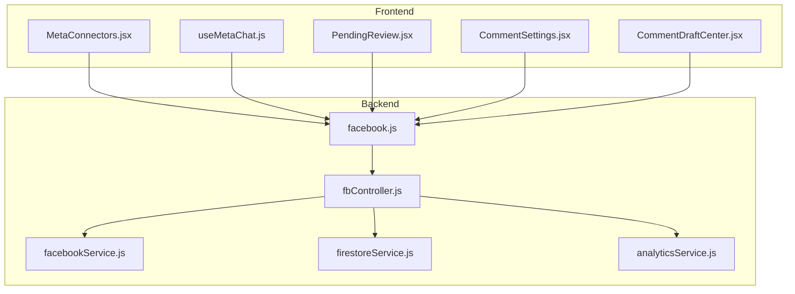
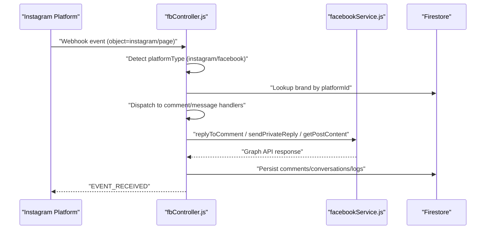
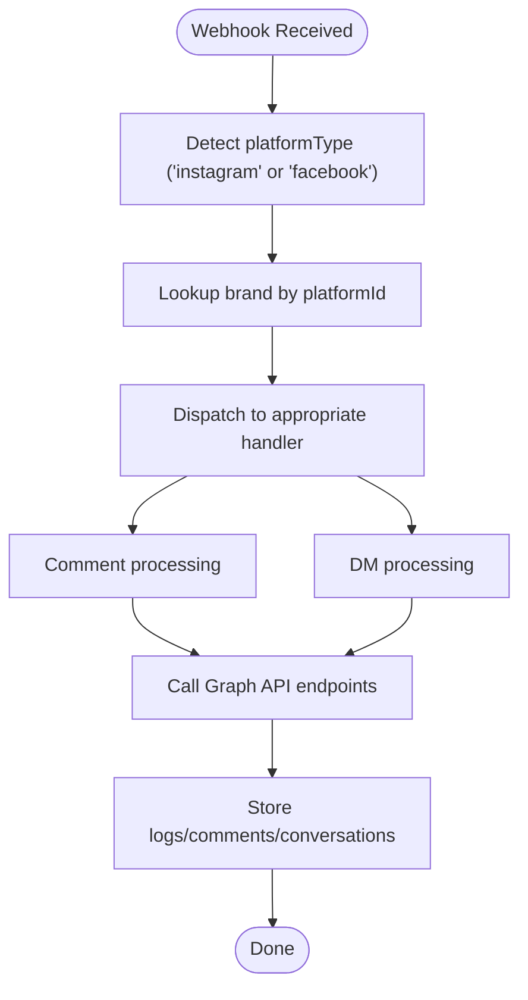
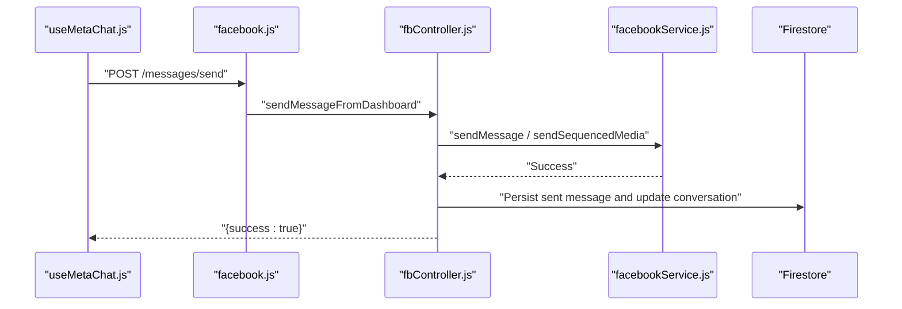
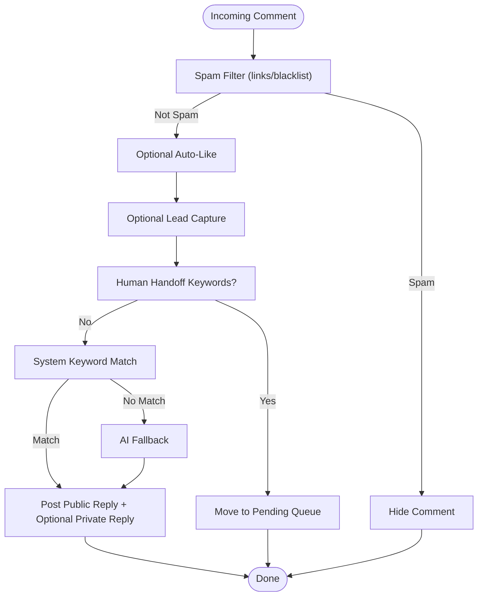
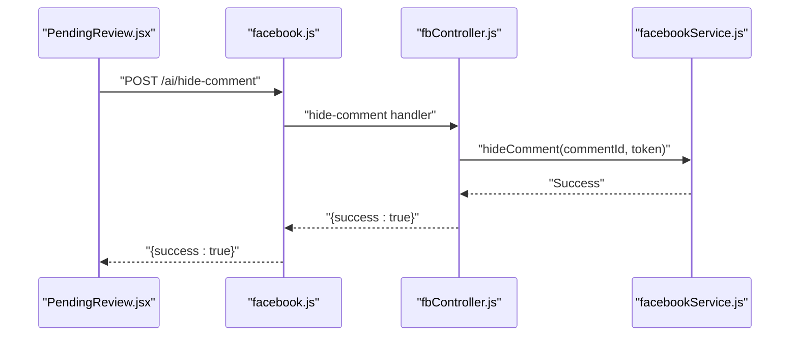
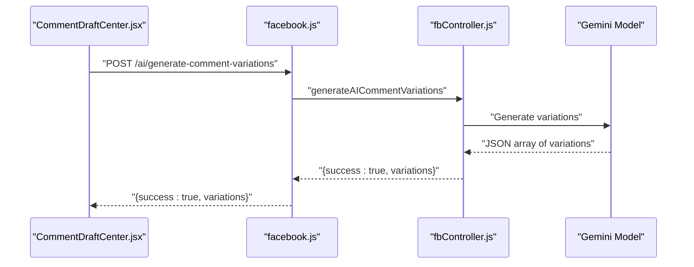
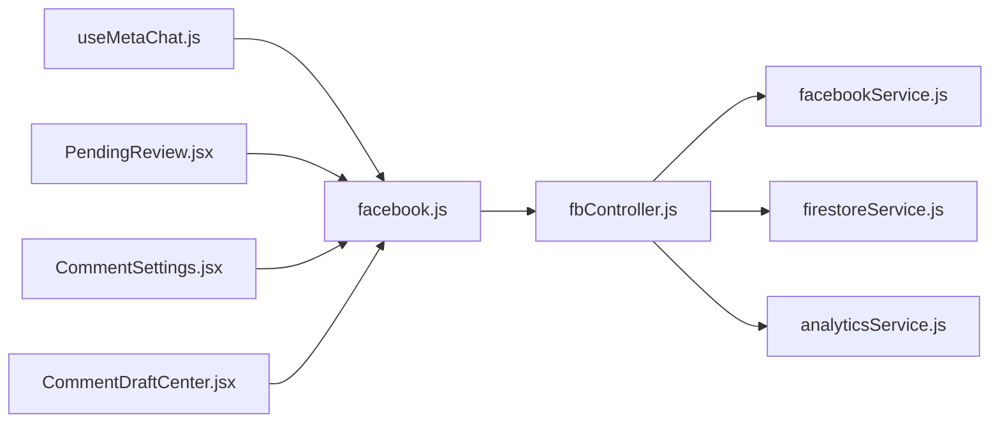

# Instagram Integration

<cite>
**Referenced Files in This Document**
- [fbController.js](file://server/controllers/fbController.js)
- [facebookService.js](file://server/services/facebookService.js)
- [firestoreService.js](file://server/services/firestoreService.js)
- [facebook.js](file://server/routes/facebook.js)
- [useMetaChat.js](file://client/src/hooks/useMetaChat.js)
- [MetaConnectors.jsx](file://client/src/components/Views/MetaConnectors.jsx)
- [PendingReview.jsx](file://client/src/components/Views/Comment/PendingReview.jsx)
- [CommentSettings.jsx](file://client/src/components/Views/Comment/CommentSettings.jsx)
- [CommentDraftCenter.jsx](file://client/src/components/Views/CommentDraftCenter.jsx)
- [analyticsService.js](file://server/services/analyticsService.js)
</cite>

## Table of Contents
1. [Introduction](#introduction)
2. [Project Structure](#project-structure)
3. [Core Components](#core-components)
4. [Architecture Overview](#architecture-overview)
5. [Detailed Component Analysis](#detailed-component-analysis)
6. [Dependency Analysis](#dependency-analysis)
7. [Performance Considerations](#performance-considerations)
8. [Troubleshooting Guide](#troubleshooting-guide)
9. [Conclusion](#conclusion)

## Introduction
This document explains the Instagram integration built on Facebook's unified messaging infrastructure. It covers direct message handling, comment moderation, automated response generation, DM thread management, comment approval workflows, comment hiding, moderation queue management, and shared data models. It also documents Instagram-specific features such as post engagement tracking and audience insights integration.

## Project Structure
The integration spans backend controllers and services, frontend hooks and views, and shared Firestore models. Instagram is treated as a platform type alongside Facebook within the unified webhook and messaging pipeline.

**Diagram sources**
- [MetaConnectors.jsx:105-139](file://client/src/components/Views/MetaConnectors.jsx#L105-L139)
- [useMetaChat.js:16-101](file://client/src/hooks/useMetaChat.js#L16-L101)
- [PendingReview.jsx:4-142](file://client/src/components/Views/Comment/PendingReview.jsx#L4-L142)
- [CommentSettings.jsx:4-123](file://client/src/components/Views/Comment/CommentSettings.jsx#L4-L123)
- [CommentDraftCenter.jsx:45-128](file://client/src/components/Views/CommentDraftCenter.jsx#L45-L128)
- [fbController.js:176-323](file://server/controllers/fbController.js#L176-L323)
- [facebookService.js:1-287](file://server/services/facebookService.js#L1-L287)
- [facebook.js:1-42](file://server/routes/facebook.js#L1-L42)
- [firestoreService.js:56-114](file://server/services/firestoreService.js#L56-L114)
- [analyticsService.js:54-76](file://server/services/analyticsService.js#L54-L76)

**Section sources**
- [MetaConnectors.jsx:105-139](file://client/src/components/Views/MetaConnectors.jsx#L105-L139)
- [useMetaChat.js:16-101](file://client/src/hooks/useMetaChat.js#L16-L101)
- [fbController.js:176-323](file://server/controllers/fbController.js#L176-L323)
- [facebookService.js:1-287](file://server/services/facebookService.js#L1-L287)
- [facebook.js:1-42](file://server/routes/facebook.js#L1-L42)
- [firestoreService.js:56-114](file://server/services/firestoreService.js#L56-L114)
- [analyticsService.js:54-76](file://server/services/analyticsService.js#L54-L76)

## Core Components
- Instagram/Facebook unified webhook handler: routes webhooks, identifies brands, and dispatches to processing engines.
- Facebook Graph API service: encapsulates Graph API calls for comments, DMs, posts, and media.
- Comment moderation engine: keyword matching, AI fallback, spam filtering, auto-like, lead capture, and human handoff.
- Inbox automation: threaded DM handling, rich media dispatch, and conversation persistence.
- Frontend integrations: connector cards, inbox UI, comment moderation panels, and analytics dashboards.

**Section sources**
- [fbController.js:176-323](file://server/controllers/fbController.js#L176-L323)
- [facebookService.js:54-139](file://server/services/facebookService.js#L54-L139)
- [facebook.js:7-29](file://server/routes/facebook.js#L7-L29)

## Architecture Overview
Instagram and Facebook share the same webhook and messaging pipeline. The controller detects platform type, resolves brand context, and executes platform-appropriate actions.

**Diagram sources**
- [fbController.js:202-311](file://server/controllers/fbController.js#L202-L311)
- [facebookService.js:54-139](file://server/services/facebookService.js#L54-L139)
- [firestoreService.js:56-114](file://server/services/firestoreService.js#L56-L114)

**Section sources**
- [fbController.js:202-311](file://server/controllers/fbController.js#L202-L311)
- [facebookService.js:54-139](file://server/services/facebookService.js#L54-L139)
- [firestoreService.js:56-114](file://server/services/firestoreService.js#L56-L114)

## Detailed Component Analysis

### Instagram Graph API Integration
- Webhook verification and payload parsing support both Facebook and Instagram objects.
- Brand lookup uses platform-specific identifiers (Instagram ID) and environment fallbacks.
- Graph API endpoints for comments, DM replies, post retrieval, likes, and hiding are implemented.

**Diagram sources**
- [fbController.js:202-311](file://server/controllers/fbController.js#L202-L311)
- [firestoreService.js:61-62](file://server/services/firestoreService.js#L61-L62)
- [facebookService.js:54-139](file://server/services/facebookService.js#L54-L139)

**Section sources**
- [fbController.js:202-311](file://server/controllers/fbController.js#L202-L311)
- [firestoreService.js:61-62](file://server/services/firestoreService.js#L61-L62)
- [facebookService.js:54-139](file://server/services/facebookService.js#L54-L139)

### DM Thread Management
- Inbox threads are stored under conversations with per-thread message collections.
- Numeric timestamps ensure consistent ordering across Firestore and client-side sorting.
- Rich media dispatch supports sequenced images and carousels.

**Diagram sources**
- [facebook.js:10-11](file://server/routes/facebook.js#L10-L11)
- [fbController.js:1833-1997](file://server/controllers/fbController.js#L1833-L1997)
- [facebookService.js:17-52](file://server/services/facebookService.js#L17-L52)
- [useMetaChat.js:117-201](file://client/src/hooks/useMetaChat.js#L117-L201)

**Section sources**
- [useMetaChat.js:16-101](file://client/src/hooks/useMetaChat.js#L16-L101)
- [fbController.js:1833-1997](file://server/controllers/fbController.js#L1833-L1997)
- [facebookService.js:17-52](file://server/services/facebookService.js#L17-L52)
- [facebook.js:10-11](file://server/routes/facebook.js#L10-L11)

### Comment Moderation Workflow
- Incoming comments trigger spam filtering, optional auto-like, lead capture, and human handoff checks.
- Keyword matching selects system-generated replies; otherwise AI generates fallback responses.
- Replies are posted publicly and optionally as private replies; spam comments are hidden.

**Diagram sources**
- [fbController.js:325-549](file://server/controllers/fbController.js#L325-L549)
- [facebookService.js:54-139](file://server/services/facebookService.js#L54-L139)

**Section sources**
- [fbController.js:325-549](file://server/controllers/fbController.js#L325-L549)
- [facebookService.js:54-139](file://server/services/facebookService.js#L54-L139)

### Comment Approval Workflows and Moderation Queue
- Pending comments are surfaced in the moderation panel with actions to create strategies, link to existing strategies, mark as spam, or delete.
- Spam actions call the hide endpoint via the backend route.

**Diagram sources**
- [PendingReview.jsx:117-123](file://client/src/components/Views/Comment/PendingReview.jsx#L117-L123)
- [facebook.js:13-27](file://server/routes/facebook.js#L13-L27)
- [fbController.js:13-27](file://server/controllers/fbController.js#L13-L27)
- [facebookService.js:129-139](file://server/services/facebookService.js#L129-L139)

**Section sources**
- [PendingReview.jsx:117-123](file://client/src/components/Views/Comment/PendingReview.jsx#L117-L123)
- [facebook.js:13-27](file://server/routes/facebook.js#L13-L27)
- [fbController.js:13-27](file://server/controllers/fbController.js#L13-L27)
- [facebookService.js:129-139](file://server/services/facebookService.js#L129-L139)

### Automated Response Generation for Comments
- AI-generated comment variations are produced using a dynamic Gemini model.
- Frontend provides templates and quick generation for draft creation.

**Diagram sources**
- [CommentDraftCenter.jsx:69-91](file://client/src/components/Views/CommentDraftCenter.jsx#L69-L91)
- [facebook.js:12-12](file://server/routes/facebook.js#L12-L12)
- [fbController.js:1999-2047](file://server/controllers/fbController.js#L1999-L2047)

**Section sources**
- [CommentDraftCenter.jsx:69-91](file://client/src/components/Views/CommentDraftCenter.jsx#L69-L91)
- [facebook.js:12-12](file://server/routes/facebook.js#L12-L12)
- [fbController.js:1999-2047](file://server/controllers/fbController.js#L1999-L2047)

### Integration with Facebook's Unified Messaging System
- The same Graph API endpoints and error handling logic apply to both Facebook and Instagram.
- Platform type detection enables Instagram-specific comment and DM workflows while reusing shared infrastructure.

**Section sources**
- [fbController.js:202-311](file://server/controllers/fbController.js#L202-L311)
- [facebookService.js:54-139](file://server/services/facebookService.js#L54-L139)

### Shared Data Models
- Brands store platform identifiers and tokens; Instagram uses the Instagram ID field for brand lookup.
- Conversations and messages persist with numeric timestamps for consistent ordering.
- Pending comments and comment drafts support moderation and strategy authoring.

**Section sources**
- [firestoreService.js:61-62](file://server/services/firestoreService.js#L61-L62)
- [fbController.js:1401-1427](file://server/controllers/fbController.js#L1401-L1427)
- [fbController.js:294-305](file://server/controllers/fbController.js#L294-L305)

### Instagram-Specific Features
- Story sharing: The codebase references story-related icons and UI elements, indicating story sharing capabilities are part of the broader Instagram integration scope.
- Post engagement tracking: Routes expose latest posts retrieval and post content fetching via Graph API.
- Audience insights integration: Analytics service computes BI metrics and audience insights are surfaced in the UI.

**Section sources**
- [MetaConnectors.jsx:118-127](file://client/src/components/Views/MetaConnectors.jsx#L118-L127)
- [facebook.js:28-29](file://server/routes/facebook.js#L28-L29)
- [fbController.js:2049-2097](file://server/controllers/fbController.js#L2049-L2097)
- [analyticsService.js:54-76](file://server/services/analyticsService.js#L54-L76)

## Dependency Analysis

**Diagram sources**
- [fbController.js:1-31](file://server/controllers/fbController.js#L1-L31)
- [facebookService.js:1-5](file://server/services/facebookService.js#L1-L5)
- [firestoreService.js:1-5](file://server/services/firestoreService.js#L1-L5)
- [analyticsService.js:1-3](file://server/services/analyticsService.js#L1-L3)
- [facebook.js:1-5](file://server/routes/facebook.js#L1-L5)
- [useMetaChat.js:1-14](file://client/src/hooks/useMetaChat.js#L1-L14)
- [PendingReview.jsx:1-14](file://client/src/components/Views/Comment/PendingReview.jsx#L1-L14)
- [CommentSettings.jsx:1-14](file://client/src/components/Views/Comment/CommentSettings.jsx#L1-L14)
- [CommentDraftCenter.jsx:1-22](file://client/src/components/Views/CommentDraftCenter.jsx#L1-L22)

**Section sources**
- [fbController.js:1-31](file://server/controllers/fbController.js#L1-L31)
- [facebookService.js:1-5](file://server/services/facebookService.js#L1-L5)
- [firestoreService.js:1-5](file://server/services/firestoreService.js#L1-L5)
- [analyticsService.js:1-3](file://server/services/analyticsService.js#L1-L3)
- [facebook.js:1-5](file://server/routes/facebook.js#L1-L5)
- [useMetaChat.js:1-14](file://client/src/hooks/useMetaChat.js#L1-L14)
- [PendingReview.jsx:1-14](file://client/src/components/Views/Comment/PendingReview.jsx#L1-L14)
- [CommentSettings.jsx:1-14](file://client/src/components/Views/Comment/CommentSettings.jsx#L1-L14)
- [CommentDraftCenter.jsx:1-22](file://client/src/components/Views/CommentDraftCenter.jsx#L1-L22)

## Performance Considerations
- Idempotency and duplicate prevention: Event IDs and in-memory sets prevent duplicate processing.
- Retry wrapper: Automatic retries for transient and rate-limit errors.
- Timeout safeguards: Per-operation timeouts with fallback persistence.
- Efficient sorting: Numeric timestamps ensure fast Firestore queries and client-side ordering.

**Section sources**
- [fbController.js:101-115](file://server/controllers/fbController.js#L101-L115)
- [fbController.js:55-71](file://server/controllers/fbController.js#L55-L71)
- [fbController.js:87-99](file://server/controllers/fbController.js#L87-L99)
- [useMetaChat.js:44-52](file://client/src/hooks/useMetaChat.js#L44-L52)

## Troubleshooting Guide
- Token expiration: Dedicated error handler updates brand health status and logs.
- API errors: Graph API service classifies errors and persists logs for visibility.
- Webhook signature validation: HMAC verification ensures authenticity; misconfiguration logs warnings.
- Pending comments: Use moderation panel actions to hide spam or move to strategy.

**Section sources**
- [fbController.js:122-152](file://server/controllers/fbController.js#L122-L152)
- [facebookService.js:33-51](file://server/services/facebookService.js#L33-L51)
- [fbController.js:180-199](file://server/controllers/fbController.js#L180-L199)
- [PendingReview.jsx:117-123](file://client/src/components/Views/Comment/PendingReview.jsx#L117-L123)

## Conclusion
The Instagram integration leverages Facebook's unified messaging infrastructure to deliver robust DM handling, comment moderation, automated responses, and analytics. Instagram-specific features like story sharing and post engagement tracking are integrated through shared data models and Graph API endpoints, while the frontend provides intuitive moderation and strategy authoring tools.