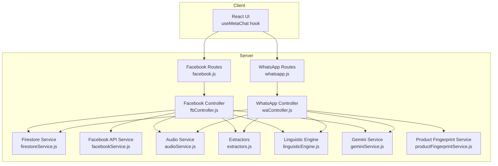
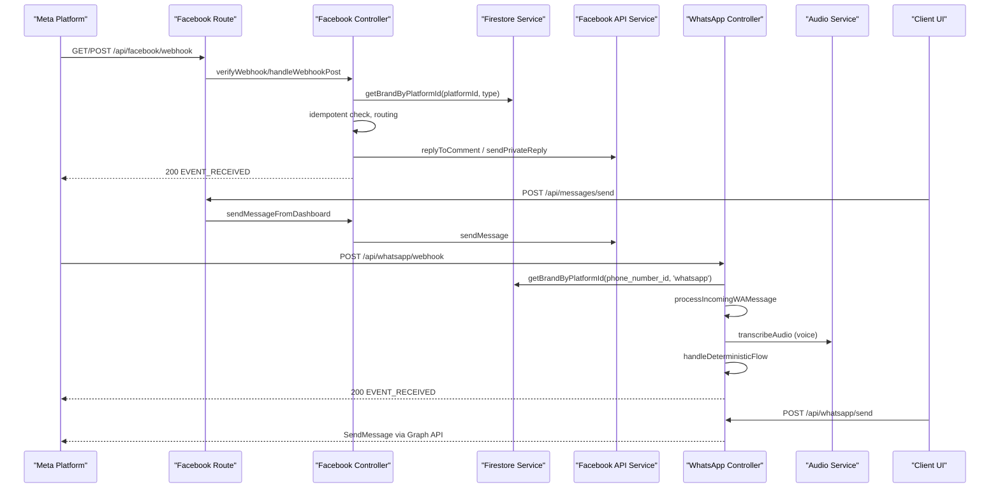
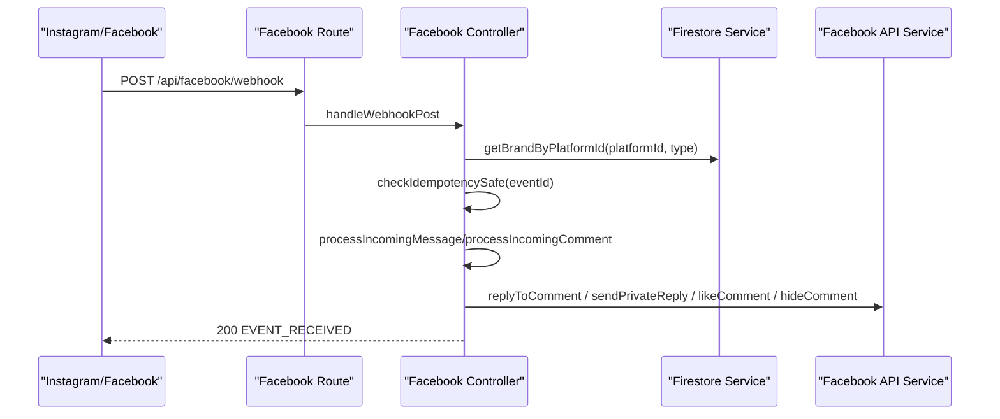
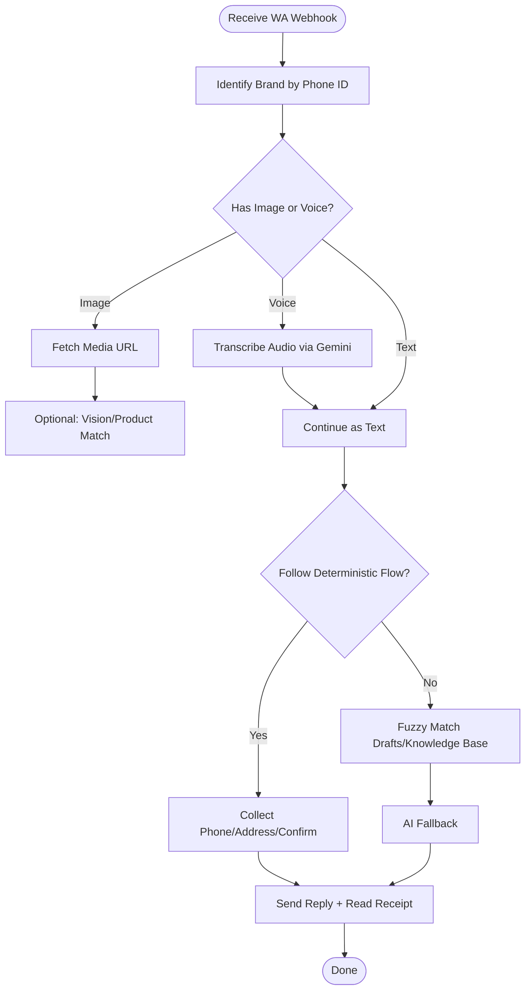
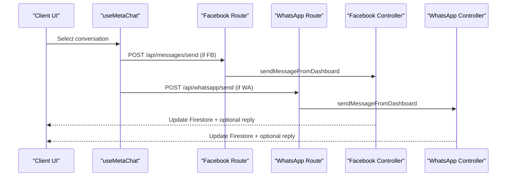
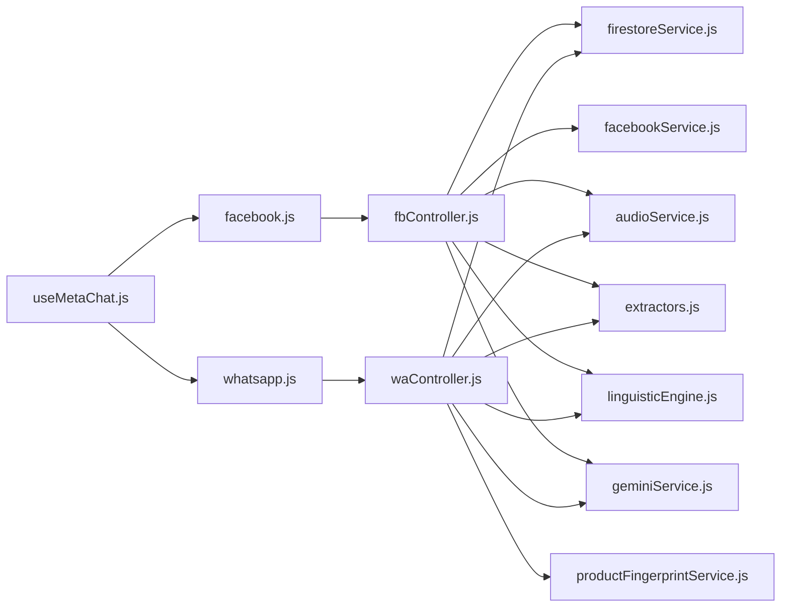

# Multi-Platform Integration

<cite>
**Referenced Files in This Document**
- [fbController.js](file://server/controllers/fbController.js)
- [waController.js](file://server/controllers/waController.js)
- [facebookService.js](file://server/services/facebookService.js)
- [facebook route](file://server/routes/facebook.js)
- [whatsapp route](file://server/routes/whatsapp.js)
- [firestoreService.js](file://server/services/firestoreService.js)
- [extractors.js](file://server/utils/extractors.js)
- [audioService.js](file://server/services/audioService.js)
- [useMetaChat.js](file://client/src/hooks/useMetaChat.js)
- [geminiService.js](file://server/services/geminiService.js)
- [linguisticEngine.js](file://server/utils/linguisticEngine.js)
- [productFingerprintService.js](file://server/services/productFingerprintService.js)
- [aiController.js](file://server/controllers/aiController.js)
- [settingsController.js](file://server/controllers/settingsController.js)
</cite>

## Table of Contents
1. [Introduction](#introduction)
2. [Project Structure](#project-structure)
3. [Core Components](#core-components)
4. [Architecture Overview](#architecture-overview)
5. [Detailed Component Analysis](#detailed-component-analysis)
6. [Dependency Analysis](#dependency-analysis)
7. [Performance Considerations](#performance-considerations)
8. [Troubleshooting Guide](#troubleshooting-guide)
9. [Conclusion](#conclusion)
10. [Appendices](#appendices)

## Introduction
This document explains the multi-platform integration for Facebook Messenger, Instagram, and WhatsApp Business API within the system. It covers webhook configuration, message routing, media handling, cross-platform synchronization, deterministic flows for WhatsApp, voice transcription, comment moderation for Instagram, a unified messaging interface, shared data models, authentication flows, permissions, platform-specific limitations, and guidance for adding new platform integrations while maintaining consistency across Meta ecosystem APIs.

## Project Structure
The integration spans backend controllers, routes, services, and utilities, plus a React client hook that interacts with the backend to send messages and manage conversations.

**Diagram sources**
- [facebook route:1-42](file://server/routes/facebook.js#L1-L42)
- [whatsapp route:1-15](file://server/routes/whatsapp.js#L1-L15)
- [fbController.js:1-800](file://server/controllers/fbController.js#L1-L800)
- [waController.js:1-680](file://server/controllers/waController.js#L1-L680)
- [firestoreService.js:1-126](file://server/services/firestoreService.js#L1-L126)
- [facebookService.js:1-287](file://server/services/facebookService.js#L1-L287)
- [audioService.js:1-53](file://server/services/audioService.js#L1-L53)
- [extractors.js:1-154](file://server/utils/extractors.js#L1-L154)
- [linguisticEngine.js:1-144](file://server/utils/linguisticEngine.js#L1-L144)
- [geminiService.js:1-35](file://server/services/geminiService.js#L1-L35)
- [productFingerprintService.js:1-88](file://server/services/productFingerprintService.js#L1-L88)

**Section sources**
- [facebook route:1-42](file://server/routes/facebook.js#L1-L42)
- [whatsapp route:1-15](file://server/routes/whatsapp.js#L1-L15)
- [fbController.js:1-800](file://server/controllers/fbController.js#L1-L800)
- [waController.js:1-680](file://server/controllers/waController.js#L1-L680)
- [firestoreService.js:1-126](file://server/services/firestoreService.js#L1-L126)

## Core Components
- Facebook/Instagram Webhook Controller: Handles verification and inbound events, deduplicates, idempotency, and routes messages/comments to processing logic.
- WhatsApp Webhook Controller: Handles verification, inbound messages, media, voice transcription, deterministic flows, and replies.
- Facebook API Service: Encapsulates Graph API calls for comments, likes, posts, templates, and media sending.
- Firestore Service: Centralized brand lookup by platform ID, caching, and shared database operations.
- Utilities: Extractors for phone/address/intents, linguistic engine for phonetic normalization and variations, audio transcription via Gemini, product fingerprinting for image matching.
- Client Hook: Manages conversation lists, message threads, optimistic UI updates, and sending messages to either platform.

**Section sources**
- [fbController.js:154-323](file://server/controllers/fbController.js#L154-L323)
- [waController.js:10-75](file://server/controllers/waController.js#L10-L75)
- [facebookService.js:1-287](file://server/services/facebookService.js#L1-L287)
- [firestoreService.js:56-114](file://server/services/firestoreService.js#L56-L114)
- [extractors.js:26-107](file://server/utils/extractors.js#L26-L107)
- [linguisticEngine.js:22-141](file://server/utils/linguisticEngine.js#L22-L141)
- [audioService.js:11-50](file://server/services/audioService.js#L11-L50)
- [useMetaChat.js:16-245](file://client/src/hooks/useMetaChat.js#L16-L245)

## Architecture Overview
The system receives webhooks from Meta’s platforms, authenticates and validates signatures, identifies brands via Firestore, and executes deterministic or AI-driven responses. Responses are sent back via Meta Graph API or stored locally for cross-platform visibility.

**Diagram sources**
- [facebook route:7-12](file://server/routes/facebook.js#L7-L12)
- [fbController.js:154-323](file://server/controllers/fbController.js#L154-L323)
- [firestoreService.js:56-114](file://server/services/firestoreService.js#L56-L114)
- [facebookService.js:17-52](file://server/services/facebookService.js#L17-L52)
- [waController.js:27-75](file://server/controllers/waController.js#L27-L75)
- [audioService.js:11-50](file://server/services/audioService.js#L11-L50)
- [useMetaChat.js:117-201](file://client/src/hooks/useMetaChat.js#L117-L201)

## Detailed Component Analysis

### Facebook/Instagram Webhook Integration
- Verification: Uses hub mode/token challenge flow with a global verify token.
- Security: Validates HMAC signature using APP_SECRET and logs mismatches.
- Routing: Identifies brand by platform ID (Facebook or Instagram), falls back to a developer-owned brand if needed.
- Idempotency: Prevents duplicate processing using Firestore documents keyed by event IDs.
- Message Types:
  - Text messages: routed to processing with timeouts and persistence.
  - Postbacks: handled via dedicated handler.
  - Comments: feed changes for comments trigger moderation and reply logic.
- Comment Moderation:
  - Spam filtering, auto-like, lead capture, human handoff, and AI fallback.
  - Duplicate prevention across in-memory and Firestore checks.
  - Optional human delay and button template follow-ups.

**Diagram sources**
- [facebook route:7-12](file://server/routes/facebook.js#L7-L12)
- [fbController.js:176-323](file://server/controllers/fbController.js#L176-L323)
- [firestoreService.js:56-114](file://server/services/firestoreService.js#L56-L114)
- [facebookService.js:54-139](file://server/services/facebookService.js#L54-L139)

**Section sources**
- [fbController.js:154-323](file://server/controllers/fbController.js#L154-L323)
- [facebook route:7-12](file://server/routes/facebook.js#L7-L12)
- [facebookService.js:54-139](file://server/services/facebookService.js#L54-L139)
- [firestoreService.js:56-114](file://server/services/firestoreService.js#L56-L114)

### WhatsApp Business API Integration
- Verification: Uses hub mode/token challenge with WA_VERIFY_TOKEN.
- Security: Validates HMAC signature using WA_APP_SECRET or APP_SECRET.
- Message Processing:
  - Text, image, voice/audio handling.
  - Image: fetches media URL and optionally triggers vision/product matching.
  - Voice: downloads media, transcribes via Gemini, then continues text flow.
  - Deterministic flow: greeting → collect phone → collect address → confirmation loop.
- Replies: Sends text messages via Graph API, marks read on reply, maintains conversation history and unread flags.
- Cross-platform linking: Links conversations by phone number across platforms.

**Diagram sources**
- [waController.js:27-167](file://server/controllers/waController.js#L27-L167)
- [audioService.js:11-50](file://server/services/audioService.js#L11-L50)
- [productFingerprintService.js:57-82](file://server/services/productFingerprintService.js#L57-L82)

**Section sources**
- [waController.js:10-75](file://server/controllers/waController.js#L10-L75)
- [waController.js:77-167](file://server/controllers/waController.js#L77-L167)
- [waController.js:462-541](file://server/controllers/waController.js#L462-L541)
- [audioService.js:11-50](file://server/services/audioService.js#L11-L50)
- [productFingerprintService.js:57-82](file://server/services/productFingerprintService.js#L57-L82)

### Unified Messaging Interface and Cross-Platform Synchronization
- Client hook manages conversation lists and message threads, supports optimistic updates, and sends messages to either Facebook or WhatsApp endpoints depending on platform.
- Backend stores conversation metadata and message history under a unified schema, enabling cross-platform visibility and linking.

**Diagram sources**
- [useMetaChat.js:117-201](file://client/src/hooks/useMetaChat.js#L117-L201)
- [facebook route:10-10](file://server/routes/facebook.js#L10-L10)
- [whatsapp route:12-12](file://server/routes/whatsapp.js#L12-L12)
- [fbController.js:1-800](file://server/controllers/fbController.js#L1-L800)
- [waController.js:543-603](file://server/controllers/waController.js#L543-L603)

**Section sources**
- [useMetaChat.js:16-245](file://client/src/hooks/useMetaChat.js#L16-L245)
- [facebook route:10-10](file://server/routes/facebook.js#L10-L10)
- [whatsapp route:12-12](file://server/routes/whatsapp.js#L12-L12)
- [fbController.js:1-800](file://server/controllers/fbController.js#L1-L800)
- [waController.js:543-603](file://server/controllers/waController.js#L543-L603)

### Authentication Flows and Permissions
- Facebook/Instagram:
  - Access tokens are validated and used for Graph API calls; errors are classified and logged for dashboard visibility.
  - Token expiration triggers brand health updates.
- WhatsApp:
  - Uses brand-specific WA access tokens and phone IDs; missing tokens prevent sending.
- Environment secrets:
  - APP_SECRET, VERIFY_TOKEN, WA_VERIFY_TOKEN, WA_APP_SECRET, PAGE_ACCESS_TOKEN, GOOGLE_AI_KEY, etc., are required for secure operation.

**Section sources**
- [facebookService.js:33-51](file://server/services/facebookService.js#L33-L51)
- [fbController.js:122-152](file://server/controllers/fbController.js#L122-L152)
- [waController.js:310-396](file://server/controllers/waController.js#L310-L396)
- [firestoreService.js:56-114](file://server/services/firestoreService.js#L56-L114)

### Platform-Specific Features and Limitations
- Facebook/Instagram:
  - Comment moderation (hide, like), private replies, button templates, media sending, and feed-based comment triggers.
  - Limitations: Some private replies may be restricted by platform policies.
- WhatsApp:
  - Deterministic flow for orders, voice transcription via Gemini, product matching via image hashing, and media handling.
  - Limitations: Read receipts applied only on replies; some media templates may vary by platform.

**Section sources**
- [facebookService.js:54-139](file://server/services/facebookService.js#L54-L139)
- [facebookService.js:213-268](file://server/services/facebookService.js#L213-L268)
- [waController.js:462-541](file://server/controllers/waController.js#L462-L541)
- [audioService.js:11-50](file://server/services/audioService.js#L11-L50)
- [productFingerprintService.js:57-82](file://server/services/productFingerprintService.js#L57-L82)

### Shared Data Models and Workflows
- Brands: Identified by platform IDs and tokens; cached for performance.
- Conversations: Unified schema with platform, unread flags, timestamps, and linked conversations.
- Message Threads: Per-conversation subcollections with sent/received types and timestamps.
- Knowledge Base and Drafts: Fuzzy matching with phonetic normalization and linguistic variations.

**Section sources**
- [firestoreService.js:56-114](file://server/services/firestoreService.js#L56-L114)
- [fbController.js:661-800](file://server/controllers/fbController.js#L661-L800)
- [waController.js:170-254](file://server/controllers/waController.js#L170-L254)
- [linguisticEngine.js:22-141](file://server/utils/linguisticEngine.js#L22-L141)

## Dependency Analysis

**Diagram sources**
- [fbController.js:1-800](file://server/controllers/fbController.js#L1-L800)
- [waController.js:1-680](file://server/controllers/waController.js#L1-L680)
- [facebook route:1-42](file://server/routes/facebook.js#L1-L42)
- [whatsapp route:1-15](file://server/routes/whatsapp.js#L1-L15)
- [firestoreService.js:1-126](file://server/services/firestoreService.js#L1-L126)
- [facebookService.js:1-287](file://server/services/facebookService.js#L1-L287)
- [audioService.js:1-53](file://server/services/audioService.js#L1-L53)
- [extractors.js:1-154](file://server/utils/extractors.js#L1-L154)
- [linguisticEngine.js:1-144](file://server/utils/linguisticEngine.js#L1-L144)
- [geminiService.js:1-35](file://server/services/geminiService.js#L1-L35)
- [productFingerprintService.js:1-88](file://server/services/productFingerprintService.js#L1-L88)
- [useMetaChat.js:1-245](file://client/src/hooks/useMetaChat.js#L1-L245)

**Section sources**
- [fbController.js:1-800](file://server/controllers/fbController.js#L1-L800)
- [waController.js:1-680](file://server/controllers/waController.js#L1-L680)
- [facebook route:1-42](file://server/routes/facebook.js#L1-L42)
- [whatsapp route:1-15](file://server/routes/whatsapp.js#L1-L15)
- [useMetaChat.js:1-245](file://client/src/hooks/useMetaChat.js#L1-L245)

## Performance Considerations
- Idempotency and duplicate prevention reduce redundant processing and API calls.
- Timeouts and retries mitigate transient errors and rate limits.
- Caching brand lookups improves response latency.
- Asynchronous tasks and Promise.allSettled ensure throughput during webhook bursts.
- Client-side optimistic updates improve perceived responsiveness.

[No sources needed since this section provides general guidance]

## Troubleshooting Guide
- Webhook verification failures: Check verify tokens and environment variables.
- Signature mismatches: Verify APP_SECRET/WA_APP_SECRET and raw body usage.
- Token errors: Monitor brand token status and handle expired tokens by updating brand health.
- Rate limits: Implement backoff and retry logic around API calls.
- Missing media URLs: Ensure access tokens and media IDs are valid.
- Client sync issues: Composite index errors on Firestore orderBy can be mitigated by client-side sorting.

**Section sources**
- [fbController.js:154-173](file://server/controllers/fbController.js#L154-L173)
- [waController.js:11-25](file://server/controllers/waController.js#L11-L25)
- [fbController.js:55-71](file://server/controllers/fbController.js#L55-L71)
- [fbController.js:122-152](file://server/controllers/fbController.js#L122-L152)
- [useMetaChat.js:82-100](file://client/src/hooks/useMetaChat.js#L82-L100)

## Conclusion
The system integrates Facebook Messenger, Instagram, and WhatsApp Business API through secure, idempotent webhooks, deterministic flows for WhatsApp, and AI-assisted moderation/comment handling for Instagram. A unified messaging interface and shared data models enable cross-platform synchronization, while robust error handling, retries, and caching ensure reliability. The modular design facilitates adding new platforms with consistent authentication, routing, and response patterns.

[No sources needed since this section summarizes without analyzing specific files]

## Appendices

### Implementation Checklist for New Platform Integrations
- Define webhook verification and event handling routes.
- Implement signature validation using platform-specific secrets.
- Add brand lookup by platform identifier and caching.
- Implement idempotency checks for inbound events.
- Integrate outbound messaging via platform Graph API.
- Add media handling and transcription where applicable.
- Extend unified conversation/message models.
- Add client-side support for sending and viewing messages.
- Document environment variables and permissions.

[No sources needed since this section provides general guidance]