# WhatsApp Business API

<cite>
**Referenced Files in This Document**
- [server/controllers/waController.js](file://server/controllers/waController.js)
- [server/routes/whatsapp.js](file://server/routes/whatsapp.js)
- [server/services/audioService.js](file://server/services/audioService.js)
- [server/services/automationService.js](file://server/services/automationService.js)
- [server/utils/extractors.js](file://server/utils/extractors.js)
- [server/utils/linguisticEngine.js](file://server/utils/linguisticEngine.js)
- [server/services/facebookService.js](file://server/services/facebookService.js)
- [server/controllers/fbController.js](file://server/controllers/fbController.js)
- [client/src/hooks/useMetaChat.js](file://client/src/hooks/useMetaChat.js)
- [client/src/components/Inbox/ChatWindow.jsx](file://client/src/components/Inbox/ChatWindow.jsx)
- [package.json](file://package.json)
</cite>

## Table of Contents
1. [Introduction](#introduction)
2. [Project Structure](#project-structure)
3. [Core Components](#core-components)
4. [Architecture Overview](#architecture-overview)
5. [Detailed Component Analysis](#detailed-component-analysis)
6. [Dependency Analysis](#dependency-analysis)
7. [Performance Considerations](#performance-considerations)
8. [Troubleshooting Guide](#troubleshooting-guide)
9. [Conclusion](#conclusion)
10. [Appendices](#appendices)

## Introduction
This document explains the WhatsApp Business API implementation within the monorepo, focusing on voice message processing, deterministic flow automation, cross-platform linking, WhatsApp Cloud API integration, message delivery receipts, template-based messaging, media handling, interactive message templates, and compliance with WhatsApp’s Terms of Service. It also provides implementation guidance for flow builders, message queuing, and real-time status updates.

## Project Structure
The repository is organized into:
- Server-side controllers, routes, services, utilities, and scripts for WhatsApp and Facebook integrations
- Client-side React hooks and UI components for the inbox and chat experience
- Build and runtime dependencies managed via package.json

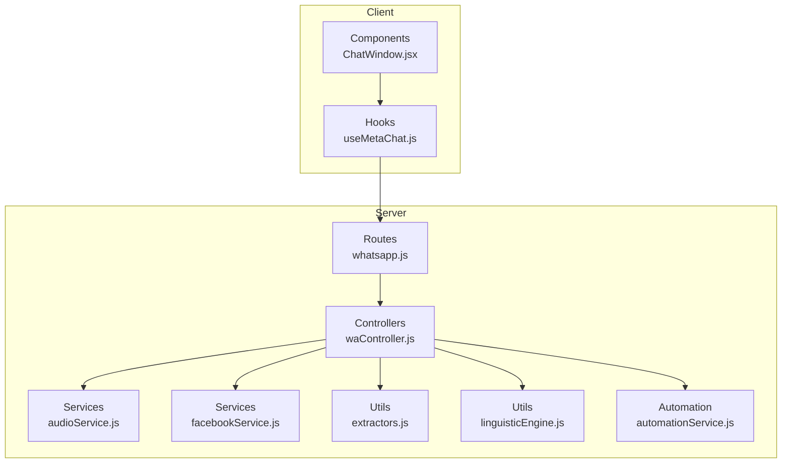

**Diagram sources**
- [server/routes/whatsapp.js:1-15](file://server/routes/whatsapp.js#L1-L15)
- [server/controllers/waController.js:1-680](file://server/controllers/waController.js#L1-L680)
- [server/services/audioService.js:1-53](file://server/services/audioService.js#L1-L53)
- [server/services/facebookService.js:1-287](file://server/services/facebookService.js#L1-L287)
- [server/utils/extractors.js:1-154](file://server/utils/extractors.js#L1-L154)
- [server/utils/linguisticEngine.js:1-144](file://server/utils/linguisticEngine.js#L1-L144)
- [server/services/automationService.js:1-57](file://server/services/automationService.js#L1-L57)
- [client/src/hooks/useMetaChat.js:1-245](file://client/src/hooks/useMetaChat.js#L1-L245)
- [client/src/components/Inbox/ChatWindow.jsx:1-478](file://client/src/components/Inbox/ChatWindow.jsx#L1-L478)

**Section sources**
- [server/routes/whatsapp.js:1-15](file://server/routes/whatsapp.js#L1-L15)
- [package.json:1-40](file://package.json#L1-L40)

## Core Components
- WhatsApp Webhook Controller: Verifies and processes inbound events, routes to deterministic flows, vision, and AI fallbacks, and sends outbound messages with read receipts.
- Audio Transcription Service: Uses Gemini multimodal model to transcribe voice messages into Bangla text.
- Deterministic Flow Automation: State machine for greeting → phone → address → confirmation with cross-platform linking.
- Cross-Platform Linking: Links conversations sharing the same phone number across platforms.
- Media Handling: Downloads media URLs from Meta, supports image and audio, integrates OCR and phash matching.
- Interactive Templates: Supports button and carousel templates via Facebook Graph API.
- Client Chat Hooks: Real-time listeners, optimistic updates, and message sending to WhatsApp or Facebook endpoints.

**Section sources**
- [server/controllers/waController.js:11-75](file://server/controllers/waController.js#L11-L75)
- [server/controllers/waController.js:77-167](file://server/controllers/waController.js#L77-L167)
- [server/controllers/waController.js:310-396](file://server/controllers/waController.js#L310-L396)
- [server/controllers/waController.js:462-541](file://server/controllers/waController.js#L462-L541)
- [server/controllers/waController.js:431-457](file://server/controllers/waController.js#L431-L457)
- [server/services/audioService.js:11-50](file://server/services/audioService.js#L11-L50)
- [server/services/facebookService.js:157-183](file://server/services/facebookService.js#L157-L183)
- [server/services/facebookService.js:213-233](file://server/services/facebookService.js#L213-L233)
- [client/src/hooks/useMetaChat.js:16-101](file://client/src/hooks/useMetaChat.js#L16-L101)
- [client/src/hooks/useMetaChat.js:117-201](file://client/src/hooks/useMetaChat.js#L117-L201)

## Architecture Overview
High-level flow:
- Client sends messages via the dashboard; hook posts to server route
- Server controller parses event, logs conversation, and triggers deterministic flow or AI
- Voice messages are transcribed using Gemini; images are processed via phash or OCR
- Outbound messages are sent via Graph API with read receipts and conversation history logging

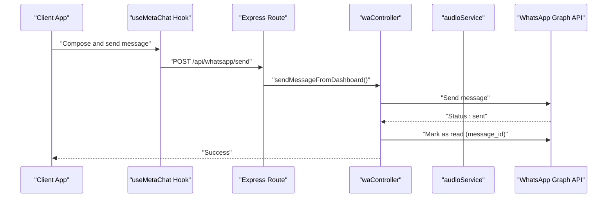

**Diagram sources**
- [client/src/hooks/useMetaChat.js:186-189](file://client/src/hooks/useMetaChat.js#L186-L189)
- [server/routes/whatsapp.js:12-12](file://server/routes/whatsapp.js#L12-L12)
- [server/controllers/waController.js:543-603](file://server/controllers/waController.js#L543-L603)
- [server/controllers/waController.js:310-396](file://server/controllers/waController.js#L310-L396)

## Detailed Component Analysis

### WhatsApp Webhook Controller
Responsibilities:
- Webhook verification and signature validation
- Inbound message routing by type (text, image, voice/audio)
- Deterministic flow automation with state transitions
- Vision and OCR fallbacks for images
- AI fallback using Gemini
- Outbound message sending with read receipts and conversation history logging

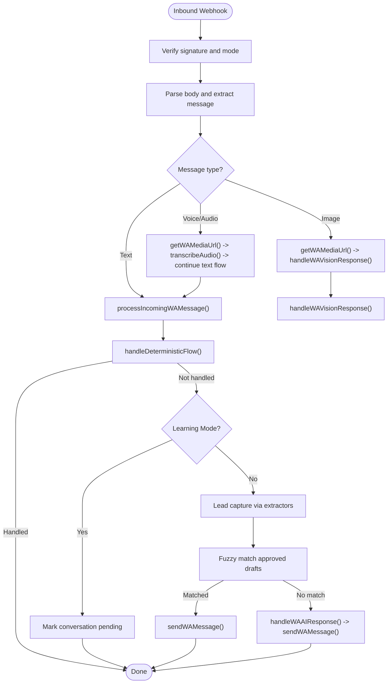

**Diagram sources**
- [server/controllers/waController.js:28-75](file://server/controllers/waController.js#L28-L75)
- [server/controllers/waController.js:77-167](file://server/controllers/waController.js#L77-L167)
- [server/controllers/waController.js:462-541](file://server/controllers/waController.js#L462-L541)
- [server/controllers/waController.js:167-308](file://server/controllers/waController.js#L167-L308)
- [server/controllers/waController.js:608-660](file://server/controllers/waController.js#L608-L660)
- [server/controllers/waController.js:662-673](file://server/controllers/waController.js#L662-L673)

**Section sources**
- [server/controllers/waController.js:11-75](file://server/controllers/waController.js#L11-L75)
- [server/controllers/waController.js:77-167](file://server/controllers/waController.js#L77-L167)
- [server/controllers/waController.js:310-396](file://server/controllers/waController.js#L310-L396)
- [server/controllers/waController.js:462-541](file://server/controllers/waController.js#L462-L541)
- [server/controllers/waController.js:608-660](file://server/controllers/waController.js#L608-L660)
- [server/controllers/waController.js:662-673](file://server/controllers/waController.js#L662-L673)

### Voice Message Transcription Workflow
- Downloads audio via Media API using brand token
- Streams audio to Gemini 1.5 Flash multimodal model
- Returns Bangla transcription for downstream text processing

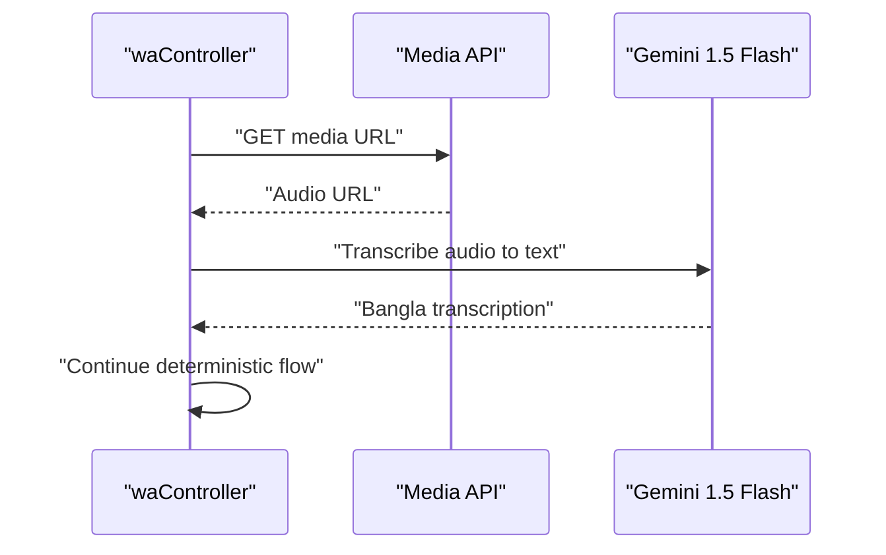

**Diagram sources**
- [server/controllers/waController.js:90-102](file://server/controllers/waController.js#L90-L102)
- [server/services/audioService.js:11-50](file://server/services/audioService.js#L11-L50)

**Section sources**
- [server/controllers/waController.js:90-102](file://server/controllers/waController.js#L90-L102)
- [server/services/audioService.js:11-50](file://server/services/audioService.js#L11-L50)

### Deterministic Flow Automation
State machine:
- IDLE → AWAITING_PHONE (based on intent detection)
- AWAITING_PHONE → AWAITING_ADDRESS (validated phone)
- AWAITING_ADDRESS → AWAITING_CONFIRMATION (address validated)
- AWAITING_CONFIRMATION → IDLE (confirmation accepted or corrected)

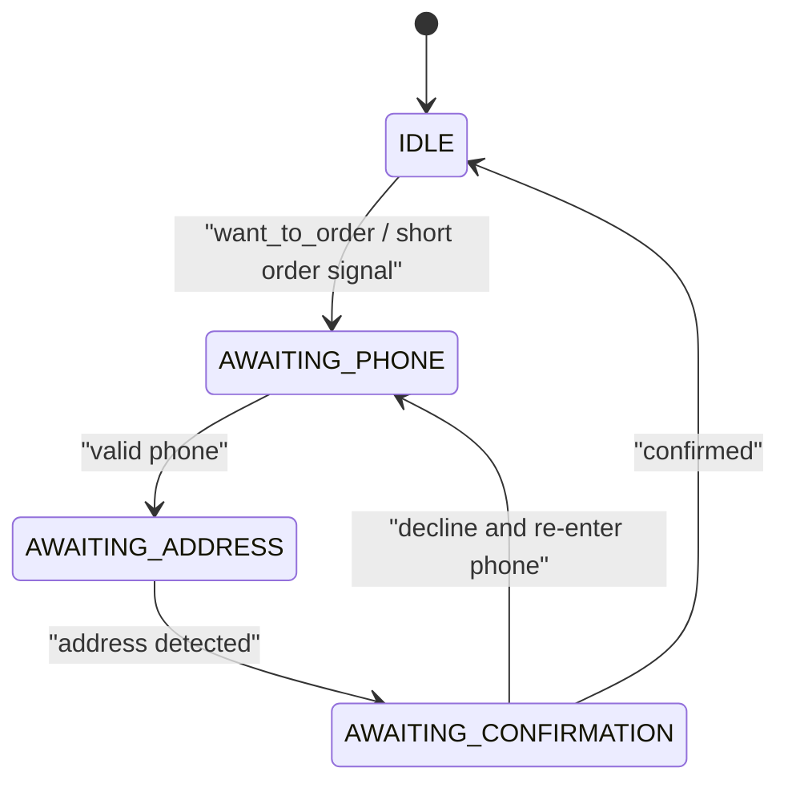

**Diagram sources**
- [server/controllers/waController.js:462-541](file://server/controllers/waController.js#L462-L541)
- [server/utils/extractors.js:82-107](file://server/utils/extractors.js#L82-L107)

**Section sources**
- [server/controllers/waController.js:462-541](file://server/controllers/waController.js#L462-L541)
- [server/utils/extractors.js:82-107](file://server/utils/extractors.js#L82-L107)

### Session Management and Conversation Logging
- Incoming messages logged to Firestore conversations and per-conversation messages subcollection
- Outgoing messages update unread flags, append to history, and log bot activity
- Optional expert capture: agent-sent replies paired with prior user messages captured as drafts

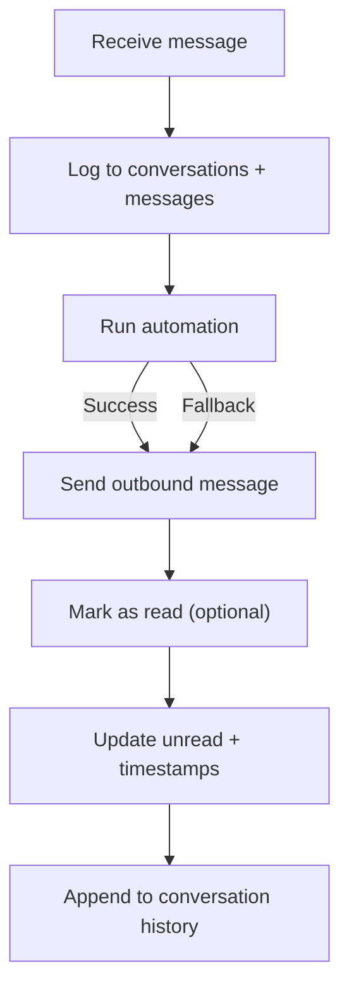

**Diagram sources**
- [server/controllers/waController.js:398-426](file://server/controllers/waController.js#L398-L426)
- [server/controllers/waController.js:310-396](file://server/controllers/waController.js#L310-L396)

**Section sources**
- [server/controllers/waController.js:398-426](file://server/controllers/waController.js#L398-L426)
- [server/controllers/waController.js:310-396](file://server/controllers/waController.js#L310-L396)

### Cross-Platform Linking
- On phone capture, search for other conversations with the same phone number under the same brand
- Mutually link conversation IDs to support unified threading across platforms

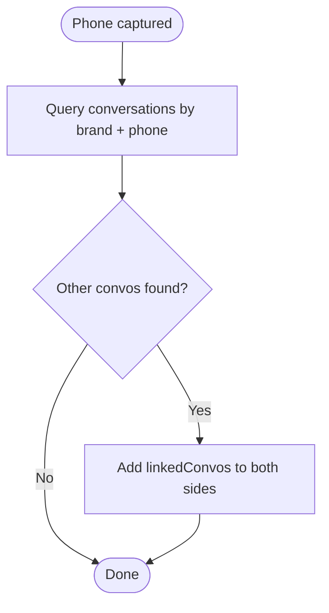

**Diagram sources**
- [server/controllers/waController.js:431-457](file://server/controllers/waController.js#L431-L457)

**Section sources**
- [server/controllers/waController.js:431-457](file://server/controllers/waController.js#L431-L457)

### Media Handling and Vision
- Image media URL retrieval via Media API
- Zero-token product matching via perceptual hashing
- OCR fallback using Tesseract for Bengali and English text
- Vision handler respects learning mode and prioritizes human review when enabled

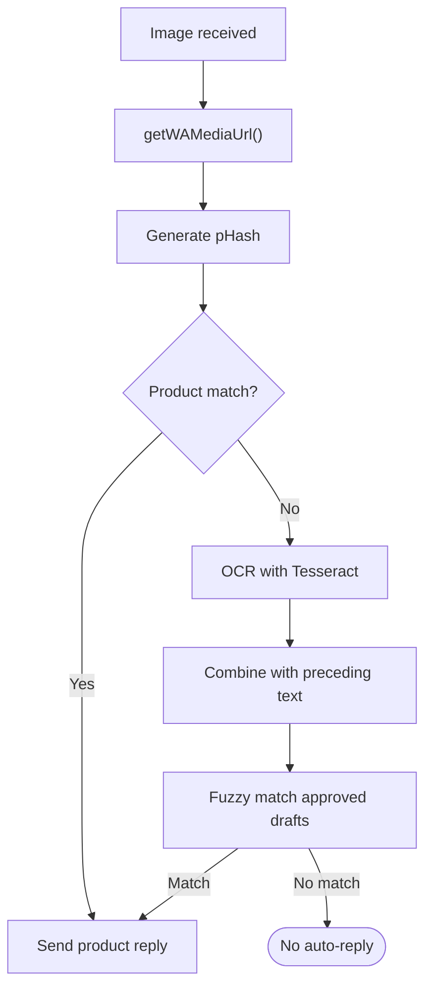

**Diagram sources**
- [server/controllers/waController.js:608-660](file://server/controllers/waController.js#L608-L660)
- [server/controllers/waController.js:662-673](file://server/controllers/waController.js#L662-L673)

**Section sources**
- [server/controllers/waController.js:608-660](file://server/controllers/waController.js#L608-L660)
- [server/controllers/waController.js:662-673](file://server/controllers/waController.js#L662-L673)

### Template-Based Messaging and Interactive Templates
- Button templates: Sends a button template via Facebook Graph API
- Carousel templates: Sends a generic template with multiple product elements
- Sequenced media: Sends multiple images in order with delays to respect rate limits

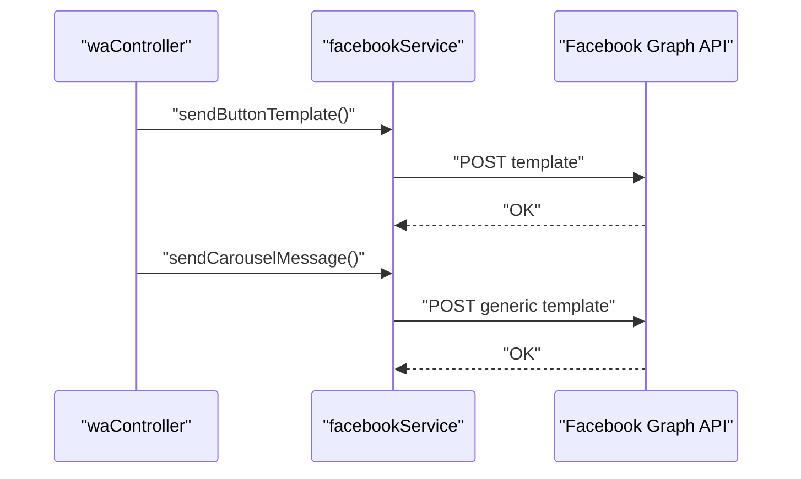

**Diagram sources**
- [server/controllers/waController.js:543-603](file://server/controllers/waController.js#L543-L603)
- [server/services/facebookService.js:157-183](file://server/services/facebookService.js#L157-L183)
- [server/services/facebookService.js:213-233](file://server/services/facebookService.js#L213-L233)

**Section sources**
- [server/services/facebookService.js:157-183](file://server/services/facebookService.js#L157-L183)
- [server/services/facebookService.js:213-233](file://server/services/facebookService.js#L213-L233)

### Client-Side Chat Experience and Real-Time Updates
- Real-time listeners for conversations and messages
- Optimistic UI updates for immediate feedback
- Message sending routes to appropriate platform endpoints
- Macro panel and keyboard shortcuts for productivity

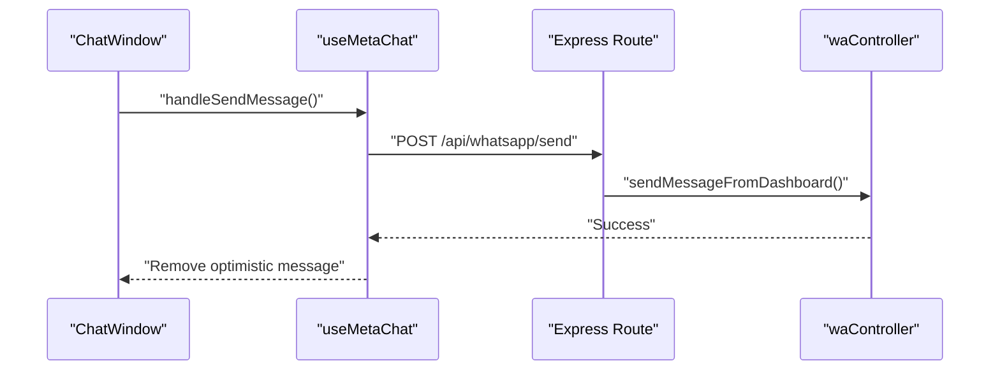

**Diagram sources**
- [client/src/components/Inbox/ChatWindow.jsx:444-463](file://client/src/components/Inbox/ChatWindow.jsx#L444-L463)
- [client/src/hooks/useMetaChat.js:117-201](file://client/src/hooks/useMetaChat.js#L117-L201)
- [server/routes/whatsapp.js:12-12](file://server/routes/whatsapp.js#L12-L12)
- [server/controllers/waController.js:543-603](file://server/controllers/waController.js#L543-L603)

**Section sources**
- [client/src/hooks/useMetaChat.js:16-101](file://client/src/hooks/useMetaChat.js#L16-L101)
- [client/src/hooks/useMetaChat.js:117-201](file://client/src/hooks/useMetaChat.js#L117-L201)
- [client/src/components/Inbox/ChatWindow.jsx:444-463](file://client/src/components/Inbox/ChatWindow.jsx#L444-L463)

## Dependency Analysis
External libraries and services:
- Express for routing
- Axios for HTTP requests to Graph APIs
- Fuse.js for fuzzy matching
- Tesseract.js for OCR
- Google Generative AI SDK for multimodal transcription
- Firebase/Firestore for persistence and real-time listeners

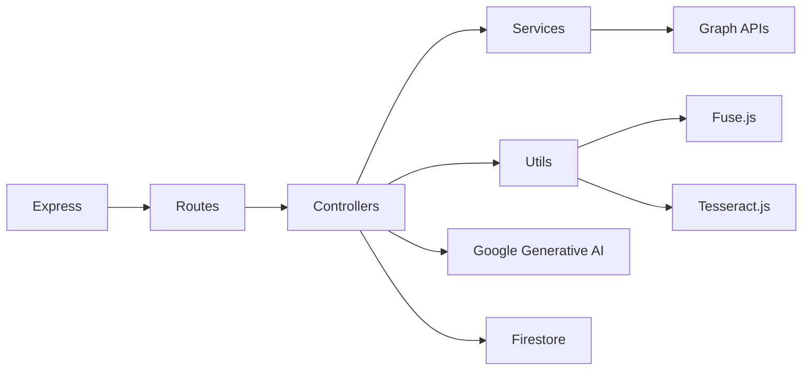

**Diagram sources**
- [package.json:14-31](file://package.json#L14-L31)
- [server/controllers/waController.js:1-10](file://server/controllers/waController.js#L1-L10)

**Section sources**
- [package.json:14-31](file://package.json#L14-L31)

## Performance Considerations
- Signature verification and idempotency checks reduce redundant processing
- Fuzzy matching with Fuse.js tuned thresholds balances accuracy and speed
- OCR and phash operations are guarded by learning mode and fallback logic
- Optimistic UI updates improve perceived latency while maintaining eventual consistency
- Rate-limit-aware sequencing for media delivery

[No sources needed since this section provides general guidance]

## Troubleshooting Guide
Common issues and remedies:
- Webhook signature mismatch: Verify APP_SECRET and rawBody HMAC calculation
- Missing tokens: Ensure brand tokens (WhatsApp access and page tokens) are configured
- Read receipt errors: Network or rate-limit errors are caught and logged
- AI transcription failures: Gemini API key must be present; verify quota and billing
- OCR failures: Tesseract initialization and network connectivity issues are handled gracefully

**Section sources**
- [server/controllers/waController.js:29-42](file://server/controllers/waController.js#L29-L42)
- [server/controllers/waController.js:328-338](file://server/controllers/waController.js#L328-L338)
- [server/services/audioService.js:13-17](file://server/services/audioService.js#L13-L17)
- [server/controllers/waController.js:654-659](file://server/controllers/waController.js#L654-L659)

## Conclusion
The implementation provides a robust, deterministic, and extensible WhatsApp Business API stack with strong integration points to Facebook’s unified platform. It supports voice transcription, media handling, interactive templates, cross-platform linking, and real-time client experiences while maintaining compliance with platform constraints through careful webhook handling and rate-limit awareness.

## Appendices

### Implementation Examples

- Flow Builders
  - Use approved drafts with keyword variations and phonetic normalization for deterministic matching
  - Integrate sentiment-aware tone injection for negative sentiment contexts
  - Leverage fuzzy matching with Fuse.js and linguistic variations for robust coverage

  **Section sources**
  - [server/controllers/waController.js:170-254](file://server/controllers/waController.js#L170-L254)
  - [server/utils/linguisticEngine.js:86-141](file://server/utils/linguisticEngine.js#L86-L141)

- Message Queuing and Real-Time Status Updates
  - Client-side optimistic updates with cleanup timers
  - Real-time listeners for conversations and messages with fallback ordering
  - Idempotency and retry mechanisms for platform API calls

  **Section sources**
  - [client/src/hooks/useMetaChat.js:125-143](file://client/src/hooks/useMetaChat.js#L125-L143)
  - [client/src/hooks/useMetaChat.js:16-101](file://client/src/hooks/useMetaChat.js#L16-L101)
  - [server/controllers/fbController.js:55-115](file://server/controllers/fbController.js#L55-L115)

- Compliance with WhatsApp Terms of Service
  - Respect rate limits and timeouts
  - Avoid spam and unauthorized bulk messaging
  - Honor opt-out and privacy expectations
  - Use templates for structured messages and buttons

  [No sources needed since this section provides general guidance]