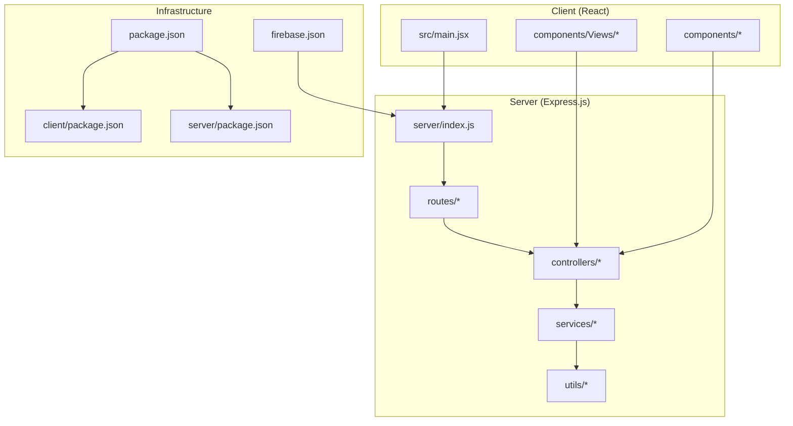
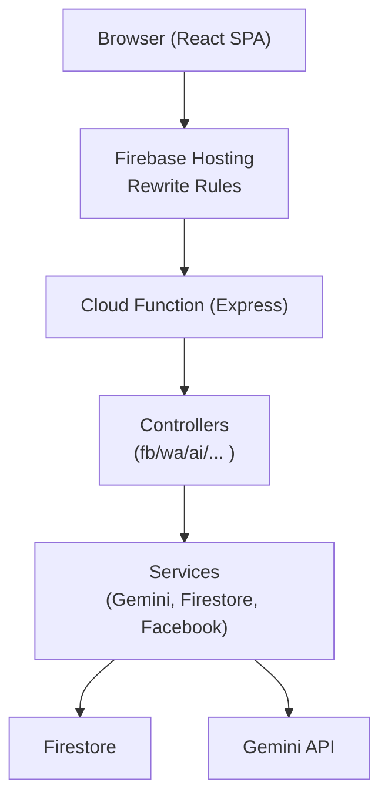
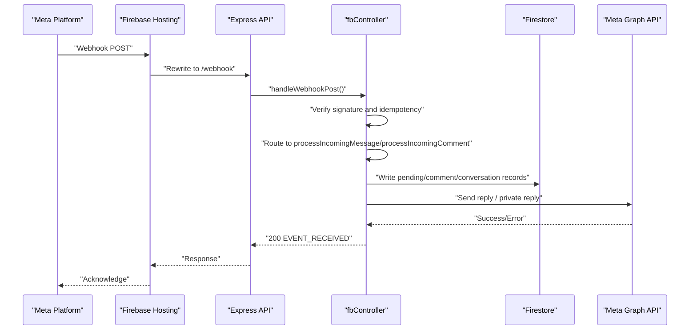
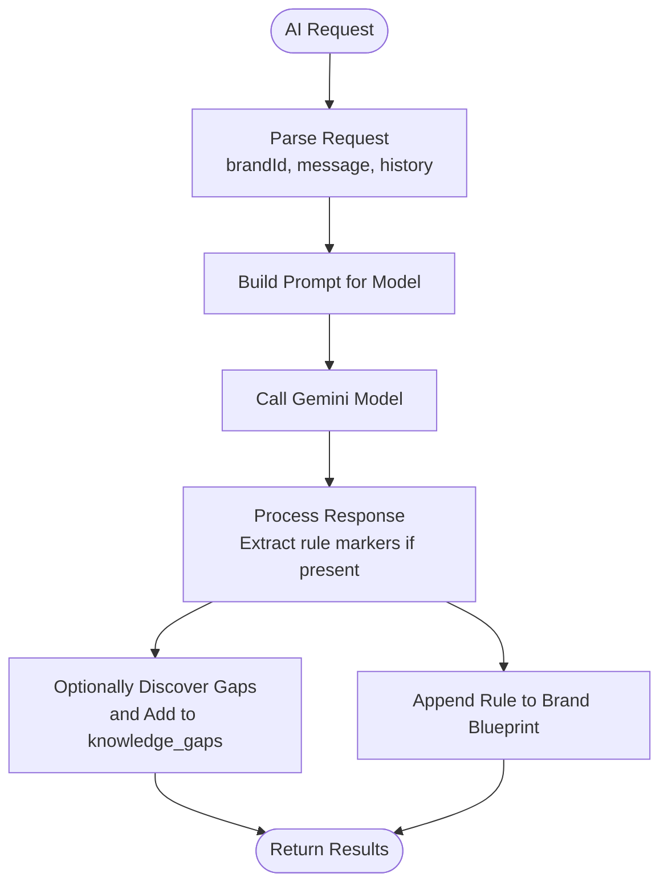
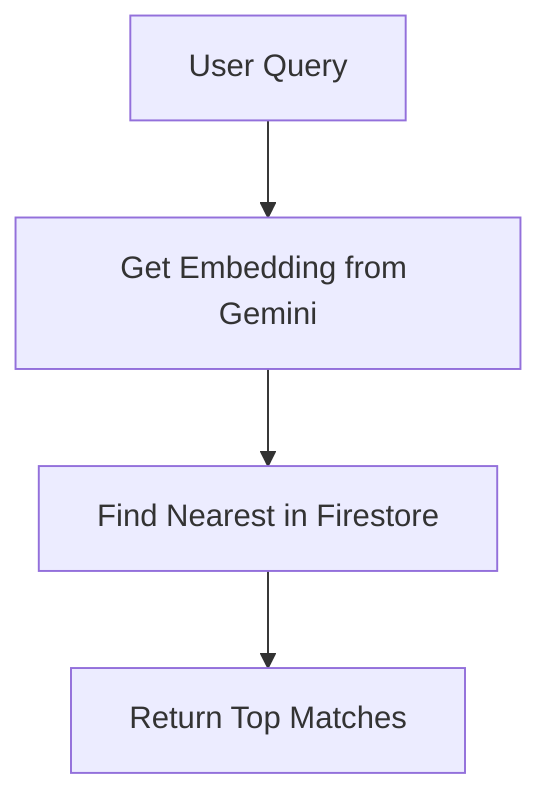
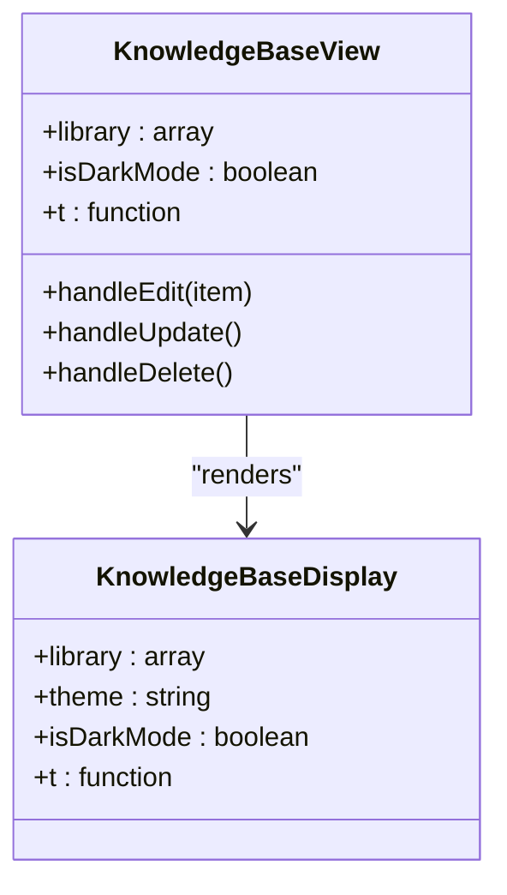
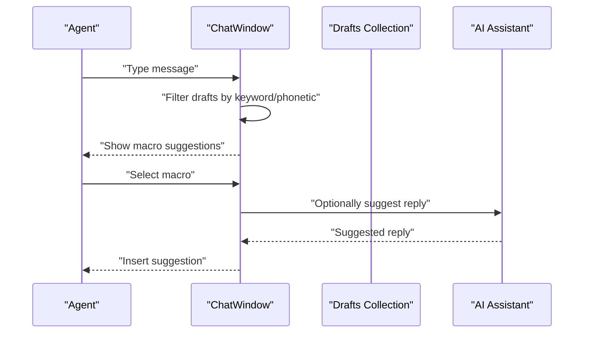
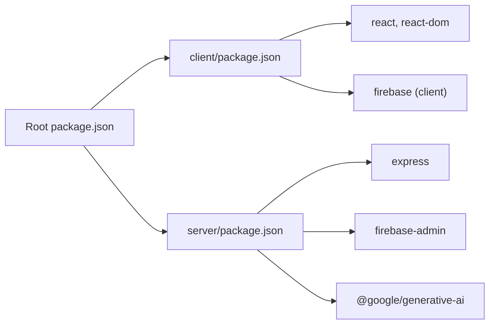

# Project Overview

<cite>
**Referenced Files in This Document**
- [PROJECT_SUMMARY.md](file://PROJECT_SUMMARY.md)
- [package.json](file://package.json)
- [client/package.json](file://client/package.json)
- [server/package.json](file://server/package.json)
- [client/src/main.jsx](file://client/src/main.jsx)
- [server/index.js](file://server/index.js)
- [firebase.json](file://firebase.json)
- [server/controllers/aiController.js](file://server/controllers/aiController.js)
- [server/services/geminiService.js](file://server/services/geminiService.js)
- [server/services/embeddingService.js](file://server/services/embeddingService.js)
- [server/services/vectorSearchService.js](file://server/services/vectorSearchService.js)
- [client/src/components/KnowledgeBase.jsx](file://client/src/components/KnowledgeBase.jsx)
- [client/src/components/Views/KnowledgeBase.jsx](file://client/src/components/Views/KnowledgeBase.jsx)
- [client/src/components/Inbox/ChatWindow.jsx](file://client/src/components/Inbox/ChatWindow.jsx)
- [server/controllers/fbController.js](file://server/controllers/fbController.js)
</cite>

## Table of Contents
1. [Introduction](#introduction)
2. [Project Structure](#project-structure)
3. [Core Components](#core-components)
4. [Architecture Overview](#architecture-overview)
5. [Detailed Component Analysis](#detailed-component-analysis)
6. [Dependency Analysis](#dependency-analysis)
7. [Performance Considerations](#performance-considerations)
8. [Troubleshooting Guide](#troubleshooting-guide)
9. [Conclusion](#conclusion)

## Introduction
Meta Business Solution is a multi-platform social media automation and customer engagement platform designed for Facebook, Instagram, and WhatsApp ecosystems. It enables brands to automate customer conversations, manage knowledge bases, and gain actionable business intelligence insights. The platform integrates a modern React frontend with an Express.js backend, Firebase for hosting and cloud functions, and AI-powered services powered by Gemini to deliver intelligent replies, semantic search, and learning capabilities.

Core value proposition:
- Automate customer conversations across Facebook Messenger, Instagram comments, and WhatsApp with AI-driven responses and curated reply templates.
- Maintain a centralized knowledge base and dynamic reply drafts to ensure consistent, scalable customer support.
- Deliver business intelligence insights and operational health monitoring for marketing and customer success teams.

Target audience:
- E-commerce and retail brands operating across Meta platforms.
- Customer success and marketing teams seeking automation and insights.
- Super admins and brand managers who configure automation rules and monitor system health.

Key differentiators:
- Unified inbox and comment automation with robust duplicate prevention and retry logic.
- AI-driven linguistic variations and rule learning for natural, localized responses.
- Semantic vector search for contextual knowledge retrieval and intelligent reply suggestions.
- Operational health checks for tokens, webhooks, and automation activation status.

## Project Structure
The repository follows a monorepo layout with separate client and server packages, plus Firebase configuration for hosting and cloud functions.

**Diagram sources**
- [client/src/main.jsx:1-12](file://client/src/main.jsx#L1-L12)
- [server/index.js:1-203](file://server/index.js#L1-L203)
- [firebase.json:1-37](file://firebase.json#L1-L37)
- [package.json:1-40](file://package.json#L1-L40)
- [client/package.json:1-39](file://client/package.json#L1-L39)
- [server/package.json:1-26](file://server/package.json#L1-L26)

**Section sources**
- [PROJECT_SUMMARY.md:5-18](file://PROJECT_SUMMARY.md#L5-L18)
- [client/src/main.jsx:1-12](file://client/src/main.jsx#L1-L12)
- [server/index.js:25-35](file://server/index.js#L25-L35)
- [firebase.json:14-36](file://firebase.json#L14-L36)
- [package.json:8-13](file://package.json#L8-L13)

## Core Components
- Frontend (React + Vite): Provides the dashboard UI, navigation, and interactive views for inbox, knowledge base, automation controls, and analytics.
- Backend (Express.js): Exposes modular APIs for Facebook and WhatsApp integrations, AI services, product and CRM operations, and health monitoring.
- Firebase: Hosts the React build and rewrites requests to cloud functions for API and webhook endpoints.
- AI Services: Gemini-powered generation of linguistic variations, training assistant, and semantic vector search for contextual knowledge.

Key capabilities:
- Inbox automation with webhook ingestion, duplicate prevention, and retry logic.
- Knowledge base management with CRUD operations and UI components.
- AI-assisted reply generation and rule learning for brand-specific behavior.
- Semantic search leveraging vector embeddings for intelligent suggestions.

**Section sources**
- [PROJECT_SUMMARY.md:20-46](file://PROJECT_SUMMARY.md#L20-L46)
- [server/index.js:175-181](file://server/index.js#L175-L181)
- [server/controllers/aiController.js:1-167](file://server/controllers/aiController.js#L1-L167)
- [server/services/vectorSearchService.js:1-62](file://server/services/vectorSearchService.js#L1-L62)

## Architecture Overview
The platform combines a React SPA with an Express API, hosted via Firebase. Requests are rewritten to cloud functions, enabling seamless scaling and deployment.

**Diagram sources**
- [firebase.json:21-34](file://firebase.json#L21-L34)
- [server/index.js:175-181](file://server/index.js#L175-L181)
- [server/controllers/aiController.js:1-167](file://server/controllers/aiController.js#L1-L167)
- [server/services/geminiService.js:1-35](file://server/services/geminiService.js#L1-L35)

## Detailed Component Analysis

### Inbox and Conversation Automation
The inbox system ingests webhooks from Facebook and Instagram, deduplicates events, and executes deterministic reply logic with optional AI fallback. It supports:
- Duplicate prevention via in-memory and Firestore checks.
- Retry logic for rate-limit and transient errors.
- Idempotency safeguards for event processing.
- Human handoff triggers and sentiment-aware responses.

**Diagram sources**
- [server/index.js:39-42](file://server/index.js#L39-L42)
- [server/controllers/fbController.js:176-323](file://server/controllers/fbController.js#L176-L323)
- [server/controllers/fbController.js:325-549](file://server/controllers/fbController.js#L325-L549)

**Section sources**
- [server/controllers/fbController.js:44-116](file://server/controllers/fbController.js#L44-L116)
- [server/controllers/fbController.js:176-323](file://server/controllers/fbController.js#L176-L323)
- [server/controllers/fbController.js:325-549](file://server/controllers/fbController.js#L325-L549)

### AI-Powered Knowledge Base and Replies
The AI controller orchestrates:
- Generation of linguistic variations for keywords.
- Discovery of knowledge gaps and creation of suggested questions.
- Training assistant for brand-specific behavior rules.
- Integration with vector search for semantic matching.

**Diagram sources**
- [server/controllers/aiController.js:106-159](file://server/controllers/aiController.js#L106-L159)
- [server/services/geminiService.js:8-29](file://server/services/geminiService.js#L8-L29)

**Section sources**
- [server/controllers/aiController.js:1-167](file://server/controllers/aiController.js#L1-L167)
- [server/services/geminiService.js:1-35](file://server/services/geminiService.js#L1-L35)

### Semantic Search and Embeddings
Vector search leverages Gemini embeddings to find semantically similar knowledge base entries and drafts for intelligent reply suggestions.

**Diagram sources**
- [server/services/embeddingService.js:10-21](file://server/services/embeddingService.js#L10-L21)
- [server/services/vectorSearchService.js:12-40](file://server/services/vectorSearchService.js#L12-L40)

**Section sources**
- [server/services/embeddingService.js:1-24](file://server/services/embeddingService.js#L1-L24)
- [server/services/vectorSearchService.js:1-62](file://server/services/vectorSearchService.js#L1-L62)

### Knowledge Base Management UI
The knowledge base components provide:
- Read-only presentation of approved knowledge entries.
- Editable management interface with keyword and answer updates.
- Deletion confirmation and modal interactions.

**Diagram sources**
- [client/src/components/Views/KnowledgeBase.jsx:1-163](file://client/src/components/Views/KnowledgeBase.jsx#L1-L163)
- [client/src/components/KnowledgeBase.jsx:1-50](file://client/src/components/KnowledgeBase.jsx#L1-L50)

**Section sources**
- [client/src/components/Views/KnowledgeBase.jsx:1-163](file://client/src/components/Views/KnowledgeBase.jsx#L1-L163)
- [client/src/components/KnowledgeBase.jsx:1-50](file://client/src/components/KnowledgeBase.jsx#L1-L50)

### Chat Window and Macro Suggestions
The chat window integrates:
- Canned response panel and macro suggestions with phonetic search.
- Rich product card rendering and attachment previews.
- Context menus and reply/edit/delete actions.

**Diagram sources**
- [client/src/components/Inbox/ChatWindow.jsx:1-478](file://client/src/components/Inbox/ChatWindow.jsx#L1-L478)

**Section sources**
- [client/src/components/Inbox/ChatWindow.jsx:1-478](file://client/src/components/Inbox/ChatWindow.jsx#L1-L478)

## Dependency Analysis
The project uses a layered dependency structure:
- Root package coordinates build and dev scripts across client and server.
- Client depends on React, Tailwind, and Firebase client SDKs.
- Server depends on Express, Firebase Admin, and Gemini SDKs.

**Diagram sources**
- [package.json:14-31](file://package.json#L14-L31)
- [client/package.json:12-21](file://client/package.json#L12-L21)
- [server/package.json:6-24](file://server/package.json#L6-L24)

**Section sources**
- [package.json:14-31](file://package.json#L14-L31)
- [client/package.json:12-21](file://client/package.json#L12-L21)
- [server/package.json:6-24](file://server/package.json#L6-L24)

## Performance Considerations
- Webhook processing includes retry and timeout safeguards to improve reliability under rate limits and transient failures.
- Idempotency checks prevent duplicate processing of events, reducing redundant API calls.
- Vector search requires a Firestore vector index; absence of the index gracefully falls back to empty results.
- Client-side macro filtering uses phonetic normalization to reduce search latency while improving match quality.

[No sources needed since this section provides general guidance]

## Troubleshooting Guide
Operational health endpoints help diagnose token validity and webhook subscriptions:
- Token health endpoint validates page access tokens and environment tokens.
- Webhook health endpoint checks subscription fields for feed and messages.
- Automation health endpoint reports activation status for comment and inbox automation, knowledge base presence, and draft replies.

Common issues and resolutions:
- Token expiration: The system flags expired tokens and updates brand status for visibility.
- Webhook verification failures: Ensure verify token and app secret are correctly configured.
- Timeout handling: Tasks exceeding thresholds trigger fallback persistence to maintain continuity.

**Section sources**
- [server/index.js:51-124](file://server/index.js#L51-L124)
- [server/index.js:126-171](file://server/index.js#L126-L171)
- [server/controllers/fbController.js:122-152](file://server/controllers/fbController.js#L122-L152)

## Conclusion
Meta Business Solution delivers a cohesive, scalable platform for automating customer conversations and managing knowledge across Facebook, Instagram, and WhatsApp. Its architecture integrates React, Express, Firebase, and AI services to provide reliable automation, intelligent replies, and actionable insights. By combining deterministic reply engines with AI-driven learning and semantic search, the platform empowers brands to enhance customer engagement while maintaining operational transparency and health monitoring.