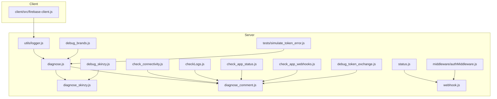
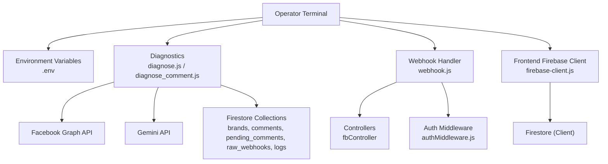
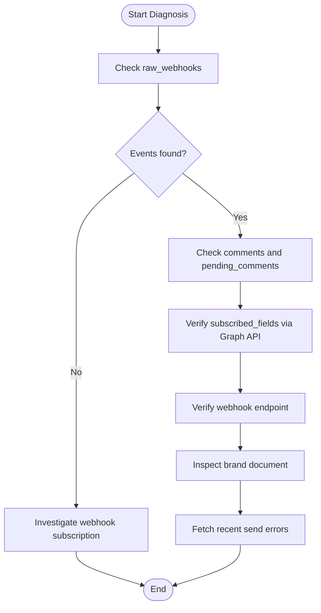
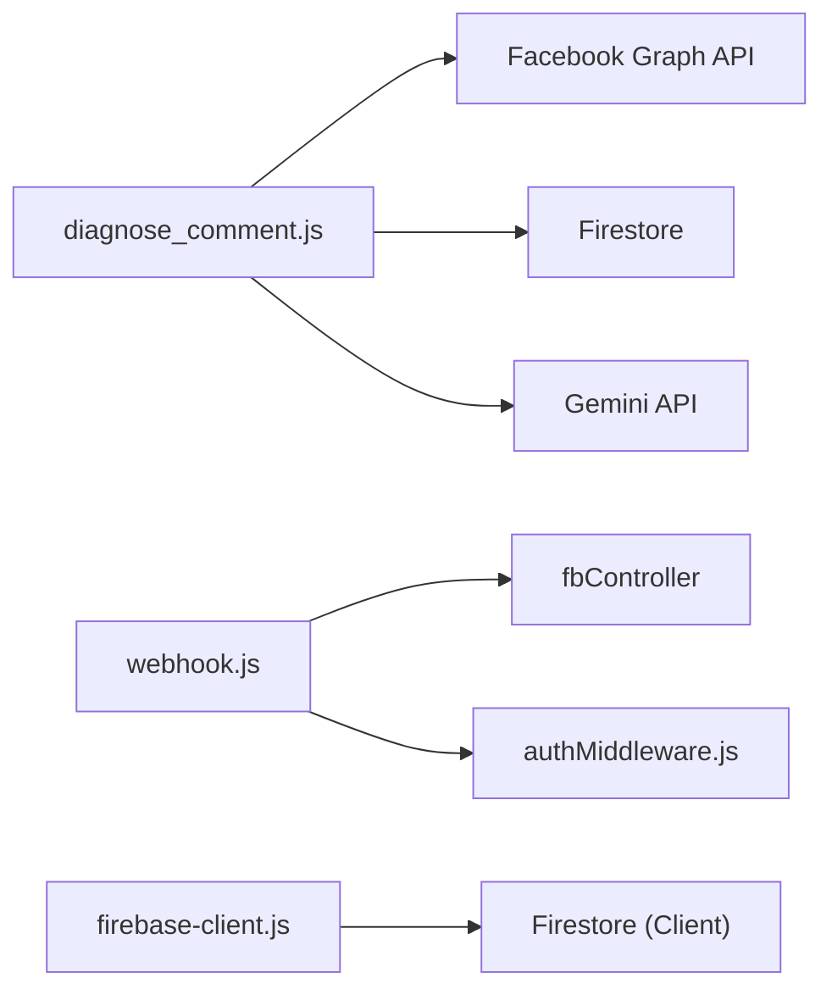

# Troubleshooting and FAQ

<cite>
**Referenced Files in This Document**
- [logger.js](file://server/utils/logger.js)
- [diagnose.js](file://server/diagnose.js)
- [diagnose_skinzy.js](file://server/diagnose_skinzy.js)
- [diagnose_comment.js](file://server/diagnose_comment.js)
- [check_connectivity.js](file://server/check_connectivity.js)
- [checkLogs.js](file://server/checkLogs.js)
- [status.js](file://server/status.js)
- [webhook.js](file://server/webhook.js)
- [authMiddleware.js](file://server/middleware/authMiddleware.js)
- [firebase-client.js](file://client/src/firebase-client.js)
- [check_app_status.js](file://server/check_app_status.js)
- [check_app_webhooks.js](file://server/check_app_webhooks.js)
- [debug_brands.js](file://server/debug_brands.js)
- [debug_skinzy.js](file://server/debug_skinzy.js)
- [debug_token_exchange.js](file://server/debug_token_exchange.js)
- [simulate_token_error.js](file://tests/simulate_token_error.js)
</cite>

## Table of Contents
1. [Introduction](#introduction)
2. [Project Structure](#project-structure)
3. [Core Components](#core-components)
4. [Architecture Overview](#architecture-overview)
5. [Detailed Component Analysis](#detailed-component-analysis)
6. [Dependency Analysis](#dependency-analysis)
7. [Performance Considerations](#performance-considerations)
8. [Troubleshooting Guide](#troubleshooting-guide)
9. [Conclusion](#conclusion)
10. [Appendices](#appendices)

## Introduction
This document provides a comprehensive troubleshooting guide for diagnosing and resolving common issues in the MetaSolution application. It focuses on connectivity checks, authentication and authorization failures, integration problems with Facebook and Gemini APIs, Firebase configuration, and operational diagnostics. It also outlines logging mechanisms, debugging tools, and step-by-step procedures for typical scenarios, including platform-specific pitfalls, performance bottlenecks, and configuration errors.

## Project Structure
The repository is organized into:
- server: Backend services, controllers, middleware, utilities, and diagnostic scripts
- client: Frontend application integrating Firebase
- api: Entry point for API routes
- tests: Test utilities and simulations

**Diagram sources**
- [logger.js:1-10](file://server/utils/logger.js#L1-L10)
- [diagnose.js:1-64](file://server/diagnose.js#L1-L64)
- [diagnose_skinzy.js:1-31](file://server/diagnose_skinzy.js#L1-L31)
- [diagnose_comment.js:1-185](file://server/diagnose_comment.js#L1-L185)
- [check_connectivity.js:1-28](file://server/check_connectivity.js#L1-L28)
- [checkLogs.js:1-38](file://server/checkLogs.js#L1-L38)
- [status.js:1-4](file://server/status.js#L1-L4)
- [webhook.js:1-22](file://server/webhook.js#L1-L22)
- [authMiddleware.js:1-26](file://server/middleware/authMiddleware.js#L1-L26)
- [check_app_status.js:1-36](file://server/check_app_status.js#L1-L36)
- [check_app_webhooks.js:1-40](file://server/check_app_webhooks.js#L1-L40)
- [debug_brands.js:1-22](file://server/debug_brands.js#L1-L22)
- [debug_skinzy.js:1-28](file://server/debug_skinzy.js#L1-L28)
- [debug_token_exchange.js:1-45](file://server/debug_token_exchange.js#L1-L45)
- [simulate_token_error.js:1-72](file://tests/simulate_token_error.js#L1-L72)
- [firebase-client.js:1-26](file://client/src/firebase-client.js#L1-L26)

**Section sources**
- [logger.js:1-10](file://server/utils/logger.js#L1-L10)
- [diagnose.js:1-64](file://server/diagnose.js#L1-L64)
- [diagnose_comment.js:1-185](file://server/diagnose_comment.js#L1-L185)
- [check_connectivity.js:1-28](file://server/check_connectivity.js#L1-L28)
- [checkLogs.js:1-38](file://server/checkLogs.js#L1-L38)
- [status.js:1-4](file://server/status.js#L1-L4)
- [webhook.js:1-22](file://server/webhook.js#L1-L22)
- [authMiddleware.js:1-26](file://server/middleware/authMiddleware.js#L1-L26)
- [check_app_status.js:1-36](file://server/check_app_status.js#L1-L36)
- [check_app_webhooks.js:1-40](file://server/check_app_webhooks.js#L1-L40)
- [debug_brands.js:1-22](file://server/debug_brands.js#L1-L22)
- [debug_skinzy.js:1-28](file://server/debug_skinzy.js#L1-L28)
- [debug_token_exchange.js:1-45](file://server/debug_token_exchange.js#L1-L45)
- [simulate_token_error.js:1-72](file://tests/simulate_token_error.js#L1-L72)
- [firebase-client.js:1-26](file://client/src/firebase-client.js#L1-L26)

## Core Components
- Logging utility: Provides a simple server-side logging wrapper for consistent timestamps and console output.
- Diagnostics suite: Environment checks, connectivity tests, brand and comment automation diagnostics, and app/webhook health checks.
- Authentication middleware: Role-based access control enforcement with warnings and standardized responses.
- Frontend Firebase client: Initializes Firestore and optional Storage with graceful error handling for disabled services.

Key capabilities:
- Environment variable verification and Firebase initialization checks
- External API reachability tests for Facebook Graph and Gemini
- Firestore query validation and recent document inspection
- Webhook verification and subscription diagnostics
- Token validation and subscription correction flows
- Error simulation and token expiration handling

**Section sources**
- [logger.js:1-10](file://server/utils/logger.js#L1-L10)
- [diagnose.js:1-64](file://server/diagnose.js#L1-L64)
- [diagnose_comment.js:1-185](file://server/diagnose_comment.js#L1-L185)
- [check_connectivity.js:1-28](file://server/check_connectivity.js#L1-L28)
- [checkLogs.js:1-38](file://server/checkLogs.js#L1-L38)
- [authMiddleware.js:1-26](file://server/middleware/authMiddleware.js#L1-L26)
- [firebase-client.js:1-26](file://client/src/firebase-client.js#L1-L26)

## Architecture Overview
The troubleshooting architecture centers around diagnostic scripts that probe environment variables, external APIs, and Firestore collections. These scripts coordinate with the frontend Firebase client and backend webhook handler to isolate issues across the stack.

**Diagram sources**
- [diagnose.js:1-64](file://server/diagnose.js#L1-L64)
- [diagnose_comment.js:1-185](file://server/diagnose_comment.js#L1-L185)
- [check_connectivity.js:1-28](file://server/check_connectivity.js#L1-L28)
- [webhook.js:1-22](file://server/webhook.js#L1-L22)
- [authMiddleware.js:1-26](file://server/middleware/authMiddleware.js#L1-L26)
- [firebase-client.js:1-26](file://client/src/firebase-client.js#L1-L26)

## Detailed Component Analysis

### Logging Utility
- Purpose: Centralized server-side logging with ISO timestamp formatting.
- Usage: Standardized console output for diagnostics and runtime logs.
- Best practice: Use consistently across scripts and services for traceability.

**Section sources**
- [logger.js:1-10](file://server/utils/logger.js#L1-L10)

### Diagnostics Suite
- Environment checks: Validates presence of required environment variables and prints Firebase service account details.
- Firebase initialization: Attempts to initialize Firebase Admin SDK and reports success or failure.
- Firestore brand lookup: Queries brands by Facebook page ID and falls back to a hardcoded brand if not found.
- Connectivity checks: Verifies reachability to Facebook Graph API and Gemini API endpoints.
- Logs verification: Executes a Firestore query similar to production to surface potential query errors.

**Section sources**
- [diagnose.js:1-64](file://server/diagnose.js#L1-L64)
- [check_connectivity.js:1-28](file://server/check_connectivity.js#L1-L28)
- [checkLogs.js:1-38](file://server/checkLogs.js#L1-L38)

### Comment Automation Diagnosis
- Webhook ingestion: Inspects recent raw webhooks in Firestore to confirm inbound events.
- Processing pipeline: Reviews recent comments and pending comments to identify bottlenecks.
- Subscription verification: Checks Facebook Graph API for subscribed fields and app subscriptions.
- Endpoint verification: Tests the webhook verify endpoint against the deployed URL.
- Brand configuration: Reads brand document for comment settings and AI configurations.
- Error logs: Retrieves recent send errors for actionable insights.

**Diagram sources**
- [diagnose_comment.js:18-182](file://server/diagnose_comment.js#L18-L182)

**Section sources**
- [diagnose_comment.js:1-185](file://server/diagnose_comment.js#L1-L185)

### App and Webhook Health Checks
- App status: Retrieves app metadata and roles to validate testing permissions.
- Webhook subscriptions: Lists configured subscriptions on the app, including callback URLs and fields.

**Section sources**
- [check_app_status.js:1-36](file://server/check_app_status.js#L1-L36)
- [check_app_webhooks.js:1-40](file://server/check_app_webhooks.js#L1-L40)

### Token Validation and Subscription Correction
- Token inspection: Confirms whether the token belongs to the expected page and extracts a full page token if available.
- Retry subscription: Attempts to subscribe fields using the validated token.

**Section sources**
- [debug_token_exchange.js:1-45](file://server/debug_token_exchange.js#L1-L45)

### Brand and Configuration Debugging
- Brand listing: Enumerates brands and associated Facebook identifiers.
- Brand-specific checks: Reads AI keys and settings for a given brand.

**Section sources**
- [debug_brands.js:1-22](file://server/debug_brands.js#L1-L22)
- [debug_skinzy.js:1-28](file://server/debug_skinzy.js#L1-L28)

### Authentication and Authorization
- Role enforcement: Middleware validates allowed roles and logs access denials with warnings.
- Frontend client: Initializes Firestore and handles optional Storage initialization with explicit error messaging.

**Section sources**
- [authMiddleware.js:1-26](file://server/middleware/authMiddleware.js#L1-L26)
- [firebase-client.js:1-26](file://client/src/firebase-client.js#L1-L26)

### Webhook Endpoint
- Route handling: Supports GET and POST for webhook verification and payload handling, with method-not-allowed responses for other methods.

**Section sources**
- [webhook.js:1-22](file://server/webhook.js#L1-L22)

### Status Endpoint
- Health check: Returns a simple JSON status with timestamp for basic API availability verification.

**Section sources**
- [status.js:1-4](file://server/status.js#L1-L4)

### Error Simulation and Token Expiration Handling
- Simulation: Constructs an error object resembling Facebook API errors and triggers token expiration handling logic.
- Outcome: Updates brand document with token status and timestamps for observability.

**Section sources**
- [simulate_token_error.js:1-72](file://tests/simulate_token_error.js#L1-L72)

## Dependency Analysis
The diagnostic scripts depend on:
- Environment variables (.env) for credentials and tokens
- External APIs (Facebook Graph, Gemini)
- Firestore collections for state and logs
- Express-based webhook handler for endpoint verification

**Diagram sources**
- [diagnose_comment.js:1-185](file://server/diagnose_comment.js#L1-L185)
- [webhook.js:1-22](file://server/webhook.js#L1-L22)
- [authMiddleware.js:1-26](file://server/middleware/authMiddleware.js#L1-L26)
- [firebase-client.js:1-26](file://client/src/firebase-client.js#L1-L26)

**Section sources**
- [diagnose_comment.js:1-185](file://server/diagnose_comment.js#L1-L185)
- [webhook.js:1-22](file://server/webhook.js#L1-L22)
- [authMiddleware.js:1-26](file://server/middleware/authMiddleware.js#L1-L26)
- [firebase-client.js:1-26](file://client/src/firebase-client.js#L1-L26)

## Performance Considerations
- Minimize repeated external API calls: Cache tokens and subscription statuses where appropriate.
- Limit Firestore queries: Use pagination and targeted filters to reduce load.
- Asynchronous operations: Ensure diagnostics run asynchronously to avoid blocking the event loop.
- Logging overhead: Prefer structured logging and avoid excessive console output in production.

[No sources needed since this section provides general guidance]

## Troubleshooting Guide

### Connectivity Problems
Symptoms:
- External API requests fail or timeout
- Facebook Graph API or Gemini API unreachable

Steps:
1. Run connectivity check script to validate reachability to Facebook Graph and Gemini APIs.
2. Verify environment variables for tokens and keys.
3. Confirm network access and firewall rules for outbound HTTPS traffic.
4. Check rate limits and quotas for external APIs.

References:
- [check_connectivity.js:1-28](file://server/check_connectivity.js#L1-L28)
- [diagnose.js:10-14](file://server/diagnose.js#L10-L14)

**Section sources**
- [check_connectivity.js:1-28](file://server/check_connectivity.js#L1-L28)
- [diagnose.js:10-14](file://server/diagnose.js#L10-L14)

### Authentication Failures
Symptoms:
- Access denied responses for protected routes
- Role-based restrictions triggered unexpectedly

Steps:
1. Review auth middleware logs for access denial warnings.
2. Verify the presence of the role header or fallback behavior.
3. Confirm custom claims or user roles stored in Firestore if applicable.
4. Validate JWT or session tokens passed by clients.

References:
- [authMiddleware.js:17-18](file://server/middleware/authMiddleware.js#L17-L18)

**Section sources**
- [authMiddleware.js:17-18](file://server/middleware/authMiddleware.js#L17-L18)

### Integration Issues with Facebook Webhooks
Symptoms:
- No incoming webhook events recorded
- Replies not being sent to comments
- Subscription errors or missing permissions

Steps:
1. Use the comment automation diagnosis to inspect recent webhooks, processed comments, and pending comments.
2. Verify Facebook Graph API subscription fields and app subscriptions.
3. Test the webhook verify endpoint against the deployed URL.
4. Validate brand document for comment settings and AI configurations.
5. Retrieve recent send errors from logs for actionable insights.

References:
- [diagnose_comment.js:21-176](file://server/diagnose_comment.js#L21-L176)
- [check_app_webhooks.js:12-36](file://server/check_app_webhooks.js#L12-L36)
- [webhook.js:11-19](file://server/webhook.js#L11-L19)

**Section sources**
- [diagnose_comment.js:21-176](file://server/diagnose_comment.js#L21-L176)
- [check_app_webhooks.js:12-36](file://server/check_app_webhooks.js#L12-L36)
- [webhook.js:11-19](file://server/webhook.js#L11-L19)

### Token Validation and Subscription Correction
Symptoms:
- Token invalid or expired errors
- Subscription not applied to the page

Steps:
1. Validate the current token against the expected page using the token debug script.
2. Extract a full page token if available and retry subscription with required fields.
3. Monitor subscription status via Graph API endpoints.

References:
- [debug_token_exchange.js:10-37](file://server/debug_token_exchange.js#L10-L37)

**Section sources**
- [debug_token_exchange.js:10-37](file://server/debug_token_exchange.js#L10-L37)

### Brand and Configuration Issues
Symptoms:
- Incorrect brand settings or missing keys
- AI replies not functioning

Steps:
1. List brands and inspect brand documents for required fields.
2. Verify AI keys and settings for the target brand.
3. Confirm inbox and comment settings are properly configured.

References:
- [debug_brands.js:14-18](file://server/debug_brands.js#L14-L18)
- [debug_skinzy.js:14-21](file://server/debug_skinzy.js#L14-L21)

**Section sources**
- [debug_brands.js:14-18](file://server/debug_brands.js#L14-L18)
- [debug_skinzy.js:14-21](file://server/debug_skinzy.js#L14-L21)

### Frontend Firebase Initialization Problems
Symptoms:
- Storage fails to initialize
- Firestore connection issues

Steps:
1. Confirm Firebase configuration constants match the project settings.
2. Check for disabled services in the Firebase Console.
3. Validate client-side initialization and error logs.

References:
- [firebase-client.js:5-24](file://client/src/firebase-client.js#L5-L24)

**Section sources**
- [firebase-client.js:5-24](file://client/src/firebase-client.js#L5-L24)

### Platform-Specific Problems
- Vercel routing: Ensure rewrite rules forward webhook requests to the correct handler.
- Environment variables: Confirm .env values are loaded and accessible to scripts.
- SSL/TLS: Verify certificates and HTTPS endpoints for external API calls.

[No sources needed since this section provides general guidance]

### Performance Bottlenecks
- Reduce unnecessary Firestore reads/writes by batching and caching.
- Optimize webhook processing to avoid blocking operations.
- Monitor external API latency and implement retries with backoff.

[No sources needed since this section provides general guidance]

### Configuration Errors
- Missing environment variables: Use the environment check script to validate required keys.
- Incorrect Firebase credentials: Verify service account file and initialization logic.
- Misconfigured subscriptions: Cross-check fields and callback URLs via Graph API.

References:
- [diagnose.js:11-27](file://server/diagnose.js#L11-L27)

**Section sources**
- [diagnose.js:11-27](file://server/diagnose.js#L11-L27)

### Step-by-Step Troubleshooting Scenarios

#### Scenario 1: Webhooks Not Arriving
1. Run comment automation diagnosis to check recent webhooks.
2. Verify app subscriptions and subscribed fields.
3. Test webhook verify endpoint.
4. Inspect brand settings and recent send errors.

References:
- [diagnose_comment.js:21-142](file://server/diagnose_comment.js#L21-L142)
- [check_app_webhooks.js:12-36](file://server/check_app_webhooks.js#L12-L36)
- [webhook.js:11-19](file://server/webhook.js#L11-L19)

**Section sources**
- [diagnose_comment.js:21-142](file://server/diagnose_comment.js#L21-L142)
- [check_app_webhooks.js:12-36](file://server/check_app_webhooks.js#L12-L36)
- [webhook.js:11-19](file://server/webhook.js#L11-L19)

#### Scenario 2: Token Expired or Invalid
1. Validate token ownership and extract a full page token if needed.
2. Retry subscription with the corrected token.
3. Simulate error handling to confirm brand status updates.

References:
- [debug_token_exchange.js:10-37](file://server/debug_token_exchange.js#L10-L37)
- [simulate_token_error.js:40-58](file://tests/simulate_token_error.js#L40-L58)

**Section sources**
- [debug_token_exchange.js:10-37](file://server/debug_token_exchange.js#L10-L37)
- [simulate_token_error.js:40-58](file://tests/simulate_token_error.js#L40-L58)

#### Scenario 3: External API Unreachable
1. Run connectivity check to test Facebook Graph and Gemini endpoints.
2. Verify environment variables and network access.
3. Check rate limits and quotas.

References:
- [check_connectivity.js:4-24](file://server/check_connectivity.js#L4-L24)

**Section sources**
- [check_connectivity.js:4-24](file://server/check_connectivity.js#L4-L24)

#### Scenario 4: Access Denied on Protected Routes
1. Review auth middleware logs for access denial warnings.
2. Confirm role header and allowed roles.
3. Validate user roles in Firestore if applicable.

References:
- [authMiddleware.js:17-18](file://server/middleware/authMiddleware.js#L17-L18)

**Section sources**
- [authMiddleware.js:17-18](file://server/middleware/authMiddleware.js#L17-L18)

### Error Code References
Common Facebook Graph API error codes observed during diagnostics:
- 190: Error validating access token (session expired or invalid)
- 200: Permission issue (e.g., missing pages_manage_metadata)

Actions:
- For 190: Refresh or re-exchange the token and retry subscription.
- For 200: Add required permissions in the Facebook Developer Console.

References:
- [diagnose_comment.js:114-120](file://server/diagnose_comment.js#L114-L120)
- [check_app_webhooks.js:33-35](file://server/check_app_webhooks.js#L33-L35)

**Section sources**
- [diagnose_comment.js:114-120](file://server/diagnose_comment.js#L114-L120)
- [check_app_webhooks.js:33-35](file://server/check_app_webhooks.js#L33-L35)

### Escalation Procedures
- Capture logs: Use the logging utility and Firestore logs to gather evidence.
- Isolate components: Run environment checks, connectivity tests, and webhook verification independently.
- Validate configurations: Cross-reference environment variables, Firebase credentials, and external API settings.
- Engage platform support: Provide error codes, timestamps, and diagnostic outputs when escalating.

[No sources needed since this section provides general guidance]

## Conclusion
This guide consolidates practical, step-by-step procedures to troubleshoot connectivity, authentication, integration, and configuration issues across the MetaSolution stack. By leveraging the provided diagnostic scripts, logging mechanisms, and middleware safeguards, teams can quickly isolate root causes, apply corrective actions, and prevent recurring problems.

[No sources needed since this section summarizes without analyzing specific files]

## Appendices

### Quick Reference: Diagnostic Commands
- Environment and Firebase checks: [diagnose.js:1-64](file://server/diagnose.js#L1-L64)
- Connectivity to external APIs: [check_connectivity.js:1-28](file://server/check_connectivity.js#L1-L28)
- Comment automation pipeline: [diagnose_comment.js:1-185](file://server/diagnose_comment.js#L1-L185)
- App and webhook health: [check_app_status.js:1-36](file://server/check_app_status.js#L1-L36), [check_app_webhooks.js:1-40](file://server/check_app_webhooks.js#L1-L40)
- Token validation and subscription: [debug_token_exchange.js:1-45](file://server/debug_token_exchange.js#L1-L45)
- Brand configuration: [debug_brands.js:1-22](file://server/debug_brands.js#L1-L22), [debug_skinzy.js:1-28](file://server/debug_skinzy.js#L1-L28)
- Webhook endpoint: [webhook.js:1-22](file://server/webhook.js#L1-L22)
- Authentication middleware: [authMiddleware.js:1-26](file://server/middleware/authMiddleware.js#L1-L26)
- Frontend Firebase client: [firebase-client.js:1-26](file://client/src/firebase-client.js#L1-L26)

[No sources needed since this section lists references without analysis]